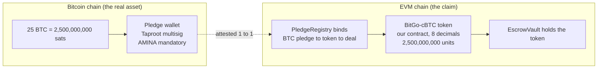
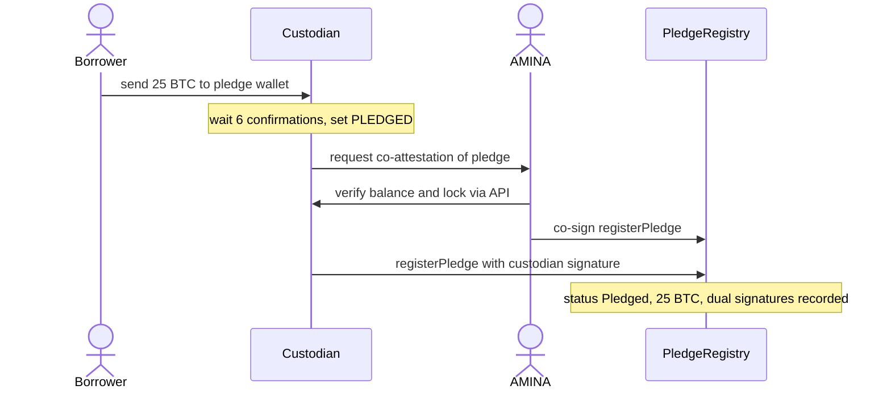
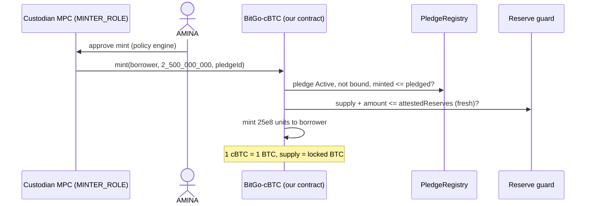
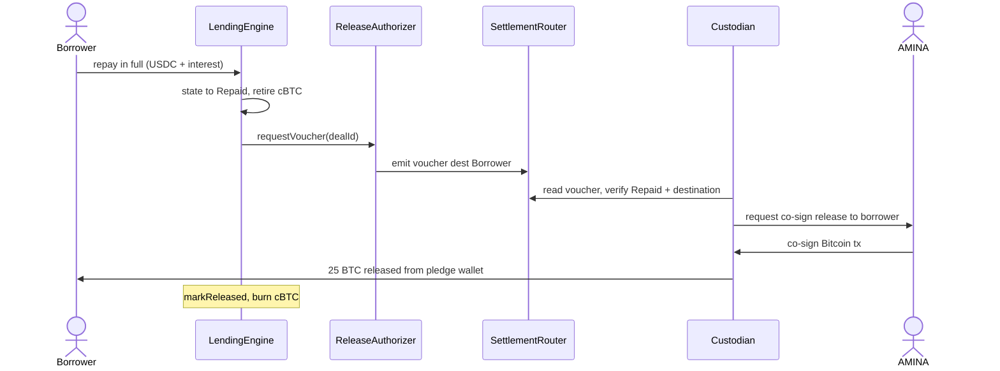
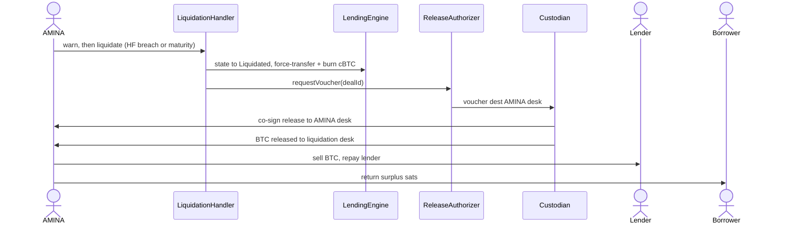

# P2PxAmina — How BTC Tokenization Actually Works

**Version**: v1.0 (concrete, end-to-end)
**Scope**: the exact mechanics of turning a borrower's real BTC into usable on-chain collateral and back again — what happens on the Bitcoin chain, what happens on the EVM chain, who signs what, and in what order. BTC only (ETH/RWA covered elsewhere).
**Decision baseline** (from the architecture review): we deploy **our own unified collateral-token contract**; the custodian provides **custody, the minter signature, and reserve attestation** — not a native token product. The minter role is held by the custodian's MPC key, and each mint additionally requires an **AMINA co-attestation** and passes an on-chain **reserve guard**.

---

## 0. The mental model in one line

Real BTC is locked in a custodian vault that **needs AMINA to move it**; we mint exactly that many units of **our** token, 1 token = 1 BTC; the token lives only inside our protocol; the BTC is unlocked only when the loan is repaid (→ borrower) or liquidated (→ AMINA), and AMINA co-signs that movement.

There are always **two domains** and they are kept in lockstep:

Token supply on the EVM side can **never exceed** the BTC locked on the Bitcoin side — that is enforced mechanically at every mint (§5).

---

## 1. The pieces involved

| Piece | Where | What it is |
|---|---|---|
| **Pledge wallet** | Bitcoin | A per-deal Taproot multisig address holding the borrower's BTC. Spending requires a quorum that **always includes AMINA** (e.g. 2-of-3: borrower, custodian, AMINA; or 3-of-5 with independent signers). |
| **`BitGo-cBTC`** (token) | EVM | **Our** unified `PermissionedCollateralToken` (CMTAT/T-REX configured by us), one per `(custodian, BTC)`. **8 decimals**, so 1 token unit = 1 satoshi and 1.0 token = 1 BTC. Can only move to/from `EscrowVault` and `LiquidationHandler`. |
| **Minter key** | custodian MPC | The custodian's MPC/HSM key that holds `MINTER_ROLE` on `BitGo-cBTC`. It signs `mint`, gated by the custodian policy engine + AMINA approval. |
| **`PledgeRegistry`** | EVM | Binds `pledgeId ↔ pledge wallet ↔ sats ↔ token ↔ dealId`; records the dual attestation; backs the reserve guard. |
| **Reserve feed** | oracle | Signed attestation (and Chainlink PoR where available) of total BTC held in pledge wallets for this token. |
| **`ReleaseAuthorizer`** | EVM | Produces the **release voucher** (destination derived from loan status) that the custodian honors to move BTC. |
| **AMINA** | both | Co-signs the pledge attestation, the mint approval, and every BTC movement. The only party that can liquidate. |

---

## 2. Step 1 — Borrower deposits BTC and it gets locked

1. The platform (under AMINA's brokerage) generates a **per-deal pledge wallet** on Bitcoin — a Taproot address whose spending policy is the AMINA-mandatory multisig. The borrower, the custodian, and AMINA each contribute a key; release needs the quorum that always includes AMINA.
2. The borrower sends their BTC (say **25 BTC**) to that pledge address.
3. The system waits for **6 confirmations (~60 minutes)** to be safe against reorgs before treating the deposit as final.
4. The custodian flags the balance **`PLEDGED`** in its platform — meaning its policy engine will refuse any withdrawal of that balance unless it is accompanied by a valid protocol release voucher (§7).

What an observer sees on Bitcoin: a normal-looking Taproot UTXO of 25 BTC at the pledge address. The multisig structure is invisible on-chain (Taproot key-aggregation) — only the participants know it's a pledge.

---

## 3. Step 2 — The pledge is attested on-chain

Before any token exists, the pledge is recorded with **two independent signatures**:

1. The custodian signs an attestation: `{pledgeId, pledgeAddress, amount = 2,500,000,000 sats, lockActive = true, asOf = <timestamp>}`.
2. **AMINA independently verifies** the balance and the lock directly via the custodian's API (AMINA has custody access), then co-signs.
3. The platform calls `PledgeRegistry.registerPledge(pledgeId, custodian, adapter, pledgeAddress, asset="BTC", amount=2_500_000_000, token=BitGo-cBTC, attestationHash)` carrying both signatures.

The pledge is now `Pledged` on-chain. No token has been minted yet. The dual attestation is the on-chain proof that real, locked BTC exists.

---

## 4. Step 3 — Mint our token, 1 token = 1 BTC

Now the on-chain claim is created against the confirmed pledge:

1. The custodian's MPC key (holding `MINTER_ROLE`) signs `BitGo-cBTC.mint(borrower, 2_500_000_000, pledgeId)`. The mint goes through the custodian's **policy engine**, which requires an **AMINA approval** before releasing the signature.
2. The `mint` function performs three on-chain checks before creating any tokens:
   - `PledgeRegistry` confirms the pledge is `Active` and **not already bound to another deal**, and that `mintedAmount + amount ≤ pledgedAmount` (here mint 25e8 against 25e8 pledged — exactly 1:1).
   - The **reserve guard** requires `token.totalSupply() + amount ≤ attestedReserves` (with a freshness check) — so the system mechanically cannot mint more cBTC than there is locked BTC, even if the minter key were compromised.
   - The token's allowlist/identity rules pass (borrower is KYB'd).
3. `2,500,000,000` units of `BitGo-cBTC` are minted to the borrower's EVM address. **1.0 cBTC now equals 1 BTC**, and total cBTC supply equals total pledged BTC.

**Why this is our token, not BitGo's:** the contract logic — the allowlist, the pledge binding, the reserve guard, the voucher-gated burn — is **ours**, identical across all custodians, audited once. BitGo (or Fireblocks/Fordefi) only contributes the *signature* that authorizes the mint. The deploy can ride the custodian's rail, but the rules are ours.

---

## 5. Step 4 — Post as collateral and borrow

1. The borrower (or AMINA's allocator) calls `LendingEngine.openAndActivate(...)` — atomically: the cBTC moves into `EscrowVault`, the pledge is bound to the deal (`PledgeRegistry.bindToDeal`), and the borrower receives USDC from the matched lender.
2. The cBTC is now locked in `EscrowVault` — the borrower cannot withdraw it; only the engine moves it.

**Worked example (illustrative):** BTC at **$98,400**.
- Collateral: 25 cBTC → value `25 × 98,400 = $2,460,000`.
- LTV cap 85% → max borrow `$2,091,000`; borrower draws **$2,000,000 USDC**.
- Current LTV `2,000,000 / 2,460,000 = 81.3%`.
- Liquidation thresholds: **warning 90%**, **partial 93%**, **full 95%** (or maturity).
- BTC price that triggers a warning: `2,000,000 / (25 × P) = 0.90 → P ≈ $88,900`.
- BTC price at full liquidation: `2,000,000 / (25 × P) = 0.95 → P ≈ $84,200`.

The borrower's BTC value used for these checks is `min(market price × 25, attested reserve value)` — coverage is never computed against more BTC than is provably locked.

---

## 6. Step 5 — Repayment (BTC goes back to the borrower)

1. Borrower repays the USDC + interest. `LendingEngine` sets the loan to **`Repaid`** and retires the cBTC from `EscrowVault`.
2. `ReleaseAuthorizer` produces a **release voucher** whose destination is **fixed to the borrower** because the state is `Repaid`. `SettlementRouter` emits it: `{dealId, pledgeId, asset=BTC, amount=2,500,000,000 sats, destinationType=Borrower, destinationRef=<borrower BTC address>, reason=REPAID, sequenceNumber, issuedAt}`.
3. The custodian's listener reads the voucher, verifies the on-chain state is `Repaid`, and the destination matches the borrower's BTC address.
4. **AMINA co-signs** the Bitcoin transaction releasing 25 BTC from the pledge wallet to the borrower — but only because the voucher says so. AMINA cannot block a repaid borrower (the voucher is automatic) and cannot redirect it (the destination is fixed).
5. Once the BTC release confirms, the custodian acknowledges; `PledgeRegistry.markReleased(pledgeId)`; the cBTC is burned. Supply and locked BTC are both back to zero for this deal.

---

## 7. Step 6 — Default and liquidation (BTC goes to AMINA, only AMINA can do it)

1. If BTC falls and the loan crosses the warning threshold, AMINA's bot calls `warn` — the borrower gets **48 hours** to add collateral (top-up posts more cBTC against more pledged BTC, or AMINA accepts a top-up directly to the pledge wallet, re-attested).
2. If unhealthy after grace (or at maturity with debt outstanding), **only AMINA** (the `LIQUIDATOR` role, only when health/maturity conditions are actually met) drives the loan to **`Liquidated`**.
3. `ReleaseAuthorizer` produces a voucher with destination **= AMINA's liquidation desk** (because the state is `Liquidated`). On-chain, AMINA force-transfers the cBTC to the liquidation address (the one place this power is used) and burns it against the voucher.
4. The custodian's listener + **AMINA co-sign** a Bitcoin transaction releasing the BTC from the pledge wallet to AMINA's liquidation address.
5. AMINA sells the BTC (on its regulated desk), repays the lender, takes its fee/bonus, and **returns any surplus BTC/sats to the borrower** — the borrower keeps whatever is left after debt + bonus + fee.

**The destination is decided by loan status, not by AMINA.** AMINA can only *reach* the `Liquidated` state when the rules allow it, and only then can it produce a "to AMINA" voucher. A healthy loan cannot be liquidated.

---

## 8. Keeping the two sides in lockstep (proof of reserves)

- The custodian publishes a signed attestation of total BTC in pledge wallets for this token on a heartbeat; where supported (BitGo, Fireblocks), a **Chainlink Proof-of-Reserve** feed over the custody addresses is wired as a second, independent source.
- The **reserve guard** at mint enforces `cBTC supply ≤ attested BTC reserves` with a staleness check — the mechanical circuit-breaker against minting unbacked tokens.
- Monitoring: if the attestation goes stale, new mints/deals on this token freeze and AMINA is paged; if the pledge lock is ever lifted at the custodian (AMINA dropped from the quorum, or balance un-flagged), the deal is frozen and flagged for liquidation.

**What proof-of-reserves does and does not prove:** it proves the BTC *exists*. It does **not** prove exclusive control — that is provided separately by the AMINA-mandatory multisig on the pledge wallet. The two are different guarantees and both are required.

---

## 9. The edge cases (how each is handled)

| Situation | What happens |
|---|---|
| **Borrower deposits the wrong amount** | The pledge is attested for the *actual* confirmed sats; the token is minted for exactly that amount. An under-deposit means a smaller loan; the matching engine reconciles before activation. |
| **Bitcoin reorg before mint** | We wait 6 confirmations before attesting/minting, so a deposit isn't tokenized until it's settled. If a reorg occurs pre-attestation, nothing was minted. |
| **Release transaction stuck on Bitcoin** | The custodian uses RBF/CPFP to bump fees; the on-chain loan state is already terminal, so the BTC will land at the voucher-mandated destination once it confirms. |
| **Custodian freezes the pledge wallet mid-deal** (e.g. compliance hold) | The borrower's repayment still settles the USDC; the loan moves to `Repaid_PendingCollateralRelease`; once the freeze lifts the borrower calls `claimUnreleasedCollateral` and the BTC is released. The borrower's claim is preserved on-chain throughout. |
| **Oracle stale during a liquidation** | New deals are blocked, but liquidation can proceed using an **AMINA-signed price attestation** (source, observed price, timestamp, reason) emitted as evidence — AMINA stakes its name on the price it used. |
| **Engine bug discovered** | EMERGENCY halts the engine and it is upgraded; `EscrowVault`, `DealRegistry`, and `PledgeRegistry` records survive (the deal state and pledge bindings are preserved); the BTC sits safely locked in the pledge wallet throughout. |
| **Top-up during a warning** | Borrower sends more BTC to the pledge wallet → re-attested → additional cBTC minted and posted → health restored, loan returns to `Active`. |

---

## 10. Timing, realistically

| Action | Typical time | Why |
|---|---|---|
| BTC deposit → finalized | ~60 min | 6 Bitcoin confirmations against reorgs |
| Pledge attestation + mint | minutes | AMINA verify + dual sign + EVM tx |
| Open + activate loan | one EVM block | atomic |
| Repay → BTC back to borrower | minutes to ~1 hr | voucher + AMINA co-sign + Bitcoin confirmations |
| Liquidation → BTC to AMINA | minutes to ~1 hr + desk execution | same custody path + market sale |

The latency floor is Bitcoin's ~10-minute block time on the deposit and release legs; the EVM side is near-instant.

---

## 11. What's "ours" vs "the custodian's", precisely

| Layer | Owner | Note |
|---|---|---|
| The collateral-token contract & all its rules | **Us** | unified across custodians; built on CMTAT/T-REX, configured by us, audited once |
| The minter signature | **Custodian MPC** | holds `MINTER_ROLE`; gated by custodian policy + AMINA approval |
| The pledge wallet & the BTC lock | **Custodian + AMINA** | AMINA-mandatory multisig; the borrower can't move it |
| The release co-signature | **Custodian + AMINA** | against a state-bound voucher |
| Reserve attestation / PoR | **Custodian** | feeds our reserve guard |
| The "where can the BTC go" decision | **On-chain loan state** | not any human's discretion |

---

## 12. One paragraph for the deck

A borrower's BTC goes into a per-deal Bitcoin vault that can only be moved with AMINA's signature. Once it's confirmed locked, we mint exactly that many units of our own collateral token — one token per BTC — and the system mechanically refuses to ever mint more tokens than there is locked BTC. The token can only move inside our platform, so it's worthless to a thief. When the loan is repaid, the BTC is released back to the borrower automatically; if the borrower defaults, only AMINA can release it — to AMINA's desk, to sell and repay the lender, returning any leftover to the borrower. Two domains, kept in perfect lockstep, with the custodian and AMINA as the two keys and the loan's on-chain status as the rulebook for where the BTC is allowed to go.
