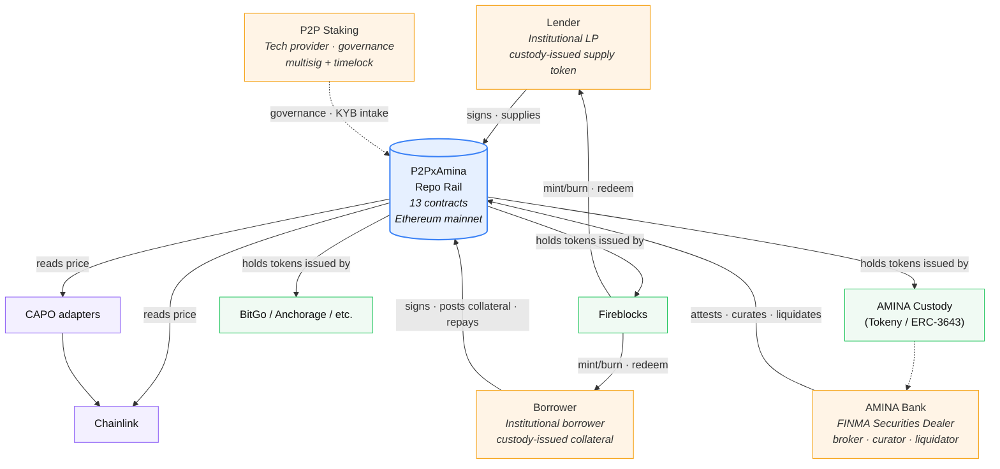
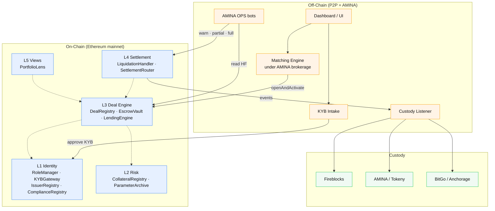
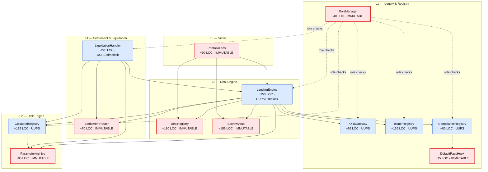
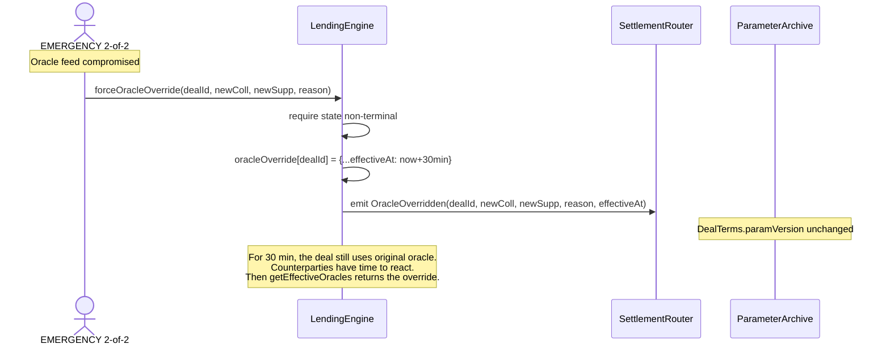
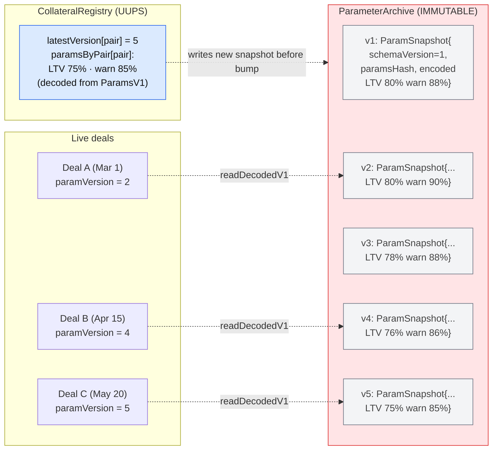
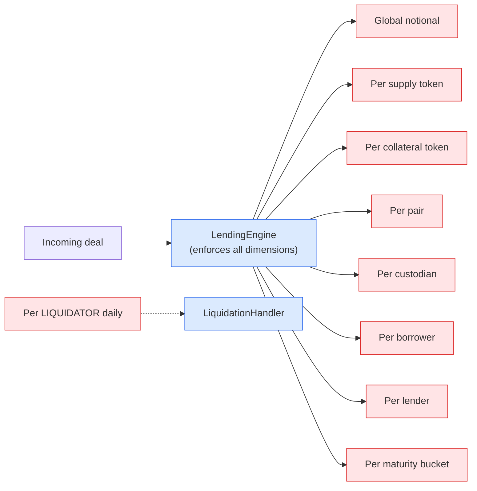
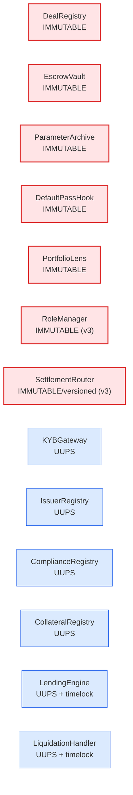

# P2PxAmina — Canonical Smart Contract Architecture v3

**Version**: v0.5 (Claude, 2026-05-26)
**Status**: design reference for engineering, audit, AMINA integration, and counsel review
**Supersedes**: `Claude-architechture-2.md`
**Cross-checked against**: `GPT-architechture-2.md` (same date)

v3 consolidates v2's additions (DualUse, IssuerStatus, dual-price attestation, emergencySealedMode, operational monitoring, risk allocation, deployment order, v2 extension paths) with GPT v2's ten implementation sharp-edge tightenings. The result is the final pre-implementation architecture.

---

## 0. Deltas from v2

GPT's v2 pass cross-checked Claude v1 (not v2) and proposed ten implementation refinements. v3 adopts all ten and keeps the v2 additions. The combined delta list:

| # | Delta | Source | Rationale |
|---|---|---|---|
| **From GPT v2 (new in v3)** | | | |
| D14 | `RoleManager` is **immutable**, not UUPS. Migration requires an explicit timelocked authority-migration ceremony. | GPT v2 §5 | The contract that controls upgrades should not itself be casually upgradeable. |
| D15 | `ParameterArchive` stores **schema-versioned encoded snapshots** (`{schemaVersion, paramsHash, encodedParams}`), not raw `Params` structs. | GPT v2 §5 | Historical reads must survive future `Params` schema growth. |
| D16 | Emergency oracle override is a **sidecar** mapping (`oracleOverride[dealId]`), not a mutation of `DealTerms.paramVersion` or the engine's `versionKey`. | GPT v2 §11.10, §15.1 | Preserves the immutable legal record while allowing emergency pricing recovery. |
| D17 | Vault reconciliation uses **`vaultBalance >= sum(ledger)`**, not `==`. Excess balance is "unattributed" and only sweepable via governed evented process. | GPT v2 §5, §21 | ERC-20 donations or token-side forced transfers can break exact equality. |
| D18 | Collateral release on full repay uses a **non-reverting `tryReleaseCollateral`** path. The vault decrements the ledger only after the ERC-20 transfer succeeds. | GPT v2 §5 | Otherwise a collateral-token freeze would revert the entire `repay` and trap the supply leg. |
| D19 | `SettlementRouter` is **immutable / versioned**, not UUPS. Event schemas are append-only; semantic changes ship as `SettlementRouterV2`. | GPT v2 §5, §13 | Custodian reconciliation depends on stable historical event meanings forever. |
| D20 | `DualUse` token kind is **disabled by default in v1**. Per-token enablement requires governance + AMINA counsel + custodian onboarding sign-off. | GPT v2 §5 | Stablecoins may later be collateral, but not accidentally — every dual-use token is an explicit policy decision. |
| D21 | **Hot keys can reduce risk, never increase it.** OPS can decrease caps or pause; cap increases require CURATOR (+ timelock for large jumps). | GPT v2 §18 | Compromised hot wallets must not be able to inflate exposure. |
| D22 | **Fee-on-transfer and rebasing tokens are explicitly banned** at `IssuerRegistry.addToken`. Before/after balance checks at admission reject non-exact transfers. | GPT v2 §5, §22 (F6b) | They break escrow accounting and simple-interest math. |
| D23 | **Honest framing on `EscrowVault` bug recovery**: if the immutable vault has a bug in its ledger or transfer logic itself, recovery may not be possible without legal process. The architecture does not promise easy evacuation. | GPT v2 §20.3 | Avoids over-claiming a property the immutable design cannot actually guarantee. |
| **From Claude v2 (retained in v3)** | | | |
| D1–D13 | `TokenKind.DualUse`, `IssuerStatus`, `legalAttestationHash`, `jurisdictionCode`, dual-price attestation, `emergencySealedMode`, 21 invariants, Risk Allocation, Operational Monitoring, Deployment Order, v2 Extension Paths, Settlement event sequence numbers, Reentrancy + gas budgets section | Claude v2 | (see v2 §0 for rationale) |

Net effect: contracts immutable-vs-upgradeable shifts. v3 has **6 immutable contracts** (`DealRegistry`, `EscrowVault`, `ParameterArchive`, `DefaultPassHook`, `PortfolioLens`, plus newly-immutable `RoleManager` and `SettlementRouter`) and **7 UUPS contracts** (`KYBGateway`, `IssuerRegistry`, `ComplianceRegistry`, `CollateralRegistry`, `LendingEngine`, `LiquidationHandler`, plus `SettlementRouter` is now versioned-immutable so total UUPS drops to 6).

---

## Table of contents

0. [Deltas from v2](#0-deltas-from-v2)
1. [Executive summary](#1-executive-summary)
2. [Design principles](#2-design-principles)
3. [System context (C4 L1)](#3-system-context-c4-l1)
4. [Container view (C4 L2)](#4-container-view-c4-l2)
5. [Contract inventory (C4 L3)](#5-contract-inventory-c4-l3)
6. [External dependencies](#6-external-dependencies)
7. [Roles, permissions, access control](#7-roles-permissions-access-control)
8. [Data model](#8-data-model)
9. [Deal state machine](#9-deal-state-machine)
10. [User stories](#10-user-stories)
11. [Use cases](#11-use-cases)
12. [Fund-flow diagrams](#12-fund-flow-diagrams)
13. [Settlement and off-chain integration](#13-settlement-and-off-chain-integration)
14. [Liquidation engine deep dive](#14-liquidation-engine-deep-dive)
15. [Risk parameters and versioning](#15-risk-parameters-and-versioning)
16. [Oracle architecture](#16-oracle-architecture)
17. [Compliance hooks](#17-compliance-hooks)
18. [Caps and limits](#18-caps-and-limits)
19. [Pause hierarchy](#19-pause-hierarchy)
20. [Upgradeability and recovery](#20-upgradeability-and-recovery)
21. [Reentrancy posture and gas budgets](#21-reentrancy-posture-and-gas-budgets)
22. [Risk allocation](#22-risk-allocation)
23. [Operational monitoring and alerts](#23-operational-monitoring-and-alerts)
24. [Deployment order](#24-deployment-order)
25. [Invariants](#25-invariants)
26. [Failure modes](#26-failure-modes)
27. [Audit surface](#27-audit-surface)
28. [v2 extension paths](#28-v2-extension-paths)
29. [Appendix A — Glossary](#29-appendix-a--glossary)
30. [Appendix B — EIP-712 typed data](#30-appendix-b--eip-712-typed-data)
31. [Appendix C — Event schema reference](#31-appendix-c--event-schema-reference)
32. [Appendix D — Open questions](#32-appendix-d--open-questions)
33. [Appendix E — Token admissibility checklist](#33-appendix-e--token-admissibility-checklist)

---

## 1. Executive summary

P2PxAmina is a **permissioned, bilateral, fixed-term repo rail** for institutional crypto lending. The smart-contract layer is a single self-contained system on Ethereum mainnet that:

- Records each deal as an **immutable bilateral agreement** signed by lender, borrower, and AMINA Bank.
- Holds collateral and supply tokens in a per-deal escrow ledger.
- Accrues interest on a simple-interest basis, with pause-clock arithmetic.
- Allows **only AMINA** to liquidate, in a deterministic three-phase flow.
- Emits structured, append-only settlement events that custodians use to reconcile real-asset redemptions.

| Property | v3 value |
|---|---|
| Total LOC budget (Solidity) | ~1,820 |
| Contracts (concrete) | 13 |
| Immutable contracts | 7 |
| UUPS contracts | 6 |
| Roles | 8 |
| Invariants | 21 |
| Pause tiers | 5 |
| Cap dimensions | 9 |
| Banned token types | fee-on-transfer, rebasing, dual-use-by-default |
| Target chain | Ethereum mainnet (v1) |

**One-line framing**: a regulated bilateral repo workflow made legible on-chain — the contracts do *settlement, accounting, and audit*; AMINA does *brokerage, risk, and recovery*; custodians do *asset minting and real-world redemption*.

---

## 2. Design principles

1. **Bilateral, not pooled.** Each deal is its own logical market; risk does not commingle.
2. **Fixed-term, fixed-rate.** Rates frozen at deal creation. No utilisation curves.
3. **Permissioned counterparties.** Every wallet is KYB'd by AMINA.
4. **Single privileged liquidator.** Only AMINA can liquidate.
5. **Custody is the trust anchor.** On-chain tokens are claims on off-chain custody.
6. **Off-chain matching, on-chain settlement.** Three-signature record (lender, borrower, AMINA).
7. **Immutability where it matters.** `DealTerms` write-once. `DealRegistry`, `EscrowVault`, `ParameterArchive`, `RoleManager`, `SettlementRouter`, `PortfolioLens`, `DefaultPassHook` are non-upgradeable. Policy registries and engines are UUPS + timelock.
8. **Hook-based compliance.** Pre-hooks view-only; post-hooks cannot revert. Hot keys reduce risk, never inflate exposure.
9. **Atomic settlement.** `openAndActivate` is all-or-nothing.
10. **Multi-dimensional caps from day one.** Nine dimensions, settable conservatively at launch.

---

## 3. System context (C4 L1)



---

## 4. Container view (C4 L2)

(Same as v2 §4. The off-chain / on-chain / custody three-tier separation is unchanged.)



---

## 5. Contract inventory (C4 L3)



### 5.1 Per-contract reference (v3 updates)

#### `RoleManager` — **NOW IMMUTABLE** (D14)

| Aspect | Detail |
|---|---|
| Pattern | OpenZeppelin `AccessManager`, deployed directly (not behind a proxy). |
| Why immutable | The contract that controls every other contract's upgrade authority should not itself be casually upgradeable. Migrating to a new `RoleManager` is a deliberate ceremony, never a UUPS upgrade. |
| Migration path | Deploy new `RoleManager`; queue a timelocked authority migration on every other contract that points at the current `RoleManager`; execute the migration as a single batched transaction. This is an audit-grade event, not a routine action. |

#### `ParameterArchive` — **SCHEMA-VERSIONED SNAPSHOTS** (D15)

```solidity
struct ParamSnapshot {
    uint16 schemaVersion;       // 1 in v1
    bytes32 paramsHash;         // keccak256 of encodedParams, for integrity
    bytes encodedParams;        // ABI-encoded ParamsV1 (or future ParamsV2)
}

mapping(bytes32 => mapping(uint32 => ParamSnapshot)) public archive;

function write(bytes32 pair, uint32 version, ParamSnapshot calldata s) external onlyCollRegistry;
function read(bytes32 pair, uint32 version) external view returns (ParamSnapshot memory);
function readDecodedV1(bytes32 pair, uint32 version) external view returns (ParamsV1 memory);
```

| Aspect | Detail |
|---|---|
| Forward compatibility | A future `ParamsV2` adds new fields. `readDecodedV2` decodes both schema 1 and schema 2 (defaulting new fields for old snapshots). The archive never has to mutate. |
| Integrity check | `paramsHash` lets readers verify the encoded bytes haven't been corrupted (defence in depth). |
| LOC budget grew | +15 LOC vs v2 to handle encoding/decoding helpers. |

#### `EscrowVault` — **RECONCILIATION `>=`** (D17) and **NON-REVERTING RELEASE** (D18)

```solidity
function tryReleaseCollateral(
    bytes32 dealId,
    address to,
    uint256 amount
) external onlyEngine returns (bool success, bytes32 reasonCode);

function getBalance(bytes32 dealId, address token) external view returns (uint256);
function getUnattributedBalance(address token) external view returns (uint256);  // NEW in v3
```

| Aspect | Detail |
|---|---|
| Reconciliation invariant (v3) | `IERC20(t).balanceOf(vault) >= sum over deals of balanceOf[d][t]` |
| Unattributed balance | The excess `vaultBalance − ledgerSum` is exposed via `getUnattributedBalance(token)`. It can only be moved by a `GOVERNOR + timelock` sweep with a published reason and a destination address, never by routine ops. |
| Non-reverting release | The engine calls `tryReleaseCollateral` during full repay. On success: ledger decremented, returns `(true, OK)`. On failure: ledger untouched, returns `(false, reasonCode)`. The engine uses the return value to choose `Repaid` vs `Repaid_PendingCollateralRelease`. |
| LOC budget grew | +15 LOC vs v2 to handle non-reverting path + unattributed accounting. |

#### `SettlementRouter` — **NOW IMMUTABLE / VERSIONED** (D19)

| Aspect | Detail |
|---|---|
| Pattern | Stateless event emitter, deployed directly (not behind a proxy). |
| Why versioned-immutable | Custodian listeners depend on stable historical event meanings forever. A UUPS upgrade that "evolved the schema" would silently change the meaning of past events and break reconciliation. |
| New event schemas | Ship as `SettlementRouterV2`. Engine + LiquidationHandler get upgraded to emit to both routers during a transition period. |
| Append-only rule | Within a single router version, fields can never be removed and field meanings never change. New events can be added at the end. |

#### `IssuerRegistry` — **DUAL-USE DISABLED BY DEFAULT** (D20) + **TRANSFER-CHECK AT ADMISSION** (D22)

```solidity
enum TokenKind { Unknown, Supply, Collateral, DualUse_DisabledByDefault }

struct TokenInfo {
    address issuer;
    TokenKind kind;
    bool dualUseEnabled;           // false by default even if kind == DualUse
    uint8 decimals;
    bool paused;
    uint256 capUsd;
    uint256 usedCapUsd;
    bytes32 redemptionAttestationHash;
    bool nonStandardChecked;       // set true only after admission tests pass
}

function addToken(address token, TokenInfo calldata info) external onlyRole(CURATOR);
function enableDualUse(address token) external onlyRole(GOVERNOR) needsTimelock;
```

**Admission-time transfer checks** (executed by `CURATOR` before calling `addToken`, results recorded in `nonStandardChecked`):

1. Transfer 1 wei from A to B; measure `balanceOf(B)` delta. Must equal exactly 1.
2. Repeat with 10^9 wei. Delta must equal exactly 10^9.
3. Call `balanceOf(A)` immediately before and after some unrelated mint event. Delta must be zero (no rebase).
4. Confirm `decimals()` matches the registered value.

If any check fails → token rejected. This catches fee-on-transfer, rebasing, and decimals-misreporting tokens at the gate.

#### `LendingEngine` and `LiquidationHandler`

(Unchanged from v2 except for the integration changes implied by D16 and D18.)

**Oracle override sidecar (D16)**:

```solidity
struct OracleOverride {
    address overrideCollateralOracle;
    address overrideSupplyOracle;
    uint64 effectiveAt;
    bytes32 reason;
}
mapping(bytes32 => OracleOverride) public oracleOverride;

function getEffectiveOracles(bytes32 dealId) public view
    returns (address coll, address supp)
{
    OracleOverride memory o = oracleOverride[dealId];
    if (o.effectiveAt != 0 && block.timestamp >= o.effectiveAt) {
        return (o.overrideCollateralOracle, o.overrideSupplyOracle);
    }
    // Fall back to the snapshotted params
    Params memory p = paramArchive.readDecodedV1(
        dealTerms.pairKey,
        dealTerms.paramVersion
    );
    return (p.priceSourceCollateral, p.priceSourceSupply);
}

function forceOracleOverride(
    bytes32 dealId,
    address newColl,
    address newSupp,
    bytes32 reason
) external onlyRole(EMERGENCY) {
    require(dealState[dealId].state != Terminal, "TERMINAL");
    oracleOverride[dealId] = OracleOverride({
        overrideCollateralOracle: newColl,
        overrideSupplyOracle: newSupp,
        effectiveAt: uint64(block.timestamp + EMERGENCY_GRACE),
        reason: reason
    });
    emit OracleOverridden(dealId, newColl, newSupp, reason);
}
```

Key property: **`DealTerms` is not mutated**. The deal's `paramVersion` continues to point to the original snapshot. The override is a separate, loud, exception-only record.

### 5.2 LOC summary (v3)

| Layer | LOC |
|---|---|
| L1 — Identity &amp; Registry (incl. `DefaultPassHook`) | ~385 |
| L2 — Risk Engine | ~270 |
| L3 — Deal Engine | ~685 |
| L4 — Settlement &amp; Liquidation | ~290 |
| L5 — Views | ~90 |
| Shared libraries | ~150 |
| **Total** | **~1,870** |

Growth of ~50 LOC vs v2 spread across `ParameterArchive` (schema versioning), `EscrowVault` (non-reverting release + unattributed accounting), and `IssuerRegistry` (admission checks). Still inside the 1,500–2,000 LOC scope.

---

## 6. External dependencies

(Unchanged from v2. OpenZeppelin v5.x, Chainlink, ERC-2612, ERC-3643, EIP-712, ERC-7201, Foundry + Halmos.)

| Dependency | New v3 note |
|---|---|
| ERC-20 tokens | **Banned at admission**: fee-on-transfer, rebasing, non-standard decimals. Tested before `addToken`. |
| ERC-3643 / T-REX | Engine sees them only via ERC-20 interface; compliance complexity lives entirely in the hook. |
| Permits (ERC-2612) | Standard; fallback to pre-approval for tokens without permit. |

---

## 7. Roles, permissions, access control

(Same 8 roles as v2. The matrix below incorporates D21: hot keys can decrease/pause, not increase exposure.)

### 7.1 Updated access-control matrix (D21)

| Function | GOVERNOR | EMERGENCY | CURATOR | ALLOCATOR | LIQUIDATOR | GUARDIAN | OPS | ORACLE_ADMIN | * |
|---|:---:|:---:|:---:|:---:|:---:|:---:|:---:|:---:|:---:|
| `RoleManager.grantRole` | ✓ (via migration ceremony) | | | | | | | | |
| Engine / Handler upgrade | ✓ +TL | | | | | | | | |
| `KYBGateway.setStatus` | | | ✓ | | | | | | |
| `IssuerRegistry.addIssuer` | | | ✓ +TL | | | | | | |
| `IssuerRegistry.addToken` | | | ✓ +TL | | | | | | |
| `IssuerRegistry.enableDualUse(token)` | ✓ +TL | | | | | | | | |
| `IssuerRegistry.pauseToken` | | | | | | ✓ | | | |
| `IssuerRegistry.setIssuerStatus` | | | | | | ✓ | | | |
| **`IssuerRegistry.decreaseCap`** | | | ✓ | | | | ✓ | | |
| **`IssuerRegistry.increaseCap`** (small) | | | ✓ | | | | | | |
| **`IssuerRegistry.increaseCap`** (large) | | | ✓ +TL | | | | | | |
| `ComplianceRegistry.registerHook` | | | ✓ +TL | | | | | | |
| `CollateralRegistry.addPair` | | | ✓ +TL | | | | | | |
| `CollateralRegistry.updatePair` (LTV tighten) | | | ✓ +TL | | | | | | |
| `CollateralRegistry.updatePair` (LTV loosen) | | | ✓ | | | | | | |
| `CollateralRegistry.pausePair` | | | | | | ✓ | | | |
| `OracleRotation` (new version) | | | | | | | | ✓ | |
| `LendingEngine.openAndActivate` | | | | ✓ | | | | | |
| `LendingEngine.repay` | | | | | | | | | ✓ |
| `LendingEngine.topUpCollateral` | | | | | | | | | ✓ (borrower) |
| `LendingEngine.claimUnreleasedCollateral` | | | | | | | | | ✓ (borrower) |
| `LendingEngine.pauseDeal` | | | | | | ✓ | | | |
| `LendingEngine.unpauseDeal` | | | | | | ✓ +TL | | | |
| `LendingEngine.globalHalt` | | ✓ | | | | | | | |
| `LendingEngine.emergencySealedMode` | | ✓ | | | | | | | |
| `LendingEngine.forceOracleOverride` (sidecar) | | ✓ | | | | | | | |
| **`EscrowVault.sweepUnattributedBalance`** | ✓ +TL | | | | | | | | |
| `LiquidationHandler.warn` | | | | | ✓ | | | | |
| `LiquidationHandler.partial` | | | | | ✓ | | | | |
| `LiquidationHandler.full` | | | | | ✓ | | | | |

*+TL = subject to timelock delay (24h default; emergency-shortenable to 1h)*

**v3 key property (D21)**: cap *increases* always require either CURATOR or CURATOR + timelock. Cap *decreases* and pauses are available to OPS / CURATOR / GUARDIAN as a fast risk-reduction lever. A compromised OPS or GUARDIAN key can shut things down (annoying but recoverable) but cannot inflate the protocol's exposure.

### 7.2 Other role mechanics (unchanged from v2)

- Role hierarchy mermaid diagram, Gantt chart for action speeds, role-action-speed table, blast-radius narrative — see v2 §7.

---

## 8. Data model

### 8.1 Updated struct (v3 changes)

```mermaid
classDiagram
    direction LR

    class DealTerms {
        +address lender
        +address borrower
        +address supplyToken
        +address collateralToken
        +uint128 principal
        +uint128 collateralAmount
        +uint32 rateBps
        +uint64 startTs
        +uint64 maturityTs
        +bytes32 pairKey
        +uint32 paramVersion
        +bytes32 nonceLender
        +bytes32 nonceBorrower
        +bytes32 nonceAmina
        +bytes32 legalTermsHash
    }

    class DealState {
        +DealStateEnum state
        +uint128 outstanding
        +uint128 collateralPosted
        +uint64 lastTouchTs
        +uint8 liquidationStep
        +uint64 pauseStartedAt
        +uint64 totalPausedTime
        +bytes32 lastPauseReason
        +uint32 versionKey
    }

    class OracleOverride {
        +address overrideCollateralOracle
        +address overrideSupplyOracle
        +uint64 effectiveAt
        +bytes32 reason
    }

    class ParamSnapshot {
        +uint16 schemaVersion
        +bytes32 paramsHash
        +bytes encodedParams
    }

    class ParamsV1 {
        +uint16 ltvBps
        +uint16 warningBps
        +uint16 partialLiqBps
        +uint16 fullLiqBps
        +uint32 maxMaturity
        +uint16 maxRateBps
        +uint16 liquidationBonusBps
        +uint16 aminaFeeBps
        +uint256 pairCapUsd
        +address priceSourceCollateral
        +address priceSourceSupply
        +uint32 heartbeatCollateral
        +uint32 heartbeatSupply
        +uint8 oracleDecimalsCollateral
        +uint8 oracleDecimalsSupply
        +bool active
    }

    class IssuerInfo {
        +address custodian
        +IssuerStatus status
        +bytes32 legalAttestationHash
        +uint256 globalCapUsd
        +uint256 usedCapUsd
    }

    class TokenInfo {
        +address issuer
        +TokenKind kind
        +bool dualUseEnabled
        +uint8 decimals
        +bool paused
        +uint256 capUsd
        +uint256 usedCapUsd
        +bytes32 redemptionAttestationHash
        +bool nonStandardChecked
    }

    class TokenKind {
        <<enumeration>>
        Unknown
        Supply
        Collateral
        DualUse_DisabledByDefault
    }

    class KybRecord {
        +KybStatus status
        +uint64 approvedAt
        +uint64 expiryTs
        +bytes32 documentsHash
        +address approvedBy
        +bytes32 jurisdictionCode
    }

    class AMINASignedPriceAttestation {
        +bytes32 dealId
        +bytes32 sourceId
        +uint256 observedCollateralPrice
        +uint256 observedSupplyPrice
        +uint64 observationTs
        +bytes32 reasonCode
        +bytes signature
    }

    DealTerms --> DealState : "1:1 via dealId"
    DealTerms --> ParamsV1 : "via pairKey + paramVersion → archive"
    DealTerms --> OracleOverride : "optional sidecar"
    ParamsV1 ..> ParamSnapshot : "encoded as"
    ParamSnapshot --> TokenInfo : "supplyToken, collateralToken"
    IssuerInfo --> TokenInfo : "issues"
    TokenInfo --> TokenKind
```

**New in v3**:
- `OracleOverride` struct (sidecar to `DealTerms`, NOT a mutation of it).
- `ParamSnapshot` wrapping the actual params bytes for forward compatibility.
- `TokenInfo.dualUseEnabled` toggle (false by default).
- `TokenInfo.nonStandardChecked` flag (true after admission tests pass).

### 8.2 Storage discipline

ERC-7201 namespaced storage for every UUPS contract. CI-validated layout snapshots. Unchanged from v2.

---

## 9. Deal state machine

(Identical to v2. Nine states. `Repaid_PendingCollateralRelease` is the recovery state for issuer freeze. Pause is an overlay, not a separate state.)

The only v3 nuance: transition `Active|Warned → Repaid` vs `Repaid_PendingCollateralRelease` is now driven by `tryReleaseCollateral`'s boolean return (D18), not by a `try/catch` over a reverting call. This is cleaner because the gas semantics are predictable and the state choice is explicit, not exception-driven.

See v2 §9 for the mermaid stateDiagram-v2 and transition guard table.

---

## 10. User stories

(Identical to v2 §10: Anna lender, Bruno borrower, Riccardo risk, Olivia OPS, Pierre CTO, Cathy custodian, Adrian auditor.)

---

## 11. Use cases

(Identical to v2 §11. Twelve detailed use cases in v1 + three v2 additions: batch activation, KYB suspension mid-deal, issuer cascade pause.)

v3-specific note on **use case 11.10 (Force oracle override)**:

The override is a sidecar write to `oracleOverride[dealId]`. `DealTerms.paramVersion` is *not* changed. The legal record remains pristine. The override has an `effectiveAt` timestamp (default: `block.timestamp + 30 min`) to give counterparties a chance to act on the announced change.



---

## 12. Fund-flow diagrams

(Identical to v2 §12 — happy path, liquidation with surplus, default. No semantic change in v3.)

---

## 13. Settlement and off-chain integration

### 13.1 Event schema versioning (D19)

```solidity
// v1 events on SettlementRouter (immutable; address pinned at deployment)
event AdvanceIntent(
    bytes32 indexed dealId,
    address indexed supplyToken,
    uint256 amount,
    address indexed beneficiary,
    bytes32 settlementRef,
    uint64 sequenceNumber,
    uint64 expectedSettlementDeadline
);
// ... rest of v1 events unchanged from v2 §13.1 ...
```

**v3 evolution rule (D19)**: To change event semantics or add fields, deploy `SettlementRouterV2`. During a transition window (e.g., 90 days), engine + handler emit to **both** routers. After the window, custodian listeners cut over to v2 and the v1 router is left in place but no longer written to. The v1 router's historical events remain readable forever with their original schema.

### 13.2 `sequenceNumber` discipline

`sequenceNumber` is a single monotonically-increasing counter on the router. Custodian listeners process events in strict sequence-number order; gaps trigger reconciliation alerts. Sequence numbers are not reused across router versions.

### 13.3 Reconciliation (unchanged from v2)

---

## 14. Liquidation engine deep dive

(Three-phase state machine, step counter, dual-price attestation, surplus computation — all unchanged from v2 §14.)

v3 nuance on attestation: the dual-price attestation (`observedCollateralPrice` + `observedSupplyPrice`) is signed against the **dealId** in the EIP-712 hash, so an attestation cannot be replayed across deals.

---

## 15. Risk parameters and versioning

### 15.1 ParameterArchive with schema versioning (D15)



**Why the schema version**: if v6 adds a new field (say `redemptionFloorBps`), `ParamsV2` is a superset of `ParamsV1`. A new `readDecodedV2(pair, version)` function on the archive returns a `ParamsV2`. For v1-schema snapshots, the new fields default to "off" / "zero" / "max" depending on field semantics. Old deals continue to read their original schema correctly forever.

### 15.2 Rebinding rules (v3)

- New deals always use `latestVersion[pair]`.
- Live deals always read their snapshotted `paramVersion` from `ParameterArchive`.
- `EMERGENCY.forceOracleOverride(dealId, ...)` writes a **sidecar override** for one specific deal. `DealTerms.paramVersion` is unchanged. `getEffectiveOracles(dealId)` returns the override after `effectiveAt`.

---

## 16. Oracle architecture

(CAPO composite adapters, heartbeat enforcement, circuit breakers, stale-oracle policy — unchanged from v2 §16.)

v3 nuance: the live-deal-effective oracle is computed via `getEffectiveOracles(dealId)`, which checks the override sidecar first. Otherwise reads from the snapshotted params.

---

## 17. Compliance hooks

(Identical to v2 §17. Pre-hooks staticcall + 50k gas; post-hooks try/catch + 30k gas. Typed reason codes. DefaultPassHook for fallback.)

---

## 18. Caps and limits



### 18.1 Cap dimensions with v3 update authority (D21)

| Dimension | Decrease / pause | Small increase | Large increase |
|---|---|---|---|
| Global notional | CURATOR / OPS | CURATOR | CURATOR + timelock |
| Per supply token | CURATOR / OPS | CURATOR | CURATOR + timelock |
| Per collateral token | CURATOR / OPS | CURATOR | CURATOR + timelock |
| Per (collateral, supply) pair | CURATOR / OPS | CURATOR | CURATOR + timelock |
| Per custodian | CURATOR / OPS | CURATOR | CURATOR + timelock |
| Per borrower | CURATOR / OPS | CURATOR | CURATOR + timelock |
| Per lender | CURATOR / OPS | CURATOR | CURATOR + timelock |
| Per maturity bucket | CURATOR / OPS | CURATOR | CURATOR + timelock |
| Per LIQUIDATOR daily | OPS / CURATOR | OPS | CURATOR |

**"Small" threshold**: ≤ 20% of current cap.
**"Large" threshold**: > 20% of current cap.

This implements D21: a compromised OPS or GUARDIAN key can shrink limits or pause, never inflate exposure. A compromised CURATOR key can grow caps slightly (bounded by the small-increase threshold) without timelock; large jumps require the timelock for human review.

---

## 19. Pause hierarchy

(Five tiers, unchanged from v2. EmergencySealedMode, GlobalHalt, Token/Issuer pause, Pair pause, Deal pause.)

See v2 §19 for the diagram and the action behaviour matrix.

---

## 20. Upgradeability and recovery

### 20.1 Per-contract policy (v3)



**Seven immutable contracts** in v3 (vs five in v2): `RoleManager` and `SettlementRouter` joined the immutable set.

### 20.2 The immutability guarantee — sharpened (D23)

The protocol's strongest user-facing promise:

> **The record of your loan and the location of your collateral cannot be silently rewritten by governance.**

`DealRegistry` (terms) and `EscrowVault` (custody ledger) are non-upgradeable.

**But (v3 honest nuance)**: this guarantee depends on a chain of constraints, not on vault immutability alone:

| Constraint | What it gives |
|---|---|
| `EscrowVault` immutable | Vault's storage layout, transfer functions, and engine binding cannot be changed by governance. |
| `EscrowVault.onlyEngine` | Only the bound engine address can call vault mutators. |
| Engine upgrade behind timelock | A malicious engine implementation cannot ship without a 24h public window. |
| Multi-party EMERGENCY | A malicious upgrade can be halted by the cross-org 2-of-2 multisig. |
| Storage-layout CI gate | A malicious upgrade with shifted storage cannot ship without explicit override. |
| Public bug bounty | Adversarial review beyond the formal audits. |

If a bug is discovered in `EscrowVault`'s own ledger or transfer logic, on-chain recovery may not be possible without a predesigned rescue path. The architecture does not promise easy evacuation in that scenario. Instead it relies on:

- Issuer-side freeze (custodians can refuse transfers from the buggy vault).
- Legal process to apportion any losses among AMINA / custodian / P2P.
- Post-mortem migration to a fresh, deliberately re-deployed vault.

**This is the honest framing**. v2's "hard but possible" evacuation claim was over-stated.

### 20.3 Recovery scenarios (v3 updated)

| Scenario | Recovery |
|---|---|
| Bug in `LendingEngine` | EMERGENCY halts; GOVERNOR deploys patched impl; UUPS upgrade; state preserved via ERC-7201 namespacing. **Recoverable.** |
| Bug in `LiquidationHandler` | Same as above. **Recoverable.** |
| Bug in `EscrowVault` engine-facing logic | Halt + upgrade engine to work around. **Possibly recoverable.** |
| Bug in `EscrowVault` ledger or transfer logic itself | **Worst case.** No on-chain recovery without a predesigned rescue path. Rely on issuer/custodian freeze + legal process + post-mortem migration. |
| Bug in `DealRegistry` (sig-replay) | EMERGENCY halt; deploy new registry; manual ceremony for existing deals. **Hard but recoverable.** |
| Compromised CURATOR multisig | GOVERNOR migration ceremony to a fresh CURATOR multisig; cancel active timelocked proposals. |
| Compromised GOVERNOR multisig | EMERGENCY 2-of-2 (cross-org) halts; manual recovery involving counsel; worst protocol-level case. |
| Compromised EMERGENCY multisig | Both P2P AND AMINA compromised — assumed not in threat model; legal / regulatory recovery. |

---

## 21. Reentrancy posture and gas budgets

(Identical to v2 §21. ReentrancyGuard on every entry; pre-hooks staticcall; post-hooks try/catch + gas cap; CEI ordering. Gas budgets unchanged.)

v3 nuance: `tryReleaseCollateral` (D18) uses **try/catch on the inner ERC-20 call**, not on the vault's mutator. The vault returns `(success, reasonCode)` so the engine's state-update branch is deterministic, not exception-driven. This keeps reentrancy analysis simple.

---

## 22. Risk allocation

(Identical to v2 §22. Eleven risk classes, primary owner + contract support + off-chain support.)

v3 addition: the smart-contract risk row now reads "+ banned token types at admission + EscrowVault unattributed-balance accounting."

---

## 23. Operational monitoring and alerts

(Identical to v2 §23. Real-time and periodic monitors; alert severity matrix; three required dashboards.)

v3 addition to the monitor list:

| Monitor | Cadence | Source |
|---|---|---|
| `EscrowVault.getUnattributedBalance(token)` per token | 1 h | Direct view |
| `SettlementRouter` schema version reachable | Real-time | Periodic call to `version()` view |

A non-zero unattributed balance is a yellow flag (probably someone sent a donation); a growing one is a red flag (a bug or a misconfigured tokenless transfer is involved).

---

## 24. Deployment order

```mermaid
flowchart TD
    D0["1. Deploy RoleManager (IMMUTABLE in v3)"]
    D1["2. Deploy DefaultPassHook (immutable)"]
    D2["3. Deploy KYBGateway proxy"]
    D3["4. Deploy IssuerRegistry proxy"]
    D4["5. Deploy ComplianceRegistry proxy"]
    D5["6. Deploy ParameterArchive (immutable)"]
    D6["7. Deploy CollateralRegistry proxy<br/>bind ParameterArchive"]
    D7["8. Deploy DealRegistry (immutable)"]
    D8["9. Deploy EscrowVault (immutable)<br/>engine address via bindEngine() one-time"]
    D9["10. Deploy SettlementRouter (IMMUTABLE in v3)"]
    D10["11. Deploy LendingEngine impl + proxy"]
    D11["12. Call EscrowVault.bindEngine(engine)"]
    D12["13. Deploy LiquidationHandler proxy"]
    D13["14. Deploy PortfolioLens (immutable)"]
    D14["15. Grant production roles<br/>revoke deployer"]
    D15["16. Run token admission checks for first token<br/>(transfer-exactness + decimals)"]
    D16["17. Register first issuer + first token"]
    D17["18. Register first pair + oracle + hook"]
    D18["19. Set initial caps (conservative)"]
    D19["20. Smoke test with mock tokens"]
    D20["21. Mainnet-fork lifecycle reconciliation"]

    D0 --> D1 --> D2 --> D3 --> D4 --> D5 --> D6 --> D7 --> D8 --> D9 --> D10 --> D11 --> D12 --> D13 --> D14 --> D15 --> D16 --> D17 --> D18 --> D19 --> D20
```



**Step 0 in v3 is different**: `RoleManager` is deployed directly without a proxy. All addresses are CREATE2 with vanity prefixes for the seven immutable contracts.

**Step 15 is new in v3 (D22)**: before registering a token, run the on-chain admission transfer-exactness tests. The harness ships as part of the deployment script; results are recorded in the registry's `nonStandardChecked` flag.

---

## 25. Invariants

The canonical 21-invariant list. v3 updates invariants 14 and 15 to reflect D17 and D22.

### 25.1 Per-deal invariants

1. **Terms write-once**: `DealRegistry.terms[dealId]` is never modified after `record`.
2. **Terminal finality**: deals in `Repaid`, `Liquidated`, `Defaulted` cannot transition further.
3. **Recovery transition**: `Repaid_PendingCollateralRelease` can only transition to `Repaid`.
4. **State-machine DAG**: every state transition matches the documented DAG.
5. **Atomic activation**: a deal cannot become `Active` unless both transfers succeeded in the same transaction.
6. **3-signature requirement**: `openAndActivate` is impossible without valid lender, borrower, and AMINA signatures.
7. **No sig replay**: signatures cannot be replayed across deal IDs, chains, or contract deployments.
8. **Param snapshot stability**: live deals read params from immutable `ParameterArchive[pair][versionKey]`.
9. **Oracle binding stability — v3 sharpened**: live deals read the oracle from the snapshotted params *unless* `oracleOverride[dealId]` has been set; the override is sidecar (never mutates `DealTerms.paramVersion`).
10. **Liquidation step monotonicity**.
11. **Bounded liquidation transfer**: `fullLiquidate` cannot transfer more collateral than `(debt + bonus + fee) / collateralPrice`.
12. **Surplus to borrower**: surplus is returned to borrower; not seizable by governance.
13. **No interest during pause**: interest accrues for `elapsedTime − totalPausedTime`.
14. **Pause restrictiveness**: during deal pause, only top-up / repay / claimSurplus / claimUnreleasedCollateral callable.

### 25.2 Global invariants

15. **Vault reconciliation — v3 relaxed (D17)**: `IERC20(token).balanceOf(EscrowVault) >= sum over deals of EscrowVault.balanceOf[d][token]`. Excess balance is unattributed and only sweepable by GOVERNOR + timelock.
16. **Token pause carve-out**: token/issuer pause blocks new deals but does not trap safe repay/top-up.
17. **Borrower-rescue carve-out**: global halt does not block borrower-favourable rescue actions unless `emergencySealedMode` is active.
18. **Hook atomicity**: pre-hook `ok=false` reverts; post-hook revert emits `HookFailure` but doesn't roll back state.
19. **Decimal coherence**: HF, liquidation, surplus math use identical decimal normalisation; wei-identical to Python reference across 10k random inputs.
20. **Cap enforcement**: `openAndActivate` reverts if any of the 9 cap dimensions would be exceeded.
21. **Privilege separation**: no role can both modify risk parameters in `CollateralRegistry` and cause funds to leave `EscrowVault`.

### 25.3 New v3 invariants (admission-time)

These run at `IssuerRegistry.addToken`, not at every transfer, but they are part of the test suite:

22. **No fee on transfer**: `balanceOf(to)` after a transfer of N tokens grows by exactly N.
23. **No rebasing**: `balanceOf(account)` is unchanged by any external event other than transfers in/out of that account.
24. **Decimals match registry**: `IERC20Metadata.decimals()` matches `TokenInfo.decimals`.

These are *gate* invariants. They are not maintained continuously by the protocol (the token contract can in principle change behaviour). The architecture's defence against later misbehaviour is the per-token compliance hook, which can detect and block transfers if needed.

---

## 26. Failure modes

| ID | Failure | Architectural absorber |
|---|---|---|
| F1 | Bug in `LendingEngine` | EMERGENCY halt + UUPS upgrade |
| F2 | EIP-712 sig replay | Per-counterparty nonce + domain-bound hash + dealId in attestation |
| F3 | Compliance hook misbehaves | View-only preHook + staticcall + 50k gas; post-hook try/catch + 30k gas |
| F4 | Oracle stall | New deals revert; liquidations require dual-price attestation |
| F5 | Oracle manipulation | CAPO caps + circuit breaker + `forceOracleOverride` sidecar |
| F6 | Custody mint fails after `AdvanceIntent` | Borrower already holds tokens; off-chain step is real-asset redemption |
| F6b | Fee-on-transfer or rebasing token admitted | **D22**: banned at admission via on-chain transfer-exactness checks; `nonStandardChecked` flag is true only after tests pass |
| F7 | AMINA fails to liquidate | Monitoring + escalation; ultimately EMERGENCY |
| F8 | KYB schema needs to change | UUPS `KYBGateway` + ERC-7201 storage |
| F9 | Custodian insolvency | `IssuerStatus.Deactivated`; existing deals continue; counsel-led recovery |
| F10 | Privileged role key compromise | Multisigs for sensitive roles; rate-limited bots; cross-org EMERGENCY |
| F11 | Storage layout collision on upgrade | ERC-7201 + CI diff |
| F12 | Token issuer freezes `EscrowVault` mid-deal | `tryReleaseCollateral` returns false + `Repaid_PendingCollateralRelease` state + `claimUnreleasedCollateral` |
| F13 | Counterparty reneges between sign and submit | Atomic activation; matching engine blacklists offenders |
| F14 | Regulatory reclassification | Matching under AMINA licence; P2P is tech provider; jurisdiction portfolio |
| F15 | Stablecoin depeg during liquidation | Dual-price attestation forces AMINA to commit both prices |
| F16 | Active-exploit scenario | `emergencySealedMode` freezes everything until recovery |
| F17 | Future `Params` schema growth | **D15**: `ParameterArchive` stores schema-versioned encoded snapshots; `readDecodedVx` per schema |
| F18 | Engine upgrade silently changes vault behaviour | **D23 + multi-party EMERGENCY + storage-layout CI**: vault is immutable, engine binding is set-once, upgrade timelock + multi-party halt |
| F19 | Unsolicited ERC-20 transfer to vault | **D17**: vault reconciliation tolerates `vaultBalance > ledgerSum`; unattributed balance only sweepable by GOVERNOR + timelock |
| F20 | Custodian listener parses old event with new meaning | **D19**: `SettlementRouter` immutable + append-only; new schemas ship as v2 router |

---

## 27. Audit surface

(Same risk-tier organisation as v2. Updated with v3 sharp edges.)

### 27.1 High-risk areas

- `LendingEngine.openAndActivate`: 3-sig verification, nonce handling, atomic settlement order, cap pre-checks, compliance hook order.
- `LiquidationHandler` surplus computation: rounding, decimal normalisation, dual-price attestation verification, step counter.
- `EscrowVault.tryReleaseCollateral`: (NEW v3) non-reverting path correctness; ledger decrement only on transfer success.
- `EscrowVault` unattributed balance: (NEW v3) accounting under donation / forced transfer / clawback scenarios.
- `ParameterArchive` schema-versioned read/write: (NEW v3) encoding correctness, paramsHash integrity, decoder forward compatibility.
- Oracle override sidecar: (NEW v3) interaction with snapshotted params, effectiveAt semantics, cannot mutate other deal fields.

### 27.2 Medium-risk areas

- Storage layout discipline across all UUPS contracts.
- Compliance hook gas accounting and revert handling.
- KYB expiry interactions with long-running deals.
- Token admission transfer-exactness checks: (NEW v3) ensure the checks themselves cannot be bypassed; ensure rebasing detection is sound.
- `SettlementRouter` schema-version handling at the listener side: (NEW v3, technically off-chain but worth noting).

### 27.3 Formal-verification candidates (v3)

1. **HF monotonicity under `_accrue`**.
2. **Repay-implies-closed**: `repay(d, x)` with `x >= outstanding` implies `state ∈ {Repaid, Repaid_PendingCollateralRelease}`.
3. **Surplus-to-borrower**: `fullLiquidate` postcondition.
4. **No replay**: signatures unique per `(dealId, party)`; attestations unique per `(dealId, sourceId, observationTs)`.
5. **Vault reconciliation (v3)**: for any token `t`, `IERC20(t).balanceOf(vault) >= ledgerSum(t)` always.
6. **Unattributed balance non-negative**: `getUnattributedBalance(t) = IERC20(t).balanceOf(vault) - ledgerSum(t) >= 0`.
7. **Pause-time excluded**: interest depends only on `elapsedTime - totalPausedTime`.
8. **Privilege separation**: no execution path lets one role both write risk params and remove vault funds.
9. **Oracle-override scope**: `forceOracleOverride` writes only to `oracleOverride[dealId]`, never to `DealTerms` or `dealState[dealId].versionKey`.

---

## 28. v2 extension paths

(Identical to v2 §28. ERC-7540 wrapper, Mellow queue, AAVE v4 Spoke, MetaMorpho, AMINA bond, multi-collateral, ZK registry, cross-chain, dual-use same-deal, permissionless rate discovery.)

---

## 29. Appendix A — Glossary

(v2 §29 plus the v3 additions below.)

| New term | Meaning |
|---|---|
| `ParamSnapshot` | The wrapper struct that `ParameterArchive` stores: `{schemaVersion, paramsHash, encodedParams}`. Allows the `Params` ABI to grow without invalidating historical snapshots. |
| `OracleOverride` | Sidecar mapping `dealId → {newCollOracle, newSuppOracle, effectiveAt, reason}`. Set by `EMERGENCY` only. Never mutates `DealTerms`. |
| `tryReleaseCollateral` | Vault function returning `(bool success, bytes32 reasonCode)`. Decrements ledger only on success. Used by full repay to choose `Repaid` vs `Repaid_PendingCollateralRelease`. |
| `getUnattributedBalance` | Vault view returning `IERC20(t).balanceOf(vault) - sum(ledger[*][t])`. Always ≥ 0. |
| `dualUseEnabled` | Per-token toggle on `TokenInfo`. False by default even when `kind == DualUse_DisabledByDefault`. Enabled only by `GOVERNOR + timelock`. |
| `nonStandardChecked` | Per-token flag set to true after admission transfer-exactness checks pass. False = token not yet admitted. |

---

## 30. Appendix B — EIP-712 typed data

(Same domain and `DealTerms` type as v2. `AMINASignedPriceAttestation` continues to sign both collateral and supply prices.)

---

## 31. Appendix C — Event schema reference

(Same as v2 §31, with these v3 additions.)

```
EscrowVault:
  CollateralReleased(bytes32 indexed dealId, address indexed to, uint256 amount, bool success, bytes32 reasonCode)
  UnattributedBalanceObserved(address indexed token, uint256 unattributed, uint256 vaultBalance, uint256 ledgerSum)
  UnattributedBalanceSwept(address indexed token, uint256 amount, address to, bytes32 reason)

IssuerRegistry:
  TokenAdmissionChecked(address indexed token, bool feeOnTransfer, bool rebasing, uint8 decimals, bool pass)
  DualUseEnabled(address indexed token, address by)

LendingEngine:
  OracleOverridden(bytes32 indexed dealId, address newCollOracle, address newSuppOracle, bytes32 reason, uint64 effectiveAt)
```

---

## 32. Appendix D — Open questions

(Five questions remain genuinely open, same list as v2 §32.)

---

## 33. Appendix E — Token admissibility checklist

A token can be added to `IssuerRegistry` only after **every** item in this checklist passes. The checklist runs on-chain via `IssuerRegistry.runAdmissionChecks(token, kind, expectedDecimals)`.

| # | Check | Pass condition |
|---|---|---|
| 1 | **Decimals match** | `IERC20Metadata.decimals() == expectedDecimals` |
| 2 | **Exact transfer (small)** | `transferFrom(A, B, 1)` changes `balanceOf(B)` by exactly 1 |
| 3 | **Exact transfer (large)** | `transferFrom(A, B, 10^9)` changes `balanceOf(B)` by exactly 10^9 |
| 4 | **No rebase on external mint** | Trigger a mint to an unrelated address; `balanceOf(A)` unchanged |
| 5 | **Allowance is honoured** | After `approve(spender, X)`, `allowance(A, spender) == X` |
| 6 | **Zero-amount transfer is legal** | `transferFrom(A, B, 0)` does not revert |
| 7 | **Self-transfer is legal** | `transferFrom(A, A, X)` does not revert (or, if it does, is documented) |
| 8 | **Vault allowlisted (if ERC-3643)** | `canTransfer(address(vault))` returns true |
| 9 | **Compliance hook deployed and audited** | `ComplianceRegistry.hooks[token][ACTIVATE] != address(0)` (or registered as DefaultPassHook) |
| 10 | **Legal attestation hash present** | `IssuerInfo.legalAttestationHash != 0` |
| 11 | **Redemption attestation hash present** | `TokenInfo.redemptionAttestationHash != 0` |

A token failing any check is rejected. `nonStandardChecked` is set true only after all eleven pass. The admission script is part of the deployment harness and is run as the first action when onboarding any new token in production.

---

End of canonical architecture v0.5.

— Claude (Opus 4.7), 2026-05-26
