# P2PxAmina - Smart Contracts Architecture v1

Date: 2026-05-26
Author: GPT/Codex
Inputs: `P2PxAmina/docs`, `GPT-thoughts.md`, `Claude-thoughts-1.md`, and current protocol references for Aave v3/v4, Morpho Blue, Compound III, Maple, Euler, Centrifuge/ERC-7540, and ERC-3643.

## 1. Executive Summary

P2PxAmina v1 should be a permissioned bilateral repo rail, not a money market. The system records and settles fixed-term bilateral deals between KYB-approved lenders and borrowers. AMINA is the licensed broker, curator, risk desk, and liquidator. P2P is the technology provider. Custodians issue permissioned tokens that represent claims on off-chain assets.

The smart contracts enforce:

- immutable deal terms signed by lender, borrower, and AMINA;
- atomic deal activation whenever permits or pre-approvals are available;
- per-deal escrow accounting with no risk pooling;
- snapshotted risk parameters, including oracle bindings;
- permissioned identity, issuer, and compliance gates;
- AMINA-only liquidation with borrower surplus protection;
- explicit pause-clock economics;
- caps across token, custodian, pair, borrower, lender, maturity, and global dimensions;
- recovery paths for permissioned-token freezes and engine upgrades.

The contracts deliberately do not implement pooled liquidity, utilization curves, aTokens, debt tokens, permissionless auctions, idle-yield strategies, or protocol-owned wrapper IOUs for custody tokens.

## 2. Design Principles

1. One deal is one single-use permissioned market.
2. Deal terms are immutable after creation.
3. The vault/accounting layer is smaller and harder to change than the policy layer.
4. Risk parameters, including oracle sources, are snapshotted per deal.
5. Compliance hooks can block transfers before they happen, but cannot corrupt accounting after they happen.
6. AMINA's authority is explicit on-chain: broker attestation, risk curation, matching allocation, liquidation, and signed stale-price attestations.
7. Borrower-favorable rescue paths stay open under normal pause conditions.
8. No party is described as risk-free; the architecture allocates risk to the party best positioned to manage it.
9. v2 distribution through Aave v4, Morpho, Mellow, Lagoon, or ERC-7540 wrappers must sit above the bilateral engine, not inside it.

## 3. Reference Protocol Lessons

| Source | Imported idea | How P2PxAmina uses it |
|---|---|---|
| Aave v3 | isolation, e-mode, caps, pause/freeze semantics | cap discipline, pair isolation, emergency state vocabulary |
| Aave v4 | Hub/Spoke separation, dynamic risk configs, conservative caps | separate immutable escrow/accounting from policy; snapshot configs; future distribution rail only |
| Morpho Blue | immutable isolated market with one collateral and one loan asset | each deal is a one-off immutable market |
| Compound III | single base asset discipline, storage-layout-first implementation | one supply token per deal; explicit storage contracts and layout checks |
| Maple | loans as agreements, manager/delegate accountability | AMINA acts as regulated curator/liquidator; legal terms bind to deal hash |
| Euler v2 | hook-based extension points | compliance hooks are modular but constrained |
| Centrifuge/ERC-7540 | async request/claim language for off-chain settlement | ERC-7540 view subset and event semantics; full wrapper is v2 |
| ERC-3643/T-REX | permissioned transfer-time compliance | consume permissioned tokens; do not wrap them into P2P IOUs |

## 4. System Context

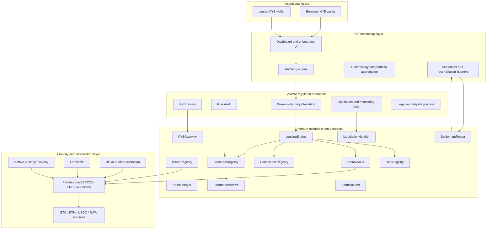

## 5. On-Chain Layer Map

The core is split into five layers. The split is intentionally closer to Morpho's immutable-market discipline and Compound's storage discipline than to Aave's full pooled-market surface.

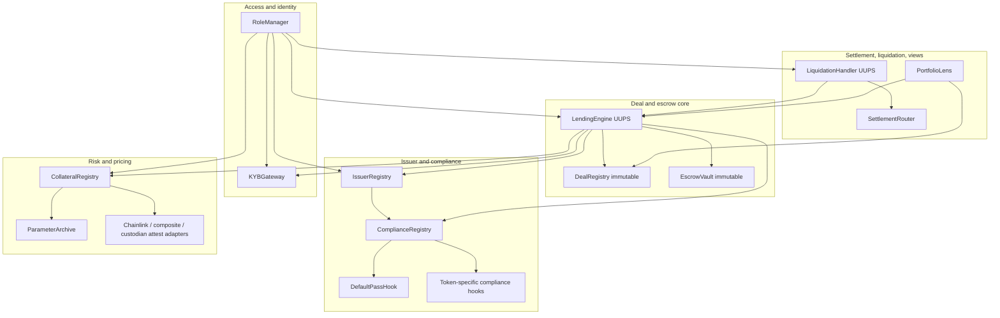

## 6. Contract Inventory

| # | Contract | Layer | Upgradeability | Purpose |
|---|---|---|---|---|
| 1 | `RoleManager` | Access | immutable / OZ AccessManager root | Canonical roles, authority, delay policy, restricted-call source of truth. |
| 2 | `KYBGateway` | Identity | UUPS | Wallet status, expiry, docs hash, AMINA approver, KYB gates. |
| 3 | `IssuerRegistry` | Issuer | UUPS | Custodians, permissioned tokens, token kinds, caps, allowlist preflight, pause/deactivate. |
| 4 | `ComplianceRegistry` | Compliance | UUPS | `(token, action) -> preHook/postHook`; enforces staticcall/gas/no-revert discipline. |
| 5 | `DefaultPassHook` | Compliance | immutable | No-op hook for tokens that need only registry/KYB checks. |
| 6 | `CollateralRegistry` | Risk | UUPS | Per-pair params and latest version; includes oracle source bindings and caps. |
| 7 | `ParameterArchive` | Risk | immutable | Immutable historical params, including oracle sources, per pair/version. |
| 8 | `DealRegistry` | Core | immutable | EIP-712 deal recording; verifies lender, borrower, AMINA signatures; terms are write-once. |
| 9 | `EscrowVault` | Core | immutable | Per-deal token ledger; only `LendingEngine` can mutate balances. |
| 10 | `LendingEngine` | Core | UUPS + timelock | State machine, activation, repay, top-up, pause clocks, caps, ERC-7540 view subset. |
| 11 | `LiquidationHandler` | Liquidation | UUPS + timelock | AMINA-only warn/partial/full liquidation; verifies stale-price attestations. |
| 12 | `SettlementRouter` | Settlement | UUPS or immutable | Typed settlement events consumed by custody/off-chain listeners. |
| 13 | `PortfolioLens` | Views | immutable | Aggregated user/deal/portfolio views; re-exports ERC-7540-shaped views. |

Target size is roughly 1,750 to 1,900 LOC of business logic, excluding standard OpenZeppelin machinery and test mocks. The extra LOC versus v0.2 buys oracle snapshotting, role separation, multi-dimensional caps, pause-clock economics, hook discipline, and freeze recovery.

## 7. Roles and Privileges

The role split follows the adjusted Claude/GPT consensus: slow risk governance is separated from fast matching and liquidation operations.

| Role | Holder | Can do | Cannot do | Controls |
|---|---|---|---|---|
| `GOVERNOR` | P2P 3-of-5 Safe | upgrades, role grants, implementation allowlists, deployment binding | open deals, liquidate, set LTV directly | timelocked except emergency-approved upgrades |
| `CURATOR` | AMINA risk multisig | approve KYB, onboard issuers, set risk params, set caps, rotate oracle by new version | open deals directly, move funds from vault | medium speed; some actions timelocked |
| `ALLOCATOR` | AMINA matching engine hot wallet or Safe module | call `openAndActivate`, submit AMINA broker signature, consume signed terms | change LTV, onboard issuer, liquidate | rate-limited, cap-limited |
| `LIQUIDATOR` | AMINA bot wallets | `warn`, `partialLiquidate`, `fullLiquidate`, submit stale-price attestation | change params, seize surplus, open deals | per-wallet daily limits |
| `GUARDIAN` | AMINA ops or joint P2P+AMINA operational Safe | pause token, pair, deal; unpause under policy | transfer funds, change deal terms, override oracle | non-destructive fast action |
| `EMERGENCY` | joint P2P + AMINA 2-of-2 Safe | global halt, emergency oracle override for live deal, recovery ceremony | routine parameter changes | loud events, alerts, runbook-only |
| `ORACLE_ADMIN` | AMINA + oracle ops | propose/register price sources by creating new risk version | mutate live deal oracle without emergency | controlled through `CollateralRegistry` |
| `OPS` | AMINA limited hot wallets | operational metadata updates, non-critical status sync | move funds, open/liquidate deals | low-risk rate-limited actions |

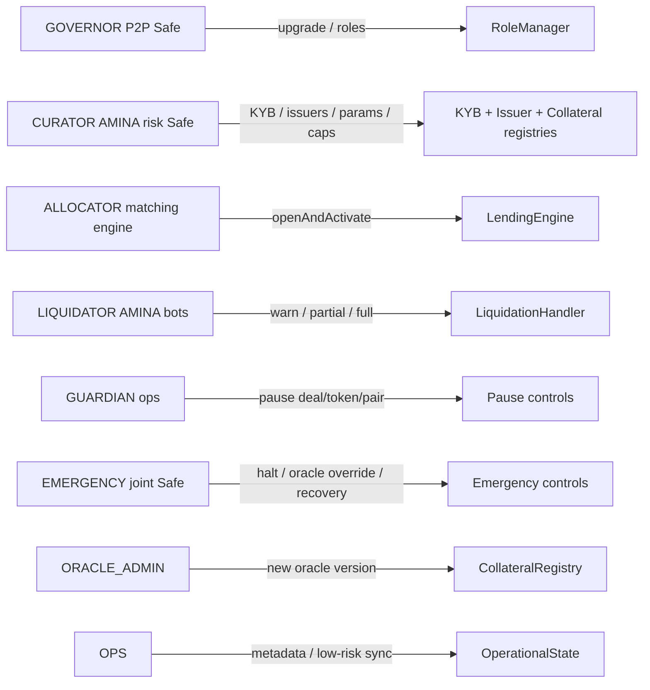

Privilege rules:

- `ALLOCATOR` is the only role allowed to activate matched deals, but cannot change parameters.
- `CURATOR` can set risk policy but is not expected to be online for every deal.
- `LIQUIDATOR` cannot receive arbitrary collateral; it can only trigger collateral release computed by the engine.
- `GUARDIAN` can stop damage but cannot redirect value.
- `EMERGENCY` can override live oracle bindings only through an explicit audited function and event.
- No single role can both change risk parameters and move funds out of escrow.

## 8. Contract Specifications

### 8.1 `RoleManager`

Root authority contract, preferably OpenZeppelin `AccessManager` or a thin wrapper around it.

Responsibilities:

- define roles and delays;
- expose role-check interface to all restricted contracts;
- keep role grant/revoke history;
- enforce timelocks for upgrades and risky configuration changes;
- support emergency bypass only for pre-agreed selectors.

Key design notes:

- Use selector-level permissions, not broad `onlyOwner`.
- Store role admin relationships explicitly.
- Never grant production roles to EOAs except constrained hot-wallet roles (`ALLOCATOR`, `LIQUIDATOR`, `OPS`) with rate limits.

### 8.2 `KYBGateway`

Wallet eligibility registry controlled by AMINA's compliance process.

```solidity
enum KybStatus { Unknown, Approved, Suspended, Revoked }

struct KybRecord {
    KybStatus status;
    uint64 approvedAt;
    uint64 reviewedUntil;
    bytes32 documentsHash;
    address approvedBy;
    bytes32 jurisdictionCode;
}
```

Functions:

- `setStatus(address wallet, KybStatus status, bytes32 docsHash, uint64 reviewedUntil)` only `CURATOR`.
- `requireApproved(address wallet)` view, reverts if not approved or expired.
- `isApproved(address wallet)` view for UI and preflight checks.

Rules:

- Lender, borrower, and caller of repayment/top-up must pass KYB where legally required.
- `reviewedUntil` prevents stale KYB from silently remaining valid forever.
- Status transitions are evented with reason hashes, not plaintext documents.

### 8.3 `IssuerRegistry`

Critical registry that binds permissioned tokens to off-chain redemption promises.

```solidity
enum TokenKind { Unknown, Supply, Collateral, DualUse }
enum IssuerStatus { Unknown, Active, Paused, Deactivated }

struct IssuerInfo {
    address custodian;
    IssuerStatus status;
    bytes32 legalAttestationHash;
    uint256 globalCapUsd;
    uint256 usedCapUsd;
}

struct TokenInfo {
    address issuer;
    TokenKind kind;
    uint8 decimals;
    bool paused;
    uint256 capUsd;
    uint256 usedCapUsd;
    bytes32 redemptionAttestationHash;
    address defaultPreHook;
    address defaultPostHook;
}
```

Responsibilities:

- list accepted custodians and tokens;
- enforce token kind: supply token, collateral token, or explicit dual-use token;
- store per-token and per-custodian caps;
- support pause/deactivate semantics;
- optionally preflight `EscrowVault` allowlisting for ERC-3643/T-REX-like tokens;
- emit attestation-hash updates when redemption terms change.

Issuer states:

| State | New deals | Existing repay/top-up | Liquidation | Meaning |
|---|---|---|---|---|
| Active | allowed | allowed | allowed | normal |
| Paused | blocked | allowed if token permits | allowed if token permits | temporary risk/compliance stop |
| Deactivated | blocked | only exits/rescue | only by emergency runbook | issuer no longer accepted |

### 8.4 `ComplianceRegistry`

Hook router with strict safety boundaries.

```solidity
interface ICompliancePreHook {
    function preTransfer(
        address token,
        address from,
        address to,
        uint256 amount,
        bytes32 dealId,
        bytes32 action
    ) external view returns (bool ok, bytes32 reasonCode);
}

interface ICompliancePostHook {
    function postTransfer(
        address token,
        address from,
        address to,
        uint256 amount,
        bytes32 dealId,
        bytes32 action
    ) external;
}
```

Safety rules:

- pre-hooks are called using `staticcall` with a gas cap;
- failed pre-hook blocks the action before state mutation;
- post-hooks are best-effort, gas-capped, wrapped in `try/catch`, and cannot revert core accounting;
- all hook failures emit typed events;
- hook contracts are part of token onboarding and audit scope.

Typed reason codes:

- `KYB_SUSPENDED`
- `JURISDICTION_BLOCKED`
- `TOKEN_PAUSED`
- `VAULT_NOT_ALLOWLISTED`
- `TRANSFER_RESTRICTED`
- `UNKNOWN_HOOK_FAILURE`

### 8.5 `CollateralRegistry` and `ParameterArchive`

`CollateralRegistry` stores latest pair params. `ParameterArchive` stores immutable historical versions. Unlike the earlier v0.2 plan, oracle source binding is part of the risk params.

```solidity
struct PairParams {
    address collateralToken;
    address supplyToken;
    uint16 ltvBps;
    uint16 warningBps;
    uint16 partialLiqBps;
    uint16 fullLiqBps;
    uint16 liquidationBonusBps;
    uint32 maxMaturity;
    uint16 maxRateBps;
    uint256 pairCapUsd;
    address collateralPriceSource;
    address supplyPriceSource;
    uint32 collateralHeartbeat;
    uint32 supplyHeartbeat;
    uint8 collateralOracleDecimals;
    uint8 supplyOracleDecimals;
    bool active;
}
```

Versioning model:

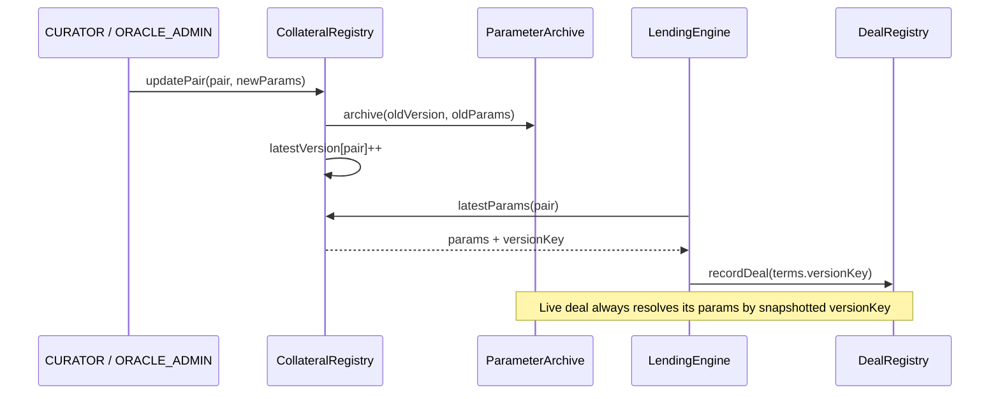

Rules:

- New deals use `latestVersion[pair]`.
- Live deals read `ParameterArchive[pair][versionKey]`.
- Oracle rotations create a new version and affect only new deals.
- `EMERGENCY.forceOracleOverride` is the only live-deal oracle override and must emit a reasoned event.

### 8.6 `DealRegistry`

Immutable write-once legal/economic record.

```solidity
struct DealTerms {
    address lender;
    address borrower;
    address supplyToken;
    address collateralToken;
    uint128 principal;
    uint128 collateralAmount;
    uint32 fixedRateBps;
    uint64 startTs;
    uint64 maturityTs;
    uint32 riskVersion;
    bytes32 pairKey;
    bytes32 legalTermsHash;
    bytes32 nonce;
}
```

Responsibilities:

- verify lender signature;
- verify borrower signature;
- verify AMINA broker/allocator signature;
- derive deterministic `dealId`;
- enforce nonce uniqueness;
- persist terms forever;
- expose EIP-712 domain and typed-data hash helpers.

Signature model:

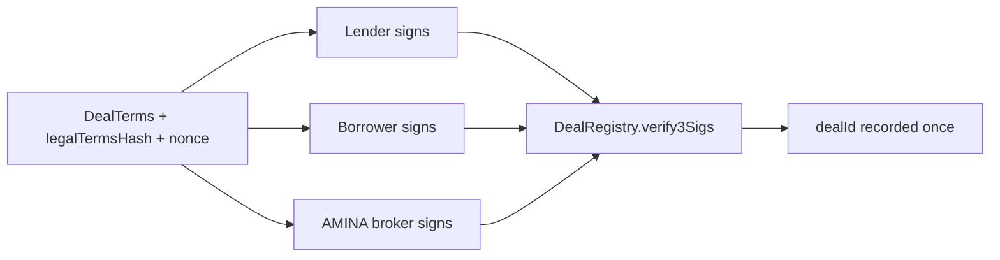

### 8.7 `EscrowVault`

Immutable token custody and per-deal accounting contract.

Core invariant:

```text
sum(balanceOf[dealId][token] for all non-terminal deals) == IERC20(token).balanceOf(EscrowVault)
```

Responsibilities:

- pull collateral from borrower;
- pull supply from lender or repayer;
- release supply to borrower during activation;
- release collateral to borrower on repay;
- release collateral to AMINA settlement address during liquidation;
- hold unreleased collateral if permissioned token transfer fails;
- expose reconciliation views.

Rules:

- only `LendingEngine` can mutate balances;
- no arbitrary external approvals;
- no strategy/reinvestment module;
- no ERC-4626 share token;
- use `SafeERC20` wrappers and explicit balance delta checks for non-standard ERC20s.

### 8.8 `LendingEngine`

Central state machine and accounting interpreter.

```solidity
enum DealStateEnum {
    None,
    Active,
    Warned,
    Liquidating,
    RepaidPendingCollateralRelease,
    Repaid,
    Liquidated,
    Defaulted
}

struct DealState {
    DealStateEnum state;
    uint128 outstanding;
    uint128 collateralPosted;
    uint64 lastTouchTs;
    uint8 liquidationStep;
    uint32 versionKey;
    uint64 pauseStartedAt;
    uint64 totalPausedTime;
    bytes32 lastPauseReason;
}
```

Entry points:

- `openAndActivate(DealTerms terms, Signatures sigs, PermitData permits)` only `ALLOCATOR`.
- `repay(bytes32 dealId, uint256 amount)` by compliant caller.
- `topUpCollateral(bytes32 dealId, uint256 amount)` by compliant caller.
- `pauseDeal(bytes32 dealId, bytes32 reason)` only `GUARDIAN`.
- `unpauseDeal(bytes32 dealId)` only `GUARDIAN`.
- `claimUnreleasedCollateral(bytes32 dealId)` borrower or approved receiver.
- `pendingDepositRequest`, `claimableDepositRequest`, `pendingRedeemRequest`, `claimableRedeemRequest` view-only ERC-7540-shaped surface.

Pause-clock economics:

```text
activeElapsed = block.timestamp - terms.startTs - state.totalPausedTime
accruedInterest = principal * fixedRateBps * activeElapsed / 365 days / 10000
effectiveMaturityTs = terms.maturityTs + state.totalPausedTime
```

### 8.9 `LiquidationHandler`

Privileged liquidation coordinator controlled by AMINA liquidator wallets.

```solidity
struct AMINASignedPriceAttestation {
    bytes32 sourceId;
    uint256 observedCollateralPrice;
    uint256 observedSupplyPrice;
    uint64 observationTs;
    bytes32 reasonCode;
    bytes signature;
}
```

Functions:

- `warn(dealId, expectedStep)` starts warning grace period.
- `partialLiquidate(dealId, amount, expectedStep, attestation)` transfers computed collateral amount to AMINA settlement.
- `fullLiquidate(dealId, expectedStep, attestation)` closes deal, computes debt, AMINA amount, surplus, and shortfall.

Rules:

- `expectedStep` prevents duplicate or out-of-order bot actions.
- AMINA cannot take more than debt plus explicit fee/bonus.
- Surplus belongs to borrower.
- If on-chain oracle is stale but still usable by policy, liquidation must include a signed AMINA price attestation.
- If collateral value is insufficient, the state becomes `Defaulted`; shortfall is recorded, not socialized.

### 8.10 `SettlementRouter`

Typed event surface for off-chain custody listeners. It should hold little or no state.

Events:

```solidity
event AdvanceIntent(bytes32 indexed dealId, address indexed borrower, address supplyToken, uint256 amount, bytes32 settlementRef);
event RepayIntent(bytes32 indexed dealId, address indexed repayer, address supplyToken, uint256 amount, bytes32 settlementRef);
event CollateralTopUpIntent(bytes32 indexed dealId, address indexed payer, address collateralToken, uint256 amount, bytes32 settlementRef);
event LiquidationIntent(bytes32 indexed dealId, address indexed collateralToken, uint256 amount, address aminaSettlement, bytes32 settlementRef);
event SurplusReturnIntent(bytes32 indexed dealId, address indexed borrower, address collateralToken, uint256 amount, bytes32 settlementRef);
event UnreleasedCollateral(bytes32 indexed dealId, address indexed borrower, address collateralToken, uint256 amount, bytes32 reasonCode);
```

Minimum reconciliation fields:

- `dealId`
- action type
- token
- amount
- from/to chain addresses
- custodian or issuer id
- settlement address
- off-chain settlement reference
- risk version
- event sequence number

### 8.11 `PortfolioLens`

Read-only UX and integration layer.

Views:

- user aggregate lend/borrow notional;
- deal list by lender/borrower;
- health factor by deal;
- maturity schedule;
- cap utilization;
- ERC-7540-shaped pending/claimable views re-exported from `LendingEngine`;
- reconciliation helpers for ops.

## 9. Data Model

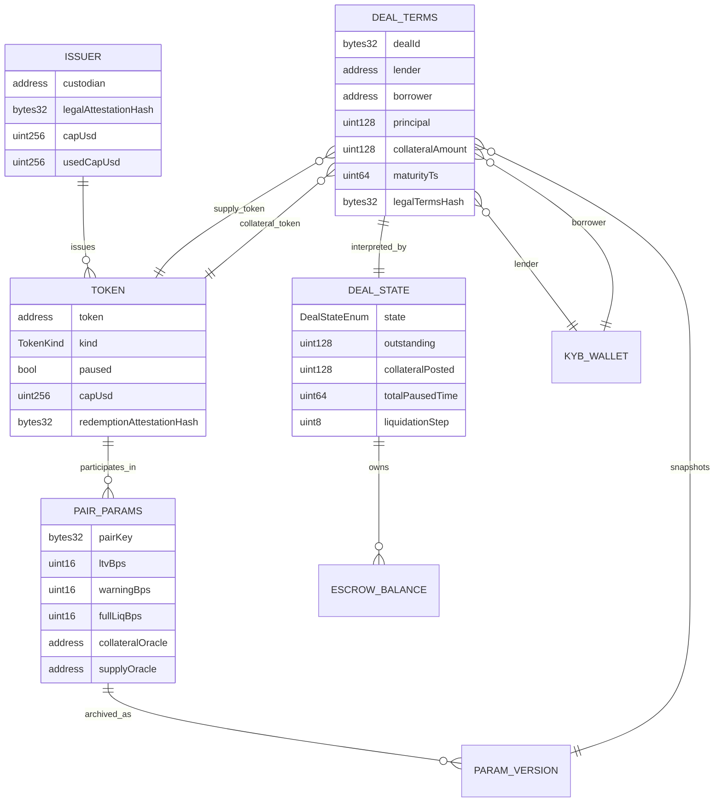

## 10. Deal State Machine

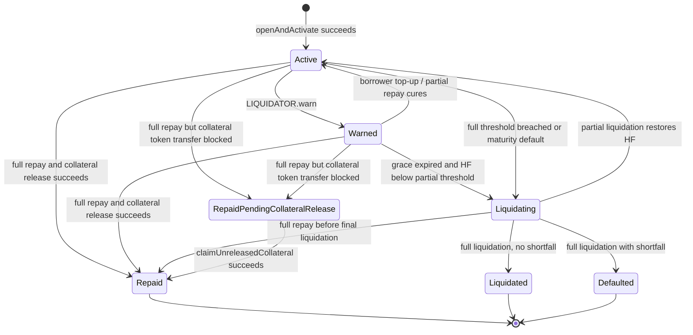

State notes:

- There is no durable `Pending` deal state in the happy path. If activation fails, the transaction reverts and no legal on-chain deal is recorded.
- `RepaidPendingCollateralRelease` exists only for permissioned-token freeze cases where the debt is repaid but the issuer prevents collateral transfer.
- Pausing is an overlay flag, not a separate economic state. Pause changes time accounting and callable actions.

## 11. User Stories and Use Cases

### 11.1 Lender supplies fixed-term liquidity

As a KYB-approved lender, I want to lend custody-issued USDC for a fixed term and rate without knowing the borrower's legal identity, while AMINA knows both sides and signs the broker attestation.

Flow:

1. Lender completes KYB through P2P UI; AMINA approves wallet in `KYBGateway`.
2. Custodian mints supply token to lender wallet.
3. Lender submits desired size, term, and token to off-chain matching engine.
4. AMINA matches borrower and signs deal terms.
5. Lender signs EIP-712 deal terms and optional ERC-2612 permit.
6. AMINA `ALLOCATOR` calls `openAndActivate`.
7. Supply token is pulled from lender and released to borrower in the same transaction.
8. Lender sees one aggregate position in the dashboard, backed by one or more bilateral deals.

### 11.2 Borrower borrows against custody-tokenized collateral

As a KYB-approved borrower, I want to lock custody-tokenized BTC/ETH/RWA collateral and receive custody-issued USDC without selling the asset.

Flow:

1. Borrower completes KYB; AMINA approves wallet.
2. Custodian mints collateral token to borrower wallet.
3. Borrower requests principal, maturity, and collateral type.
4. Matching engine constructs one or more bilateral deals.
5. Borrower signs EIP-712 terms and optional permit.
6. `openAndActivate` pulls collateral, pulls supply, releases supply to borrower, and emits `AdvanceIntent`.
7. Borrower may later repay, top up, or be warned/liquidated if health deteriorates.

### 11.3 AMINA opens a matched deal

As AMINA, I need the on-chain record to prove that a deal was matched under my brokerage authority and accepted by both counterparties.

Requirements:

- all three signatures required: lender, borrower, AMINA;
- `ALLOCATOR` role required for activation;
- risk version and legal terms hash recorded;
- caps checked before token movement;
- KYB/issuer/compliance checks performed before activation;
- no pending partially recorded deal if any leg fails.

### 11.4 Borrower cures risk by topping up collateral

As a borrower, I want to add collateral during `Active`, `Warned`, or `Liquidating` state to return the deal to safety.

Rules:

- caller must pass KYB/compliance;
- top-up is allowed during deal pause unless global emergency explicitly blocks it;
- top-up cannot make the position riskier;
- compliance hook failure reverts before state mutation;
- dashboard and SettlementRouter emit top-up intent for custody reconciliation.

### 11.5 Anyone-compliant repays

As AMINA or an approved third party, I may repay a borrower's debt to rescue a position.

Rules:

- caller must pass `KYBGateway` and token compliance gates;
- repayment can be partial or full;
- full repay releases collateral to borrower, or moves to `RepaidPendingCollateralRelease` if collateral token transfer is blocked;
- repayment is borrower-favorable and should remain callable during normal pause.

### 11.6 AMINA liquidates an unsafe or matured deal

As AMINA liquidator, I need to act when HF crosses thresholds or debt is unpaid at maturity.

Rules:

- only `LIQUIDATOR` can call liquidation functions;
- expected step prevents duplicate actions;
- on-chain risk params are read from deal's snapshotted version;
- stale on-chain oracle liquidation requires signed AMINA price attestation;
- AMINA receives only debt plus explicit fee/bonus;
- surplus is returned or claimable by borrower;
- shortfall is recorded as `Defaulted` and handled off-chain, not socialized.

### 11.7 Issuer freezes vault mid-deal

As a borrower who repaid, I need my collateral claim preserved if the permissioned token blocks the release transfer.

Rules:

- debt repayment still settles if supply transfer succeeds;
- engine records `RepaidPendingCollateralRelease`;
- unreleased collateral remains in `EscrowVault` under the deal ledger;
- borrower can call `claimUnreleasedCollateral` after issuer unfreezes transfer;
- SettlementRouter emits `UnreleasedCollateral` for ops escalation.

## 12. Happy Path Fund Flow

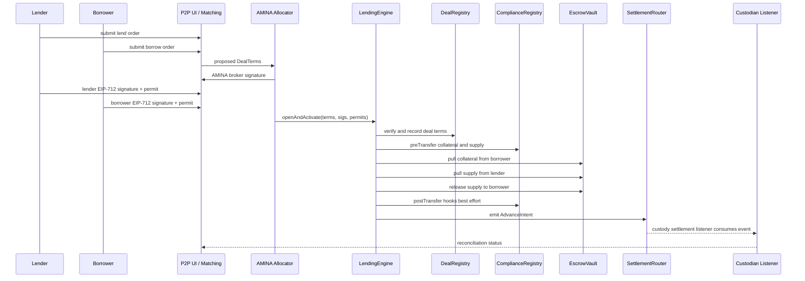

Atomic activation invariants:

- If signature verification fails, no state changes.
- If KYB, issuer, cap, oracle, or compliance preflight fails, no state changes.
- If either token transfer fails, no deal is recorded as active.
- If all steps succeed, borrower has supply token and escrow holds collateral by end of transaction.

## 13. Repay and Collateral Release Flow

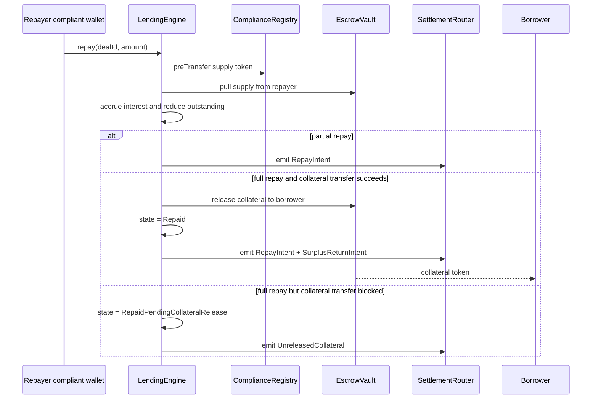

## 14. Liquidation Flow

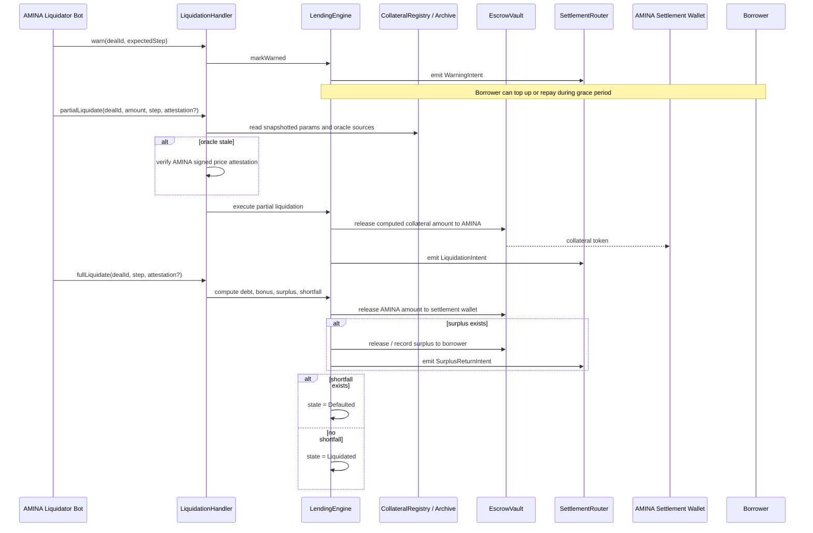

## 15. Pause and Emergency Behavior

Pause hierarchy:

| Scope | Role | Blocks | Allows | Clock impact |
|---|---|---|---|---|
| token pause | `GUARDIAN` / `CURATOR` | new deals using token | repay, top-up, liquidation if token permits | none |
| pair pause | `GUARDIAN` / `CURATOR` | new deals on pair | existing deal exits | none |
| deal pause | `GUARDIAN` | liquidation and non-rescue actions | top-up, full repay, claim surplus/unreleased collateral | stops accrual; extends maturity |
| global halt | `EMERGENCY` | all non-rescue actions | predefined rescue operations if safe | configurable emergency mode |
| emergency sealed mode | `EMERGENCY` | everything except views | none until recovery | all clocks frozen |

Deal pause sequence:

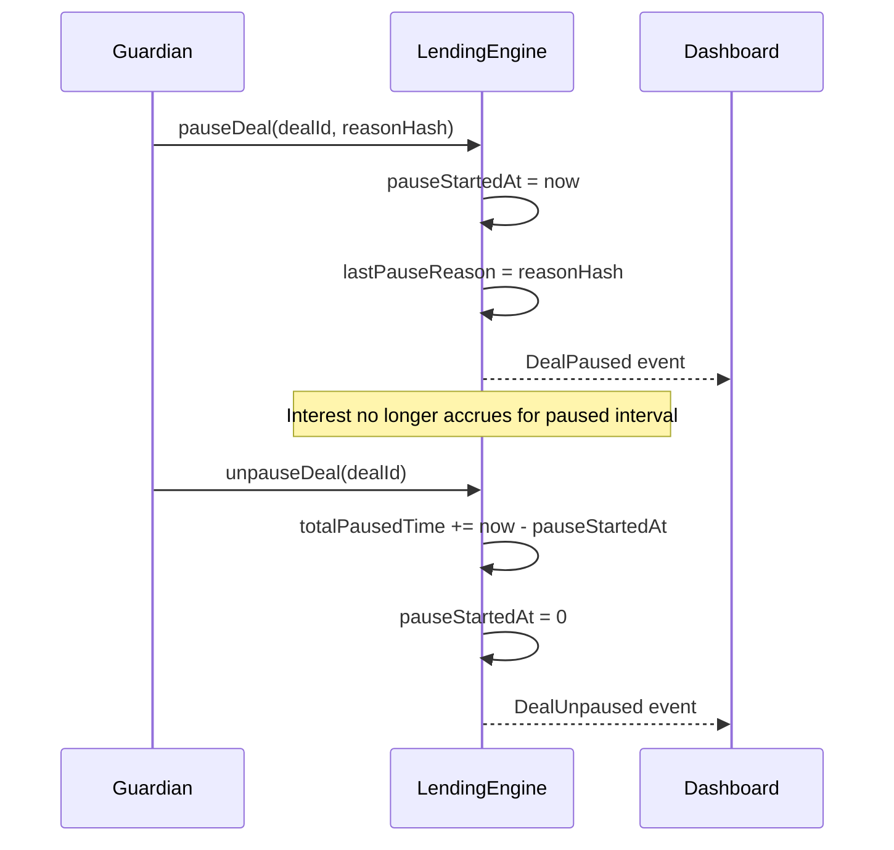

## 16. Oracle and Pricing Architecture

Oracle sources are not mutable global pointers for live deals. They are part of the snapshotted risk version.

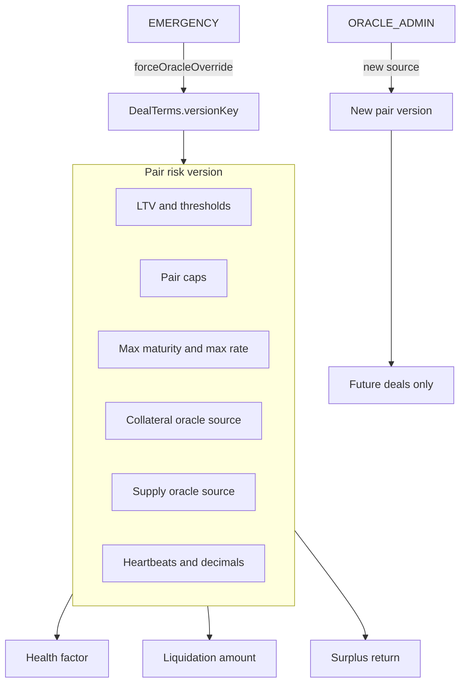

Pricing rules:

- New deals require healthy oracle sources.
- Existing deals can repay/top-up even if oracle is stale.
- Liquidation against a stale oracle is allowed only if policy permits and AMINA supplies a signed price attestation.
- Circuit-broken oracle blocks new liquidations unless `EMERGENCY` override is used.
- All price paths normalize decimals in one library shared by health factor, liquidation, and surplus math.

Health factor model:

```text
collateralValue = collateralAmount * collateralPrice / collateralScale
debtValue = outstanding * supplyPrice / supplyScale
healthFactor = collateralValue * ltvBps / debtValue / 10000
```

## 17. Cap Model

Caps should be simple counters in v1, but multi-dimensional from day one.

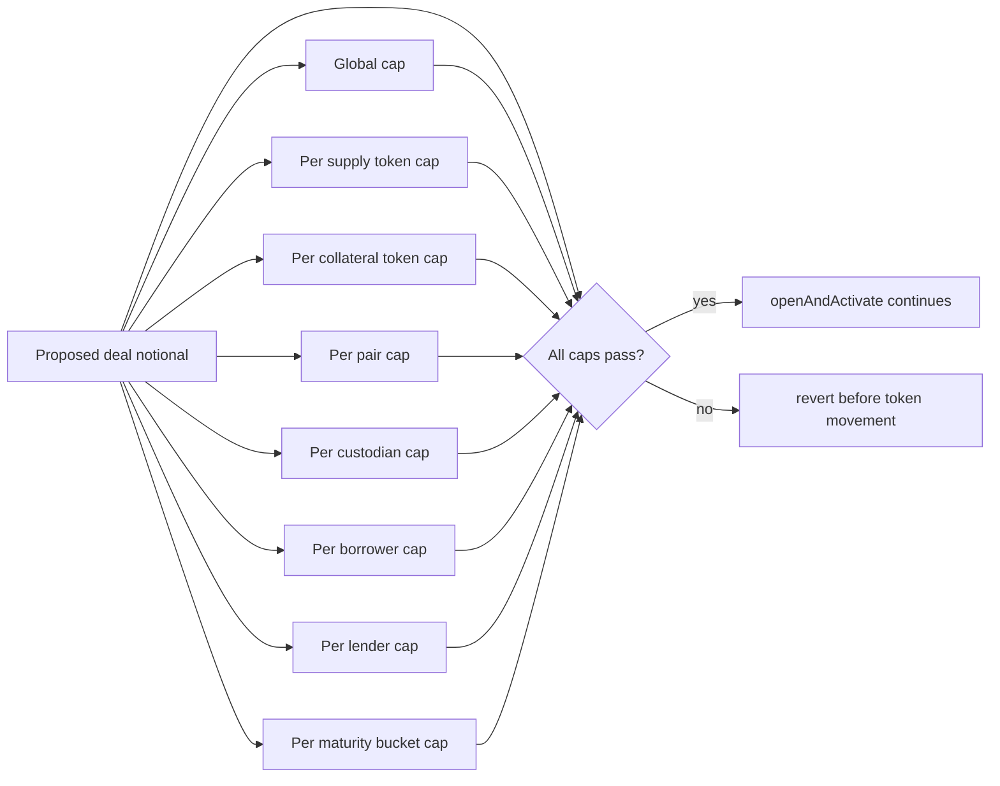

Cap accounting locations:

| Cap | Contract | Updated when | Released when |
|---|---|---|---|
| global notional | `LendingEngine` | deal opens | terminal state |
| per supply token | `IssuerRegistry` or `LendingEngine` mirror | deal opens | terminal state |
| per collateral token | `IssuerRegistry` or `LendingEngine` mirror | deal opens | terminal state |
| per pair | `CollateralRegistry` | deal opens | terminal state |
| per custodian | `IssuerRegistry` | deal opens | terminal state |
| per borrower | `LendingEngine` | deal opens | terminal state |
| per lender | `LendingEngine` | deal opens | terminal state |
| per maturity bucket | `LendingEngine` | deal opens | maturity/terminal rebucket |
| per liquidator wallet daily | `LiquidationHandler` | liquidation action | day rollover |

## 18. External Dependencies

| Dependency | Used by | Risk | Mitigation |
|---|---|---|---|
| Permissioned ERC20 / ERC-3643 tokens | `EscrowVault`, `IssuerRegistry`, hooks | transfer can revert; vault may not be allowlisted; issuer can freeze | onboarding preflight, typed hook errors, `RepaidPendingCollateralRelease` |
| Custodians | token redemption and real asset custody | insolvency, delayed redemption, operational error | issuer caps, pause/deactivate, legal attestation hash, AMINA runbook |
| Chainlink / oracle adapters | `CollateralRegistry` params | stale price, decimal bug, wrong source | heartbeat, source snapshot, shared decimal library, emergency override |
| AMINA off-chain price desk | stale-oracle liquidation evidence | wrong or disputed off-chain price | signed attestation event, risk desk signer rotation, audit trail |
| AMINA matching engine | deal construction | wrong terms or unauthorized match | three signatures, `ALLOCATOR` rate limits, caps |
| P2P dashboard/listeners | UX and reconciliation | display mismatch, missed event | event sequence numbers, replayable indexer, reconciliation jobs |
| Safe / multisig infra | privileged roles | key compromise or operational delay | role separation, timelocks, hot-wallet limits |
| ERC-2612 permits | atomic activation | token lacks permit or permit replay | fallback pre-approval path; nonce/domain checks |

## 19. Storage and Upgrade Strategy

Upgradeable contracts:

- `KYBGateway`
- `IssuerRegistry`
- `ComplianceRegistry`
- `CollateralRegistry`
- `LendingEngine`
- `LiquidationHandler`
- optionally `SettlementRouter`

Immutable contracts:

- `DealRegistry`
- `EscrowVault`
- `ParameterArchive`
- `DefaultPassHook`
- `PortfolioLens` where possible

Storage discipline:

- Every UUPS contract has a dedicated `XStorage.sol` or ERC-7201 namespaced storage library.
- CI stores and diffs storage layout snapshots for every upgradeable contract.
- `DealRegistry` and `EscrowVault` addresses are immutable bindings in the engine initialization.
- Engine upgrades preserve `state[dealId]`; immutable contracts preserve terms and balances.

Recovery ceremony for halted engine:

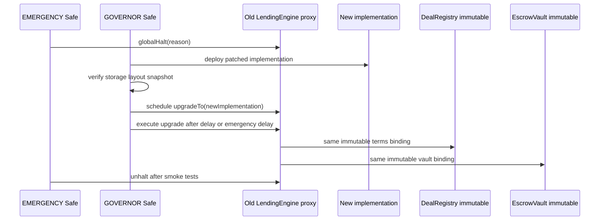

## 20. Security Invariants

These invariants should be encoded as Foundry invariants, property tests, and formal rules where practical.

Per-deal invariants:

1. Deal terms are write-once.
2. Terminal deals cannot transition again.
3. `RepaidPendingCollateralRelease` can only transition to `Repaid`.
4. Every transition follows the documented DAG.
5. A deal cannot become active unless both lender and borrower transfers succeeded.
6. AMINA cannot open a deal without valid lender, borrower, and AMINA signatures.
7. A signature cannot be replayed across deal ids, chains, or contract deployments.
8. Live deals keep their risk-version snapshot after registry updates.
9. Live deals keep their oracle binding after registry updates unless `forceOracleOverride` is called.
10. Liquidation step counter prevents duplicate partial/full actions.
11. Full liquidation cannot transfer more collateral to AMINA than debt plus explicit fee/bonus.
12. Surplus is claimable by borrower and cannot be seized by governance.
13. Interest accrues for `elapsedTime - totalPausedTime`, never paused intervals.
14. During normal deal pause, top-up and full repay remain callable subject to token compliance.

Global invariants:

15. Sum of deal balances for each token equals `EscrowVault` token balance.
16. Token pause blocks new deals but does not trap safe exits for existing deals.
17. Global halt cannot prevent predefined rescue actions unless emergency sealed mode is active.
18. Compliance hook failure cannot leave partial state changes.
19. Oracle decimals are normalized identically across health factor, liquidation, and surplus math.
20. A deal cannot open if any active cap would be exceeded.
21. No role can both set risk params and transfer funds from escrow.
22. `EscrowVault` has no callable path that moves funds except through `LendingEngine`.

## 21. Testing Strategy

| Test class | Tool | Target |
|---|---|---|
| Unit tests | Foundry | every external/public function, role gate, revert reason |
| Integration tests | Foundry | full lifecycle: open, accrue, repay, top-up, warn, partial, full |
| Invariant tests | Foundry invariant/Echidna | invariants in section 20 |
| Differential tests | Python reference + Foundry | interest, HF, liquidation amount, surplus math |
| Fork tests | mainnet fork | Chainlink-style feeds, real permissioned-token mocks/adapters where possible |
| Symbolic checks | Halmos/Certora optional | signature replay, state DAG, no over-transfer in liquidation |
| Gas tests | Foundry gas snapshots | `openAndActivate`, `repay`, `partialLiquidate`, `fullLiquidate` |
| Ops simulations | scripts/indexer | event replay, reconciliation, missed-listener recovery |

Gating demo before external audit:

```text
openAndActivate -> accrue -> repay -> release collateral -> reconcile EscrowVault balances
```

This should run on a mainnet fork with realistic token decimals, oracle decimals, and custodian-token transfer behavior.

## 22. Deployment Order

1. Deploy `RoleManager`.
2. Deploy immutable `DefaultPassHook`.
3. Deploy `KYBGateway`, `IssuerRegistry`, `ComplianceRegistry` proxies.
4. Deploy `ParameterArchive` immutable.
5. Deploy `CollateralRegistry` proxy and bind it to `ParameterArchive`.
6. Deploy immutable `DealRegistry`.
7. Deploy immutable `EscrowVault` with final engine binding pattern, or deploy with one-time engine setter controlled by deployment ceremony.
8. Deploy `LendingEngine` proxy and initialize all registry/vault addresses.
9. Deploy `LiquidationHandler` proxy and bind to engine.
10. Deploy `SettlementRouter`.
11. Deploy `PortfolioLens`.
12. Grant production roles and revoke deployer privileges.
13. Register first issuer, token pair, oracle sources, hooks, caps.
14. Run smoke test with mock tokens.
15. Run mainnet-fork lifecycle reconciliation.

Deployment diagram:

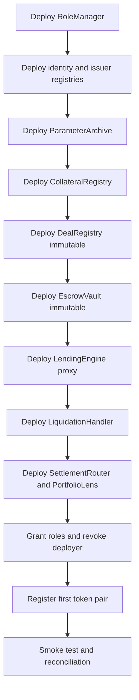

## 23. Operational Monitoring

Required monitors:

- every `SettlementRouter` event, indexed by sequence number;
- per-deal health factor every 5 minutes or faster for volatile collateral;
- oracle freshness and deviation checks;
- cap utilization at all dimensions;
- `EscrowVault` token balance versus per-deal ledger reconciliation;
- hook failure events by token/action/reason;
- role change and upgrade events;
- liquidation step divergence between bot expectation and chain;
- deals approaching maturity;
- paused deals and paused-time accumulation;
- `RepaidPendingCollateralRelease` queue.

Alert severity:

| Alert | Severity | Owner |
|---|---|---|
| escrow reconciliation mismatch | critical | P2P engineering + AMINA ops |
| oracle circuit breaker | high | AMINA risk + oracle admin |
| liquidation bot offline | high | AMINA ops |
| hook failure spike | high | P2P + custodian |
| token/custodian pause | high | AMINA risk |
| cap above 80 percent | medium | AMINA risk |
| KYB expiry approaching | medium | AMINA compliance |
| maturity within 7 days | medium | borrower/lender/AMINA |

## 24. Risk Allocation

| Risk class | Primary owner | Contract support |
|---|---|---|
| borrower default | AMINA + collateral economics | LTV, liquidation thresholds, AMINA liquidation path |
| custody insolvency | custodian | issuer pause/deactivate, caps, attestation hash |
| liquidation execution | AMINA | privileged liquidator, step counter, signed attestations |
| identity/KYB | AMINA | `KYBGateway`, compliance hooks |
| smart-contract bug | P2P | audits, immutable vault/registry, upgrade runbook |
| off-chain matching bug | P2P + AMINA | three signatures, `ALLOCATOR` limits, legal hash |
| oracle failure | AMINA + P2P | snapshotted oracle sources, heartbeat, override runbook |
| token transfer restriction | custodian + P2P integration | hook reason codes, pending collateral release state |
| key compromise | role holder | multisigs, rate limits, no single role controls everything |
| regulatory classification | AMINA + counsel | AMINA broker signature and KYB provenance |

## 25. V2 Extension Paths

These are explicitly out of v1 but should not be foreclosed.

| Extension | v1 preparation | v2 shape |
|---|---|---|
| ERC-7540 lender wrapper | engine exposes view subset and settlement events | async vault aggregating many lender-side deals |
| Mellow-style queue wrapper | clear deal lifecycle and portfolio lens | queue-based institutional distribution vault |
| Aave v4 Spoke | immutable deal positions and risk views | specialized Spoke accepting deal notes or wrapper shares |
| Morpho/MetaMorpho integration | deal isolation and oracle clarity | curated vault that allocates to P2PxAmina lender positions |
| AMINA first-loss bond | explicit no-bond v1 decision | separate `BondVault` with real economics |
| multi-collateral deals | single-collateral v1 keeps interfaces clean | portfolio-margin extension with new risk engine |
| ZK/private registry | legal hash and deal id abstraction | hidden-party or commitment-based deal registry |
| cross-chain deployment | no assumption of chain-specific settlement except Ethereum v1 | router/adapters for Base/Arbitrum/institutional chains |

## 26. Open Questions Before Phase 3

| Question | Default architecture position | Needs confirmation from |
|---|---|---|
| Is liquidation surplus legally borrower property everywhere? | yes | AMINA legal |
| Is AMINA's EIP-712 signature legally a brokerage attestation? | yes | AMINA legal / FINMA counsel |
| Are fresh custody sub-accounts per deal feasible by default? | yes | custodians + AMINA ops |
| What fields are mandatory in settlement events? | proposed in section 8.10 | AMINA integration team |
| Maximum maturity? | 365 days | product + AMINA risk |
| ERC-7540 wrapper versus Mellow queue wrapper for v2? | defer to v2 | product / partnerships |
| Public commitment to ZK privacy path? | no v1 commitment | product / legal |

## 27. Sources

Local sources:

- `P2PxAmina/docs/P2PxAmina-lending-protocol-for-banks.html`
- `P2PxAmina/docs/P2PxAmina-lending-protocol-for-banks-Contracts.html`
- `P2PxAmina/docs/P2PxAmina-lending-protocol-for-banks-Implementation-Plan.md`
- `P2PxAmina/docs/GPT-thoughts.md`
- `P2PxAmina/docs/Claude-thoughts-1.md`
- `aave/About-AAVE-v4.md`
- `aave/AAVE-v4+stVault.md`
- `compound/comet/SPEC.md`
- `compound/comet/README.md`
- `morpho/morpho-blue/README.md`
- `morpho/metamorpho/README.md`
- `mellow/REPORT_GPT_MELLOW_ERC_7540.md`

External sources checked on 2026-05-26:

- Aave v4 live and Hub/Spoke launch: https://aave.com/blog/aave-v4-live-ethereum
- Aave v4 architecture: https://aave.com/blog/understanding-aave-v4s-architecture
- Morpho Blue market model: https://docs.morpho.org/learn/concepts/market/
- Compound III collateral and borrowing: https://docs.compound.finance/collateral-and-borrowing/
- ERC-7540 async vaults: https://eips.ethereum.org/EIPS/eip-7540
- ERC-3643 permissioned tokens: https://eips.ethereum.org/EIPS/eip-3643

## 28. Final Position

The best v1 architecture is a small, explicit, permissioned bilateral repo engine. The contracts should make the real trust boundaries visible: AMINA owns brokerage/risk/liquidation, custodians own redemption, P2P owns code and operations, and users own signed bilateral claims.

The protocol wins if the smart contracts are boring, auditable, and precise. The dashboard can make the product feel like one seamless lending/borrowing position, but the chain should preserve the actual structure: immutable deals, segregated escrow, snapshotted risk, permissioned tokens, and deterministic settlement.
