# P2PxAmina - GPT Smart Contract Architecture v2

**Version**: GPT v2, cross-checked against Claude v0.3 (2026-05-26)
**Status**: consolidated design reference for engineering, audit, AMINA integration, and counsel review
**Prior art**: consolidates `P2PxAmina-lending-protocol-for-banks.html` (v0.7 brief), `P2PxAmina-lending-protocol-for-banks-Contracts.html` (v0.1 sketch), `P2PxAmina-lending-protocol-for-banks-Implementation-Plan.md` (v0.2 plan), `GPT-thoughts.md`, `Claude-thoughts-1.md`, and `Claude-architechture-1.md`.

This document is GPT's next architecture pass after cross-checking `Claude-architechture-1.md`. It keeps Claude's canonical v0.3 structure where it is stronger, and tightens several sharp edges that matter for implementation and audit.

---

## 0. GPT v2 Cross-Check Summary

I agree with Claude's architecture direction: P2PxAmina v1 should be a permissioned bilateral repo rail, not a pooled money market. Claude's document is stronger than my v1 in C4 structure, event schemas, EIP-712 appendix, failure-mode coverage, and audit-surface framing. This GPT v2 adopts that structure and makes these deliberate implementation corrections:

| Area | Claude v0.3 position | GPT v2 adjustment | Why it matters |
|---|---|---|---|
| Root permissioning | `RoleManager` listed as UUPS | Root authority is non-upgradeable by default; migrate only through explicit authority migration | The contract that controls upgrades should not itself be casually upgradeable. |
| `ParameterArchive` | Immutable mapping of `Params` structs | Store schema-versioned encoded snapshots or a frozen v1 superset | Historical reads must survive future registry schema changes. |
| Oracle override | Live deal can point to an override entry | Keep `DealTerms.paramVersion` unchanged; store `oracleOverride[dealId]` sidecar | Preserves the legal record while allowing emergency pricing recovery. |
| `EscrowVault` invariant | exact ledger sum equals token balance | Use `vaultBalance >= ledgerSum`; track unsolicited surplus separately | ERC-20 donations or forced transfers can break exact equality. |
| Collateral release failure | pending collateral release state | Require non-reverting `tryReleaseCollateral`; decrement ledger only after transfer success | Otherwise collateral-token freeze reverts full repayment. |
| `SettlementRouter` | UUPS to evolve event schema | Prefer immutable/versioned routers or append-only event schemas | Custody reconciliation depends on stable historical event meanings. |
| Token kind | no token can be both supply and collateral | Strict v1 default, but reserve `DualUse` only by explicit governance/counsel approval | Stablecoins may later be collateral, but not accidentally. |
| Caps | OPS can update some caps | OPS can decrease/pause fast; exposure increases require `CURATOR` or timelock | Hot keys should reduce risk, not increase exposure. |
| Token admissibility | implied standard ERC-20 | Fee-on-transfer and rebasing tokens are explicitly banned | They break escrow accounting and interest math. |

These changes are guardrails around Claude's v0.3, not a redesign.

---
## Table of contents

0. [GPT v2 Cross-Check Summary](#0-gpt-v2-cross-check-summary)

1. [Executive summary](#1-executive-summary)
2. [Design principles](#2-design-principles)
3. [System context (C4 L1)](#3-system-context-c4-l1)
4. [Container view (C4 L2)](#4-container-view-c4-l2)
5. [Contract inventory (C4 L3)](#5-contract-inventory-c4-l3)
6. [External dependencies](#6-external-dependencies)
7. [Roles, permissions, and access control](#7-roles-permissions-and-access-control)
8. [Data model](#8-data-model)
9. [Deal state machine](#9-deal-state-machine)
10. [User stories](#10-user-stories)
11. [Use cases](#11-use-cases)
12. [Fund-flow diagrams](#12-fund-flow-diagrams)
13. [Settlement and off-chain integration](#13-settlement-and-off-chain-integration)
14. [Liquidation engine deep dive](#14-liquidation-engine-deep-dive)
15. [Risk parameters and versioning](#15-risk-parameters-and-versioning)
16. [Oracle architecture](#16-oracle-architecture)
17. [Compliance hooks](#17-compliance-hooks)
18. [Caps and limits](#18-caps-and-limits)
19. [Pause hierarchy](#19-pause-hierarchy)
20. [Upgradeability and recovery](#20-upgradeability-and-recovery)
21. [Invariants](#21-invariants)
22. [Failure modes](#22-failure-modes)
23. [Audit surface](#23-audit-surface)
24. [Appendix A — Glossary](#24-appendix-a--glossary)
25. [Appendix B — EIP-712 typed data](#25-appendix-b--eip-712-typed-data)
26. [Appendix C — Event schema reference](#26-appendix-c--event-schema-reference)
27. [Appendix D — Open questions](#27-appendix-d--open-questions)
28. [Appendix E - GPT v2 Final Cross-Check Position](#appendix-e---gpt-v2-final-cross-check-position)

---

## 1. Executive summary

P2PxAmina is a **permissioned, bilateral, fixed-term repo rail** for institutional crypto lending. The smart-contract layer is a single self-contained system on Ethereum mainnet that:

- Records each deal as an **immutable bilateral agreement** signed by lender, borrower, and AMINA Bank.
- Holds collateral and supply tokens in a per-deal escrow ledger.
- Accrues interest on a simple-interest basis from deal start to maturity.
- Allows **only AMINA** to liquidate, in a deterministic three-phase flow.
- Emits structured settlement events that custodians use to reconcile real-asset redemptions.

Three actor types interact with the chain:

1. **Lenders and borrowers** — institutional counterparties, KYB'd by AMINA, holding custody-issued ERC-20 tokens.
2. **AMINA Bank** — licensed broker (FINMA Securities Dealer), curator (sets risk params), and liquidator (sole privileged actor for liquidation).
3. **P2P Staking** — technology provider, contract governance via multisig + timelock.

**One-line framing**: a regulated bilateral repo workflow made legible on-chain — the contracts do *settlement, accounting, and audit*; AMINA does *brokerage, risk, and recovery*; custodians do *asset minting and real-world redemption*.

| Property | Value |
|---|---|
| Total LOC budget (Solidity) | ~1,780 |
| Contracts (concrete) | 13 |
| Roles | 8 |
| Invariants | 19 |
| Upgrade policy | `DealRegistry`, `EscrowVault`, `ParameterArchive`, `RoleManager` immutable; policy and engine contracts UUPS + timelock; settlement router versioned |
| Target chain | Ethereum mainnet (v1) |
| Audit shops | 2 in parallel (e.g., Trail of Bits + OpenZeppelin) + Immunefi bounty |

---

## 2. Design principles

These ten principles are the project's **constitutional rules**. Any PR that contradicts one of them is suspect.

1. **Bilateral, not pooled.** Each deal is its own logical market; risk does not commingle.
2. **Fixed-term, fixed-rate.** Rates are set off-chain by AMINA and frozen into the deal at creation. No utilisation curves.
3. **Permissioned counterparties.** Every wallet acting as lender or borrower has been KYB'd by AMINA. Permissionless wallets cannot transact.
4. **Single privileged liquidator.** Only AMINA can liquidate. No bonus auctions, no MEV opportunity, no permissionless keeper economics.
5. **Custody is the trust anchor.** Real assets live with regulated custodians; on-chain tokens are claims on custody. The protocol never holds real-asset value directly.
6. **Off-chain matching, on-chain settlement.** Matching is performed under AMINA's brokerage licence off-chain. The chain records the result via three signatures (lender, borrower, AMINA).
7. **Immutability where it matters.** `DealTerms` are write-once. `DealRegistry`, `EscrowVault`, `ParameterArchive`, and root `RoleManager` are non-upgradeable contracts. The state-machine engine and policy registries are upgradeable behind a timelocked multisig.
8. **Hook-based compliance.** Per-token compliance logic lives in audited hook contracts referenced by `ComplianceRegistry`. Pre-hooks are view-only; post-hooks cannot revert.
9. **Atomic settlement.** `openAndActivate` is a single transaction: terms recorded, collateral posted, supply advanced — or the transaction reverts. The protocol never carries half-settled deals.
10. **Multi-dimensional caps.** Global, per-token, per-pair, per-custodian, per-borrower, per-lender, per-maturity-bucket, and per-liquidator-daily caps exist from day one. Most start near-unbounded but the data model is fixed.

---

## 3. System context (C4 L1)

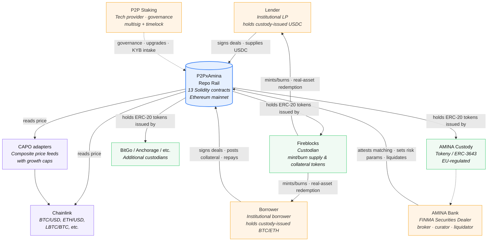

**External system boundary.** The protocol is a black box with five external interfaces:

| Interface | Direction | Standard | Notes |
|---|---|---|---|
| User actions (sign / approve / call) | inbound | EIP-712, ERC-2612 | Lender, borrower, AMINA |
| Governance | inbound | OZ AccessManager + timelock | P2P multisig is `GOVERNOR`; AMINA multisigs hold operational roles |
| Token transfers | bidirectional | ERC-20, ERC-3643 | Custody-issued tokens |
| Price feeds | inbound, read-only | Chainlink-compatible | Direct or via composite adapters |
| Settlement events | outbound | Custom typed events | Custodian listeners reconcile |

---

## 4. Container view (C4 L2)

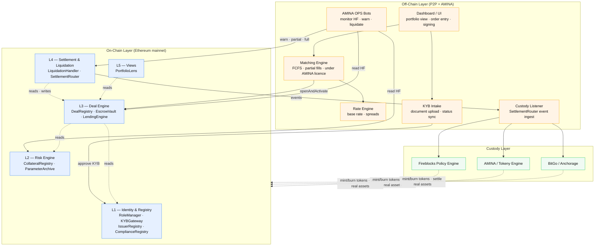

Each container is **independently deployable and independently testable**. The off-chain stack is a Node/Python/TS service mesh; the on-chain layer is a fixed set of Solidity contracts; the custody layer is third-party SaaS. The three layers communicate only via well-typed interfaces: signed transactions, on-chain events, custodian REST APIs.

---

## 5. Contract inventory (C4 L3)

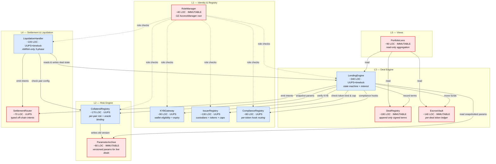

### 5.1 Contract-by-contract reference

#### `RoleManager`

| Aspect | Detail |
|---|---|
| **Purpose** | Root permissioning. Owns the role bindings for the entire protocol. |
| **Pattern** | Thin wrapper around OpenZeppelin `AccessManager`. |
| **Storage** | Role IDs and member sets (inherited from OZ). |
| **Upgrade** | **Non-upgradeable by default.** Prefer direct OZ `AccessManager` or an immutable wrapper. If authority semantics must change, migrate to a new `RoleManager` through an explicit timelocked authority-migration ceremony. |
| **Public surface** | OZ `AccessManager` standard: `grantRole`, `revokeRole`, `hasRole`, `getTargetFunctionRole`, etc. |

#### `KYBGateway`

| Aspect | Detail |
|---|---|
| **Purpose** | Wallet eligibility — has this address been KYB'd by AMINA, and is the approval still valid? |
| **Storage** | `mapping(address => KybRecord) records` |
| **Upgrade** | UUPS. Schema may evolve as AMINA's compliance data model evolves. |
| **Public surface** | `setStatus(wallet, status, docsHash, expiryTs)` (CURATOR-only), `requireApproved(wallet)` (view, reverts if not approved or expired), `getRecord(wallet)` (view). |
| **Key invariant** | A wallet whose `expiryTs <= block.timestamp` cannot pass `requireApproved`, even if the status is `Approved`. Forces periodic re-attestation. |

#### `IssuerRegistry`

| Aspect | Detail |
|---|---|
| **Purpose** | Whitelist of accepted custodians and the tokens they issue, plus per-token and per-custodian caps. |
| **Storage** | `mapping(address => TokenInfo) tokens; mapping(address => CustodianCaps) custodians;` |
| **Upgrade** | UUPS. |
| **Public surface** | `addToken(token, info)` (CURATOR), `pauseToken(token)` (GUARDIAN), `setHook(token, hookAddr)` (CURATOR + timelock), `getTokenInfo(token)` (view). |
| **Key invariant** | Tokens are typed as `Supply` or `Collateral` by default. `DualUse` is reserved but disabled in v1 unless explicitly approved by governance, AMINA counsel, and custodian onboarding. Fee-on-transfer and rebasing tokens are rejected. |

#### `ComplianceRegistry`

| Aspect | Detail |
|---|---|
| **Purpose** | Maps `(token, action)` → hook contract. Provides the engine a single integration point for per-token compliance logic. |
| **Storage** | `mapping(address => mapping(bytes32 => HookConfig)) hooks;` where `bytes32 action` is e.g. `keccak256("ACTIVATE")`. |
| **Upgrade** | UUPS. |
| **Public surface** | `registerHook(token, action, hookAddr)` (CURATOR + timelock), `preTransfer(...)` (called by engine, wraps hook in `staticcall`), `postTransfer(...)` (called by engine, wraps hook in try/catch). |
| **Hook contract interface** | See [§17](#17-compliance-hooks). |

#### `CollateralRegistry`

| Aspect | Detail |
|---|---|
| **Purpose** | Per-(collateral, supply) pair risk parameters, including the oracle binding. The single source of truth for "what are the rules of borrowing supply token X against collateral token Y." |
| **Storage** | `mapping(bytes32 => Params) paramsByPair; mapping(bytes32 => uint32) latestVersion;` |
| **Upgrade** | UUPS (so new fields can be added). Historical versions are read from the immutable `ParameterArchive`. |
| **Public surface** | `addPair(pair, params)`, `updatePair(pair, newParams)` (both CURATOR + timelock), `getParams(pair, version)` (view), `getLatestVersion(pair)` (view). |
| **Key invariant** | Every update to a pair writes the old `Params` to `ParameterArchive[pair][oldVersion]` and increments `latestVersion`. |

#### `ParameterArchive`

| Aspect | Detail |
|---|---|
| **Purpose** | Immutable storage of historical risk-parameter versions. Live deals read from here, not from `CollateralRegistry`. |
| **Storage** | Prefer `mapping(bytes32 => mapping(uint32 => ParamSnapshot)) archive`, where `ParamSnapshot` contains `schemaVersion`, `paramsHash`, and encoded immutable params. A frozen v1 superset struct is acceptable only if future fields are reserved. |
| **Upgrade** | **Immutable.** Written once per (pair, version) tuple. |
| **Public surface** | `write(pair, version, snapshot)` (only `CollateralRegistry`), `read(pair, version)` (public view), `readDecodedV1(pair, version)` for v1 integrations. |

**GPT v2 note.** `ParameterArchive` must not depend on an upgradeable `Params` ABI that may change later. The safest form is:

```solidity
struct ParamSnapshot {
    uint16 schemaVersion;
    bytes32 paramsHash;
    bytes encodedParams;
}
```

The engine decodes schema versions it supports. Old versions remain readable forever, and new registry fields do not corrupt old deal interpretation.

#### `DealRegistry`

| Aspect | Detail |
|---|---|
| **Purpose** | Append-only record of deal terms. The legal-economic record. |
| **Storage** | `mapping(bytes32 => DealTerms) terms; mapping(address => mapping(bytes32 => bool)) usedNonces;` |
| **Upgrade** | **Immutable.** Loan terms cannot be silently rewritten by governance. |
| **Public surface** | `record(terms, lenderSig, borrowerSig, aminaSig)` (only `LendingEngine`), `getTerms(dealId)` (view), `isNonceUsed(party, nonce)` (view). |
| **EIP-712 domain** | `name = "P2PxAmina Lending", version = "1", chainId = block.chainid, verifyingContract = address(this)`. |

#### `EscrowVault`

| Aspect | Detail |
|---|---|
| **Purpose** | Holds collateral and supply tokens, tagged per deal. The only contract that physically moves ERC-20s on behalf of the protocol. |
| **Storage** | `mapping(bytes32 => mapping(address => uint256)) balanceOf;` (dealId → token → amount). |
| **Upgrade** | **Immutable.** Funds cannot be made inaccessible by an engine upgrade. |
| **Public surface** | `pullCollateral(dealId, from, amount)`, `releaseCollateral(dealId, to, amount)`, `pullSupply(...)`, `releaseSupply(...)` — all `onlyEngine`. Plus `getBalance(dealId, token)` (view), `syncCheck(token)` (view, reconciles per-deal sums to actual balance). |
| **Key invariant** | `IERC20(token).balanceOf(address(this)) >= sum over deals of balanceOf[d][token]`. Exact equality can be broken by unsolicited ERC-20 donations; surplus is tracked as unattributed balance and can be swept only by governed, evented process. |

**GPT v2 transfer-failure rule.** For collateral release during full repay, the engine must call a non-reverting release path such as `tryReleaseCollateral`. The vault decrements the per-deal ledger only after the ERC-20 transfer succeeds. If the token transfer fails, the engine can safely mark `Repaid_PendingCollateralRelease` without rolling back the debt repayment.

#### `LendingEngine`

| Aspect | Detail |
|---|---|
| **Purpose** | The state machine. Reads from all registries; writes deal state; orchestrates token movement via `EscrowVault`. |
| **Storage** | `mapping(bytes32 => DealState) state; mapping(bytes32 => bool) pausedDeals; Caps caps;` |
| **Upgrade** | UUPS + timelock. The engine is the most likely contract to need patches over time. Its state survives upgrades because the storage layout uses ERC-7201 namespaced slots and is CI-verified across versions. |
| **Public surface** | See [§11](#11-use-cases) for the full call list. Highlights: `openAndActivate`, `repay`, `topUpCollateral`, `claimUnreleasedCollateral`, `pauseDeal`, `unpauseDeal`, `getHealthFactor` (view). |
| **Reentrancy** | All state-changing entry points use `ReentrancyGuard`. |

#### `LiquidationHandler`

| Aspect | Detail |
|---|---|
| **Purpose** | AMINA-only liquidation logic. Three phases: warn → partial → full. Handles surplus return to borrower. |
| **Storage** | `mapping(bytes32 => LiqState) liqState;` |
| **Upgrade** | UUPS + timelock. |
| **Public surface** | `warn(dealId)`, `partialLiquidate(dealId, amount, expectedStep, signedPriceAttestation)`, `fullLiquidate(dealId, expectedStep, signedPriceAttestation)` — all `LIQUIDATOR`-only. |
| **Key invariant** | Step counter is monotonic; out-of-order or replayed steps revert. |

#### `SettlementRouter`

| Aspect | Detail |
|---|---|
| **Purpose** | Emit typed events that custodian listeners use to drive off-chain settlement (mint/burn, real-asset redemption, etc.). Stateless. |
| **Storage** | None (events only). |
| **Upgrade** | Prefer immutable/versioned router. If proxied, event schema must be append-only and versioned; emitted historical events can never be reinterpreted. |
| **Public surface** | Internal functions called by `LendingEngine` and `LiquidationHandler`: `emitAdvanceIntent`, `emitRedemptionIntent`, `emitLiquidationIntent`, `emitSurplusReturn`, `emitDefault`. |

#### `PortfolioLens`

| Aspect | Detail |
|---|---|
| **Purpose** | Read-only aggregation. Combines a user's many bilateral deals into a single "position view" for the dashboard. Provides ERC-7540-compatible view methods for future composability. |
| **Storage** | None (view-only). |
| **Upgrade** | **Immutable.** New view methods ship as new contracts. |
| **Public surface** | `userPositions(user)` returning aggregate principal, collateral, accrued interest, weighted maturity; ERC-7540 view subset (`pendingDepositRequest`, `claimableDepositRequest`, `pendingRedeemRequest`, `claimableRedeemRequest`). |

### 5.2 LOC summary

| Layer | LOC |
|---|---|
| L1 — Identity &amp; Registry | ~340 |
| L2 — Risk Engine | ~250 |
| L3 — Deal Engine | ~660 |
| L4 — Settlement &amp; Liquidation | ~290 |
| L5 — Views | ~90 |
| Shared libraries (`FixedMath`, `EIP712Hash`, etc.) | ~150 |
| **Total** | **~1,780** |

---

## 6. External dependencies

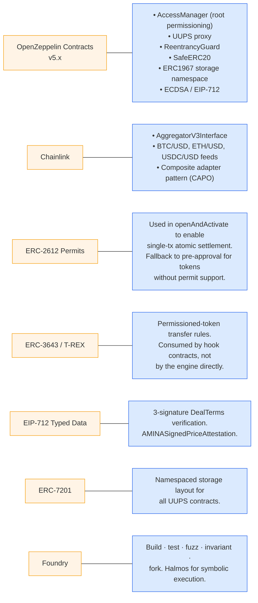

**Strict dependency policy**: only audited libraries from OpenZeppelin v5.x are vendored in. Chainlink integration is via interface, no concrete dependency. Custodian token contracts are referenced only by their ERC-20 interface; their internal complexity is bounded by the compliance hook.

---

## 7. Roles, permissions, and access control

### 7.1 Role hierarchy

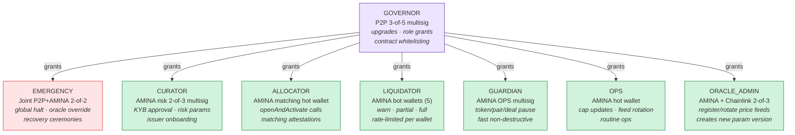

### 7.2 Access-control matrix

The matrix below shows which role can call each privileged function. `*` = anyone (permissionless); `—` = no one (impossible by design).

| Function | GOVERNOR | EMERGENCY | CURATOR | ALLOCATOR | LIQUIDATOR | GUARDIAN | OPS | ORACLE_ADMIN | * |
|---|:---:|:---:|:---:|:---:|:---:|:---:|:---:|:---:|:---:|
| `RoleManager.grantRole` | ✓ | | | | | | | | |
| `LendingEngine` upgrade | ✓ +TL | | | | | | | | |
| `KYBGateway.setStatus` | | | ✓ | | | | | | |
| `IssuerRegistry.addToken` | | | ✓ +TL | | | | | | |
| `IssuerRegistry.pauseToken` | | | | | | ✓ | | | |
| `IssuerRegistry.setCap` increase | | | ✓ +TL | | | | | | |
| `IssuerRegistry.setCap` decrease | | | ✓ | | | | ✓ | | |
| `ComplianceRegistry.registerHook` | | | ✓ +TL | | | | | | |
| `CollateralRegistry.addPair` | | | ✓ +TL | | | | | | |
| `CollateralRegistry.updatePair` (LTV tighten) | | | ✓ +TL | | | | | | |
| `CollateralRegistry.updatePair` (LTV loosen) | | | ✓ | | | | | | |
| `CollateralRegistry.pausePair` | | | | | | ✓ | | | |
| `OracleRotation` (new version) | | | | | | | | ✓ | |
| `LendingEngine.openAndActivate` | | | | ✓ | | | | | |
| `LendingEngine.repay` | | | | | | | | | ✓ |
| `LendingEngine.topUpCollateral` | | | | | | | | | ✓ (borrower) |
| `LendingEngine.claimUnreleasedCollateral` | | | | | | | | | ✓ (borrower) |
| `LendingEngine.pauseDeal` | | | | | | ✓ | | | |
| `LendingEngine.unpauseDeal` | | | | | | ✓ +TL | | | |
| `LendingEngine.globalHalt` | | ✓ | | | | | | | |
| `LiquidationHandler.warn` | | | | | ✓ | | | | |
| `LiquidationHandler.partial` | | | | | ✓ | | | | |
| `LiquidationHandler.full` | | | | | ✓ | | | | |
| `LendingEngine.forceOracleOverride` | | ✓ | | | | | | | |

*+TL = subject to timelock delay (default 24h, emergency-shortenable to 1h by EMERGENCY)*

### 7.3 Role action speed

```mermaid
gantt
    title Role action latencies (typical, not strict)
    dateFormat X
    axisFormat %s

    section Slow (timelocked)
    GOVERNOR upgrade            :a1, 0, 86400
    CURATOR risk tighten        :a2, 0, 86400
    CURATOR issuer onboard      :a3, 0, 86400

    section Medium
    CURATOR risk loosen         :b1, 0, 600
    ORACLE_ADMIN feed rotate    :b2, 0, 600

    section Fast (no timelock)
    ALLOCATOR open deal         :c1, 0, 12
    LIQUIDATOR warn             :c2, 0, 12
    LIQUIDATOR partial          :c3, 0, 12
    LIQUIDATOR full             :c4, 0, 12
    GUARDIAN token pause        :c5, 0, 12
    EMERGENCY global halt       :c6, 0, 12
    EMERGENCY oracle override   :c7, 0, 12
    OPS routine cap update      :c8, 0, 60
```

### 7.4 Why this many roles

The split exists to ensure **no single key compromise can drain the protocol**:

- Compromising `ALLOCATOR` lets the attacker open spurious deals, but each deal requires valid lender + borrower signatures the attacker doesn't have.
- Compromising `LIQUIDATOR` lets the attacker trigger liquidations, but each call requires a valid health factor below threshold and is bounded by step counter + per-wallet daily caps.
- Compromising `GUARDIAN` lets the attacker pause things (annoying but recoverable; nothing leaves the protocol).
- Compromising `CURATOR` requires 2-of-3 multisig and the more dangerous calls are timelocked.
- Compromising `GOVERNOR` requires 3-of-5 multisig and upgrades are timelocked.
- Compromising `EMERGENCY` requires both P2P and AMINA to be compromised simultaneously (2-of-2 cross-org).

No single role can both *open new deals* and *drain existing ones*. That property is the access-control safety net.

---

## 8. Data model

### 8.1 Core structs

```mermaid
classDiagram
    direction LR

    class DealTerms {
        +address lender
        +address borrower
        +address supplyToken
        +address collateralToken
        +uint128 principal
        +uint128 collateralAmount
        +uint32 rateBps
        +uint64 startTs
        +uint64 maturityTs
        +bytes32 pairKey
        +uint32 paramVersion
        +bytes32 nonceLender
        +bytes32 nonceBorrower
        +bytes32 termsHash
    }

    class DealState {
        +DealStateEnum state
        +uint128 outstanding
        +uint128 collateralPosted
        +uint64 lastTouchTs
        +uint8 liquidationStep
        +uint64 pauseStartedAt
        +uint64 totalPausedTime
        +bytes32 lastPauseReason
        +uint32 versionKey
    }

    class DealStateEnum {
        <<enumeration>>
        None
        Active
        Warned
        Liquidating
        Matured
        Repaid
        Repaid_PendingCollateralRelease
        Liquidated
        Defaulted
    }

    class Params {
        +uint16 ltvBps
        +uint16 warningBps
        +uint16 partialLiqBps
        +uint16 fullLiqBps
        +uint32 maxMaturity
        +uint16 maxRateBps
        +uint16 liquidationBonusBps
        +uint16 aminaFeeBps
        +address priceSourceCollateral
        +address priceSourceSupply
        +uint32 heartbeatCollateral
        +uint32 heartbeatSupply
        +bool active
    }

    class TokenInfo {
        +address custodian
        +TokenKind kind
        +uint8 decimals
        +uint128 cap
        +uint128 outstandingNotional
        +bool paused
        +bytes32 attestationHash
    }

    class TokenKind {
        <<enumeration>>
        Supply
        Collateral
        DualUse_DisabledByDefault
    }

    class KybRecord {
        +KybStatus status
        +uint64 approvedAt
        +uint64 expiryTs
        +bytes32 documentsHash
        +address approvedBy
    }

    class KybStatus {
        <<enumeration>>
        Unknown
        Approved
        Suspended
        Revoked
    }

    class Caps {
        +uint128 globalNotionalCap
        +uint128 globalOutstanding
        +mapping perTokenCap
        +mapping perPairCap
        +mapping perCustodianCap
        +mapping perBorrowerCap
        +mapping perMaturityBucketCap
        +mapping perLiquidatorDailyCap
    }

    class LiqState {
        +uint8 phase
        +uint64 phaseEnteredAt
        +uint128 cumulativeLiquidated
        +bytes32 lastReasonCode
    }

    class AMINASignedPriceAttestation {
        +bytes32 sourceId
        +uint256 observedPrice
        +uint64 observationTs
        +bytes32 reasonCode
        +bytes signature
    }

    DealTerms --> DealState : "1:1 via dealId"
    DealTerms --> Params : "via pairKey + paramVersion"
    DealState --> DealStateEnum
    Params --> TokenInfo : "supplyToken, collateralToken"
    TokenInfo --> TokenKind
    KybRecord --> KybStatus
```

### 8.2 Key relationships

- `dealId = keccak256(abi.encode(DealTerms))` — content-addressable, identical terms produce the same ID (preventing duplicate records).
- `pairKey = keccak256(abi.encodePacked(collateralToken, supplyToken))`.
- `paramVersion` is snapshotted into `DealTerms` at creation; the engine reads `ParameterArchive[pairKey][paramVersion]` for the life of the deal.
- `termsHash` is the EIP-712 hash of the entire `DealTerms` struct, used for signature verification.

### 8.3 Storage namespacing (ERC-7201)

Every upgradeable contract uses ERC-7201 namespaced storage:

```solidity
// keccak256(abi.encode(uint256(keccak256("p2pxamina.LendingEngine.storage.v1")) - 1))
//   & ~bytes32(uint256(0xff))
bytes32 private constant ENGINE_STORAGE_SLOT =
    0x82f3a0e3...c00;

struct EngineStorage {
    mapping(bytes32 => DealState) state;
    mapping(bytes32 => bool) pausedDeals;
    Caps caps;
    bool globalHalted;
    uint128 totalActiveNotional;
}

function _engineStorage() private pure returns (EngineStorage storage s) {
    bytes32 slot = ENGINE_STORAGE_SLOT;
    assembly { s.slot := slot }
}
```

CI verifies that the storage slot constant does not change between releases.

---

## 9. Deal state machine

```mermaid
stateDiagram-v2
    [*] --> None

    None --> Active: openAndActivate<br/>(atomic settlement)

    Active --> Active: topUpCollateral
    Active --> Active: repay (partial)
    Active --> Repaid: repay (full)
    Active --> Repaid_PendingCollateralRelease: repay (full)<br/>but collateral release blocked
    Active --> Warned: warn<br/>(HF crossed warningBps)
    Active --> Matured: settleMaturity<br/>(maturity passed)
    Active --> Active: pauseDeal / unpauseDeal

    Warned --> Active: topUpCollateral<br/>(borrower cures)
    Warned --> Active: repay (partial brings HF back)
    Warned --> Liquidating: partialLiquidate<br/>(grace expired)
    Warned --> Repaid: repay (full)

    Matured --> Repaid: repay (full)
    Matured --> Repaid_PendingCollateralRelease: repay (full)<br/>blocked release
    Matured --> Liquidating: fullLiquidate<br/>(grace expired)

    Liquidating --> Liquidating: partialLiquidate<br/>(step++)
    Liquidating --> Active: borrower cures<br/>via topUpCollateral
    Liquidating --> Liquidated: fullLiquidate<br/>(collateral &gt;= debt+bonus)
    Liquidating --> Defaulted: fullLiquidate<br/>(collateral &lt; debt+bonus)

    Repaid_PendingCollateralRelease --> Repaid: claimUnreleasedCollateral<br/>(issuer freeze lifted)

    Repaid --> [*]
    Liquidated --> [*]
    Defaulted --> [*]

    note right of None: Deal never recorded.
    note right of Active: Interest accruing.<br/>HF computed JIT.
    note right of Warned: 48h borrower grace.<br/>Interest still accruing.
    note right of Liquidating: AMINA partial liq in progress.<br/>Step counter monotonic.
    note right of Repaid_PendingCollateralRelease: Borrower paid in full;<br/>collateral stuck due to<br/>issuer-side freeze.
    note right of Defaulted: Residual debt after full liq.<br/>Booked off-chain to AMINA.
```

### 9.1 Transition guards

| From → To | Guard |
|---|---|
| `None → Active` | 3 valid sigs + KYB approved for L &amp; B + token caps OK + pair active + oracle fresh |
| `Active → Warned` | HF crossed `warningBps`; called by `LIQUIDATOR` |
| `Warned → Active` | HF back ≥ 1.0 after top-up or partial repay; **automatic** on `topUpCollateral` |
| `Warned → Liquidating` | HF crossed `partialLiqBps` AND grace expired; `LIQUIDATOR` only |
| `Active|Warned → Repaid` | `outstanding == 0` after repay; collateral release succeeds |
| `Active|Warned → Repaid_PendingCollateralRelease` | `outstanding == 0` but collateral release reverts (e.g., token-issuer froze vault) |
| `Repaid_PendingCollateralRelease → Repaid` | Borrower calls `claimUnreleasedCollateral` and the transfer succeeds |
| `Liquidating → Liquidated` | `fullLiquidate` succeeds and `collateralValueAtClose >= debt + bonus` |
| `Liquidating → Defaulted` | `fullLiquidate` succeeds but `collateralValueAtClose < debt + bonus` |
| `Active → Matured` | `block.timestamp >= effectiveMaturityTs`; permissionless, anyone can trigger |
| `Matured → Liquidating` | Grace expired after maturity; `LIQUIDATOR` only |

### 9.2 Why these specific states

- **`Repaid_PendingCollateralRelease`** distinguishes "borrower has paid the debt and is owed their collateral" from "deal is fully closed." Without this state, an issuer-side freeze in the middle of a `repay` call would either revert the whole repay (trapping the borrower's payment) or leave the deal in an inconsistent state. Splitting them out preserves the borrower's claim on the collateral.
- **No `Pending` state**. The engine never carries a recorded-but-not-funded deal. Either the atomic activation succeeds or nothing is written. This eliminates the v0.1 "pending deal expiry" concern.
- **`Defaulted` is distinct from `Liquidated`** because it triggers a separate off-chain event (`Defaulted(dealId, shortfallUsd)`) that AMINA's accounting picks up to record the shortfall.

---

## 10. User stories

### 10.1 Lender — "Anna, treasury manager at a regional bank"

- **As Anna, I want to lend out my idle USDC at institutional rates** so my balance sheet earns yield without exposure to permissionless DeFi.
- **As Anna, I want to see one position, one rate, one maturity** even if AMINA's engine has split my order across multiple borrowers.
- **As Anna, I want assurance that my counterparties are KYB'd** to the same standard as my own onboarding clients.
- **As Anna, I want my legal position recorded immutably** so that if a dispute arises, the trade confirmation is on-chain.

### 10.2 Borrower — "Bruno, treasurer at a crypto-native hedge fund"

- **As Bruno, I want to access cash without selling my BTC** so I don't trigger a taxable event or lose market exposure.
- **As Bruno, I want to know the exact rate before I commit** — no surprises after the fact.
- **As Bruno, if my position goes south, I want a chance to cure** by topping up collateral before AMINA liquidates.
- **As Bruno, if I am liquidated, I want any surplus collateral returned to my wallet** automatically, not held by the protocol.

### 10.3 AMINA risk desk — "Riccardo, head of credit risk"

- **As Riccardo, I want to tighten LTVs on Class B collateral without retroactively endangering live deals.** Grandfathering is mandatory.
- **As Riccardo, I want to see every deal's health factor in real time** with off-chain monitoring backed by on-chain state.
- **As Riccardo, I want to onboard a new custodian or token type via a documented, timelocked process** so legal can review.
- **As Riccardo, when an oracle goes stale, I need to be able to liquidate using my own off-chain price data, with on-chain evidence of which price I used.**

### 10.4 AMINA OPS — "Olivia, runs the liquidation bots"

- **As Olivia, I want my bots to send warn/partial/full calls with idempotency** so a network hiccup can't cause a double action.
- **As Olivia, I want per-bot daily caps** so a compromised bot wallet can't drain the system.
- **As Olivia, I want to pause specific tokens fast** when a custodian flags an issue, without going through a multisig ceremony.

### 10.5 P2P Staking — "Pierre, CTO of P2P Staking"

- **As Pierre, I want clear separation between governance (mine) and risk decisions (AMINA's)** so I never get accused of credit-decision overreach.
- **As Pierre, I want upgrades behind a timelock** with a clear emergency-shortened path for actual emergencies.
- **As Pierre, I want every privileged call to leave a loud event** so monitoring can detect anomalies fast.

### 10.6 Custodian integrator — "Cathy, engineering lead at Fireblocks"

- **As Cathy, I want a stable, documented event schema** so my listener can ingest settlement intents without coupling to the engine's storage layout.
- **As Cathy, I want compliance hooks to receive enough context** to make per-transfer decisions (which deal, which action, who is sending to whom).
- **As Cathy, I want to be able to pause my custody's tokens at the protocol level** independently of pausing them at the token-contract level.

### 10.7 Auditor — "Adrian, lead auditor at a top firm"

- **As Adrian, I want a small, focused codebase** I can fully reason about in a few weeks.
- **As Adrian, I want every privileged role's blast radius documented** so I can systematically search for privilege escalation.
- **As Adrian, I want invariants stated as test targets** so I can verify both implementation correctness and design coherence.

---

## 11. Use cases

This section describes each major use case in narrative form plus a sequence diagram.

### 11.1 Counterparty onboarding (KYB)

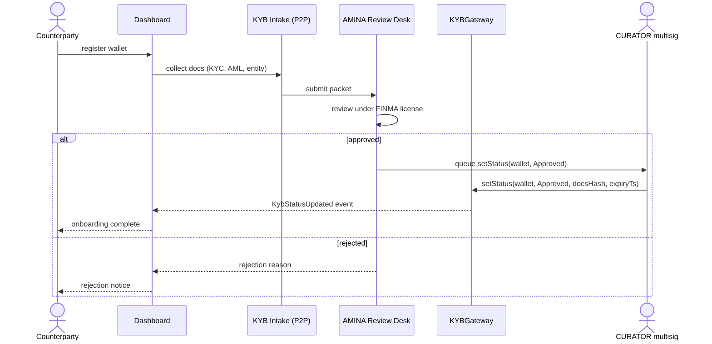

**Key properties**:
- KYB is the **only** gate by which a wallet becomes eligible.
- Approval has an `expiryTs` (e.g., 365 days). Re-attestation is required periodically.
- `documentsHash` anchors the on-chain row to the off-chain document packet held by AMINA.

### 11.2 Issuer (custodian + token) onboarding

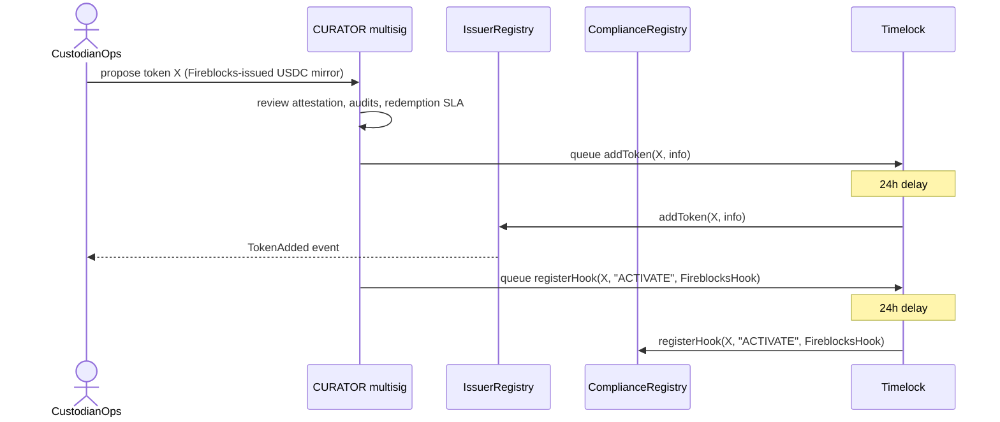

**Key properties**:
- Both `addToken` and `registerHook` are timelocked.
- The compliance hook contract must itself be audited as part of the onboarding packet.
- `IssuerRegistry.addToken` records the `attestationHash` — the off-chain custody attestation that this token is 1:1 backed.

### 11.3 Pair onboarding (risk parameters)

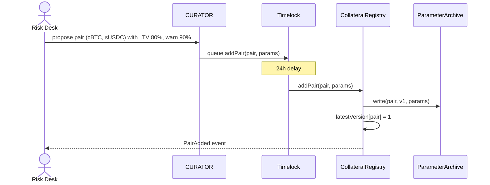

### 11.4 Opening a deal (atomic activation) — the central flow

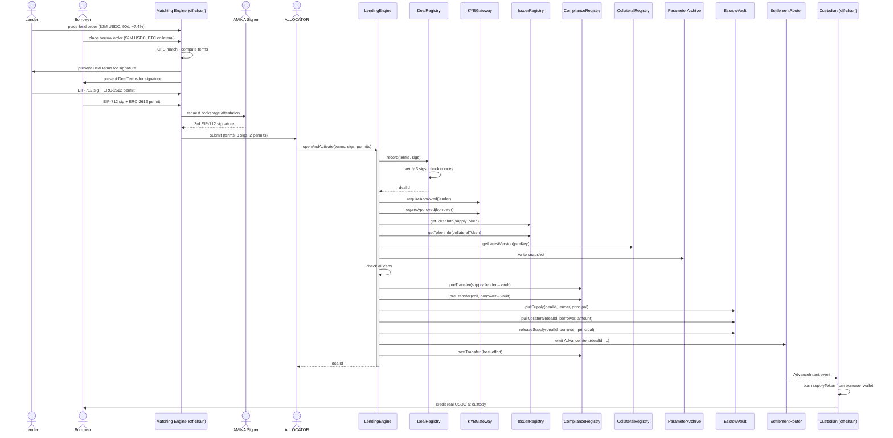

**Single transaction.** Steps from `openAndActivate` through `emit AdvanceIntent` all happen in one transaction. If any check fails, the entire transaction reverts and no state has changed.

**Pre-conditions verified**:
1. Three valid signatures over the `termsHash`.
2. Nonces unused for both lender and borrower.
3. Both wallets KYB-approved and unexpired.
4. Both tokens registered, not paused, of correct `kind`.
5. Pair active and not paused.
6. Oracle fresh.
7. All cap dimensions allow this deal.
8. Compliance hooks return `ok=true`.

### 11.5 Top-up collateral

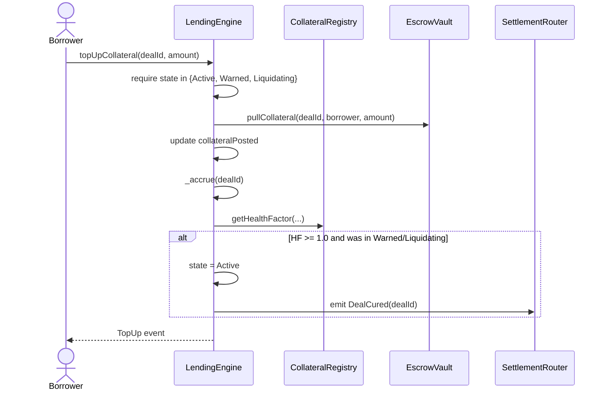

### 11.6 Repay (normal path)

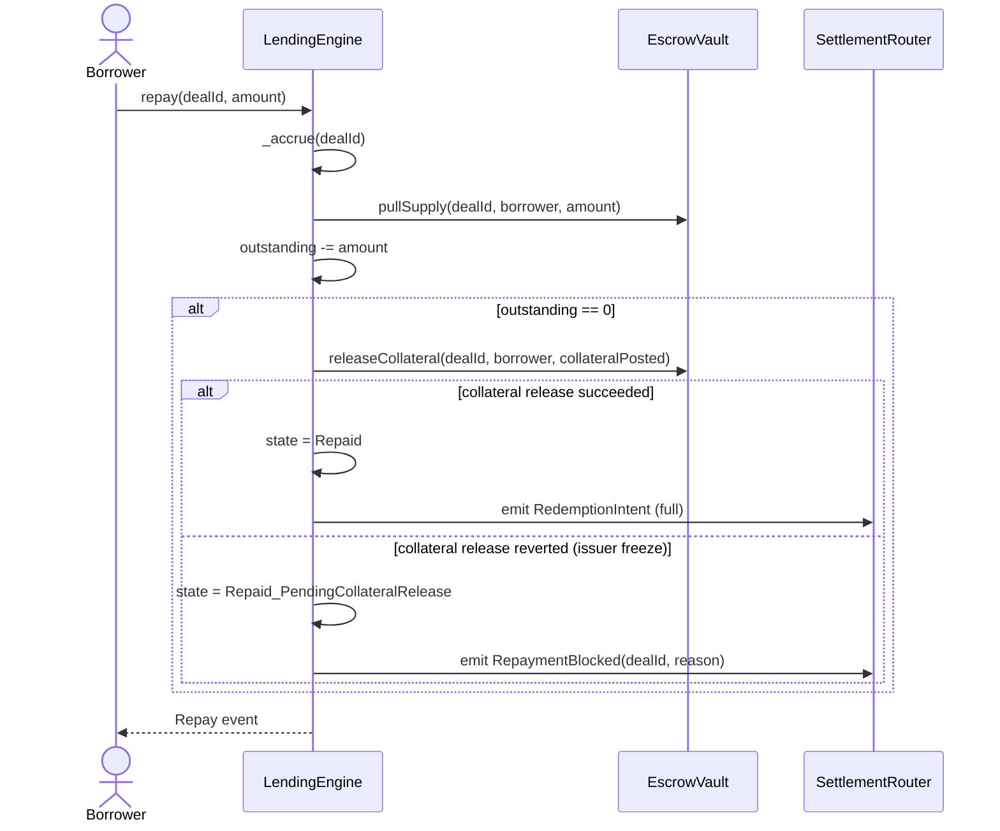

### 11.7 Warning trigger

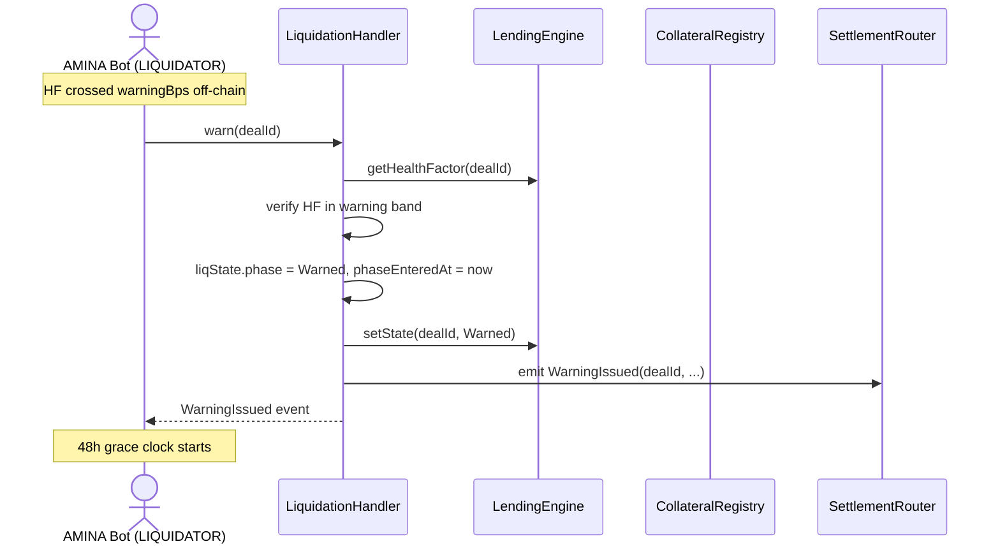

### 11.8 Partial liquidation

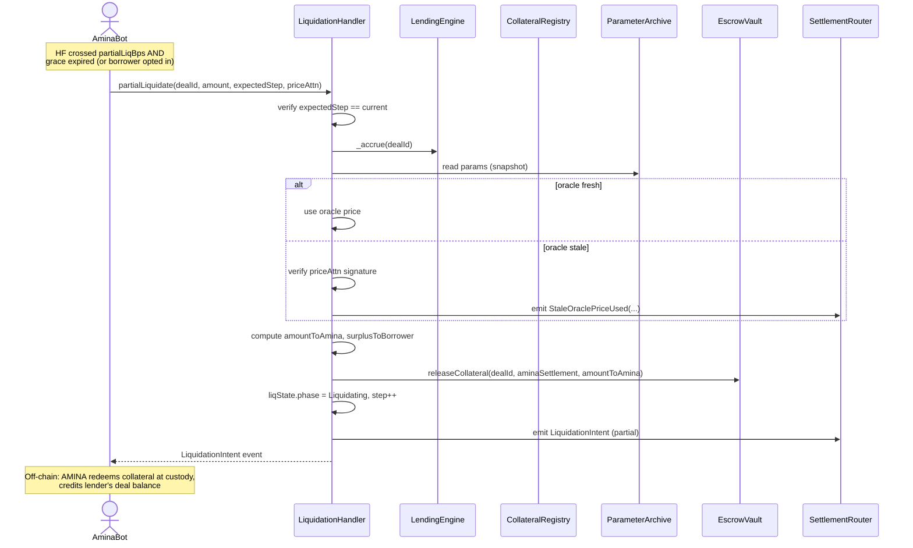

### 11.9 Full liquidation with surplus return

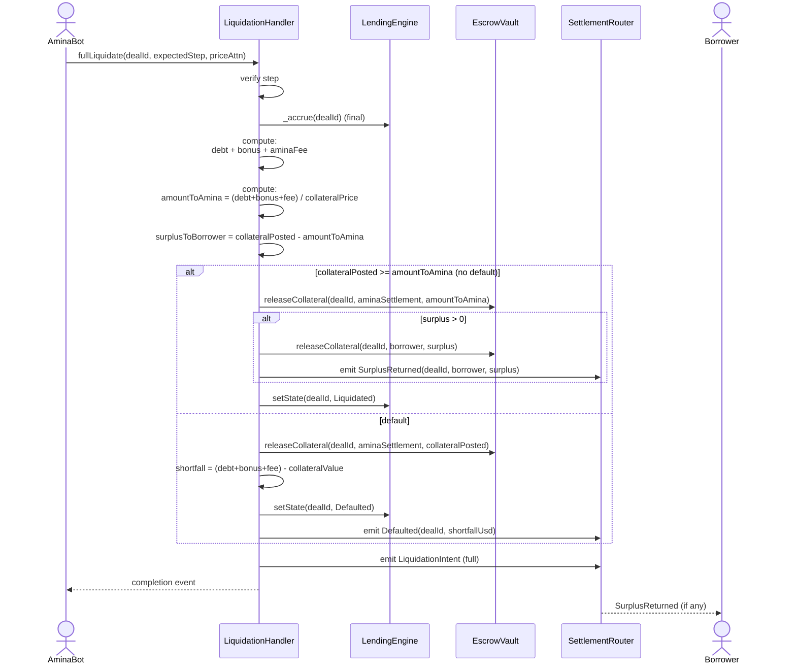

### 11.10 Force oracle override (EMERGENCY)

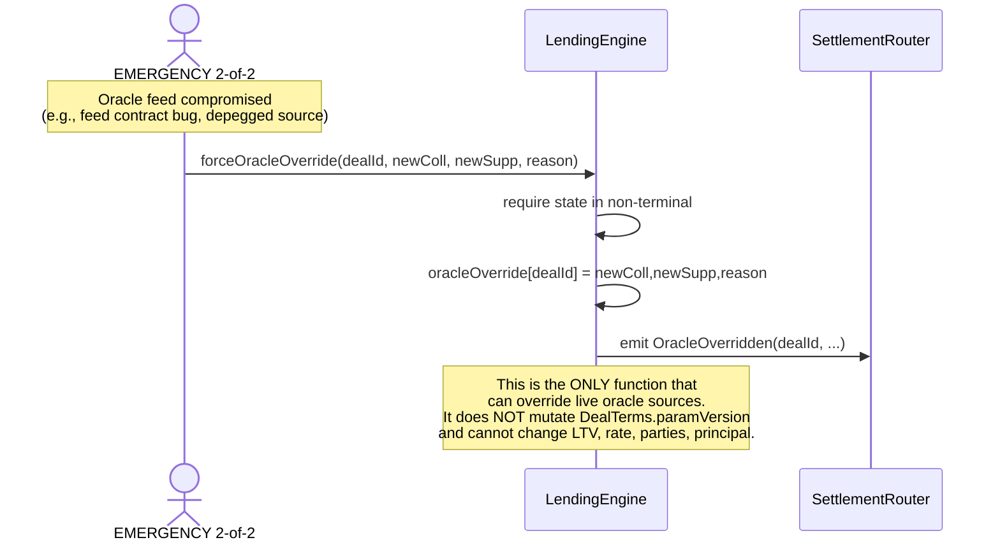

### 11.11 Engine upgrade recovery ceremony

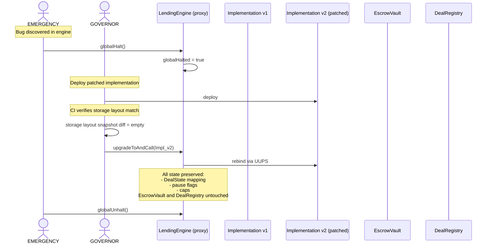

**Key property**: because `EscrowVault` and `DealRegistry` are immutable and the engine's state lives in ERC-7201 namespaced storage, the engine can be replaced without touching funds or deal records.

### 11.12 Token freeze recovery (`Repaid_PendingCollateralRelease`)

```mermaid
sequenceDiagram
    actor Borrower
    participant LendingEngine
    participant EscrowVault
    participant TokenContract as Collateral Token

    Note over Borrower,TokenContract: At repay time, issuer had frozen EscrowVault;<br/>deal moved to Repaid_PendingCollateralRelease

    Note over TokenContract: Hours/days later: issuer unfreezes
    Borrower->>LendingEngine: claimUnreleasedCollateral(dealId)
    LendingEngine->>EscrowVault: releaseCollateral(dealId, borrower, posted)
    EscrowVault->>TokenContract: transfer(borrower, posted)
    TokenContract-->>EscrowVault: success
    LendingEngine->>LendingEngine: state = Repaid
    LendingEngine-->>Borrower: Repaid event
```

---

## 12. Fund-flow diagrams

### 12.1 Happy path: open → accrue → repay

```mermaid
flowchart LR
    classDef wallet fill:#fff4e6,stroke:#f59e0b
    classDef vault fill:#ede5ff,stroke:#8b5cf6
    classDef custody fill:#f0faf3,stroke:#22c55e

    LenderW["Lender wallet<br/>sUSDC: 2M"]
    BorrowerW["Borrower wallet<br/>cBTC: 25"]
    Vault["EscrowVault<br/>(per-deal ledger)"]
    BorrowerR["Borrower wallet<br/>(after advance)"]
    Custody["Custodian<br/>(real USDC redemption)"]

    LenderW -->|"① pullSupply<br/>2M sUSDC"| Vault
    BorrowerW -->|"② pullCollateral<br/>25 cBTC"| Vault
    Vault -->|"③ releaseSupply<br/>2M sUSDC"| BorrowerR
    BorrowerR -.->|"④ off-chain redeem"| Custody
    Custody -->|"⑤ real USDC paid"| BorrowerR

    BorrowerR -->|"⑥ at maturity:<br/>pullSupply 2M + interest"| Vault
    Vault -->|"⑦ releaseCollateral<br/>25 cBTC"| BorrowerW

    class LenderW,BorrowerW,BorrowerR wallet
    class Vault vault
    class Custody custody
```

### 12.2 Liquidation path with surplus

```mermaid
flowchart LR
    classDef wallet fill:#fff4e6,stroke:#f59e0b
    classDef vault fill:#ede5ff,stroke:#8b5cf6
    classDef amina fill:#ffe4e6,stroke:#dc2626
    classDef custody fill:#f0faf3,stroke:#22c55e

    Vault["EscrowVault<br/>collateralPosted: 25 cBTC<br/>outstanding: 1.05M sUSDC<br/>(debt 1M + bonus 5%)"]
    AminaW["AMINA settlement<br/>wallet"]
    BorrowerW["Borrower wallet"]
    Custody["Custodian"]
    Lender["Lender (off-chain)"]

    Vault -->|"① releaseCollateral<br/>21 cBTC<br/>(= 1.05M USDC / 50k cBTCprice)"| AminaW
    Vault -->|"② releaseCollateral<br/>4 cBTC surplus"| BorrowerW

    AminaW -.->|"③ off-chain<br/>redeem at custody"| Custody
    Custody -->|"④ real BTC sold,<br/>USDC paid"| Lender

    class Vault vault
    class AminaW amina
    class BorrowerW wallet
    class Custody custody
```

### 12.3 Default path

```mermaid
flowchart LR
    classDef wallet fill:#fff4e6,stroke:#f59e0b
    classDef vault fill:#ede5ff,stroke:#8b5cf6
    classDef amina fill:#ffe4e6,stroke:#dc2626

    Vault["EscrowVault<br/>collateralPosted: 25 cBTC<br/>collateral value: 950k USDC<br/>outstanding: 1.05M sUSDC<br/>shortfall: 100k"]
    AminaW["AMINA settlement"]
    Books["AMINA off-chain books<br/>shortfall recorded"]

    Vault -->|"① releaseCollateral<br/>25 cBTC (all)"| AminaW
    AminaW -.->|"② emit Defaulted<br/>(shortfall 100k)"| Books

    class Vault vault
    class AminaW amina
    class Books amina
```

**Important**: the shortfall does NOT propagate to other deals or to lenders of *this* deal. AMINA absorbs the shortfall (its regulatory and contractual obligation). The chain records it for audit.

---

## 13. Settlement and off-chain integration

### 13.1 `SettlementRouter` event schema

The router emits **typed intents** that custodian listeners and AMINA's reconciliation system subscribe to:

```solidity
event AdvanceIntent(
    bytes32 indexed dealId,
    address indexed supplyToken,
    uint256 amount,
    address indexed beneficiary,    // typically borrower
    bytes32 settlementRef,           // off-chain reference for ack
    uint64 expectedSettlementDeadline
);

event RedemptionIntent(
    bytes32 indexed dealId,
    address indexed supplyToken,
    uint256 amount,
    address indexed beneficiary,    // typically lender
    bytes32 settlementRef,
    uint64 expectedSettlementDeadline
);

event LiquidationIntent(
    bytes32 indexed dealId,
    LiquidationPhase phase,         // Partial or Full
    address indexed collateralToken,
    uint256 amount,
    address indexed aminaSettlement,
    bytes32 reasonCode
);

event SurplusReturned(
    bytes32 indexed dealId,
    address indexed beneficiary,    // borrower
    address indexed collateralToken,
    uint256 amount
);

event Defaulted(
    bytes32 indexed dealId,
    uint256 shortfallUsd,
    bytes32 detailsHash             // hash of off-chain shortfall packet
);

event StaleOraclePriceUsed(
    bytes32 indexed dealId,
    bytes32 sourceId,
    uint256 observedPrice,
    uint64 observationTs,
    bytes32 reasonCode
);

event RepaymentBlocked(
    bytes32 indexed dealId,
    address indexed token,
    bytes32 reasonCode
);
```

**GPT v2 rule.** Event schemas are part of the custody integration contract. New fields must be added by emitting new versioned events or deploying `SettlementRouterV2`; existing event meanings must never change.

### 13.2 Listener responsibilities

Custodian listeners are expected to:

1. Subscribe to all relevant events at the protocol's settlement-router address.
2. Buffer events to a durable queue with at-least-once delivery semantics.
3. For each intent, look up the local custody account, perform the corresponding action (burn token + credit real asset, or transfer between sub-accounts), and acknowledge by writing a `settlementRef` to the protocol-side reconciliation database.
4. Reconcile every 6 hours: walk all events emitted since the last reconciliation, confirm each has either a successful acknowledgement or an explicit failure reason.

### 13.3 Reconciliation invariant

For every `AdvanceIntent` or `LiquidationIntent` emitted at block N:

- Custodian acknowledgement must arrive within `expectedSettlementDeadline - 4h`, or AMINA's OPS team is paged.
- Custodian's `settlementRef` must match the `settlementRef` in the intent.
- The custodian's accounting of the off-chain asset movement must sum, across all intents in the day, to the day's net flow.

---

## 14. Liquidation engine deep dive

### 14.1 Three-phase state machine

```mermaid
stateDiagram-v2
    [*] --> Healthy

    Healthy --> Warned: HF crossed warningBps<br/>(LIQUIDATOR.warn)
    Warned --> Healthy: borrower top-up (HF >= 1)
    Warned --> Healthy: partial repay (HF >= 1)
    Warned --> Liquidating_P1: grace expired AND HF crossed partialLiqBps<br/>(LIQUIDATOR.partialLiquidate)

    Liquidating_P1 --> Liquidating_P2: HF still below partialLiqBps after partial<br/>(LIQUIDATOR.partialLiquidate again)
    Liquidating_P1 --> Healthy: borrower cures via top-up
    Liquidating_P1 --> FullLiq: HF crossed fullLiqBps<br/>(LIQUIDATOR.fullLiquidate)
    Liquidating_P2 --> FullLiq: HF crossed fullLiqBps
    Liquidating_P2 --> Healthy: borrower cures

    FullLiq --> Closed_Surplus: collateral >= debt+bonus
    FullLiq --> Closed_Default: collateral < debt+bonus

    Closed_Surplus --> [*]
    Closed_Default --> [*]

    note right of Warned: 48h grace clock starts<br/>Interest still accrues
    note right of Liquidating_P1: Step counter = 1<br/>monotonic
    note right of FullLiq: Step counter = N<br/>Final accrual
```

### 14.2 Step counter discipline

Every liquidation call carries an `expectedStep` argument. The engine compares against `liqState.phase` + cumulative step number. Mismatch → revert.

This prevents:
- Double-spend if the AMINA bot retries a call that already succeeded.
- Race conditions if two AMINA bot wallets attempt to act concurrently.
- Out-of-order execution if a queued tx lands after a more recent one.

### 14.3 Surplus computation

```
Inputs:
  outstanding         = principal + accruedInterest (sUSDC, scaled)
  collateralPosted    = current collateral balance (cBTC, scaled)
  priceCollateral     = price (USD per cBTC unit, from oracle or attestation)
  priceSupply         = price (USD per sUSDC unit, typically near 1)
  bonusBps            = liquidation bonus (e.g., 500 = 5%)
  aminaFeeBps         = AMINA's per-liquidation fee (e.g., 100 = 1%)

Compute:
  debtUsd             = outstanding * priceSupply
  payoutNeededUsd     = debtUsd * (10000 + bonusBps + aminaFeeBps) / 10000
  collateralValueUsd  = collateralPosted * priceCollateral
  amountToAmina       = min(collateralPosted, payoutNeededUsd / priceCollateral)
  surplusToBorrower   = collateralPosted - amountToAmina

If collateralValueUsd >= payoutNeededUsd:
    state = Liquidated
    surplus returned to borrower
Else:
    state = Defaulted
    shortfallUsd = payoutNeededUsd - collateralValueUsd
    surplus = 0
```

### 14.4 Stale-oracle liquidation path

```mermaid
flowchart TB
    A["LIQUIDATOR.partialLiquidate(...)"] --> B{"Oracle fresh?"}
    B -->|Yes| C["Use oracle price"]
    B -->|No| D{"signedAttn provided?"}
    D -->|No| E[revert: STALE_ORACLE_NO_ATTESTATION]
    D -->|Yes| F["Verify signature against<br/>AMINA risk-desk public key"]
    F --> G{"signature valid<br/>AND observationTs > lastTouchTs?"}
    G -->|No| H[revert: INVALID_ATTESTATION]
    G -->|Yes| I["Use attestation price<br/>Emit StaleOraclePriceUsed event"]
    C --> J[continue liquidation]
    I --> J
```

The attestation is an evidence trail, not a verification mechanism. The contract trusts AMINA's signature; the audit trail proves AMINA staked its name on the price used.

---

## 15. Risk parameters and versioning

```mermaid
flowchart LR
    classDef live fill:#dbeafe,stroke:#2563eb,color:#111
    classDef archived fill:#f3f4f6,stroke:#6b7280,color:#444

    subgraph Latest["CollateralRegistry (mutable)"]
        L["latestVersion[pair] = 5<br/>paramsByPair[pair]:<br/>LTV 75% · warn 85%"]
    end

    subgraph Archive["ParameterArchive (immutable)"]
        V1["v1: LTV 80% warn 88%"]
        V2["v2: LTV 80% warn 90%"]
        V3["v3: LTV 78% warn 88%"]
        V4["v4: LTV 76% warn 86%"]
        V5["v5: LTV 75% warn 85%<br/><i>= current</i>"]
    end

    subgraph Deals["Live deals"]
        D1["Deal A (Mar 1)<br/>versionKey = 2"]
        D2["Deal B (Apr 15)<br/>versionKey = 4"]
        D3["Deal C (May 20)<br/>versionKey = 5"]
    end

    L -.->|"snapshot on creation"| Archive
    D1 -.->|"reads"| V2
    D2 -.->|"reads"| V4
    D3 -.->|"reads"| V5

    class L live
    class V1,V2,V3,V4,V5 archived
```

### 15.1 Rebinding rules

- **Risk-reducing actions** (top-up, partial repay): always allowed under the snapshotted version. No rebind.
- **Risk-increasing actions**: not possible after deal creation — deals are immutable. So rebinding doesn't apply.
- **New deals**: always use `latestVersion`.
- **Emergency override (oracle source only)**: `EMERGENCY.forceOracleOverride` is the only way to alter the oracle used by a live deal. It must not mutate `DealTerms.paramVersion`; it writes `oracleOverride[dealId]` and emits a loud event. It cannot alter any economic parameter.

### 15.2 Version-bump procedure

1. CURATOR proposes new `Params` for a pair.
2. Timelock delay (24h default; for an emergency tightening only, 1h).
3. On execution:
   - Old params are written to `ParameterArchive[pair][oldVersion]` (one-time write; the slot was empty).
   - `latestVersion[pair]++`.
   - New params are written to `paramsByPair[pair]`.
4. Event `PairUpdated(pair, oldVersion, newVersion, paramsDiff)` is emitted.

---

## 16. Oracle architecture

### 16.1 Composite adapters

```mermaid
flowchart LR
    classDef cl fill:#fff4e6,stroke:#f59e0b
    classDef adapter fill:#dbeafe,stroke:#2563eb
    classDef pair fill:#ede5ff,stroke:#8b5cf6

    BTCUSD["Chainlink<br/>BTC/USD"]
    LBTC_BTC["Internal feed<br/>LBTC/BTC<br/>(Lombard rate)"]
    LBTC_BTC_CAPO["CAPO Adapter<br/>LBTC/BTC<br/>max 2%/yr growth"]
    LBTCUSD["Composite<br/>LBTC/USD"]
    ETHUSD["Chainlink<br/>ETH/USD"]
    USDCUSD["Chainlink<br/>USDC/USD"]

    Pair1["Pair (cLBTC, sUSDC)<br/>uses LBTCUSD &amp; USDCUSD"]
    Pair2["Pair (cETH, sUSDC)<br/>uses ETHUSD &amp; USDCUSD"]

    LBTC_BTC --> LBTC_BTC_CAPO
    LBTC_BTC_CAPO --> LBTCUSD
    BTCUSD --> LBTCUSD

    LBTCUSD --> Pair1
    USDCUSD --> Pair1
    ETHUSD --> Pair2
    USDCUSD --> Pair2

    class BTCUSD,LBTC_BTC,ETHUSD,USDCUSD cl
    class LBTC_BTC_CAPO,LBTCUSD adapter
    class Pair1,Pair2 pair
```

### 16.2 Heartbeat enforcement

Each feed has a per-pair `heartbeat` (seconds). At read time:

```solidity
function getPrice(address feed, uint32 heartbeat) internal view returns (uint256, bool stale) {
    (, int256 answer, , uint256 updatedAt, ) = AggregatorV3Interface(feed).latestRoundData();
    require(answer > 0, "BAD_PRICE");
    stale = (block.timestamp - updatedAt) > heartbeat;
    return (uint256(answer), stale);
}
```

**The stale flag is informational, not a hard revert.** Callers decide policy:
- `LendingEngine.openAndActivate` rejects new deals if any feed is stale.
- `LendingEngine.repay` accepts repayments at last sane price (favours borrower).
- `LiquidationHandler.*` accepts liquidations IFF a signed price attestation is provided.

### 16.3 Circuit breakers

Two-tier:

1. **Per-feed**: if a feed reports a price that diverges from the previous reading by more than a `maxDelta` (e.g., 30% in one heartbeat), the feed enters a circuit-broken state. All new deals using this feed are blocked; liquidations require attestations.
2. **Global**: if ≥3 feeds break their circuit simultaneously, `EMERGENCY` should issue a global halt to investigate.

---

## 17. Compliance hooks

### 17.1 Hook interfaces

```solidity
interface ICompliancePreHook {
    /// @notice Pre-transfer eligibility check. MUST be view-callable (staticcall).
    /// @return ok If false, the surrounding action reverts.
    /// @return reasonCode Typed error code; see ReasonCodes.sol for known values.
    function preTransfer(
        address token,
        address from,
        address to,
        uint256 amount,
        bytes32 dealId,
        bytes32 action
    ) external view returns (bool ok, bytes32 reasonCode);
}

interface ICompliancePostHook {
    /// @notice Post-transfer notification. CANNOT revert; the engine wraps the call
    ///         in try/catch and emits HookFailure on revert.
    /// @dev Gas is capped at 30k by the engine wrapper.
    function postTransfer(
        address token,
        address from,
        address to,
        uint256 amount,
        bytes32 dealId,
        bytes32 action
    ) external;
}
```

### 17.2 Reason codes

```solidity
library ReasonCodes {
    bytes32 constant OK                       = bytes32(0);
    bytes32 constant KYB_SUSPENDED            = "KYB_SUSPENDED";
    bytes32 constant KYB_EXPIRED              = "KYB_EXPIRED";
    bytes32 constant JURISDICTION_BLOCKED     = "JURIS_BLOCKED";
    bytes32 constant TOKEN_PAUSED             = "TOKEN_PAUSED";
    bytes32 constant VAULT_NOT_ALLOWLISTED    = "VAULT_NOT_ALLOWLISTED";
    bytes32 constant AMOUNT_EXCEEDS_VELOCITY  = "VELOCITY_LIMIT";
    bytes32 constant SANCTIONS_HIT            = "SANCTIONS_HIT";
    bytes32 constant UNKNOWN                  = "UNKNOWN";
}
```

### 17.3 Hook integration flow

```mermaid
sequenceDiagram
    participant LendingEngine
    participant ComplianceRegistry
    participant Hook as Token's PreHook

    LendingEngine->>ComplianceRegistry: preTransfer(token, from, to, amt, dealId, action)
    ComplianceRegistry->>ComplianceRegistry: lookup hook[token][action]
    alt no hook registered
        ComplianceRegistry-->>LendingEngine: ok=true, reason=OK
    else hook registered
        ComplianceRegistry->>Hook: staticcall preTransfer(...)
        Note over ComplianceRegistry,Hook: STATICCALL with 50k gas limit
        alt staticcall succeeds
            Hook-->>ComplianceRegistry: (ok, reason)
        else staticcall reverts or OOG
            ComplianceRegistry-->>LendingEngine: ok=false, reason=UNKNOWN
        end
        ComplianceRegistry-->>LendingEngine: result
    end
    alt ok == false
        LendingEngine->>LendingEngine: revert with ComplianceRejected(reason)
    end
```

### 17.4 Default hook

A `DefaultPassHook` ships with the protocol. Tokens with no compliance requirement use it. It always returns `(true, OK)`. Used by tests and as the bootstrap hook for tokens onboarded in Phase 1 before bespoke hooks ship.

---

## 18. Caps and limits

```mermaid
flowchart LR
    classDef cap fill:#ffe4e6,stroke:#dc2626
    classDef enforce fill:#dbeafe,stroke:#2563eb

    Deal["Incoming deal:<br/>2M sUSDC against 25 cBTC"]

    GlobalCap["Global notional cap<br/>$5B"]
    TokenCap_S["sUSDC cap<br/>$3B"]
    TokenCap_C["cBTC cap<br/>$2B"]
    PairCap["Pair cap<br/>$1B"]
    CustodianCap["Fireblocks cap<br/>$2.5B"]
    BorrowerCap["Per-borrower cap<br/>$100M"]
    LenderCap["Per-lender cap<br/>$200M"]
    MaturityCap["90d-maturity bucket<br/>$500M"]
    LiquidatorCap["LIQUIDATOR bot daily<br/>$50M (informational)"]

    Engine["LendingEngine<br/>(enforces all)"]

    Deal --> Engine
    Engine --> GlobalCap
    Engine --> TokenCap_S
    Engine --> TokenCap_C
    Engine --> PairCap
    Engine --> CustodianCap
    Engine --> BorrowerCap
    Engine --> LenderCap
    Engine --> MaturityCap

    LiquidatorCap -.-> LiqHandler[LiquidationHandler]

    class GlobalCap,TokenCap_S,TokenCap_C,PairCap,CustodianCap,BorrowerCap,LenderCap,MaturityCap,LiquidatorCap cap
    class Engine,LiqHandler enforce
```

### 18.1 Cap dimensions

| Dimension | Why | Stored in | Default | Adjustable by |
|---|---|---|---|---|
| Global notional | Single blast-radius cap on the protocol | `LendingEngine` | $5B | CURATOR increase; OPS decrease/pause only |
| Per supply token | Concentration in one supply asset | `IssuerRegistry` | $3B | CURATOR increase; OPS decrease/pause only |
| Per collateral token | Concentration in one collateral asset | `IssuerRegistry` | $2B | CURATOR increase; OPS decrease/pause only |
| Per (collateral, supply) pair | Correlated-risk concentration | `CollateralRegistry` | $1B | CURATOR (timelock) |
| Per custodian | Custodian operational concentration | `IssuerRegistry` | $2.5B | CURATOR (timelock) |
| Per borrower | Single-name credit concentration | `LendingEngine` | $100M | CURATOR |
| Per lender (optional, compliance) | Per-lender exposure limit | `LendingEngine` | unbounded | CURATOR |
| Per 30d / 60d / 90d / 180d / 365d maturity bucket | Tenor concentration | `LendingEngine` | $500M each | CURATOR increase; OPS decrease/pause only |
| Per LIQUIDATOR bot wallet daily | Operational guardrail | `LiquidationHandler` | $50M / day | OPS |

### 18.2 Enforcement order

On every `openAndActivate`, the engine checks caps in the order above and reverts on the first violation. The order is chosen so that the most-likely-binding constraint (per-borrower) is checked early.

---

## 19. Pause hierarchy

```mermaid
flowchart TB
    classDef level1 fill:#ffe4e6,stroke:#dc2626,color:#111
    classDef level2 fill:#fff4e6,stroke:#f59e0b
    classDef level3 fill:#fffbf0,stroke:#fbbf24
    classDef level4 fill:#f0faf3,stroke:#22c55e

    Global["LEVEL 1 — Global Halt<br/>EMERGENCY 2-of-2<br/><br/>Blocks: ALL state changes<br/>except claim of pre-existing surplus,<br/>repay, top-up, claimUnreleasedCollateral"]

    Token["LEVEL 2 — Token Pause<br/>GUARDIAN<br/><br/>Blocks: new deals using this token<br/>Existing deals: token transfers attempted,<br/>fall back to Repaid_PendingCollateralRelease<br/>if needed"]

    Pair["LEVEL 3 — Pair Pause<br/>GUARDIAN<br/><br/>Blocks: new deals on this pair<br/>Existing deals: unaffected"]

    Deal["LEVEL 4 — Deal Pause<br/>GUARDIAN (with reason hash)<br/><br/>Locks: clock and most actions on one deal<br/>Allowed: top-up, repay, claimSurplus"]

    Global --> Token
    Token --> Pair
    Pair --> Deal

    class Global level1
    class Token level2
    class Pair level3
    class Deal level4
```

### 19.1 Pause behaviour summary

| Action | Global halt | Token pause | Pair pause | Deal pause |
|---|:---:|:---:|:---:|:---:|
| `openAndActivate` | blocked | blocked* | blocked* | n/a |
| `topUpCollateral` | allowed | blocked† | allowed | allowed |
| `repay` | allowed | blocked† | allowed | allowed |
| `claimUnreleasedCollateral` | allowed | allowed | allowed | allowed |
| `warn` | blocked | blocked | blocked | blocked |
| `partialLiquidate` | blocked | blocked | blocked | blocked |
| `fullLiquidate` | blocked | blocked | blocked | blocked |
| `pauseDeal` | n/a | n/a | n/a | already paused |
| `unpauseDeal` | blocked | blocked | blocked | allowed |

\* — if any token in the deal is paused.
† — only if the specific token's pause prevents the transfer.

### 19.2 Pause-clock economics

When a deal is paused:

```
state.pauseStartedAt = block.timestamp
```

Interest accrual formula becomes:

```
effectiveElapsed = (now - lastTouchTs) - currentPauseDuration
accruedInterest = principal × rateBps × effectiveElapsed / (365 days × 10000)
```

On unpause:

```
state.totalPausedTime += (block.timestamp - state.pauseStartedAt)
state.pauseStartedAt = 0
```

And:

```
effectiveMaturityTs = terms.maturityTs + state.totalPausedTime
```

---

## 20. Upgradeability and recovery

### 20.1 Per-contract policy

```mermaid
flowchart LR
    classDef immut fill:#ffe4e6,stroke:#dc2626,stroke-width:2px
    classDef uups fill:#dbeafe,stroke:#2563eb

    DR["DealRegistry<br/>IMMUTABLE"]
    EV["EscrowVault<br/>IMMUTABLE"]
    PA["ParameterArchive<br/>IMMUTABLE"]
    PL["PortfolioLens<br/>IMMUTABLE<br/>(redeploy for new methods)"]

    RM["RoleManager<br/>IMMUTABLE"]
    KYB["KYBGateway<br/>UUPS"]
    IR["IssuerRegistry<br/>UUPS"]
    CR["ComplianceRegistry<br/>UUPS"]
    CollR["CollateralRegistry<br/>UUPS"]
    LE["LendingEngine<br/>UUPS + timelock"]
    LH["LiquidationHandler<br/>UUPS + timelock"]
    SR["SettlementRouter<br/>VERSIONED"]

    class DR,EV,PA,PL,RM,SR immut
    class KYB,IR,CR,CollR,LE,LH uups
```

### 20.2 The immutability guarantee

The protocol's strongest user-facing promise:

> **The record of your loan and the location of your collateral cannot be silently rewritten by governance.**

`DealRegistry` (terms) and `EscrowVault` (custody) are non-upgradeable. The state machine on top can evolve; the legal-economic record and the location of the assets cannot.


**GPT v2 nuance.** Because `EscrowVault` trusts the `LendingEngine` proxy as its sole caller, a malicious engine upgrade could still move funds. The protection is therefore not "vault immutability alone"; it is the combination of immutable vault, immutable deal terms, timelocked engine upgrades, cross-org emergency monitoring, and public upgrade review.

### 20.3 Recovery scenarios

| Scenario | Recovery |
|---|---|
| Bug in `LendingEngine` | EMERGENCY halts; GOVERNOR deploys patched implementation; UUPS upgrade (with timelock or emergency-shortened delay); state preserved via ERC-7201 namespacing. |
| Bug in `LiquidationHandler` | Same as above; deals already in `Liquidating` state can be resolved via the patched handler. |
| Bug in `EscrowVault` | Treat as worst-case incident. If the bug is only in engine-facing logic, halt and upgrade engine. If immutable vault ledger or transfer logic itself is broken, on-chain recovery may be impossible without a predesigned rescue path; rely on issuer/custodian freeze, legal process, and post-mortem migration. Do not claim easy evacuation unless such a path exists in code. |
| Bug in `DealRegistry` | If terms-immutability is preserved, no recovery needed (read-only access). If the bug allows signature-replay, halt + declare emergency + new registry; legal handles existing-deal status. |
| Compromised CURATOR multisig | GOVERNOR revokes role and grants to a fresh multisig. Active timelocked proposals are cancelled. |
| Compromised GOVERNOR multisig | This is the worst case. The protocol's design assumes 3-of-5 GOVERNOR cannot be compromised. If it is, EMERGENCY (2-of-2 cross-org) can halt; recovery is a manual ceremony involving counsel. |

---

## 21. Invariants

The canonical 19-invariant list (from `Claude-thoughts-1.md` §5, adopted here as test targets for Phase 6):

### Per-deal invariants

1. **Terms write-once**: `DealRegistry.terms[dealId]` is never modified after `record`.
2. **Terminal finality**: deals in `Repaid`, `Liquidated`, or `Defaulted` cannot transition further. (`Repaid_PendingCollateralRelease` is non-terminal.)
3. **State-machine DAG**: every state transition matches the documented DAG in [§9](#9-deal-state-machine).
4. **Atomic activation**: a deal cannot become `Active` unless both lender and borrower transfers succeeded in the same transaction.
5. **3-signature requirement**: `openAndActivate` is impossible without valid lender, borrower, and AMINA signatures over the same `termsHash`.
6. **No sig replay**: a signature cannot be replayed across deal IDs, chains, or contract deployments (enforced by EIP-712 domain + per-counterparty nonce).
7. **Param snapshot stability**: live deals always read params from `ParameterArchive[pair][versionKey]`, which is immutable.
8. **Oracle snapshot stability**: live deals always read the oracle binding from the same snapshot, *unless* `EMERGENCY.forceOracleOverride` was called (in which case a loud event was emitted).
9. **Liquidation step monotonicity**: a partial or full liquidation call with `expectedStep < liqState.step` reverts.
10. **Bounded liquidation transfer**: `fullLiquidate` cannot transfer more collateral to AMINA than `(debt + explicit bonus + explicit fee) / collateralPrice`.
11. **Surplus to borrower**: any surplus collateral after liquidation is returned to the borrower and cannot be seized by governance.
12. **No interest during pause**: interest accrues for `elapsedTime − totalPausedTime`, never for paused intervals.
13. **Pause restrictiveness**: during a deal pause, only `topUpCollateral`, `repay`, `claimSurplus`, and `claimUnreleasedCollateral` are callable.

### Global invariants

14. **Vault reconciliation**: `IERC20(token).balanceOf(EscrowVault) >= sum over deals of EscrowVault.balanceOf[d][token]` at the end of every external call. Any excess is unattributed balance, never deal collateral, and can only be swept by a governed evented process.
15. **Token pause carve-out**: token pause blocks new deals using that token but does not trap safe repay/top-up paths for existing deals (subject to compliance hooks).
16. **Borrower-rescue carve-out**: global halt cannot prevent borrower-favourable rescue actions (top-up, repay, claim surplus, claim unreleased collateral) unless explicitly in `emergencyTotal` mode (a sub-flag of global halt).
17. **Hook atomicity**: a `preTransfer` hook returning `ok=false` reverts the entire transaction with no partial state changes. A `postTransfer` hook reverting does not roll back state but emits `HookFailure`.
18. **Decimal coherence**: oracle decimals are normalised identically in HF, liquidation, and surplus math; differential tests against a Python reference must produce wei-identical results across 10k random inputs.
19. **Cap enforcement**: `openAndActivate` reverts if any of the 8 cap dimensions would be exceeded.

---

## 22. Failure modes

| ID | Failure | Architectural absorber |
|---|---|---|
| F1 | Bug in `LendingEngine` | EMERGENCY halt + UUPS upgrade; `EscrowVault` and `DealRegistry` immutable |
| F2 | EIP-712 sig replay attempt | Per-counterparty nonce + domain-bound hash |
| F3 | Compliance hook misbehaves | View-only preHook + staticcall + 50k gas cap + try/catch on postHook |
| F4 | Oracle stall | `openAndActivate` reverts; liquidations require AMINA-signed price attestation |
| F5 | Oracle manipulation | CAPO adapter caps + circuit breaker + manual override |
| F6 | Custody mint fails after `AdvanceIntent` | Borrower already holds the token in their wallet — the off-chain event is for *real-asset* redemption, not for token mint |
| F6b | Fee-on-transfer or rebasing token admitted | Banned at issuer onboarding; before/after balance checks reject non-exact transfers |
| F7 | AMINA fails to liquidate | Monitoring + escalation; ultimately EMERGENCY halt; lender's loss is AMINA's contractual obligation |
| F8 | KYB schema needs to change | UUPS `KYBGateway` + ERC-7201 storage |
| F9 | Custodian insolvency | `IssuerRegistry.pause(token)`; existing deals continue settling as token transfers permit; AMINA + counsel handle redemption claims off-chain |
| F10 | Privileged role key compromise | All operational roles multisig; rate-limited bot wallets; GOVERNOR + EMERGENCY can revoke |
| F11 | Storage layout collision on upgrade | ERC-7201 namespaced storage; CI snapshot diff |
| F12 | Token issuer freezes `EscrowVault` mid-deal | `Repaid_PendingCollateralRelease` state + `claimUnreleasedCollateral` recovery |
| F13 | Counterparty reneges between sign and submit | Atomic `openAndActivate` means partial settlement is impossible; matching engine blacklists repeat offenders |
| F14 | Regulatory reclassification | Matching under AMINA licence; P2P is tech provider; jurisdictional flexibility via AMINA's licence portfolio |

---

## 23. Audit surface

Categorised by likely class of finding.

### 23.1 High-risk areas (auditor focus 1)

- `LendingEngine.openAndActivate`: 3-sig verification, nonce handling, atomic settlement, cap enforcement, compliance hook invocation order.
- `LiquidationHandler` surplus computation: rounding direction, decimal normalisation, signed-attestation verification, step counter.
- `EscrowVault` per-deal ledger: reconciliation invariant under reentrancy attempts.
- EIP-712 domain construction: chain ID binding, contract address binding.

### 23.2 Medium-risk areas (auditor focus 2)

- `CollateralRegistry` version bump atomicity: `ParameterArchive.write` must complete before `latestVersion` increments.
- `ComplianceRegistry` hook gas accounting: staticcall gas forwarding, try/catch revert handling.
- Storage layout discipline across all UUPS contracts: ERC-7201 namespacing, CI diff validation.
- `KYBGateway` expiry interactions with long-running deals.

### 23.3 Lower-risk but worth checking

- Event schema completeness for off-chain reconciliation.
- `PortfolioLens` arithmetic for aggregated views (no funds at risk; only UX correctness).
- Role grant / revoke semantics during a recovery ceremony.

### 23.4 Formal-verification candidates

Within budget, target Certora or Halmos rules on:

1. **HF monotonicity under `_accrue`**: applying `_accrue` to a deal cannot improve the deal's HF (debt grows, collateral doesn't).
2. **Repay-implies-closed**: after `repay(d, x)` where `x >= outstanding`, `state.state ∈ {Repaid, Repaid_PendingCollateralRelease}`.
3. **Surplus-to-borrower**: after `fullLiquidate(d)` where `collateralValueAtClose >= debt+bonus+fee`, the borrower's balance increased by `surplus`.
4. **No replay**: for any sig over `termsHash` with nonce `n`, only one `openAndActivate` can succeed.
5. **Vault reconciliation**: for any token `t`, sum-of-per-deal balances equals vault's token balance.
6. **Pause-time excluded from interest**: total accrued interest over a deal's life depends only on `elapsedTime - totalPausedTime`, not on `elapsedTime`.

Each rule that's verified relieves one or two test categories from the unit-test side.

---

## 24. Appendix A — Glossary

| Term | Meaning |
|---|---|
| **Deal** | A single bilateral fixed-term repo agreement between one lender and one borrower. |
| **Supply token** | Custody-issued ERC-20 representing the asset being lent (e.g., sUSDC issued by Fireblocks). |
| **Collateral token** | Custody-issued ERC-20 representing the asset posted as collateral (e.g., cBTC issued by AMINA Custody). |
| **Token kind** | Classification of a custody token as `Supply` or `Collateral`. |
| **KYB** | Know Your Business — AMINA's institutional onboarding check. |
| **Curator** | AMINA's risk multisig that sets risk parameters and onboards issuers / pairs. |
| **Allocator** | AMINA's matching-engine hot wallet authorised to submit signed deals on-chain. |
| **Liquidator** | AMINA's bot wallets authorised to call `warn`, `partial`, `full`. |
| **Guardian** | AMINA's OPS multisig authorised for fast, non-destructive pauses. |
| **HF (Health Factor)** | `collateralValue × LTV / outstandingDebt`. HF ≥ 1.0 means safe. |
| **LTV** | Loan-to-Value ratio in BPS (e.g., 8000 = 80%). |
| **CAPO** | Capped Adapter Price Oracle — composite price feed with bounded growth rate, used for LSTs. |
| **`pairKey`** | `keccak256(collateralToken, supplyToken)`. |
| **`paramVersion`** | Monotonically increasing version number for a pair's risk parameters. Snapshotted into each deal at creation. |
| **`termsHash`** | EIP-712 hash of the full `DealTerms` struct. The thing the three parties sign. |
| **`dealId`** | `keccak256(abi.encode(DealTerms))`. Identical terms yield identical dealId. |
| **Surplus** | Collateral remaining after liquidation pays debt + bonus + fee. Returned to borrower. |
| **Shortfall** | Debt remaining after liquidation when collateral was insufficient. Booked to AMINA off-chain. |

---

## 25. Appendix B — EIP-712 typed data

### 25.1 Domain

```
{
  name: "P2PxAmina Lending",
  version: "1",
  chainId: <block.chainid>,
  verifyingContract: <DealRegistry address>
}
```

### 25.2 Types

```solidity
struct DealTerms {
    address lender;
    address borrower;
    address supplyToken;
    address collateralToken;
    uint128 principal;
    uint128 collateralAmount;
    uint32 rateBps;
    uint64 startTs;
    uint64 maturityTs;
    bytes32 pairKey;
    uint32 paramVersion;
    bytes32 nonceLender;
    bytes32 nonceBorrower;
    bytes32 nonceAmina;
    bytes32 termsAuxHash;  // hash of off-chain side-letter
}

struct AMINASignedPriceAttestation {
    bytes32 dealId;
    bytes32 sourceId;
    uint256 observedPrice;
    uint64 observationTs;
    bytes32 reasonCode;
}
```

### 25.3 Signature semantics

- **Lender's signature** = commitment to lend `principal` of `supplyToken` at `rateBps` until `maturityTs`.
- **Borrower's signature** = commitment to post `collateralAmount` of `collateralToken`, repay `principal + interest` by `maturityTs`, accept the LTV/liquidation schedule under `paramVersion`.
- **AMINA's signature** = brokerage attestation under FINMA Securities Dealer licence that this trade was matched under AMINA's brokerage.

All three over the same `termsHash`. Any disagreement = no deal.

---

## 26. Appendix C — Event schema reference

```
RoleManager:
  RoleGranted(uint64 role, address account, address sender)
  RoleRevoked(uint64 role, address account, address sender)

KYBGateway:
  KybStatusUpdated(address indexed wallet, KybStatus status, uint64 expiryTs, bytes32 docsHash)

IssuerRegistry:
  TokenAdded(address indexed token, address custodian, TokenKind kind, uint128 cap)
  TokenPaused(address indexed token)
  TokenUnpaused(address indexed token)
  CapUpdated(address indexed token, uint128 newCap)

ComplianceRegistry:
  HookRegistered(address indexed token, bytes32 indexed action, address hook)
  HookFailure(bytes32 indexed dealId, address indexed token, bytes32 reasonCode)

CollateralRegistry:
  PairAdded(bytes32 indexed pairKey, uint32 version, Params params)
  PairUpdated(bytes32 indexed pairKey, uint32 oldVersion, uint32 newVersion)
  PairPaused(bytes32 indexed pairKey)

DealRegistry:
  DealRecorded(bytes32 indexed dealId, address lender, address borrower, bytes32 termsHash)

LendingEngine:
  DealActivated(bytes32 indexed dealId, uint64 startTs, uint64 maturityTs)
  CollateralToppedUp(bytes32 indexed dealId, uint256 amount)
  Repaid(bytes32 indexed dealId, uint256 amount, bool finalRepay)
  DealPaused(bytes32 indexed dealId, bytes32 reason)
  DealUnpaused(bytes32 indexed dealId)
  GlobalHalted(address indexed by, bytes32 reason)
  OracleOverridden(bytes32 indexed dealId, address newCollOracle, address newSuppOracle, bytes32 reason)

LiquidationHandler:
  WarningIssued(bytes32 indexed dealId, uint64 graceDeadline)
  PartialLiquidated(bytes32 indexed dealId, uint8 step, uint256 collateralSeized, uint256 debtCovered)
  FullLiquidated(bytes32 indexed dealId, uint256 collateralSeized, uint256 debtCovered)
  Defaulted(bytes32 indexed dealId, uint256 shortfallUsd)
  StaleOraclePriceUsed(bytes32 indexed dealId, bytes32 sourceId, uint256 price, uint64 ts)

SettlementRouter:
  (see §13.1)
```

---

## 27. Appendix D — Open questions

Carrying forward from `Claude-thoughts-1.md` §6. Five questions remain genuinely open at the time of writing:

1. **Q2** — Is liquidation surplus legally borrower property in all supported jurisdictions? *Default position: yes. Must resolve before Phase 3.*
2. **Q6** — What is the exact legal status of AMINA's third EIP-712 signature? *Default position: brokerage attestation under FINMA licence. Must resolve before audit.*
3. **Q7** — Can a lender or borrower use a fresh custody sub-account per deal by default? *Default position: yes; custodians manage.*
4. **Q10** — What is the minimum data required in `SettlementRouter` events for AMINA/custodian reconciliation? *Default position: see §13.1. Confirm with AMINA integration team before Phase 4.*
5. **Q16** — DeFi liquidity channel: ERC-7540 wrapper, Mellow-style queue, or both? *Open. Product decision for v2 scoping.*

Twelve questions have default positions encoded in this document. Five require external confirmation.

---

## Appendix E - GPT v2 Final Cross-Check Position

Claude's v0.3 architecture is the right baseline. GPT v2 adopts its C4 framing, role taxonomy, state machine, liquidation model, event appendix, failure-mode table, and audit-surface structure. The main GPT v2 contribution is tightening implementation sharp edges that would otherwise appear during audit:

1. Root authority is immutable or migrated explicitly, not casually upgraded.
2. Historical risk snapshots are schema-versioned.
3. Emergency oracle override is a sidecar, not mutation of the original deal version.
4. Vault reconciliation tolerates unsolicited ERC-20 donations.
5. Token transfer failure during collateral release has a non-reverting path.
6. Settlement event schemas are versioned and append-only.
7. Hot OPS keys can reduce risk quickly but cannot increase exposure without curator/timelock control.

With those changes, this document is my recommended smart-contract architecture for P2PxAmina v1.
