# P2PxAmina — GPT Smart Contract Architecture v3

**Version**: GPT v3 (2026-05-26)
**Status**: consolidated design reference for engineering, audit, AMINA integration, operations, and counsel review
**Supersedes**: `GPT-architechture-2.md`
**Cross-checked against**: `Claude-architechture-2.md`

This v3 is my next consolidated architecture after reading Claude's second pass. Claude v2 correctly absorbs several field-level and operational improvements, especially around issuer lifecycle, settlement sequencing, AMINA price attestations, pause tiers, monitoring, and deployment order. I adopt those parts. I also keep the stricter GPT v2 positions where they materially reduce governance, accounting, or recovery ambiguity: immutable root authority, schema-versioned parameter history, sidecar emergency oracle overrides, non-exact transfer rejection, vault reconciliation tolerant of unsolicited token donations, and a versioned append-only settlement surface.

---

## Table of contents

0. [GPT v3 cross-check summary](#0-gpt-v3-cross-check-summary)
1. [Executive summary](#1-executive-summary)
2. [Design principles](#2-design-principles)
3. [System context (C4 L1)](#3-system-context-c4-l1)
4. [Container view (C4 L2)](#4-container-view-c4-l2)
5. [Contract inventory (C4 L3)](#5-contract-inventory-c4-l3)
6. [External dependencies](#6-external-dependencies)
7. [Roles, permissions, access control](#7-roles-permissions-access-control)
8. [Data model](#8-data-model)
9. [Deal state machine](#9-deal-state-machine)
10. [User stories](#10-user-stories)
11. [Use cases](#11-use-cases)
12. [Fund-flow diagrams](#12-fund-flow-diagrams)
13. [Settlement and off-chain integration](#13-settlement-and-off-chain-integration)
14. [Liquidation engine deep dive](#14-liquidation-engine-deep-dive)
15. [Risk parameters and versioning](#15-risk-parameters-and-versioning)
16. [Oracle architecture](#16-oracle-architecture)
17. [Compliance hooks](#17-compliance-hooks)
18. [Caps and limits](#18-caps-and-limits)
19. [Pause hierarchy](#19-pause-hierarchy)
20. [Upgradeability and recovery](#20-upgradeability-and-recovery)
21. [Reentrancy posture and gas budgets](#21-reentrancy-posture-and-gas-budgets)
22. [Risk allocation](#22-risk-allocation)
23. [Operational monitoring and alerts](#23-operational-monitoring-and-alerts)
24. [Deployment order](#24-deployment-order)
25. [Invariants](#25-invariants)
26. [Failure modes](#26-failure-modes)
27. [Audit surface](#27-audit-surface)
28. [v2 extension paths](#28-v2-extension-paths)
29. [Appendix A — Glossary](#29-appendix-a--glossary)
30. [Appendix B — EIP-712 typed data](#30-appendix-b--eip-712-typed-data)
31. [Appendix C — Event schema reference](#31-appendix-c--event-schema-reference)
32. [Appendix D — Open questions](#32-appendix-d--open-questions)

---

## 0. GPT v3 cross-check summary

Claude v2 is directionally strong and should be treated as the closest sibling of this document. The main difference is that I would harden a few authority and accounting seams before implementation, because those seams are expensive to repair once the protocol has real institutional balances.

### 0.1 Adopted from Claude v2

| # | Adopted point | Why it belongs in GPT v3 |
|---|---|---|
| C1 | `IssuerStatus = Active / Paused / Deactivated` at issuer level | Clean emergency response for custodian-level incidents without mutating every token. |
| C2 | `legalAttestationHash` on issuer and `redemptionAttestationHash` per token | Separates master legal relationship from token-specific redemption documentation. |
| C3 | `KybRecord.jurisdictionCode` | Compliance hooks and counsel review need jurisdiction context. |
| C4 | AMINA signed price attestation covers both supply and collateral legs | Supply-side depeg or custody-token impairment must be explicit during liquidation. |
| C5 | `emergencySealedMode` as a fifth pause tier | A genuine "stop everything" lever is better documented than improvised. |
| C6 | `settlementRef` plus monotonic `sequenceNumber` on settlement events | Gives custodians and indexers deterministic ordering and gap detection. |
| C7 | Dedicated risk allocation, monitoring, deployment, reentrancy, gas-budget, and extension sections | These are operational architecture, not side notes. |

### 0.2 GPT v3 corrections to Claude v2

| # | Correction | GPT v3 position |
|---|---|---|
| G1 | `RoleManager` should not be UUPS | The root authorization plane is immutable in v1. Migration is explicit: deploy `RoleManagerV2`, deploy/bind new proxies, timelock handover, and emit a runbook-backed migration event. |
| G2 | `SettlementRouter` should not be a casually upgradeable event surface | Settlement events are an integration contract. Use versioned immutable routers or a UUPS proxy whose event schema is append-only and gated by a stricter "integration-breaking change" timelock. GPT v3 prefers `SettlementRouterV1` immutable plus future `SettlementRouterV2`. |
| G3 | `ParameterArchive` needs schema-versioned snapshots | A `(pair, version)` number is not enough. Store `schemaId`, `paramsHash`, `oracleConfigHash`, and `createdAt` so archive reads remain interpretable across upgrades. |
| G4 | Emergency oracle override must be sidecar state | `forceOracleOverride` writes `oracleOverride[dealId]` and emits a loud event. It does not mutate the archived params or the deal's `paramVersion`. |
| G5 | Vault reconciliation must allow unsolicited token donations | The invariant is `token.balanceOf(EscrowVault) >= sum(ledger balances)`. Excess is `unattributedBalance` and must never be swept into deals. |
| G6 | Token admission must reject fee-on-transfer and rebasing behavior | Balance-delta checks should reject non-exact transfers; they should not "support" fee-on-transfer economics. USDT-style return quirks are acceptable only if exact balance deltas hold. |
| G7 | OPS must only reduce risk without timelock | OPS can pause, reduce caps, or tighten limits. OPS cannot increase exposure, loosen collateral parameters, or add new assets without curator/timelock flow. |
| G8 | `DualUse` should exist, but not blur same-deal semantics | Tokens may be approved for both legs across different deals. In the same deal, `supplyToken != collateralToken`; enabling dual-use requires explicit per-token risk/counsel/custodian approval. |
| G9 | `claimUnreleasedCollateral` should be a non-reverting rescue path | Repayment should never fail just because collateral release is temporarily blocked. The engine moves to `Repaid_PendingCollateralRelease`; borrower later claims via a guarded release function. |

### 0.3 Architecture stance

The core shape remains: 13 concrete contracts, 8 named roles, immutable deal terms, atomic activation, AMINA-only liquidation, custody-issued ERC-20 assets, oracle snapshots, and strict cap enforcement. GPT v3 treats the on-chain system as a regulated settlement and accounting rail, not a generalized lending market. The protocol should optimize for auditability, deterministic reconciliation, and legal-operational recoverability over feature breadth.

---

## 1. Executive summary

P2PxAmina is a **permissioned, bilateral, fixed-term repo rail** for institutional crypto lending. The smart-contract layer is a single self-contained system on Ethereum mainnet that:

- Records each deal as an **immutable bilateral agreement** signed by lender, borrower, and AMINA Bank.
- Holds collateral and supply tokens in a per-deal escrow ledger.
- Accrues interest on a simple-interest basis, pausing the clock during deal pause.
- Allows **only AMINA** to liquidate, in a deterministic three-phase flow.
- Emits structured settlement events that custodians use to reconcile real-asset redemptions.

Three actor types interact with the chain:

1. **Lenders and borrowers** — institutional counterparties, KYB'd by AMINA, holding custody-issued ERC-20 tokens.
2. **AMINA Bank** — licensed broker (FINMA Securities Dealer), curator (sets risk params), and liquidator.
3. **P2P Staking** — technology provider, contract governance via multisig + timelock.

**One-line framing**: a regulated bilateral repo workflow made legible on-chain — the contracts do *settlement, accounting, and audit*; AMINA does *brokerage, risk, and recovery*; custodians do *asset minting and real-world redemption*.

| Property | Value |
|---|---|
| Total LOC budget (Solidity) | ~1,800 |
| Contracts (concrete) | 13 |
| Roles | 8 |
| Invariants | 21 |
| Pause tiers | 5 |
| Cap dimensions | 9 |
| Upgrade policy | `RoleManager`, `DealRegistry`, `EscrowVault`, `ParameterArchive`, `DefaultPassHook`, `PortfolioLens` immutable; `SettlementRouter` versioned/append-only; policy engines and registries UUPS + timelock |
| Target chain | Ethereum mainnet (v1) |
| Audit shops | 2 in parallel (e.g., Trail of Bits + OpenZeppelin) + Immunefi bounty |

---

## 2. Design principles

These ten principles are the project's constitutional rules. Any PR that contradicts one of them is suspect.

1. **Bilateral, not pooled.** Each deal is its own logical market; risk does not commingle.
2. **Fixed-term, fixed-rate.** Rates are set off-chain by AMINA and frozen into the deal at creation. No utilisation curves.
3. **Permissioned counterparties.** Every wallet acting as lender or borrower has been KYB'd by AMINA. Permissionless wallets cannot transact.
4. **Single privileged liquidator.** Only AMINA can liquidate. No bonus auctions, no MEV opportunity, no permissionless keeper economics.
5. **Custody is the trust anchor.** Real assets live with regulated custodians; on-chain tokens are claims on custody. The protocol never holds real-asset value directly.
6. **Off-chain matching, on-chain settlement.** Matching is performed under AMINA's brokerage licence off-chain. The chain records the result via three signatures (lender, borrower, AMINA).
7. **Immutability where it matters.** `DealTerms` are write-once. `RoleManager`, `DealRegistry`, `EscrowVault`, and `ParameterArchive` are non-upgradeable. The state-machine engine and policy registries are upgradeable behind a timelocked multisig. Settlement event schemas are versioned and append-only.
8. **Hook-based compliance.** Per-token compliance logic lives in audited hook contracts referenced by `ComplianceRegistry`. Pre-hooks are view-only; post-hooks cannot revert.
9. **Atomic settlement.** `openAndActivate` is a single transaction: terms recorded, collateral posted, supply advanced — or the transaction reverts. The protocol never carries half-settled deals.
10. **Multi-dimensional caps.** Global, per-token, per-pair, per-custodian, per-borrower, per-lender, per-maturity-bucket, and per-liquidator-daily caps exist from day one.

---

## 3. System context (C4 L1)

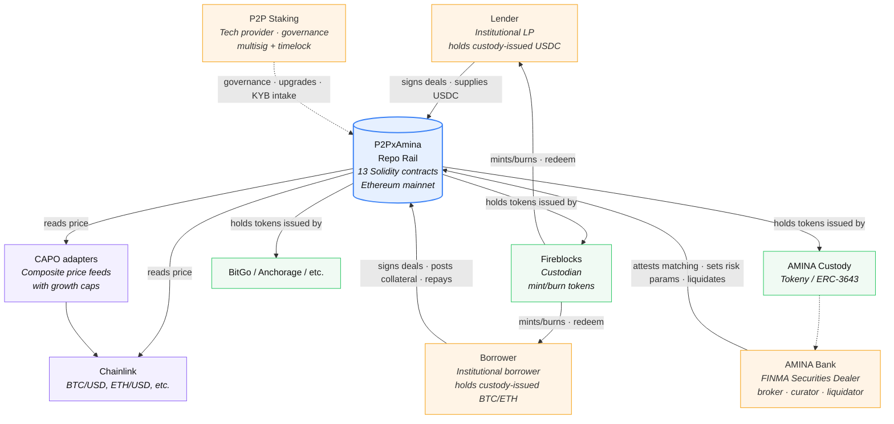

---

## 4. Container view (C4 L2)

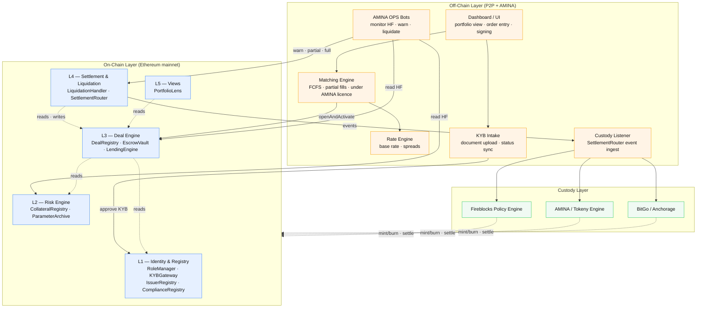

---

## 5. Contract inventory (C4 L3)

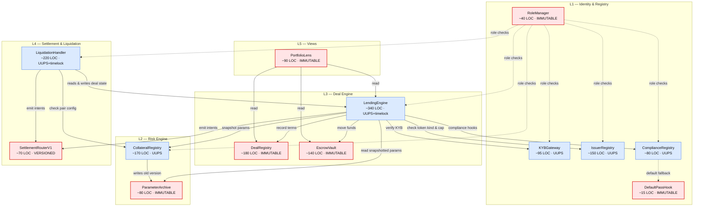

### 5.1 LOC summary

| Layer | LOC |
|---|---|
| L1 — Identity &amp; Registry (incl. `DefaultPassHook`) | ~380 |
| L2 — Risk Engine | ~250 |
| L3 — Deal Engine | ~660 |
| L4 — Settlement &amp; Liquidation | ~290 |
| L5 — Views | ~90 |
| Shared libraries (`FixedMath`, `EIP712Hash`, `ReasonCodes`) | ~150 |
| **Total** | **~1,820** |

### 5.2 Per-contract reference

#### `RoleManager`
OZ `AccessManager` wrapper. Owns the role bindings. Roles enumerated in [§7](#7-roles-permissions-access-control). GPT v3 makes this contract immutable because it is the root of every privileged action. Role migration is an explicit governance event, not a proxy implementation swap.

#### `KYBGateway`
Wallet eligibility. Now carries `jurisdictionCode` for hooks that need jurisdictional context. UUPS to allow schema growth.

#### `IssuerRegistry`
Two-level state: issuer-level `IssuerStatus` (`Active`, `Paused`, `Deactivated`) plus per-token `paused` flag. Two attestation hashes: `legalAttestationHash` on the issuer (master agreement), `redemptionAttestationHash` per token. Cap accounting on both axes.

#### `ComplianceRegistry`
Routes (token, action) → hook. Pre-hook is `staticcall` view; post-hook is best-effort `try/catch`. Default fallback to `DefaultPassHook`.

#### `DefaultPassHook`
Immutable no-op hook. The conservative default for tokens without per-token compliance logic.

#### `CollateralRegistry`
Per-pair params. **Oracle source is part of the params**, not a separate registry. Version-bumping snapshots the old params into `ParameterArchive` atomically.

#### `ParameterArchive`
Immutable historical store. Write-once per `(pair, version)`. Every snapshot stores a `schemaId`, `paramsHash`, `oracleConfigHash`, and `createdAt`, so archived risk and oracle configs remain interpretable after future registry upgrades.

#### `DealRegistry`
Append-only signed terms. Three signatures (lender, borrower, AMINA). EIP-712 domain pinned at deployment.

#### `EscrowVault`
Per-deal token ledger. Only `LendingEngine` can mutate. Reconciliation is `token.balanceOf(EscrowVault) >= ledgerSum(token)`, not equality, because ERC-20 transfers can be sent directly to the vault. Any excess is `unattributedBalance` and must never be credited to a deal without an explicit recovery process.

#### `LendingEngine`
The state machine. Carries pause-clock state, cap counters, ERC-7540 view subset. UUPS + 24h timelock; emergency-shortened to 1h if `EMERGENCY` multisig approves.

#### `LiquidationHandler`
AMINA-only three-phase liquidation. Verifies dual-price `AMINASignedPriceAttestation` when oracle is stale. Surplus return computed and emitted.

#### `SettlementRouter`
Typed events with `settlementRef` and `sequenceNumber` for custodian-side reconciliation. GPT v3 treats the event surface as integration-critical: v1 is immutable/versioned, and future schema changes are additive or deployed as `SettlementRouterV2`.

#### `PortfolioLens`
Read-only aggregation + ERC-7540 view re-export.

---

## 6. External dependencies

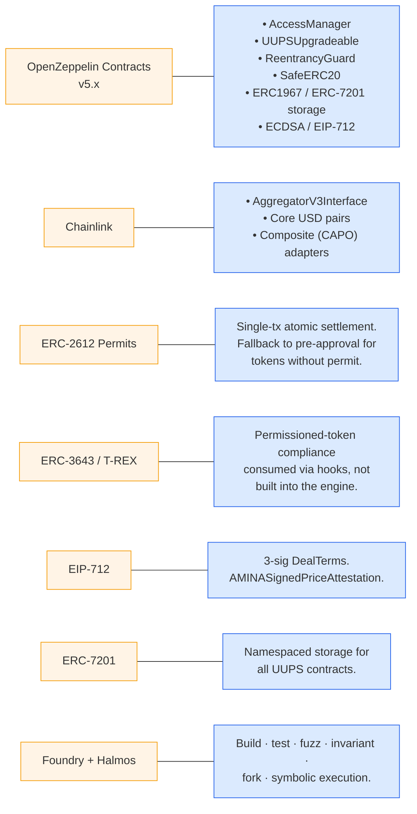

| Dependency | Used by | Risk | Mitigation |
|---|---|---|---|
| ERC-20 / ERC-3643 tokens | EscrowVault, hooks | Transfer reverts, issuer freeze, allowlist failures | `RepaidPendingCollateralRelease` state; typed hook errors; allowlist preflight at onboarding |
| Custodians | Token issuance + real-asset redemption | Insolvency, redemption delay | `IssuerStatus` lifecycle; per-issuer caps; legal attestation hash; AMINA runbook |
| Chainlink / CAPO | CollateralRegistry param oracles | Stale, decimal bug, wrong source | Heartbeat enforcement, source snapshot in `ParameterArchive`, shared decimal lib, `forceOracleOverride` |
| AMINA price desk | Stale-oracle liquidation evidence | Wrong / disputed off-chain price | Signed attestation event; signer rotation; permanent audit trail |
| AMINA matching engine | Deal construction | Wrong terms / unauthorised match | Three signatures; `ALLOCATOR` rate limit (100 deals / day / wallet); cap pre-checks |
| Safe / multisig infra | All privileged roles | Key compromise | Role separation; timelocked upgrades; rate-limited bot wallets |
| ERC-2612 permits | Atomic activation | Token lacks permit / replay | Fallback pre-approval path; nonce + domain checks |

---

## 7. Roles, permissions, access control

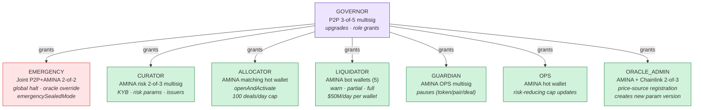

### 7.1 Role-action speed

```mermaid
gantt
    title Role action latencies (typical)
    dateFormat X
    axisFormat %s

    section Slow (timelocked)
    GOVERNOR upgrade            :a1, 0, 86400
    CURATOR risk tighten        :a2, 0, 86400
    CURATOR issuer onboard      :a3, 0, 86400

    section Medium
    CURATOR risk loosen         :b1, 0, 600
    ORACLE_ADMIN feed rotate    :b2, 0, 600
    GUARDIAN unpause            :b3, 0, 600

    section Fast (no timelock, rate-limited)
    ALLOCATOR open deal         :c1, 0, 12
    LIQUIDATOR warn             :c2, 0, 12
    LIQUIDATOR partial          :c3, 0, 12
    LIQUIDATOR full             :c4, 0, 12
    GUARDIAN pause              :c5, 0, 12
    EMERGENCY global halt       :c6, 0, 12
    EMERGENCY oracle override   :c7, 0, 12
    OPS risk-reducing cap update:c8, 0, 60
```

### 7.2 Access-control matrix

| Function | GOVERNOR | EMERGENCY | CURATOR | ALLOCATOR | LIQUIDATOR | GUARDIAN | OPS | ORACLE_ADMIN | * |
|---|:---:|:---:|:---:|:---:|:---:|:---:|:---:|:---:|:---:|
| `RoleManager.grantRole` | ✓ | | | | | | | | |
| Engine / Handler upgrade | ✓ +TL | | | | | | | | |
| `KYBGateway.setStatus` | | | ✓ | | | | | | |
| `IssuerRegistry.addIssuer` | | | ✓ +TL | | | | | | |
| `IssuerRegistry.addToken` | | | ✓ +TL | | | | | | |
| `IssuerRegistry.pauseToken` | | | | | | ✓ | | | |
| `IssuerRegistry.setIssuerStatus` | | | | | | ✓ | | | |
| `IssuerRegistry.setCap` (decrease / freeze) | | | ✓ | | | | ✓ | | |
| `IssuerRegistry.setCap` (increase) | | | ✓ +TL | | | | | | |
| `ComplianceRegistry.registerHook` | | | ✓ +TL | | | | | | |
| `CollateralRegistry.addPair` | | | ✓ +TL | | | | | | |
| `CollateralRegistry.updatePair` (tighten) | | | ✓ | | | | ✓ | | |
| `CollateralRegistry.updatePair` (loosen) | | | ✓ +TL | | | | | | |
| `CollateralRegistry.pausePair` | | | | | | ✓ | | | |
| `OracleRotation` (new version) | | | | | | | | ✓ | |
| `LendingEngine.openAndActivate` | | | | ✓ | | | | | |
| `LendingEngine.repay` | | | | | | | | | ✓ (compliant) |
| `LendingEngine.topUpCollateral` | | | | | | | | | ✓ (borrower) |
| `LendingEngine.claimUnreleasedCollateral` | | | | | | | | | ✓ (borrower) |
| `LendingEngine.pauseDeal` | | | | | | ✓ | | | |
| `LendingEngine.unpauseDeal` | | | | | | ✓ +TL | | | |
| `LendingEngine.globalHalt` | | ✓ | | | | | | | |
| `LendingEngine.emergencySealedMode` | | ✓ | | | | | | | |
| `LiquidationHandler.warn` | | | | | ✓ | | | | |
| `LiquidationHandler.partial` | | | | | ✓ | | | | |
| `LiquidationHandler.full` | | | | | ✓ | | | | |
| `LendingEngine.forceOracleOverride` | | ✓ | | | | | | | |

*+TL = subject to timelock delay (24h default; emergency-shortenable to 1h)*

### 7.3 Privilege separation property

No single role can both (a) change risk parameters and (b) move funds from escrow. Compromising any single role does not enable a drain attack:

- `ALLOCATOR` compromise → can open deals but needs valid 3-party signatures.
- `LIQUIDATOR` compromise → can liquidate but only deals with HF below threshold, capped by daily limit + step counter.
- `OPS` compromise → can only reduce exposure or freeze capacity; it cannot increase caps or loosen collateral parameters.
- `GUARDIAN` compromise → can pause (annoying but no fund loss).
- `CURATOR` compromise → risk params; multisig + timelock for dangerous changes.
- `ORACLE_ADMIN` compromise → new param version (not live-deal override).
- `GOVERNOR` compromise → upgrades behind timelock; EMERGENCY can intervene.
- `EMERGENCY` compromise → requires both P2P and AMINA to be compromised.

This is the access-control safety net.

---

## 8. Data model

```mermaid
classDiagram
    direction LR

    class DealTerms {
        +address lender
        +address borrower
        +address supplyToken
        +address collateralToken
        +uint128 principal
        +uint128 collateralAmount
        +uint32 rateBps
        +uint64 startTs
        +uint64 maturityTs
        +bytes32 pairKey
        +uint32 paramVersion
        +bytes32 nonceLender
        +bytes32 nonceBorrower
        +bytes32 nonceAmina
        +bytes32 legalTermsHash
    }

    class DealState {
        +DealStateEnum state
        +uint128 outstanding
        +uint128 collateralPosted
        +uint64 lastTouchTs
        +uint8 liquidationStep
        +uint64 pauseStartedAt
        +uint64 totalPausedTime
        +bytes32 lastPauseReason
        +uint32 versionKey
    }

    class DealStateEnum {
        <<enumeration>>
        None
        Active
        Warned
        Liquidating
        Matured
        Repaid
        Repaid_PendingCollateralRelease
        Liquidated
        Defaulted
    }

    class Params {
        +uint16 ltvBps
        +uint16 warningBps
        +uint16 partialLiqBps
        +uint16 fullLiqBps
        +uint32 maxMaturity
        +uint16 maxRateBps
        +uint16 liquidationBonusBps
        +uint16 aminaFeeBps
        +uint256 pairCapUsd
        +address priceSourceCollateral
        +address priceSourceSupply
        +uint32 heartbeatCollateral
        +uint32 heartbeatSupply
        +uint8 oracleDecimalsCollateral
        +uint8 oracleDecimalsSupply
        +bool active
    }

    class IssuerInfo {
        +address custodian
        +IssuerStatus status
        +bytes32 legalAttestationHash
        +uint256 globalCapUsd
        +uint256 usedCapUsd
    }

    class IssuerStatus {
        <<enumeration>>
        Unknown
        Active
        Paused
        Deactivated
    }

    class TokenInfo {
        +address issuer
        +TokenKind kind
        +uint8 decimals
        +bool paused
        +uint256 capUsd
        +uint256 usedCapUsd
        +bytes32 redemptionAttestationHash
    }

    class TokenKind {
        <<enumeration>>
        Unknown
        Supply
        Collateral
        DualUse
    }

    class KybRecord {
        +KybStatus status
        +uint64 approvedAt
        +uint64 expiryTs
        +bytes32 documentsHash
        +address approvedBy
        +bytes32 jurisdictionCode
    }

    class KybStatus {
        <<enumeration>>
        Unknown
        Approved
        Suspended
        Revoked
    }

    class Caps {
        +uint128 globalNotionalCap
        +uint128 globalOutstanding
        +mapping perTokenCap
        +mapping perPairCap
        +mapping perBorrowerCap
        +mapping perLenderCap
        +mapping perMaturityBucketCap
        +mapping perLiquidatorDailyCap
    }

    class LiqState {
        +uint8 phase
        +uint64 phaseEnteredAt
        +uint128 cumulativeLiquidated
        +bytes32 lastReasonCode
    }

    class AMINASignedPriceAttestation {
        +bytes32 dealId
        +bytes32 sourceId
        +uint256 observedCollateralPrice
        +uint256 observedSupplyPrice
        +uint64 observationTs
        +bytes32 reasonCode
        +bytes signature
    }

    DealTerms --> DealState : "1:1 via dealId"
    DealTerms --> Params : "via pairKey + paramVersion"
    DealState --> DealStateEnum
    Params --> TokenInfo : "supplyToken, collateralToken"
    IssuerInfo --> IssuerStatus
    TokenInfo --> IssuerInfo : "issued by"
    TokenInfo --> TokenKind
    KybRecord --> KybStatus
```

### 8.1 Key relationships

- `dealId = keccak256(abi.encode(DealTerms))` — content-addressable.
- `pairKey = keccak256(abi.encodePacked(collateralToken, supplyToken))`.
- `paramVersion` is snapshotted into `DealTerms` at creation; the engine reads `ParameterArchive[pairKey][paramVersion]` for the deal's lifetime.
- `legalTermsHash` is the off-chain master-agreement hash (separate from the EIP-712 terms hash).

### 8.2 Two-level token registry

The registry has two levels:

```
IssuerRegistry
├── issuers[issuerAddr] → IssuerInfo (custodian-level: status, legal attestation, global cap)
└── tokens[tokenAddr]   → TokenInfo (per-token: kind, decimals, cap, redemption attestation, paused)
```

Behaviours:

- `IssuerStatus.Paused` pauses *all* of a custodian's tokens at once (e.g., custodian operational incident).
- Per-token `paused` is a finer-grained tool (e.g., one mint contract has a bug).
- `IssuerStatus.Deactivated` is terminal-with-cleanup: new deals blocked, existing deals continue settling.

### 8.3 `DualUse` token kind

Tokens classified as `DualUse` may appear as either the supply or collateral leg across the platform. The classic case is USDC: lent on one deal, posted as collateral on another. GPT v3 deliberately treats `DualUse` as an explicit admission decision, not a default convenience flag. A token can become `DualUse` only after risk, counsel, and custodian review confirm that using it on both sides across different deals is acceptable.

The engine enforces:

```
require(supplyTokenInfo.kind == Supply || supplyTokenInfo.kind == DualUse, "BAD_SUPPLY_KIND");
require(collateralTokenInfo.kind == Collateral || collateralTokenInfo.kind == DualUse, "BAD_COLL_KIND");
require(supplyToken != collateralToken, "SAME_TOKEN");
```

The last constraint prevents a self-collateralised deal even when both legs are DualUse.

Operationally, v1 should default new tokens to either `Supply` or `Collateral`. `DualUse` is reserved for mature, liquid, legally clean assets with unambiguous redemption rights and exact-transfer ERC-20 behavior.

---

## 9. Deal state machine

```mermaid
stateDiagram-v2
    [*] --> None

    None --> Active: openAndActivate<br/>(atomic settlement)

    Active --> Active: topUpCollateral
    Active --> Active: repay (partial)
    Active --> Repaid: repay (full)<br/>collateral release ok
    Active --> Repaid_PendingCollateralRelease: repay (full)<br/>collateral blocked
    Active --> Warned: warn<br/>(HF crossed warningBps)
    Active --> Matured: settleMaturity
    Active --> Liquidating: full threshold breached<br/>(skipping warn)

    Warned --> Active: top-up or partial repay cures
    Warned --> Liquidating: partialLiquidate<br/>(grace expired)
    Warned --> Repaid: repay (full)
    Warned --> Matured: settleMaturity

    Matured --> Repaid: repay (full)
    Matured --> Liquidating: fullLiquidate<br/>(grace expired)

    Liquidating --> Liquidating: partialLiquidate (step++)
    Liquidating --> Active: borrower cures via top-up
    Liquidating --> Repaid: full repay before final liq
    Liquidating --> Liquidated: fullLiquidate<br/>collateral &gt;= debt+bonus
    Liquidating --> Defaulted: fullLiquidate<br/>collateral &lt; debt+bonus

    Repaid_PendingCollateralRelease --> Repaid: claimUnreleasedCollateral

    Repaid --> [*]
    Liquidated --> [*]
    Defaulted --> [*]

    note right of None: Deal never recorded.<br/>Activation atomic.
    note right of Repaid_PendingCollateralRelease: Debt cleared; collateral<br/>blocked by issuer freeze.<br/>Recoverable.
    note right of Defaulted: Residual debt after full liq.<br/>Booked off-chain to AMINA.
```

### 9.1 Transition guards

| From → To | Guard |
|---|---|
| `None → Active` | 3 valid sigs + KYB approved for L, B (and caller if non-counterparty) + 9 cap checks + issuer Active + token not paused + pair active + oracle fresh + compliance hooks ok |
| `Active|Warned → Warned` | HF crossed `warningBps`; `LIQUIDATOR` only |
| `Warned|Liquidating → Active` | HF back ≥ 1.0 after top-up or partial repay; automatic |
| `Warned → Liquidating` | HF crossed `partialLiqBps` AND grace expired; `LIQUIDATOR` only |
| `Active → Liquidating` | HF crossed `fullLiqBps` (skipping `Warned`); `LIQUIDATOR` only |
| `Active|Warned → Repaid` | `outstanding == 0` after repay; collateral release succeeds |
| `Active|Warned → Repaid_PendingCollateralRelease` | `outstanding == 0` but collateral release reverts (typed reason from hook) |
| `Repaid_PendingCollateralRelease → Repaid` | Borrower calls `claimUnreleasedCollateral` and transfer succeeds |
| `Liquidating → Liquidated` | `fullLiquidate` succeeds and `collateralValueAtClose >= debt+bonus+fee` |
| `Liquidating → Defaulted` | `fullLiquidate` succeeds but `collateralValueAtClose < debt+bonus+fee` |
| `Active → Matured` | `block.timestamp >= effectiveMaturityTs`; permissionless |
| `Matured → Liquidating` | Grace expired after maturity; `LIQUIDATOR` only |

### 9.2 Pause is an overlay, not a state

Pause is implemented as a boolean overlay on the existing state, not as a separate state in the DAG. A deal in any non-terminal state can be paused. While paused:
- `pauseStartedAt > 0` (the marker).
- Interest accrual halts (see [§19](#19-pause-hierarchy)).
- Only specific actions are callable (see [§19.1](#191-pause-behaviour-summary)).

---

## 10. User stories

These are the primary users and operational personas the architecture is designed around.

- **Anna** (lender, regional bank treasury): lend idle USDC at institutional rates; see one position, one rate, one maturity; trust that counterparties are KYB'd.
- **Bruno** (borrower, crypto hedge fund treasurer): access cash without selling BTC; lock in rate up front; have a chance to cure before liquidation; receive surplus on liquidation.
- **Riccardo** (AMINA risk desk): tighten LTV without retroactively endangering live deals; monitor every deal's HF; onboard custodians through documented, timelocked process; liquidate using off-chain price data when oracle stale, with on-chain evidence.
- **Olivia** (AMINA OPS, runs liquidation bots): idempotent calls via step counter; per-wallet daily caps; fast token-pause without multisig.
- **Pierre** (P2P CTO): clear separation between governance and risk decisions; timelocked upgrades; loud events for every privileged call.
- **Cathy** (Fireblocks engineering): stable event schema with sequence numbers; sufficient context in compliance hooks; protocol-level token pause.
- **Adrian** (auditor): small focused codebase; documented blast radii; invariants as test targets.

---

## 11. Use cases

This section describes each major use case in narrative form plus a sequence diagram.

### 11.1 Counterparty onboarding (KYB)

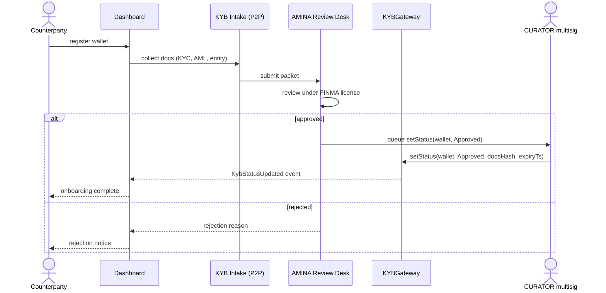

**Key properties**:
- KYB is the **only** gate by which a wallet becomes eligible.
- Approval has an `expiryTs` (e.g., 365 days). Re-attestation is required periodically.
- `documentsHash` anchors the on-chain row to the off-chain document packet held by AMINA.

### 11.2 Issuer (custodian + token) onboarding

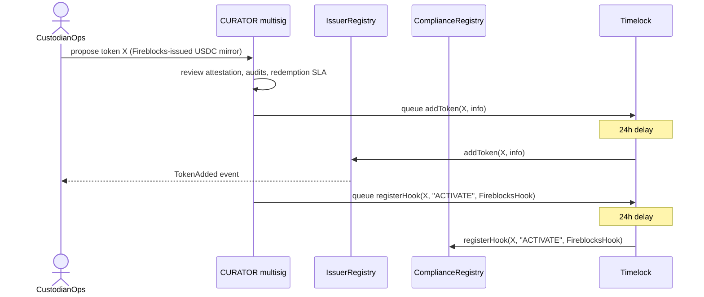

**Key properties**:
- Both `addToken` and `registerHook` are timelocked.
- The compliance hook contract must itself be audited as part of the onboarding packet.
- `IssuerRegistry.addToken` records the `attestationHash` — the off-chain custody attestation that this token is 1:1 backed.

### 11.3 Pair onboarding (risk parameters)

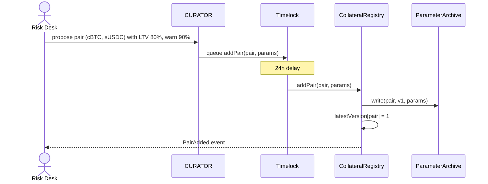

### 11.4 Opening a deal (atomic activation) — the central flow

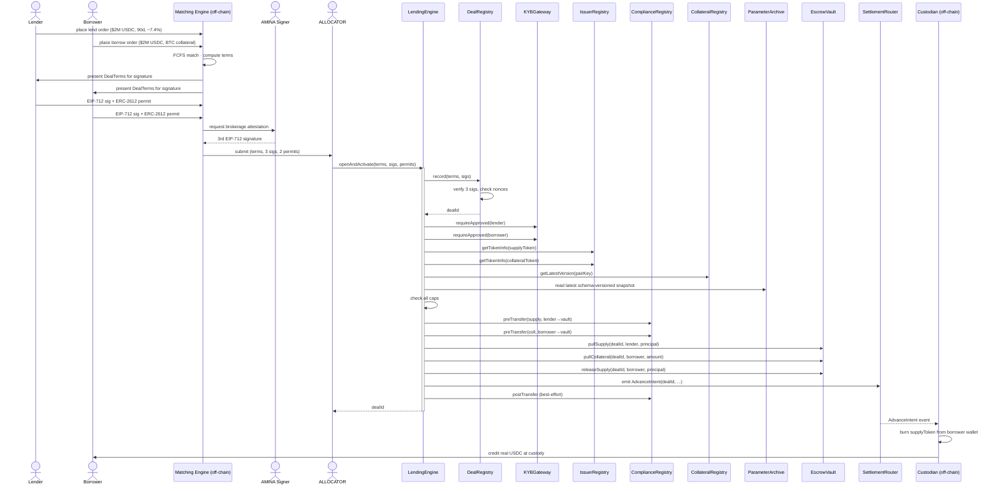

**Single transaction.** Steps from `openAndActivate` through `emit AdvanceIntent` all happen in one transaction. If any check fails, the entire transaction reverts and no state has changed.

**Pre-conditions verified**:
1. Three valid signatures over the `termsHash`.
2. Nonces unused for both lender and borrower.
3. Both wallets KYB-approved and unexpired.
4. Both tokens registered, not paused, of correct `kind`.
5. Pair active and not paused.
6. Oracle fresh.
7. All cap dimensions allow this deal.
8. Compliance hooks return `ok=true`.

### 11.5 Top-up collateral

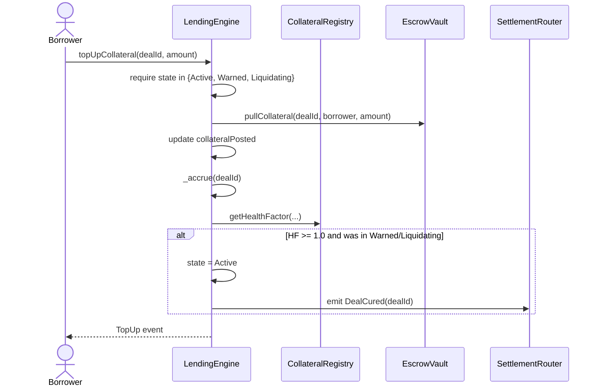

### 11.6 Repay (normal path)

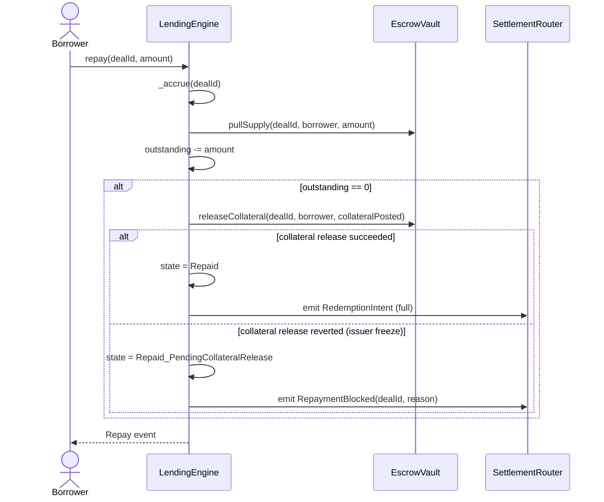

### 11.7 Warning trigger

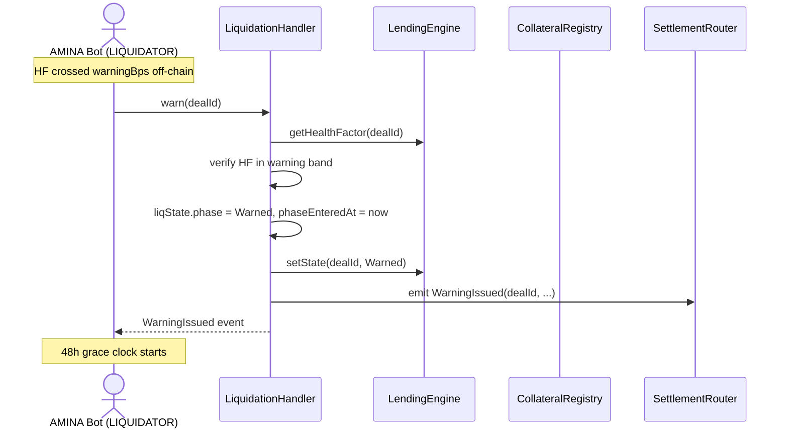

### 11.8 Partial liquidation

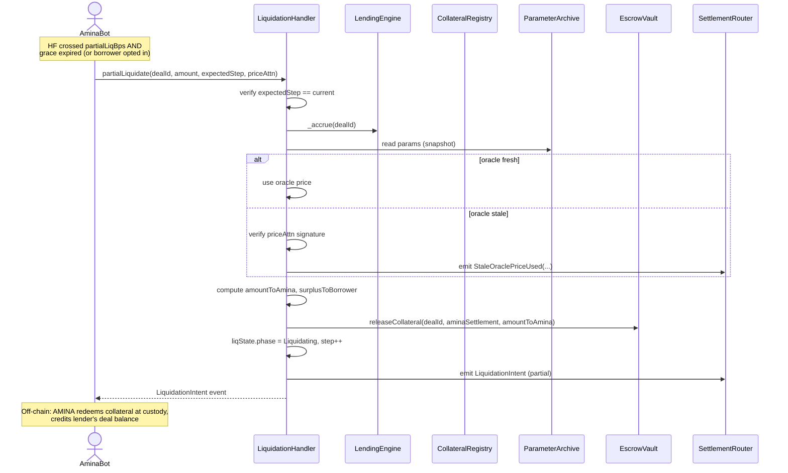

### 11.9 Full liquidation with surplus return

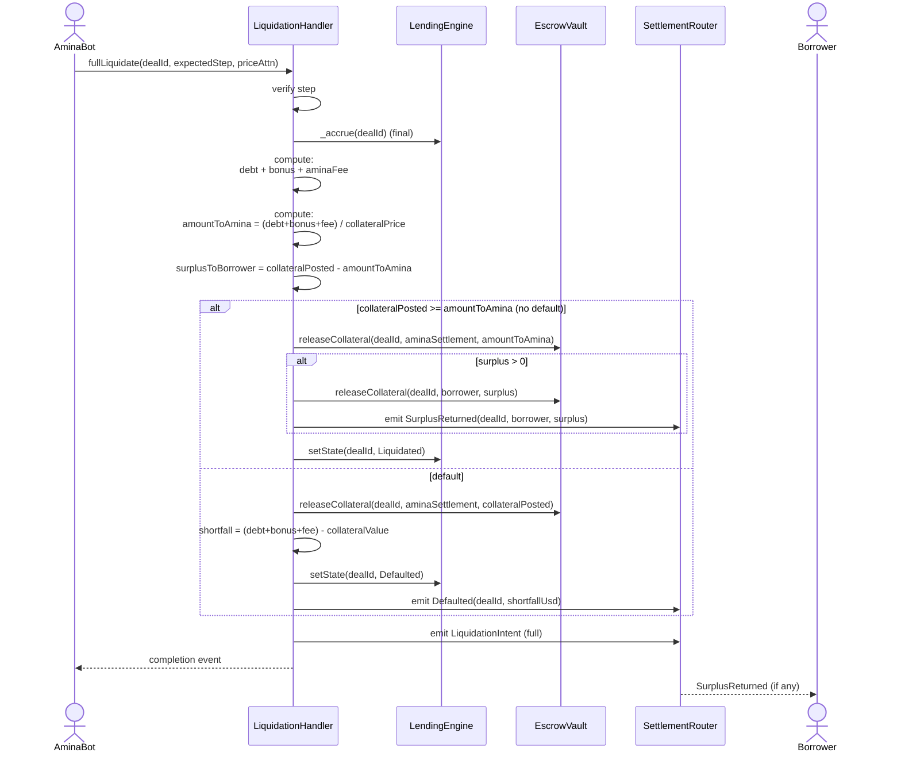

### 11.10 Force oracle override (EMERGENCY)

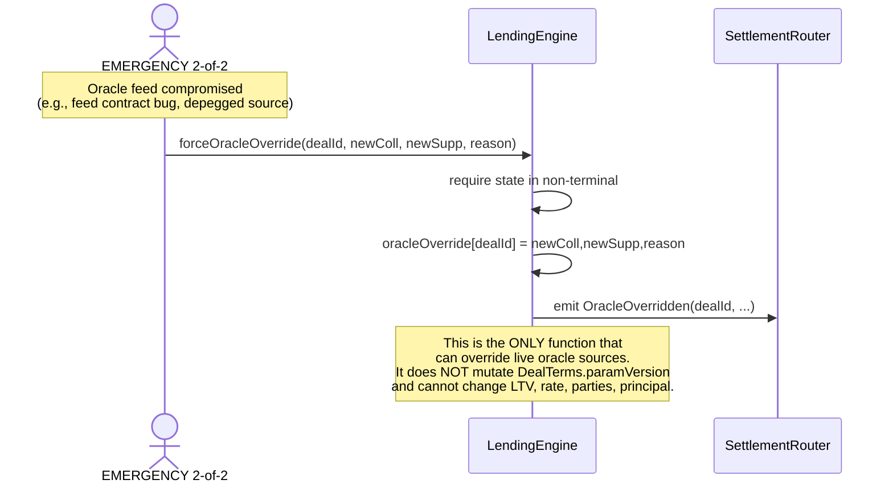

### 11.11 Engine upgrade recovery ceremony

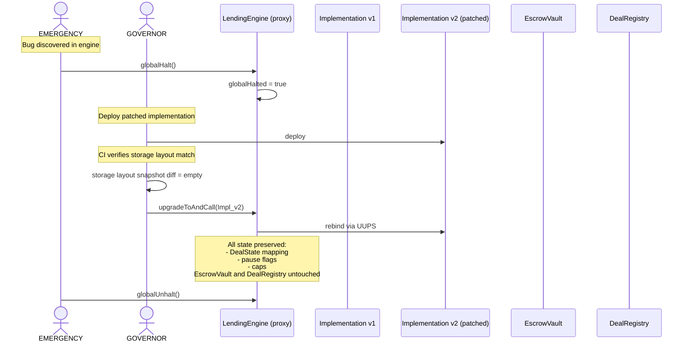

**Key property**: because `EscrowVault` and `DealRegistry` are immutable and the engine's state lives in ERC-7201 namespaced storage, the engine can be replaced without touching funds or deal records.

### 11.12 Token freeze recovery (`Repaid_PendingCollateralRelease`)

```mermaid
sequenceDiagram
    actor Borrower
    participant LendingEngine
    participant EscrowVault
    participant TokenContract as Collateral Token

    Note over Borrower,TokenContract: At repay time, issuer had frozen EscrowVault;<br/>deal moved to Repaid_PendingCollateralRelease

    Note over TokenContract: Hours/days later: issuer unfreezes
    Borrower->>LendingEngine: claimUnreleasedCollateral(dealId)
    LendingEngine->>EscrowVault: releaseCollateral(dealId, borrower, posted)
    EscrowVault->>TokenContract: transfer(borrower, posted)
    TokenContract-->>EscrowVault: success
    LendingEngine->>LendingEngine: state = Repaid
    LendingEngine-->>Borrower: Repaid event
```

The v2 additions:

### 11.13 Batch atomic activation (optional, `ALLOCATOR` convenience)

When the matching engine produces N bilateral deals that should settle as a batch (one lender's order matched against N borrowers), the engine exposes `openAndActivateBatch`:

```mermaid
sequenceDiagram
    actor ALLOCATOR
    participant LendingEngine
    participant LoopGuard

    ALLOCATOR->>LendingEngine: openAndActivateBatch(terms[], sigs[], permits[])
    activate LendingEngine
    LendingEngine->>LoopGuard: enter (single nonReentrant guard for batch)
    loop for each deal in array
        LendingEngine->>LendingEngine: openAndActivateSingle (internal)
    end
    LendingEngine->>LoopGuard: exit
    deactivate LendingEngine

    Note over LendingEngine: All-or-nothing: any single failure<br/>reverts the entire batch.<br/>Counts against ALLOCATOR rate limit as N.
```

Constraints:
- Bounded by gas limit; practical batch size 5–10 deals.
- All deals in a batch must pass independently; one failure reverts all.
- Each deal still consumes one `ALLOCATOR` rate-limit slot.

This is a convenience, not a primitive. A future v2 may eliminate it in favour of single-deal calls at the matching engine.

### 11.14 KYB suspension mid-deal

If `CURATOR` suspends a wallet's KYB while it has live deals:

```mermaid
sequenceDiagram
    actor CURATOR
    participant KYBGateway
    participant LendingEngine

    CURATOR->>KYBGateway: setStatus(wallet, Suspended, ...)

    Note over KYBGateway,LendingEngine: Live deals continue.<br/>Wallet cannot open new deals.<br/>Wallet can still repay/top-up<br/>(self-rescue allowed even if KYB suspended,<br/>subject to token compliance hook).
```

Rationale: trapping a suspended wallet from repaying its own debt would be worse than letting it close the position cleanly. The compliance hook on the token may still reject the transfer if it requires KYB; that's the token's decision, not the protocol's.

### 11.15 Issuer-level pause (cascade)

```mermaid
sequenceDiagram
    actor GUARDIAN
    participant IssuerRegistry
    participant LendingEngine

    Note over GUARDIAN: Custodian reports operational incident
    GUARDIAN->>IssuerRegistry: setIssuerStatus(issuer, Paused)
    IssuerRegistry-->>LendingEngine: IssuerPaused event

    Note over LendingEngine: All tokens issued by this custodian<br/>are effectively paused for new deals.<br/>Existing deals continue if individual<br/>token transfers succeed.
```


---

## 12. Fund-flow diagrams

### 12.1 Happy path: open → accrue → repay

```mermaid
flowchart LR
    classDef wallet fill:#fff4e6,stroke:#f59e0b
    classDef vault fill:#ede5ff,stroke:#8b5cf6
    classDef custody fill:#f0faf3,stroke:#22c55e

    LenderW["Lender wallet<br/>sUSDC: 2M"]
    BorrowerW["Borrower wallet<br/>cBTC: 25"]
    Vault["EscrowVault<br/>(per-deal ledger)"]
    BorrowerR["Borrower wallet<br/>(after advance)"]
    Custody["Custodian<br/>(real USDC redemption)"]

    LenderW -->|"① pullSupply<br/>2M sUSDC"| Vault
    BorrowerW -->|"② pullCollateral<br/>25 cBTC"| Vault
    Vault -->|"③ releaseSupply<br/>2M sUSDC"| BorrowerR
    BorrowerR -.->|"④ off-chain redeem"| Custody
    Custody -->|"⑤ real USDC paid"| BorrowerR

    BorrowerR -->|"⑥ at maturity:<br/>pullSupply 2M + interest"| Vault
    Vault -->|"⑦ releaseCollateral<br/>25 cBTC"| BorrowerW

    class LenderW,BorrowerW,BorrowerR wallet
    class Vault vault
    class Custody custody
```

### 12.2 Liquidation path with surplus

```mermaid
flowchart LR
    classDef wallet fill:#fff4e6,stroke:#f59e0b
    classDef vault fill:#ede5ff,stroke:#8b5cf6
    classDef amina fill:#ffe4e6,stroke:#dc2626
    classDef custody fill:#f0faf3,stroke:#22c55e

    Vault["EscrowVault<br/>collateralPosted: 25 cBTC<br/>outstanding: 1.05M sUSDC<br/>(debt 1M + bonus 5%)"]
    AminaW["AMINA settlement<br/>wallet"]
    BorrowerW["Borrower wallet"]
    Custody["Custodian"]
    Lender["Lender (off-chain)"]

    Vault -->|"① releaseCollateral<br/>21 cBTC<br/>(= 1.05M USDC / 50k cBTCprice)"| AminaW
    Vault -->|"② releaseCollateral<br/>4 cBTC surplus"| BorrowerW

    AminaW -.->|"③ off-chain<br/>redeem at custody"| Custody
    Custody -->|"④ real BTC sold,<br/>USDC paid"| Lender

    class Vault vault
    class AminaW amina
    class BorrowerW wallet
    class Custody custody
```

### 12.3 Default path

```mermaid
flowchart LR
    classDef wallet fill:#fff4e6,stroke:#f59e0b
    classDef vault fill:#ede5ff,stroke:#8b5cf6
    classDef amina fill:#ffe4e6,stroke:#dc2626

    Vault["EscrowVault<br/>collateralPosted: 25 cBTC<br/>collateral value: 950k USDC<br/>outstanding: 1.05M sUSDC<br/>shortfall: 100k"]
    AminaW["AMINA settlement"]
    Books["AMINA off-chain books<br/>shortfall recorded"]

    Vault -->|"① releaseCollateral<br/>25 cBTC (all)"| AminaW
    AminaW -.->|"② emit Defaulted<br/>(shortfall 100k)"| Books

    class Vault vault
    class AminaW amina
    class Books amina
```

**Important**: the shortfall does NOT propagate to other deals or to lenders of *this* deal. AMINA absorbs the shortfall (its regulatory and contractual obligation). The chain records it for audit.

---

## 13. Settlement and off-chain integration

### 13.1 Event schema (v2)

Every settlement event carries:

- `dealId` (indexed)
- `settlementRef` — unique reference for off-chain ack
- `sequenceNumber` — monotonic per-router event counter for ordered processing
- Action-specific fields (token, amount, beneficiary, etc.)
- `expectedSettlementDeadline` where applicable

```solidity
event AdvanceIntent(
    bytes32 indexed dealId,
    address indexed supplyToken,
    uint256 amount,
    address indexed beneficiary,
    bytes32 settlementRef,
    uint64 sequenceNumber,
    uint64 expectedSettlementDeadline
);

event RedemptionIntent(...);          // similar shape
event CollateralTopUpIntent(...);
event LiquidationIntent(
    bytes32 indexed dealId,
    LiquidationPhase phase,
    address indexed collateralToken,
    uint256 amount,
    address indexed aminaSettlement,
    bytes32 settlementRef,
    uint64 sequenceNumber,
    bytes32 reasonCode
);
event SurplusReturned(...);
event Defaulted(
    bytes32 indexed dealId,
    uint256 shortfallUsd,
    bytes32 detailsHash,
    uint64 sequenceNumber
);
event UnreleasedCollateral(
    bytes32 indexed dealId,
    address indexed borrower,
    address indexed token,
    uint256 amount,
    bytes32 reasonCode,
    uint64 sequenceNumber
);
event StaleOraclePriceUsed(
    bytes32 indexed dealId,
    bytes32 sourceId,
    uint256 collateralPrice,
    uint256 supplyPrice,
    uint64 observationTs,
    bytes32 reasonCode
);
```

### 13.2 Sequence number discipline

`sequenceNumber` is a single monotonically-increasing counter on `SettlementRouter` shared across event types. Custodian listeners process strictly in sequence-number order; gaps trigger a reconciliation alert.

### 13.3 Reconciliation invariant

For every event at sequence `s` with `dealId d`:

1. Custodian acknowledgement arrives within `expectedSettlementDeadline - 4h` or AMINA OPS is paged.
2. Custodian's `settlementRef` echoes the protocol's `settlementRef`.
3. Daily reconciliation: protocol's `(d, s, amount, token)` tuples sum to the custodian's net flow for the day, per token.

---

## 14. Liquidation engine deep dive

### 14.1 Three-phase state machine

```mermaid
stateDiagram-v2
    [*] --> Healthy

    Healthy --> Warned: HF crossed warningBps<br/>(LIQUIDATOR.warn)
    Warned --> Healthy: borrower top-up (HF >= 1)
    Warned --> Healthy: partial repay (HF >= 1)
    Warned --> Liquidating_P1: grace expired AND HF crossed partialLiqBps<br/>(LIQUIDATOR.partialLiquidate)

    Liquidating_P1 --> Liquidating_P2: HF still below partialLiqBps after partial<br/>(LIQUIDATOR.partialLiquidate again)
    Liquidating_P1 --> Healthy: borrower cures via top-up
    Liquidating_P1 --> FullLiq: HF crossed fullLiqBps<br/>(LIQUIDATOR.fullLiquidate)
    Liquidating_P2 --> FullLiq: HF crossed fullLiqBps
    Liquidating_P2 --> Healthy: borrower cures

    FullLiq --> Closed_Surplus: collateral >= debt+bonus+fee
    FullLiq --> Closed_Default: collateral < debt+bonus+fee

    Closed_Surplus --> [*]
    Closed_Default --> [*]

    note right of Warned: Grace clock starts<br/>Interest still accrues
    note right of Liquidating_P1: Step counter = 1<br/>monotonic
    note right of FullLiq: Step counter = N<br/>Final accrual
```

Every liquidation call carries an `expectedStep` argument. The handler compares it against `liqState.step`; mismatch reverts. This protects against bot retries, concurrent AMINA wallets, and out-of-order transactions.

### 14.2 Dual-price attestation (v2)

`AMINASignedPriceAttestation` now signs both collateral and supply prices:

```solidity
struct AMINASignedPriceAttestation {
    bytes32 dealId;
    bytes32 sourceId;
    uint256 observedCollateralPrice;
    uint256 observedSupplyPrice;
    uint64 observationTs;
    bytes32 reasonCode;
    bytes signature;
}
```

Why both: a custody-issued stablecoin can deviate from $1.00 under stress (Silicon Valley Bank week, March 2023, etc.). If AMINA liquidates against a stale on-chain oracle for a collateral token, they must also commit to the price they used for the supply token. Otherwise AMINA could implicitly profit by assuming supply token = $1.00 even when it's trading at $0.97.

The signature is over the EIP-712 hash of the entire struct (excluding the signature field).

### 14.3 Surplus computation (unchanged)

```
debtUsd            = outstanding × observedSupplyPrice
payoutNeededUsd    = debtUsd × (10000 + bonusBps + aminaFeeBps) / 10000
collateralValueUsd = collateralPosted × observedCollateralPrice
amountToAmina      = min(collateralPosted, payoutNeededUsd / observedCollateralPrice)
surplusToBorrower  = collateralPosted - amountToAmina

if collateralValueUsd >= payoutNeededUsd:
    state = Liquidated; surplus returned to borrower
else:
    state = Defaulted; shortfallUsd = payoutNeededUsd - collateralValueUsd; surplus = 0
```

### 14.4 Stale-oracle liquidation path

```mermaid
flowchart TB
    A["LIQUIDATOR.partialLiquidate/fullLiquidate"] --> B{"Oracle fresh?"}
    B -->|Yes| C["Use snapshotted oracle price"]
    B -->|No| D{"AMINA signed attestation provided?"}
    D -->|No| E[revert: STALE_ORACLE_NO_ATTESTATION]
    D -->|Yes| F["Verify AMINA signature<br/>over collateral and supply prices"]
    F --> G{"signature valid<br/>and observation acceptable?"}
    G -->|No| H[revert: INVALID_ATTESTATION]
    G -->|Yes| I["Use attested prices<br/>Emit StaleOraclePriceUsed"]
    C --> J["Continue liquidation math"]
    I --> J
```

The attestation is an evidence trail, not permissionless price discovery. The contract verifies that AMINA signed the exact prices used; AMINA remains accountable for the chosen source and observation timestamp.

---

## 15. Risk parameters and versioning

Oracle source is part of `Params`, not an external mutable pointer. Every deal freezes a `paramVersion`; live deals read from `ParameterArchive[pairKey][paramVersion]` for the lifetime of the deal.

### 15.1 Snapshot format

```solidity
struct ParamSnapshot {
    uint16 schemaId;
    bytes32 pairKey;
    uint32 version;
    bytes32 paramsHash;
    bytes32 oracleConfigHash;
    uint64 createdAt;
    bytes encodedParams;
    bytes encodedOracleConfig;
}
```

`schemaId` is mandatory. Without it, future upgrades can leave old `encodedParams` technically immutable but semantically ambiguous. `paramsHash` and `oracleConfigHash` are convenience commitments used by tests, indexers, and AMINA's off-chain reconciliation stack.

### 15.2 Version bump flow

```mermaid
sequenceDiagram
    participant Curator as CURATOR / OPS
    participant CollR as CollateralRegistry
    participant PA as ParameterArchive
    participant LE as LendingEngine

    Curator->>CollR: updatePair(pairKey, newParams)
    CollR->>PA: archive(oldVersion, schemaId, oldParams, oldOracleConfig)
    PA-->>CollR: write-once snapshot stored
    CollR->>CollR: version++
    CollR-->>LE: new deals use latest version
    Note over LE,PA: Existing deals keep their original paramVersion.
```

Risk-reducing changes, such as lower caps or tighter thresholds, may be applied quickly by the designated role. Exposure-increasing changes, such as higher caps, lower collateral requirements, or new collateral support, require curator approval and timelock.

### 15.3 Emergency oracle override

Only `EMERGENCY.forceOracleOverride` can alter a live deal's oracle binding, and it must do so through sidecar state:

```solidity
mapping(bytes32 dealId => OracleOverride) public oracleOverride;
```

It must not mutate `DealTerms.paramVersion`, overwrite `ParameterArchive`, or silently rewrite historical risk state. The override emits an indexed event containing `dealId`, old source hash, new source hash, reason code, expiry, and signer set. Overrides should be short-lived and reviewed during the next recovery call.

---

## 16. Oracle architecture

### 16.1 Composite adapters

```mermaid
flowchart LR
    classDef cl fill:#fff4e6,stroke:#f59e0b
    classDef adapter fill:#dbeafe,stroke:#2563eb
    classDef pair fill:#ede5ff,stroke:#8b5cf6

    BTCUSD["Chainlink<br/>BTC/USD"]
    LBTC_BTC["Internal feed<br/>LBTC/BTC<br/>(Lombard rate)"]
    LBTC_BTC_CAPO["CAPO Adapter<br/>LBTC/BTC<br/>max 2%/yr growth"]
    LBTCUSD["Composite<br/>LBTC/USD"]
    ETHUSD["Chainlink<br/>ETH/USD"]
    USDCUSD["Chainlink<br/>USDC/USD"]

    Pair1["Pair (cLBTC, sUSDC)<br/>uses LBTCUSD &amp; USDCUSD"]
    Pair2["Pair (cETH, sUSDC)<br/>uses ETHUSD &amp; USDCUSD"]

    LBTC_BTC --> LBTC_BTC_CAPO
    LBTC_BTC_CAPO --> LBTCUSD
    BTCUSD --> LBTCUSD

    LBTCUSD --> Pair1
    USDCUSD --> Pair1
    ETHUSD --> Pair2
    USDCUSD --> Pair2

    class BTCUSD,LBTC_BTC,ETHUSD,USDCUSD cl
    class LBTC_BTC_CAPO,LBTCUSD adapter
    class Pair1,Pair2 pair
```

### 16.2 Heartbeat enforcement

Each feed has a per-pair `heartbeat` (seconds). At read time:

```solidity
function getPrice(address feed, uint32 heartbeat) internal view returns (uint256, bool stale) {
    (, int256 answer, , uint256 updatedAt, ) = AggregatorV3Interface(feed).latestRoundData();
    require(answer > 0, "BAD_PRICE");
    stale = (block.timestamp - updatedAt) > heartbeat;
    return (uint256(answer), stale);
}
```

**The stale flag is informational, not a hard revert.** Callers decide policy:
- `LendingEngine.openAndActivate` rejects new deals if any feed is stale.
- `LendingEngine.repay` accepts repayments at last sane price (favours borrower).
- `LiquidationHandler.*` accepts liquidations IFF a signed price attestation is provided.

### 16.3 Circuit breakers

Two-tier:

1. **Per-feed**: if a feed reports a price that diverges from the previous reading by more than a `maxDelta` (e.g., 30% in one heartbeat), the feed enters a circuit-broken state. All new deals using this feed are blocked; liquidations require attestations.
2. **Global**: if ≥3 feeds break their circuit simultaneously, `EMERGENCY` should issue a global halt to investigate.

---

## 17. Compliance hooks

### 17.1 Hook interfaces

```solidity
interface ICompliancePreHook {
    /// @notice Pre-transfer eligibility check. MUST be view-callable (staticcall).
    /// @return ok If false, the surrounding action reverts.
    /// @return reasonCode Typed error code; see ReasonCodes.sol for known values.
    function preTransfer(
        address token,
        address from,
        address to,
        uint256 amount,
        bytes32 dealId,
        bytes32 action
    ) external view returns (bool ok, bytes32 reasonCode);
}

interface ICompliancePostHook {
    /// @notice Post-transfer notification. CANNOT revert; the engine wraps the call
    ///         in try/catch and emits HookFailure on revert.
    /// @dev Gas is capped at 30k by the engine wrapper.
    function postTransfer(
        address token,
        address from,
        address to,
        uint256 amount,
        bytes32 dealId,
        bytes32 action
    ) external;
}
```

### 17.2 Reason codes

```solidity
library ReasonCodes {
    bytes32 constant OK                       = bytes32(0);
    bytes32 constant KYB_SUSPENDED            = "KYB_SUSPENDED";
    bytes32 constant KYB_EXPIRED              = "KYB_EXPIRED";
    bytes32 constant JURISDICTION_BLOCKED     = "JURIS_BLOCKED";
    bytes32 constant TOKEN_PAUSED             = "TOKEN_PAUSED";
    bytes32 constant VAULT_NOT_ALLOWLISTED    = "VAULT_NOT_ALLOWLISTED";
    bytes32 constant AMOUNT_EXCEEDS_VELOCITY  = "VELOCITY_LIMIT";
    bytes32 constant SANCTIONS_HIT            = "SANCTIONS_HIT";
    bytes32 constant UNKNOWN                  = "UNKNOWN";
}
```

### 17.3 Hook integration flow

```mermaid
sequenceDiagram
    participant LendingEngine
    participant ComplianceRegistry
    participant Hook as Token's PreHook

    LendingEngine->>ComplianceRegistry: preTransfer(token, from, to, amt, dealId, action)
    ComplianceRegistry->>ComplianceRegistry: lookup hook[token][action]
    alt no hook registered
        ComplianceRegistry-->>LendingEngine: ok=true, reason=OK
    else hook registered
        ComplianceRegistry->>Hook: staticcall preTransfer(...)
        Note over ComplianceRegistry,Hook: STATICCALL with 50k gas limit
        alt staticcall succeeds
            Hook-->>ComplianceRegistry: (ok, reason)
        else staticcall reverts or OOG
            ComplianceRegistry-->>LendingEngine: ok=false, reason=UNKNOWN
        end
        ComplianceRegistry-->>LendingEngine: result
    end
    alt ok == false
        LendingEngine->>LendingEngine: revert with ComplianceRejected(reason)
    end
```

### 17.4 Default hook

A `DefaultPassHook` ships with the protocol. Tokens with no compliance requirement use it. It always returns `(true, OK)`. Used by tests and as the bootstrap hook for tokens onboarded in Phase 1 before bespoke hooks ship.

---

## 18. Caps and limits

```mermaid
flowchart LR
    classDef cap fill:#ffe4e6,stroke:#dc2626
    classDef enforce fill:#dbeafe,stroke:#2563eb

    Deal["Incoming deal:<br/>2M sUSDC against 25 cBTC"]

    GlobalCap["Global notional cap<br/>$5B"]
    TokenCap_S["sUSDC cap<br/>$3B"]
    TokenCap_C["cBTC cap<br/>$2B"]
    PairCap["Pair cap<br/>$1B"]
    CustodianCap["Fireblocks cap<br/>$2.5B"]
    BorrowerCap["Per-borrower cap<br/>$100M"]
    LenderCap["Per-lender cap<br/>$200M"]
    MaturityCap["90d-maturity bucket<br/>$500M"]
    LiquidatorCap["LIQUIDATOR bot daily<br/>$50M (informational)"]

    Engine["LendingEngine<br/>(enforces all)"]

    Deal --> Engine
    Engine --> GlobalCap
    Engine --> TokenCap_S
    Engine --> TokenCap_C
    Engine --> PairCap
    Engine --> CustodianCap
    Engine --> BorrowerCap
    Engine --> LenderCap
    Engine --> MaturityCap

    LiquidatorCap -.-> LiqHandler[LiquidationHandler]

    class GlobalCap,TokenCap_S,TokenCap_C,PairCap,CustodianCap,BorrowerCap,LenderCap,MaturityCap,LiquidatorCap cap
    class Engine,LiqHandler enforce
```

### 18.1 Cap dimensions

| Dimension | Why | Stored in | Default | Adjustable by |
|---|---|---|---|---|
| Global notional | Single blast-radius cap on the protocol | `LendingEngine` | $5B | CURATOR increase; OPS decrease/pause only |
| Per supply token | Concentration in one supply asset | `IssuerRegistry` | $3B | CURATOR increase; OPS decrease/pause only |
| Per collateral token | Concentration in one collateral asset | `IssuerRegistry` | $2B | CURATOR increase; OPS decrease/pause only |
| Per (collateral, supply) pair | Correlated-risk concentration | `CollateralRegistry` | $1B | CURATOR (timelock) |
| Per custodian | Custodian operational concentration | `IssuerRegistry` | $2.5B | CURATOR (timelock) |
| Per borrower | Single-name credit concentration | `LendingEngine` | $100M | CURATOR |
| Per lender (optional, compliance) | Per-lender exposure limit | `LendingEngine` | unbounded | CURATOR |
| Per 30d / 60d / 90d / 180d / 365d maturity bucket | Tenor concentration | `LendingEngine` | $500M each | CURATOR increase; OPS decrease/pause only |
| Per LIQUIDATOR bot wallet daily | Operational guardrail | `LiquidationHandler` | $50M / day | OPS |

### 18.2 Enforcement order

On every `openAndActivate`, the engine checks caps in the order above and reverts on the first violation. The order is chosen so that the most-likely-binding constraint (per-borrower) is checked early.

---

## 19. Pause hierarchy

```mermaid
flowchart TB
    classDef level1 fill:#7f1d1d,stroke:#dc2626,color:#fff,stroke-width:2px
    classDef level2 fill:#ffe4e6,stroke:#dc2626,color:#111
    classDef level3 fill:#fff4e6,stroke:#f59e0b
    classDef level4 fill:#fffbf0,stroke:#fbbf24
    classDef level5 fill:#f0faf3,stroke:#22c55e

    Sealed["LEVEL 0 — Emergency Sealed Mode<br/>EMERGENCY 2-of-2<br/><br/>Blocks: EVERYTHING (incl. rescue actions)<br/>Use: catastrophic incident,<br/>before recovery ceremony"]

    Global["LEVEL 1 — Global Halt<br/>EMERGENCY 2-of-2<br/><br/>Blocks: most state changes<br/>Allows: repay, top-up,<br/>claimSurplus, claimUnreleasedCollateral"]

    Token["LEVEL 2 — Token / Issuer Pause<br/>GUARDIAN<br/><br/>Blocks: new deals using this token/issuer<br/>Existing deals: settle if transfers succeed"]

    Pair["LEVEL 3 — Pair Pause<br/>GUARDIAN<br/><br/>Blocks: new deals on this pair<br/>Existing deals: unaffected"]

    Deal["LEVEL 4 — Deal Pause<br/>GUARDIAN (with reason hash)<br/><br/>Locks: clock, most actions<br/>Allows: top-up, repay,<br/>claimSurplus, claimUnreleasedCollateral"]

    Sealed --> Global
    Global --> Token
    Token --> Pair
    Pair --> Deal

    class Sealed level1
    class Global level2
    class Token level3
    class Pair level4
    class Deal level5
```

### 19.1 Pause behaviour summary

| Action | Sealed | Global halt | Token/Issuer pause | Pair pause | Deal pause |
|---|:---:|:---:|:---:|:---:|:---:|
| `openAndActivate` | blocked | blocked | blocked* | blocked* | n/a |
| `topUpCollateral` | **blocked** | allowed | blocked† | allowed | allowed |
| `repay` | **blocked** | allowed | blocked† | allowed | allowed |
| `claimUnreleasedCollateral` | **blocked** | allowed | allowed | allowed | allowed |
| `claimSurplus` (where applicable) | **blocked** | allowed | allowed | allowed | allowed |
| `warn` / liquidation | blocked | blocked | blocked | blocked | blocked |
| `pauseDeal` | n/a | n/a | n/a | n/a | already paused |
| `unpauseDeal` | blocked | blocked | blocked | blocked | allowed (+TL) |

\* if any token in the deal is paused, or its issuer is `Paused`.
† only if the specific token's pause prevents the transfer.

### 19.2 Why `emergencySealedMode` exists

It's the lever for the worst case: discovered exploit being actively used. The protocol freezes completely; even borrower-favourable rescues are paused while a recovery ceremony is prepared. The expectation is that this mode is exercised at most once per protocol lifetime, if ever, but its existence prevents ad-hoc "should we add more pause" debates during an incident.

### 19.3 Pause-clock economics

Pause-clock accounting:

```
state.pauseStartedAt = block.timestamp    // on pause
state.totalPausedTime += elapsed          // on unpause

effectiveElapsed     = (now - lastTouchTs) - currentPauseDuration
accruedInterest      = principal × rateBps × effectiveElapsed / (365 days × 10000)
effectiveMaturityTs  = terms.maturityTs + state.totalPausedTime
```

---

## 20. Upgradeability and recovery

### 20.1 Per-contract policy

GPT v3 changes two authority assumptions from Claude v2: `RoleManager` is immutable, and settlement integration is versioned rather than treated as an ordinary mutable policy proxy.

```mermaid
flowchart LR
    classDef immut fill:#ffe4e6,stroke:#dc2626,stroke-width:2px
    classDef uups fill:#dbeafe,stroke:#2563eb

    DR["DealRegistry<br/>IMMUTABLE"]
    EV["EscrowVault<br/>IMMUTABLE"]
    PA["ParameterArchive<br/>IMMUTABLE"]
    DPH["DefaultPassHook<br/>IMMUTABLE"]
    PL["PortfolioLens<br/>IMMUTABLE (redeploy)"]

    RM["RoleManager<br/>IMMUTABLE"]
    KYB["KYBGateway<br/>UUPS"]
    IR["IssuerRegistry<br/>UUPS"]
    CR["ComplianceRegistry<br/>UUPS"]
    CollR["CollateralRegistry<br/>UUPS"]
    LE["LendingEngine<br/>UUPS + timelock"]
    LH["LiquidationHandler<br/>UUPS + timelock"]
    SR["SettlementRouterV1<br/>VERSIONED / APPEND-ONLY"]

    class RM,DR,EV,PA,DPH,PL,SR immut
    class KYB,IR,CR,CollR,LE,LH uups
```

### 20.2 Storage discipline

Every UUPS contract uses ERC-7201 namespaced storage. The storage slot constant is included in CI checks; any change between releases is a build failure that must be explicitly approved.

### 20.3 Recovery scenarios

Key invariant: `RoleManager`, `DealRegistry`, `EscrowVault`, and `ParameterArchive` immutability means engine bugs do not silently rewrite authority, funds, or terms. Recovery is usually a proxy upgrade with storage-layout verification for mutable policy contracts.

For bugs in immutable contracts, recovery must be explicit rather than magical:

| Scenario | Recovery posture |
|---|---|
| `RoleManager` authority error | Deploy `RoleManagerV2`, bind replacement proxies or v2 engines through timelocked migration, and publish signer/runbook evidence. |
| `DealRegistry` schema bug | Keep existing deals readable; deploy `DealRegistryV2` for new deals; lens reads both registries. |
| `EscrowVault` accounting bug | Pause, repay where safe, deploy `EscrowVaultV2` only for new deals, and use counsel-approved manual recovery for stuck balances if any coded path exists. Do not assume governance can sweep funds. |
| `ParameterArchive` schema bug | Freeze affected pair onboarding, deploy `ParameterArchiveV2`, and keep old deals pinned to old schema with dedicated decoder logic. |
| `SettlementRouter` integration bug | Deploy `SettlementRouterV2`; keep V1 events available for historical reconciliation. |

---

## 21. Reentrancy posture and gas budgets

### 21.1 Reentrancy posture

```mermaid
flowchart LR
    classDef guarded fill:#d1f2db,stroke:#15803d
    classDef external fill:#fff4e6,stroke:#f59e0b

    LE["LendingEngine<br/>ReentrancyGuard on every entry"]
    EV["EscrowVault<br/>ReentrancyGuard;<br/>onlyEngine modifier"]
    LH["LiquidationHandler<br/>ReentrancyGuard"]

    Hook["Compliance hook<br/>(external)<br/>preTransfer: STATICCALL<br/>postTransfer: try/catch + gas cap"]

    Token["ERC-20 token<br/>(external)<br/>SafeERC20 + balance-delta checks"]

    LE -->|"calls"| Hook
    LE -->|"calls"| Token
    LE -->|"calls"| EV
    EV -->|"calls"| Token
    LH -->|"calls"| LE
    LH -->|"calls"| Token

    class LE,EV,LH guarded
    class Hook,Token external
```

Rules:

1. Every state-changing external entry point on `LendingEngine` and `LiquidationHandler` is `nonReentrant`.
2. `EscrowVault` is `nonReentrant` and gated by `onlyEngine`.
3. Pre-hooks are `staticcall` — by construction cannot reenter.
4. Post-hooks are `try/catch` with a 30k gas cap — limited reentrancy attack surface.
5. Token transfers happen *after* state updates within each entry point (checks-effects-interactions).
6. The protocol bans rebasing tokens at the `IssuerRegistry` admission stage; this removes an entire class of reentrancy / accounting confusion.
7. The protocol also bans fee-on-transfer tokens. SafeERC20 plus explicit balance-delta verification accepts USDT-style return quirks only if the exact expected amount arrives; non-exact transfers revert.
8. Direct ERC-20 donations to `EscrowVault` are tolerated as unattributed excess, never as deal collateral or repayment.

### 21.2 Gas budgets

| Entry point | Target gas | Notes |
|---|---|---|
| `openAndActivate` | ≤ 250,000 | Two pulls + one release + three hook calls + state writes |
| `repay` (full, normal collateral release) | ≤ 150,000 | Pull supply + release collateral |
| `repay` (full, blocked release → `Repaid_PendingCollateralRelease`) | ≤ 120,000 | Pull supply only |
| `topUpCollateral` | ≤ 100,000 | Pull collateral + HF recheck |
| `claimUnreleasedCollateral` | ≤ 100,000 | Single release |
| `warn` | ≤ 80,000 | State write + event |
| `partialLiquidate` | ≤ 200,000 | Compute + release collateral |
| `fullLiquidate` | ≤ 250,000 | Compute + release + surplus + state |
| `openAndActivateBatch` (5 deals) | ≤ 1,000,000 | Bounded by block gas in practice |

Gas snapshots are part of CI; deviations > 10% require explicit approval.

---

## 22. Risk allocation

The protocol assigns each risk class to the actor best positioned to manage it. This table is the canonical risk-allocation record and supersedes the v0.7 brief's "we have no risks" wording.

| Risk class | Primary owner | Contract support | Off-chain support |
|---|---|---|---|
| Borrower credit / default | AMINA + collateral economics | Collateral, LTV, three-phase liquidation, AMINA-only liquidator role | AMINA underwriting under FINMA banking licence |
| Custody insolvency | Custodian | `IssuerStatus` lifecycle, per-issuer caps, legal attestation hash | AMINA custody runbook; counsel-led recovery |
| Liquidation execution | AMINA | Privileged `LIQUIDATOR` role, step counter, signed price attestations | AMINA OPS bots, monitoring, escalation |
| Identity / KYB | AMINA | `KYBGateway`, jurisdictionCode, compliance hooks | AMINA KYB review under FINMA banking licence |
| Smart-contract bug | P2P | Audits (2 in parallel), immutable vault / registry / archive, halt + upgrade ceremony, ERC-7201 storage discipline | P2P engineering on-call, Immunefi bounty |
| Off-chain matching bug | P2P + AMINA | Three signatures, `ALLOCATOR` rate limit, cap pre-checks, legal hash | P2P matching engine tests, AMINA review |
| Oracle failure | AMINA + P2P | Snapshotted oracle sources, heartbeat checks, signed attestations, `forceOracleOverride` | AMINA risk desk, Chainlink ops, redundant adapters |
| Token transfer restriction | Custodian + P2P integration | Hook reason codes, `Repaid_PendingCollateralRelease` recovery state | Custodian allowlist coordination |
| Key compromise | Role holder | Multisigs for sensitive roles, rate limits on hot wallets, no single role drains | Multisig signer rotation, ceremony processes |
| Regulatory classification | AMINA + counsel | AMINA broker signature, KYB provenance | AMINA legal, FINMA / MiCA dialogue |
| Reputational | Both | Loud events, transparent state, public bug bounty | Joint incident response |

The architecture's job is to make this allocation legible. Each row has both *contract-side* and *off-chain-side* enforcement, and the contract side never tries to do what only the off-chain side can.

---

## 23. Operational monitoring and alerts

### 23.1 Required monitors (from day 1)

| Monitor | Cadence | Source |
|---|---|---|
| `SettlementRouter` event sequence-number gap detection | Real-time | Indexer |
| Per-deal health factor | 5 min (1 min for volatile collateral) | `LendingEngine.getHealthFactor` view |
| Oracle freshness (per feed) | 1 min | `OracleRouter` view (within `CollateralRegistry`) |
| Oracle deviation (per feed) | 5 min | Cross-check vs external reference |
| Cap utilisation (all 9 dimensions) | 5 min | `LendingEngine` views |
| `EscrowVault` per-deal vs token-balance reconciliation | 1 h | `EscrowVault.syncCheck` |
| Hook failure events by `(token, action, reason)` | Real-time | `HookFailure` events |
| Role-change and upgrade events | Real-time | `RoleGranted`, `RoleRevoked`, `Upgraded` events |
| Liquidation step counter divergence (bot vs chain) | Real-time | `LiqState` view |
| Deals approaching maturity (7d / 1d / 1h) | Hourly | `DealRegistry` view |
| Paused deals and paused-time accumulation | Hourly | `LendingEngine` views |
| `Repaid_PendingCollateralRelease` queue depth | Hourly | `LendingEngine` views |
| KYB expiry approaching (30d / 7d) | Daily | `KYBGateway` views |

### 23.2 Alert severities

| Alert | Severity | Owner | SLA |
|---|---|---|---|
| `EscrowVault` ledger exceeds on-chain balance | **critical** | P2P engineering + AMINA OPS | 15 min response |
| `EscrowVault` unattributed excess above dust threshold | **medium** | P2P engineering + AMINA OPS | 24 h |
| Oracle circuit breaker tripped | **high** | AMINA risk + `ORACLE_ADMIN` | 30 min |
| Liquidation bot offline > 5 min | **high** | AMINA OPS | 15 min |
| Hook failure spike (> 10/min) | **high** | P2P + custodian | 30 min |
| Token / issuer paused unexpectedly | **high** | AMINA risk | 1 h |
| Cap utilisation > 80% on any dimension | **medium** | AMINA risk | 4 h |
| KYB expiry approaching | **medium** | AMINA compliance | 24 h |
| Maturity within 7 days, no repay activity | **medium** | borrower / lender / AMINA | 24 h |
| Sequence-number gap | **medium** | P2P engineering | 4 h |
| `Repaid_PendingCollateralRelease` deal > 24 h old | **medium** | AMINA OPS | 24 h |
| Storage-layout snapshot mismatch in CI | **critical (pre-merge)** | P2P engineering | block merge |

### 23.3 Dashboard surfaces

Three dashboards are required from launch:

1. **AMINA risk dashboard**: per-deal HF, oracle status, cap utilisation, paused deals, defaults.
2. **AMINA OPS dashboard**: bot status, reconciliation status, settlement queue, hook failures.
3. **Counterparty dashboard**: each counterparty's own positions (lender or borrower view), maturity calendar, settlement status.

---

## 24. Deployment order

```mermaid
flowchart TD
    D0["1. Deploy RoleManager (immutable OZ AccessManager wrapper)"]
    D1["2. Deploy DefaultPassHook (immutable)"]
    D2["3. Deploy KYBGateway proxy"]
    D3["4. Deploy IssuerRegistry proxy"]
    D4["5. Deploy ComplianceRegistry proxy<br/>(bind DefaultPassHook as fallback)"]
    D5["6. Deploy ParameterArchive (immutable)"]
    D6["7. Deploy CollateralRegistry proxy<br/>(bind ParameterArchive address)"]
    D7["8. Deploy DealRegistry (immutable)<br/>EIP-712 domain pinned"]
    D8["9. Deploy EscrowVault (immutable)<br/>engine address bound via one-time setter"]
    D9["10. Deploy LendingEngine implementation"]
    D10["11. Deploy LendingEngine proxy<br/>initialise with all registry + vault addresses"]
    D11["12. Bind LendingEngine to EscrowVault (one-time)"]
    D12["13. Deploy LiquidationHandler proxy<br/>bind to engine"]
    D13["14. Deploy SettlementRouterV1 (immutable/versioned)"]
    D14["15. Deploy PortfolioLens (immutable)"]
    D15["16. Grant production roles to multisigs<br/>revoke deployer privileges"]
    D16["17. Register first issuer + first token"]
    D17["18. Register first pair + oracle sources + hooks"]
    D18["19. Set initial caps (conservative)"]
    D19["20. Run smoke test with mock tokens"]
    D20["21. Run mainnet-fork lifecycle reconciliation"]

    D0 --> D1 --> D2 --> D3 --> D4 --> D5 --> D6 --> D7 --> D8 --> D9 --> D10 --> D11 --> D12 --> D13 --> D14 --> D15 --> D16 --> D17 --> D18 --> D19 --> D20
```

### 24.1 Deployment ceremony

The deployment is performed by a designated ceremony account with `DEPLOYER` privileges revoked at step 15. All addresses are computed via CREATE2 with vanity prefixes for the immutable contracts (so the addresses are deterministic and pre-publishable).

After step 20, the deployment is frozen except via the documented upgrade path. The smoke-test bundle and the mainnet-fork reconciliation demo are the gating evidence for the formal launch announcement.

### 24.2 One-time `EscrowVault` binding

`EscrowVault` is immutable, so it cannot have a constructor parameter referencing a yet-to-be-deployed `LendingEngine` proxy. The pattern:

```solidity
contract EscrowVault {
    address public engine;
    bool private engineBound;

    function bindEngine(address _engine) external {
        require(!engineBound, "ALREADY_BOUND");
        require(_engine != address(0), "ZERO");
        require(msg.sender == DEPLOYER, "ONLY_DEPLOYER");
        engine = _engine;
        engineBound = true;
    }
}
```

Step 11 is the one and only call to `bindEngine`. After step 15, `DEPLOYER` no longer exists, so the binding is permanent.

---

## 25. Invariants

The canonical 21-invariant list. These are the test targets for Phase 6 (internal hardening) and the formal-verification candidates for Phase 7 (external audit).

### 25.1 Per-deal invariants

1. **Terms write-once**: `DealRegistry.terms[dealId]` is never modified after `record`.
2. **Terminal finality**: deals in `Repaid`, `Liquidated`, or `Defaulted` cannot transition further. (`Repaid_PendingCollateralRelease` is non-terminal.)
3. **Recovery transition**: `Repaid_PendingCollateralRelease` can only transition to `Repaid`.
4. **State-machine DAG**: every state transition matches the documented DAG in [§9](#9-deal-state-machine).
5. **Atomic activation**: a deal cannot become `Active` unless both lender and borrower transfers succeeded in the same transaction.
6. **3-signature requirement**: `openAndActivate` is impossible without valid lender, borrower, and AMINA signatures over the same `termsHash`.
7. **No sig replay**: a signature cannot be replayed across deal IDs, chains, or contract deployments.
8. **Param snapshot stability**: live deals always read params from `ParameterArchive[pair][versionKey]`, which is immutable and schema-versioned.
9. **Oracle snapshot stability**: live deals always read the oracle binding from the same snapshot, unless `EMERGENCY.forceOracleOverride` wrote a sidecar `oracleOverride[dealId]` entry and emitted a loud event.
10. **Liquidation step monotonicity**: a partial or full liquidation call with `expectedStep < liqState.step` reverts.
11. **Bounded liquidation transfer**: `fullLiquidate` cannot transfer more collateral to AMINA than `(debt + explicit bonus + explicit fee) / collateralPrice`.
12. **Surplus to borrower**: any surplus collateral after liquidation is returned to the borrower and cannot be seized by governance.
13. **No interest during pause**: interest accrues for `elapsedTime − totalPausedTime`, never for paused intervals.
14. **Pause restrictiveness**: during a deal pause, only `topUpCollateral`, `repay`, `claimSurplus`, and `claimUnreleasedCollateral` are callable.

### 25.2 Global invariants

15. **Vault reconciliation**: `IERC20(token).balanceOf(EscrowVault) >= sum over deals of EscrowVault.balanceOf[d][token]` at the end of every external call. Any excess is unattributed and cannot be used to satisfy deal obligations.
16. **Token pause carve-out**: token or issuer pause blocks new deals but does not trap safe repay / top-up paths for existing deals (subject to compliance hooks).
17. **Borrower-rescue carve-out**: global halt cannot prevent borrower-favourable rescue actions unless `emergencySealedMode` is active.
18. **Hook atomicity**: a `preTransfer` hook returning `ok=false` reverts the entire transaction with no partial state changes. A `postTransfer` hook reverting does not roll back state but emits `HookFailure`.
19. **Decimal coherence**: oracle decimals are normalised identically in HF, liquidation, and surplus math; differential tests against a Python reference produce wei-identical results across 10k random inputs.
20. **Cap enforcement**: `openAndActivate` reverts if any of the 9 cap dimensions would be exceeded.
21. **Privilege separation**: no role can both (a) modify risk parameters in `CollateralRegistry` and (b) cause funds to leave `EscrowVault`. (Enforced by role separation in `RoleManager` and the `onlyEngine` modifier on `EscrowVault`.)

---

## 26. Failure modes

(Unchanged structurally from v1; reorganised to align with §22 risk allocation.)

| ID | Failure | Architectural absorber |
|---|---|---|
| F1 | Bug in `LendingEngine` | EMERGENCY halt + UUPS upgrade; `EscrowVault` and `DealRegistry` immutable |
| F2 | EIP-712 sig replay attempt | Per-counterparty nonce + domain-bound hash + dealId in domain |
| F3 | Compliance hook misbehaves | View-only preHook + staticcall + 50k gas cap + try/catch on postHook |
| F4 | Oracle stall | `openAndActivate` reverts; liquidations require AMINA-signed dual-price attestation |
| F5 | Oracle manipulation | CAPO adapter caps + circuit breaker + manual override |
| F6 | Custody mint fails after `AdvanceIntent` | Borrower already holds the token in-wallet — the off-chain event is for *real-asset* redemption, not for token mint |
| F6b | Fee-on-transfer or rebasing token admitted by mistake | Admission tests reject non-exact transfer behavior; issuer status paused immediately; no new deals; existing safe exits only if exact deltas hold |
| F6c | Direct ERC-20 donation to `EscrowVault` | Vault invariant uses `>=`; excess remains unattributed and cannot satisfy deal obligations |
| F7 | AMINA fails to liquidate | Monitoring + escalation; ultimately EMERGENCY halt; lender's loss is AMINA's contractual obligation |
| F8 | KYB schema needs to change | UUPS `KYBGateway` + ERC-7201 storage |
| F9 | Custodian insolvency | `IssuerRegistry.setIssuerStatus(Paused/Deactivated)`; existing deals continue settling; counsel-led recovery off-chain |
| F10 | Privileged role key compromise | Multisigs for sensitive roles; rate-limited bot wallets; GOVERNOR + EMERGENCY can revoke |
| F11 | Storage layout collision on upgrade | ERC-7201 namespaced storage + CI snapshot diff |
| F12 | Token issuer freezes `EscrowVault` mid-deal | `Repaid_PendingCollateralRelease` state + `claimUnreleasedCollateral` recovery |
| F13 | Counterparty reneges between sign and submit | Atomic `openAndActivate` — partial settlement impossible; matching engine blacklists repeat offenders |
| F14 | Regulatory reclassification | Matching under AMINA licence; P2P is tech provider; AMINA's jurisdiction portfolio (FINMA + MiCA + SFC + FSRA) |
| F15 | Stablecoin depeg during liquidation | Dual-price attestation forces AMINA to commit to both legs' prices |
| F16 | Discovered exploit being actively used | `emergencySealedMode` freezes everything until recovery |

---

## 27. Audit surface

(Same risk-tier organisation as v1, expanded with v2 additions.)

### 27.1 High-risk areas

- `LendingEngine.openAndActivate`: 3-sig verification, nonce handling, atomic settlement order (records before transfers, hooks before transfers), cap enforcement, compliance-hook invocation order.
- `LiquidationHandler` surplus computation: rounding direction, decimal normalisation, dual-price signed-attestation verification, step counter.
- `EscrowVault` per-deal ledger: reconciliation invariant under reentrancy attempts; `onlyEngine` enforcement.
- EIP-712 domain construction: chain ID binding, contract address binding, dealId binding in attestations.

### 27.2 Medium-risk areas

- `CollateralRegistry` version bump atomicity: archive write must complete before version increment.
- `ComplianceRegistry` hook gas accounting: staticcall gas forwarding, try/catch revert handling.
- Storage layout discipline across all UUPS contracts: ERC-7201 namespacing, CI diff validation.
- `KYBGateway` expiry interactions with long-running deals (self-rescue still allowed when suspended).
- Pause hierarchy: ensure no escalated tier accidentally permits a lower-tier action.

### 27.3 Lower-risk but worth checking

- Event schema completeness for off-chain reconciliation.
- `PortfolioLens` arithmetic for aggregated views.
- Role grant / revoke semantics during a recovery ceremony.
- `IssuerStatus.Deactivated` cleanup paths.

### 27.4 Formal-verification candidates

Within budget, target Certora or Halmos rules on:

1. **HF monotonicity under `_accrue`**.
2. **Repay-implies-closed**: `repay(d, x)` with `x >= outstanding` implies `state ∈ {Repaid, Repaid_PendingCollateralRelease}`.
3. **Surplus-to-borrower**: `fullLiquidate` post-condition.
4. **No replay**: signatures unique per `(dealId, party)`.
5. **Vault reconciliation**.
6. **Pause-time excluded**: interest depends only on `elapsedTime - totalPausedTime`.
7. **Privilege separation**: no execution path lets a single role both write risk params and remove funds from vault.

---

## 28. v2 extension paths

Explicitly out of v1 but deliberately not foreclosed by v1 design.

| Extension | v1 preparation | v2 shape |
|---|---|---|
| ERC-7540 lender-side wrapper | Engine exposes view subset; events shaped for async settlement | Async vault aggregating many lender-side deals into one share token; ERC-4626 / 7540 compatible |
| Mellow-style queue wrapper | Clean deal lifecycle + `PortfolioLens` aggregation | Queue-based institutional distribution vault with custom curator workflows |
| Aave v4 Spoke integration | Immutable deal positions, ERC-7540 views | Specialised Spoke accepting deal notes or wrapper shares as collateral |
| Morpho MetaMorpho integration | Deal isolation + oracle clarity | Curated vault that allocates to P2PxAmina lender positions |
| AMINA first-loss bond | Explicit no-bond v1 decision | Separate `BondVault` with real economics; deliberate product redesign |
| Multi-collateral deals | Single-collateral v1 keeps interfaces clean | Portfolio-margin extension with new risk engine; likely also new HF formula |
| ZK / private registry | `legalTermsHash` and `dealId` abstraction | Hidden-party or commitment-based deal registry; engine interface unchanged |
| Cross-chain deployment | No assumption of chain-specific settlement except Ethereum v1 | Router + adapters for Base / Arbitrum / institutional chains |
| `DualUse` tokens as same-deal supply + collateral | Banned in v1 (`require(supply != collateral)`) | Self-collateralised structured products with explicit risk model |
| Permissionless rate discovery | No on-chain rate negotiation in v1 | Auction module that produces signed rate quotes for `openAndActivate` |

---

## 29. Appendix A — Glossary

(Same as v1; supplemented with the v2 additions below.)

| New term | Meaning |
|---|---|
| `IssuerStatus` | Lifecycle of a custodian's overall acceptance: `Active`, `Paused`, `Deactivated`. |
| `TokenKind.DualUse` | A token that may serve as either supply or collateral leg, but not both within the same deal. |
| `emergencySealedMode` | The most extreme pause tier; blocks every state-changing call including borrower-favourable rescues. |
| `legalAttestationHash` | Hash of the master agreement between AMINA and a custodian, anchored on the issuer record. |
| `jurisdictionCode` | Bytes32 country / regulator tag on each KYB record. |
| `sequenceNumber` | Monotonic counter on `SettlementRouter` events for deterministic off-chain ordering. |
| `settlementRef` | Unique reference per settlement event for custodian acknowledgement. |

(Other terms unchanged from v1.)

---

## 30. Appendix B — EIP-712 typed data

### 30.1 Domain

```
{
  name: "P2PxAmina Lending",
  version: "1",
  chainId: <block.chainid>,
  verifyingContract: <DealRegistry address>
}
```

### 30.2 `DealTerms` type

```solidity
struct DealTerms {
    address lender;
    address borrower;
    address supplyToken;
    address collateralToken;
    uint128 principal;
    uint128 collateralAmount;
    uint32 rateBps;
    uint64 startTs;
    uint64 maturityTs;
    bytes32 pairKey;
    uint32 paramVersion;
    bytes32 nonceLender;
    bytes32 nonceBorrower;
    bytes32 nonceAmina;
    bytes32 legalTermsHash;
}
```

### 30.3 `AMINASignedPriceAttestation` type (v2: dual price)

```solidity
struct AMINASignedPriceAttestation {
    bytes32 dealId;
    bytes32 sourceId;
    uint256 observedCollateralPrice;
    uint256 observedSupplyPrice;
    uint64 observationTs;
    bytes32 reasonCode;
}
```

### 30.4 Signature semantics

- **Lender's signature** = commitment to lend `principal` of `supplyToken` at `rateBps` until `maturityTs`.
- **Borrower's signature** = commitment to post `collateralAmount` of `collateralToken`, repay `principal + interest` by `maturityTs`, accept the LTV / liquidation schedule at `paramVersion`.
- **AMINA's signature** = brokerage attestation under FINMA Securities Dealer licence that this trade was matched under AMINA's brokerage.

All three are over the same `termsHash`. Any disagreement = no deal.

---

## 31. Appendix C — Event schema reference

```
RoleManager:
  RoleGranted(uint64 role, address account, address sender)
  RoleRevoked(uint64 role, address account, address sender)

KYBGateway:
  KybStatusUpdated(address indexed wallet, KybStatus status, uint64 expiryTs, bytes32 docsHash, bytes32 jurisdictionCode)

IssuerRegistry:
  IssuerAdded(address indexed issuer, address custodian, bytes32 legalAttestationHash, uint256 globalCapUsd)
  IssuerStatusChanged(address indexed issuer, IssuerStatus oldStatus, IssuerStatus newStatus)
  TokenAdded(address indexed token, address indexed issuer, TokenKind kind, uint128 cap, bytes32 redemptionAttestationHash)
  TokenPaused(address indexed token)
  TokenUnpaused(address indexed token)
  CapUpdated(address indexed token, uint128 oldCap, uint128 newCap)

ComplianceRegistry:
  HookRegistered(address indexed token, bytes32 indexed action, address hook)
  HookFailure(bytes32 indexed dealId, address indexed token, bytes32 reasonCode)

CollateralRegistry:
  PairAdded(bytes32 indexed pairKey, uint32 version, Params params)
  PairUpdated(bytes32 indexed pairKey, uint32 oldVersion, uint32 newVersion)
  PairPaused(bytes32 indexed pairKey)

DealRegistry:
  DealRecorded(bytes32 indexed dealId, address indexed lender, address indexed borrower, bytes32 termsHash, uint32 paramVersion)

LendingEngine:
  DealActivated(bytes32 indexed dealId, uint64 startTs, uint64 maturityTs)
  CollateralToppedUp(bytes32 indexed dealId, uint256 amount)
  Repaid(bytes32 indexed dealId, uint256 amount, bool finalRepay)
  DealPaused(bytes32 indexed dealId, bytes32 reason)
  DealUnpaused(bytes32 indexed dealId)
  GlobalHalted(address indexed by, bytes32 reason)
  EmergencySealedModeEntered(address indexed by, bytes32 reason)
  EmergencySealedModeExited(address indexed by)
  OracleOverridden(bytes32 indexed dealId, address newCollOracle, address newSuppOracle, bytes32 reason)

LiquidationHandler:
  WarningIssued(bytes32 indexed dealId, uint64 graceDeadline)
  PartialLiquidated(bytes32 indexed dealId, uint8 step, uint256 collateralSeized, uint256 debtCovered, bytes32 settlementRef)
  FullLiquidated(bytes32 indexed dealId, uint256 collateralSeized, uint256 debtCovered, bytes32 settlementRef)
  Defaulted(bytes32 indexed dealId, uint256 shortfallUsd, bytes32 detailsHash)
  StaleOraclePriceUsed(bytes32 indexed dealId, bytes32 sourceId, uint256 collateralPrice, uint256 supplyPrice, uint64 ts)

SettlementRouter (all events carry indexed sequenceNumber):
  AdvanceIntent, RedemptionIntent, CollateralTopUpIntent,
  LiquidationIntent, SurplusReturned, Defaulted,
  UnreleasedCollateral, RepaymentBlocked
```

---

## 32. Appendix D — Open questions

Five questions remain genuinely open. The other twelve from `Claude-thoughts-1.md` §6 are resolved in this document.

| # | Question | Default position | Owner |
|---|---|---|---|
| Q2 | Is liquidation surplus legally borrower property in all supported jurisdictions? | yes | AMINA legal |
| Q6 | Exact legal status of AMINA's third EIP-712 signature? | brokerage attestation under FINMA licence | AMINA legal / FINMA counsel |
| Q7 | Can a lender or borrower use a fresh custody sub-account per deal by default? | yes; custodians manage allocation | Custodians + AMINA OPS |
| Q10 | Minimum data required in `SettlementRouter` events? | see [§13.1](#131-event-schema-v2) | AMINA integration team |
| Q16 | DeFi liquidity channel: ERC-7540 wrapper, Mellow-style queue wrapper, or both? | defer to v2 | Product / partnerships |

---

End of GPT smart contract architecture v3.

— GPT v3, 2026-05-26
