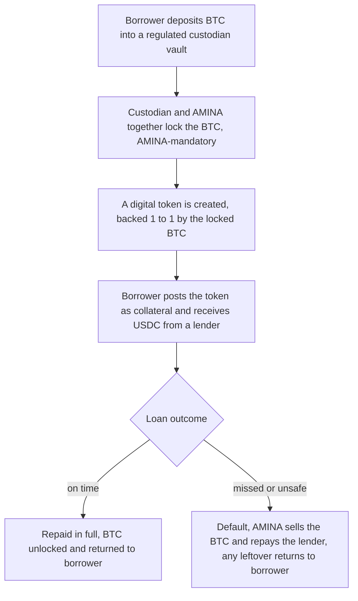

# P2PxAmina — How We Tokenize Collateral, Explained Simply

**For:** product owners, business stakeholders, partners. No engineering background needed.
**Companion (technical):** `Revised-tokenization-architecture.md`; for the concrete step-by-step BTC flow, `BTC-tokenization-flow.md`.

---

## TL;DR (one-minute read)

- **What:** P2PxAmina lets an institution borrow USDC against its BTC (later ETH and real-world assets) **without ever giving up custody of the BTC**. It's the crypto version of a tri-party repo — the model BNY Mellon runs for banks.
- **The core promise:** the BTC **can only leave the vault in one of two ways — the borrower repays, or AMINA liquidates a defaulted loan.** Nothing and no one else can move it. Not the borrower, not a hacker, not even P2P.
- **How that's guaranteed:** the BTC sits in a regulated custodian's vault in a "locked" account that **requires AMINA's signature to move**, and the digital token representing it can only travel inside our platform. To steal the BTC you'd have to defeat *two* independent locks at once — the on-chain rules *and* AMINA's custody key. No single party can do both.
- **Who does what:** **custodians** (BitGo, Fireblocks, Fordefi, Copper) hold the real BTC and create the digital token; **AMINA** is the regulated bank that approves, prices, monitors, and is the only party allowed to liquidate; **P2P** builds and runs the platform but never touches the assets or makes credit decisions.
- **Why it's low-risk to build:** every piece already runs in production elsewhere (Swiss bank Sygnum does bank-co-signed BitGo-style BTC loans; JPMorgan and HQLAx already pledge assets on-chain without moving them; the digital-token rules are an established standard). We're assembling proven parts, not inventing new ones.
- **Path to launch:** build the tokenization layer → integrate one custodian first (Fireblocks) → independent security audit → small pilot loan on testnet → small real loan on mainnet → add more custodians and asset types.
- **The one genuinely hard problem** — making BTC collateral work with *zero* trust in any custodian — is deliberately left for a later version; for v1 we rely on regulated custodians, which is the right and standard choice for institutional clients.

---

## 1. What we're building

A bank or fund has Bitcoin and wants cash (USDC) for a few months — but doesn't want to sell the Bitcoin (taxable event, loses the upside). Today that's slow and risky. We make it fast and safe:

- The borrower's BTC stays in a **regulated custodian's vault** (BitGo, Fireblocks, etc.) — it never moves to us or to the lender.
- We create a **digital token** that represents that locked BTC — a kind of on-chain receipt.
- The borrower posts that token as collateral and receives USDC from a lender.
- When the loan is repaid, the BTC is unlocked. If the borrower defaults, **AMINA** (the regulated bank) sells the BTC to repay the lender.

This is exactly how **tri-party repo** works in traditional finance — the bank pledges securities, gets cash, and a tri-party agent (like BNY Mellon) holds the collateral. We're doing the same thing for crypto, with **AMINA Bank as the tri-party agent**.

---

## 2. The core promise (and why you can trust it)

> **The BTC can only leave the vault to the place the loan's status dictates — back to the borrower (on repayment) or to AMINA (on default) — and AMINA must approve every movement.**

Think of the BTC as sitting in a **safety-deposit box that needs two keys to open**, and the box has a rule about *where* its contents can go depending on the loan status:

| Loan status | Where the BTC can go | Who can trigger it |
|---|---|---|
| Active / healthy | Nowhere — it's locked | nobody |
| Repaid in full | Back to the borrower | the borrower (by repaying) |
| Defaulted | To AMINA, to repay the lender | only AMINA |

The destination is decided by the **loan's status on the blockchain**, not by anyone's discretion. So AMINA can't hold a repaid borrower's BTC hostage, and the borrower can't get the BTC out without repaying.

---

## 3. The three things that make it safe

Everything in the design serves three guarantees:

1. **It's really backed.** Every digital token is created only after the real BTC is confirmed locked in the vault. The system mechanically refuses to create more tokens than there is BTC backing them — so a token always equals real Bitcoin.

2. **It's really locked.** The vault account needs **AMINA's signature to move anything**. The borrower (who owns the BTC) physically cannot withdraw it while it's pledged. This is the part that prevents the borrower from quietly emptying the vault behind our backs — and it's the same approach Swiss bank Sygnum uses for its Bitcoin loans.

3. **It only moves where the rules say.** The BTC is released only against a "release authorization" the platform produces automatically based on the loan's status — and AMINA co-signs the actual movement. Two independent approvals, every time.

**To steal the BTC, an attacker would need to break two locks at the same time:** forge the platform's release authorization *and* compromise AMINA's custody key. No single party — borrower, custodian employee, P2P, or an outside hacker — can do both.

---

## 4. How a loan works, start to finish

The borrower sees one simple position: their collateral, their loan, their interest, and how healthy the loan is. All the locking, token creation, and approvals happen behind the scenes.

---

## 5. The custodians — what each one is and how it fits

A **custodian** is a regulated company that safely holds crypto for institutions (like a digital-asset bank vault). We support four, and our system is built so adding more is easy.

**Important decision — the token is always ours.** We do **not** use each custodian's own token product. We deploy **one unified token contract that we control**, identical across every custodian, and the custodian's only job in token creation is to **provide the signature that authorizes a mint** (plus holding the BTC and proving it's there). The reasons: one set of rules to audit, the token behaves the same everywhere, we keep control of upgrades, there's no vendor lock-in, and a custody-only provider like Copper still fits. (See "Whose token is it?" below.)

| Custodian | What it is | Its role for us | Best suited for |
|---|---|---|---|
| **Fireblocks** | The largest institutional crypto-custody and tokenization platform | Holds the BTC, runs the approval rules, and **signs** the creation of our token | **Our first integration** — most turnkey |
| **BitGo** | The original institutional custodian; now holds a US national trust-bank charter; runs the custody behind WBTC | Holds the BTC and **signs** the mint of our token; AMINA is added as a required approver | Proven BTC custody at scale |
| **Fordefi** | A custody platform with very fine-grained approval controls (now owned by Paxos) | Holds the BTC and **signs** the mint, with extra-strict, simulate-before-sign controls on every action | Tightest programmatic control over what can be created |
| **Copper** | A custody + settlement network with a legal trust structure protecting client assets | Holds the BTC and helps settle; the mint is **signed by a separate AMINA-controlled setup** rather than by Copper | Cases where custody and token-signing are kept separate |

In every case, **AMINA is a required approver** — the custodian alone cannot move the pledged BTC, and our token cannot be minted without AMINA's sign-off plus the automatic "is it really backed?" check.

### Whose token is it? (an important detail in plain terms)

There are two ways to do this, and we chose the second:

- **Use each custodian's own token product.** Simple to start, but every custodian's token would behave a little differently, we'd audit and integrate each one separately, the custodian could change its token's behaviour under a live loan, and Copper (which doesn't issue tokens for this purpose) wouldn't fit.
- **Use one unified token we own; the custodian just signs (our choice).** One contract, one audit, identical behaviour everywhere, our control over upgrades, no lock-in, and every custodian — including custody-only Copper — fits the same model. The custodian still provides the real-world trust: it holds the BTC, signs the mint, and proves the reserves. We provide the on-chain rules: the token can only move inside our platform, can only be created against locked BTC, and can only be destroyed when the loan is repaid or liquidated.

In short: **the custodian is the vault and the signer; the token and its rules are ours.**

---

## 6. How the BTC is held safely

- The BTC goes into a **dedicated, segregated account** at the custodian for that one loan — never mixed with other funds.
- That account is set up so **moving anything requires multiple approvals, always including AMINA** (typically a "2-of-3" or "3-of-5" setup: borrower, custodian, AMINA, and independent signers). The borrower's approval alone is never enough.
- The custodian flags the balance as "pledged" and will only release it against a valid release authorization from our platform.
- The custodian regularly proves (with cryptographic attestations and, where available, independent third-party reserve feeds) that the BTC is actually there.

**Why the borrower can't cheat and only AMINA can liquidate:** the borrower can't move the BTC (not enough approvals) and can't get it back except by repaying; only AMINA can declare a loan defaulted, so only AMINA can trigger a sale.

---

## 7. How real-world assets (RWA) are held safely — later phase

The same machinery extends to tokenized treasuries, fund shares, and bonds, with two differences:

- The "lock" is a **legal pledge** on a custody account or a special-purpose company (an SPV), instead of a Bitcoin vault — confirmed by lawyers and recorded on-chain.
- The asset's value comes from its **published net asset value (NAV)** rather than a market price, supplied by the fund's administrator.

Everything else — AMINA-approved release, controlled destinations, the "really backed" check — works the same way. This is how BlackRock, Franklin Templeton, and others already tokenize funds today.

---

## 8. Can anyone steal the assets? (the short version)

| Who | Could they steal it? | Why not |
|---|---|---|
| The borrower | No | Can't move pledged BTC (needs AMINA); can only get it back by repaying |
| A custodian employee | No | Needs AMINA's co-approval to move anything; can't create unbacked tokens |
| Borrower + custodian together | No | AMINA's approval is still required and won't be given without a valid loan-status trigger |
| A hacker who breaks the on-chain platform | No | The token only works inside our platform and is worthless elsewhere; releasing the real BTC still needs AMINA's custody key |
| P2P (us) | No | P2P never holds assets and can't approve custody movements |
| One stolen AMINA key | No | AMINA actions need multiple signers; one key isn't enough |
| AMINA itself | Bounded by the rules | AMINA can only liquidate a loan that has actually defaulted or matured, and every action is recorded publicly and auditable |

The only party we *do* trust is **AMINA — the regulated, accountable bank** — and even AMINA is constrained by the on-chain rules and a public audit trail. That's the appropriate and standard trust model for institutional finance.

---

## 9. Who does what

| Party | Role | Touches the assets? | Makes credit decisions? | Earns |
|---|---|---|---|---|
| **Borrower** | Posts BTC, takes USDC, repays | Owns the BTC (in custody) | No | — |
| **Lender** | Provides USDC, earns interest | No | No | interest |
| **AMINA Bank** | Approves clients, sets rates, monitors, and is the **only** party that can liquidate | Co-controls the vault | Yes (regulated) | 20 bps + liquidation bonus |
| **P2P Staking** | Builds and runs the platform | **Never** | **No** | 20 bps |
| **Custodian** | Holds the real BTC, creates the token | Holds it | No | custody fee |

---

## 10. Path to launch

| Phase | What happens | Rough effort |
|---|---|---|
| **1. Build the tokenization layer** | The smart contracts that lock pledges, create tokens, and authorize releases | ~3 weeks |
| **2. Integrate the first custodian (Fireblocks)** | Connect the platform to a real custody setup with AMINA as approver | ~3 weeks |
| **3. Wire up the safety checks** | The "really backed" guard, pricing, freeze-on-problem rules | ~2 weeks |
| **4. Internal hardening** | Heavy automated testing; a full dry-run loan on a test network | ~2 weeks |
| **5. Independent security audit** | Two top audit firms in parallel; fix findings | ~5–6 weeks |
| **6. Testnet pilot** | One full loan lifecycle with AMINA's teams operating it | ~2 weeks |
| **7. First real loan (small)** | A small real loan on mainnet, conservative limits, close monitoring | ~3 weeks |
| **8. Scale up** | Add BitGo, Fordefi, Copper; add ETH and RWA collateral | ongoing |

**Total to a first real loan: roughly 4–5 months**, the bulk of which is the security audit (non-negotiable for institutional trust).

---

## 11. Decisions we need from the business

**Already decided:**

- **The token is ours, unified across custodians; custodians only hold the BTC, sign mints, and prove reserves.** (See §5 "Whose token is it?")

**Still open:**

1. **Which custodian first?** (Recommendation: Fireblocks — most turnkey.)
2. **Exactly how is AMINA wired into each custody vault** — as a key-holder, an approver, or both?
3. **How often must the custodian re-prove the BTC is there**, and how stale is too stale before we pause?
4. **Confirm with lawyers** that leftover collateral after a liquidation legally belongs to the borrower, in every market we operate.
5. **Does AMINA put up any of its own capital** as a first-loss buffer? (Current plan: no, in v1 — AMINA's accountability is regulatory and contractual.)
6. **When, if ever, do we pursue the "no-trust-in-custodian" version** (a more advanced, fully cryptographic BTC lock)? Out of scope for v1.

---

## 12. The bottom line

P2PxAmina makes a bank's Bitcoin usable as loan collateral **without the bank ever losing custody and without anyone being able to steal it**. The safety comes from three simple ideas working together: the token is always backed by real BTC, the BTC is locked behind AMINA's mandatory approval, and it can only ever move to where the loan's status says it should. Every one of these mechanisms already runs in production at regulated banks and major custodians today — so this is an integration effort, not a science experiment, and it can reach a first real loan in about four to five months.
