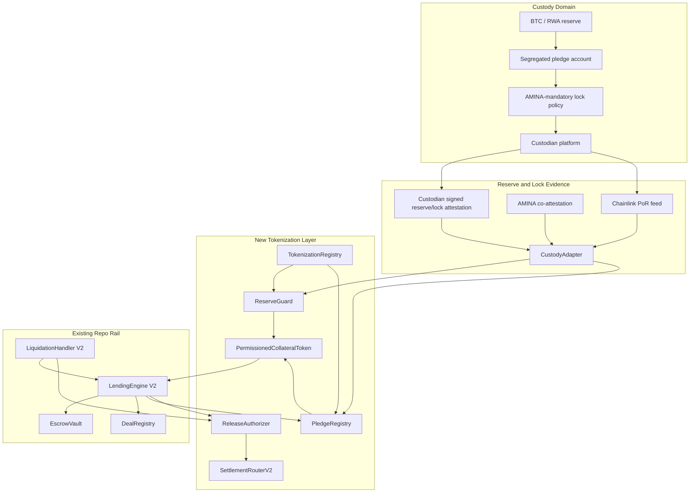
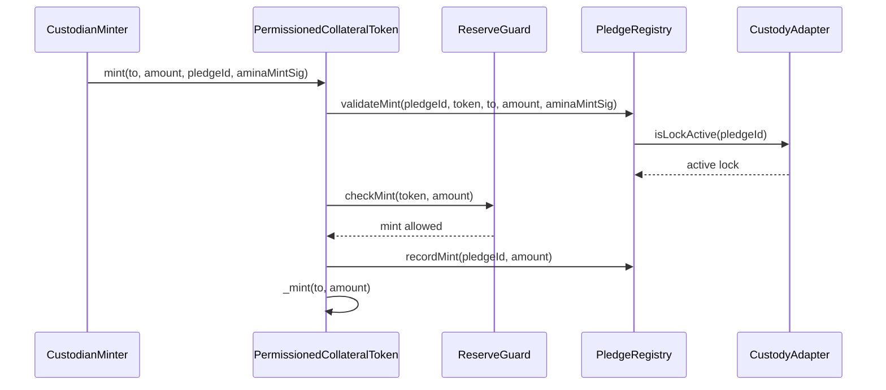
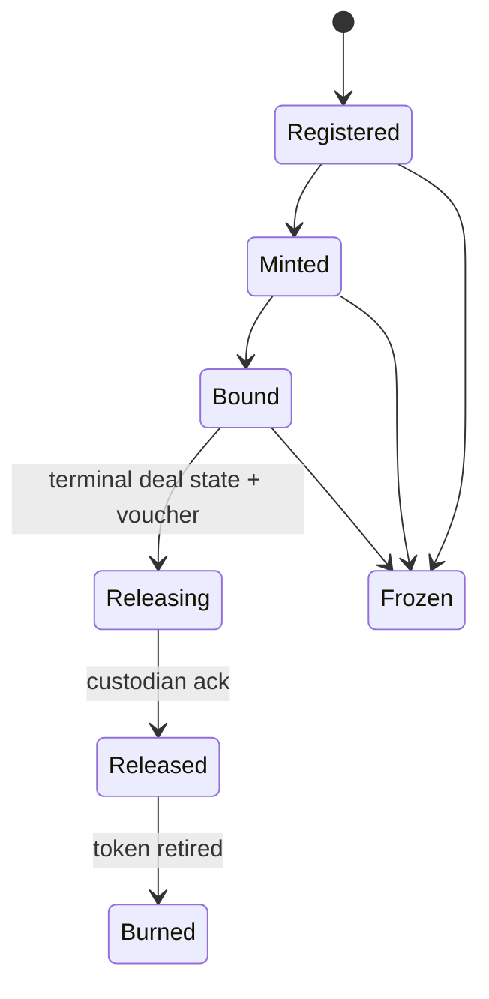
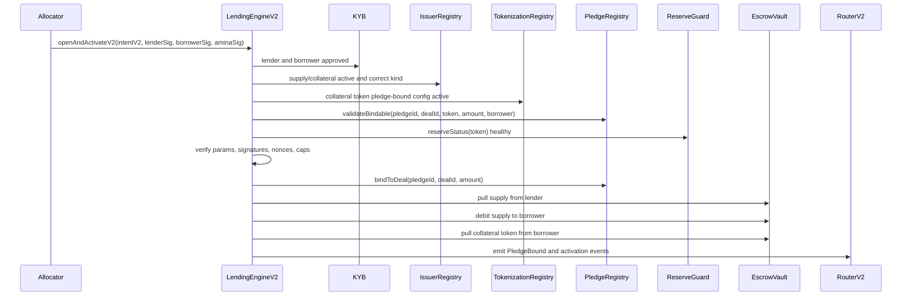

# Chainlink PoR Implementation Plan for P2PxAmina

Date: 2026-06-19

This document is a technical implementation plan for adding Proof of Reserve (PoR) to P2PxAmina. It is based on:

- `Taurus/PoR-for-P2PxAmina-gpt-2.md`
- local Chainlink PoR corpus under `Taurus/Chainlink-PoR`
- current P2PxAmina source under `src/`
- current P2PxAmina collateral tokenization docs under `docs/`

## Executive Implementation Decision

Implement a P2PxAmina-native `ReserveGuard` that uses Chainlink Proof of Reserve feeds through `AggregatorV3Interface`, copying the important semantics of Chainlink ACE `SecureMintPolicy`, but do not integrate the full ACE policy engine in v1.

The v1 rule should be:

```text
mintedSupplyAfterMint <= min(freshChainlinkPoR, freshCustodianAttestation) - positiveReserveMargin
```

Where a Chainlink feed is not yet available for the exact custody address set:

```text
mintedSupplyAfterMint <= freshCustodianAttestation - positiveReserveMargin
```

This fallback is acceptable only for a controlled institutional pilot. The production target should use Chainlink PoR as the independent reserve source wherever Chainlink can provide or support a feed for the custodian address set.

Do not treat Chainlink PoR as the whole reserve solution. For P2PxAmina, PoR is three facts:

1. The backing asset exists.
2. The backing asset is locked under AMINA-mandatory release control.
3. The asset can leave custody only to the destination dictated by onchain deal state.

Chainlink PoR can help with fact 1. P2PxAmina must implement facts 2 and 3 with `PledgeRegistry`, custody policy, and `ReleaseAuthorizer`.

## Chainlink PoR Material Learned Locally

The downloaded source and docs are stored here:

```text
/Users/alex/RustroverProjects/mellow/Taurus/Chainlink-PoR
```

Important local paths:

| Local path | Use |
|---|---|
| `Taurus/Chainlink-PoR/notes/SOURCE-INDEX.md` | Index of downloaded repos, docs, commit SHAs, and key files. |
| `Taurus/Chainlink-PoR/repos/chainlink-evm/contracts/src/v0.8/shared/interfaces/AggregatorV3Interface.sol` | Feed interface P2PxAmina should import. |
| `Taurus/Chainlink-PoR/repos/chainlink-ace/packages/policy-management/src/policies/SecureMintPolicy.sol` | Reference implementation for secure mint semantics. |
| `Taurus/Chainlink-PoR/repos/chainlink-ace/packages/policy-management/test/policies/SecureMintPolicy.t.sol` | Tests for margins, stale feeds, negative answers, decimal scaling, and over-mint rejection. |
| `Taurus/Chainlink-PoR/repos/documentation/src/content/data-feeds/smartdata/index.mdx` | Chainlink SmartData and PoR docs source. |
| `Taurus/Chainlink-PoR/repos/documentation/src/content/ace/reference/policy-library/secure-mint-policy.mdx` | SecureMintPolicy docs source. |

### Key Chainlink Facts To Encode

Single-value Chainlink SmartData/PoR feeds are read the same way as price feeds:

```solidity
interface AggregatorV3Interface {
    function decimals() external view returns (uint8);
    function latestRoundData()
        external
        view
        returns (
            uint80 roundId,
            int256 answer,
            uint256 startedAt,
            uint256 updatedAt,
            uint80 answeredInRound
        );
}
```

For PoR, `answer` is a reserve amount in reserve units, not a USD price. Examples include token counts, BTC units, ounces, or other asset units depending on the feed. P2PxAmina must not route PoR feed values through price-oracle code.

Chainlink SmartData docs describe two broad reserve-source categories:

- Offchain reserves, sourced through external adapters from auditors, custodians, accounting firms, fund administrators, asset managers, appraisers, regulators, or issuer APIs.
- Cross-chain reserves, sourced from where reserves are held, sometimes through address lists or self-reported wallet address APIs.

The docs explicitly distinguish higher-quality third-party data from self-reported data. P2PxAmina should treat self-reported feeds as weaker evidence and require AMINA/custodian direct attestation as a second source.

### Chainlink SecureMintPolicy Semantics To Reuse

`SecureMintPolicy` has the right high-level onchain rule:

```text
currentTokenSupply + requestedMintAmount <= scaledReserveLimit
```

The implementation does these important things:

- reads a Chainlink reserve feed with `latestRoundData()`;
- rejects negative reserve values;
- rejects stale reserve data when `maxStalenessSeconds > 0`;
- reads feed decimals;
- scales the feed answer to token decimals;
- applies a margin mode;
- calls `totalSupply()` on the protected token;
- rejects a mint that would exceed reserve-backed mintable supply.

P2PxAmina should reuse these ideas, but with a custom implementation because the protocol also needs:

- pledge-level mint accounting;
- lock-status checks;
- min-of-two reserve sources;
- AMINA co-attested mint;
- tokenization registry integration;
- voucher-gated burn/release;
- current `AccessManager`/UUPS governance patterns rather than ACE's policy engine.

### SecureMintPolicy Behavior To Change For P2PxAmina

Chainlink ACE supports negative margins, where supply may exceed reported reserves by an absolute amount or percentage. Do not enable this in P2PxAmina v1.

Allowed v1 margin modes:

```solidity
enum ReserveMarginMode {
    None,
    PositivePercentage,
    PositiveAbsolute
}
```

Disallowed v1 margin modes:

```text
NegativePercentage
NegativeAbsolute
```

Reason: P2PxAmina collateral tokens are meant to represent custody-backed collateral. A negative reserve margin intentionally permits under-collateralized token supply and is the wrong default for regulated repo collateral.

## Current P2PxAmina Baseline

The repo currently implements the bilateral repo rail. It does not yet implement reserve proof or custody pledge proof.

Important current code anchors:

| File | Current behavior | PoR impact |
|---|---|---|
| `src/libraries/Types.sol` | Defines `TokenInfo`, `DealTerms`, `DealState`, `DealIntent`, and `DualPriceAttestation`. | `DealIntent` has no `pledgeId`; PoR v1 needs a new pledge-bound activation path. |
| `src/l1/IssuerRegistry.sol` | Admits ERC20 tokens, checks exact-transfer behavior, tracks token kind, pause state, and caps. | Tokenization reserve config should attach here only if storage risk is acceptable; safer path is a new `TokenizationRegistry`. |
| `src/l3/LendingEngine.sol` | `openAndActivate` verifies KYB, issuers, pair params, signatures, nonces, caps, then pulls supply and collateral into `EscrowVault`. | Needs pledge verification and binding before collateral pull. |
| `src/l3/LendingEngine.sol` | `_tokenToUsd` reads Chainlink-style price feeds for valuation. | Do not reuse price-feed config for reserve feeds. |
| `src/l3/EscrowVault.sol` | Immutable ledger; exact token pull; non-reverting collateral release. | Good for token accounting, but cannot prove external custody backing. |
| `src/l4/LiquidationHandler.sol` | AMINA-signed price attestation controls warn, partial liquidation, and full liquidation. | Liquidation must trigger state-derived custody release voucher. |
| `src/l4/SettlementRouter.sol` | Immutable v1 event emitter with sequence numbers. | Keep v1 stable; add `SettlementRouterV2` for pledge/voucher fields. |
| `remappings.txt` | Uses `@chainlink/contracts/=lib/chainlink-brownie-contracts/contracts/`. | Migrate to `chainlink-evm`, because Chainlink now directs new projects there. |

## Target Architecture



## Invariants

The implementation must preserve these invariants at all times.

### Reserve Invariants

```text
token.totalSupply() <= effectiveReserveLimit(token)
effectiveReserveLimit(token) = min(freshChainlinkReserve, freshAdapterReserve) - margin
```

If no Chainlink feed exists for the pilot:

```text
token.totalSupply() <= freshAdapterReserve - margin
```

This mode must be explicit in config, visible in `PortfolioLens`, and treated as lower-assurance.

### Pledge Invariants

```text
pledge.mintedAmount <= pledge.pledgedAmount
pledge.boundAmount <= pledge.mintedAmount
pledge.boundAmount <= pledge.freshLockedAmount
```

For every active deal:

```text
vault.getBalance(dealId, collateralToken) <= pledge.boundAmount
pledge.dealId == dealId
pledge.status == Bound
custodyAdapter.isLockActive(pledgeId) == true
```

### Release Invariants

```text
No release voucher exists for Active, Warned, or PartialLiquidated deals.
Repaid deals produce borrower-destination vouchers.
Liquidated or Defaulted deals produce AMINA-desk destination vouchers.
Callers cannot provide the release destination.
Each voucher is one-use.
Released pledges cannot be reminted or rebound.
```

### Oracle Separation Invariant

```text
Price feeds value collateral in USD.
Reserve feeds prove backing quantity.
The two feed planes never share config structs or heartbeat fields.
```

## Contract Additions

### 1. `src/l2/TokenizationRegistry.sol`

Purpose: store tokenization and reserve-source configuration without expanding `IssuerRegistry.TokenInfo` unless a storage migration is intentionally accepted.

Recommended storage:

```solidity
struct TokenizationConfig {
    bool enabled;
    bool pledgeBound;
    address adapter;
    address pledgeRegistry;
    address reserveGuard;
    address releaseAuthorizer;
    address chainlinkPoRFeed;
    uint8 tokenDecimals;
    uint8 reserveDecimals;
    uint64 chainlinkMaxAge;
    uint64 adapterMaxAge;
    ReserveSourceMode sourceMode;
    ReserveMarginMode marginMode;
    uint256 marginAmount;
    uint16 maxDiscrepancyBps;
    bytes32 custodyAgreementHash;
    bytes32 tokenPolicyHash;
    bytes32 reservePolicyHash;
}

enum ReserveSourceMode {
    None,
    AdapterOnly,
    ChainlinkOnly,
    MinOfAdapterAndChainlink
}

enum ReserveMarginMode {
    None,
    PositivePercentage,
    PositiveAbsolute
}
```

Admin methods:

```solidity
function setTokenizationConfig(address token, TokenizationConfig calldata config) external restricted;
function pauseTokenization(address token, bool paused, bytes32 reason) external restricted;
function setReserveSourceMode(address token, ReserveSourceMode mode) external restricted;
function setReserveMargin(address token, ReserveMarginMode mode, uint256 amount) external restricted;
function setChainlinkPoRFeed(address token, address feed, uint8 reserveDecimals, uint64 maxAge) external restricted;
function setAdapter(address token, address adapter, uint64 maxAge) external restricted;
```

Governance requirements:

- feed changes should be timelocked;
- adapter changes should be timelocked;
- enabling `AdapterOnly` for a production collateral token should require governance plus explicit risk signoff;
- guardian can pause tokenization immediately;
- all config setters emit full old/new values or enough indexed fields for monitoring.

Why separate registry:

- `IssuerRegistry` is already UUPS and has an ERC7201 storage namespace; adding fields can be safe if done carefully, but a separate registry reduces storage-layout risk.
- `IssuerRegistry` is about token admission and caps. `TokenizationRegistry` is about external reserve and pledge semantics.
- Existing tests and `DealRegistry` can continue to use old `TokenInfo` unchanged.

### 2. `src/l2/ReserveGuard.sol`

Purpose: enforce secure mint and reserve freshness.

Primary API:

```solidity
interface IReserveGuard {
    struct ReserveStatus {
        uint256 chainlinkReserve;
        uint256 adapterReserve;
        uint256 effectiveReserve;
        uint256 mintLimit;
        uint256 totalSupply;
        uint64 chainlinkUpdatedAt;
        uint64 adapterUpdatedAt;
        bool chainlinkFresh;
        bool adapterFresh;
        bool healthy;
        bytes32 reason;
    }

    function checkMint(address token, uint256 amount) external view returns (ReserveStatus memory status);
    function reserveStatus(address token) external view returns (ReserveStatus memory status);
    function previewMintLimit(address token) external view returns (uint256 mintLimit);
}
```

`checkMint(token, amount)` must revert or return `healthy == false` according to final code style. I recommend reverting in the mint path and returning structured status for views.

Suggested errors:

```solidity
error ReserveFeedUnset(address token);
error ReserveNegative(address token, address feed, int256 answer);
error ReserveStale(address token, address feed, uint256 updatedAt, uint256 maxAge);
error ReserveRoundIncomplete(address token, address feed, uint80 roundId, uint80 answeredInRound);
error ReserveBelowSupply(address token, uint256 supplyAfterMint, uint256 mintLimit);
error ReserveSourceDiscrepancy(address token, uint256 chainlinkReserve, uint256 adapterReserve, uint16 maxDiscrepancyBps);
error InvalidReserveDecimals(address token, uint8 reserveDecimals, uint8 tokenDecimals);
error NegativeReserveMarginDisabled();
```

#### Chainlink Read Logic

Implement a dedicated internal read function:

```solidity
function _readChainlinkReserve(address token, TokenizationConfig memory cfg)
    internal
    view
    returns (uint256 scaledReserve, uint64 updatedAt)
{
    if (cfg.chainlinkPoRFeed == address(0)) revert ReserveFeedUnset(token);

    AggregatorV3Interface feed = AggregatorV3Interface(cfg.chainlinkPoRFeed);
    (uint80 roundId, int256 answer,, uint256 feedUpdatedAt, uint80 answeredInRound) = feed.latestRoundData();

    if (answer <= 0) revert ReserveNegative(token, cfg.chainlinkPoRFeed, answer);
    if (feedUpdatedAt == 0) revert ReserveStale(token, cfg.chainlinkPoRFeed, 0, cfg.chainlinkMaxAge);
    if (cfg.chainlinkMaxAge == 0) revert ReserveStale(token, cfg.chainlinkPoRFeed, feedUpdatedAt, 0);
    if (block.timestamp - feedUpdatedAt > cfg.chainlinkMaxAge) {
        revert ReserveStale(token, cfg.chainlinkPoRFeed, feedUpdatedAt, cfg.chainlinkMaxAge);
    }
    if (answeredInRound < roundId) {
        revert ReserveRoundIncomplete(token, cfg.chainlinkPoRFeed, roundId, answeredInRound);
    }

    uint8 feedDecimals = feed.decimals();
    scaledReserve = _scaleReserveToTokenDecimals(uint256(answer), feedDecimals, cfg.tokenDecimals);
    updatedAt = uint64(feedUpdatedAt);
}
```

Notes:

- Chainlink ACE's `SecureMintPolicy` rejects `reserve < 0`; P2PxAmina should reject `answer <= 0`, because a zero reserve should not allow minting and usually means no backing.
- Chainlink ACE allows `maxStalenessSeconds == 0` to disable staleness. P2PxAmina should not allow `0` for live tokens. Use `0` only in tests if needed.
- `answeredInRound` is legacy but cheap to check. If a target feed consistently returns `0` for both `roundId` and `answeredInRound`, document an exception in config and tests. The default should be fail-closed.

#### Decimal Scaling

Implement a small library rather than inline math in multiple contracts:

```solidity
library ReserveMath {
    function scaleToTokenDecimals(uint256 reserve, uint8 reserveDecimals, uint8 tokenDecimals)
        internal
        pure
        returns (uint256)
    {
        if (reserveDecimals == tokenDecimals) return reserve;
        if (tokenDecimals > reserveDecimals) {
            return reserve * 10 ** (uint256(tokenDecimals) - uint256(reserveDecimals));
        }
        return reserve / 10 ** (uint256(reserveDecimals) - uint256(tokenDecimals));
    }
}
```

Security details:

- Cap decimals to `<= 18` for v1, matching Chainlink ACE's guardrail.
- When scaling down, division rounds down. That is conservative for reserves and should be documented.
- Never scale reserve values with USD price decimals.
- Tests must cover 8-decimal BTC tokens, 18-decimal ERC20s, and feed decimals lower/higher than token decimals.

#### Effective Reserve Logic

```solidity
function _effectiveReserve(address token, TokenizationConfig memory cfg)
    internal
    view
    returns (uint256 reserve)
{
    if (cfg.sourceMode == ReserveSourceMode.ChainlinkOnly) {
        (reserve,) = _readChainlinkReserve(token, cfg);
        return reserve;
    }

    if (cfg.sourceMode == ReserveSourceMode.AdapterOnly) {
        (reserve,) = _readAdapterReserve(token, cfg);
        return reserve;
    }

    if (cfg.sourceMode == ReserveSourceMode.MinOfAdapterAndChainlink) {
        (uint256 chainlinkReserve,) = _readChainlinkReserve(token, cfg);
        (uint256 adapterReserve,) = _readAdapterReserve(token, cfg);
        _checkDiscrepancy(token, chainlinkReserve, adapterReserve, cfg.maxDiscrepancyBps);
        return chainlinkReserve < adapterReserve ? chainlinkReserve : adapterReserve;
    }

    revert ReserveFeedUnset(token);
}
```

Discrepancy policy:

- If the two reserves differ by less than or equal to `maxDiscrepancyBps`, use the lower value.
- If the difference is greater than `maxDiscrepancyBps`, freeze mints and new activations.
- Repay, release, and liquidation should remain possible unless governance explicitly pauses them.

Recommended initial values:

| Parameter | Pilot value |
|---|---|
| `sourceMode` | `MinOfAdapterAndChainlink` where feed exists; otherwise `AdapterOnly` |
| `chainlinkMaxAge` | feed heartbeat plus 10% buffer, minimum 10 minutes |
| `adapterMaxAge` | 10 minutes for pilot BTC custody |
| `maxDiscrepancyBps` | 50 to 100 bps for BTC, final value after custodian feed behavior is observed |
| `marginMode` | `PositivePercentage` |
| `marginAmount` | 50 to 100 bps for BTC pilot |

### 3. `src/interfaces/ICustodyAdapter.sol`

Purpose: normalize custodian-specific reserve, lock, and release evidence.

```solidity
interface ICustodyAdapter {
    struct ReserveAttestation {
        address collateralToken;
        uint256 reserveAmount;
        uint64 asOf;
        bytes32 sourceId;
        bytes32 evidenceHash;
    }

    struct PledgeAttestation {
        bytes32 pledgeId;
        address collateralToken;
        bytes32 custodyAccountRef;
        bytes32 assetId;
        uint256 amount;
        uint64 asOf;
        uint64 expiry;
        bytes32 lockPolicyHash;
        bytes32 evidenceHash;
    }

    function attestedReserves(address collateralToken)
        external
        view
        returns (uint256 amount, uint64 asOf, bytes32 evidenceHash);

    function verifyPledge(
        PledgeAttestation calldata attestation,
        bytes calldata custodianSig,
        bytes calldata aminaSig
    ) external view returns (bool ok, bytes32 reason);

    function isLockActive(bytes32 pledgeId) external view returns (bool ok, uint64 asOf, bytes32 evidenceHash);

    function releaseAcknowledged(bytes32 pledgeId, bytes32 voucherRef)
        external
        view
        returns (bool ok, uint64 asOf, bytes32 txRef);
}
```

Adapter implementation options:

1. `SignedCustodyAdapter`: generic EIP-712 adapter for pilot and tests.
2. `FireblocksAdapter`: verifies Fireblocks/Tokeny evidence formats once integration details are final.
3. `BitGoAdapter`: BTC-first adapter that supports Chainlink PoR over BitGo-held BTC addresses if available.
4. `AminaInternalAdapter`: for AMINA-as-custodian pilot, but with separate custody signer and AMINA risk signer.

For v1, build `SignedCustodyAdapter` first. It makes the contract testable without custodian API dependencies and gives a clean target for replacing signatures with custodian-specific verification later.

### 4. `src/l2/PledgeRegistry.sol`

Purpose: bind real custodial assets to collateral-token supply and then to repo deals.

Storage:

```solidity
enum PledgeStatus {
    None,
    Registered,
    Minted,
    Bound,
    Releasing,
    Released,
    Frozen
}

struct Pledge {
    address custodian;
    address adapter;
    address collateralToken;
    bytes32 custodyAccountRef;
    bytes32 assetId;
    uint256 pledgedAmount;
    uint256 mintedAmount;
    uint256 boundAmount;
    bytes32 dealId;
    bytes32 attestationHash;
    bytes32 lockPolicyHash;
    uint64 lastAttestedAt;
    uint64 expiry;
    PledgeStatus status;
}
```

Recommended mappings:

```solidity
mapping(bytes32 pledgeId => Pledge pledge) private pledges;
mapping(bytes32 dealId => bytes32 pledgeId) private pledgeOfDeal;
mapping(address token => uint256 totalPledged) private totalPledgedByToken;
mapping(address token => uint256 totalMintedFromPledges) private totalMintedByToken;
mapping(address token => uint256 totalBoundToDeals) private totalBoundByToken;
mapping(bytes32 voucherRef => bool used) private usedVoucherRefs;
```

Entry points:

```solidity
function registerPledge(
    ICustodyAdapter.PledgeAttestation calldata att,
    bytes calldata custodianSig,
    bytes calldata aminaSig
) external restricted returns (bytes32 pledgeId);

function recordMint(bytes32 pledgeId, uint256 amount) external;

function bindToDeal(bytes32 pledgeId, bytes32 dealId, uint256 amount) external;

function addBoundAmount(bytes32 pledgeId, bytes32 dealId, uint256 amount) external;

function markReleasing(bytes32 pledgeId, bytes32 voucherRef, uint256 amount) external;

function markReleased(bytes32 pledgeId, bytes32 voucherRef) external restricted;

function freezePledge(bytes32 pledgeId, bytes32 reason) external restricted;

function refreshPledge(bytes32 pledgeId, ICustodyAdapter.PledgeAttestation calldata att, bytes calldata custodianSig, bytes calldata aminaSig) external restricted;
```

Access policy:

| Function | Caller |
|---|---|
| `registerPledge` | allocator/operator or borrower path, but requires custodian + AMINA signatures |
| `recordMint` | only configured collateral token |
| `bindToDeal` | only `LendingEngineV2` |
| `addBoundAmount` | only `LendingEngineV2` for top-ups |
| `markReleasing` | only `ReleaseAuthorizer` |
| `markReleased` | restricted settlement operator after adapter confirms |
| `freezePledge` | guardian/governor |
| `refreshPledge` | restricted reserve operator with fresh signatures |

Rules:

- `pledgedAmount > 0`.
- `expiry > block.timestamp`.
- `adapter != address(0)`.
- `collateralToken` has active tokenization config.
- `adapter.verifyPledge(...)` returns true.
- `adapter.isLockActive(pledgeId)` returns true.
- `recordMint` requires `mintedAmount + amount <= pledgedAmount`.
- `bindToDeal` requires `status == Minted` or `status == Registered` with enough minted amount depending on whether mint happens before activation.
- v1 should use one pledge per deal. Multi-pledge deals can be added later with a separate `DealPledgeSet`.
- a released pledge cannot return to `Registered`, `Minted`, or `Bound`.

### 5. `src/tokens/PermissionedCollateralToken.sol`

Purpose: ERC20 collateral representation that cannot be freely used outside the protocol.

Base options:

- CMTAT-based token if AMINA wants CMTA alignment and legal/token standard reuse.
- ERC-3643/T-REX if Tokeny is the issuance path.
- Minimal P2PxAmina permissioned ERC20 for first internal prototype.

For the first code implementation, a minimal internal token is easier to test. For production, swap to CMTAT or ERC-3643 after confirming the final issuance vendor.

Required mint API:

```solidity
function mint(
    address to,
    uint256 amount,
    bytes32 pledgeId,
    bytes calldata aminaMintSig
) external onlyCustodianMinter;
```

Mint flow:



Important ordering:

- `checkMint` should see current `totalSupply` before `_mint`.
- `recordMint` should happen before `_mint` only if the whole token call reverts atomically on `_mint` failure. That is fine.
- If using external calls to adapters inside `recordMint`, guard against reentrancy. The token should be `nonReentrant`.

Transfer policy:

Allowed v1 transfer paths:

| From | To | Purpose |
|---|---|---|
| `address(0)` | borrower or protocol mint recipient | mint |
| borrower | `EscrowVault` | activation/top-up collateral post |
| `EscrowVault` | borrower redemption escrow or token burn path | repayment release |
| `EscrowVault` | AMINA liquidation desk or burn path | liquidation |
| any allowed holder | `address(0)` | burn |

Everything else should revert.

Implementation:

```solidity
function _update(address from, address to, uint256 value) internal override {
    if (from != address(0) && to != address(0)) {
        if (!transferPolicy.isTransferAllowed(from, to, msg.sender, value)) {
            revert TransferNotAllowed(from, to, msg.sender);
        }
    }
    super._update(from, to, value);
}
```

Burn API:

```solidity
function redeemBurn(uint256 amount, bytes32 voucherRef) external;
function burnFromRelease(bytes32 pledgeId, bytes32 voucherRef, uint256 amount) external onlyReleaseAuthorizer;
```

Recommendation: make `ReleaseAuthorizer` the only burn path for custody release in v1. If custodian tooling requires holder-initiated burn, route it through `ReleaseAuthorizer.verifyVoucher(...)`.

### 6. `src/l4/SettlementRouterV2.sol`

Keep `SettlementRouter` v1 immutable. Add V2 rather than changing event meanings.

New events:

```solidity
event PledgeBound(
    bytes32 indexed dealId,
    bytes32 indexed pledgeId,
    address indexed collateralToken,
    uint256 amount,
    uint64 sequenceNumber
);

event CollateralReleaseVoucher(
    bytes32 indexed dealId,
    bytes32 indexed pledgeId,
    address indexed collateralToken,
    bytes32 assetId,
    uint256 amount,
    uint8 destinationType,
    bytes32 destinationRef,
    bytes32 reason,
    bytes32 voucherRef,
    uint64 sequenceNumber,
    uint64 issuedAt
);

event ReleaseAcknowledged(
    bytes32 indexed dealId,
    bytes32 indexed pledgeId,
    bytes32 indexed voucherRef,
    bytes32 custodianTxRef,
    uint64 sequenceNumber
);

event ReserveShortfall(
    address indexed collateralToken,
    uint256 reserveAmount,
    uint256 totalSupply,
    bytes32 reason,
    uint64 sequenceNumber
);
```

Use the same one-shot binding pattern as v1:

```text
binder binds engine, handler, and releaseAuthorizer once.
only those emitters can emit state-changing settlement events.
sequence numbers remain monotonic per router.
```

### 7. `src/l4/ReleaseAuthorizer.sol`

Purpose: produce canonical custody release authority from onchain deal state.

Voucher:

```solidity
enum DestinationType {
    None,
    Borrower,
    AminaDesk
}

struct ReleaseVoucher {
    bytes32 dealId;
    bytes32 pledgeId;
    address collateralToken;
    bytes32 assetId;
    uint256 amount;
    DestinationType destinationType;
    bytes32 destinationRef;
    bytes32 reason;
    uint64 sequenceNumber;
    uint64 issuedAt;
}
```

Entry points:

```solidity
function authorizeRepaymentRelease(bytes32 dealId) external returns (bytes32 voucherRef);
function authorizeLiquidationRelease(bytes32 dealId) external returns (bytes32 voucherRef);
function acknowledgeRelease(bytes32 pledgeId, bytes32 voucherRef, bytes32 custodianTxRef) external restricted;
function voucher(bytes32 voucherRef) external view returns (ReleaseVoucher memory);
function isVoucherValid(bytes32 voucherRef) external view returns (bool);
```

Rules:

- For repayment, the deal state must be `Repaid` or `Repaid_PendingCollateralRelease`.
- For liquidation, the deal state must be `Liquidated` or `Defaulted`.
- Destination is derived from pledge/deal metadata:
  - repayment destination = borrower custody account ref;
  - liquidation destination = AMINA liquidation desk account ref;
  - surplus destination = borrower custody account ref, if surplus is modeled separately.
- Caller cannot pass `destinationRef`.
- Voucher ref is deterministic:

```solidity
bytes32 voucherRef = keccak256(abi.encode(
    block.chainid,
    address(this),
    dealId,
    pledgeId,
    amount,
    destinationType,
    destinationRef,
    reason,
    sequenceNumber
));
```

State machine:



## Existing Contract Modifications

### Dependency and Remapping Migration

Current remapping:

```text
@chainlink/contracts/=lib/chainlink-brownie-contracts/contracts/
```

Recommended migration:

```text
@chainlink/contracts/=lib/chainlink-evm/contracts/
```

Suggested command:

```bash
forge install smartcontractkit/chainlink-evm@105433c1ac6614d521d326369dad57802b59a3d2
```

Then remove the old Brownie remapping only after `forge build` and `forge test` pass. The Chainlink Brownie repo now points new projects to `chainlink-evm`; the PoR implementation should follow that direction.

### `Types.sol`

Do not break the existing `DealRegistry` unless the project is comfortable redeploying it. `DealRegistry` is immutable and stores `Types.DealTerms` directly.

Safer v1 approach:

- keep `Types.DealTerms` unchanged;
- add a new `Types.DealIntentV2` for pledge-bound activation;
- keep the original `openAndActivate` for non-pledge collateral if still needed;
- add `openAndActivateV2(Types.DealIntentV2 calldata intent, ...)`;
- store pledge binding in `PledgeRegistry`, not in `DealRegistry`.

Recommended `DealIntentV2`:

```solidity
struct DealIntentV2 {
    address lender;
    address borrower;
    address supplyToken;
    address collateralToken;
    uint128 principal;
    uint128 collateralAmount;
    uint32 rateBps;
    uint64 startTs;
    uint64 maturityTs;
    bytes32 pairKey;
    uint32 paramVersion;
    bytes32 nonceLender;
    bytes32 nonceBorrower;
    bytes32 nonceAmina;
    bytes32 legalTermsHash;
    bytes32 pledgeId;
    bytes32 borrowerCustodyAccountRef;
    bytes32 lenderCustodyAccountRef;
    bytes32 reservePolicyHash;
    bytes32 settlementInstructionsHash;
}
```

If this is pre-production and redeployment is acceptable, replacing `DealIntent` and `DealTerms` directly is cleaner. If there is any chance of preserving deployed state, use V2 sidecar fields.

### `EIP712Hashes.sol`

Add:

```solidity
bytes32 internal constant DEAL_INTENT_V2_TYPEHASH = keccak256(
    "DealIntentV2(address lender,address borrower,address supplyToken,address collateralToken,uint128 principal,uint128 collateralAmount,uint32 rateBps,uint64 startTs,uint64 maturityTs,bytes32 pairKey,uint32 paramVersion,bytes32 nonceLender,bytes32 nonceBorrower,bytes32 nonceAmina,bytes32 legalTermsHash,bytes32 pledgeId,bytes32 borrowerCustodyAccountRef,bytes32 lenderCustodyAccountRef,bytes32 reservePolicyHash,bytes32 settlementInstructionsHash)"
);
```

Add:

```solidity
function hashDealIntentV2(Types.DealIntentV2 memory intent) internal pure returns (bytes32);
```

Tests must prove:

- V1 and V2 hashes differ.
- Changing `pledgeId` changes the typed hash.
- Changing `reservePolicyHash` changes the typed hash.
- Old V1 signatures cannot activate V2 pledge-bound deals.

### `LendingEngine.sol`

Add a new storage namespace rather than changing the existing `Storage` struct if upgrade safety matters:

```solidity
/// @custom:storage-location erc7201:p2pxamina.lendingengine.por.v1
struct PoRStorage {
    ITokenizationRegistry tokenization;
    IPledgeRegistry pledgeRegistry;
    IReleaseAuthorizer releaseAuthorizer;
    ISettlementRouterV2 routerV2;
}
```

Setters:

```solidity
function setTokenizationRegistry(address registry) external restricted;
function setPledgeRegistry(address pledgeRegistry) external restricted;
function setReleaseAuthorizer(address releaseAuthorizer) external restricted;
function setSettlementRouterV2(address routerV2) external restricted;
```

Use timelock for setters except emergency pause.

#### `openAndActivateV2`

Recommended flow:



Ordering details:

1. Perform all read-only validation first.
2. Mark nonces before external token transfers, as current code does.
3. Bind pledge before collateral pull only if the pull is in the same transaction and reverts atomically on failure.
4. If using an external `PledgeRegistry` call before token transfers, ensure the whole call stack reverts on vault pull failure.
5. Do not leave a pledge bound if `vault.pull` fails.

Pseudo-code:

```solidity
function openAndActivateV2(
    Types.DealIntentV2 calldata intent,
    bytes calldata lenderSig,
    bytes calldata borrowerSig,
    bytes calldata aminaSig,
    address aminaSigner,
    bytes32 settlementRef
) external restricted nonReentrant returns (bytes32 dealId) {
    _preflightExistingChecks(intent);
    _preflightTokenizationChecks(intent);

    bytes32 typedHash = _hashTypedDataV4(EIP712Hashes.hashDealIntentV2(intent));
    _verifyThreeSigs(intent, typedHash, lenderSig, borrowerSig, aminaSig, aminaSigner);
    _burnNonces(intent, aminaSigner);

    dealId = _dealIdForIntentV2(intent);
    pledgeRegistry.validateBindable(
        intent.pledgeId,
        dealId,
        intent.collateralToken,
        intent.collateralAmount,
        intent.borrowerCustodyAccountRef
    );

    reserveGuard.requireHealthy(intent.collateralToken);

    deals.record(dealId, _termsFromIntentV2(intent));
    _chargeCaps(...);

    pledgeRegistry.bindToDeal(intent.pledgeId, dealId, intent.collateralAmount);

    vault.pull(dealId, intent.supplyToken, intent.lender, intent.principal);
    vault.debit(dealId, intent.supplyToken, intent.borrower, intent.principal);
    vault.pull(dealId, intent.collateralToken, intent.borrower, intent.collateralAmount);

    _seedState(...);
    routerV2.emitPledgeBound(dealId, intent.pledgeId, intent.collateralToken, intent.collateralAmount);
    routerV2.emitDealActivated(...);
}
```

### `topUpCollateral`

Keep old `topUpCollateral(bytes32 dealId, uint256 amount)` for non-pledge tokens only, or make it revert for pledge-bound collateral.

Add:

```solidity
function topUpCollateralV2(bytes32 dealId, uint256 amount, bytes32 pledgeId) external nonReentrant;
```

Rules:

- caller must be borrower;
- deal state must be `Active` or `Warned`;
- collateral token must match pledge token;
- pledge must be fresh and locked;
- if the pledge is already bound to the same deal, unused minted amount must be sufficient;
- if the pledge is new, bind it to the same deal only if v1 explicitly supports multi-pledge top-ups;
- v1 recommendation: require top-up to use the same pledge only, and require `mintedAmount - boundAmount >= amount`;
- never allow untagged top-up for pledge-bound collateral.

### Repayment Flow

Current `repay` tries to transfer collateral directly from `EscrowVault` back to the borrower. For externally backed collateral, token release and underlying custody release must be voucher-gated.

Recommended v1 behavior:

1. Borrower repays to zero.
2. Engine sets state to `Repaid_PendingCollateralRelease`.
3. Engine or borrower calls `authorizeRepaymentRelease(dealId)`.
4. `ReleaseAuthorizer` emits borrower-destination voucher.
5. Token is burned or locked for burn against voucher.
6. Custodian releases underlying asset to borrower custody account.
7. Settlement operator acknowledges release.
8. Pledge becomes `Released`.
9. Engine state becomes `Repaid`.

Do not send unrestricted collateral tokens to the borrower as the final act if those tokens can later be redeemed outside the voucher path. If production CMTAT/ERC-3643 transfer rules guarantee that the borrower cannot redeem without voucher, returning tokens may be acceptable, but v1 should prefer burn/release choreography.

Implementation option:

```solidity
function finalizeRepaidCollateralRelease(bytes32 dealId) external nonReentrant {
    require(state == Repaid_PendingCollateralRelease);
    bytes32 voucherRef = releaseAuthorizer.authorizeRepaymentRelease(dealId);
    // Either debit to release authorizer for burn or keep in vault until acknowledgment.
}
```

### Liquidation Flow

Current `LiquidationHandler` debits seized collateral tokens to AMINA treasury and surplus to borrower. For pledge-bound tokens, the underlying release must be voucher-gated.

Modify `fullLiquidate` after `applyFullLiquidation`:

- seized portion:
  - destination type = `AminaDesk`;
  - destination ref = configured AMINA liquidation custody account;
  - reason = `LIQUIDATED`;
  - token burn/release tied to voucher.
- surplus portion:
  - destination type = `Borrower`;
  - destination ref = borrower custody account ref;
  - reason = `LIQUIDATION_SURPLUS`;
  - release only if surplus is modeled as underlying asset release.

Partial liquidation in v1:

- Keep token-level transfer to AMINA treasury only if the pledged token remains backed and locked.
- Do not release underlying BTC for partial liquidation unless AMINA actually settles that partial liquidation off-chain.
- If partial liquidation requires underlying transfer, add partial-release accounting to `PledgeRegistry` first.

Recommended pilot simplification:

- Partial liquidation seizes protocol token to AMINA treasury but does not release underlying BTC immediately.
- Full liquidation produces a release voucher to AMINA desk for the final seized amount.
- Surplus release to borrower is a separate voucher.

### Health Factor Valuation

Current HF:

```text
collateralValueUsd = marketPrice(collateralPosted)
debtValueUsd = marketPrice(outstanding)
```

For pledge-bound collateral:

```text
reserveBackedCollateralAmount = min(vaultCollateralBalance, freshLockedBoundAmount)
collateralValueUsd = marketPrice(reserveBackedCollateralAmount)
```

If reserve/lock proof becomes stale:

- new mints fail;
- new activation fails;
- top-ups fail;
- health-factor views should expose stale reserve status;
- liquidation should require AMINA attestation that includes reserve/lock reason code;
- borrower repayment and release should remain possible.

Do not slash existing HF to zero solely because Chainlink PoR is stale. A stale feed is an operational fault, not proof that collateral vanished. However, AMINA risk operations may pause new activity and investigate immediately.

### `PortfolioLens`

Add `PortfolioLensV2` or extend the lens if redeployment is fine.

New view structs:

```solidity
struct ReserveView {
    address collateralToken;
    uint256 totalSupply;
    uint256 chainlinkReserve;
    uint256 adapterReserve;
    uint256 effectiveReserve;
    uint256 mintLimit;
    uint64 chainlinkUpdatedAt;
    uint64 adapterUpdatedAt;
    bool healthy;
    bytes32 reason;
}

struct PledgeView {
    bytes32 pledgeId;
    bytes32 dealId;
    address collateralToken;
    uint256 pledgedAmount;
    uint256 mintedAmount;
    uint256 boundAmount;
    uint64 lastAttestedAt;
    uint64 expiry;
    uint8 status;
    bool lockActive;
}
```

Add:

```solidity
function getReserve(address collateralToken) external view returns (ReserveView memory);
function getPledge(bytes32 pledgeId) external view returns (PledgeView memory);
function getDealV2(bytes32 dealId) external view returns (DealView memory, PledgeView memory, ReserveView memory);
```

## Offchain Components

### Chainlink Feed Onboarding

For a custom AMINA/Fireblocks/BitGo cBTC token, a Chainlink PoR feed will not magically exist. AMINA must either:

- use an existing Chainlink PoR feed if the collateral token references an existing reserve set; or
- work with Chainlink/node operators to define a feed over the exact custody addresses/API/reserve source; or
- start with adapter-only attestation and mark the token lower-assurance until independent PoR is live.

Feed onboarding checklist:

1. Define custody address set or reserve API.
2. Define whether reserves are third-party verified, custodian-reported, or issuer self-reported.
3. Define feed units and decimals.
4. Define heartbeat and deviation policy.
5. Deploy or identify feed proxy.
6. Verify feed proxy on the Chainlink data feeds page.
7. Record feed address, decimals, heartbeat, and data-source quality in `TokenizationRegistry`.
8. Run fork tests against the live feed before enabling live mint.

### Custodian Listener

The custodian listener must:

- watch `SettlementRouterV2.CollateralReleaseVoucher`;
- verify sequence continuity;
- verify `voucherRef` against `ReleaseAuthorizer`;
- verify current deal state;
- verify pledge status is `Releasing`;
- reject any offchain instruction without a matching voucher;
- require AMINA co-signature for underlying asset movement;
- submit release acknowledgment after custody transaction finality.

### Reserve Attestation Submitter

For adapter reserve attestations:

- poll custodian reserve data;
- require AMINA independent read where possible;
- sign EIP-712 `ReserveAttestation`;
- submit or expose it to the adapter;
- alert if no update within heartbeat;
- alert if adapter reserve and Chainlink reserve diverge beyond threshold.

## Implementation Phases

### Phase 0: Source Pinning and Dependency Cleanup

Tasks:

1. Add `chainlink-evm` as the canonical Chainlink dependency.
2. Update remapping to `@chainlink/contracts/=lib/chainlink-evm/contracts/`.
3. Keep `chainlink-ace` only as reference material unless legal and architecture review approves ACE policy-engine integration.
4. Add `Taurus/Chainlink-PoR/notes/SOURCE-INDEX.md` to audit evidence.
5. Run `forge build`.
6. Run existing `forge test`.

Acceptance:

- existing P2PxAmina tests pass with the new Chainlink remapping;
- `LendingEngine` still imports `AggregatorV3Interface` successfully;
- no source code imports from deprecated Brownie contracts remain.

### Phase 1: Interfaces, Types, and Registry

Add files:

```text
src/interfaces/ITokenizationRegistry.sol
src/interfaces/IReserveGuard.sol
src/interfaces/IPledgeRegistry.sol
src/interfaces/ICustodyAdapter.sol
src/interfaces/IReleaseAuthorizer.sol
src/interfaces/ISettlementRouterV2.sol
src/libraries/ReserveMath.sol
src/l2/TokenizationRegistry.sol
```

Add types:

- `DealIntentV2`
- `ReserveSourceMode`
- `ReserveMarginMode`
- `PledgeStatus`
- `ReleaseVoucher`

Tests:

- config set/get;
- invalid zero adapter rejected;
- invalid zero reserve guard rejected;
- margin percentage greater than 10000 rejected;
- negative margin modes unavailable;
- feed decimals greater than 18 rejected;
- chainlink max age `0` rejected for enabled live config;
- pausing tokenization blocks new activation.

### Phase 2: ReserveGuard

Add:

```text
src/l2/ReserveGuard.sol
test/unit/ReserveGuard.t.sol
test/fork/ChainlinkPoRFeed.t.sol
```

Unit tests with local mock feed:

- positive Chainlink reserve allows mint below cap;
- mint equal to cap succeeds;
- mint above cap reverts;
- zero answer reverts;
- negative answer reverts;
- `updatedAt == 0` reverts;
- stale answer reverts;
- incomplete round reverts by default;
- feed decimals below token decimals scale up;
- feed decimals above token decimals scale down;
- positive percentage margin reduces cap;
- positive absolute margin reduces cap;
- absolute margin greater than reserves makes mint limit zero;
- adapter-only mode works;
- Chainlink-only mode works;
- min-of-two mode uses lower reserve;
- discrepancy above threshold reverts;
- reserve below existing total supply blocks new mint but `reserveStatus` still returns diagnostic data.

Fork test:

- read a real Chainlink PoR feed such as the documented WBTC PoR feed if available on mainnet;
- assert `latestRoundData` returns a positive answer;
- assert `updatedAt` is nonzero and within configured max age if live feed is fresh;
- assert decimals are read and scaling is deterministic.

Note: fork freshness can fail if the selected public feed is stale or the RPC cannot reach mainnet. The unit tests must remain the canonical CI safety net.

### Phase 3: PledgeRegistry and SignedCustodyAdapter

Add:

```text
src/l2/PledgeRegistry.sol
src/adapters/SignedCustodyAdapter.sol
test/unit/PledgeRegistry.t.sol
test/unit/SignedCustodyAdapter.t.sol
```

Tests:

- register pledge with valid custodian and AMINA signatures;
- reject missing custodian signature;
- reject missing AMINA signature;
- reject expired pledge attestation;
- reject token mismatch;
- reject inactive lock;
- reject duplicate `pledgeId`;
- `recordMint` only callable by collateral token;
- `recordMint` cannot exceed `pledgedAmount`;
- `bindToDeal` only callable by engine;
- `bindToDeal` cannot bind to two deals;
- `bindToDeal` requires fresh lock;
- `freezePledge` blocks mint and bind;
- `markReleased` prevents remint and rebind;
- invariant: `mintedAmount <= pledgedAmount`;
- invariant: `boundAmount <= mintedAmount`;
- invariant: one active pledge maps to at most one active deal.

### Phase 4: Permissioned Collateral Token

Add prototype:

```text
src/tokens/PermissionedCollateralToken.sol
src/interfaces/IPermissionedCollateralToken.sol
test/unit/PermissionedCollateralToken.t.sol
```

Tests:

- custodian minter can mint with valid pledge and AMINA mint signature;
- custodian minter cannot mint without reserve guard approval;
- compromised minter cannot mint above reserves;
- compromised minter cannot mint against stale pledge;
- non-minter cannot mint;
- token transfer to arbitrary address reverts;
- borrower to `EscrowVault` succeeds when policy allows;
- `EscrowVault` to release path succeeds when policy allows;
- burn requires release authorizer or valid voucher;
- mint emits `pledgeId` in event.

Production decision gate:

- If using CMTAT or ERC-3643, repeat all tests against that implementation.
- Verify reserve guard is in the actual mint path, not only in a UI/backend pre-check.
- Verify no role can mint through an alternate path.

### Phase 5: LendingEngineV2 Integration

Add:

```text
openAndActivateV2
hashDealIntentV2
topUpCollateralV2
finalizeRepaidCollateralRelease or equivalent release path
```

Tests:

- old V1 happy path still passes if V1 retained;
- V2 activation requires `pledgeId`;
- V2 activation rejects stale reserve;
- V2 activation rejects stale pledge;
- V2 activation rejects pledge token mismatch;
- V2 activation rejects pledge borrower mismatch if borrower custody refs are bound;
- V2 activation binds pledge atomically;
- V2 activation reverts fully if collateral pull fails;
- V2 top-up requires pledge ref;
- untagged top-up reverts for pledge-bound token;
- reserve shortfall blocks new V2 activation but does not block repay;
- `healthFactorBps` for pledge-bound collateral uses reserve-backed amount.

### Phase 6: ReleaseAuthorizer and SettlementRouterV2

Add:

```text
src/l4/SettlementRouterV2.sol
src/l4/ReleaseAuthorizer.sol
test/unit/ReleaseAuthorizer.t.sol
test/unit/SettlementRouterV2.t.sol
```

Tests:

- no voucher for active deal;
- no voucher for warned deal;
- repayment voucher derives borrower destination;
- liquidation voucher derives AMINA desk destination;
- caller cannot choose destination;
- voucher ref is deterministic;
- replayed voucher fails;
- acknowledgment marks pledge released;
- missing custodian acknowledgment keeps pledge in `Releasing`;
- router sequence numbers are monotonic;
- custodian listener can reconstruct voucher from event fields.

### Phase 7: LiquidationHandlerV2 Integration

Tasks:

- wire full liquidation to `ReleaseAuthorizer`;
- decide whether partial liquidation releases underlying collateral or only moves protocol token;
- add surplus voucher support if surplus is paid in underlying asset;
- preserve current AMINA dual-price attestation checks;
- include reserve/lock status in liquidation runbooks and emitted reason codes.

Tests:

- full liquidation creates AMINA-destination voucher;
- surplus creates borrower-destination voucher if enabled;
- partial liquidation does not accidentally release underlying collateral;
- stale PoR does not block valid liquidation;
- liquidation cannot redirect collateral to caller-supplied destination;
- seized amount and voucher amount reconcile to pledge accounting.

### Phase 8: Lens, Monitoring, and Runbooks

Add:

```text
src/l5/PortfolioLensV2.sol
docs/PoR-runbook.md
docs/PoR-monitoring.md
```

Monitoring signals:

- Chainlink reserve answer;
- Chainlink `updatedAt`;
- adapter reserve answer;
- adapter `asOf`;
- effective reserve;
- token total supply;
- mint headroom;
- reserve discrepancy bps;
- pledge lock freshness;
- vouchers emitted but not acknowledged;
- releases acknowledged but tokens not burned;
- reserve shortfall events;
- tokenization config changes;
- adapter changes;
- feed changes;
- emergency pauses.

Operational runbooks:

- Chainlink feed stale;
- adapter stale;
- Chainlink and adapter discrepancy;
- reserve below token supply;
- pledge lock inactive;
- voucher not acknowledged;
- custodian release failed;
- compromised minter key;
- Chainlink feed address migration;
- custodian API outage;
- emergency tokenization pause.

### Phase 9: End-to-End Lifecycle Tests

Add integration tests:

```text
test/integration/PoRHappyPath.t.sol
test/integration/PoRRepaymentRelease.t.sol
test/integration/PoRLiquidationRelease.t.sol
test/integration/PoRReserveShortfall.t.sol
test/invariant/PoRInvariants.t.sol
```

Happy path:

1. Register custodian.
2. Register collateral token.
3. Configure Chainlink mock feed and adapter.
4. Register pledge.
5. Mint permissioned cBTC.
6. Activate repo with `openAndActivateV2`.
7. Confirm pledge bound to deal.
8. Repay loan.
9. Authorize release voucher to borrower.
10. Burn token.
11. Acknowledge custody release.
12. Confirm pledge `Released`.

Liquidation path:

1. Register pledge and mint token.
2. Activate deal.
3. Move price via attestation below liquidation threshold.
4. Warn.
5. Full liquidate.
6. Authorize AMINA-destination release voucher.
7. Burn or move seized token according to chosen design.
8. Acknowledge release.
9. Confirm no borrower-destination voucher for seized collateral.

Invariant suite:

```text
token.totalSupply() <= effectiveReserveLimit(token)
sum(pledge.mintedAmount) >= token.totalSupply() or exactly equals, depending on burn timing
sum(boundAmount for active deals) <= sum(mintedAmount for active pledges)
vault collateral balance per deal <= bound pledge amount
no released pledge is active
no pledge is bound to more than one active deal
no voucher is valid twice
no active deal has a release voucher
```

## Security Review Checklist

### Chainlink Feed Risks

- Feed points to proxy, not aggregator, unless explicitly justified.
- Feed units and decimals match reserve asset assumptions.
- Feed heartbeat is configured and tested.
- `updatedAt` is checked.
- zero/negative answers fail closed.
- stale answers fail closed for mint/new activation.
- feed/source quality is documented as third-party, custodian-reported, or issuer self-reported.
- feed migrations are timelocked and monitored.

### Custody and Pledge Risks

- AMINA must be mandatory for release from pledged custody account.
- Custodian alone cannot release pledged BTC.
- Borrower alone cannot release pledged BTC.
- Mint references `pledgeId`.
- Pledge cannot be reused across active deals.
- Release destination is not user-supplied.
- Custodian listener rejects offchain instructions without voucher.
- Custodian release acknowledgment is recorded.

### Smart Contract Risks

- No reserve guard bypass in token mint path.
- No alternate minter role bypass.
- No arbitrary transfer path for collateral token.
- UUPS storage namespaces are isolated.
- Upgrade functions are restricted and timelocked.
- External adapter calls cannot reenter token or registry flows.
- Decimal scaling is conservative.
- Top-up is pledge-aware.
- Repay remains borrower-favorable during reserve-feed outage.
- Emergency pause does not trap healthy repayment/release paths unless absolutely necessary.

## Recommended Pilot Configuration

Pilot:

```text
asset: BTC
token: Amina-cBTC or Fireblocks-cBTC
chain: one EVM chain
reserve source: MinOfAdapterAndChainlink where Chainlink feed is available, otherwise AdapterOnly with explicit lower-assurance flag
margin: PositivePercentage, 50 to 100 bps
max discrepancy: 50 to 100 bps
top-up: same pledge only
multi-collateral: disabled
multi-chain: disabled
free transfers: disabled
partial underlying release: disabled
```

Launch blockers:

1. No live mint until `ReserveGuard` is in the actual mint path.
2. No live activation until `openAndActivateV2` binds `pledgeId`.
3. No live collateral token until arbitrary transfers are blocked.
4. No live release until `ReleaseAuthorizer` derives destination from state.
5. No public composability claims until Chainlink PoR or another independent reserve source is live.
6. No negative reserve margin.
7. No adapter-only production launch without explicit governance risk acceptance.

## Final Build Order

```mermaid
flowchart LR
    A["0. Pin chainlink-evm"] --> B["1. Interfaces and TokenizationRegistry"]
    B --> C["2. ReserveGuard"]
    C --> D["3. PledgeRegistry and SignedCustodyAdapter"]
    D --> E["4. PermissionedCollateralToken"]
    E --> F["5. LendingEngineV2 activation/top-up"]
    F --> G["6. SettlementRouterV2 and ReleaseAuthorizer"]
    G --> H["7. LiquidationHandlerV2"]
    H --> I["8. Lens, monitoring, runbooks"]
    I --> J["9. End-to-end and invariant tests"]
    J --> K["Audit"]
    K --> L["Small mainnet pilot"]
```



## Final Recommendation

P2PxAmina should implement Chainlink PoR as an independent reserve input to a broader pledge-bound collateral system. The core onchain control is not "read a PoR feed" by itself; it is:

```text
fresh reserve evidence
+ fresh AMINA-mandatory custody lock
+ pledge-bound mint
+ deal-bound escrow
+ state-derived release voucher
```

The strongest v1 design is a custom `ReserveGuard` using Chainlink `AggregatorV3Interface` and SecureMint-style checks, paired with `PledgeRegistry` and `ReleaseAuthorizer`. This keeps P2PxAmina's existing repo rail intact while adding the missing reserve, lock, and release guarantees needed for collateralized token mint backed by assets in a custodial wallet.
