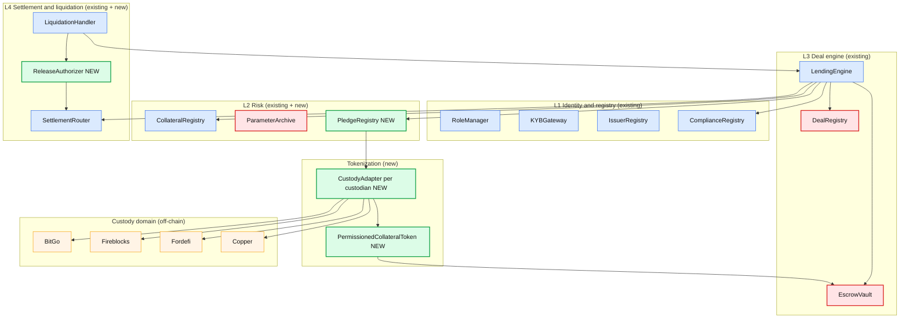
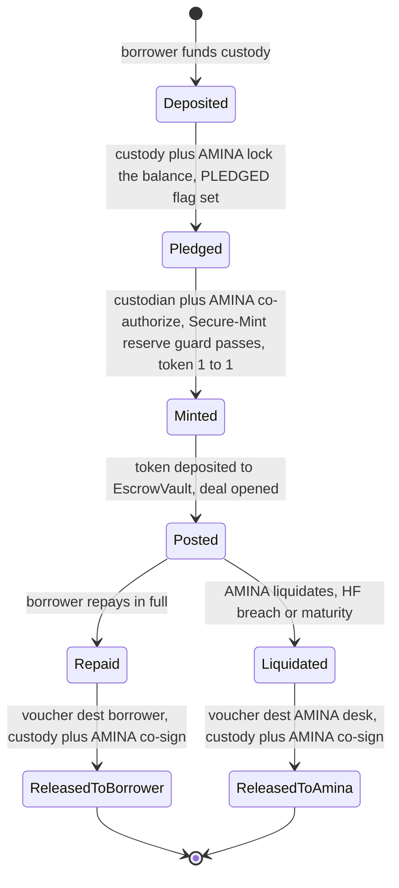
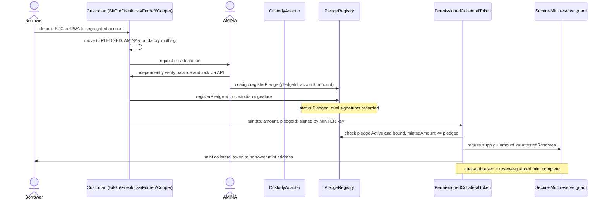
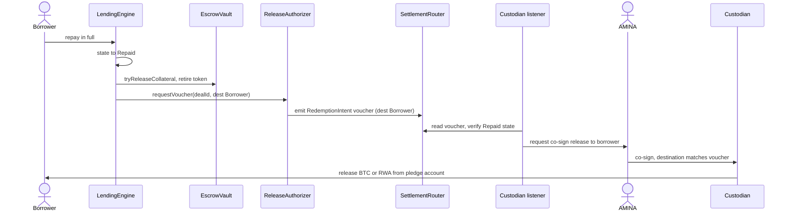
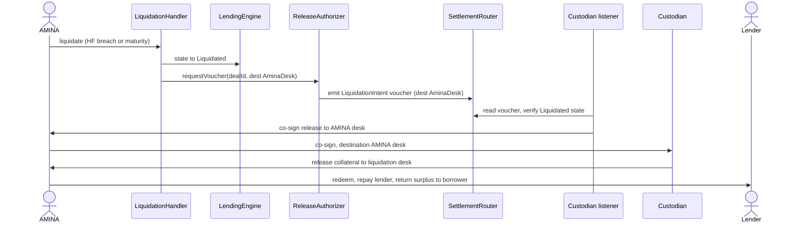

# P2PxAmina — Final Collateral Tokenization Architecture & Production Implementation Guide

**Version**: v1.0 (production-targeted)
**Date**: June 2026
**Status**: implementation-ready design. This is the document an engineer follows to build, integrate custodians, and launch.
**Reads on**: `Claude-architechture-3.md` (canonical contract architecture), `tokenization-of-collateral.md` (pledge-bound-mint / voucher-gated-release design), `tokenization-of-collateral-state-of-the-art.md` (custody-engine mechanics survey). Where those conflict, **this document is authoritative for the tokenization layer.**

---

## Table of contents

1. [What we are building, restated for launch](#1-what-we-are-building-restated-for-launch)
2. [The one invariant that defines the whole design](#2-the-one-invariant-that-defines-the-whole-design)
3. [Final architecture — the full contract set](#3-final-architecture--the-full-contract-set)
4. [The permissioned collateral token](#4-the-permissioned-collateral-token)
5. [The custody-adapter abstraction](#5-the-custody-adapter-abstraction)
6. [BTC pledge — safe handling end to end](#6-btc-pledge--safe-handling-end-to-end)
7. [RWA pledge — safe handling end to end](#7-rwa-pledge--safe-handling-end-to-end)
8. [Custody implementation details](#8-custody-implementation-details)
   - [8.1 BitGo](#81-bitgo)
   - [8.2 Fireblocks](#82-fireblocks)
   - [8.3 Fordefi](#83-fordefi)
   - [8.4 Copper](#84-copper)
9. [Mint flow (production)](#9-mint-flow-production)
10. [Release flows — repay and liquidation](#10-release-flows--repay-and-liquidation)
11. [Reserve verification and the Secure-Mint guard](#11-reserve-verification-and-the-secure-mint-guard)
12. [Oracles](#12-oracles)
13. [Roles and signing topology](#13-roles-and-signing-topology)
14. [Security controls and adversary analysis](#14-security-controls-and-adversary-analysis)
15. [Implementation plan (build → audit → launch)](#15-implementation-plan-build--audit--launch)
16. [Launch runbook & operations](#16-launch-runbook--operations)
17. [Open decisions to close before mainnet](#17-open-decisions-to-close-before-mainnet)
18. [Appendix A — interface sketches](#18-appendix-a--interface-sketches)
19. [Appendix B — per-custodian config matrix](#19-appendix-b--per-custodian-config-matrix)

---

## 1. What we are building, restated for launch

P2PxAmina is a permissioned, bilateral, fixed-term crypto repo rail. Borrowers raise USDC against tokenized BTC (later ETH, RWA) held in regulated custody; AMINA Bank is the broker/curator/liquidator; P2P operates the platform. The **collateral tokenization layer** is what makes a real BTC at BitGo (or Fireblocks/Fordefi/Copper) usable as on-chain collateral while guaranteeing:

- the BTC **cannot leave custody except through a repay or a liquidation the protocol authorizes**;
- **only AMINA can liquidate**;
- **no party** — borrower, custodian operator, P2P, or an EVM-layer attacker — can extract the asset illegitimately;
- the same machinery extends to **ETH and RWA** by swapping the lock primitive and the attestation source.

This is achieved with **pledge-bound mint, voucher-gated release**: a collateral token is minted only against a confirmed, locked pledge (custodian + AMINA co-authorize), the token is permissioned so it can move only inside the protocol, and the underlying asset is released from custody only against a protocol voucher whose destination is fixed by on-chain deal state, co-signed by AMINA on the custody door.

Every component of this design is in production somewhere (HQLAx pledge-without-moving, Sygnum MultiSYG bank-co-signed BTC multisig, ERC-3643/CMTAT permissioning, Chainlink Secure-Mint, LBTC dual-authorization). We are composing proven parts, not inventing primitives.

---

## 2. The one invariant that defines the whole design

> **The underlying asset can leave custody only to a destination that the on-chain deal state mandates, and AMINA must co-sign the custody movement.**

Everything else serves this. It decomposes into three guarantees that must hold simultaneously:

| Guarantee | Enforced by | Failure if absent |
|---|---|---|
| **Backing** — 1 token = 1 real asset locked | dual-authorized mint + Secure-Mint reserve guard + PoR | unbacked tokens, lender loss |
| **Exclusive lock** — borrower can't withdraw behind our back | pledge account multisig with **AMINA as mandatory signer** | borrower drains custody, token becomes IOU |
| **State-bound release** — asset moves only where the deal state says | release voucher (destination derived from `Repaid`/`Liquidated`) + AMINA co-sign | theft, or AMINA holding a repaid borrower hostage |

To steal the asset an attacker must break **two independent gates at once**: forge a protocol release authorization the chain state doesn't justify **and** compromise AMINA's custody signing key. No single actor can do both.

---

## 3. Final architecture — the full contract set

The existing scaffold in `src/` (13 contracts) is retained unchanged in role. The tokenization layer adds **4 new on-chain components** plus **N custody adapters** (one per custodian).



### 3.1 New components

| Component | Layer | Upgradeable | Purpose |
|---|---|---|---|
| `PledgeRegistry` | L2 | UUPS | Binds `collateralToken ↔ pledgeId ↔ custody account ↔ asset amount ↔ dealId`; gates mint; backs the reserves check; tracks pledge lifecycle. |
| `PermissionedCollateralToken` | tokens/ | per-custodian deploy | The on-chain claim. Permissioned (allowlist = `{EscrowVault, LiquidationHandler}`), dual-authorized mint, voucher-gated burn. One contract per `(custodian, asset)`. |
| `ICustodyAdapter` + impls | adapters/ | per-custodian | Uniform interface over each custodian's platform (attest pledge, report reserves, confirm lock, request release). One impl per custodian. |
| `ReleaseAuthorizer` | L4 | UUPS+timelock | Produces the canonical, verifiable **release voucher** when a deal reaches a terminal state; the custody door honors only a matching voucher. |

### 3.2 What stays exactly as in `Claude-architechture-3.md`

`RoleManager`, `KYBGateway`, `IssuerRegistry` (extended with a `pledgeBound` flag and the adapter pointer), `ComplianceRegistry`, `CollateralRegistry`, `ParameterArchive`, `DealRegistry` (immutable), `EscrowVault` (immutable — already has `tryReleaseCollateral` with `ISSUER_FREEZE` handling and the `>=` reconciliation invariant), `LendingEngine`, `LiquidationHandler`, `SettlementRouter`, `PortfolioLens`. Immutability posture is unchanged: `DealRegistry`/`EscrowVault`/`ParameterArchive` immutable; policy + engine UUPS behind timelock.

---

## 4. The permissioned collateral token

The token is a **tokenized custody pledge receipt**, not a fungible market wrapper, and **not** any existing wrapper (no WBTC/LBTC/cbBTC). One contract per `(custodian, asset)` — e.g. `BitGo-cBTC`, `Fireblocks-cBTC`, `Copper-cRWA-{ISIN}`.

### 4.1 Standard choice

Use **CMTAT v3 with the `AllowlistModule` enabled** as the base, or **ERC-3643** where the custodian's tokenization platform already emits ERC-3643 (Fireblocks+Tokeny, AMINA+Tokeny). Both give the four properties below; CMTAT's `AllowlistModule` is the leanest path to "movable only by the protocol."

### 4.2 The four hard rules (token-contract level)

| Rule | Mechanism | Defeats |
|---|---|---|
| **Transfers restricted to protocol addresses** | allowlist = `{EscrowVault, LiquidationHandler, mint/redeem path}`; OZ v5 `_update` override checks both `from` and `to` (carve-out `address(0)` for mint/burn) | a thief who grabs the token — it is worthless off-platform |
| **Mint dual-authorized** | `mint(to, amount, pledgeId)` requires custodian `MINTER_ROLE` **and** an AMINA attestation, **and** passes the Secure-Mint reserve guard, **and** `PledgeRegistry` confirms the pledge is `Active` and bound | a compromised custodian minting unbacked tokens (the PYUSD-300T failure mode) |
| **Mint bound to a pledge** | `pledgeId` reference; `mintedAmount ≤ pledgedAmount`; recorded in `PledgeRegistry` | over-minting / supply > reserves |
| **Burn voucher-gated** | `redeemBurn(amount, voucherRef)` callable only by the redemption path with a valid `ReleaseAuthorizer` voucher | token destroyed (→ asset freed) outside the protocol |

> **Critical audit note carried from the SOTA survey:** the recurring bug in protocol-bound tokens is checking only `from` or only `to` in the transfer hook (Vultisig, Code4rena 2024). Both directions must be validated, with `address(0)` carve-outs. This must be an explicit test.

### 4.3 Fungibility

Fungible per `(custodian, asset)` for v1 (compatible with the amount-based `EscrowVault` ledger and HF math); per-deal pledges tracked in `PledgeRegistry`. A per-deal NFT receipt is a v2 option if a custodian requires strict 1:1 pledge binding.

---

## 5. The custody-adapter abstraction

Each custodian's platform is different; we hide that behind **one interface** (the same pattern as `ComplianceRegistry` hooks). The engine and `PledgeRegistry` never call a custodian directly — they call the adapter.

```solidity
interface ICustodyAdapter {
    // Verify a custodian-signed pledge attestation (signature + freshness + lock active)
    function verifyPledge(
        bytes32 pledgeId,
        bytes32 custodyAccountRef,
        bytes32 asset,
        uint256 amount,
        bytes calldata custodianSig
    ) external view returns (bool ok, bytes32 reasonCode);

    // Current attested reserves for a collateral token (for supply <= reserves)
    function attestedReserves(address collateralToken)
        external view returns (uint256 amount, uint64 asOf);

    // Confirm the pledge account is locked with AMINA in the release quorum
    function isLockActive(bytes32 pledgeId) external view returns (bool);

    // Custodian + AMINA co-signed release authorization is recorded off-chain;
    // this returns true once the custodian acknowledges a matching voucher.
    function releaseAcknowledged(bytes32 pledgeId, bytes32 voucherRef)
        external view returns (bool);
}
```

The adapter is *read/verify* on-chain; the actual custody transaction (moving BTC/RWA) happens off-chain, driven by the custodian's listener watching `SettlementRouter`/`ReleaseAuthorizer` events and co-signed by AMINA. The adapter is how the protocol *knows* the off-chain state without trusting a single submitter.

Adapters are admitted through `IssuerRegistry` (timelocked) and are part of the audit scope when a custodian is onboarded.

---

## 6. BTC pledge — safe handling end to end

BTC lives on the Bitcoin chain; the collateral token is the EVM claim. The EVM lock is `EscrowVault` (already built). The hard part is the **off-chain Bitcoin lock**, which must guarantee the borrower cannot withdraw the BTC behind our back and only AMINA-co-signed releases are possible.

### 6.1 The pledge account

A **segregated, per-deal Bitcoin pledge account** controlled by a multisig where moving BTC **always requires AMINA**. Recommended: **2-of-3 / 3-of-5 with AMINA mandatory** (the Sygnum MultiSYG pattern — borrower + custodian + AMINA + independent signers; pledged funds move only with custodian + AMINA, never borrower alone). The custodian's policy engine additionally flags the balance `PLEDGED` and refuses any withdrawal of a pledged balance not accompanied by a valid protocol release voucher.

### 6.2 Lifecycle



### 6.3 Why the borrower cannot steal and only AMINA can liquidate

- Borrower holds no protocol token (it is in `EscrowVault`) and is not a sufficient signer to move pledged BTC.
- Only AMINA can drive the deal to `Liquidated` (the `LIQUIDATOR` role, only on HF breach or maturity), so only AMINA can produce a `Liquidated` release voucher.
- A `Repaid` voucher (destination = borrower) is auto-derivable from the `Repaid` state, so AMINA cannot withhold a repaid borrower's BTC — but AMINA's signature on the custody door is still required to *execute* the release, confirming the voucher is genuine.

### 6.4 BTC proof of reserves

The custodian publishes a signed attestation `{collateralToken, totalPledgedSats, asOf}` on a heartbeat, consumed by the adapter; the on-chain Secure-Mint guard enforces `tokenSupply ≤ attestedReserves`. Where the custodian supports Chainlink PoR over its BTC addresses (BitGo, Fireblocks-issued), wire it as a second, independent feed. **PoR proves existence, not exclusive control** — exclusive control is provided separately by the AMINA-mandatory multisig (§6.1).

### 6.5 Trust-minimization upgrade path (v2+)

For a future tier that removes custodian trust, replace the custody-policy lock with a Bitcoin-native lock: Taproot multisig / DLC where the spend condition pays only the deal-mandated destination (the iBTC "attestors can grief but cannot steal" model), or Babylon TBV / BitVM with ZK redemption proofs. The on-chain contracts do not change — only the adapter and the lock primitive.

---

## 7. RWA pledge — safe handling end to end

RWA collateral (tokenized treasuries, fund shares, bonds) differs from BTC in that the **legal wrapper is the backing** and the lock is a custody/registry encumbrance rather than a Bitcoin script.

### 7.1 The pledge

The RWA sits in a **segregated custody account or SPV** at the custodian; the transfer agent / registrar marks the holding `PLEDGED` and binds release to a protocol voucher + AMINA co-sign, exactly as for BTC. The legal wrapper (SPV, fund interest, bankruptcy-remoteness) is confirmed by counsel at onboarding and anchored on-chain via `IssuerRegistry.legalAttestationHash` and the per-token `redemptionAttestationHash`.

### 7.2 Token

For RWA the collateral token is naturally **ERC-3643** (identity-gated; the dominant RWA standard, >$32B issued). Mint requires `isVerified(to)` plus the dual-authorization and reserve guard. Transfers are restricted to the protocol addresses (the allowlist sits inside the ERC-3643 compliance module).

### 7.3 NAV oracle and the reserve check

RWA value is set by NAV, not a market price. The adapter exposes a NAV feed (transfer-agent/fund-administrator signed, e.g. the Superstate continuous-oracle or BUIDL stable-$1 model). The collateral value used in HF is `min(NAV × amount, attestedReserveValue)`. Redemption is async (transfer-agent settlement T+0–T+3); model it with the ERC-7540 request/claim pattern our architecture already exposes as a view subset.

### 7.4 RWA-specific risk to bound at onboarding

NAV-oracle integrity is the recurring failure mode (Centrifuge/Maple defaults came from delayed write-downs). Require: a named SPV with jurisdiction + registration, a named custodian with a custody agreement, monthly-or-better independent attestation, and a freeze-on-stale-NAV rule.

---

## 8. Custody implementation details

The four named custodians fall into two categories: **issuance-capable platforms** (Fireblocks, Fordefi, BitGo) that hold the asset *and* can sign the on-chain mint, and a **custody+settlement platform** (Copper) that holds the asset and provides legal/settlement infrastructure but typically does not hold the on-chain minter key. The adapter abstracts both.

| Custodian | Key model | Pledge lock | Mint authority | AMINA co-sign mechanism | Reserves / PoR | Token standard |
|---|---|---|---|---|---|---|
| **BitGo** | Multisig 2-of-3 or MPC/TSS; OCC trust charter | Segregated wallet, AMINA as required policy approver / co-signer | BitGo holds `MINTER_ROLE`; policy-gated | BitGo policy "external approver" = AMINA; pledged BTC release needs AMINA | Chainlink PoR over BitGo BTC addresses (proven for WBTC) | CMTAT/ERC-3643 deployed externally; BitGo signs |
| **Fireblocks** | MPC-CMP 3-shard, TAP in Nitro TEE | Fireblocks vault; AMINA holds a co-signer shard or TAP approver | Tokenization Engine; MPC vault holds `MINTER_ROLE` | TAP approval rule requires AMINA approver before signing | SOC 2 + optional Chainlink PoR integration | ERC20F or ERC-3643 (via Tokeny), deployed in-workspace |
| **Fordefi** | MPC semi-custodial, server shard in Nitro enclave; simulation policy | Fordefi MPC wallet; method-level policy | MPC vault `MINTER_ROLE` via Bitbond token tool | Admin-quorum + method-level policy requiring AMINA approval; simulation pre-check | SOC 2; Paxos trust charter (post-acq) | ERC-20 / custom; method-level mint policy |
| **Copper** | MPC custody; **ClearLoop** settlement; **English-Law Trust** | ClearLoop / trust-segregated account; Copper does not mint | **External** contract holds `MINTER_ROLE`; Copper custodies + co-signs release | Copper + AMINA co-sign release; mint authorized by a separate signer set incl. AMINA | SOC 2; trust deed; reserves via custody API | external CMTAT/ERC-3643; Copper signs release only |

### 8.1 BitGo

**Hold.** BTC sits in a BitGo segregated wallet. Use BitGo TSS (single on-chain signature, lower cost, no partial-sig modification risk) or 2-of-3 multisig. AMINA is added as a **required approver in BitGo's policy engine** (BitGo supports external/co-approvers and spending policies), and/or holds one key in the multisig — so pledged BTC cannot move without AMINA.

**Mint.** BitGo holds the `MINTER_ROLE` of the `BitGo-cBTC` `PermissionedCollateralToken` (deployed by us, BitGo-signed). To mint: our backend submits a mint request; BitGo's policy engine validates (amount ≤ confirmed pledged balance, AMINA approval present); the BitGo-controlled key signs `mint(to, amount, pledgeId)`; the on-chain Secure-Mint guard + `PledgeRegistry` checks run; tokens appear. This mirrors BitGo's proven WBTC `confirmMintRequest` custodian-role pattern, with our reserve guard added.

**AMINA co-sign.** AMINA is an external approver on the BitGo policy for both mint authorization and any pledged-BTC withdrawal. Release of BTC (repay or liquidation) requires the BitGo + AMINA quorum and a matching voucher.

**Reserves.** Chainlink PoR over BitGo's BTC custody addresses (BitGo has run this for WBTC), updated ~10 min, feeds the Secure-Mint guard.

**Notes.** BitGo's Go Network can later provide off-exchange settlement for the USDC leg. BitGo's OCC national-trust-bank charter (Dec 2025) strengthens the legal recourse layer.

### 8.2 Fireblocks

**Hold.** The BTC/RWA pledge account is a Fireblocks vault. Fireblocks MPC-CMP runs a 3-shard model: server shard in an AWS Nitro TEE, a customer co-signer shard, and a backup. For the AMINA-mandatory lock, **AMINA operates the co-signer shard** (or is a designated TAP approver), so the 2-of-3 signing threshold cannot release pledged funds without AMINA.

**Mint.** Deploy the `PermissionedCollateralToken` via the Fireblocks Tokenization Engine — either Fireblocks' ERC20F template extended with our allowlist + pledge binding, or the Tokeny **ERC-3643 (T-REX)** suite which Fireblocks can deploy in-workspace since 2024. The MPC vault holds `MINTER_ROLE`. Minting routes through **TAP (Transaction Authorization Policy)** running inside the enclave: a rule requires the mint amount within reserves, an AMINA approver signature, and destination/selector constraints, before the enclave releases the partial signature.

**AMINA co-sign.** TAP approval workflow lists AMINA as a required approver for `mint` and for any transfer out of the pledge vault. Combined with AMINA's co-signer shard, neither Fireblocks nor the borrower can act alone.

**Reserves.** SOC 2 + Fireblocks' Chainlink PoR integration feeding the Secure-Mint guard.

**Notes.** Fireblocks is the most turnkey for issuance because the Tokenization Engine + Tokeny T-REX gives us a compliant ERC-3643 token, MPC custody, and policy engine in one workspace. This is the recommended **first** integration.

### 8.3 Fordefi

**Hold.** The pledge account is a Fordefi MPC wallet (semi-custodial; server share in a Nitro enclave, our/AMINA's share held institutionally). AMINA holds a share or is in the admin quorum so pledged funds cannot move without AMINA.

**Mint.** Fordefi's policy engine is the standout: **method-level (ABI selector) granularity** plus **transaction simulation before signing**. Configure a policy: allow `mint(address,uint256,bytes32)` only when `amount ≤ cap`, `to ∈ {pledge mint path}`, and the AMINA admin-quorum approval is present; simulate the tx to catch unexpected state changes before the partial signature is emitted. `MINTER_ROLE` is held by the Fordefi vault (mint via the Bitbond token-tool integration or our deployed contract).

**AMINA co-sign.** Fordefi's **admin quorum** governs policy changes (so the mint policy itself cannot be unilaterally altered), and an M-of-N approval including AMINA gates each mint and each pledged-asset release.

**Reserves.** SOC 2; post-Paxos-acquisition (Nov 2025) the Paxos trust charter adds bank-grade oversight. Reserves attested via the adapter; cross-check with PoR where available.

**Notes.** Fordefi is the best fit where we want **fine-grained programmatic mint control and pre-sign simulation** — strong defense against the "compromised minter" and "unexpected calldata" classes.

### 8.4 Copper

**Hold.** Copper is primarily **custody + settlement (ClearLoop)**, with an **English-Law Trust** protecting client assets from Copper insolvency. The pledged asset sits in a Copper/ClearLoop segregated account under the trust structure. Copper "does not typically hold the `MINTER_ROLE`" — so the mint/burn authority is **external**.

**Mint.** The `PermissionedCollateralToken` is deployed by us; its `MINTER_ROLE` is held by a dedicated signer set (e.g. a Fireblocks/Fordefi MPC wallet **including AMINA**, or AMINA's own MPC), not by Copper. Copper's role is to (a) custody the pledged asset, (b) attest the pledged balance, and (c) co-sign the release of the underlying when a voucher is presented. The mint is gated by the reserve guard against Copper's attested balance.

**AMINA co-sign.** Release of the underlying from Copper requires Copper + AMINA co-signature against a matching voucher; the ClearLoop trust structure provides the insolvency-remote legal wrapper.

**Reserves.** Copper custody API balance + SOC 2 + the trust deed. No native minting PoR; rely on the adapter attestation + the external Secure-Mint guard.

**Notes.** Copper is the model for **"custodian holds and settles, but does not mint"** — important because it proves the adapter abstraction must support a custodian that is *not* the minter. The minter is then a separate AMINA-inclusive MPC quorum.

---

## 9. Mint flow (production)



The borrower then posts the token via `LendingEngine.openAndActivate`, which binds the pledge to the deal (`PledgeRegistry.bindToDeal`) and runs all the existing pre-conditions (KYB, caps, compliance hooks, oracle freshness).

---

## 10. Release flows — repay and liquidation

### 10.1 Repay (asset returns to borrower)



AMINA cannot block a repaid borrower: the `Repaid` voucher is auto-derivable, and AMINA's signature only *confirms* it. If the custody transfer is blocked (issuer freeze), the deal moves to `Repaid_PendingCollateralRelease` and the borrower later calls `claimUnreleasedCollateral` (already in the engine).

### 10.2 Liquidation (asset goes to AMINA)



On-chain, AMINA seizes the token via the ERC-3643/CMTAT `forcedTransfer`/`enforceTransfer` to the liquidation address (the only place this power is used), then burns it against the voucher; surplus collateral after debt + bonus + fee is released to the borrower.

---

## 11. Reserve verification and the Secure-Mint guard

Two layers, both required:

1. **On-chain Secure-Mint guard** (Chainlink-PoR pattern): `mint` reverts unless `token.totalSupply() + amount ≤ attestedReserves` from the adapter's reserve feed, with a staleness check (`block.timestamp − asOf < maxAge`). This is the mechanical circuit-breaker that prevents the PYUSD-class "unconstrained mint key" failure even if a custodian key is compromised.
2. **Continuous attestation + monitoring**: per-custodian signed reserve attestation on a heartbeat (and Chainlink PoR where available); a stale feed freezes new deals on that token and pages AMINA; a reserve shortfall halts minting and flags for liquidation.

Valuation rule baked into HF: `collateralValueUsd = min(marketOrNav × postedAmount, attestedReserveValueUsd(pledgeId))` — coverage can never be computed against more asset than is provably locked.

**PoR proves existence, not exclusive control or non-rehypothecation.** Exclusive control is provided by the AMINA-mandatory pledge multisig; non-rehypothecation by the segregated pledge account + the custodian's contractual obligation (HQLAx-style backing obligation). Do not conflate the two.

---

## 12. Oracles

| Asset | Price source | Adapter pattern | Notes |
|---|---|---|---|
| **BTC** | BTC/USD Chainlink | direct feed; heartbeat enforced | no exchange-rate component (native BTC, no wrapper) |
| **RWA** | transfer-agent / fund-administrator NAV (signed) | continuous oracle (Superstate-style) or stable-$1 (BUIDL-style) | `min(NAV, attestedReserve)`; freeze on stale NAV |
| **ETH / wstETH** (v2) | **CAPO** exchange-rate adapter × ETH/USD | `min(market, snapshotRatio × (1 + maxYearlyGrowth × elapsed))` | heed the March 2026 Aave CAPO incident: update `snapshotRatio` and `snapshotTimestamp` atomically; avoid high-LTV strand |

Oracle source is **part of the snapshotted risk version** (`CollateralRegistry` → `ParameterArchive`), so a live deal reads the oracle bound at creation. The only way to change a live deal's oracle is `EMERGENCY.forceOracleOverride` (sidecar, loud event, cannot change any economic parameter) — already in the architecture.

---

## 13. Roles and signing topology

On-chain roles are unchanged from `Claude-architechture-3.md` (`GOVERNOR`, `EMERGENCY`, `CURATOR`, `ALLOCATOR`, `LIQUIDATOR`, `GUARDIAN`, `OPS`, `ORACLE_ADMIN`). The tokenization layer adds an **off-chain custody signing topology**:

| Action | On-chain authority | Off-chain custody authority |
|---|---|---|
| Register pledge | `CURATOR` (timelock for new pair) | custodian + AMINA co-attest |
| Mint collateral token | custodian `MINTER_ROLE` | custodian policy + AMINA approver + Secure-Mint guard |
| Open + activate deal | `ALLOCATOR` | — |
| Repay | permissionless (compliant) | custodian + AMINA co-sign release to borrower |
| Liquidate | `LIQUIDATOR` (AMINA bots) | custodian + AMINA co-sign release to AMINA desk |
| Force oracle override | `EMERGENCY` (2-of-2) | — |
| Pause | `GUARDIAN` (token/pair/deal), `EMERGENCY` (global) | — |

**Key separation property:** no single key — on-chain or in custody — can both mint and release. AMINA is mandatory on the custody door for *both* repay and liquidation, but the *destination* is decided by on-chain state, not by AMINA's discretion.

---

## 14. Security controls and adversary analysis

| Adversary | Attempt | Why it fails |
|---|---|---|
| **Borrower** | withdraw asset without repaying | not a sufficient custody signer; holds no protocol token; cannot reach `Liquidated`; only path is repay → `Repaid` voucher → release to self |
| **Rogue custodian operator (1 key)** | move pledged asset, or mint unbacked tokens | pledged release needs AMINA co-sign; mint needs AMINA approval + Secure-Mint guard |
| **Borrower + custodian collude** | release pledged asset together | AMINA's signature on the custody door is mandatory and won't be given without a state-bound voucher |
| **EVM-layer attacker** | drain `EscrowVault`, take token | token non-transferable to non-protocol addresses → worthless; release needs voucher chain state won't justify + AMINA custody key |
| **P2P key compromise** | redirect release to attacker | P2P has no custody access, no liquidation authority; voucher destination bound to state |
| **Single AMINA key compromise** | liquidate or release unilaterally | `LIQUIDATOR` is multi-sig; custody release is multi-party; one key insufficient |
| **Compromised minter key (PYUSD class)** | mint unbacked tokens | Secure-Mint guard reverts `supply + amount > reserves`; AMINA co-attestation required |
| **Stale / forged attestation** | inflate backing | independent PoR cross-check + AMINA direct custody read + freeze-on-stale |
| **AMINA itself** | seize a healthy deal | `LiquidationHandler` refuses unless HF breached or matured; every action on-chain + auditable; AMINA is the regulated, accountable liquidator by design |

Audit checklist (must all be tested):
- transfer hook validates **both** `from` and `to` with `address(0)` carve-outs;
- Secure-Mint guard enforces staleness;
- voucher destination is derived from state, not from the submitter;
- `forcedTransfer` power is used only by `LIQUIDATOR` to the liquidation address;
- `EscrowVault` reconciliation invariant holds under reentrancy attempts;
- pledge cannot be bound to two deals; `mintedAmount ≤ pledgedAmount` always;
- oracle source is read from the snapshot, never live, except `forceOracleOverride`.

---

## 15. Implementation plan (build → audit → launch)

> Targets a straightforward path to a small-notional mainnet pilot. The existing 13-contract scaffold already compiles; this plan adds the tokenization layer and one custodian.

**Phase A — Tokenization contracts (2–3 weeks).**
- `PledgeRegistry.sol` (UUPS) — pledge struct, dual-auth `registerPledge`, `bindToDeal`, `markReleasing/Released`, `totalPledged`, `isFresh`. Unit + fuzz tests (supply ≤ reserves invariant, no double-bind).
- `PermissionedCollateralToken` — CMTAT-AllowlistModule base; allowlist `{EscrowVault, LiquidationHandler}`; dual-auth `mint`; voucher-gated `redeemBurn`; both-direction transfer-hook test.
- `ReleaseAuthorizer.sol` (UUPS+timelock) — produce/verify the canonical voucher; extend `SettlementRouter` events with `pledgeId`, `destinationType`, `destinationRef`, `sequenceNumber`.
- `ICustodyAdapter` interface + `MockCustodyAdapter` for tests.
- Extend `IssuerRegistry.TokenInfo` with `pledgeBound` flag + adapter pointer; wire `LendingEngine.openAndActivate` to call `bindToDeal` and the Secure-Mint valuation.

**Phase B — First custodian: Fireblocks (2–3 weeks).** Recommended first because the Tokenization Engine + Tokeny T-REX gives token + MPC custody + policy in one workspace. Build `FireblocksAdapter`; stand up a testnet pledge vault with AMINA as TAP approver / co-signer shard; integrate the custody listener watching `SettlementRouter`.

**Phase C — Engine wiring + Secure-Mint (1–2 weeks).** Connect the reserve guard to the adapter's `attestedReserves`; HF uses `min(market/NAV, reserves)`; freeze-on-stale; `forceOracleOverride` path tested.

**Phase D — Internal hardening (2 weeks).** Invariant fuzzing (the §14 checklist), halmos on the mint guard and voucher derivation, differential test of HF/surplus vs a reference, a full mainnet-fork lifecycle: `pledge → mint → openAndActivate → accrue → repay → release → reconcile`, plus a `liquidate → release-to-AMINA → surplus-to-borrower` run.

**Phase E — External audit (4–6 weeks, 2 shops in parallel).** Scope = the 4 new contracts + the FireblocksAdapter + the modified engine paths. Trail of Bits / OpenZeppelin / Spearbit / Cantina (Cantina reviewed Euler's hook pattern). Re-audit fixes.

**Phase F — Testnet pilot (2 weeks).** Sepolia + Fireblocks testnet custody; one full BTC-pledge deal lifecycle with AMINA's compliance + OPS teams operating the dashboards.

**Phase G — Pilot mainnet (2–4 weeks).** One real BTC deal, small notional ($1–5M), conservative caps, EMERGENCY multisig funded, active monitoring, fast revert plan.

**Phase H — Add custodians + assets (ongoing).** Build `BitGoAdapter`, `FordefiAdapter`, `CopperAdapter` (Copper = the non-minter pattern: minter is a separate AMINA-inclusive MPC). Then the **RWA** path (ERC-3643 token, NAV oracle, SPV legal wrapper) and the **ETH/wstETH** path (CAPO oracle).

---

## 16. Launch runbook & operations

**Deployment order** (extends `Claude-architechture-3.md` §24): RoleManager → DefaultPassHook → KYBGateway/IssuerRegistry/ComplianceRegistry → ParameterArchive → CollateralRegistry → **PledgeRegistry** → DealRegistry → EscrowVault → SettlementRouter → **ReleaseAuthorizer** → LendingEngine → bindEngine(EscrowVault) → LiquidationHandler → PortfolioLens → grant roles, revoke deployer → run custodian admission checks (transfer-exactness) → deploy `Fireblocks-cBTC` token + FireblocksAdapter → register issuer/token/pair/oracle/hook/caps → smoke test → mainnet-fork lifecycle reconciliation.

**Required monitors from day 1:** per-deal HF (5 min); reserve attestation freshness + `supply ≤ reserves` (real-time); pledge-lock status per active pledge (is AMINA still in the quorum? is the balance still `PLEDGED`?); `EscrowVault` reconciliation hourly; `SettlementRouter` voucher sequence gaps; `Repaid_PendingCollateralRelease` queue; custodian listener liveness; `forcedTransfer`/override events (loud).

**Critical alerts:** reserve shortfall (halt mint, page AMINA) · pledge lock lifted at custody (freeze deal, flag for liquidation) · oracle stale/circuit-broken · custodian listener offline > 5 min · voucher destination mismatch.

**Recovery:** engine bug → EMERGENCY halt + UUPS upgrade (vault/registry/archive immutable, state preserved via ERC-7201); custody freeze mid-deal → `Repaid_PendingCollateralRelease` + `claimUnreleasedCollateral`; compromised oracle → `forceOracleOverride`; custodian insolvency → `IssuerRegistry` deactivate + counsel-led recovery (the trust deed / SPV is the off-chain backstop).

---

## 17. Open decisions to close before mainnet

1. **Pledge quorum shape** per custodian — 2-of-3 vs 3-of-5; is AMINA a key-holder, a policy approver, or both? (Affects each adapter.)
2. **Voucher transport** — custodian listeners watch the chain for the on-chain voucher, or do we also issue an EIP-712 signed voucher pushed to them? (Affects `ReleaseAuthorizer`.)
3. **Re-attestation cadence** and the staleness window for the Secure-Mint guard.
4. **PoR source** per custodian — Chainlink PoR (BitGo/Fireblocks) vs custodian-API attestation (Copper).
5. **Surplus on liquidation** confirmed as borrower property in all supported jurisdictions (counsel).
6. **RWA SPV / transfer-agent** arrangements and bankruptcy-remoteness opinions per RWA issuer.
7. **Token standard per custodian** — CMTAT AllowlistModule vs ERC-3643 (default ERC-3643 where the platform already emits it: Fireblocks/AMINA via Tokeny).
8. **First-loss / AMINA bonding** — remains out of v1 (explicit no-bond decision); revisit as a v2 product change.
9. **Trust-minimization roadmap** — when (if ever) to move BTC from custody-policy lock to a Bitcoin-script / DLC / Babylon TBV lock.

---

## 18. Appendix A — interface sketches

> `pragma solidity 0.8.28` to match the repo. Illustrative; names align with the existing `Types`/`Errors`/`Roles` libraries.

```solidity
// l2/PledgeRegistry.sol
interface IPledgeRegistry {
    enum PledgeStatus { None, Pledged, Bound, Releasing, Released }

    struct Pledge {
        address custodian;            // IssuerRegistry-admitted custodian
        address adapter;              // ICustodyAdapter for this custodian
        bytes32 custodyAccountRef;     // opaque ref to the segregated pledge account
        bytes32 asset;                 // "BTC", "ETH", "RWA:<ISIN>"
        uint256 amount;                // asset units (sats, wei, shares)
        address collateralToken;       // the PermissionedCollateralToken minted against it
        uint256 mintedAmount;          // <= amount (1:1 or oracle-scaled)
        bytes32 dealId;                // set on bindToDeal
        bytes32 attestationHash;       // custodian-signed backing+lock attestation
        uint64  lastAttestedAt;
        PledgeStatus status;
    }

    function registerPledge(            // custodian-initiated, AMINA co-authorization (restricted)
        bytes32 pledgeId, address custodian, address adapter,
        bytes32 custodyAccountRef, bytes32 asset, uint256 amount,
        address collateralToken, bytes32 attestationHash
    ) external;

    function bindToDeal(bytes32 pledgeId, bytes32 dealId) external;   // LendingEngine only
    function markReleasing(bytes32 pledgeId) external;                // engine/handler
    function markReleased(bytes32 pledgeId) external;                 // on release ack

    function getPledge(bytes32 pledgeId) external view returns (Pledge memory);
    function totalPledged(address collateralToken) external view returns (uint256);
    function isFresh(bytes32 pledgeId, uint64 maxAge) external view returns (bool);
}
```

```solidity
// tokens/IPermissionedCollateralToken.sol
interface IPermissionedCollateralToken {
    function mint(address to, uint256 amount, bytes32 pledgeId) external;     // custodian MINTER + AMINA attest + Secure-Mint guard
    function redeemBurn(uint256 amount, bytes32 voucherRef) external;          // redemption path only
    function isTransferAllowed(address from, address to) external view returns (bool); // allowlist gate (both directions)
}
```

```solidity
// l4/IReleaseAuthorizer.sol
struct ReleaseVoucher {
    bytes32 dealId;
    bytes32 pledgeId;
    bytes32 asset;
    uint256 amount;
    uint8   destinationType;   // 0 = Borrower, 1 = AminaDesk
    bytes32 destinationRef;    // custody account bound to destinationType
    bytes32 reason;            // "REPAID" | "LIQUIDATED"
    uint64  sequenceNumber;    // anti-replay
    uint64  issuedAt;
}

interface IReleaseAuthorizer {
    // Callable only by LendingEngine/LiquidationHandler when the deal is in a terminal state.
    // Destination is DERIVED from state, never passed by the caller.
    function requestVoucher(bytes32 dealId) external returns (ReleaseVoucher memory);
    function isVoucherValid(bytes32 dealId, ReleaseVoucher calldata v) external view returns (bool);
}
```

```solidity
// adapters/ICustodyAdapter.sol  (see §5)
interface ICustodyAdapter {
    function verifyPledge(bytes32 pledgeId, bytes32 custodyAccountRef, bytes32 asset,
                          uint256 amount, bytes calldata custodianSig)
        external view returns (bool ok, bytes32 reasonCode);
    function attestedReserves(address collateralToken) external view returns (uint256 amount, uint64 asOf);
    function isLockActive(bytes32 pledgeId) external view returns (bool);
    function releaseAcknowledged(bytes32 pledgeId, bytes32 voucherRef) external view returns (bool);
}
```

---

## 19. Appendix B — per-custodian config matrix

| Dimension | BitGo | Fireblocks | Fordefi | Copper |
|---|---|---|---|---|
| **Custody key model** | Multisig 2-of-3 / MPC TSS | MPC-CMP 3-shard (Nitro TEE) | MPC semi-custodial (Nitro enclave) | MPC + ClearLoop trust |
| **AMINA lock mechanism** | external policy approver + key | co-signer shard + TAP approver | admin-quorum + key share | co-sign release (trust account) |
| **Holds MINTER_ROLE?** | Yes (BitGo key) | Yes (MPC vault) | Yes (MPC vault) | **No — external AMINA-inclusive MPC** |
| **Token deploy path** | external CMTAT/ERC-3643, BitGo-signed | Tokenization Engine (ERC20F or Tokeny T-REX) | Bitbond token tool / custom | external CMTAT/ERC-3643 |
| **Policy engine** | spending policies, approvers | TAP (~16 params, in enclave) | method-level + tx simulation | ClearLoop rules + trust deed |
| **Reserves / PoR** | Chainlink PoR (BTC addrs) | SOC2 + Chainlink PoR | SOC2 + Paxos charter | custody API + trust deed |
| **Best fit** | proven BTC custody + OCC charter | turnkey issuance (recommended first) | fine-grained mint policy + simulation | custody+settlement where minter is external |
| **Adapter** | `BitGoAdapter` | `FireblocksAdapter` | `FordefiAdapter` | `CopperAdapter` (non-minter variant) |

---

*v1.0 — production-targeted. Build order: Phase A (tokenization contracts) → Phase B (Fireblocks first) → audit → pilot. The design composes only mechanisms already in production (HQLAx pledge-without-moving, Sygnum MultiSYG bank co-sign, ERC-3643/CMTAT permissioning, Chainlink Secure-Mint, LBTC dual-auth), so the implementation risk is integration, not invention.*
