# Triora Smart Contracts ADR

Date: 2026-06-26

Status: Implemented as the v2 BitGo smart contract path.

Scope: Solidity contracts and tests for the BitGo-backed Triora v1 production target. This record explains the design decisions behind the implementation under `src/l2`, `src/l3`, `src/l4`, `src/l5`, `src/tokens`, `src/interfaces`, and `src/libraries/*V2.sol`.

## Decision Summary

Triora v1 is implemented as a permissioned, custody-backed institutional lending rail. Real BTC and USDC stay in BitGo-controlled accounts. Onchain contracts record eligibility, pledges, reserves, loan state, accounting-token balances, settlement acknowledgements, and release vouchers. The contracts do not assume BitGo exposes a synchronous onchain API. They consume signed BitGo plus AMINA attestations and append settlement instructions for offchain execution.

The major decisions are:

| ID | Decision | Status |
| --- | --- | --- |
| ADR-001 | Keep v2 contracts side-by-side with the earlier prototype | Accepted |
| ADR-002 | Target BitGo as the v1 production custodian | Accepted |
| ADR-003 | Model custody through signed attestations, not onchain API calls | Accepted |
| ADR-004 | Require BitGo and AMINA dual approval for custody facts and settlement acks | Accepted |
| ADR-005 | Use restricted ERC-20 accounting tokens for cBTC and cUSDC | Accepted |
| ADR-006 | Mint cUSDC as an ERC-20 balance, not only an internal ledger | Accepted |
| ADR-007 | Treat cBTC and cUSDC as protocol accounting assets, not composable DeFi assets | Accepted |
| ADR-008 | Separate matched, settlement pending, active, repaid, release pending, and closed states | Accepted |
| ADR-009 | Start interest only after signed funding acknowledgement | Accepted |
| ADR-010 | Use pledge and reserve registries as independent sources of truth | Accepted |
| ADR-011 | Use reserve guards to cap minting against fresh custody evidence | Accepted |
| ADR-012 | Use an accounting vault between participant balances and deal state | Accepted |
| ADR-013 | Emit settlement instructions through an append-only router | Accepted |
| ADR-014 | Use release vouchers with state-derived destinations | Accepted |
| ADR-015 | Send repayment releases to borrower destination and liquidation releases to AMINA desk | Accepted |
| ADR-016 | Keep Safe mode out of v1 production contracts | Accepted |
| ADR-017 | Use AccessManager and role separation instead of ad hoc owner checks | Accepted |
| ADR-018 | Use EIP-712 signatures for intents, proofs, acknowledgements, and price attestations | Accepted |
| ADR-019 | Implement liquidation as AMINA-controlled full release in v1 | Accepted |
| ADR-020 | Document residual operational assumptions explicitly | Accepted |

## System Map

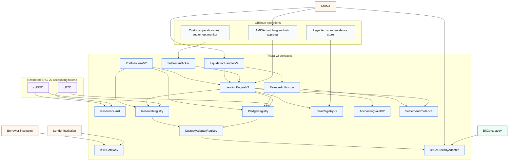

## ADR-001: Keep V2 Contracts Side By Side

Decision: implement the BitGo production path as new v2 contracts rather than editing the existing prototype in place.

Implementation:

- `TypesV2.sol` and `EIP712HashesV2.sol` define the new data model.
- V2 interfaces live alongside older interfaces.
- V2 runtime contracts are `BitGoCustodyAdapter`, `CustodyAdapterRegistry`, `ReserveGuard`, `PledgeRegistry`, `ReserveRegistry`, `AccountingVaultV2`, `DealRegistryV2`, `LendingEngineV2`, `SettlementRouterV2`, `ReleaseAuthorizer`, `SettlementAcker`, `LiquidationHandlerV2`, and `PortfolioLensV2`.

Rationale:

- The original contracts model a simpler atomic lending flow.
- The BitGo design needs settlement-pending states, reserve proofs, custody accounts, vouchers, and external acknowledgements.
- Keeping the new path separate avoids mixing incompatible assumptions and keeps existing tests meaningful.

Rejected alternative:

- Mutate the older `LendingEngine`, `EscrowVault`, and registry contracts directly. That would hide architectural changes inside old names and make audit review harder.

## ADR-002: BitGo Is The V1 Production Custodian

Decision: v1 production targets BitGo custody. The contracts still use adapter interfaces so future custodians can be added.

Implementation:

- `CustodyAdapterRegistry` maps `custodianId` values such as `BITGO` to adapter contracts.
- `BitGoCustodyAdapter` is the first concrete adapter.
- Custody accounts carry an assurance tier and policy hash.
- Pledges and reserves reference `custodianId` plus `custodyAccountRef`, not raw wallet addresses.

Rationale:

- Institutional custody is an operational and legal relationship, not merely an address balance.
- The production design must preserve account eligibility, policy references, and AMINA control evidence.
- An adapter boundary avoids hard-coding every future provider into the lending engine.

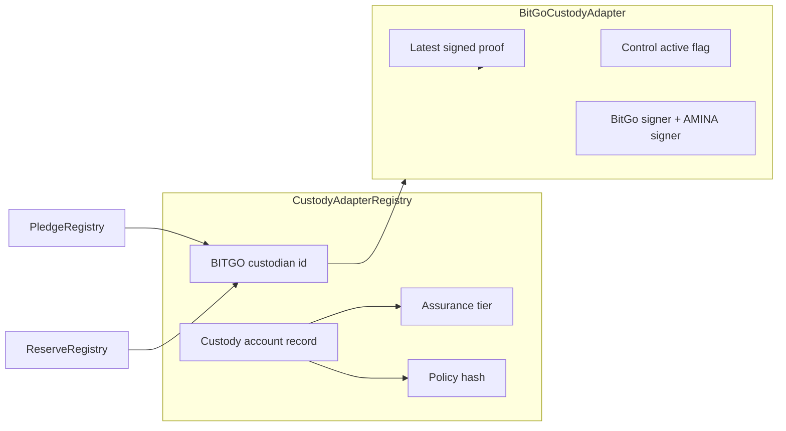

## ADR-003: Custody Facts Are Signed Attestations

Decision: contracts accept custody facts through EIP-712 signed attestations. They do not call BitGo APIs.

Implementation:

- `TypesV2.CustodyProof` includes `subjectId`, `custodyAccountRef`, `token`, `amount`, `decimals`, `observedAt`, `expiresAt`, and `evidenceHash`.
- `BitGoCustodyAdapter.submitProof` stores the latest proof after signature and freshness checks.
- `verifyCustodyAttestation` lets pledge and reserve registries validate one activation proof.
- `latestReserve` lets `ReserveGuard` read the latest amount for mint-limit checks.

Rationale:

- Ethereum contracts cannot call arbitrary custody APIs directly.
- BitGo operational evidence should be verifiable, replay-resistant, and timestamped.
- The `evidenceHash` gives contracts a compact anchor to offchain reports, API responses, PDFs, tickets, or signed custody packets without forcing bulky data onchain.

Rejected alternative:

- Trust an admin-only `setAmount` function. That would be simpler but weakens auditability and makes reserve inflation a governance key risk.

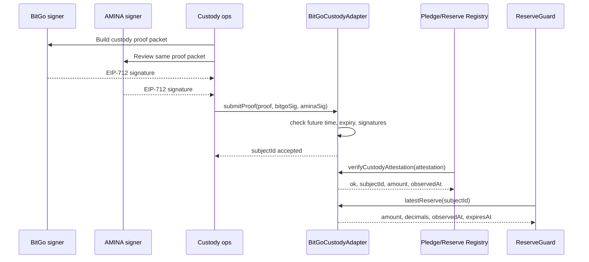

## ADR-004: Dual BitGo And AMINA Approval

Decision: material custody and settlement facts require both a BitGo signature and an AMINA signature.

Implementation:

- `BitGoCustodyAdapter` verifies both signers for custody proofs.
- `SettlementAcker` verifies both signers for funding, repayment, release, and failure acknowledgements.
- `LendingEngineV2` verifies lender, borrower, and AMINA signatures for deal intent creation.

Rationale:

- BitGo confirms custody or movement evidence.
- AMINA confirms the evidence is acceptable for the regulated Triora workflow.
- Dual approval reduces the blast radius of one compromised operational signer.

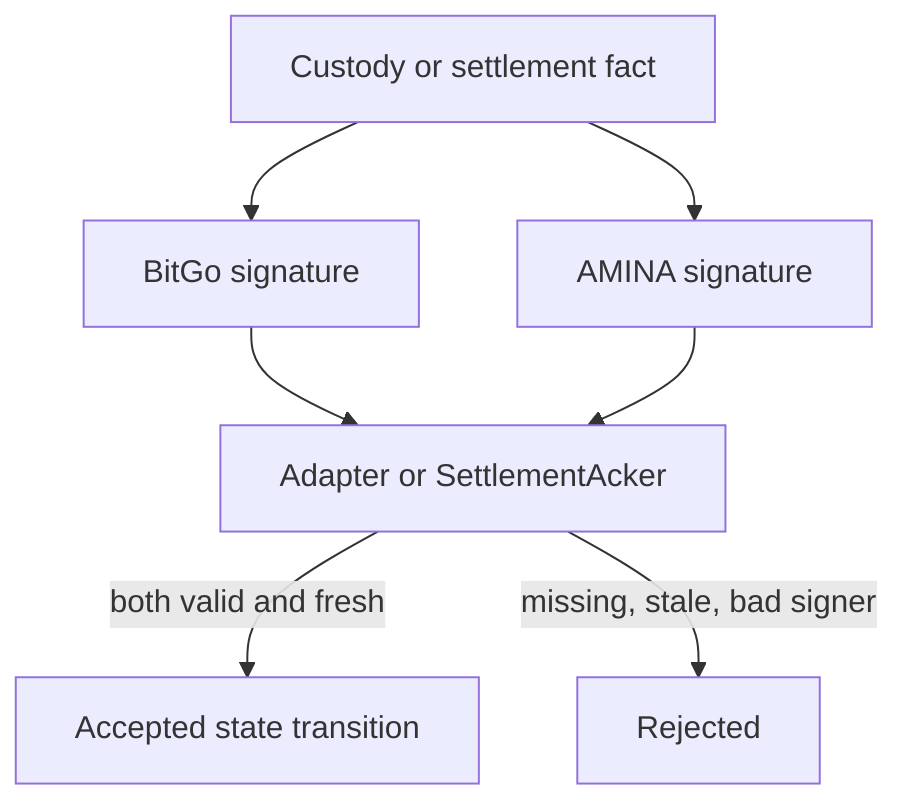

## ADR-005: cBTC And cUSDC Are Restricted ERC-20 Accounting Tokens

Decision: represent collateral and lender reserves as ERC-20 balances, but restrict transfers to protocol paths.

Implementation:

- `PermissionedTokenBase` extends OpenZeppelin `ERC20` plus `AccessManaged`.
- Transfers are allowed only when minting, burning, or when either `from` or `to` is a protocol address.
- `setFrozen` and `setPaused` allow emergency controls.
- `PermissionedCollateralToken` adds pledge-bound minting and voucher-gated release burns.
- `ReserveToken` adds reserve-registry minting and protocol burns.

Rationale:

- ERC-20 balances are easy to index, display, reconcile, and test.
- Free transferability would break pledge, reserve, and KYB assumptions.
- Restricted ERC-20s are a good compromise for institutional UX: visible balances without public-market composability.

Rejected alternatives:

- Pure internal ledger only. This hides balances from standard wallets, explorers, accounting tools, and ERC-20 test tooling.
- Freely transferable cTokens. This creates compliance and backing ambiguity.
- ERC-721 pledge receipts. This is possible later, but v1 needs fungible balances for deal accounting.

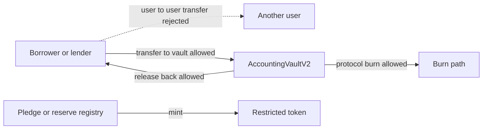

## ADR-006: cUSDC Is Minted As ERC-20

Decision: cUSDC is minted as an ERC-20 balance when a BitGo USDC reserve is activated. It is not only a non-transferable internal reserve ledger.

Implementation:

- `ReserveRegistry.activateReserve` mints cUSDC to the lender.
- `LendingEngineV2.confirmFunding` burns locked cUSDC from the vault once real settlement funding is acknowledged.
- `ReserveRegistry.markReturned` mints cUSDC back to the lender when principal is returned.

Rationale:

- The user explicitly chose ERC-20 cUSDC.
- ERC-20 balances make the lender reserve visible and auditable.
- Burning cUSDC on funding prevents the same reserved liquidity from remaining visible as idle balance.
- Reminting on principal return restores lender inventory.

Accounting example:

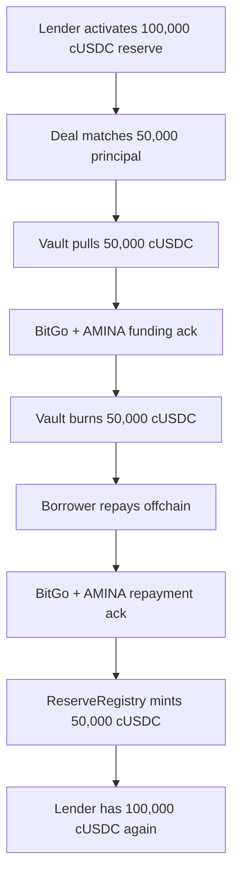

## ADR-007: cTokens Are Not Free DeFi Collateral

Decision: v1 cBTC and cUSDC are not intended for external lending markets, DEXs, or permissionless composability.

Implementation:

- User-to-user transfers revert unless a protocol address participates.
- Minting is tied to registries and reserve guards.
- Burning is tied to protocol roles and release vouchers.

Rationale:

- The backing is a custody and legal-control arrangement, not an autonomous bearer asset.
- External protocols cannot know whether a cToken is frozen, release-pending, liquidated, or legally encumbered.
- Keeping transfer paths narrow reduces the surface for compliance and accounting mistakes.

## ADR-008: Settlement Pending Is A First-Class State

Decision: a matched deal is not active until signed funding acknowledgement arrives.

Implementation:

- `createMatchedDeal` moves assets into the vault, locks pledge and reserve inventory, records terms, and emits a funding instruction.
- The deal enters `SettlementPending`.
- `confirmFunding` requires `SettlementAcker`, validates route hash and amount, burns the cUSDC funding tranche, and then activates interest.
- `cancelUnfundedDeal` returns locked cBTC and cUSDC if the offchain settlement does not complete.

Rationale:

- Institutional settlement can fail, be delayed, or require manual review.
- Starting interest at match time would charge borrowers before real funding is confirmed.
- Cancellation must cleanly unwind pre-funding locks.

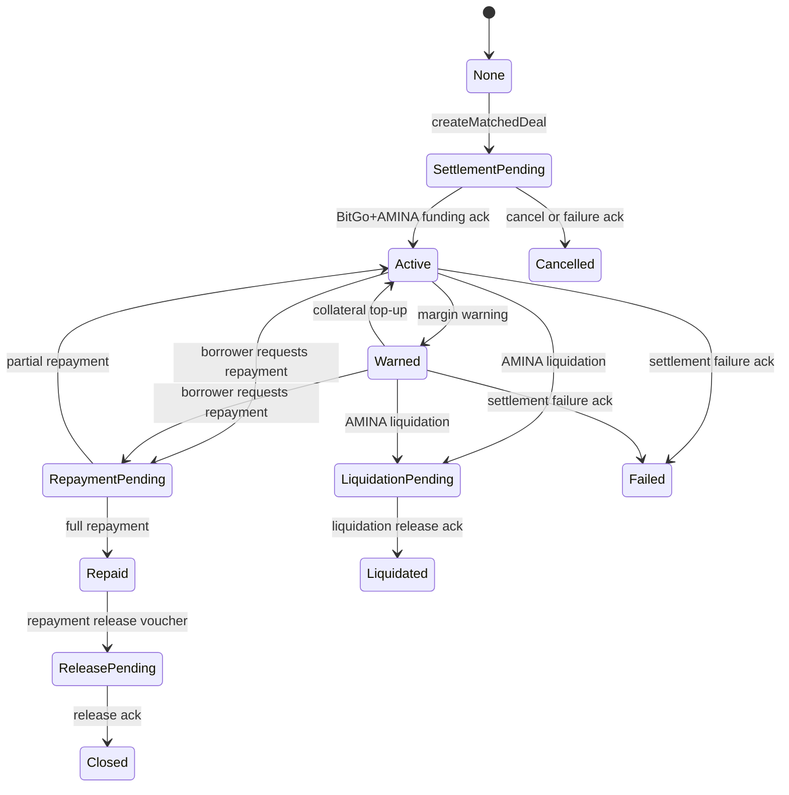

## ADR-009: Interest Starts After Funding Ack

Decision: interest accrual begins only after `confirmFunding`.

Implementation:

- `SettlementPending` deals return `0` from `computeOutstanding`.
- `confirmFunding` sets `outstanding = principal`, `interestStartTs = block.timestamp`, and `lastAccrualTs = block.timestamp`.
- `requestRepayment` crystallizes accrued interest and updates `lastAccrualTs` so repayment acknowledgement does not double-accrue the same interval.

Rationale:

- It matches the legal and economic reality: borrower owes interest after funds are actually delivered.
- It prevents disputes caused by custody delays.

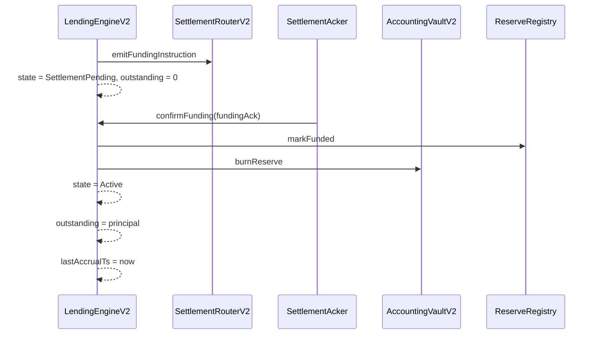

## ADR-010: Separate Pledge And Reserve Registries

Decision: collateral pledges and lender reserves are tracked in separate registries.

Implementation:

- `PledgeRegistry` tracks borrower custody collateral, minted cBTC, free inventory, encumbered inventory, release status, and active deal.
- `ReserveRegistry` tracks lender USDC reserve amount, available amount, settlement-pending amount, funded amount, returned amount, and active deal.

Rationale:

- Collateral and liquidity have different lifecycle rules.
- Pledge releases go to borrower or AMINA desk depending on state.
- Reserve funding and repayment are principal-side movements with different events and accounting.

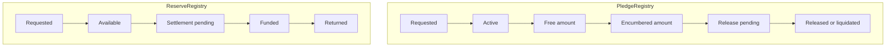

## ADR-011: ReserveGuard Caps Minting Against Fresh Evidence

Decision: minting cBTC or cUSDC must be capped by a fresh reserve policy.

Implementation:

- `ReserveGuard` maps each token to a reserve policy: adapter, subject id, margin, max staleness, active flag.
- Minting calls `reserveGuard.validateMint(token, totalSupplyAfter)`.
- The guard scales reserve proof decimals into token decimals.
- Expired or stale reserve reports block minting.

Rationale:

- The token supply must not exceed current accepted custody evidence.
- Margin lets AMINA keep an operational buffer.
- Staleness prevents old reports from supporting new mints.

Rejected alternative:

- Check only per-pledge amount. That would prevent overminting against one pledge, but not against the aggregate custody reserve for a token.

## ADR-012: AccountingVault Is The Deal Ledger

Decision: matched but not yet released cTokens sit in `AccountingVaultV2`.

Implementation:

- `pull` transfers restricted tokens from participants to the vault and records deal balances.
- `release` returns tokens during cancellation.
- `burnReserve` retires cUSDC after funding ack.
- `burnCollateralForRelease` burns cBTC after release ack and voucher validation.

Rationale:

- The vault is the asset-holding boundary between user balances and the deal state machine.
- Per-deal ledger balances make cancellation, burn, and release operations testable.
- Keeping the vault simple reduces risk; complex business rules stay in `LendingEngineV2`.

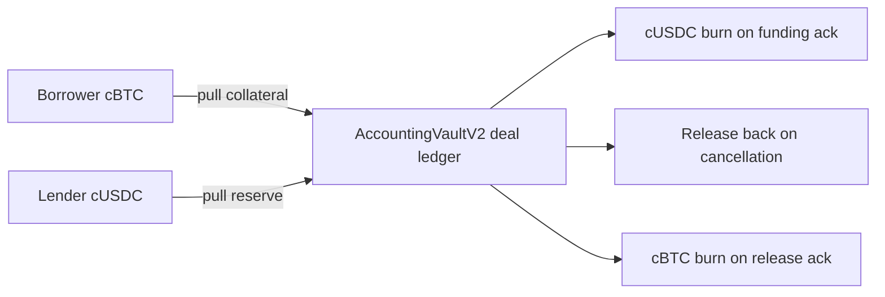

## ADR-013: SettlementRouter Is Append-Only Instruction Output

Decision: custody movements are requested by emitting structured events through `SettlementRouterV2`.

Implementation:

- Funding, repayment, release, liquidation, failure, and confirmation events include monotonically increasing router sequence numbers.
- `ReleaseAuthorizer` uses its own voucher nonce for voucher IDs, while router events use router sequence numbers.
- Offchain settlement workers listen to events and execute BitGo operations.

Rationale:

- Smart contracts cannot execute BitGo movements.
- An append-only event stream is easy to index and reconcile against custody tickets.
- Separating voucher nonce from event sequence keeps two concepts distinct:
  - voucher identity;
  - settlement instruction ordering.

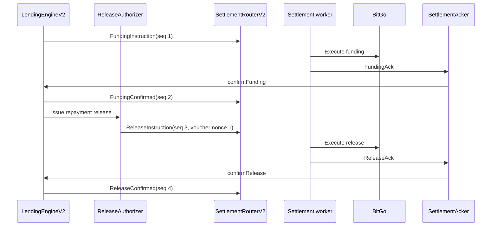

## ADR-014: Release Vouchers Are Canonical Release Authority

Decision: collateral release requires a `ReleaseVoucher`.

Implementation:

- `ReleaseAuthorizer` issues vouchers for repayment and liquidation.
- Vouchers include deal id, pledge id, asset id, amount, destination type, destination ref, reason, issued time, expiry, and consumed flag.
- `PermissionedCollateralToken.burnForRelease` checks voucher validity before burning.
- `LendingEngineV2.confirmRelease` burns collateral before consuming the voucher, then marks the pledge released or liquidated.

Rationale:

- The voucher is the contract-side authorization that corresponds to a BitGo custody release instruction.
- Expiry and consumption prevent indefinite or repeated release rights.
- Destination derivation prevents operators from choosing an arbitrary destination during acknowledgement.

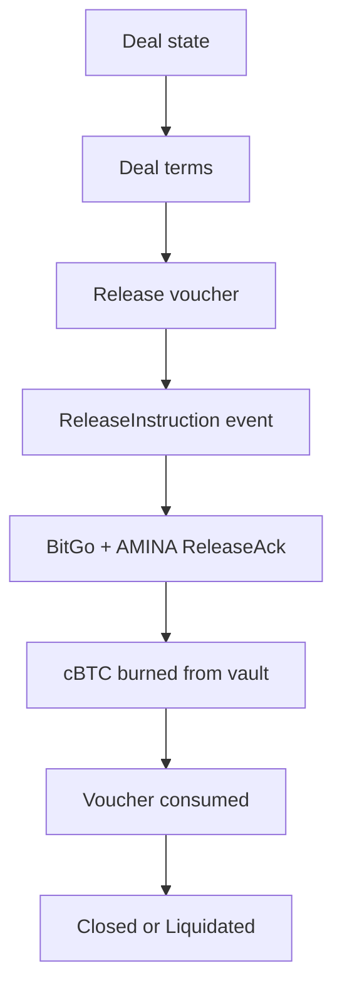

## ADR-015: Release Destination Is State-Derived

Decision: after full repayment the release destination is the borrower's release reference. After liquidation the destination is AMINA's liquidation desk reference.

Implementation:

- `issueRepaymentRelease` can only be called by `LendingEngineV2` after the engine moves through `Repaid`.
- Repayment vouchers use `DestinationType.Borrower` and `borrowerReleaseRef`.
- `issueLiquidationRelease` requires `LiquidationPending`.
- Liquidation vouchers use `DestinationType.AminaDesk` and `aminaLiquidationRef`.

Rationale:

- Operators should not decide destination at release time.
- Destination is an economic consequence of deal state:
  - borrower gets collateral back after full repayment;
  - AMINA receives collateral control for liquidation after default or threshold breach.

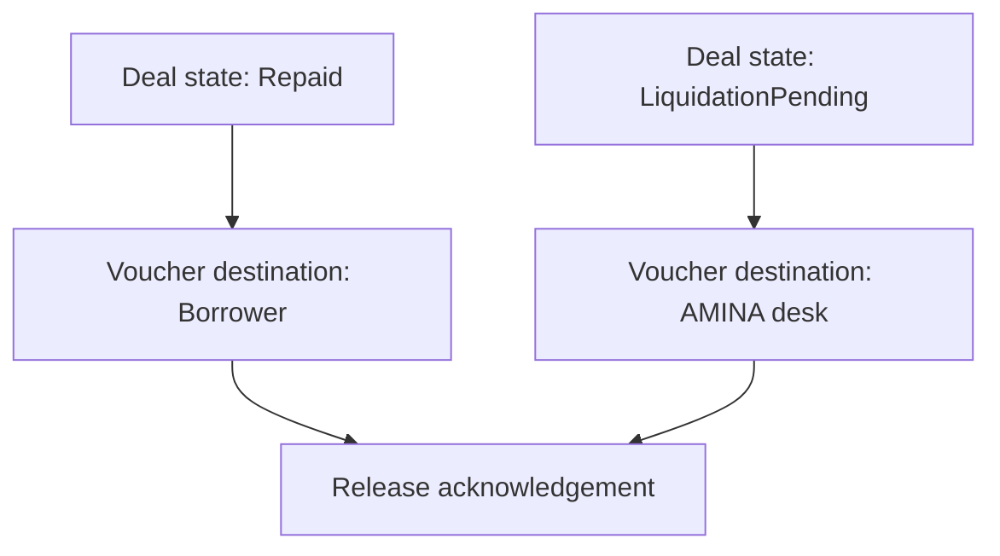

## ADR-016: Safe Mode Is Demo Only

Decision: Safe mode is not part of v1 production smart contracts.

Rationale:

- The production target is BitGo custody.
- A Safe demo path is useful for demos and local walkthroughs, but it should not dilute production assumptions.
- Keeping Safe out of production v1 prevents two custody semantics from being mixed in one critical state machine.

Future option:

- Add a separate `SafeCustodyAdapter` later if the demo path becomes a real product path. It should implement the same adapter interface and have explicit assurance-tier rules.

## ADR-017: AccessManager And Role Separation

Decision: use OpenZeppelin `AccessManaged` and the existing role manager pattern for privileged operations.

Implementation:

- Registries, token administration, risk configuration, settlement configuration, liquidation, and matching use restricted calls.
- Operational actors are separated in tests into governor, curator, allocator, liquidator, BitGo signer, AMINA signer, lender, and borrower.

Rationale:

- Institutional lending needs separation of duties.
- AccessManager is better than a single owner for reviewable deployment plans.
- The test fixture proves the intended role boundaries in one integrated setup.

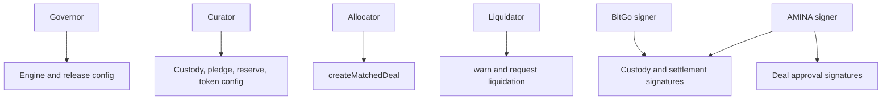

## ADR-018: EIP-712 Everywhere Material

Decision: material offchain intent and evidence uses EIP-712 typed data.

Implementation:

- `EIP712HashesV2` centralizes struct hashes.
- Deal intent signatures cover lender, borrower, AMINA, economic terms, pledge id, reserve id, destination refs, and legal terms hash.
- Custody proof signatures cover amount, account, subject, token, observation, expiry, and evidence hash.
- Settlement ack signatures cover deal id, amount, route hash, settlement ref, ack nonce, and observation time.
- Price attestations cover prices, decimals, observation time, and reason code.

Rationale:

- Typed data reduces ambiguous signing payloads.
- Explicit nonces prevent replay.
- Hash centralization reduces drift between contracts and tests.

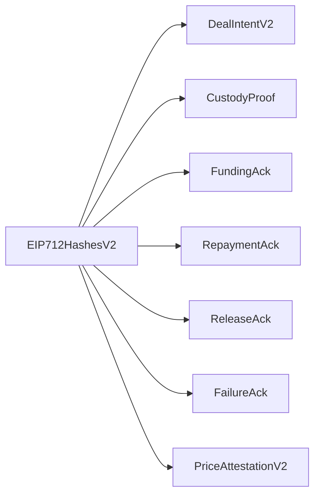

## ADR-019: AMINA-Controlled Full Liquidation In V1

Decision: v1 implements AMINA-controlled full liquidation, not automated partial liquidation.

Implementation:

- `LiquidationHandlerV2` accepts signed price attestations.
- Warning and full liquidation thresholds are configurable.
- If health is below threshold, or the loan is matured, the handler marks liquidation pending and requests a voucher.
- Liquidation release sends collateral to AMINA desk.
- Voucher-gated collateral burning can consume still-encumbered pledge inventory because liquidation releases the locked collateral rather than first unlocking it to the borrower.

Rationale:

- Institutional liquidation is operationally more complex than permissionless AMM liquidation.
- AMINA should control liquidation decisions in v1.
- Full liquidation is easier to audit than partial liquidation plus surplus mechanics.

Rejected alternatives:

- Permissionless liquidators. Not appropriate for a BitGo custody v1.
- Onchain DEX sale. Not appropriate while the underlying asset is in custody and release requires offchain operations.
- Partial liquidation. Useful later, but it needs proceeds accounting, surplus return, and multi-step default workflows.

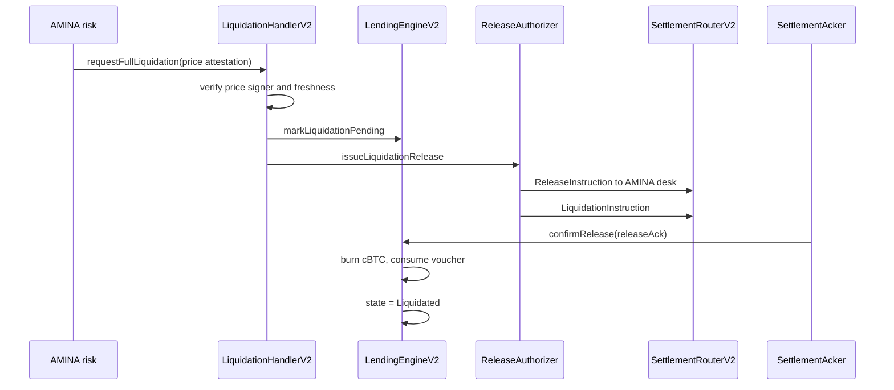

## ADR-020: Operational Assumptions And Residual Risks

Decision: document assumptions that contracts cannot enforce alone.

Assumptions:

- BitGo signer keys are controlled by a secure operational process.
- AMINA signer keys are controlled by an independent approval process.
- `evidenceHash` values are retrievable from an offchain evidence store.
- Custody account references map to real BitGo accounts or wallets through operational records.
- Settlement workers reconcile router events to custody tickets.
- Legal terms hash, policy hash, and control agreement hash are stored offchain.

Residual risks:

- Onchain contracts cannot prove the economic quality of an offchain custody report beyond accepted signatures.
- Incorrect signer configuration can halt or misroute the workflow.
- Full liquidation in v1 does not yet handle partial cure, surplus distribution, or proceeds waterfalls.
- Price attestation is signer-based in v1; a Chainlink or multi-source oracle pipeline should be added before broad production.
- The reserve proof model for Go Account style balances depends on signed operational evidence, not a public autonomous proof of reserve.

Mitigations:

- Role separation through AccessManager.
- Dual signatures for custody and settlement.
- Freshness and expiry checks.
- Restricted token transfer paths.
- Router sequence events for reconciliation.
- Explicit state transitions and ack replay protection.

## Core Invariants

The implementation should preserve these invariants:

| Invariant | Enforcement point |
| --- | --- |
| cBTC total supply cannot exceed accepted reserve guard limit | `PermissionedCollateralToken.mintForPledge` and `ReserveGuard` |
| cBTC per pledge cannot exceed pledged amount | `PledgeRegistry.canMint` and `recordMint` |
| cUSDC total supply cannot exceed accepted reserve guard limit | `ReserveToken.mintForReserve` and `ReserveGuard` |
| A deal cannot become active before funding ack | `LendingEngineV2.confirmFunding` |
| Interest does not accrue before funding ack | `computeOutstanding` and funding state |
| Funding ack cannot be replayed | `ackUsed` in `LendingEngineV2` |
| Release ack cannot burn collateral without a valid voucher | `PermissionedCollateralToken.burnForRelease` |
| Repayment release goes to borrower destination | `ReleaseAuthorizer.issueRepaymentRelease` |
| Liquidation release goes to AMINA desk | `ReleaseAuthorizer.issueLiquidationRelease` |
| User-to-user cToken transfers are blocked | `PermissionedTokenBase._update` |

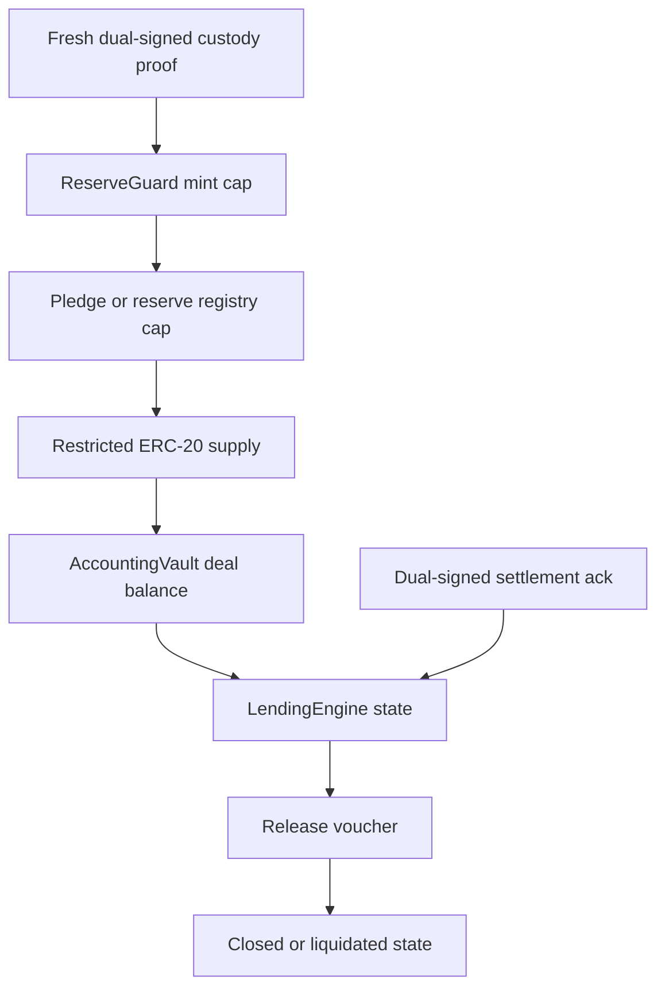

## Implementation Layout

| Layer | Contracts | Responsibility |
| --- | --- | --- |
| L1 identity and roles | `RoleManager`, `KYBGateway` | Governance roles and participant approval |
| L2 custody and tokenization | `BitGoCustodyAdapter`, `CustodyAdapterRegistry`, `ReserveGuard`, `PledgeRegistry`, `ReserveRegistry` | Custody evidence, eligibility, pledge and reserve inventory |
| Tokens | `PermissionedTokenBase`, `PermissionedCollateralToken`, `ReserveToken` | Restricted ERC-20 accounting balances |
| L3 lending | `AccountingVaultV2`, `DealRegistryV2`, `LendingEngineV2` | Deal terms, vault ledger, state machine, interest |
| L4 settlement and risk | `SettlementRouterV2`, `SettlementAcker`, `ReleaseAuthorizer`, `LiquidationHandlerV2` | Event instructions, signed acks, release vouchers, liquidation |
| L5 read model | `PortfolioLensV2` | Aggregated views for UI and operations |

## Full Lifecycle

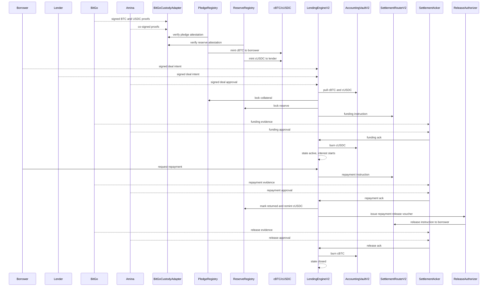

## Testing Strategy

The primary integration test file is `test/triora/TrioraBitGoV2.t.sol`.

Current coverage goals:

- pledge and reserve activation from dual-signed BitGo plus AMINA proofs;
- restricted cBTC and cUSDC transfer behavior;
- reserve guard rejection of stale proofs;
- full happy path from match through funding, repayment, release, and cToken burns;
- funding acknowledgement gating and replay protection;
- cancellation before funding;
- liquidation voucher destination and cBTC burn;
- cUSDC ERC-20 reserve restoration after repayment.

Recommended next tests:

- fuzz deal principal, collateral, rate, and maturity within configured bounds;
- invariant: total cBTC minted plus burned never exceeds pledge amount;
- invariant: cUSDC supply never exceeds current reserve guard limit;
- stale acknowledgement fuzzing around `maxAckAge` and future skew;
- role-matrix tests for every restricted selector;
- partial repayment and maturity edge cases;
- voucher expiry and duplicate release acknowledgement tests;
- governance pause and freeze tests;
- upgrade and deployment script tests once deployment is finalized.

## Future ADRs

Open decisions that should be recorded separately before expanding production scope:

- partial liquidation and proceeds waterfall;
- multi-custodian support beyond BitGo;
- Chainlink price and reserve feed integration;
- cross-chain deployment and CCIP or CRE flows;
- formal upgrade strategy;
- production deployment key custody and runbook;
- whether cBTC should remain fungible or move to per-pledge receipt tokens later.
