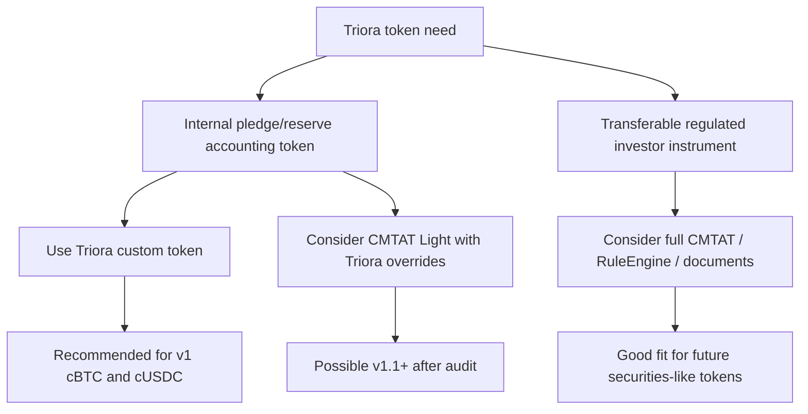
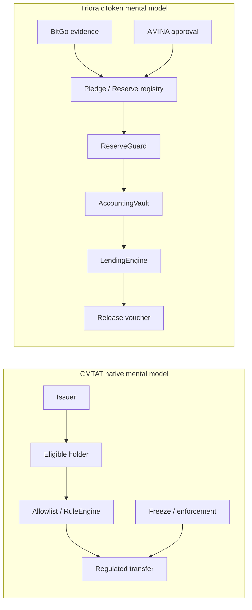
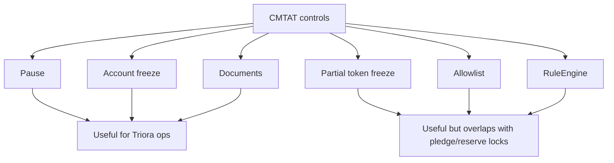
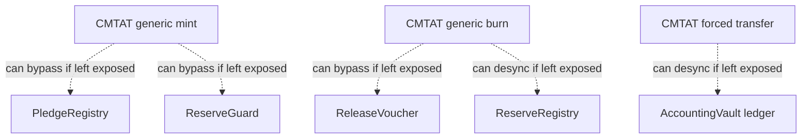
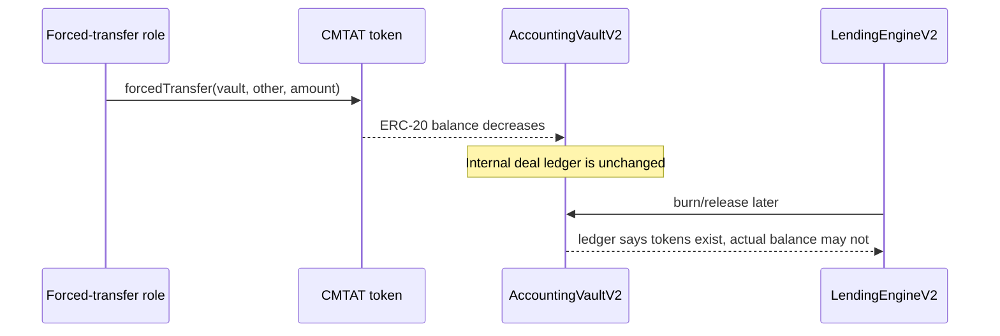
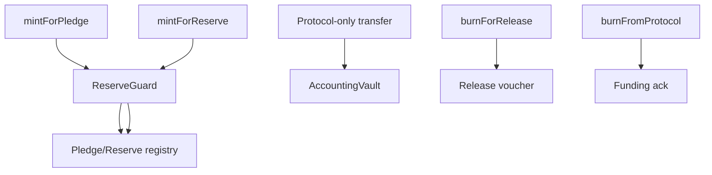
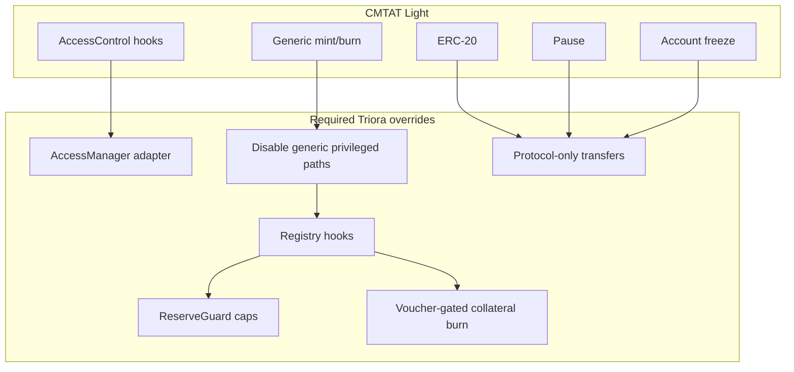
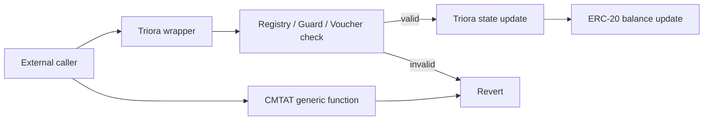
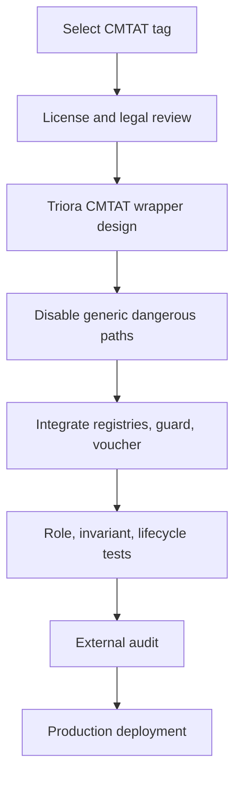

# Triora CMTAT Tokenization ADR

Date: 2026-06-26

Status: Proposed decision record.

Scope: suitability of `/Users/alex/RustroverProjects/mellow/CMTAT` for Triora tokenization, especially `cBTC` and `cUSDC`.

## Decision

Do not replace Triora v1 `cBTC` and `cUSDC` with unmodified CMTAT contracts.

CMTAT is a serious and institutionally credible tokenization framework, but Triora's v1 tokens are not ordinary transferable security tokens. They are restricted custody accounting receipts bound to BitGo evidence, pledge/reserve registries, the lending engine, the accounting vault, and release vouchers. Those invariants are more specific than CMTAT's generic issuer, compliance, mint, burn, freeze, forced-transfer, and rule-engine model.

Recommended path:

1. Keep the current Triora-specific v2 token contracts for v1.
2. Borrow CMTAT concepts where useful: documented token terms, enforcement events, can-transfer views, standard compliance interfaces, and modular validation.
3. Consider a CMTAT-light-derived implementation only after a separate integration design and audit.
4. Use CMTAT more naturally for future transferable regulated instruments, such as lender notes, fund shares, tranches, bonds, or portfolio claims.

## Sources Reviewed

Local CMTAT files reviewed:

- `README.md`
- `CHANGELOG.md`
- `SECURITY.md`
- `LICENSE.md`
- `CLAUDE.md`
- `doc/summary.md`
- `contracts/deployment/CMTATStandalone.sol`
- `contracts/deployment/light/CMTATStandaloneLight.sol`
- `contracts/deployment/allowlist/CMTATStandaloneAllowlist.sol`
- `contracts/modules/0_CMTATBaseCore.sol`
- `contracts/modules/0_CMTATBaseCommon.sol`
- `contracts/modules/1_CMTATBaseAccessControl.sol`
- `contracts/modules/2_CMTATBaseRuleEngine.sol`
- `contracts/modules/2_CMTATBaseAllowlist.sol`
- `contracts/modules/wrapper/core/ValidationModuleCore.sol`
- `contracts/modules/wrapper/controllers/ValidationModule.sol`
- `contracts/modules/wrapper/controllers/ValidationModuleAllowlist.sol`
- `contracts/modules/wrapper/extensions/ValidationModule/ValidationModuleRuleEngine.sol`
- `contracts/modules/wrapper/core/EnforcementModule.sol`
- `contracts/modules/wrapper/extensions/ERC20EnforcementModule.sol`
- `contracts/modules/wrapper/core/ERC20MintModule.sol`
- `contracts/modules/wrapper/core/ERC20BurnModule.sol`
- `contracts/interfaces/technical/ICMTATConstructor.sol`
- `contracts/interfaces/tokenization/ICMTAT.sol`

Triora files used for comparison:

- `docs/Triora-ADR.md`
- `docs/tokenization-of-collateral.md`
- `src/tokens/PermissionedTokenBase.sol`
- `src/tokens/PermissionedCollateralToken.sol`
- `src/tokens/ReserveToken.sol`
- `src/l2/PledgeRegistry.sol`
- `src/l2/ReserveRegistry.sol`
- `src/l2/ReserveGuard.sol`
- `src/l3/AccountingVaultV2.sol`
- `src/l3/LendingEngineV2.sol`
- `src/l4/ReleaseAuthorizer.sol`

## CMTAT Summary

CMTAT is a modular security-token framework from CMTA, with Taurus involvement. It targets regulated financial assets and includes:

- ERC-20 base behavior;
- mint and burn modules;
- pause and irreversible deactivation;
- account freeze;
- partial token freeze and forced transfer in non-light variants;
- allowlist variant;
- external RuleEngine variant;
- document, snapshot, debt, ERC-7551, ERC-1363, ERC-2771, ERC-7802, and other optional modules;
- role-based access control;
- ERC-7201 namespaced storage for upgradeable variants;
- public documentation, test coverage, and audit history.

Important version note:

- The local package reports `3.2.0`.
- `CHANGELOG.md` says `3.2.0` has not been audited.
- `CHANGELOG.md` says `3.1.0` is not audited.
- CMTAT's README says only audited versions should be used in production.
- The documented audited v3 line is `v3.0.0`, audited by Halborn.

That means a production Triora integration should not simply import local CMTAT HEAD. It should either use an audited tag or audit the exact delta.

## Triora Token Requirements

Triora v1 tokenization is not mainly about broad transferability. It is about binding onchain accounting to offchain custody state.

| Requirement | cBTC | cUSDC |
| --- | --- | --- |
| Asset represented | BTC pledged at BitGo | USDC reserve at BitGo / reserve account |
| Token role | Collateral accounting receipt | Lender reserve accounting balance |
| Freely transferable | No | No |
| Mint source | Pledge registry plus reserve guard | Reserve registry plus reserve guard |
| Burn source | Release voucher path | Funding retirement path |
| Required offchain evidence | BitGo plus AMINA custody proof | BitGo plus AMINA reserve proof |
| Main invariant | minted cBTC <= pledged BTC and reserve cap | minted cUSDC <= verified reserve cap |
| Transfer invariant | only protocol paths | only protocol paths |
| Lifecycle coupling | pledge lock, release pending, released, liquidated | available, settlement pending, funded, returned |
| Legal meaning | custody pledge receipt | reserved liquidity receipt |

## Fit Matrix

| CMTAT capability | Fit for Triora | Notes |
| --- | --- | --- |
| ERC-20 base | Good | Triora already uses ERC-20 balances for cBTC and cUSDC. |
| RBAC | Partial | CMTAT uses AccessControl-style roles; Triora currently uses AccessManager/AccessManaged. |
| Pause | Good | Emergency halt is useful, but semantics must not strand active deals without a runbook. |
| Account freeze | Good | Useful for sanctions, court orders, or compromised accounts. |
| Partial token freeze | Partial | Useful for settlement holds, but duplicates pledge/reserve encumbrance accounting. |
| Allowlist | Partial | KYB allowlist is useful, but Triora needs protocol-only transfer routing, not merely holder eligibility. |
| RuleEngine | Good if custom | Could encode protocol-only transfer rules, but RuleEngine replacement must be tightly governed. |
| Mint module | Partial | Generic mint must be replaced or wrapped with pledge/reserve proof checks. |
| Burn module | Partial | Generic burn must be replaced or wrapped with voucher/funding checks. |
| Forced transfer | Risky | Dangerous unless disabled or made engine-only with vault ledger updates. |
| Forced burn | Risky | Dangerous unless voucher/funding gated. |
| Batch mint/burn/transfer | Risky | Good for securities operations, bad if it bypasses Triora accounting hooks. |
| Document module | Good for future | Legal terms and custody policy documents fit well. |
| Debt module | Good for future | More suitable for lender notes/bonds than for cBTC/cUSDC receipts. |
| ERC-1363 | Poor for v1 | Transfer-and-call expands surface; not needed for custody accounting tokens. |
| ERC-2771 | Partial | Meta-tx can help UX, but institutional flows already rely on signed intents. |
| ERC-7802 / cross-chain | Poor for v1 | Cross-chain cTokens would complicate custody and reserve invariants. |
| Upgradeability | Partial | Useful operationally, but Triora core token invariants should be hard to mutate. |

## Pros Of Using CMTAT

### Institutional Credibility

CMTAT is designed for regulated financial assets. Its history, documentation, public audit posture, and Taurus/CMTA ecosystem make it easier to explain to banks, custodians, legal reviewers, and auditors than a wholly bespoke token stack.

For Triora this matters because AMINA, BitGo, auditors, and future institutional counterparties will ask whether the token contracts follow recognized tokenization patterns.

### Better Standard Surface

CMTAT supports or references several relevant tokenization interfaces:

- ERC-20 for ordinary balance tooling;
- ERC-3643-style compliance functions;
- ERC-7943 transfer/freeze error surfaces in newer versions;
- ERC-1404-style transfer restriction introspection in rule-engine variants;
- ERC-1643-style documents;
- ERC-7551 security-token concepts;
- ERC-5679 mint/burn interface in newer versions.

Triora's current custom tokens are simpler and easier to audit, but they do not expose the same familiar tokenization-standard surface.

### Mature Compliance Controls

CMTAT already has:

- global pause;
- account freezing;
- partial token freezing in richer variants;
- forced transfer in richer variants;
- allowlist deployment;
- external rule engine deployment;
- role-separated operations.

These are familiar controls for regulated asset issuers.

### Useful Documentation And Audit Trail

CMTAT has extensive documentation and public security materials. Even if Triora keeps custom tokens, CMTAT is a useful benchmark for:

- event naming;
- compliance status views;
- freeze semantics;
- token terms metadata;
- audit explanations;
- tokenization vocabulary.

### Future Products Fit Better Than v1 cTokens

CMTAT is much more naturally suited for future Triora instruments such as:

- transferable lender participation notes;
- fund or vault shares;
- tokenized loan portfolios;
- fixed-income notes;
- AMINA-issued structured products;
- RWA securities or debt tokens.

Those products look like regulated financial instruments with eligible holders and transfer controls. That is CMTAT's home ground.

## Cons And Sharp Edges

### CMTAT Does Not Know Triora's Custody Invariants

CMTAT's generic token modules do not know about:

- `pledgeId`;
- `reserveId`;
- BitGo custody proofs;
- AMINA co-attestation;
- reserve guard supply caps;
- vault deal ledger;
- funding acknowledgements;
- release vouchers;
- liquidation destinations.

Those are the core security properties of Triora v1. If CMTAT is imported without custom hooks, the token may be standards-compliant but economically wrong.

### Generic Mint And Burn Are Dangerous For cTokens

CMTAT exposes role-gated mint and burn functions. That is normal for an issuer token. For Triora, mint and burn are not merely issuer actions:

- cBTC mint must record the pledge and respect the reserve guard.
- cUSDC mint must come from the reserve registry and respect the reserve guard.
- cBTC burn must be release-voucher-gated.
- cUSDC burn must happen when real funding is acknowledged.

If `MINTER_ROLE` or `BURNER_ROLE` can call generic CMTAT functions directly, a role compromise or misconfiguration can bypass Triora accounting.

### Forced Transfer Is A Ledger Desynchronization Risk

Full CMTAT variants support forced transfer. That is useful for securities, but dangerous for Triora cTokens if it can move balances out of `AccountingVaultV2`.

The vault tracks per-deal balances. If a forced transfer moves tokens out of the vault without calling the lending engine, the ERC-20 balance and the vault ledger can diverge.

The only acceptable version is one where forced transfer is disabled or is engine-only and updates the vault ledger atomically.

### Batch Functions Increase Blast Radius

CMTAT includes batch mint, batch burn, and batch transfer. These are operationally useful for securities issuance, but Triora cTokens are pledge/reserve-specific. Batch operations can make it easy to accidentally mutate multiple balances without all registry hooks firing exactly once per pledge/reserve.

### Access Control Models Differ

Triora currently uses OpenZeppelin `AccessManaged` and a centralized `RoleManager`. CMTAT's ready-made variants use AccessControl-style roles.

That mismatch is not fatal, but it matters:

- deployment scripts need another role system;
- timelocks and role scheduling may diverge;
- tests need role-matrix coverage twice;
- operations teams must understand which role system controls which path;
- emergency runbooks become more complex.

CMTAT v3.1+ notes a direction where wrapper modules use internal authorization hooks, making a custom AccessManager-based base possible. But local v3.1 and v3.2 are marked unaudited, so using that flexibility in production requires an audit.

### Version And Audit Mismatch

The local repo is `3.2.0`, but CMTAT's own changelog marks `3.2.0` unaudited. It also marks `3.1.0` unaudited. The README says only audited versions should be used in production, with v3.0.0 as the audited v3 release.

This creates a practical dilemma:

- v3.0.0 is the safest audited target;
- v3.1/v3.2 contain useful architectural improvements and newer standards;
- Triora would need custom overrides anyway;
- custom overrides invalidate the direct comfort of the upstream audit.

### License Review Needed

CMTAT uses MPL-2.0. That is a weak copyleft license, not a blocker by itself. But it has source-availability obligations for covered files and modifications. Triora should get legal sign-off before copying or modifying CMTAT source files into a proprietary deployment.

### Decimal Assumptions Need Legal Review

CMTAT constructor comments note that decimals should be `0` for Swiss-law compliance under the CMTAT specification, while non-zero decimals may be needed for other use cases. Triora needs:

- `cBTC` with 8 decimals;
- `cUSDC` with 6 decimals.

Technically CMTAT supports non-zero decimals. Legally and product-wise, Triora should avoid implying these cTokens are CMTAT-style Swiss ledger securities if their legal nature is custody accounting.

### Full CMTAT Is Too Broad For v1 cTokens

Triora v1 does not need:

- ERC-1363 transfer-and-call;
- ERC-7802 cross-chain behavior;
- broad holder-to-holder transfers;
- generic securities forced transfer;
- onchain debt fields for the cTokens;
- rich document/snapshot engines for internal accounting receipts.

Every extra module is more code, more role surface, more test burden, and more operational documentation.

## Token-by-Token Suitability

### BitGo-cBTC

Verdict: poor direct fit; possible as a heavily customized CMTAT-light derivative.

Why:

- cBTC is pledge-bound.
- Minting must reference `pledgeId`.
- Burning must reference `voucherId`.
- Transfer must be protocol-only.
- Liquidation burns can consume encumbered pledge inventory.
- The token's security is inseparable from `PledgeRegistry`, `ReserveGuard`, and `ReleaseAuthorizer`.

CMTAT can provide an ERC-20/compliance shell, but it does not provide the pledge-bound semantics.

### cUSDC

Verdict: moderate fit, but still not a drop-in.

Why:

- cUSDC is an ERC-20 reserve balance, which looks closer to a standard regulated token.
- However, it is still not meant to circulate freely.
- Minting must come from `ReserveRegistry`.
- Burning must occur through funding acknowledgement.
- Reminting on principal return must respect fresh reserve evidence.

CMTAT could be useful if cUSDC evolves into a transferable regulated lender claim. For v1 reserve accounting, the custom token remains cleaner.

### Future Lender Notes / Fund Shares / Tranches

Verdict: good fit.

Why:

- These are closer to real securities or fund interests.
- Eligible holder transfer restrictions matter.
- Document terms matter.
- Debt metadata may matter.
- Forced transfer and enforcement may be legally required.
- CMTAT's market credibility is valuable.

## Architecture Options

### Option A: Keep Current Custom Tokens

Decision: recommended for v1.

Pros:

- Minimal code and behavior.
- Directly encodes Triora invariants.
- Uses the same AccessManager pattern as the rest of the protocol.
- Easy to reason about in audits.
- No license/import complexity.
- No unneeded forced-transfer or batch surfaces.

Cons:

- Less standard tokenization surface.
- Less institutional brand recognition than CMTAT.
- Triora must maintain its own token compliance API.
- Future regulated instruments will need more features.

### Option B: CMTAT Light With Triora Overrides

Decision: possible later, not v1 default.

Required changes:

- Build a `TrioraCMTATBase` that uses AccessManager/AccessManaged or strictly maps CMTAT roles to Triora `RoleManager`.
- Hide or override generic `mint`, `burn`, `batchMint`, `batchBurn`, `batchTransfer`, `burnAndMint`, and `forcedBurn`.
- Add `mintForPledge`, `mintForReserve`, `burnForRelease`, and `burnFromProtocol` entry points.
- Add reserve guard checks before every mint.
- Add registry record hooks after mint/burn.
- Add voucher validation before collateral burn.
- Preserve protocol-only transfers.
- Add tests proving generic inherited functions cannot bypass Triora hooks.

### Option C: Full CMTAT With RuleEngine

Decision: not recommended for v1 cBTC/cUSDC.

This option would use CMTAT's richer standard or rule-engine variant and encode Triora transfer restrictions in a custom `IRuleEngine`.

Pros:

- Stronger CMTAT identity.
- `canTransfer` and restriction introspection can be useful.
- RuleEngine gives externalized transfer validation.

Cons:

- RuleEngine replacement becomes a critical governance risk.
- Forced transfer and enforcement features require strict disabling or engine integration.
- Bytecode and test complexity increase.
- The token still needs custom pledge/reserve/voucher hooks.
- It is easy for the CMTAT compliance model and Triora accounting model to drift.

### Option D: Use CMTAT For Future Transferable Instruments

Decision: recommended for future product lines.

Possible products:

- lender participation tokens;
- AMINA-issued notes;
- tokenized loan pools;
- portfolio shares;
- debt instruments;
- structured products.

In those products, CMTAT's compliance and document modules are not extra baggage. They are core product requirements.

## Required Safe CMTAT Profile For Triora cTokens

If Triora decides to use CMTAT for cBTC/cUSDC anyway, the safe profile should look like this:

| Surface | Required Triora rule |
| --- | --- |
| `transfer` | Allow only mint, burn, or protocol address on one side. |
| `transferFrom` | Same as `transfer`; vault allowance path only. |
| `approve` | Allowed, but harmless because `transferFrom` enforces protocol routing. |
| `mint` | Disabled or callable only through Triora registry wrappers. |
| `batchMint` | Disabled for cBTC/cUSDC unless every element has registry proof hooks. |
| `burn` | Disabled or callable only through Triora engine/vault wrappers. |
| `batchBurn` | Disabled for cBTC/cUSDC. |
| `burnAndMint` | Disabled. |
| `forcedTransfer` | Disabled, or engine-only with vault ledger synchronization. |
| `forcedBurn` | Disabled, or voucher/funding-gated. |
| `setRuleEngine` | Timelocked; ideally immutable after launch. |
| `deactivateContract` | Disabled while any pledge/reserve/deal is live. |
| `allowlist` | Optional; must not replace KYB and protocol transfer checks. |
| `freeze` | Allowed as emergency/compliance control. |

## Pros And Cons Table

| Dimension | Pros | Cons |
| --- | --- | --- |
| Regulatory credibility | CMTA/Taurus ecosystem, security-token vocabulary, audit history | May imply a legal/security-token nature Triora cTokens do not have |
| Code maturity | Extensive docs, tests, modules, public usage | Local v3.2.0 is unaudited; Triora customizations need new audit |
| Compliance | Pause, freeze, allowlist, rule engine, can-transfer surfaces | Generic compliance is not enough for pledge/reserve/voucher invariants |
| Developer ergonomics | Existing modules and deployment variants | Many inheritance paths and variants; easy to choose wrong variant |
| Access control | Granular roles | Different from Triora AccessManager stack |
| Transfer controls | Allowlist and RuleEngine can model restrictions | Protocol-only transfer is stricter than holder eligibility |
| Mint/burn | Standardized mint/burn APIs | Generic privileged mint/burn are footguns for custody-backed tokens |
| Enforcement | Useful emergency powers | Forced transfer/burn can desync accounting if not disabled |
| Documents | Good for legal terms and token info | Not critical for internal cBTC/cUSDC receipts |
| Cross-chain | Useful for future products | Bad fit for v1 custody-backed cTokens |
| License | MPL-2.0 allows commercial use in larger works | Legal/source obligations need review |

## Implementation Impact If Adopted

Adopting CMTAT for cBTC/cUSDC is not a one-file replacement. It would require:

1. New token base contract.
2. Access control adapter or role migration.
3. Overrides for every inherited privileged path.
4. Reimplementation of `IRestrictedToken`.
5. Registry hook integration.
6. Reserve guard integration.
7. Voucher integration.
8. Vault tests for exact-transfer and ledger consistency.
9. Full role-matrix tests.
10. Invariant/fuzz tests around inherited CMTAT functions.
11. License review.
12. Audit of the exact CMTAT tag plus Triora modifications.

## Testing Requirements If CMTAT Is Used

Minimum required tests:

- generic CMTAT `mint` cannot mint cBTC/cUSDC without registry hooks;
- generic CMTAT `burn` cannot burn cBTC/cUSDC without funding/release path;
- `batchMint`, `batchBurn`, `batchTransfer`, and `burnAndMint` are disabled or fully hook-safe;
- forced transfer cannot move tokens out of the vault;
- forced burn cannot bypass vouchers;
- paused token cannot move through protocol paths unless emergency runbook allows it;
- frozen borrower cannot transfer, but liquidation/recovery runbooks still work;
- allowlist changes cannot make user-to-user transfers valid;
- RuleEngine replacement cannot bypass protocol-only transfer restrictions;
- total cBTC supply never exceeds pledge and reserve caps;
- total cUSDC supply never exceeds reserve caps;
- vault ledger sum remains less than or equal to token balance;
- active deal collateral cannot leave the vault except through engine release/burn;
- cUSDC is restored to lender only after repayment acknowledgement and fresh reserve evidence;
- role admin cannot accidentally receive broad issuer powers beyond intended runbook.

## Recommendation By Product Phase

### v1 BitGo Production

Keep current Triora-specific `PermissionedCollateralToken` and `ReserveToken`.

Reason:

- v1 needs narrow, audit-friendly, custody-specific behavior.
- The current contracts directly model BitGo plus AMINA proofs, registry accounting, reserve caps, and vouchers.
- CMTAT would add more inherited behavior than v1 needs.

### v1.1 Hardening

Borrow selected CMTAT ideas:

- add `canTransfer` and `canTransferFrom` views;
- add richer freeze reasons/events;
- add standard restriction error codes;
- add token terms/document references;
- consider ERC-1404/ERC-7943-style introspection;
- improve operational runbooks for pause/freeze/deactivation.

This gives much of the institutional interface value without importing the full inheritance surface.

### v2 Regulated Transferable Instruments

Use CMTAT seriously for future products that are meant to be transferable regulated instruments.

Best candidates:

- lender note token;
- loan participation token;
- AMINA-managed fund share;
- tokenized debt instrument;
- tokenized portfolio tranche.

For those, CMTAT's compliance, document, debt, and rule-engine modules match the product instead of fighting it.

## Final Conclusion

CMTAT is suitable for Triora's broader tokenization roadmap, but not as a direct v1 replacement for `cBTC` and `cUSDC`.

For v1, Triora should keep its custom, pledge-bound and reserve-bound accounting tokens. If CMTAT is adopted later, use it as a controlled base with dangerous generic paths removed or overridden, not as a drop-in standard token. The secure path is to let Triora's registries, reserve guard, vault, lending engine, and release authorizer remain the source of truth, while CMTAT contributes institutional tokenization ergonomics where they do not weaken those invariants.
