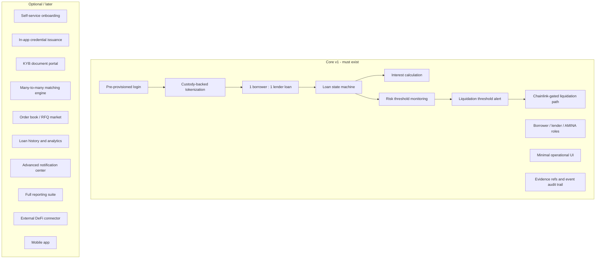
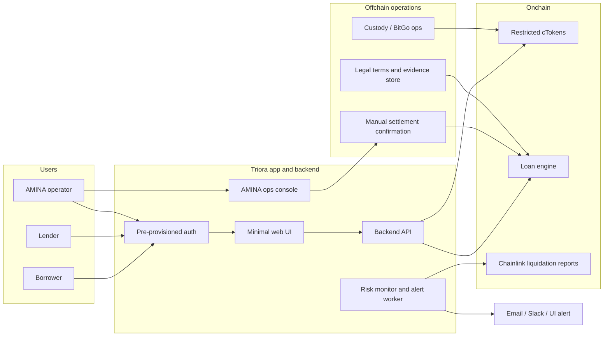
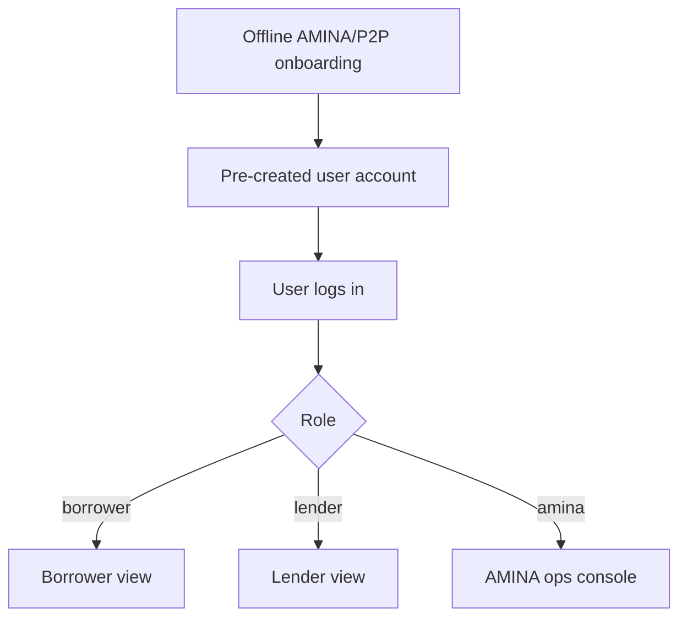
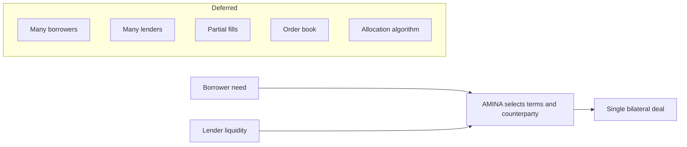
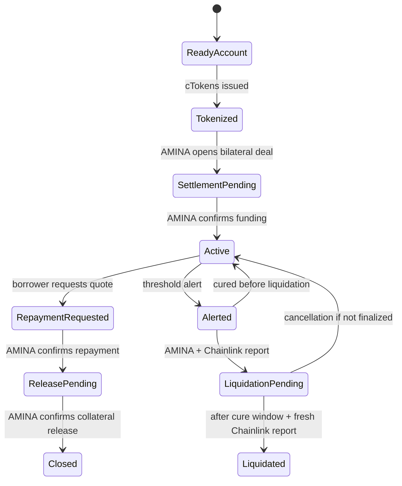
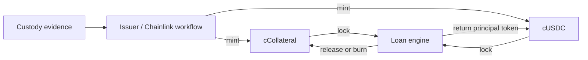
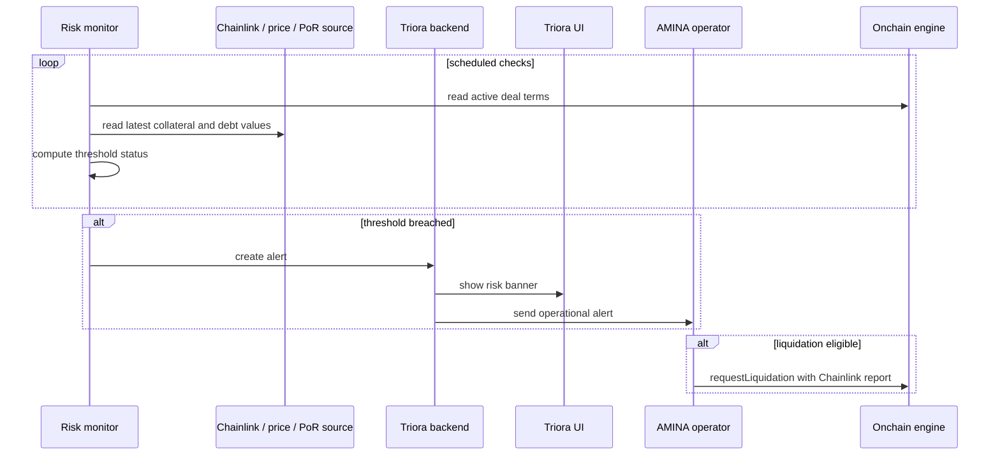
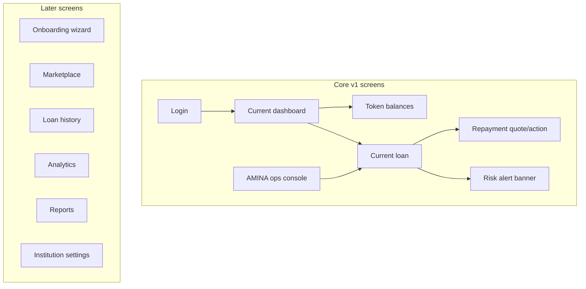
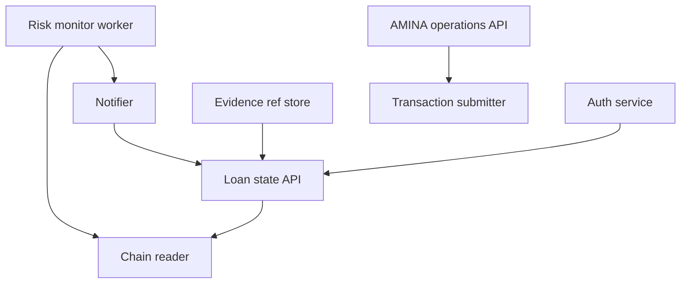
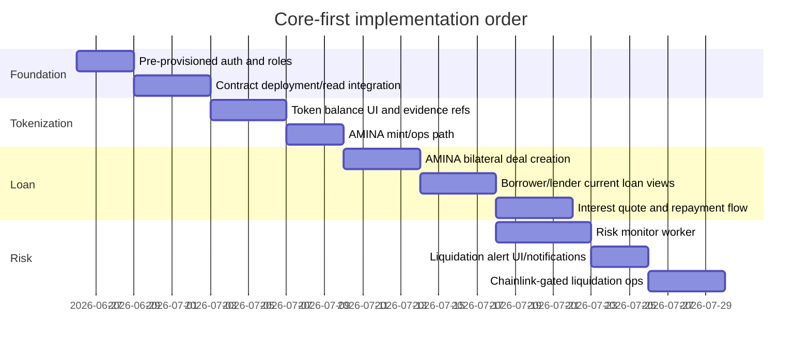

# Triora Core vs Optional Functionality Split

Date: 2026-06-26

Status: revised system-level MVP scope based on manager feedback.

## Executive Decision

Triora v1 should be a narrow bilateral lending system, not a full institutional lending marketplace.

The core product should prove only this:

> A pre-approved borrower and a pre-approved lender can use custody-backed tokenized balances to enter one fixed-term loan, accrue interest from confirmed funding, monitor liquidation risk, receive alerts when liquidation thresholds are breached, and complete repayment or Chainlink-gated liquidation through AMINA-operated workflows.

Everything not required for that sentence should be optional or manual in v1.

This is not only a smart-contract simplification. It affects the whole system: onboarding, user management, UI, backend, matching, custody operations, monitoring, reporting, admin tools, and integrations.

## MVP Boundary



## Definition Of Core

Core means the feature is required for a controlled v1 pilot to work end to end.

A core feature must satisfy at least one of these conditions:

- It is necessary to represent custody-backed assets.
- It is necessary to create and operate a single bilateral loan.
- It is necessary to calculate what the borrower owes.
- It is necessary to know when liquidation risk exists.
- It is necessary to let AMINA operate regulated settlement, repayment, and liquidation.
- It is necessary for the user to see current balances, current loan state, and urgent risk status.
- It is necessary for auditability of the current position.

Optional means the feature improves scale, user acquisition, automation, comfort, reporting, or marketplace quality, but the v1 product can operate without it.

## System-Level Scope



## Core Functional Split By Domain

| Domain | Core v1 | Optional / later |
| --- | --- | --- |
| User onboarding | Users are created offline by P2P/AMINA. App starts from a ready account. | Self-service onboarding, KYB upload portal, invitation flows, institution admin, password setup wizard. |
| Authentication | Login for pre-provisioned borrower, lender, and AMINA users. Basic role mapping. | SSO/SAML, MFA enrollment UX, password reset flows, institution-level user management, access request workflows. |
| KYB/compliance | KYB status is an input controlled offchain by AMINA. The app only shows whether account is approved. | Full KYB case management, document uploads, sanctions refresh UI, travel-rule metadata, compliance reporting. |
| Custody setup | Custody account and legal/control docs are handled offline. System stores evidence refs. | In-app custodian onboarding, API-driven account opening, automated document signing, multi-custodian routing. |
| Tokenization | AMINA/issuer mints restricted accounting tokens after custody evidence. User sees cBTC/cETH/cUSDC balance and evidence ref. | Self-service tokenization request flow, multi-asset tokenization, token redemption UX, proof drawers, external token standards. |
| Matching | No generic matching engine. AMINA creates one bilateral deal between one borrower and one lender. | Order book, RFQ, 1 borrower to many lenders, many lenders to one borrower, partial fills, allocation logic. |
| Loan creation | Fixed terms entered by AMINA: borrower, lender, collateral token, principal token, amount, APR, maturity, threshold, legal terms hash. | Negotiation workflow, lender bids, borrower requests, templates, term-sheet versioning UI. |
| Loan lifecycle | Settlement pending, active, repayment requested, release pending, closed, liquidation pending, liquidated. | Amendments, rollovers, refinancing, extensions, partial repayments, top-ups, collateral substitution. |
| Interest | Simple pro-rata interest from confirmed funding timestamp. Quote principal plus accrued interest. | Compounding, floating rates, benchmark index rates, penalty interest, day-count variants per jurisdiction. |
| Risk monitoring | Monitor current LTV/threshold using approved oracle/custody values and raise liquidation-threshold alerts. | Full health-factor dashboards, simulations, stress testing, VaR, advanced margin call workflows. |
| Alerts | Alert AMINA and show UI warning when liquidation threshold is breached or close to breached. | User-configurable notifications, SMS, PagerDuty, escalation policies, alert history, alert acknowledgements. |
| Liquidation | AMINA can request/finalize liquidation only with Chainlink report and cure window. | Auction module, liquidation marketplace, partial liquidation, automated liquidation bots, surplus distribution UI. |
| Repayment | Borrower requests quote; AMINA confirms repayment after offchain settlement; collateral release is confirmed and cCollateral is burned. | In-app wire/stablecoin payment rails, automatic payment matching, repayment scheduling, early repayment discounts. |
| Portfolio UI | Show current token balances and current active/pending loan. | Historical portfolio, closed loan archive, performance charts, exports, tax/accounting statements. |
| Reporting | Minimal audit trail via events, evidence refs, and current state views. | Full regulatory reporting, PDF statements, lender reports, borrower statements, accounting integrations. |
| Admin ops | AMINA console for approve users, mint/issue refs, open deal, confirm funding, confirm repayment, request/finalize liquidation. | Multi-step maker/checker workflows, task queues, SLA tracking, admin analytics, bulk operations. |
| Backend API | Thin API over auth, cached chain reads, AMINA operations, risk monitor, evidence refs. | Public API, webhook platform, partner SDKs, event streaming, data warehouse. |
| Smart contracts | Restricted ERC-20 accounting tokens and one lending engine. | Custody adapters, pledge/reserve registries, settlement router, loan NFTs, DeFi bridge, upgradeable suite. |

## Minimal User Model

The manager's onboarding point is correct: v1 does not need a full onboarding product.

Core user model:

- P2P/AMINA creates user accounts offline.
- Borrower and lender receive credentials outside Triora.
- App only authenticates existing accounts.
- Account has a fixed role: borrower, lender, or AMINA operator.
- KYB approval and legal readiness are boolean/enum flags imported from AMINA operations.



Optional onboarding includes everything that makes account creation self-service. That can wait.

## Matching Simplification

The v1 system should not build a marketplace matching engine.

Core matching rule:

```text
one borrower + one lender + one principal amount + one collateral package = one deal
```

AMINA is the matching authority. The system records the matched deal; it does not discover it.



This cuts a lot of complexity:

- no order book;
- no price discovery;
- no partial fills;
- no allocation fairness;
- no lender syndication;
- no borrower request marketplace;
- no matching conflict resolution;
- no matching history UI.

## Core Loan Lifecycle



Core lifecycle properties:

- "Matched" does not mean active.
- Interest starts only after funding is confirmed.
- Repayment is not complete until AMINA confirms real settlement.
- Collateral release is not complete until AMINA confirms release and the locked collateral token is burned.
- Liquidation cannot be based only on AMINA discretion; it needs Chainlink proof and the cure window.

## Core Tokenization

Tokenization remains core because it is the product's anchor.

Core:

- restricted ERC-20 accounting balances for collateral and loan principal;
- cCollateral for borrower collateral, such as cBTC/cETH;
- cUSDC for lender reserve/liquidity;
- minting only by approved issuer after custody evidence;
- no user-to-user transfers;
- tokens can be locked by the loan engine;
- locked collateral token can be burned on confirmed release or liquidation.

Optional:

- self-service mint request UI;
- external token transferability;
- CMTAT/ERC-3643 style rich compliance modules;
- collateral substitution;
- public DeFi integration;
- multi-custodian token standards;
- token holder registry UX.



## Core Risk And Alerting

The manager explicitly called out alerting at liquidation-threshold breach as core. That should be implemented as a system feature, not only a contract feature.

Core alerting:

- risk monitor reads current loan terms;
- risk monitor reads collateral value and debt value from approved oracle/reporting sources;
- risk monitor computes LTV or liquidation predicate;
- if threshold is breached, alert AMINA and show borrower/lender warning state;
- if threshold remains breached and Chainlink signs a liquidation report, AMINA can request liquidation.



Optional alerting:

- alert history screens;
- borrower-configurable warning thresholds;
- SMS and phone escalation;
- AMINA task queues;
- incident timeline;
- automated top-up suggestions;
- simulations.

## Core UI

The UI should be narrow and operational.

Core borrower UI:

- login;
- view cTokenized collateral balance;
- view current loan status;
- view outstanding principal plus interest;
- request repayment quote;
- see risk/liquidation alert.

Core lender UI:

- login;
- view cUSDC balance;
- view current loan status;
- view principal, APR, maturity, accrued interest;
- see repayment/release/liquidation status.

Core AMINA UI:

- approve/precheck participant flags;
- view tokenized balances and evidence refs;
- create bilateral deal;
- confirm funding;
- confirm repayment;
- request liquidation with report;
- finalize liquidation after cure window;
- see threshold alerts.

Optional UI:

- registration and onboarding;
- loan marketplace;
- historical portfolio;
- full loan archive;
- charts and performance analytics;
- downloadable statements;
- multi-user institution admin;
- notification preferences;
- document portal.



## What Can Be Removed From V1

The following are explicitly not required for the first version.

| Feature | Why it can be removed |
| --- | --- |
| Self-service onboarding | Users can start from pre-created accounts. |
| In-app login/password issuance | Credentials can be distributed offline. |
| Full KYB workflow | AMINA can perform KYB outside the product and pass approval status in. |
| Generic matching engine | v1 supports one borrower and one lender per loan. |
| 1-to-many loan syndication | Adds allocation, partial fill, and lender accounting complexity. |
| Loan history page | Current state is enough for v1; onchain events remain as raw audit trail. |
| Closed-loan archive UI | Can be replaced with event logs/admin export initially. |
| Partial repayment | Full repayment only is simpler and auditable. |
| Collateral top-up | Operationally useful, but can be handled by close/reopen or AMINA manual process. |
| Collateral substitution | Not required for one bilateral MVP deal. |
| Loan amendments | Avoids rate, maturity, and legal-term mutation complexity. |
| Secondary-market loan token | Creates securities, transfer, and rehypothecation questions. |
| External DeFi protocol bridge | Different architecture; defer to v2. |
| Multi-custodian support | v1 can target one custodian/ops process. |
| Advanced reporting | Raw events plus minimal state exports are enough initially. |
| Public API and webhooks | Internal backend is enough for pilot. |

## Minimum Backend Services

Core backend can be small:



Core services:

- `Auth`: authenticate pre-created users and map roles.
- `Loan state API`: serve current balances, current loan, outstanding amount, and status.
- `Evidence ref store`: keep legal/custody/oracle references by hash/id; not full document management.
- `AMINA operations API`: controlled endpoints for opening deals and confirming lifecycle steps.
- `Risk monitor worker`: checks threshold status and emits alerts.
- `Notifier`: sends minimal alerts to AMINA and exposes UI banners.
- `Chain reader/writer`: reads contracts and submits approved operations.

Optional services:

- onboarding service;
- KYB workflow service;
- matching engine;
- document management;
- reporting/data warehouse;
- notification preferences;
- accounting integrations;
- partner APIs.

## Minimum Smart Contracts

Smart contracts remain intentionally small.

Core:

- `TrioraAccountToken`
  - restricted accounting ERC-20;
  - issuer-only mint;
  - engine-only burn of locked balance;
  - no user-to-user transfers.
- `TrioraLendingSimple`
  - bilateral deal state machine;
  - AMINA operations role;
  - lock cCollateral and cUSDC;
  - confirm funding;
  - calculate simple interest;
  - request/confirm repayment;
  - Chainlink-gated liquidation with cure window;
  - emit evidence-rich events.

Optional contracts:

- custody adapter;
- pledge registry;
- reserve registry;
- settlement router;
- release authorizer;
- separate liquidation handler;
- loan position token;
- DeFi bridge;
- CMTAT-based token suite;
- upgrade/governance stack.

## Core Data Model

The database does not need to model a full marketplace.

Core entities:

| Entity | Core fields |
| --- | --- |
| User | id, institution, role, approved flag, wallet/address, status |
| Token balance cache | user, token, balance, evidence ref, last synced block |
| Deal | deal id, borrower, lender, tokens, amounts, APR, maturity, liquidation threshold, legal terms hash, state |
| Alert | deal id, severity, threshold type, observed values, timestamp, status |
| Evidence ref | hash/id, type, linked entity, URI or storage pointer, created by |
| Operation | type, actor, deal id, transaction hash, evidence ref, timestamp |

Optional entities:

- onboarding application;
- KYB case;
- order;
- quote;
- partial fill;
- loan history aggregate;
- notification preference;
- statement/report;
- institution admin users.

## Prioritized Build Plan



Suggested implementation order:

1. Pre-provisioned users and role-based UI.
2. Token balance display and AMINA tokenization operation.
3. AMINA creates a single bilateral deal.
4. Borrower/lender can see current loan state.
5. Interest quote works from confirmed funding time.
6. Risk monitor emits liquidation-threshold alerts.
7. AMINA can run repayment/release and Chainlink-gated liquidation.
8. Only after this works, add optional onboarding, marketplace, history, and reports.

## Final Core List

Triora v1 core:

- pre-created users and simple role-based access;
- custody-backed tokenization of borrower collateral and lender cUSDC;
- current balance and current loan views;
- AMINA-created 1 borrower / 1 lender bilateral loan;
- settlement pending vs active separation;
- interest calculation from confirmed funding;
- repayment quote and AMINA-confirmed repayment/release;
- liquidation-threshold monitoring and alerts;
- Chainlink-gated liquidation with cure window;
- minimal AMINA operations console;
- evidence refs and events for auditability.

Triora v1 optional:

- self-service onboarding;
- in-app login/password issuance;
- KYB portal;
- many-to-many matching;
- loan syndication;
- order book/RFQ marketplace;
- loan history UI;
- advanced reports;
- partial repayment/top-up/substitution;
- DeFi connectors;
- secondary loan tokens;
- multi-custodian abstraction;
- public APIs and partner integrations.

This keeps the first system small enough to build, review, operate, and explain, while preserving the product's non-negotiables: tokenization, loan lifecycle, interest accounting, liquidation-risk alerts, and verifiable liquidation eligibility.
