# Triora Mockup Review

Source reviewed: `/Users/alex/RustroverProjects/mellow/P2PxAmina/docs/Triora — Lend & Borrow.html`

This review focuses on the mockup as a product UI for the Triora system: custody-backed tokenized collateral, reserved lender liquidity, AMINA-mediated tri-party control, and Chainlink-assisted attestations.

## Executive Verdict

Yes, this UI direction can work for Triora. The main information architecture is sensible: `Tokenize`, `Markets`, `Portfolio`, and `Account` map well to how an institutional user would think about the product. It also correctly keeps tokenization as a first-class setup step instead of hiding custody preparation inside the trading flow.

But the current mockup is too confident in a few technically and legally sensitive places. The UI makes the system look more automatic, more Chainlink-issued, more DeFi-composable, and more immediately settled than the architecture can safely support.

The biggest corrections are:

1. Chainlink should not be described as minting cBTC, cETH, or cUSDC.
2. cBTC, cETH, and cUSDC should not be presented as ordinary, freely composable ERC-20s.
3. Safe-based co-signing should not be shown as equivalent to a qualified custodian control agreement.
4. A matched order should not become an active loan until custody settlement is confirmed.
5. The health factor and liquidation math need to be reconciled.
6. The UI needs explicit evidence, status, and legal/control identifiers.

## Product Fit

The UI could work if Triora is framed as an institutional operating console:

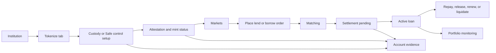

The mockup already suggests most of this. The problem is that several intermediate states are collapsed into one optimistic state. In Triora, those intermediate states are not UX clutter; they are the product.

## What Works Well

The four-screen structure is right. `Tokenize` explains setup, `Markets` handles intent, `Portfolio` handles lifecycle monitoring, and `Account` gives the institutional identity layer somewhere to live.

The UI also makes a good product call by separating lender USDC tokenization from borrower collateral tokenization. cUSDC is conceptually different from cBTC or cETH, and the mockup at least starts to communicate that.

The custom-rate order modal is useful. Institutions will expect to choose rate, amount, tenor, fill mode, and whether they want a single counterparty or partial fills.

The AMINA branding is visible in the right places. The mockup repeatedly says that AMINA screens, approves, co-signs, and operates under its license. That is directionally correct.

## Sketchy, Off, Or Plain Wrong

### 1. "Chainlink mints" is technically wrong

The mockup says:

- "Chainlink mints cBTC / cETH 1:1"
- "Chainlink mints cUSDC 1:1"
- "Chainlink CRE confirms ... and mints"

That wording is not technically sound. Chainlink CRE can observe, compute, report, and trigger a receiver workflow, but it should not be presented as the issuer or minter. The token contract mints only after the protocol verifies a valid report, custody state, AMINA approval, and the relevant reserve/control evidence.

Better wording:

| Current copy | Safer copy |
| --- | --- |
| Chainlink mints cBTC / cETH 1:1 | Triora mints cBTC/cETH after a verified Chainlink report and AMINA custody approval |
| Chainlink mints cUSDC 1:1 | Triora records reserved cUSDC after AMINA-controlled USDC reserve evidence is verified |
| Chainlink CRE confirms and mints | Chainlink CRE delivers an attestation report; Triora's receiver validates it before minting or reserving |

Correct mental model:

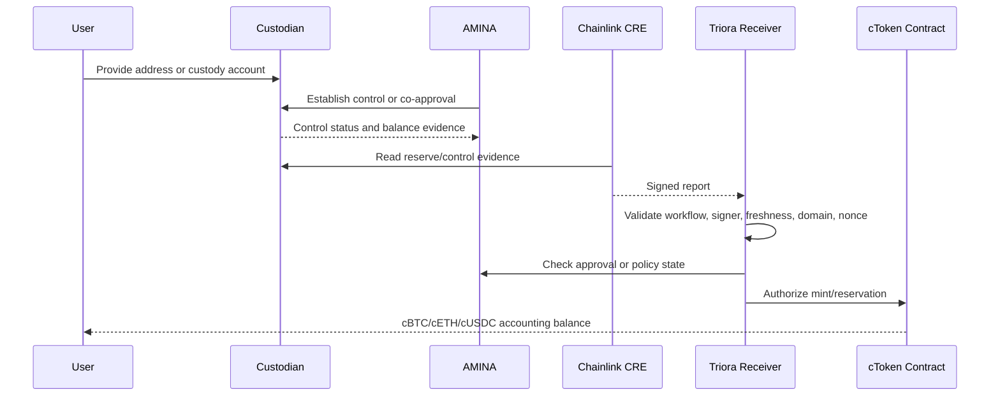

### 2. "Standard ERC-20" and "Aave / Morpho" are unsafe claims

The mockup says that cASSET is a standard ERC-20 and can be used natively in Aave or Morpho. That is almost certainly wrong for the first production version.

These tokens represent restricted, custody-backed claims or accounting rights. They should have transfer restrictions, pledge binding, compliance checks, and perhaps holder allowlists. Public money markets will not safely accept them just because they implement ERC-20 methods.

Better framing:

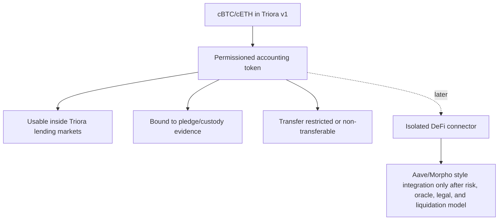

Recommended copy:

> cBTC/cETH are restricted Triora collateral tokens. They are usable inside approved Triora markets. External DeFi integrations require a separate connector and risk approval.

### 3. Safe mode is presented as too equivalent to custodian mode

The mockup offers two sources:

- Qualified custodian
- Smart account (Safe), described as "on-chain co-signer" and "self-serve"

The UI does mention that Safe enforcement is not the same as a custodian control agreement, which is good. But the screen still makes the two paths feel close to equivalent. For a tri-party repo-like product, they are not equivalent.

Custodian control agreement:

- Legal control framework.
- Bankruptcy-remoteness argument can be designed.
- Custodian can participate in settlement and liquidation.
- AMINA can evidence regulated control.

Safe co-signer:

- Onchain transaction policy.
- Depends on Safe configuration, guard correctness, chain availability, and signer set.
- May not create the same legal control or security interest.
- Could be acceptable for sandbox, crypto-native collateral, or lower-assurance mode, but not as the default institutional path.

Recommended UI treatment:

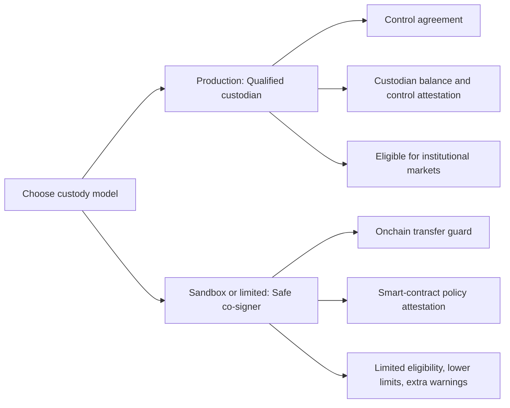

### 4. SOL support looks premature

The mockup includes BTC, ETH, and SOL. BTC and ETH are plausible first collateral assets for an EVM-based accounting and Chainlink-reported system. SOL introduces a different custody, chain, oracle, and verification path.

If SOL is a future roadmap asset, it should be marked as "coming later" or hidden. Including it beside BTC and ETH implies the same implementation path, which is likely false.

Recommended v1 scope:

| Asset | Mockup treatment | Recommended treatment |
| --- | --- | --- |
| BTC | Active collateral | OK, if custody evidence and oracle path are explicit |
| ETH | Active collateral | OK, if custody evidence and oracle path are explicit |
| SOL | Active collateral | Move to roadmap or pilot-only |
| USDC | Lender reserve | OK, but must show reserve and settlement status separately |

### 5. "Matched" becomes "active" too early

The order flow currently simulates matching, then moves the position to `active` with a toast saying AMINA co-signed. That skips the most important state: settlement pending.

For Triora, the lifecycle should be:

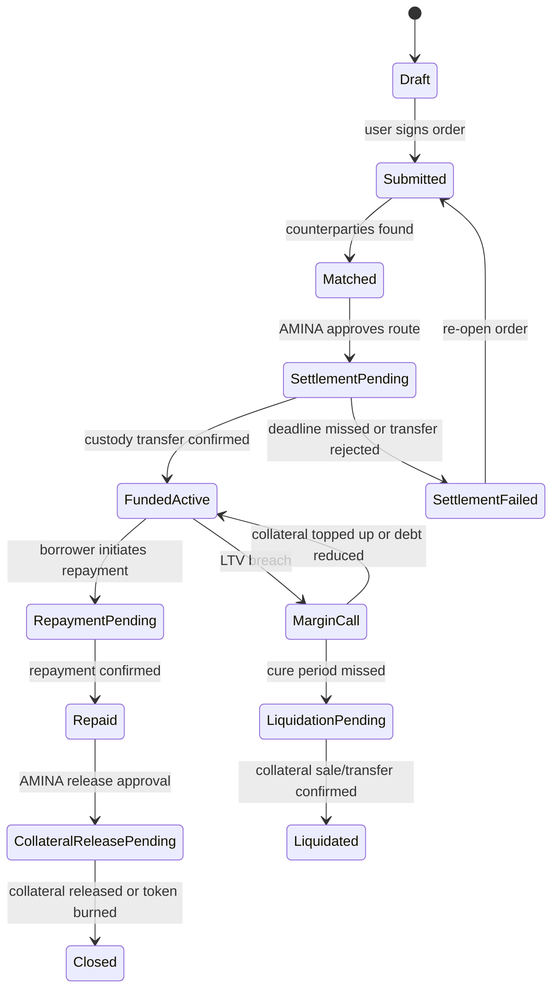

The UI should make "active" mean interest accrual has started and custody settlement is complete. "Matched" should mean economic intent is paired but not yet funded.

### 6. cUSDC is a reservation, but the order flow treats it like instantly deployed cash

The mockup correctly says cUSDC is a reservation, not a transfer. Then the order flow immediately commits reserved cUSDC and later marks the loan active.

That needs more nuance. cUSDC should represent reserved lender liquidity under AMINA/custody control. A matched lend order should lock that reservation, then move through settlement. Real USDC moves only when the settlement transfer is confirmed.

Recommended cUSDC states:

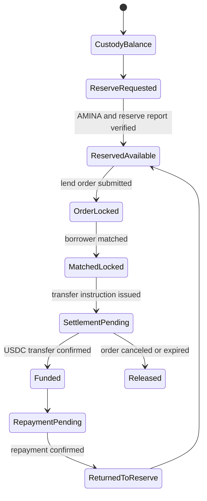

### 7. Health factor math is inconsistent

The UI shows:

- Maximum LTV: 70%
- Liquidation: 80%
- Health factor: "liquidation at 1.00"
- Computed health factor appears to use `MAX_LTV / currentLTV`

That means a borrower at 70% LTV shows health factor 1.00, even though liquidation is supposed to occur at 80%. If liquidation is at 80%, health factor should probably be `LIQ / currentLTV`, so health factor equals 1.00 at 80% LTV.

Recommended display:

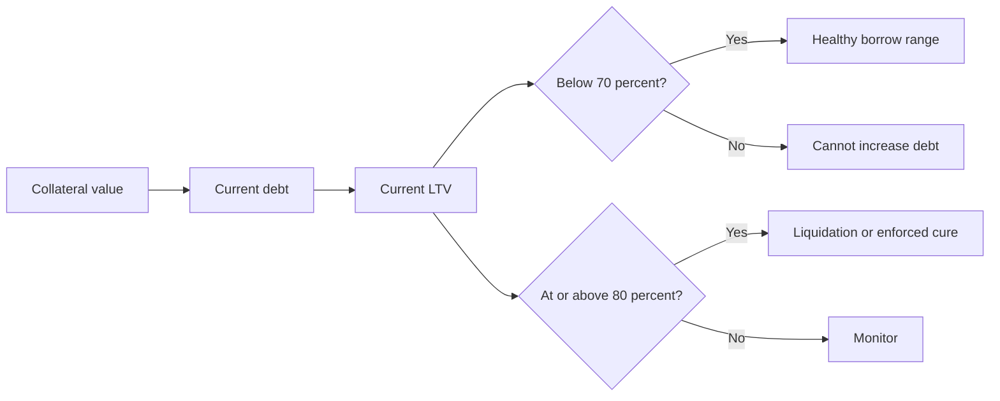

Suggested labels:

- Borrow limit: 70% LTV.
- Liquidation threshold: 80% LTV.
- Health factor: `80% / current LTV`.
- At 70% LTV, HF = 1.14.
- At 80% LTV, HF = 1.00.

### 8. Markets are visually nice but semantically ambiguous

The market rows show "USDC" with sublabels like "Bitcoin-backed market." That is readable, but it hides the two-sided nature of the market.

Better labels:

| Current | Better |
| --- | --- |
| USDC / Bitcoin-backed market | Borrow USDC against cBTC |
| Lend 7.2% | Lend USDC to cBTC borrowers |
| Borrow 8.9% | Borrow USDC using cBTC collateral |
| Total liquidity | Available lender reserve or total market capacity, specify which |

Proposed market row anatomy:

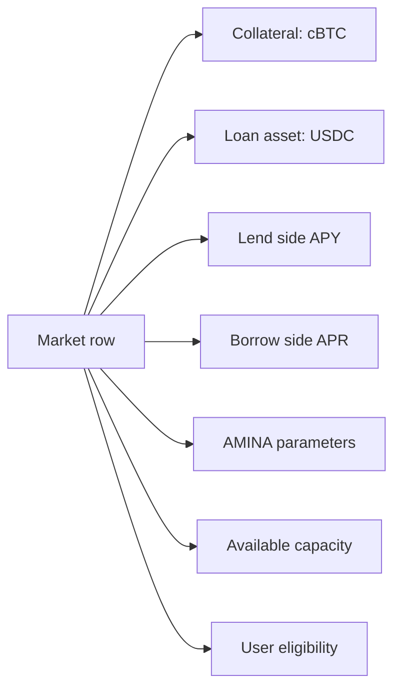

### 9. Liquidation and margin calls are missing

The portfolio has a health factor, but the UI does not show:

- Margin call state.
- Cure deadline.
- Top-up collateral flow.
- Partial repayment flow.
- Liquidation pending.
- Liquidated history.
- Which actor can initiate liquidation.
- Whether AMINA, custodian, or protocol executes the liquidation.

This is a major omission because custody-backed lending is operationally defined by what happens when a borrower is unhealthy.

Recommended lifecycle:

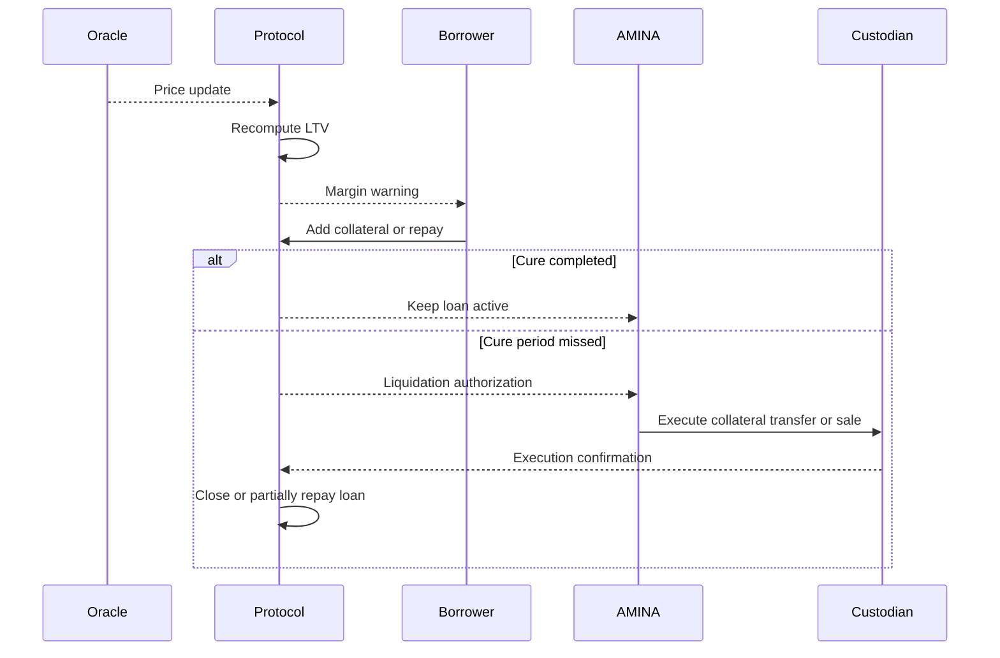

### 10. "Withdraw" on an active lender position is misleading

The position modal shows `Withdraw` for a lending position. If the loan is active and funded, the lender cannot simply withdraw principal unless:

- The borrower repays.
- There is a secondary market.
- The loan is callable.
- The position is still only reserved/matched but unfunded.

Use different actions by state:

| State | Correct lender action |
| --- | --- |
| ReservedAvailable | Release reservation |
| OrderSubmitted | Cancel order |
| Matched, not settled | Cancel if settlement deadline expires |
| FundedActive | View repayment schedule, sell/assign if supported, or wait |
| Repaid | Withdraw returned USDC or keep reserved |

### 11. The account screen needs more proof, not just balances

The Account view should become the evidence hub. Institutional users need to know what each balance is backed by.

Add fields such as:

- Entity legal name and AMINA client ID.
- Custody account ID or hashed custody agreement ID.
- Control agreement status.
- Pledge ID.
- Chainlink workflow ID and latest report timestamp.
- Report freshness.
- Reserve ratio.
- Token contract address.
- Transfer restriction policy.
- Settlement route.
- AMINA approval state.

Evidence model:

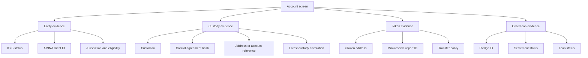

### 12. Privacy and counterparty display need clarification

The order matching UI shows named counterparties such as institutional treasury names. The earlier Triora vision implies privacy and AMINA-verified counterparties. The UI should decide whether counterparties are disclosed, pseudonymized, or only revealed in legal confirmations.

Safer default:

- During matching: "AMINA-verified counterparty #1."
- During settlement: reveal legal entity if required by contract.
- In export/audit view: show full legal counterparty and agreement IDs.

## Recommended Screen Corrections

### Tokenize

Tokenize is the most important screen and the closest to correct. It needs stronger precision.

Recommended changes:

- Split "Qualified custodian" and "Safe co-signer" into different assurance tiers.
- Remove active SOL support or mark it as pilot/roadmap.
- Replace "Chainlink mints" with "Triora mints after verified report."
- Show a token restriction notice.
- Add report freshness and control agreement status.
- Add a "proof drawer" for each tokenized balance.
- Add "Mint pending" and "AMINA approval pending" states.

Proposed tokenization states:

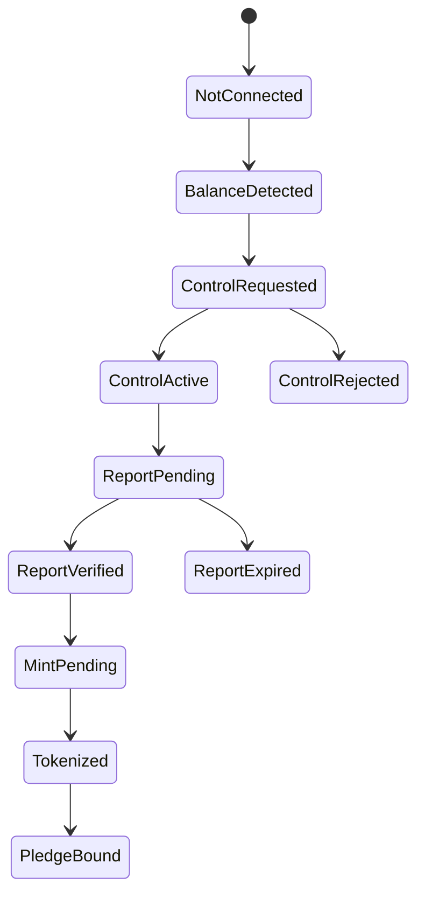

### Markets

Markets should speak in market pairs and eligibility.

Recommended changes:

- Rename rows around the loan asset and collateral asset.
- Show "You can borrow up to X against cBTC" and "You can lend up to Y reserved cUSDC."
- Show whether capacity is real available liquidity, displayed market depth, or simulated total liquidity.
- Add AMINA parameter chips: max LTV, liquidation threshold, tenor range, settlement deadline.
- Add an eligibility badge: `Ready`, `Needs tokenization`, `Settlement disabled`, `AMINA review required`.

Market readiness model:

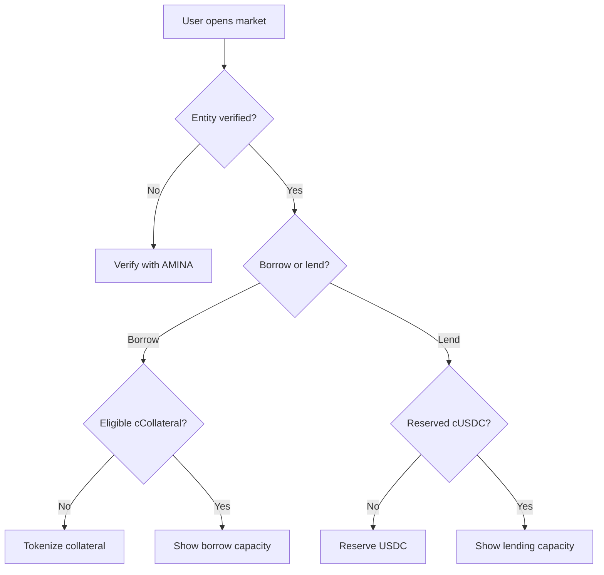

### Order Modal

The order modal should add a review step before submission.

Recommended review fields:

- Side: lend or borrow.
- Market: USDC/cBTC, USDC/cETH.
- Amount.
- Rate and tenor.
- Fill mode.
- Borrow limit and liquidation threshold.
- Pledge ID or cUSDC reserve ID.
- Settlement route.
- Settlement deadline.
- Interest start condition.
- Legal terms hash.

Order submission should produce "Submitted", not "Active".

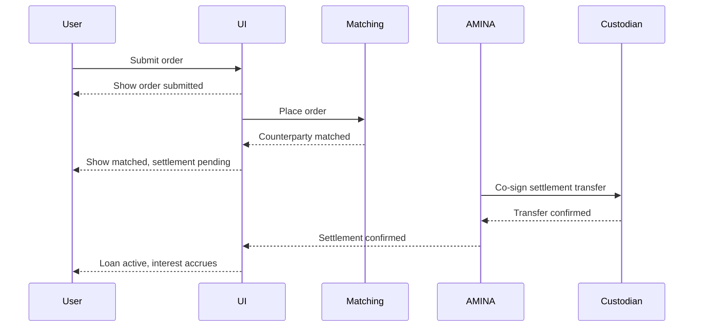

### Portfolio

Portfolio should be the lifecycle console.

Recommended changes:

- Separate positions by state: pending, active, warning, closed.
- Add margin call and cure deadline UI.
- Add settlement-pending rows.
- Remove or rename `Withdraw` on active lender loans.
- Add "Release reservation" only for unfunded lender reservations.
- Add "Repay" as two-step: initiate repayment, then wait for confirmation and release.

Position state grouping:

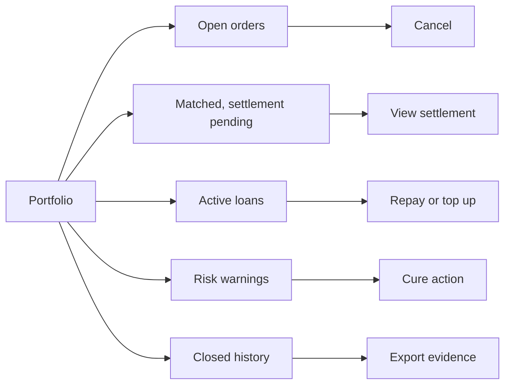

### Account

Account should be more than identity plus balances. It should become the source of truth for institutional evidence.

Recommended changes:

- Add "Agreements" section.
- Add "Attestations" section.
- Add "Connected addresses" with custody mode and assurance tier.
- Add "Token policies" for transfer restrictions.
- Add "Audit export" for compliance, AMINA, and counterparties.

## Suggested Copy Replacements

| Location | Current direction | Problem | Replacement |
| --- | --- | --- | --- |
| Tokenize collateral | Chainlink mints cBTC/cETH | Makes Chainlink look like issuer/minter | Triora mints cBTC/cETH after AMINA control and a verified Chainlink report |
| Tokenize USDC | Chainlink mints cUSDC | cUSDC is a reserve claim, not simple minted cash | Triora records reserved cUSDC after reserve evidence is verified |
| Tokenize collateral | Standard ERC-20, Aave/Morpho | Overstates composability and ignores transfer restrictions | Restricted collateral token usable in approved Triora markets |
| Safe mode | Fully self-serve | Understates legal/control gap | Smart-account pilot mode with lower assurance and market limits |
| Markets | USDC Bitcoin-backed market | Ambiguous side/collateral relationship | Borrow USDC against cBTC / Lend USDC to cBTC borrowers |
| Matching toast | Order matched, AMINA co-signed | Implies active funded loan | Order matched. Settlement pending AMINA and custodian confirmation |
| Portfolio lend action | Withdraw | Wrong for funded loans | Cancel order, release reservation, or view repayment depending state |
| Health factor | Liquidation at 1.00 | Math does not match 70/80 thresholds | Use liquidation threshold divided by current LTV |

## Proposed Technical UI Model

The UI should be driven by explicit domain objects instead of a single simulated balance.

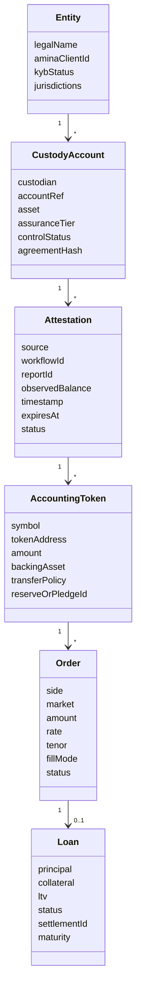

The screen state should come from these objects:

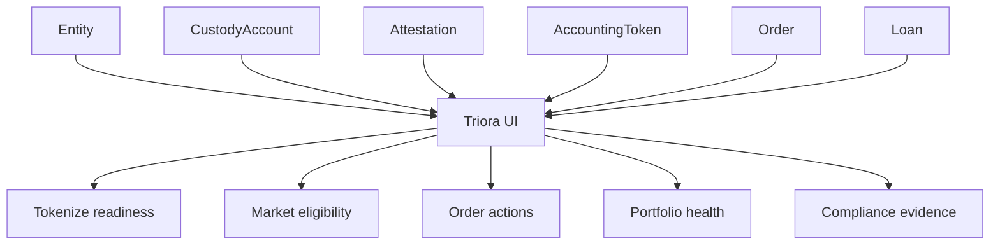

## Minimum Status Taxonomy

The mockup needs more states before it can be considered production-representative.

| Object | Required statuses |
| --- | --- |
| Entity | unverified, submitted, verified, rejected, suspended |
| Custody control | not_connected, balance_detected, control_requested, control_active, control_rejected, expired |
| Attestation | pending, valid, stale, disputed, failed |
| cCollateral | mint_pending, active, pledge_bound, release_pending, burned |
| cUSDC | reserve_pending, available, order_locked, settlement_pending, funded, returned, released |
| Order | draft, submitted, matching, partially_matched, matched, expired, canceled |
| Loan | settlement_pending, active, margin_warning, margin_call, repayment_pending, release_pending, closed, liquidated |

Status mapping:

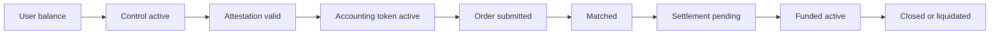

## UI Verdict By Area

| Area | Verdict | Notes |
| --- | --- | --- |
| Navigation | Good | Four core areas are right for the product |
| Visual design | Good enough | Enterprise style is calm and usable |
| Tokenize flow | Promising but risky | Needs legally precise custody and mint language |
| Markets | Good skeleton | Needs clearer market semantics and eligibility |
| Order modal | Useful | Needs settlement-pending and legal review step |
| Portfolio | Incomplete | Needs margin, settlement, repayment, and liquidation lifecycle |
| Account | Too thin | Should become evidence and agreements hub |
| Technical accuracy | Needs correction | Chainlink, ERC-20 composability, Safe equivalence, and health factor are off |

## Implementation Acceptance Checklist

Before treating this mockup as a production direction, I would require:

- No UI copy says Chainlink mints or issues tokens.
- cTokens are described as restricted accounting/collateral tokens.
- Safe mode is visibly lower-assurance or marked as sandbox/pilot.
- SOL is removed from v1 or clearly marked future/pilot.
- Matching and settlement are separate states.
- Active loan begins only after settlement confirmation.
- cUSDC has reserve, locked, settlement pending, funded, returned, and released states.
- Health factor equals 1.00 at the liquidation threshold, not at max borrow LTV.
- Portfolio supports margin calls, cure periods, top-ups, repayment confirmation, collateral release, and liquidation.
- Account screen exposes custody/control evidence and attestation freshness.
- Lender actions are state-dependent; no "Withdraw" for active funded principal.
- Order review includes legal terms hash, pledge/reserve ID, settlement deadline, and AMINA approval status.

## Final Recommendation

Keep the UI skeleton. It is a credible starting point for Triora and is much closer to an actual institutional tool than a generic DeFi dashboard.

But revise the model language before sharing it as a system description. Right now, the mockup blurs several boundaries that matter deeply:

- oracle/reporting vs issuance,
- custody control vs smart-contract co-signing,
- reserved liquidity vs transferred liquidity,
- matched intent vs funded loan,
- accounting token vs freely composable ERC-20,
- max borrow LTV vs liquidation threshold.

Those are not small copy edits. They are the safety rails of the product. If the mockup makes them explicit, the UI can work very well for Triora. If it keeps collapsing them into "mint, lend, matched, active," it will overpromise the architecture and create regulatory, legal, and technical ambiguity.
