# Triora Review

**Scope:** technical feasibility, soundness review, target architecture, and implementation details for `Triora.html`.

**Reviewed local materials:**

- `docs/Triora.html`
- `docs/Features-TLDR.md`
- `docs/High-level-tokenization-architecture.md`
- `docs/Revised-tokenization-architecture.md`
- `docs/PoR-implementation-plan.md`
- `docs/P2PxAmina-lending-protocol-for-banks-Implementation-Plan.md`
- `docs/Claude-architechture-3.md`
- current Solidity implementation under `src/`
- Chainlink CRE corpus under `Taurus/Chainlink-RE`
- Chainlink PoR / SmartData / SecureMint corpus under `Taurus/Chainlink-PoR`
- Kiln Railnet CRE research note under `Taurus/Kiln-Railnet/Railnet-CRE.md`

## Executive Verdict

Triora is feasible and technically coherent if it is framed as a **regulated, custody-backed tri-party repo rail with onchain accounting and Chainlink-assisted attestations**.

It is not technically sound if interpreted as "Chainlink magically issues all tokens and guarantees custody/release." The sound version is more precise:

- AMINA owns regulated brokerage, KYB, rates, LTV, collateral-agent duties, liquidation decisions, and required custody co-signing.
- P2P owns software, matching UI, smart contracts, event logs, monitoring, and integration risk, but not balance-sheet credit decisions.
- Custodians hold real BTC/ETH/USDC/RWA assets in segregated accounts and enforce AMINA-mandatory control policies.
- Chainlink CRE can orchestrate verification workflows and deliver signed reports to an onchain receiver.
- Chainlink PoR / SmartData can prove reserve quantity, but it does not prove exclusive control, non-rehypothecation, or legal enforceability.
- The token contracts, reserve guard, pledge registry, and release authorizer must enforce the onchain side of the model.

My recommendation: build v1 as **BTC or ETH collateral, one custodian, one supply asset, no loan-position re-pledging, no public DeFi connector**. Add CRE, PoR, and loan-token composability after the custody-voucher loop is proven in a small AMINA-operated pilot.

```mermaid
flowchart TB
    Vision["Triora vision"]
    Feasible["Feasible v1"]
    Risky["Defer / constrain"]
    Unsafe["Needs rewording"]

    Vision --> Feasible
    Vision --> Risky
    Vision --> Unsafe

    Feasible --> F1["Tri-party custody lock"]
    Feasible --> F2["Permissioned bilateral repo"]
    Feasible --> F3["Pledge-bound collateral token"]
    Feasible --> F4["PoR-backed reserve guard"]
    Feasible --> F5["AMINA co-signed settlement"]

    Risky --> R1["Loan-position token resale"]
    Risky --> R2["Re-pledging / looping"]
    Risky --> R3["Aave / Morpho connector"]
    Risky --> R4["Multi-custodian launch"]

    Unsafe --> U1["Chainlink is the legal token issuer"]
    Unsafe --> U2["PoR proves custody control"]
    Unsafe --> U3["Instant liquidation guaranteed"]
    Unsafe --> U4["P2P has no risk at all"]
```

## What Triora Gets Right

Triora's strongest idea is the **ledger/custody split**. The smart contracts should not hold real client BTC or real client USDC. They should hold restricted accounting instruments and publish a tamper-evident state machine. The real asset movement happens in custody under AMINA's mandatory co-signature.

That matches the strongest prior P2PxAmina iterations:

- bilateral, fixed-term repo instead of pooled lending;
- immutable deal terms;
- AMINA as single licensed curator/liquidator;
- token admission checks and exact-transfer vault accounting;
- snapshotted risk parameters;
- Chainlink price feeds for valuation;
- AMINA-signed dual-price attestations for liquidation;
- append-only settlement events for custody listeners.

The existing Solidity prototype already supports much of the bilateral repo rail:

| Area | Current status | Triora gap |
|---|---|---|
| KYB and permissions | `KYBGateway`, `RoleManager`, `ComplianceRegistry` | Need custody-account identity refs and AMINA approval evidence |
| Token admission | `IssuerRegistry` exact-transfer checks, token kind, caps | Need tokenization configs, reserve sources, pledge-bound token rules |
| Deal engine | `LendingEngine.openAndActivate`, immutable `DealRegistry` | Need `DealIntentV2` with `pledgeId` and custody account refs |
| Escrow accounting | immutable `EscrowVault`, exact pulls, non-reverting release | Need voucher-gated burn/release for externally backed collateral |
| Risk params | `CollateralRegistry` + `ParameterArchive` snapshots | Need reserve-health and pledge-health inputs |
| Liquidation | AMINA-only handler, signed price attestations | Need custody release voucher to AMINA desk and surplus handling |
| Settlement events | immutable `SettlementRouter` with sequence numbers | Need `SettlementRouterV2` with pledge/voucher/release ack fields |

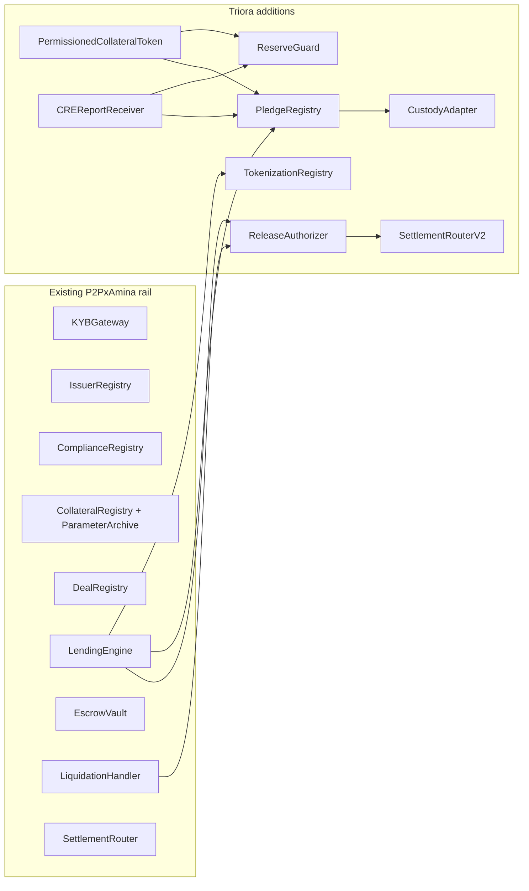

## Main Feasibility Assessment

| Component | Feasibility | Assessment |
|---|---:|---|
| Regulated bilateral repo rail | High | The existing contract design is a good base. The product maps cleanly to tri-party repo if AMINA is the licensed decision maker. |
| Custody-backed BTC/ETH collateral token | Medium-high | Feasible with Fireblocks/BitGo/Fordefi-style policy engines and AMINA-mandatory control. Must not rely on PoR alone. |
| Chainlink PoR reserve guard | High | SmartData/PoR feeds and SecureMint semantics fit the mint-limit problem well. Use `min(ChainlinkPoR, custodianAttestation)`. |
| CRE orchestration | Medium | Technically a good fit for event-driven attestation and report delivery, but CRE is Early Access and consumer validation is critical. |
| Chainlink as token issuer | Low unless contractually agreed | Safer framing: Chainlink CRE verifies and reports; a governed token contract mints after validating report provenance. |
| cUSDC supply-token settlement | Medium | Feasible, but only if custody reservation, settlement ack, and failure states are explicit. "Accounting token has no value" conflicts with using it as lender protection. |
| Loan-position token | Medium but v2+ | Technically possible, but introduces secondary-market, transfer-restriction, accounting, and cascading-liquidation risk. |
| Aave/Morpho connector | Low for v1 | Public DeFi protocols will not naturally accept a permissioned custody claim with AMINA-only liquidation. Needs isolated vault/market design. |
| "Instant liquidation without court" | Legally sensitive | Better wording: deterministic by contract and custody rules absent sanctions freeze, custody outage, insolvency stay, or legal restriction. |

## Critical Wording Changes

The Triora vision is directionally right, but several phrases should be tightened before being shown to lawyers, Chainlink, custodians, or AMINA risk.

| Current idea | Better technical wording |
|---|---|
| "Chainlink issues the token" | "A token contract mints only after a Chainlink CRE/PoR report and custody/AMINA attestations pass. Chainlink is the report/orchestration layer unless Chainlink explicitly agrees to be legal issuer." |
| "PoR confirms reserve presence and amount" | "PoR confirms reported reserve quantity. Custody lock and AMINA control agreement confirm exclusive control and release rights." |
| "Funds never touch the smart contract" | "Real custody assets do not touch the smart contract. Restricted accounting tokens or claim tokens may be held by the contract." |
| "AMINA cannot block a repaid borrower" | "A repaid borrower gets a state-derived release voucher. Custody release may still be delayed by sanctions, freeze, custody outage, or insolvency process." |
| "Supply token has no value in itself" | "Supply token is an accounting/reservation claim. Its economic effect comes from custody agreement, AMINA co-signature, and settlement finality." |
| "Collateral token can be used in Aave/Morpho" | "A DeFi connector may be built as a later isolated integration. Native Aave/Morpho acceptance is not a v1 assumption." |

## Target System Architecture

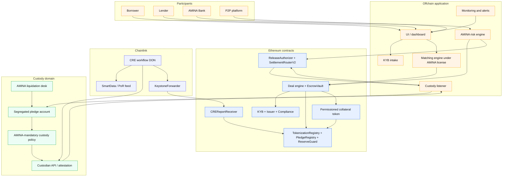

## Responsibility Model

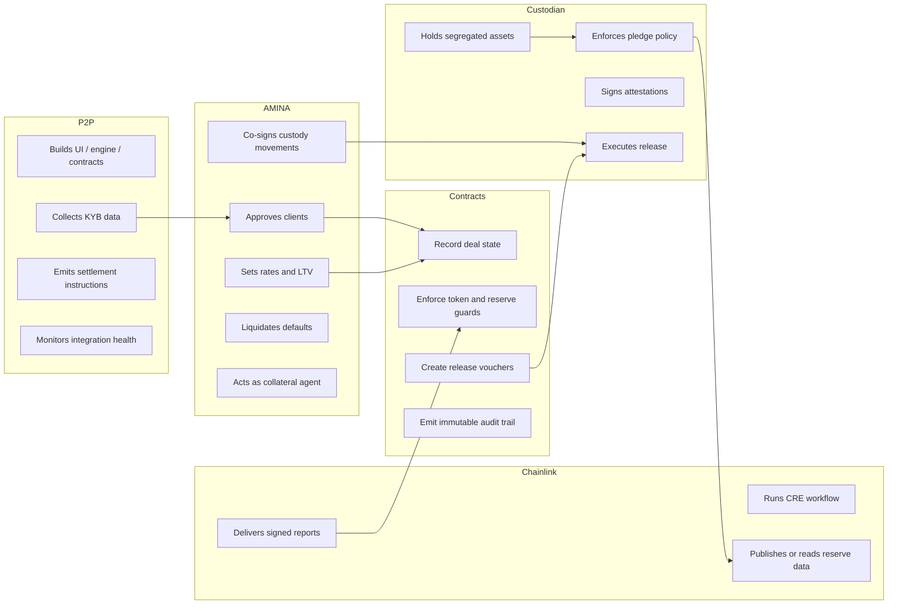

## Chainlink CRE Integration

CRE is useful here, but the security boundary is the receiver contract. The local CRE review found that:

- CRE workflows are stateless WASM callbacks.
- Workflow identity is content-derived from owner, name, binary, config, and secrets URL.
- KeystoneForwarder validates a DON report and calls `onReport`.
- Forwarder signatures are not intrinsically chain-domain separated.
- Consumer contracts must validate the exact forwarder, full workflow ID and/or owner, freshness, ordering, payload domain, and idempotency.
- CRE is Early Access; SDK, CLI, limits, addresses, and operating policy can change.

## Railnet Lesson For Triora

The Railnet/Kiln CRE research note is a useful warning. Railnet publicly announced a CRE-powered OmniVault architecture, and the intended design is credible, but public artifacts did not independently prove that every current deployment was already wired to a CRE receiver. The public docs still described a Python keeper path, the Lagoon vault source remained integration-agnostic, and the reviewed production metadata did not expose a clear CRE receiver as valuation manager.

Triora should avoid the same ambiguity. If the product says "CRE powers issuance / PoR / settlement," publish deployment-level evidence:

- workflow ID, owner, version, DON family, and config hash;
- receiver contract source and address;
- KeystoneForwarder address per chain;
- authorized workflow IDs in the receiver;
- representative report-delivery transactions;
- role assignments showing the receiver can update reserve or pledge state;
- failure runbooks for stale reports, failed delivery, replay, and migration.

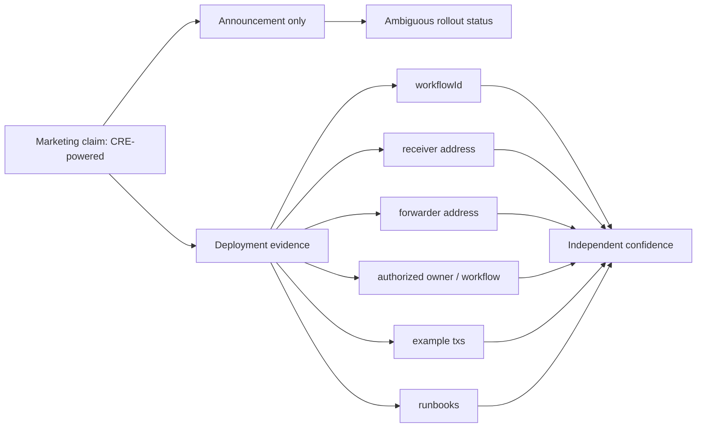

### Recommended CRE Report Path

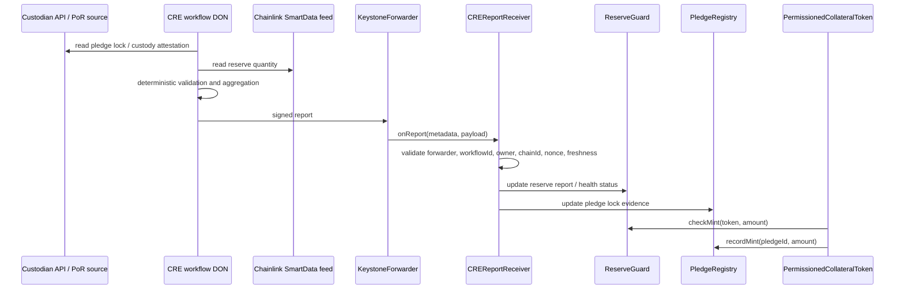

### CRE Receiver Requirements

The receiver should fail closed unless all of the following hold:

1. `msg.sender == expectedKeystoneForwarder[block.chainid]`.
2. Metadata includes the expected full `workflowId` and/or expected owner.
3. Payload includes `chainId` or Chainlink chain selector and it equals the current chain.
4. Payload includes `reportType`, `token`, `pledgeId`, `sequence`, `asOf`, `expiresAt`, and bounded numeric fields.
5. `sequence` is strictly increasing per `(reportType, token or pledgeId)`.
6. `asOf` and `expiresAt` satisfy freshness windows.
7. The report cannot be replayed after a failed partial state transition.
8. The receiver never authorizes based only on the 10-byte workflow-name hash prefix.
9. The payload is domain-separated from testnet/staging reports.

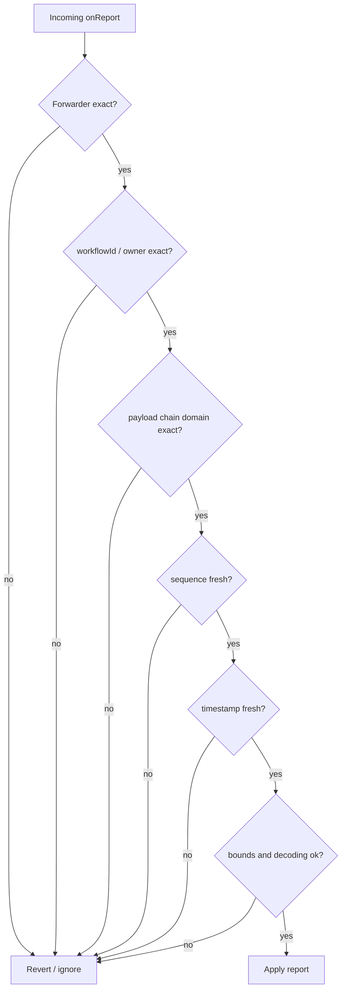

## Proof of Reserve and ReserveGuard

The Chainlink PoR corpus supports a clear implementation choice: build a P2PxAmina-native `ReserveGuard` using `AggregatorV3Interface` and SecureMint semantics, rather than importing the whole ACE policy engine for v1.

Reserve guard formula:

```text
supplyAfterMint <= effectiveReserveLimit(token)

effectiveReserveLimit(token) =
    min(freshChainlinkPoR, freshCustodianAttestation) - positiveReserveMargin
```

If Chainlink PoR is unavailable for the exact custody address set:

```text
effectiveReserveLimit(token) =
    freshCustodianAttestation - positiveReserveMargin
```

That fallback should be explicitly marked lower assurance and only used for a limited pilot.

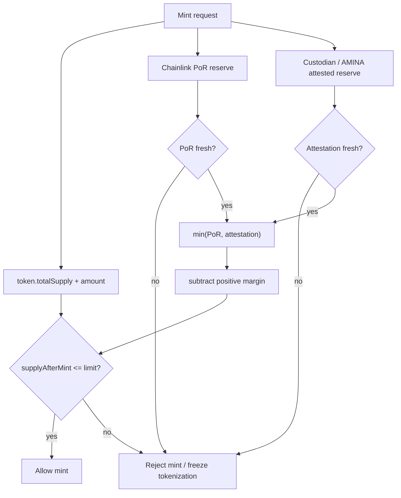

Implementation details:

- Use a dedicated reserve feed config, separate from USD price oracle config.
- Reject `answer <= 0`.
- Reject stale `updatedAt`.
- Check `answeredInRound >= roundId` unless a documented feed-specific exception exists.
- Scale reserve decimals to token decimals, never to USD price decimals.
- Support only positive reserve margins in v1: `None`, `PositivePercentage`, `PositiveAbsolute`.
- Disable negative margins. They intentionally permit under-backed supply and are wrong for custody-backed repo collateral.
- Use the lower of Chainlink and custodian reserve values. If discrepancy exceeds a configured threshold, pause new mints and new deals.

## Custody and Pledge Architecture

PoR proves reported quantity. It does not prove that the borrower cannot withdraw the asset, that AMINA has a perfected security interest, or that collateral survives custodian insolvency. Those properties come from the custody agreement, segregated account, AMINA-mandatory signing policy, and release voucher.

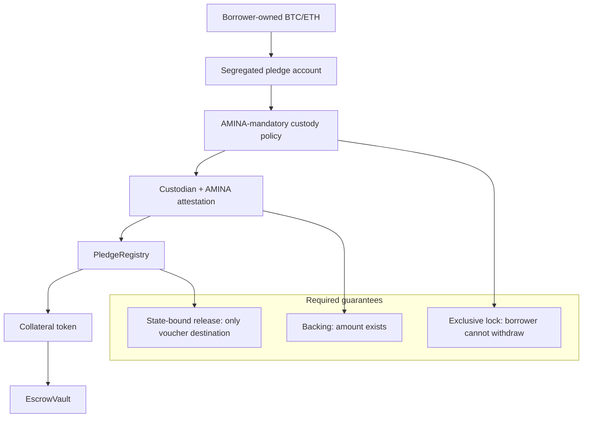

### Pledge State Machine

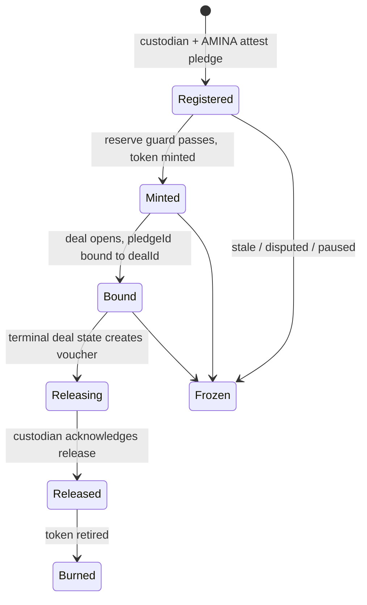

Pledge invariants:

```text
pledge.mintedAmount <= pledge.pledgedAmount
pledge.boundAmount <= pledge.mintedAmount
pledge.dealId == dealId for active deals
pledge.status == Bound for active deals
custodyAdapter.isLockActive(pledgeId) == true for active deals
released pledges cannot be reminted or rebound
```

## Deal Lifecycle

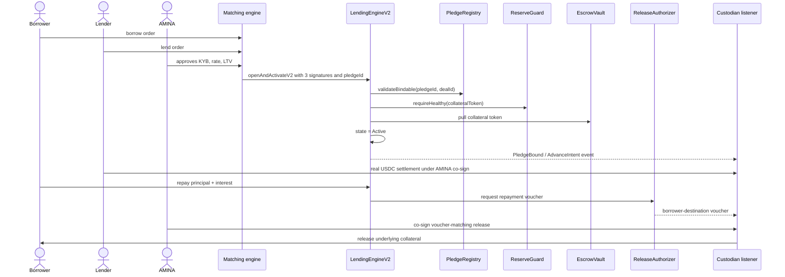

### Deal State Machine

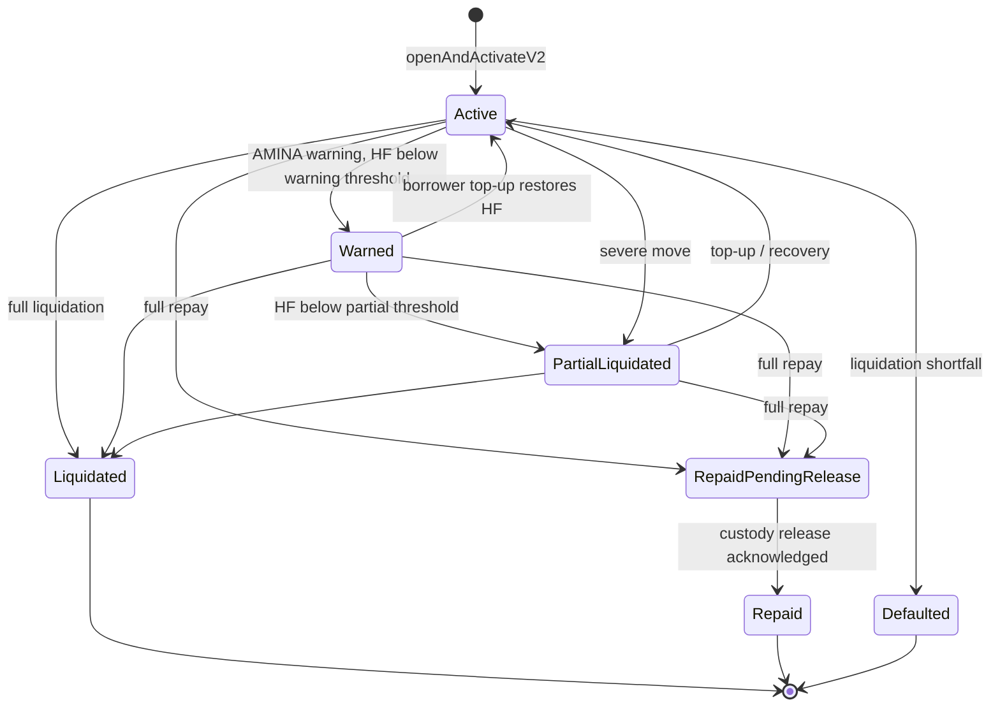

For custody-backed collateral, `Repaid_PendingCollateralRelease` should become the normal state before custody acknowledgment, not only an issuer-freeze recovery edge case.

## Settlement Soundness

Triora's key settlement claim is "money moves once, directly between tri-party addresses, under AMINA co-signature." That is feasible, but the protocol must explicitly model non-atomic external settlement.

Recommended settlement states:

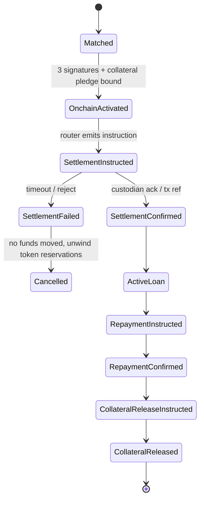

Open design point: the current `LendingEngine.openAndActivate` immediately debits supply tokens to the borrower. If v1 uses real custody USDC outside the contract, the engine should not declare the loan fully active until the custody listener confirms real USDC settlement. Otherwise the borrower could have an active debt before receiving funds, or the lender could hold only an accounting token without real settlement finality.

Two safe patterns:

1. **Onchain-first, pending settlement:** deal enters `Active_PendingDisbursement`; interest starts only after `SettlementConfirmed`.
2. **Custody-first, onchain finalization:** custody pre-reserves both legs; `openAndActivateV2` finalizes only after both reservation proofs are present.

For Triora's "funds move once" story, pattern 1 is simpler and auditable.

## Token Model

### Collateral Token (`cBTC`, `cETH`, later RWA)

The collateral token should be:

- permissioned;
- non-freely-transferable;
- pledge-bound;
- reserve-guarded;
- burn/release-voucher-gated;
- one contract per `(custodian, asset)` or one ERC-3643/CMTAT token with strict series accounting.

Allowed transfer paths:

| From | To | Purpose |
|---|---|---|
| `address(0)` | borrower/protocol mint address | mint after pledge verified |
| borrower | `EscrowVault` | post collateral |
| `EscrowVault` | `ReleaseAuthorizer` / burn path | repay release |
| `EscrowVault` | AMINA liquidation desk / burn path | liquidation |
| allowed holder | `address(0)` | burn |

All other transfers should revert.

### Supply Token (`cUSDC`)

The supply token is more subtle. If real USDC always stays in lender custody until disbursement, `cUSDC` is a reservation claim, not actual cash. It needs:

- custody reservation proof;
- expiration;
- one-use settlement semantics;
- lender cancellation path if unmatched or settlement fails;
- AMINA co-sign requirement for disbursement route;
- clear accounting for when interest starts.

The lender should not accept borrower collateral token solely because AMINA signed an event; it should accept it because custody rules and onchain state ensure the USDC leg and collateral leg are synchronized.

### Loan Position Token

Loan-position tokenization is a real product opportunity, but it should not ship in v1.

Reasons:

- It converts a bilateral repo into a transferable credit instrument.
- It introduces secondary-market transfer restrictions and KYB gating.
- It creates cascading risk if loan positions are re-pledged.
- It requires valuation of loan positions, not just collateral.
- It likely changes AMINA's legal/regulatory posture.

Recommended v1: represent loan positions as non-transferable records in `DealRegistry` and `PortfolioLens`. Add a transferable ERC-3643 loan note later, after counsel signs off.

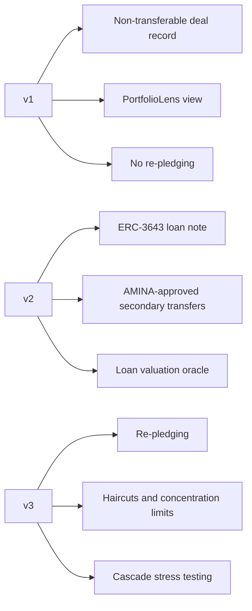

## DeFi Connector Assessment

The idea "collateral token -> borrow from Aave or Morpho" is architecturally attractive but not a natural v1 extension.

Public Aave/Morpho pools need:

- reliable market price;
- permissionless or clearly defined liquidation path;
- asset transferability;
- asset liquidity;
- accepted oracle and risk model;
- no dependency on AMINA as sole real-world liquidator.

Triora collateral tokens have the opposite profile by design: permissioned, custody-claim based, AMINA-controlled, and non-freely-transferable. That does not make DeFi impossible, but it means the first connector should be an **isolated whitelisted Morpho market or custom ERC-4626/7540 vault**, not a generic public pool listing.

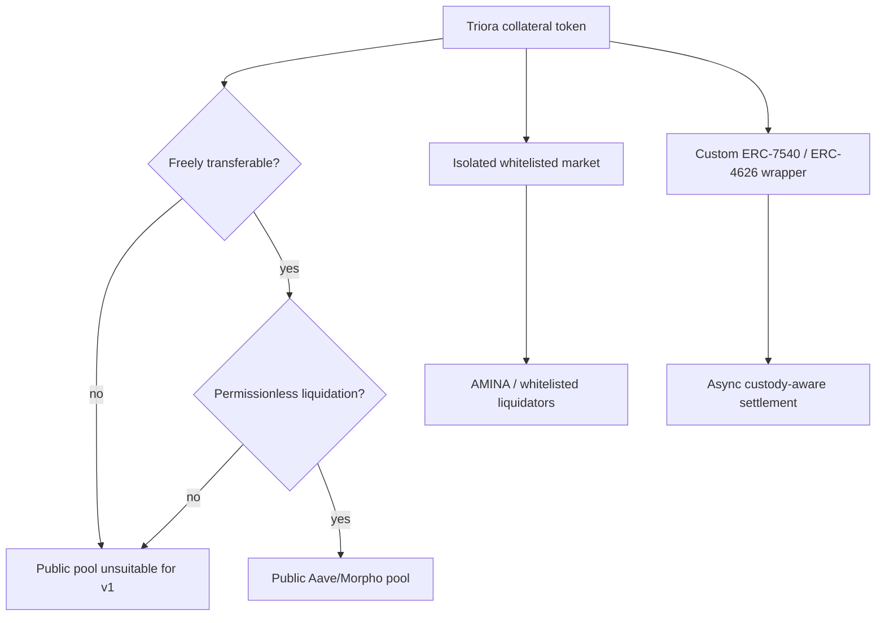

## Contract-Level Implementation Plan

### 1. `TokenizationRegistry`

Stores tokenization config separately from `IssuerRegistry` to avoid storage-layout risk and to keep issuer admission separate from reserve/pledge semantics.

Minimum config:

```solidity
struct TokenizationConfig {
    bool enabled;
    bool pledgeBound;
    address adapter;
    address pledgeRegistry;
    address reserveGuard;
    address releaseAuthorizer;
    address chainlinkPoRFeed;
    uint8 tokenDecimals;
    uint8 reserveDecimals;
    uint64 chainlinkMaxAge;
    uint64 adapterMaxAge;
    ReserveSourceMode sourceMode;
    ReserveMarginMode marginMode;
    uint256 marginAmount;
    uint16 maxDiscrepancyBps;
    bytes32 custodyAgreementHash;
    bytes32 tokenPolicyHash;
    bytes32 reservePolicyHash;
}
```

### 2. `ReserveGuard`

Responsibilities:

- read Chainlink PoR;
- read adapter attestation;
- scale decimals;
- enforce freshness;
- compute `effectiveReserve`;
- reject mints above reserve limit;
- expose `reserveStatus` for dashboards and monitors.

### 3. `PledgeRegistry`

Responsibilities:

- register a pledge after custodian + AMINA evidence;
- track `pledgedAmount`, `mintedAmount`, `boundAmount`;
- bind one pledge to one deal in v1;
- freeze stale/disputed pledges;
- mark release lifecycle;
- prevent remint/rebind after release.

### 4. `PermissionedCollateralToken`

Responsibilities:

- ERC-20 compatibility for existing engine/vault;
- transfer policy;
- mint requires custodian minter + AMINA evidence + `ReserveGuard` + `PledgeRegistry`;
- burn/release path requires `ReleaseAuthorizer` voucher.

Production base: CMTAT allowlist module or ERC-3643/T-REX. Prototype base: minimal permissioned ERC-20, then swap after vendor choice.

### 5. `ReleaseAuthorizer`

Responsibilities:

- derive release destination from deal state;
- never accept arbitrary destination from caller;
- create voucher ref using `chainid`, contract address, deal, pledge, destination, reason, and sequence;
- emit `CollateralReleaseVoucher`;
- track one-use voucher state;
- receive custody acknowledgment.

Voucher:

```solidity
struct ReleaseVoucher {
    bytes32 dealId;
    bytes32 pledgeId;
    address collateralToken;
    bytes32 assetId;
    uint256 amount;
    DestinationType destinationType; // Borrower or AminaDesk
    bytes32 destinationRef;
    bytes32 reason; // REPAID, LIQUIDATED, SURPLUS
    uint64 sequenceNumber;
    uint64 issuedAt;
}
```

### 6. `CREReportReceiver`

Responsibilities:

- implement the CRE receiver interface;
- validate KeystoneForwarder and workflow provenance;
- decode bounded report payloads;
- enforce domain separation and replay protection;
- update `ReserveGuard` / `PledgeRegistry` inputs.

Keep this contract small. It should authenticate and route reports, not implement business logic.

### 7. `SettlementRouterV2`

Do not mutate `SettlementRouter` v1 semantics. Add a new router with pledge-aware events:

```solidity
event PledgeBound(bytes32 indexed dealId, bytes32 indexed pledgeId, address indexed collateralToken, uint256 amount, uint64 sequenceNumber);

event CollateralReleaseVoucher(
    bytes32 indexed dealId,
    bytes32 indexed pledgeId,
    address indexed collateralToken,
    bytes32 assetId,
    uint256 amount,
    uint8 destinationType,
    bytes32 destinationRef,
    bytes32 reason,
    bytes32 voucherRef,
    uint64 sequenceNumber,
    uint64 issuedAt
);

event ReleaseAcknowledged(bytes32 indexed dealId, bytes32 indexed pledgeId, bytes32 indexed voucherRef, bytes32 custodianTxRef, uint64 sequenceNumber);

event ReserveShortfall(address indexed collateralToken, uint256 reserveAmount, uint256 totalSupply, bytes32 reason, uint64 sequenceNumber);
```

## Offchain Components

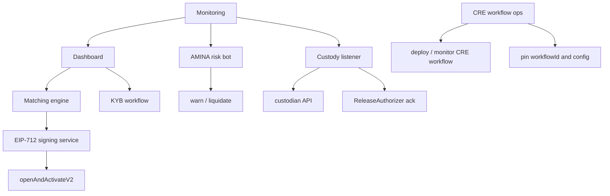

Required services:

- matching engine under AMINA-approved rules;
- AMINA rate/LTV/risk-param publication process;
- KYB intake and evidence hashes;
- custody adapter signer or evidence verifier;
- CRE workflow deployment and version registry;
- custody listener with idempotent event processing;
- monitoring for stale PoR, stale custody attestations, pledge lock changes, reserve shortfall, sequence gaps, and failed releases;
- audit log tying every offchain custody action to an onchain event or voucher.

## Monitoring and Alerts

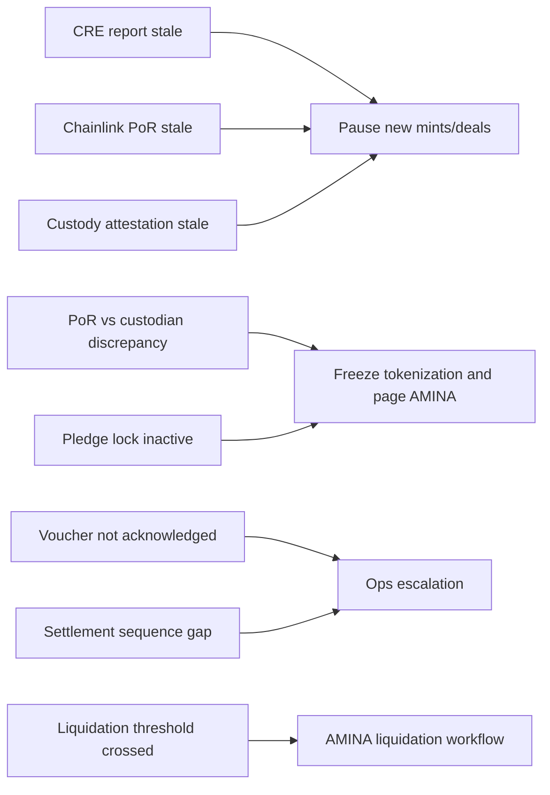

Day-one alerts:

- `token.totalSupply > effectiveReserveLimit`;
- Chainlink PoR stale;
- custodian attestation stale;
- pledge lock inactive for active deal;
- AMINA removed from custody quorum;
- `SettlementRouterV2` sequence gap;
- `CollateralReleaseVoucher` not acknowledged within SLA;
- custody listener offline;
- CRE workflow paused, deleted, unlinked, or config changed;
- KeystoneForwarder signer config changed;
- receiver rejects a valid-looking report.

## Risk Register

| Risk | Severity | Mitigation |
|---|---:|---|
| Chainlink CRE changes or access unavailable | High | Keep adapter-only pilot fallback, pin workflow versions, do not make CRE the sole custody truth until production support is contractually clear. |
| PoR proves quantity but not lock | High | Require AMINA-mandatory custody policy and `PledgeRegistry.isLockActive`. |
| Custodian API/self-report compromised | High | Use Chainlink PoR where available; use min-of-two reserve sources; discrepancy freeze. |
| CRE report replayed cross-chain | High | Payload chain domain and receiver validation. |
| Workflow name collision / weak auth | High | Validate full workflow ID/owner, not name prefix. |
| Lender disbursement not atomic with borrower obligation | High | Add pending-disbursement state and custody settlement confirmation before interest starts. |
| Token transferable outside protocol | High | Both-direction transfer policy tests and allowlist. |
| Loan-position token cascades | High | Defer transferability and re-pledging to v2+. |
| AMINA liquidation delayed | Medium-high | Monitoring, contractual SLA, emergency procedures, honest docs that court-free/instant is not absolute. |
| P2P reclassified as broker | High | UI/legal wording: rates and KYB approvals are AMINA parameters; P2P routes data and software only. |
| Immutable vault bug | High | Keep current audit posture: extensive tests, formal checks, small pilot, legal/custody freeze fallback. |

## Implementation Roadmap

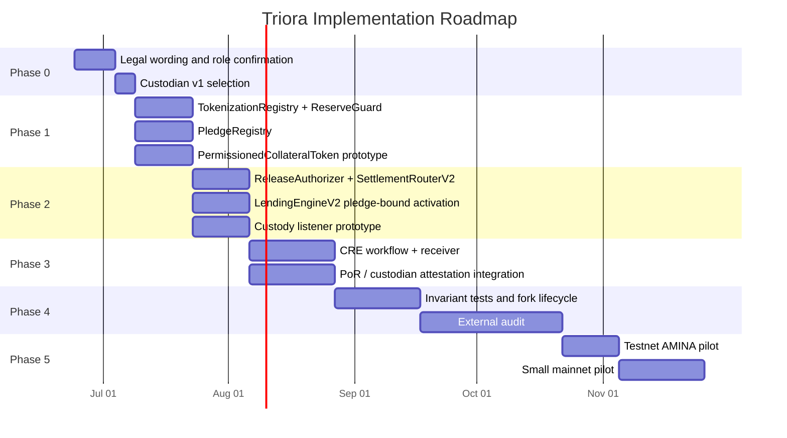

## Build Sequence

Recommended v1 order:

1. Confirm legal/product wording with AMINA and counsel.
2. Choose one custodian first. Fireblocks is the most turnkey; BitGo is strongest for BTC PoR precedent; Copper should be later because it is the non-minter pattern.
3. Add `TokenizationRegistry`, `ReserveGuard`, `PledgeRegistry`, and a minimal `PermissionedCollateralToken`.
4. Add `ReleaseAuthorizer` and `SettlementRouterV2`.
5. Add `DealIntentV2` with `pledgeId`, borrower custody ref, lender custody ref, reserve policy hash, and settlement instructions hash.
6. Add `openAndActivateV2` with pending-disbursement state or explicit settlement confirmation.
7. Add CRE receiver, but keep reserve guard able to operate from signed custody attestations for early pilot.
8. Integrate Chainlink PoR feed where available.
9. Build custody listener and replay-safe acknowledgment flow.
10. Run mainnet-fork lifecycle tests: pledge -> mint -> open -> disburse ack -> repay -> voucher -> custody release ack.
11. Run liquidation lifecycle tests: warn -> partial/full -> voucher to AMINA desk -> surplus handling.
12. External audit with CRE receiver, reserve guard, pledge registry, token transfer policy, and release voucher in scope.

## Test Plan

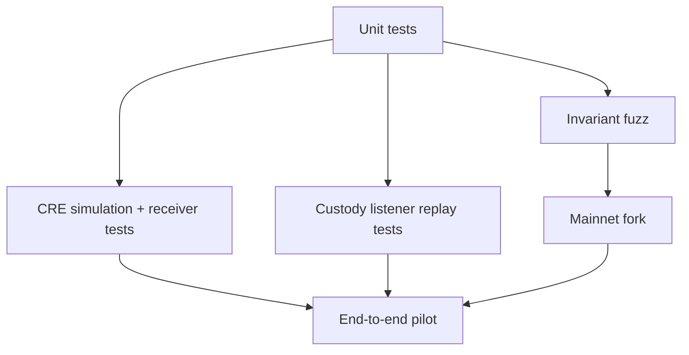

Must-have properties:

- `supplyAfterMint <= effectiveReserveLimit`;
- negative, zero, stale, and discrepant reserves fail closed;
- reserve and price feed configs cannot be mixed;
- `pledge.mintedAmount <= pledge.pledgedAmount`;
- one pledge cannot bind two active deals;
- released pledge cannot be rebound;
- transfer hook checks both `from` and `to`;
- release destination is derived from deal state, not caller input;
- vouchers are one-use and chain-domain separated;
- CRE reports cannot replay across chains, workflows, tokens, or sequence numbers;
- pending disbursement cannot accrue interest before settlement confirmation;
- repay remains possible during pauses unless compliance or sanctions blocks it;
- liquidation cannot seize healthy collateral;
- surplus returns to borrower according to counsel-approved rule.

## Final Recommendation

Build Triora, but ship the **narrow truthful version first**:

- one collateral asset;
- one custodian;
- one supply asset;
- AMINA-approved counterparties only;
- no loan-token transfers;
- no public DeFi connector;
- explicit pending-settlement states;
- CRE and PoR as verification/orchestration layers, not as substitutes for custody agreements;
- clear legal wording that P2P is technology infrastructure with smart-contract and integration risk, not zero risk.

The architecture becomes technically sound when the system is described as:

> A custody-backed repo rail where CRE/PoR reports help prove reserves, AMINA/custodian agreements prove control and release rights, and P2PxAmina contracts enforce the accounting, pledge binding, reserve limits, and release vouchers.

That version is buildable. The current P2PxAmina contracts are a solid base; the remaining work is the tokenization/PoR/CRE/custody-release layer and the operational discipline around it.
