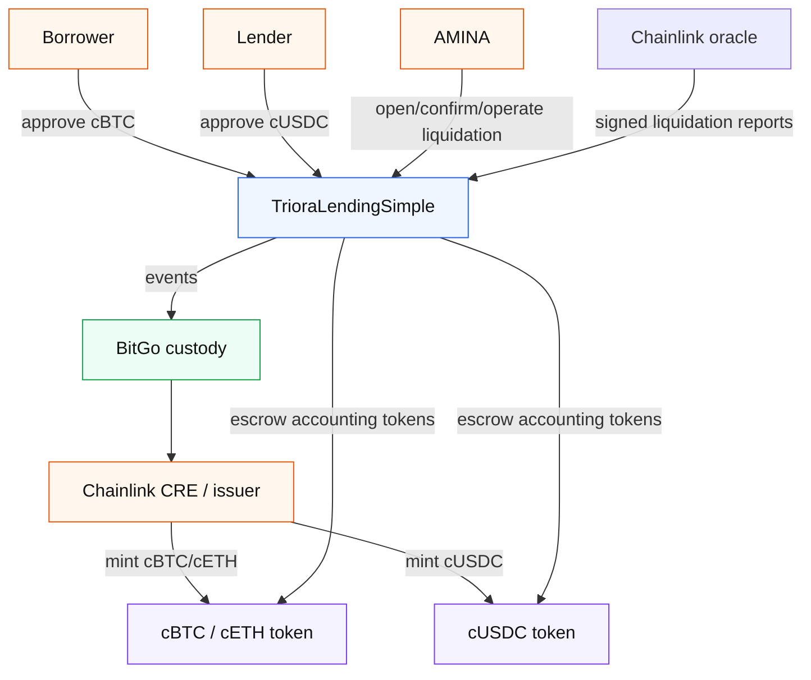
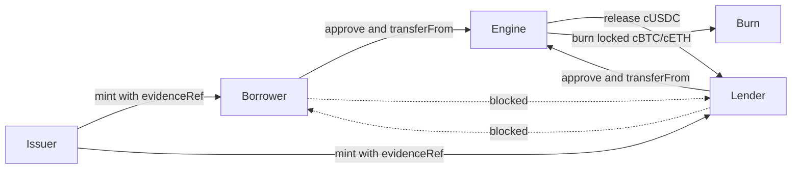
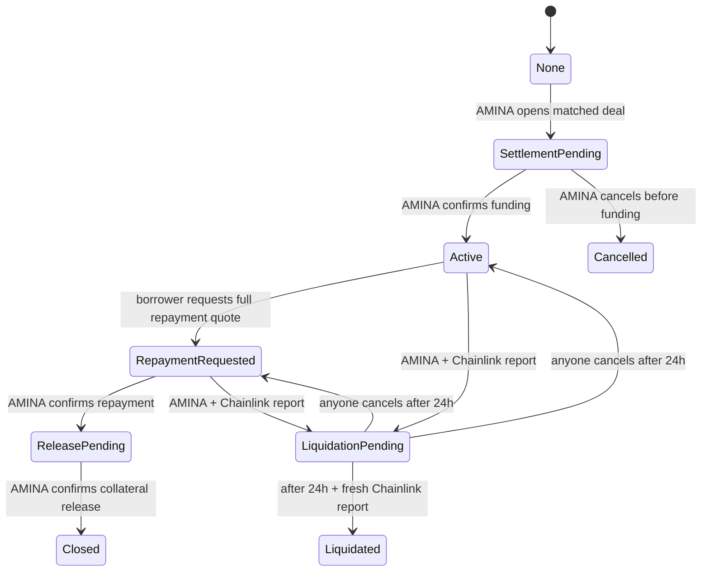
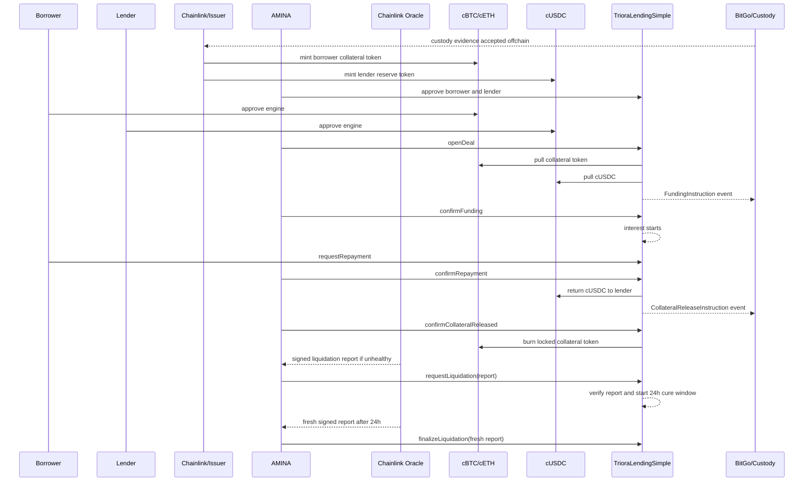
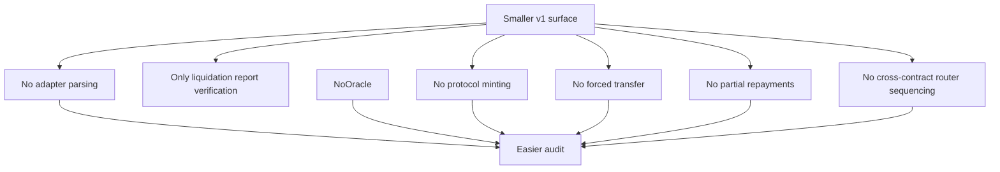
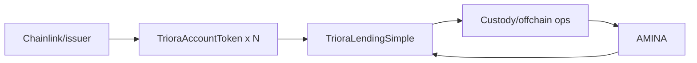

# Triora Simplified Architecture

Date: 2026-06-26

Status: proposed v1-min architecture and implementation target.

Scope: aggressive simplification of the smart-contract architecture while preserving the core Triora vision from `Triora.html` and `Triora - Lend & Borrow.html`.

## Executive Decision

Triora v1 should be much smaller.

The minimum useful onchain system is:

1. Two or more restricted accounting ERC-20 tokens, such as `cBTC`, `cETH`, and `cUSDC`.
2. One lending state-machine contract.
3. AMINA as the only onchain actor allowed to approve entities, open matched deals, confirm funding, confirm repayment, and operate liquidation after Chainlink proves eligibility.
4. Chainlink CRE or another issuer address as the only minter of accounting tokens.
5. Events as the settlement instruction and audit trail.

Everything else should move offchain for v1: custody adapters, reserve registries, pledge registries, router contracts, acker contracts, release authorizers, price oracle contracts, liquidation contracts, loan-position tokens, DeFi connectors, partial repayments, top-ups, and generic composability.

The simplified architecture does less, but it does the right things:

- real assets stay in custody;
- P2P does not custody assets, mint tokens, set financial parameters, or make credit decisions;
- AMINA is the regulated decision maker and settlement confirmer;
- Chainlink/issuer mints accounting tokens after custody evidence;
- the contract holds only accounting tokens, not real USDC/BTC/ETH;
- matched is distinct from funded;
- interest starts only after AMINA confirms real funding;
- collateral release or liquidation is state-bound and event-auditable.

## What We Keep

| Requirement from vision | Minimal implementation |
| --- | --- |
| Tokenize collateral once, borrow many times | Chainlink/issuer mints `cBTC`/`cETH`; borrower can approve tokens into deals. |
| Tokenize USDC to lend | Chainlink/issuer mints `cUSDC`; lender can approve tokens into deals. |
| Real funds stay in custody | Contracts only move accounting ERC-20s. |
| AMINA is broker/collateral agent/liquidator | AMINA is the only settlement and lifecycle operator; Chainlink gates liquidation eligibility. |
| P2P is technology provider | No privileged P2P role in the minimal contracts. |
| Chainlink CRE issues tokens | Token `mint` is issuer-only; lending contract cannot mint. |
| Matched does not mean funded | Deal starts as `SettlementPending`. |
| Interest starts at settlement | `fundedAt` is set only by `confirmFunding`. |
| Repayment releases collateral | Repayment moves deal to `ReleasePending`; release confirmation burns collateral token. |
| Default sends collateral to AMINA desk | Liquidation emits AMINA-desk instruction and burns collateral on confirmation. |
| UI can show portfolio states | Single contract exposes `deal`, `state`, `outstanding`, and token balances. |

## What We Cut

The simplification is intentionally severe.

| Cut item | Why it can be cut from v1 |
| --- | --- |
| Separate `CustodyAdapterRegistry` | Custody evidence is accepted offchain by Chainlink/AMINA before minting. |
| `BitGoCustodyAdapter` signatures onchain | The chain does not need to verify BitGo API packets in v1; AMINA confirms settlement. |
| `PledgeRegistry` | The token balance plus `collateralRef` is enough for v1 audit trail. |
| `ReserveRegistry` | `cUSDC` balances are the reserve ledger. |
| `ReserveGuard` | Issuer minting is the reserve control. Supply caps can be offchain issuer policy in v1. |
| Separate `AccountingVault` | The lending contract itself is the accounting-token escrow. |
| Separate `DealRegistry` | One contract stores immutable terms and runtime state. |
| `SettlementRouter` | The engine emits settlement instruction events directly. |
| `SettlementAcker` | AMINA calls confirmation functions directly. |
| `ReleaseAuthorizer` | Release destination is stored in deal terms and emitted by the engine. |
| `LiquidationHandler` | The engine verifies Chainlink liquidation reports directly; no separate handler. |
| Onchain price oracle | AMINA risk desk can use prices offchain for v1. |
| Health-factor math onchain | Nice for transparency, but not required to enforce custody settlement. |
| Warning state | The 48-hour warning can be offchain notice in v1. |
| Partial repayment | Adds state and rounding complexity; v1 supports full repayment only. |
| Collateral top-up | Useful later; v1 can close and reopen or rely on AMINA offchain process. |
| Loan-position token | Explicitly deferred; it adds secondary-market and rehypothecation risk. |
| DeFi connector | Explicitly deferred; public DeFi liquidity is a later product. |
| Multi-custodian adapter system | v1 production target is BitGo; additional custodians can be added later. |
| Upgradeable/proxy tokenization stack | v1 auditability is more valuable than upgrade surface. |
| Generic allowlist/rule engine | AMINA approval mapping and protocol-only token transfers are enough. |

```mermaid
flowchart TD
    subgraph Removed["Removed from v1 contracts"]
        Adapter[Custody adapters]
        Pledge[Pledge registry]
        Reserve[Reserve registry]
        Guard[Reserve guard]
        Vault[Separate vault]
        Router[Settlement router]
        Acker[Settlement acker]
        Release[Release authorizer]
        Oracle[Onchain oracle]
        Liq[Liquidation handler]
        LoanToken[Loan token]
        DeFi[DeFi connector]
    end

    subgraph Kept["Kept"]
        Tokens[Restricted cTokens]
        Engine[Single lending state machine]
        Events[Instruction and confirmation events]
        Amina[AMINA authority]
        Issuer[Chainlink/issuer minting]
    end

    Adapter -. cut .-> Engine
    Pledge -. cut .-> Engine
    Reserve -. cut .-> Engine
    Guard -. cut .-> Tokens
    Vault -. folded into .-> Engine
    Router -. folded into .-> Events
    Acker -. folded into .-> Amina
    Release -. folded into .-> Engine
    Oracle -. offchain .-> Amina
    Liq -. folded into .-> Amina
    LoanToken -. deferred .-> DeFi
```

## Minimal Contract Map

## Token Model

`TrioraAccountToken` is a restricted ERC-20 accounting token.

Rules:

- issuer can mint;
- lending engine can burn only its own locked balance;
- user-to-user transfers are forbidden;
- user-to-engine and engine-to-user transfers are allowed;
- there is no generic admin mint;
- there is no forced transfer;
- there is no reserve registry;
- there is no token-level allowlist.

Why this is enough:

- The token cannot circulate outside the protocol.
- The protocol cannot create supply.
- The issuer cannot move user balances.
- A deal can lock balances by ordinary `transferFrom`.
- A deal can release balances by ordinary `transfer`.
- A deal can burn locked collateral after custody release confirmation.

## Deal Lifecycle

## Lifecycle Details

### 1. Tokenization

Custody and control are handled before minting:

1. Borrower or lender connects custody.
2. AMINA completes KYB and control agreement.
3. Chainlink/issuer confirms custody evidence.
4. Issuer mints `cBTC`, `cETH`, or `cUSDC` to the participant.

The contract records only token balances and mint evidence events. It does not verify custody packets.

### 2. Match And Settlement Pending

AMINA opens a deal with immutable economic terms:

- lender;
- borrower;
- collateral token;
- principal token;
- collateral amount;
- principal amount;
- rate;
- maturity;
- legal terms hash;
- custody references.

The contract transfers `cBTC/cETH` from borrower and `cUSDC` from lender into itself.

State becomes `SettlementPending`.

A `FundingInstruction` event tells operations what real custody transfer must happen.

### 3. Funding Confirmation

AMINA confirms that real USDC moved through the agreed custody route.

Only then:

- state becomes `Active`;
- `fundedAt` is set;
- interest starts.

### 4. Full Repayment

The borrower requests a repayment quote onchain. The quote is principal plus accrued interest, capped at maturity.

AMINA confirms repayment after the custody-side repayment is complete.

The contract:

- returns locked `cUSDC` to the lender;
- moves the deal to `ReleasePending`;
- emits a collateral release instruction to the borrower destination.

### 5. Collateral Release

AMINA confirms the custodian released the real collateral.

The contract burns the locked `cBTC/cETH` and closes the deal.

### 6. Liquidation

AMINA may request liquidation only with a Chainlink-signed liquidation oracle report.

The report must bind to the deal, legal terms hash, collateral token, principal token, debt value, collateral value,
liquidation threshold, observation time, expiry, and report reference. The engine verifies the signature and threshold
breach before moving to `LiquidationPending`.

A fixed 24-hour cure window then starts. AMINA can finalize only after the window and only with a second fresh
Chainlink-signed report proving that liquidation conditions are still met. If AMINA does not finalize after the window,
anyone can cancel the pending liquidation and restore the previous state.

After AMINA finalizes liquidation:

- locked collateral token is burned;
- locked `cUSDC` is returned to the lender as settled accounting;
- deal becomes `Liquidated`.

See `Triora-liquidation-ADR.md` for the full decision.

## Sequence Diagram

## What The UI Can Still Show

The UI mockup remains supportable:

| UI element | Source |
| --- | --- |
| Entity verified | `approved[address]` |
| Tokenized collateral | `cBTC/cETH.balanceOf(user)` |
| cUSDC available to lend | `cUSDC.balanceOf(lender)` |
| Open deals | deal events and `deal(id)` |
| Deal state | `stateOf(id)` |
| Current repayment amount | `outstanding(id)` |
| Settlement pending | `SettlementPending` state |
| Liquidation pending | `LiquidationPending` state and pending liquidation report refs |
| Closed/liquidated history | terminal state events |

The UI loses only v2-nice-to-have views: reserve evidence lens, full pledge registry view, continuous oracle health
factor, partial repayment progress, and loan token secondary-market flows.

## Security Simplification

The smaller surface removes most footguns.

Main remaining trust assumptions:

- issuer mints only after custody evidence;
- AMINA calls confirmations only after real custody settlement;
- AMINA risk desk handles margin warnings offchain, while liquidation eligibility is proven by Chainlink reports;
- the custodian honors control agreements.

Those are exactly the institutional trust assumptions Triora already has. The simplified contracts stop pretending to automate what is legally and operationally offchain in v1.

## Deferred Features

These should not be implemented until v1 proves product-market and operational fit:

- loan position token;
- public secondary market;
- DeFi connector;
- onchain price oracle and health factor;
- partial liquidation;
- partial repayment;
- collateral top-up;
- multi-custodian adapter abstraction;
- automated Chainlink report verification;
- CMTAT-based regulated transferable instruments;
- upgradeable contract suite;
- cross-chain cTokens;
- configurable risk registry;
- governance/timelock layer.

## Final Shape

The whole v1 contract system should be easy to explain in one sentence:

> Chainlink mints restricted accounting tokens after custody checks; AMINA opens and settles deals; one contract escrows the accounting tokens, records the loan state, emits custody instructions, and burns collateral tokens on release or Chainlink-gated liquidation finalization.
