# Triora Technical Architecture

Date: 2026-06-26

Scope: overall technical architecture for Triora, based on institutional lending research, DeFi lending patterns, the existing P2PxAmina Solidity prototype, and the Triora product vision.

## Executive Summary

Triora should be built as a regulated, custody-backed, fixed-term institutional lending rail. It should borrow the best parts of TradFi secured lending and tri-party repo - legal control, eligible collateral schedules, margining, settlement discipline, default handling, and audit trails - while using DeFi where it is strongest: deterministic accounting, transparent risk parameters, signed intents, immutable deal records, reserve-aware minting, and programmable lifecycle enforcement.

Triora v1 should not be a generic pooled DeFi market. The safest first version is:

- permissioned participants only;
- BTC and ETH collateral first, USDC as the loan asset;
- AMINA as regulated broker, risk owner, collateral agent, and liquidator;
- P2P as technology provider and matching-system operator, not a lender, custodian, or credit decision maker;
- real assets kept in qualified custody or controlled smart accounts;
- restricted accounting tokens for collateral and lender reserves;
- offchain matching plus onchain signed lifecycle records;
- explicit settlement-pending states before interest accrues;
- Chainlink as attestation, PoR, price, and workflow infrastructure, not as the legal issuer.

The one-line target architecture:

> Triora is an institutional tri-party lending operating system where real assets stay in custody, restricted onchain tokens represent controlled collateral and reserved liquidity, AMINA controls regulated decisions, and smart contracts publish and enforce the loan state machine.

## Research Basis

The design below synthesizes current institutional and DeFi lending patterns from these source families.

| Area | What matters for Triora | Sources |
| --- | --- | --- |
| Tri-party repo and securities lending | collateral eligibility, haircuts, margin, custody/control, settlement, substitution, default operations | ICMA repo FAQ: https://www.icmagroup.org/market-practice-and-regulatory-policy/repo-and-collateral-markets/icma-ercc-publications/frequently-asked-questions-on-repo/; NY Fed tri-party repo infrastructure: https://www.newyorkfed.org/banking/tpr_infr_reform |
| Prudential and crypto-asset risk | custody, legal enforceability, operational risk, governance, reserve quality, permissionless-chain risk | Basel crypto-asset standard: https://www.bis.org/bcbs/publ/d545.htm; BCBS crypto disclosures: https://www.bis.org/bcbs/publ/d579.htm |
| AML/KYB and regulated participants | sanctioned-party controls, VASP obligations, travel-rule style metadata, customer due diligence | FATF virtual assets guidance: https://www.fatf-gafi.org/en/publications/Fatfrecommendations/Guidance-rba-virtual-assets-2021.html |
| DeFi lending mechanics | overcollateralization, health factor, liquidation thresholds, oracle freshness, isolated risk, capital efficiency | Aave docs/help: https://aave.com/help/borrowing/liquidations; Compound III docs: https://docs.compound.finance/collateral-and-borrowing/; Morpho docs: https://docs.morpho.org/ |
| Institutional DeFi and RWA lending | pool managers, borrower underwriting, asset pools, tranching, permissioned investors | Maple docs: https://docs.maple.finance/; Centrifuge docs: https://docs.centrifuge.io/ |
| Chainlink infrastructure | price feeds, Proof of Reserve, CRE workflow delivery, CCIP later | Chainlink PoR: https://docs.chain.link/data-feeds/proof-of-reserve; Chainlink CRE: https://docs.chain.link/chainlink-runtime-environment; Chainlink CCIP: https://docs.chain.link/ccip |
| Permissioned tokens | identity-gated transfers, compliance modules, transfer restrictions, security-token style controls | ERC-3643: https://www.erc3643.org/; CMTAT: https://github.com/CMTA/CMTAT |
| Access control and governance | role scheduling, upgrade authority, emergency pause, separation of duties | OpenZeppelin AccessManager: https://docs.openzeppelin.com/contracts/5.x/access-control#access-management |

## Requirements Synthesis

### TradFi Requirements To Preserve

Institutional secured lending is not just "borrow asset X against collateral Y." The durable pieces are legal and operational.

| Requirement | Meaning for Triora |
| --- | --- |
| Legal enforceability | Every loan references a legal terms hash, control agreement, client identity, jurisdiction, and AMINA approval record. |
| Collateral control | The borrower cannot move pledged collateral without AMINA/custodian approval. A token alone is not enough. |
| Segregation | Custody accounts, pledge IDs, reserve IDs, and token balances must be traceable and not commingled invisibly. |
| Eligibility schedule | AMINA defines which assets, custodians, jurisdictions, counterparties, and tenors are eligible. |
| Haircuts and LTV | Parameters are market-specific and snapshotted at deal creation. |
| Margining | Positions need warning, cure, top-up, partial liquidation, full liquidation, and default states. |
| Settlement discipline | Matched does not mean funded. Interest starts only after confirmed settlement. |
| Default and liquidation operations | Liquidation must produce custody instructions, evidence, proceeds accounting, and surplus handling. |
| Audit and reporting | Every material action must be reconstructable from events, reports, signatures, and custody acknowledgements. |
| Operational resilience | Pauses, stale oracle guards, custodian outage states, and manual review paths are first-class states. |

### DeFi Requirements To Borrow

DeFi's best ideas should be used, but adapted to permissioned finance.

| DeFi pattern | Triora adaptation |
| --- | --- |
| Health factor and liquidation threshold | Use transparent LTV, warning, partial, and full-liquidation thresholds. Health factor equals liquidation threshold divided by current LTV. |
| Isolated markets | Each market is scoped by collateral token, loan asset, custodian/assurance tier, oracle set, and AMINA parameter version. |
| Oracle freshness | Price and reserve reports expire. Stale data blocks minting, matching, activation, and liquidation unless AMINA uses an emergency override path. |
| Immutable deal terms | Once a deal is active, principal, rate, maturity, collateral, pledge IDs, and legal terms are immutable. |
| Signed intents | Lender, borrower, and AMINA sign EIP-712 payloads. Matching is offchain; settlement state is onchain. |
| Transparent accounting | Contracts expose balances, encumbrances, reserves, status, and events. |
| Transfer restrictions | Accounting tokens are not freely composable by default. They move only through approved protocol paths. |
| Governance delay | Risk parameter and contract upgrades use role separation and timelock scheduling. |

## Architecture Principles

1. Real assets stay outside smart contracts.
2. Smart contracts enforce state, permissions, accounting, and evidence references.
3. Chainlink reports facts; Triora contracts decide whether those facts are acceptable.
4. AMINA owns regulated decisions: KYB, market parameters, rates, eligibility, margin actions, liquidation, and settlement approval.
5. P2P owns software and operations but should not take custody, make credit decisions, or appear as lender/issuer.
6. Every user-facing status maps to a durable backend state.
7. Every token has a backing story and a transfer policy.
8. Every custody movement has an onchain reason and an offchain acknowledgement.
9. "Matched", "settlement pending", and "active" are separate states.
10. v1 optimizes for correctness and auditability, not maximum composability.

## System Overview

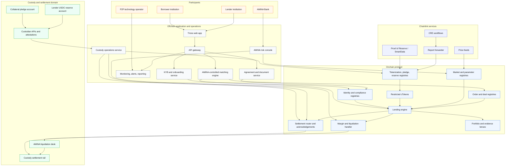

## Responsibility Model

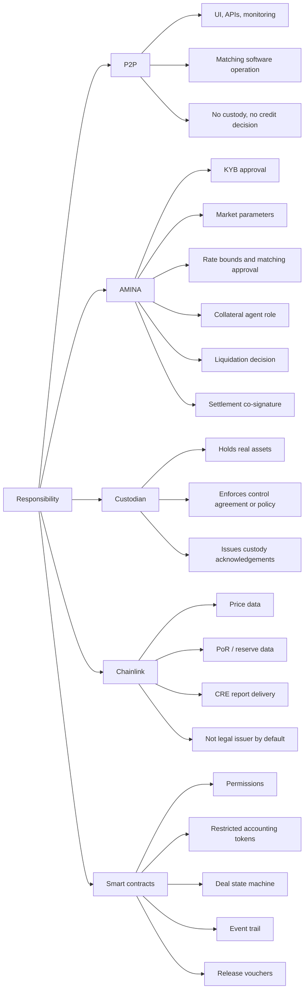

## Domain Layers And Components

### 1. Client And API Layer

Purpose: institutional users need one operating console for onboarding, tokenization, market access, orders, portfolio monitoring, evidence, and exports.

Includes:

- web app;
- API gateway;
- session/auth service;
- entity/account selector;
- order ticket;
- tokenization wizard;
- portfolio and margin dashboard;
- document/evidence drawer;
- audit export service.

Interactions:

- reads onchain state through indexer and lenses;
- writes signed intents for order and deal creation;
- uploads KYB and agreement data to AMINA-controlled workflows;
- displays custody and Chainlink report freshness;
- never lets UI copy imply P2P makes credit, KYB, or issuance decisions.

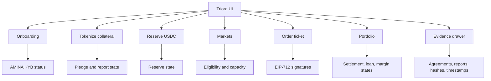

### 2. Identity, Compliance, And Legal Layer

Purpose: enforce institutional eligibility and keep legal evidence close to the onchain lifecycle.

Includes:

- `KYBGateway`;
- `ComplianceRegistry`;
- `AgreementRegistry`;
- jurisdiction and investor classification metadata;
- sanctions/blocked status;
- document hashes;
- AMINA approval records;
- counterparty disclosure rules.

Required capabilities:

- distinguish entity approval from wallet approval;
- support multiple controlled wallets per legal entity;
- expire KYB and agreement statuses;
- block matching and activation if participant status changes;
- snapshot legal terms hash into every deal.

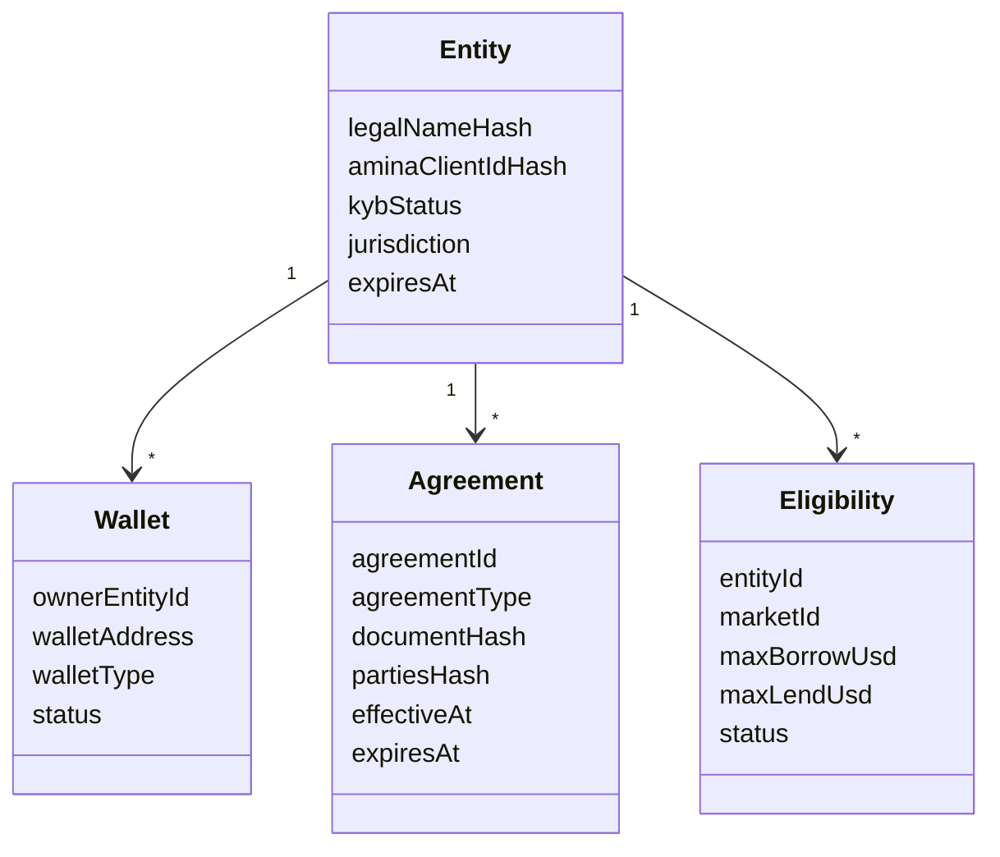

### 3. Custody And Control Layer

Purpose: prove that real assets exist and cannot move except through AMINA-approved routes.

Includes:

- qualified custodian integrations;
- Safe/smart-account pilot mode, if used;
- custody adapter registry;
- segregated pledge accounts;
- lender USDC reserve accounts;
- control agreement references;
- AMINA mandatory co-signature policies;
- custody event listeners;
- settlement acknowledgement service.

Assurance tiers:

| Tier | Description | Recommended v1 treatment |
| --- | --- | --- |
| Tier 1 qualified custody | Regulated custodian, control agreement, AMINA as collateral agent/co-approver | Production |
| Tier 2 smart account | Safe or smart account with AMINA guard/co-signer | Pilot or lower limit |
| Tier 3 self-reported address | Address proof without enforceable control | Not eligible |

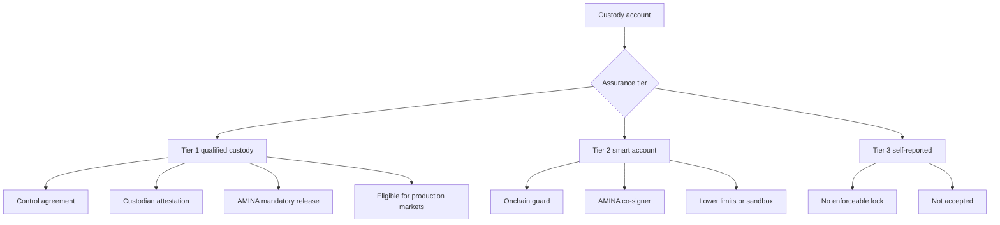

### 4. Chainlink And Evidence Layer

Purpose: provide independent and/or orchestrated evidence about price, reserve quantity, workflow state, and report delivery.

Includes:

- Chainlink price feeds for collateral and loan asset valuation;
- Chainlink PoR or SmartData feeds for reserve quantity where available;
- Chainlink CRE workflows for custodian/API checks and report delivery;
- `CREReportReceiver` to validate report origin, workflow, freshness, and idempotency;
- reserve guard and pledge registry integrations.

Important rule:

> Chainlink should be described as a reporting and workflow layer. Token contracts mint or record reserves only after Triora validates the report and AMINA/custody evidence.

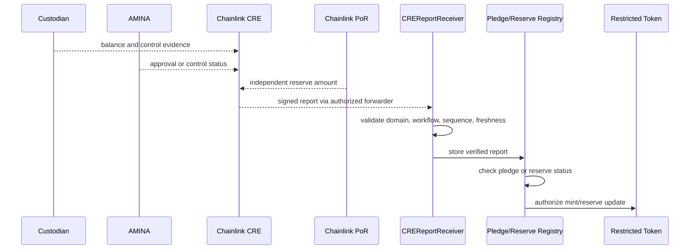

Receiver validation checklist:

- exact authorized forwarder;
- exact workflow ID and workflow owner;
- chain ID and contract address in report domain;
- report schema version;
- report nonce or sequence;
- timestamp and staleness;
- asset and custody account references;
- amount and decimals;
- no replay across token, account, market, or chain;
- report hash stored for audit.

### 5. Tokenization Layer

Purpose: turn controlled custody assets into restricted onchain accounting balances.

Tokens:

| Token | Meaning | Free transfer? | v1 use |
| --- | --- | --- | --- |
| `cBTC`, `cETH` | Restricted collateral inventory backed by controlled custody pledges | No | Borrower posts into Triora deals |
| `cUSDC` | Restricted reserve accounting for lender liquidity in custody | No | Lender places orders and locks reserve |
| `LoanNote` | Lender receivable after funding | No in v1, optional in v2 | Portfolio/accounting only |

Core model:

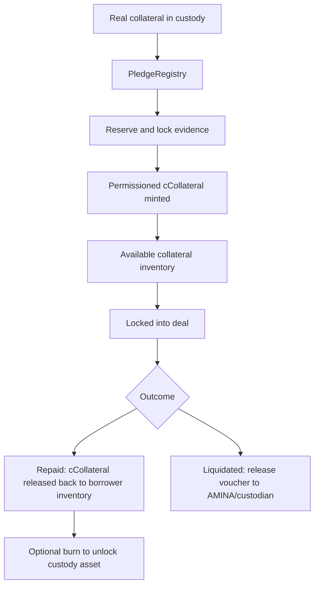

For cUSDC:

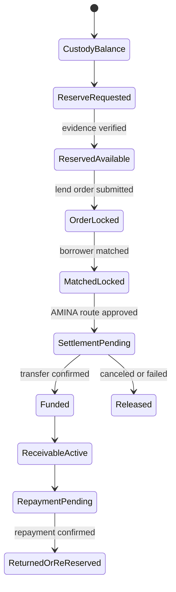

### 6. Market, Risk, And Oracle Layer

Purpose: make every market isolated, parameterized, and governable.

Market identity should include:

- collateral asset;
- collateral token contract;
- loan asset;
- custodian or assurance tier;
- jurisdiction/participant class;
- oracle set;
- reserve source set;
- AMINA parameter version.

Risk parameters:

- initial LTV;
- max borrow LTV;
- warning LTV;
- partial liquidation LTV;
- full liquidation/default LTV;
- liquidation bonus;
- AMINA fee;
- max tenor;
- max rate or rate band;
- settlement deadline;
- stale price threshold;
- stale reserve threshold;
- per-market cap;
- per-entity borrower/lender caps.

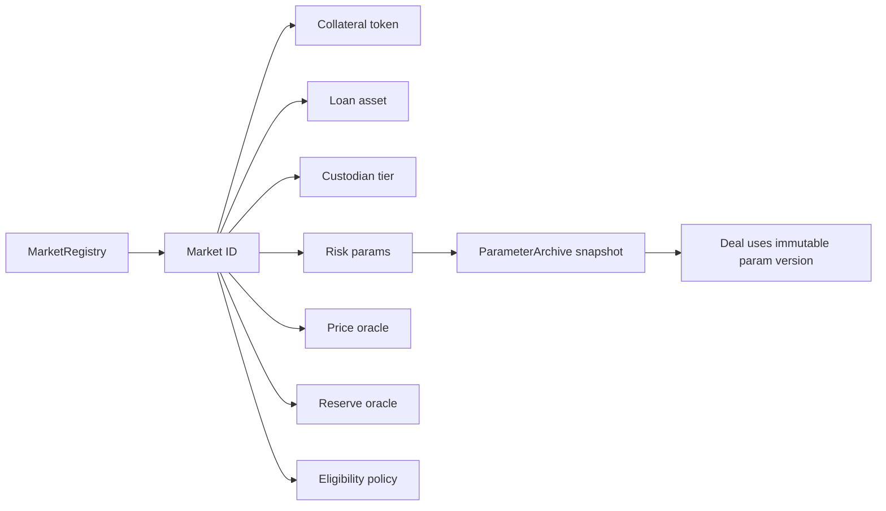

Health model:

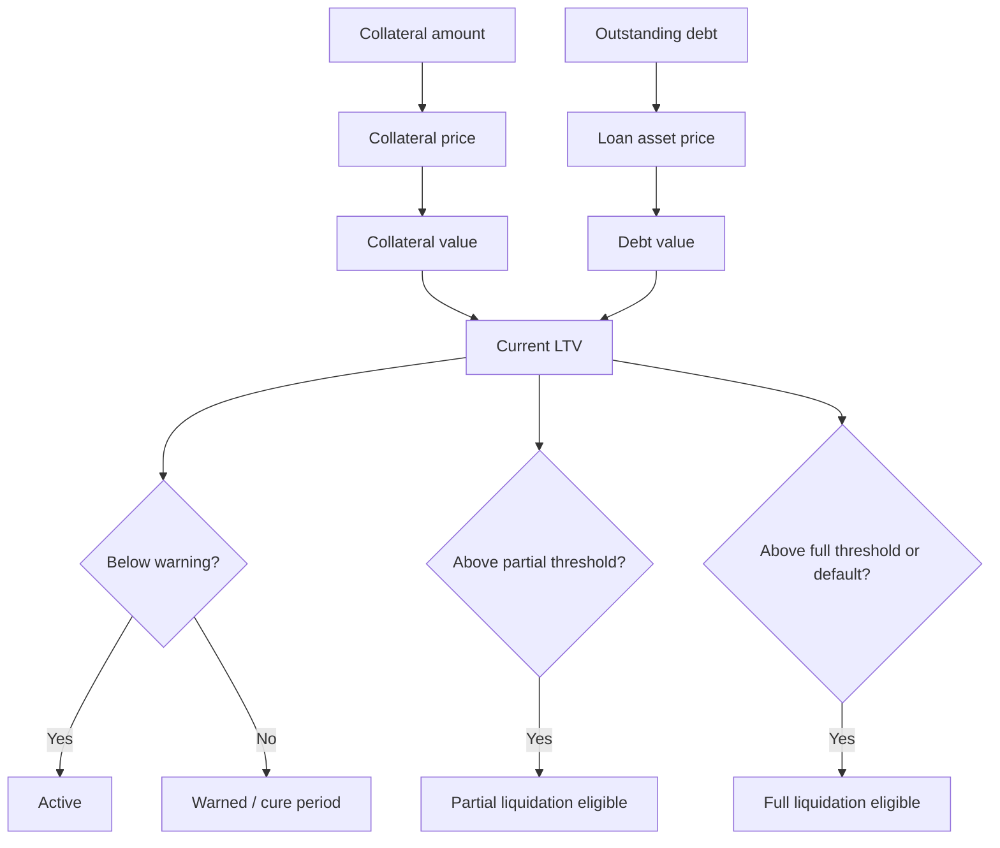

### 7. Matching And Order Layer

Purpose: match institutional lending intent while keeping regulated decisions with AMINA.

Recommended v1: offchain order book, onchain signed commitments.

Includes:

- EIP-712 order intents;
- AMINA approval signature;
- offchain order matching;
- onchain order/deal registry;
- rate bounds;
- fill mode: single lender, partial fills, RFQ;
- settlement route hash;
- legal terms hash;
- reserve and pledge references.

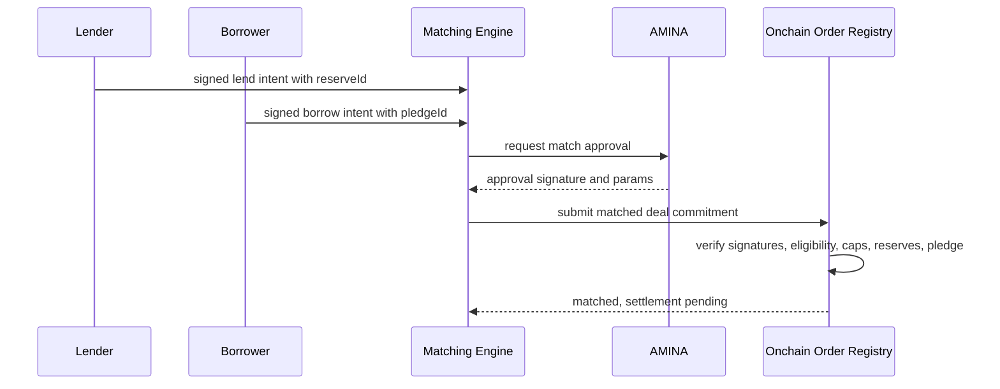

### 8. Deal Lifecycle Layer

Purpose: transform matched orders into funded loans only after settlement proof.

Current P2PxAmina `openAndActivate` is atomic: it pulls supply and collateral into `EscrowVault`, transfers supply to borrower, then marks active. Triora should split this into stages because real USDC and collateral sit in custody.

Target state machine:

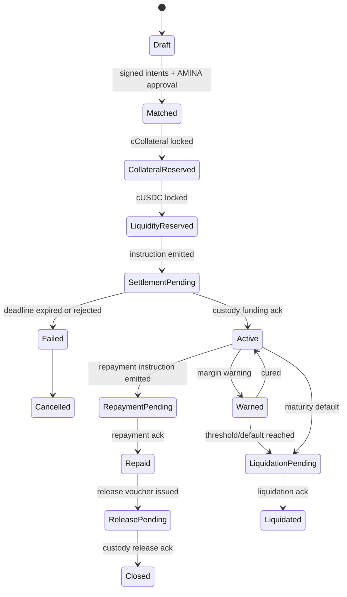

Interest starts at `Active`, not `Matched`.

### 9. Settlement Layer

Purpose: bridge onchain deal state to custody settlement operations without making the smart contract a custodian.

Includes:

- `SettlementRouterV2` event emitter;
- settlement sequence numbers;
- route hashes;
- expected settlement deadlines;
- custody listener;
- AMINA/custodian acknowledgement signatures;
- `SettlementAcker`;
- settlement failure/cancel states;
- reconciliation jobs.

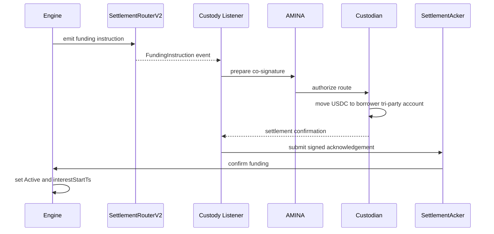

### 10. Margin And Liquidation Layer

Purpose: manage unhealthy positions and default without hiding discretionary operations.

Includes:

- price monitor;
- health factor calculation;
- warning and cure windows;
- borrower top-up and partial repay;
- AMINA-only liquidation calls;
- liquidation price attestation;
- release voucher;
- custody liquidation instruction;
- proceeds and surplus accounting;
- dispute/manual hold reason codes.

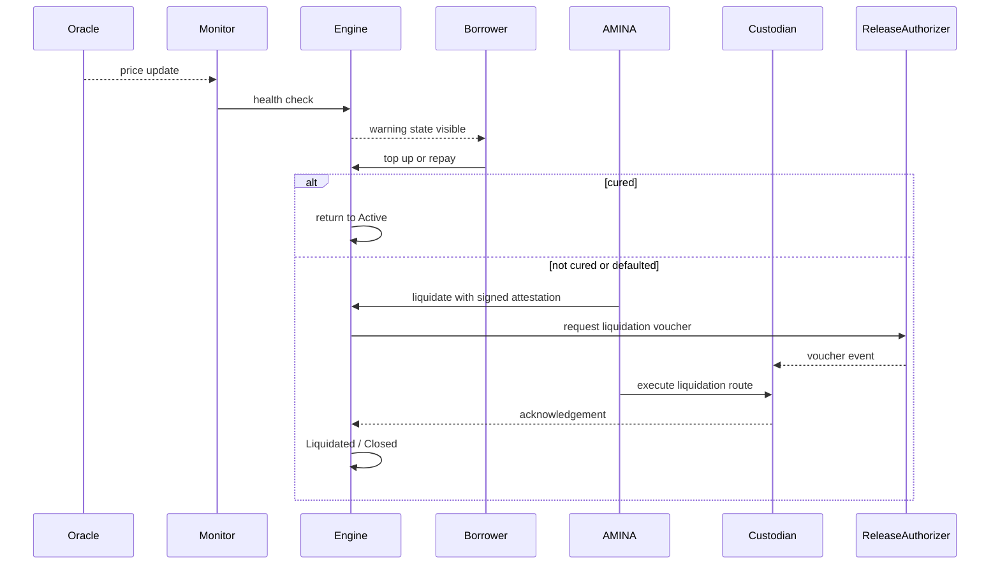

### 11. Reporting, Indexing, And Evidence Layer

Purpose: give institutions, AMINA, auditors, and counterparties a consistent record.

Includes:

- protocol indexer;
- document/evidence store;
- report freshness dashboard;
- portfolio lens;
- proof/evidence lens;
- CSV/PDF/API exports;
- reconciliation reports;
- exception queue.

Evidence graph:

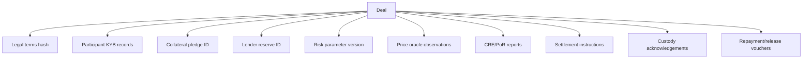

### 12. Governance, Security, And Operations Layer

Purpose: keep upgrades, risk changes, and emergency responses controlled.

Includes:

- `AccessManager` or equivalent role manager;
- timelocked upgrades;
- AMINA operational roles;
- P2P deployer/operator roles with limited authority;
- emergency pause;
- pair pause;
- custodian pause;
- token pause;
- report-source pause;
- oracle override with delay and audit trail;
- incident runbooks.

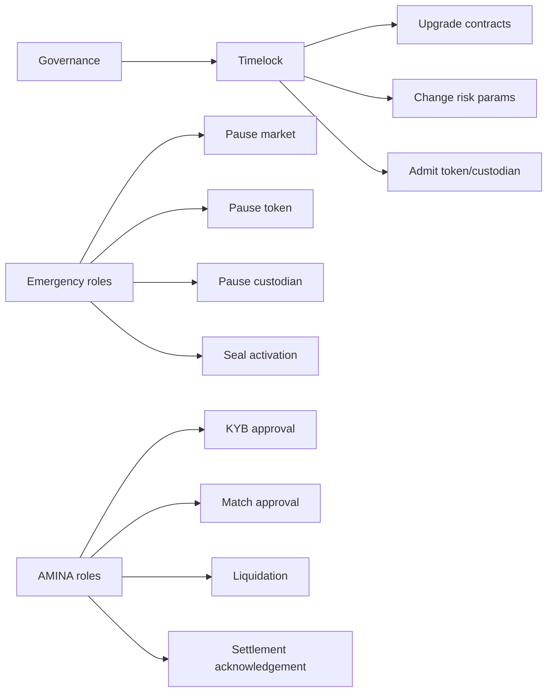

## Lifecycle Flows

### Onboarding

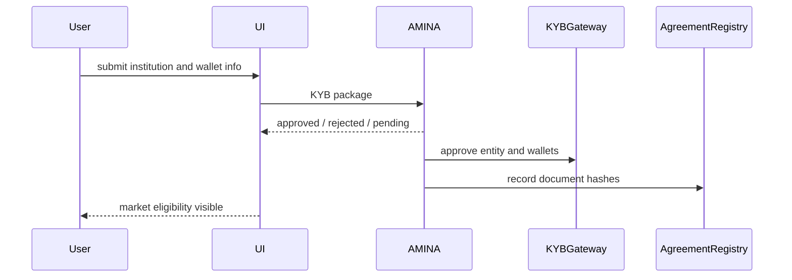

### Collateral Tokenization

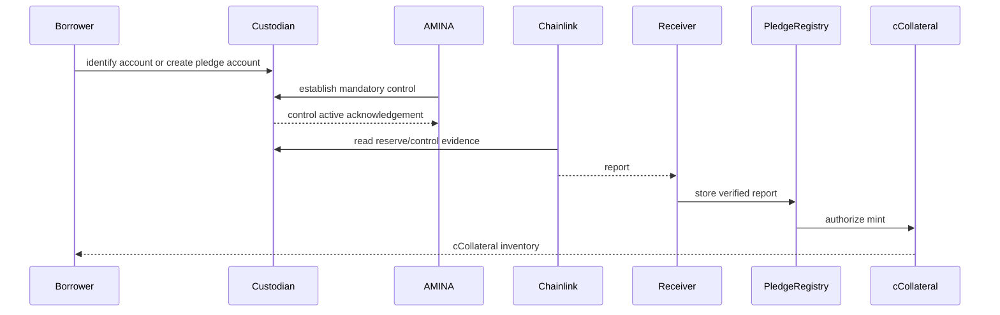

### USDC Reservation

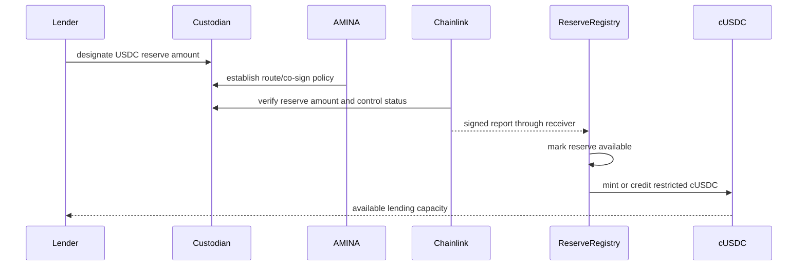

### Match And Fund

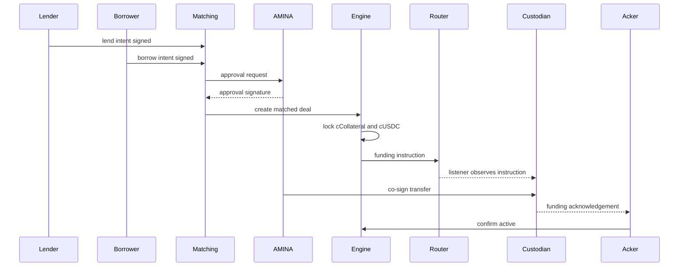

### Repay And Release

```mermaid
sequenceDiagram
    participant Borrower
    participant Engine
    participant Router
    participant Custodian
    participant Acker
    participant Release
    participant AMINA

    Borrower->>Engine: request repay or mark repayment intent
    Engine->>Router: repayment instruction
    Borrower->>Custodian: transfer principal + interest via approved route
    Custodian-->>Acker: repayment acknowledged
    Acker->>Engine: confirm repaid
    Engine->>Release: issue borrower release voucher
    AMINA->>Custodian: co-sign collateral release
    Custodian-->>Acker: release acknowledged
    Acker->>Engine: close deal
```

## Core Data Model

```mermaid
classDiagram
    class Entity {
        entityId
        kybStatus
        jurisdiction
        aminaClientHash
    }

    class CustodyAccount {
        accountId
        entityId
        custodian
        asset
        assuranceTier
        controlStatus
    }

    class Pledge {
        pledgeId
        accountId
        token
        asset
        amount
        freeAmount
        encumberedAmount
        status
    }

    class Reserve {
        reserveId
        accountId
        asset
        available
        locked
        funded
        status
    }

    class Market {
        marketId
        collateralToken
        loanAsset
        paramVersion
        active
    }

    class Order {
        orderId
        side
        entityId
        marketId
        amount
        rate
        tenor
        status
    }

    class Deal {
        dealId
        borrower
        lender
        pledgeId
        reserveId
        principal
        rate
        maturity
        state
    }

    Entity "1" --> "*" CustodyAccount
    CustodyAccount "1" --> "*" Pledge
    CustodyAccount "1" --> "*" Reserve
    Market "1" --> "*" Order
    Order "*" --> "0..1" Deal
    Pledge "1" --> "*" Deal
    Reserve "1" --> "*" Deal
```

## Component Interaction Matrix

| Component | Reads from | Writes to | Emits or triggers |
| --- | --- | --- | --- |
| UI/API | indexer, lenses, KYB status | signed intents, onboarding packages | user actions |
| KYB service | AMINA systems | `KYBGateway`, `AgreementRegistry` | approval/rejection events |
| Matching engine | orders, eligibility, market params | `OrderRegistry`, `LendingEngine` | matched deal submissions |
| Custody service | custodian APIs, router events | `SettlementAcker`, report inputs | settlement and release acknowledgements |
| Chainlink CRE | custodian/API data, PoR data | `CREReportReceiver` | signed reports |
| Tokenization registry | reports, AMINA approvals | pledge/reserve configs | mint/reserve authorization |
| Lending engine | all registries | deal state | settlement and lifecycle events |
| Liquidation handler | price data, deal state | deal state, release vouchers | liquidation instructions |
| Release authorizer | terminal deal state | vouchers | custody release events |
| Lenses/indexer | events and storage | indexed database | dashboards and exports |

## V1 Product Boundary

V1 should include:

- AMINA-approved institutional entities;
- BTC and ETH collateral;
- USDC loan asset;
- qualified custody mode as production path;
- optional Safe mode only as lower-assurance pilot;
- restricted cBTC/cETH and cUSDC;
- bilateral or RFQ-style matching;
- partial fills if the legal agreement supports lender syndication;
- settlement-pending state before activation;
- warning, cure, partial liquidation, full liquidation;
- no public DeFi connector;
- no re-pledging of loan notes;
- no claim that Chainlink is legal issuer.

V2 can add:

- more custodians;
- RWA collateral;
- pooled lender vaults;
- LoanNote mobility;
- secondary market for loan notes;
- cross-chain settlement through CCIP;
- isolated DeFi connector;
- programmable refinancing.

```mermaid
flowchart LR
    V1[V1: institutional matched lending] --> V2[V2: managed liquidity and loan notes]
    V2 --> V3[V3: external DeFi and cross-chain]

    V1 --> A[BTC/ETH + USDC]
    V1 --> B[AMINA-controlled matching]
    V1 --> C[Custody-backed restricted tokens]

    V2 --> D[Pooled vaults]
    V2 --> E[LoanNote transfers]
    V2 --> F[RWA collateral]

    V3 --> G[Isolated Aave/Morpho-style connector]
    V3 --> H[CCIP settlement]
```

## Key Design Corrections From Existing Vision

| Current vision risk | Architecture correction |
| --- | --- |
| "Chainlink issues/mints tokens" | Chainlink provides reports. Triora token contracts mint after report, AMINA approval, and custody evidence validation. |
| "Funds move once and then loan is active" | The contract must represent settlement pending and confirm funding before active interest accrual. |
| "cToken is a standard ERC-20 usable in Aave/Morpho" | cTokens are restricted accounting tokens. External DeFi needs a dedicated connector and isolated risk model. |
| "Safe mode is self-serve equivalent" | Safe mode is a lower-assurance tier unless legal control and custody policy are equivalent. |
| "Portfolio can withdraw active lending principal" | Lender can release reservation before funding; after funding, lender holds a receivable until repayment or approved transfer. |
| "PoR proves custody control" | PoR proves reported reserves. Control requires custodian/AMINA attestations and legal agreements. |

## Open Questions

1. Which custodian is v1 production target?
2. Is Safe mode part of v1, or only a demo path?
3. Is cUSDC minted as an ERC-20 balance or tracked as a non-transferable reserve ledger?
4. Are partial fills legally separate loans or one syndicated deal?
5. Does AMINA require each order to be approved manually, or can policy-bounded auto-approval be used?
6. What is the exact cure period for margin calls?
7. What custody acknowledgement format will be accepted onchain?
8. What is the legal status of a LoanNote if introduced later?
9. Which Chainlink PoR feeds are available for the exact custody/reserve addresses?
10. Which jurisdictions and client classifications are eligible at launch?

## Final Architecture Recommendation

Build Triora as a modular tri-party lending system with a strict boundary between:

- custody assets;
- restricted onchain accounting tokens;
- AMINA-regulated decisions;
- P2P-operated technology;
- Chainlink evidence and workflow delivery;
- deterministic smart-contract lifecycle state.

The first milestone should not optimize for DeFi composability. It should prove that a custody-backed, AMINA-controlled, Chainlink-attested loan can move through tokenization, match, settlement, active monitoring, repayment, release, and liquidation with no ambiguous state transitions. Once that loop is reliable, pooled vaults, loan-note transferability, and DeFi connectors can be added as isolated modules.
