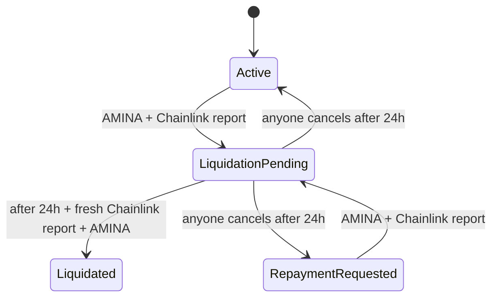
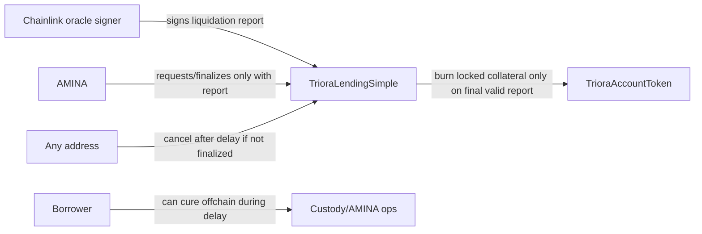
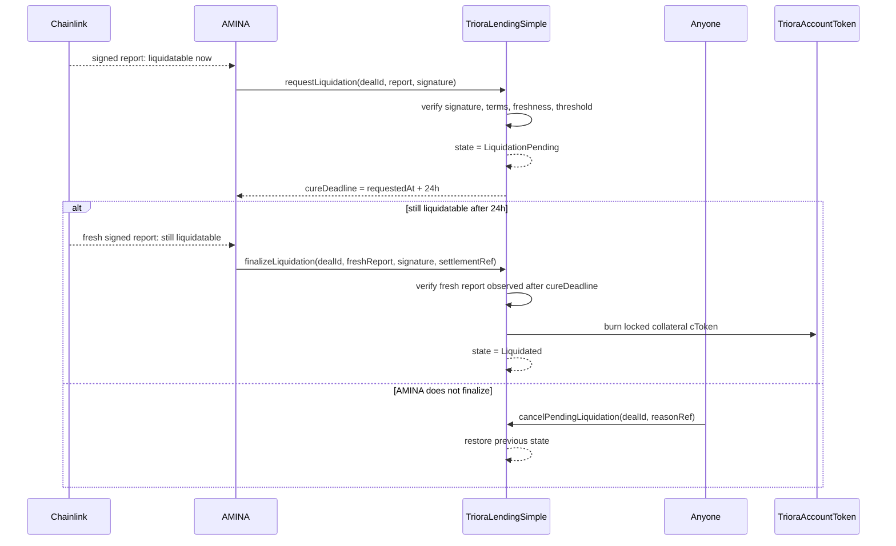
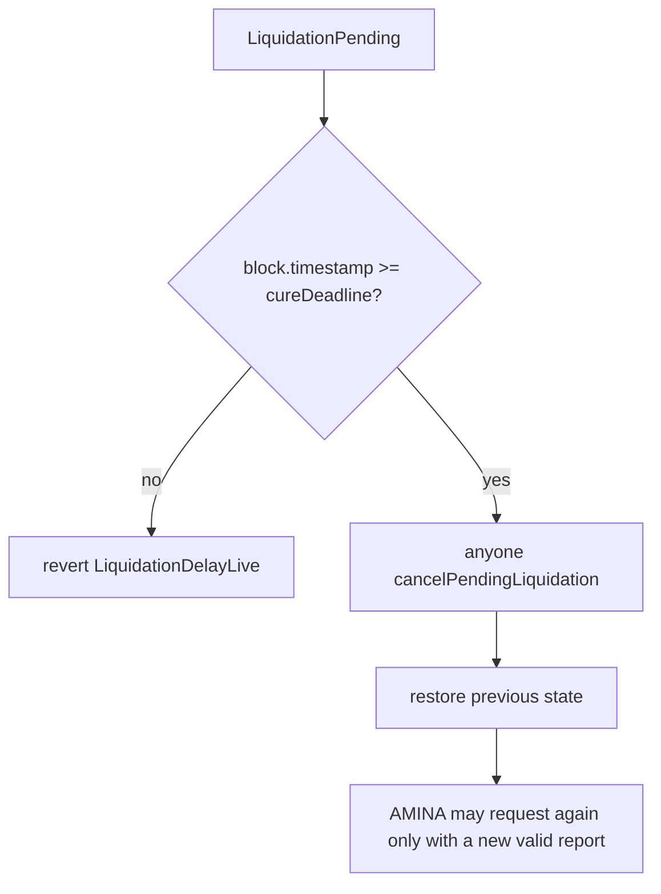
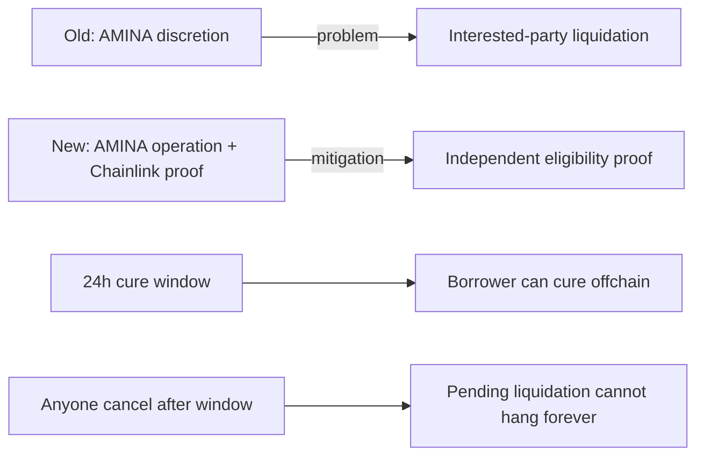

# ADR: Chainlink-Gated Liquidation With Cure Window

## Status

Accepted for simplified v1.

## Decision

I agree with the design direction, with one precise framing:

> AMINA may operate liquidation, but AMINA must not be trusted to determine liquidation eligibility.

Liquidation eligibility is now gated by Chainlink oracle reports. AMINA can request liquidation only when a
Chainlink-signed report proves the deal is liquidatable. AMINA can finalize liquidation only after a 24-hour cure
window and only with a second, fresh Chainlink-signed report proving the deal is still liquidatable.

If AMINA does not finalize after the cure window opens, anyone can cancel the pending liquidation and restore the deal
to its previous non-terminal state.



## Problem

The previous simplified design allowed AMINA to decide liquidation offchain and call the engine directly.

That is too much discretion for a party that may have incentives to liquidate:

- AMINA may prefer lender protection over borrower protection.
- AMINA may have operational risk incentives to reduce exposure quickly.
- Liquidation can be economically harmful and hard to reverse.
- A borrower needs an independent, verifiable condition before collateral accounting tokens are burned.

The goal is not to automate custody liquidation completely. The goal is to make liquidation eligibility independent of
AMINA.

## New Trust Model



AMINA remains necessary because liquidation is still a custody/legal operation. Chainlink becomes necessary because
liquidation eligibility is an objective oracle predicate.

## Oracle Report

The engine accepts a typed EIP-712 report signed by the configured Chainlink oracle signer.

Report fields:

```solidity
struct LiquidationOracleReport {
    bytes32 dealId;
    bytes32 legalTermsHash;
    address collateralToken;
    address principalToken;
    uint256 debtValue;
    uint256 collateralValue;
    uint32 liquidationThresholdBps;
    uint64 observedAt;
    uint64 expiresAt;
    bytes32 reportRef;
}
```

The report is valid only if:

- signature recovers to `chainlinkOracle`;
- report is bound to the exact `dealId`;
- report is bound to the exact `legalTermsHash`;
- report is bound to the exact collateral and principal tokens;
- report is observed in the past;
- report is not expired;
- `debtValue`, `collateralValue`, and `liquidationThresholdBps` are nonzero;
- `liquidationThresholdBps <= 10000`;
- the report proves:

```text
debtValue / collateralValue >= liquidationThresholdBps / 10000
```

Implemented without overflow-prone multiplication as:

```solidity
Math.mulDiv(debtValue, 10000, collateralValue) >= liquidationThresholdBps
```

## Lifecycle



## Cure Window

The cure window is fixed at 24 hours.

This is intentionally not configurable in simplified v1 because configuration creates a sharp edge:

- `0` would remove borrower protection;
- a very long delay can harm lenders;
- per-deal delays invite operational mistakes.

The v1 rule is simple:

```text
request time + 24 hours = earliest finalization time
```

Finalization also requires the second report to have:

```text
observedAt >= request time + 24 hours
```

This prevents AMINA from reusing a report captured before the cure window elapsed.

## Cancellation

Anyone can cancel a pending liquidation after the 24-hour delay if AMINA has not finalized.



This gives borrowers and lenders a public escape hatch if AMINA stalls after starting liquidation. It does not prevent
AMINA from requesting a new liquidation later, but a new request again requires a valid Chainlink report.

## Why This Is Safer



The engine no longer asks, "Does AMINA say liquidation is allowed?"

It asks:

1. Did Chainlink sign this exact deal report?
2. Is the report fresh and unexpired?
3. Does the report prove the liquidation threshold is breached?
4. Has 24 hours elapsed?
5. Does a second Chainlink report prove the breach still exists?

## Tradeoffs

Pros:

- removes unilateral AMINA liquidation discretion;
- gives borrowers a fixed cure window;
- makes eligibility independently verifiable onchain;
- keeps AMINA as custody/legal operator without trusting AMINA's price judgment;
- avoids a large oracle subsystem;
- keeps the simplified v1 audit surface compact.

Cons:

- depends on Chainlink report availability;
- still trusts the configured Chainlink signer/report publisher;
- does not model partial liquidation;
- does not automatically ingest custody-side cures;
- allows anyone to cancel after the deadline, so AMINA must finalize promptly when the second report exists.

## Rejected Alternatives

### AMINA-Only Liquidation

Rejected because AMINA can be economically or operationally interested in liquidation.

### Fully Automated Liquidation

Rejected for simplified v1. The real collateral remains in custody, so AMINA/custody operations are still required.
Automating only the token burn without custody settlement would create accounting/legal mismatch.

### Configurable Cure Window

Rejected for simplified v1. The fixed 24-hour rule is easier to audit and harder to misconfigure.

### Single Oracle Report For Request And Finalization

Rejected because it does not prove that the borrower failed to cure during the window.

## Implementation Summary

Implemented in `src/simple/TrioraLendingSimple.sol`:

- immutable `chainlinkOracle`;
- fixed `LIQUIDATION_DELAY = 24 hours`;
- EIP-712 `LiquidationOracleReport`;
- `requestLiquidation(dealId, report, signature)`;
- `finalizeLiquidation(dealId, report, signature, settlementRef)`;
- `cancelPendingLiquidation(dealId, reasonRef)`;
- `getPendingLiquidation(dealId)`;
- `hashLiquidationReport(report)` for offchain signing/test harnesses.

Tests added in `test/triora/TrioraSimple.t.sol`:

- liquidation succeeds only with valid initial and final Chainlink reports;
- healthy reports are rejected;
- wrong signer is rejected;
- finalization before 24 hours is rejected;
- final report must be fresh and still liquidatable;
- initial report cannot be reused for finalization;
- anyone can cancel after the cure window;
- cancellation before the cure window is rejected;
- fuzz test proves finalization always reverts before the cure window.
