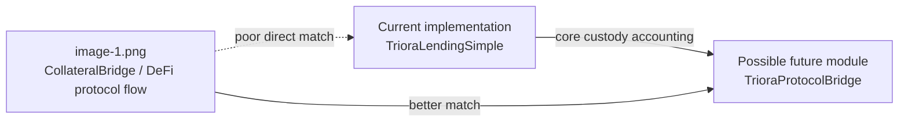
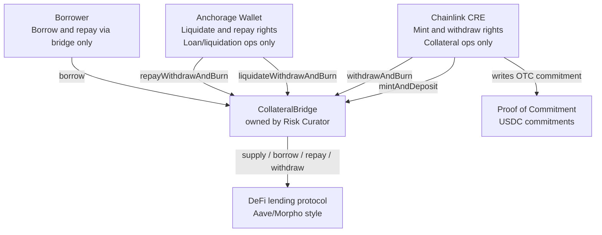
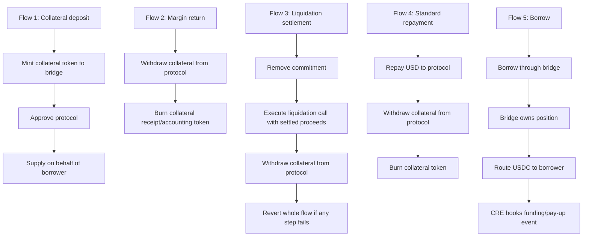
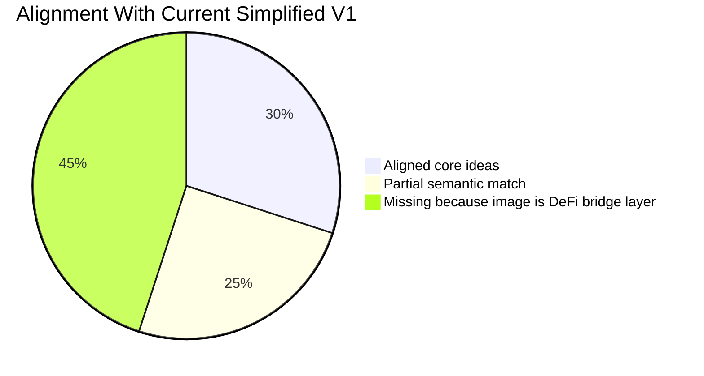
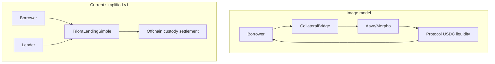
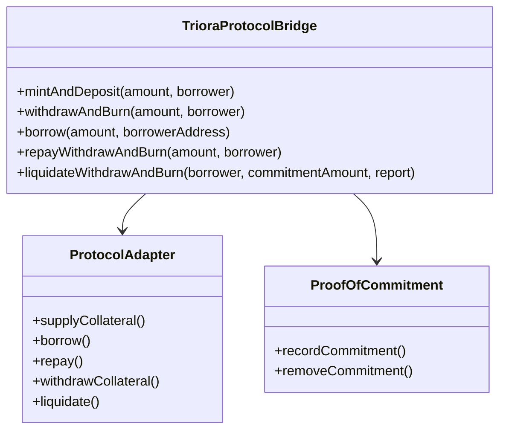
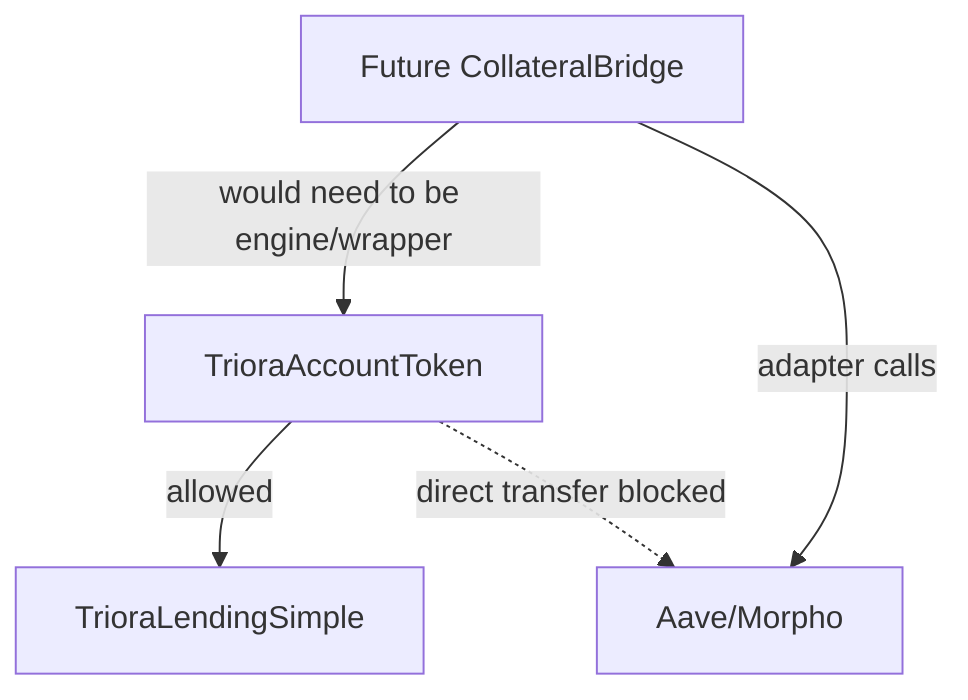
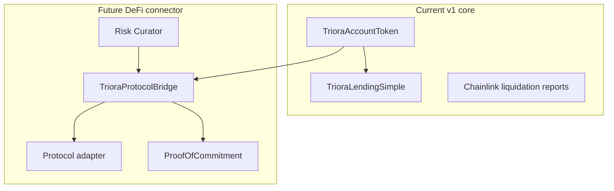
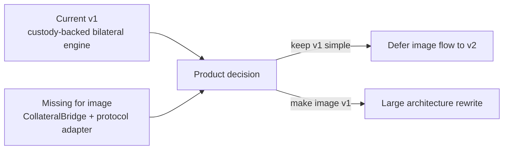

# Triora Missing Parts From `image-1.png`

## Executive Read

`image-1.png` does **not** closely match the simplified implementation now in `src/simple`.

It describes a **DeFi collateral bridge** architecture:

- Chainlink CRE mints collateral tokens and writes OTC commitments.
- A `CollateralBridge` owns the DeFi protocol position.
- Borrower can call `borrow` only through the bridge.
- Anchorage can call repayment and liquidation flows.
- The bridge deposits collateral into a protocol such as Morpho or Aave.
- Borrowed USDC is routed to the borrower.
- Repayment, collateral withdrawal, burn, and liquidation are atomic protocol operations.

Our implementation is a **bilateral custody-accounting engine**:

- Chainlink/issuer mints restricted accounting tokens.
- AMINA opens matched deals.
- The engine escrows `cCollateral` and `cUSDC`.
- Real asset settlement happens offchain with custody instructions.
- Liquidation eligibility is gated by Chainlink oracle reports and a 24-hour cure window.
- There is no DeFi protocol position, bridge-owned position, protocol borrow, or protocol repayment.

So the image aligns with Triora's broader vision only if it is treated as a **future DeFi connector / bridge module**. It does not align as the current simplified v1 implementation target.

## What The Image Appears To Specify

From the visible diagram, the system has these actors and capabilities.

Visible functions:

| Image item | Meaning |
| --- | --- |
| `mintAndDeposit(amount, borrower)` | CRE mints collateral token to bridge and deposits it into the protocol for the borrower. |
| `withdrawAndBurn(amount, borrower)` | CRE withdraws collateral from protocol and burns the receipt/accounting token. |
| `Proof of Commitment` | Stores USDC commitments; CRE writes on OTC event; commitment is removed on liquidation. |
| `liquidateWithdrawAndBurn(borrower, commitmentAmount)` | Anchorage-only atomic liquidation flow. |
| `repayWithdrawAndBurn(amount, borrower)` | Anchorage or borrower repays protocol debt, withdraws collateral, burns collateral token. |
| `borrow(amount, borrowerAddress)` | Borrower borrows through bridge; bridge owns protocol position; USDC routes to borrower. |

Visible flows:

## Alignment With Current Implementation

| Image concept | Current simplified implementation | Alignment |
| --- | --- | --- |
| Chainlink/CRE mints tokenized collateral | `TrioraAccountToken.mint` is issuer-only | Good |
| Restricted rights by actor | Token issuer, AMINA, and Chainlink oracle are separated | Partial |
| Burn collateral token on release/liquidation | `burnLocked` burns engine-held collateral | Good |
| Atomic liquidation transaction | `finalizeLiquidation` burns collateral and returns principal token atomically | Partial |
| Chainlink involvement | Token issuance and liquidation report signing | Partial |
| Borrower can repay | Borrower can request repayment quote, but AMINA confirms custody repayment | Partial |
| Proof/commitment references | Deal stores hashes/refs and emits events | Partial |
| Bridge owns DeFi position | Not implemented | Missing |
| Supply collateral into Aave/Morpho | Not implemented | Missing |
| Borrow USDC from protocol | Not implemented | Missing |
| Protocol repay/withdraw flow | Not implemented | Missing |
| Anchorage wallet role | Not implemented; AMINA is the operator | Missing / different custodian target |
| Margin return while active | Not implemented | Missing by design |
| Proof of Commitment storage | Not implemented as a separate ledger | Missing by design |
| Risk Curator owner | Not implemented | Missing / intentionally avoided |
| Atomic external multicall | Not implemented | Missing |

Overall alignment:

## The Core Mismatch

The image assumes the collateral token is used inside a public or semi-public lending protocol.

Our current v1 assumes the collateral token is an accounting token locked inside Triora's own bilateral engine.

This is not a small implementation gap. It is a different architecture.

## Missing Parts If We Wanted To Match The Image

### 1. `CollateralBridge` Contract

The image's central primitive is not our current engine. It is a bridge that owns protocol positions.

Missing capabilities:

- own collateral positions in an external lending protocol;
- map borrower to protocol position;
- enforce borrower-only borrow route;
- enforce CRE-only mint/deposit and withdraw/burn routes;
- enforce Anchorage/AMINA-only liquidation and repayment routes;
- manage protocol approvals;
- coordinate external calls atomically.

Potential future shape:

Recommendation: do **not** merge this into `TrioraLendingSimple`. Build it as a separate v2 connector if needed.

### 2. External Protocol Adapter

The image assumes a protocol such as Aave or Morpho.

Missing:

- protocol-specific interfaces;
- collateral supply call;
- borrow call;
- repay call;
- collateral withdraw call;
- liquidation call;
- handling of protocol shares/positions;
- oracle/risk model compatibility;
- revert-safe multicall behavior.

This is a high-risk module because Aave/Morpho semantics are not just token transfers. They include collateral factors,
oracle price assumptions, interest accrual, liquidation incentives, supply caps, protocol pausing, and market-specific
accounting.

### 3. Borrow Flow

The image has a direct `borrow(amount, borrowerAddress)` function callable by the borrower.

Current v1 has no equivalent. In our model:

- AMINA opens a matched deal;
- lender cUSDC is escrowed;
- AMINA confirms real funding;
- the contract does not transfer USDC to the borrower.

Missing for image alignment:

- borrower-initiated `borrow`;
- protocol debt creation;
- USDC routing to borrower;
- event that lets CRE book `INITIAL_FUNDING` or `PAY_UP`;
- bridge-owned debt accounting.

This should stay out of simplified v1 unless the product goal changes from institutional bilateral lending to DeFi
borrowing.

### 4. Standard Repayment Flow

The image's standard repayment path is:

1. repay USD to protocol;
2. withdraw collateral from protocol;
3. burn collateral token.

Current v1 path is:

1. borrower requests repayment quote;
2. AMINA confirms custody-side repayment;
3. engine returns locked `cUSDC` accounting token to lender;
4. AMINA confirms collateral release;
5. engine burns locked collateral accounting token.

Missing for image alignment:

- actual protocol debt repayment;
- stablecoin transfer into the protocol;
- protocol collateral withdrawal;
- direct borrower or custodian execution path;
- single function that combines repay, withdraw, and burn.

### 5. Liquidation Settlement Flow

The image shows liquidation as an atomic bridge/protocol operation:

- remove commitment;
- execute protocol liquidation call with settled proceeds;
- withdraw collateral;
- revert if any step fails.

Current v1 now has a better trust model for eligibility, but not the same mechanics:

- AMINA requests liquidation with a Chainlink-signed report;
- after 24 hours, AMINA finalizes with a fresh Chainlink-signed report;
- engine burns locked collateral token and returns principal accounting token to lender;
- no external protocol liquidation call exists.

Missing for image alignment:

- liquidation proceeds accounting;
- protocol liquidation call;
- commitment removal;
- external collateral withdrawal;
- atomic interaction with protocol and commitment ledger.

### 6. Margin Return

The image has "Flow 2: Margin Return":

- withdraw collateral from protocol;
- burn collateral receipt token.

Current simplified v1 deliberately cut:

- partial collateral withdrawal;
- collateral top-up;
- margin return;
- live LTV maintenance.

If margin return is a product requirement, the current implementation is incomplete. If the goal remains aggressive
simplification, margin return should stay deferred.

### 7. Proof Of Commitment Ledger

The image has a separate `Proof of Commitment` component for USDC commitments.

Current v1 uses:

- `legalTermsHash`;
- `collateralRef`;
- `reserveRef`;
- `lenderSettlementRef`;
- events;
- escrowed `cUSDC`.

That is enough for bilateral escrow because double-use is prevented by physically locking `cUSDC` in the engine.

It is not enough for the image's bridge model, where the bridge needs to track offchain OTC commitments and remove them
during liquidation.

Missing for image alignment:

- commitment id;
- committed amount;
- committed asset;
- commitment lifecycle;
- write-on-OTC-event path;
- removal on liquidation;
- replay/double-commitment protections.

### 8. Anchorage-Specific Wallet Role

The image names Anchorage Wallet with:

- liquidation rights;
- repayment rights;
- loan and liquidation operations only.

Current v1 has:

- AMINA as the lifecycle operator;
- Chainlink oracle signer for liquidation eligibility;
- issuer for token minting.

There is no Anchorage role. That is consistent with the current BitGo/AMINA simplified target, but it does not match the
image.

If the image is still product-relevant, we need to decide whether "Anchorage" really means:

- a specific custodian;
- a generic custodian-ops signer;
- AMINA's operational wallet;
- a v2 connector role.

### 9. Risk Curator Ownership

The image says the `CollateralBridge` is owned by a Risk Curator.

Current simplified v1 avoids:

- Risk Curator role;
- AccessManager role graph;
- parameter mutation;
- protocol allocation decisions.

This is good for auditability, but it means we are missing:

- curator-owned market configuration;
- protocol selection;
- caps;
- pausing;
- emergency withdrawal routes;
- role rotation.

These are necessary for a protocol bridge, not for the current bilateral engine.

### 10. Direct DeFi Compatibility

The image assumes collateral tokens can be deposited into a lending protocol.

Our `TrioraAccountToken` blocks user-to-user transfers and only allows user-to-engine or engine-to-user movement. Aave or
Morpho would not be able to use it naturally unless:

- the protocol/bridge is set as the token engine;
- a wrapper token is introduced;
- transfer rules are expanded;
- a specialized isolated market accepts the restricted token.

This is a major incompatibility.

## What We Should Not Add To Simplified V1

The following are missing relative to the image, but should remain out of the simplified v1:

- Aave/Morpho adapter;
- `CollateralBridge`;
- protocol borrow;
- protocol repay;
- protocol liquidation call;
- margin return;
- Proof of Commitment storage;
- Risk Curator role;
- Anchorage-specific wallet role;
- external multicall;
- bridge-owned protocol positions;
- support for public DeFi pools.

Adding these now would reverse the simplification and dramatically increase audit surface.

## What We May Want To Add Later

If this image represents a real future requirement, the right implementation path is a **separate v2 connector**.

Recommended v2 modules:

| Module | Purpose |
| --- | --- |
| `TrioraProtocolBridge` | Owns borrower protocol positions and exposes borrow/repay/withdraw/liquidate flows. |
| `ProtocolAdapter` | Abstracts Aave/Morpho-specific calls. |
| `ProofOfCommitment` | Stores offchain USDC commitments and removes them during liquidation/funding. |
| `BridgeRiskConfig` | Stores protocol, collateral, cap, threshold, and emergency settings. |
| `BridgeRoleManager` | Separates CRE, borrower, custodian/AMINA, curator, and emergency roles. |
| `BridgeLens` | Gives UI/indexer position health, commitments, borrow capacity, and protocol position state. |

## Minimal V1 Additions Worth Considering

There are only a few small additions from the image that might be useful without pulling in the whole bridge model:

1. **Clearer commitment events**
   - Current refs are sufficient, but a `FundingCommitmentRecorded` / `FundingCommitmentCleared` event pair could help
     operations and indexers.

2. **Explicit `cureDeadline` view**
   - `getPendingLiquidation` exposes enough data, but a direct `liquidationCureDeadline(dealId)` view would make UI
     integration easier.

3. **Role naming in docs**
   - The docs should keep saying "AMINA/custody operator" unless we intentionally introduce Anchorage as a real v1 role.

These are ergonomics, not required functionality.

## Final Assessment

`image-1.png` is best interpreted as a **future DeFi borrowing bridge**, not the current Triora v1.

Current implementation alignment:

- good alignment with token mint/burn separation;
- good alignment with restricted operational rights;
- partial alignment with repayment/liquidation settlement concepts;
- poor alignment with bridge-owned protocol positions and DeFi borrow mechanics.

The biggest missing part is not one function. It is an entire connector layer:

Recommendation: keep the current simplified v1 as-is and document `image-1.png` as a v2 connector concept. If we make
the image a v1 requirement, the current implementation is missing too much to patch safely; it would require a separate
bridge/protocol architecture and a new audit track.
