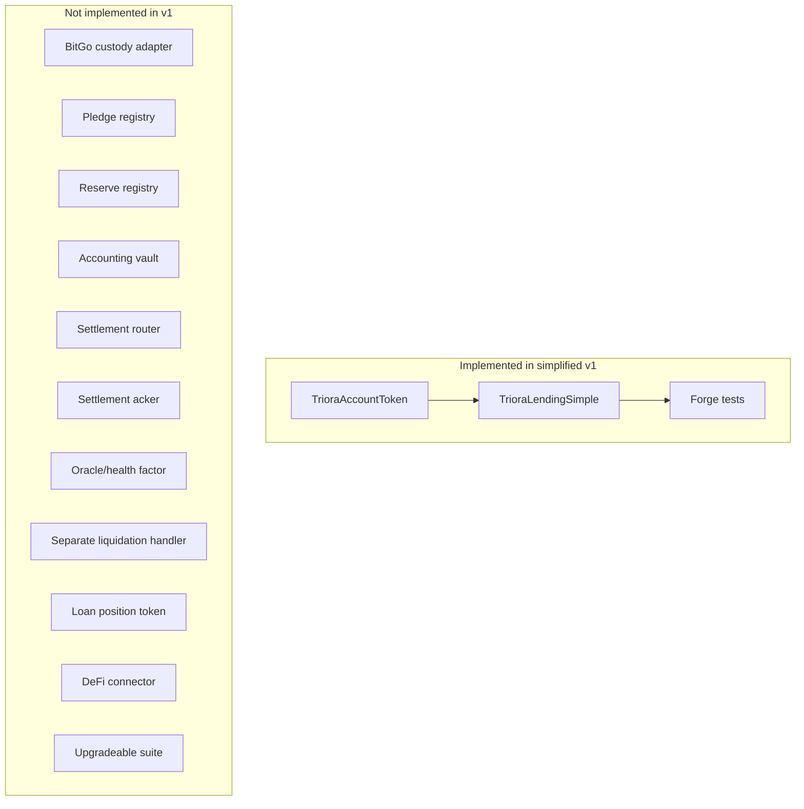
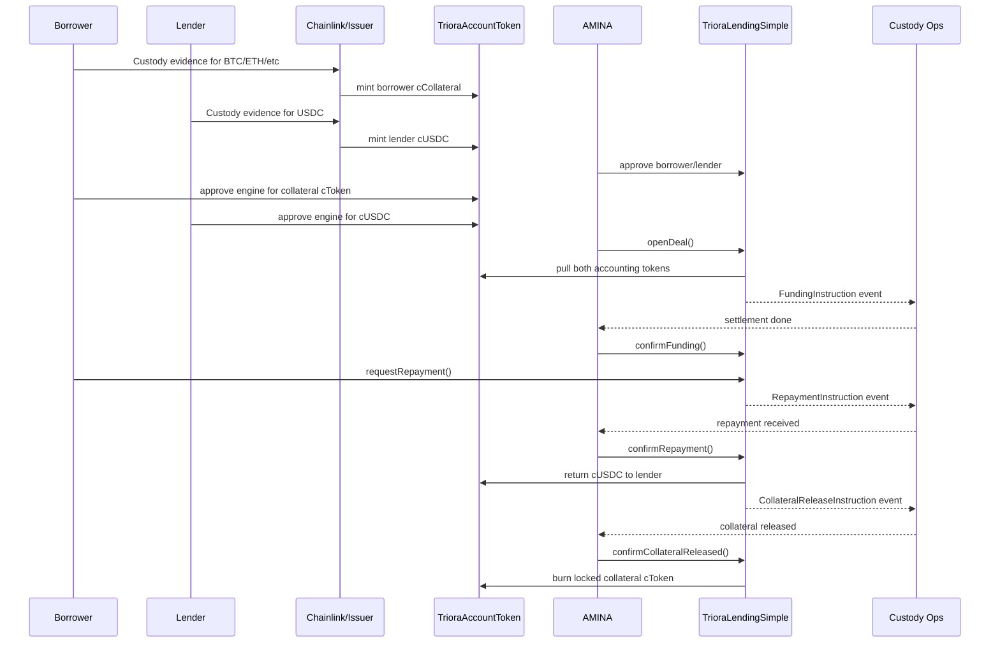
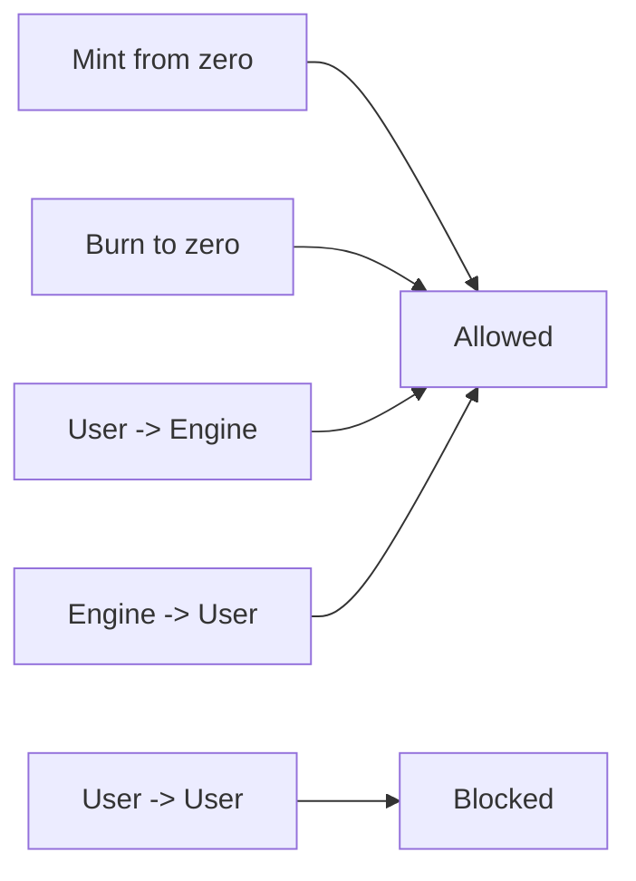
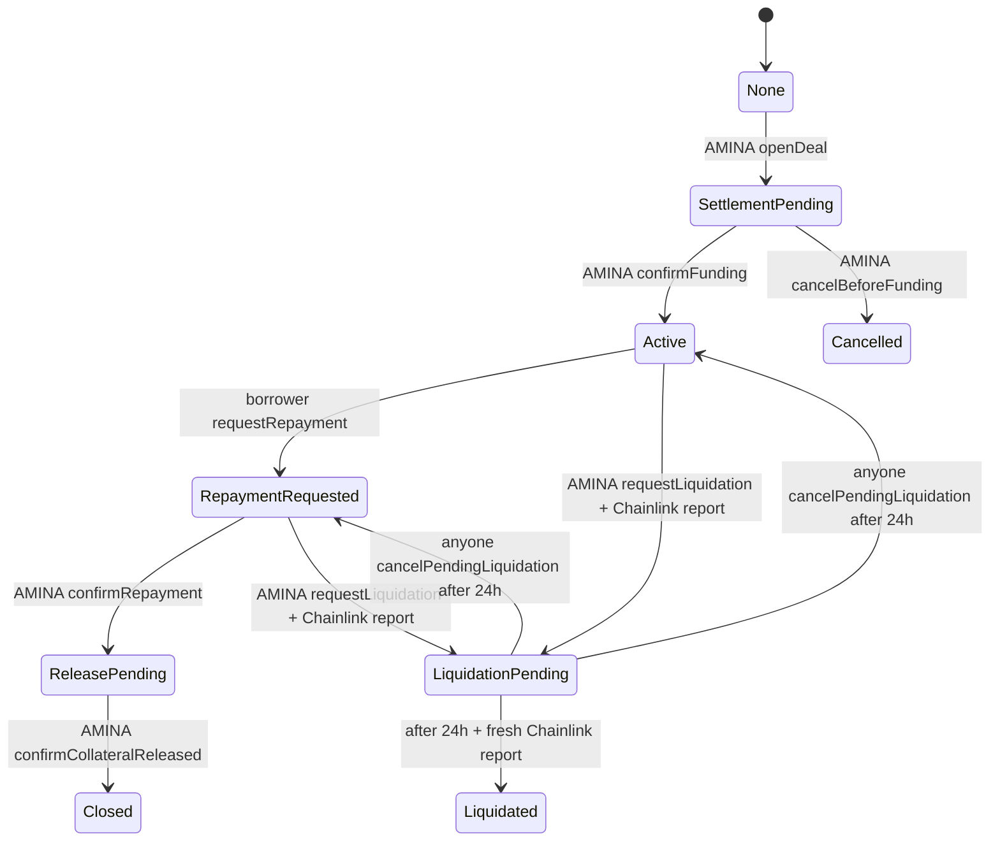
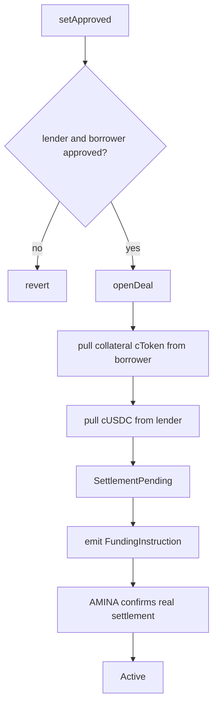
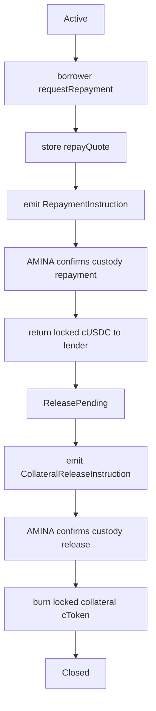
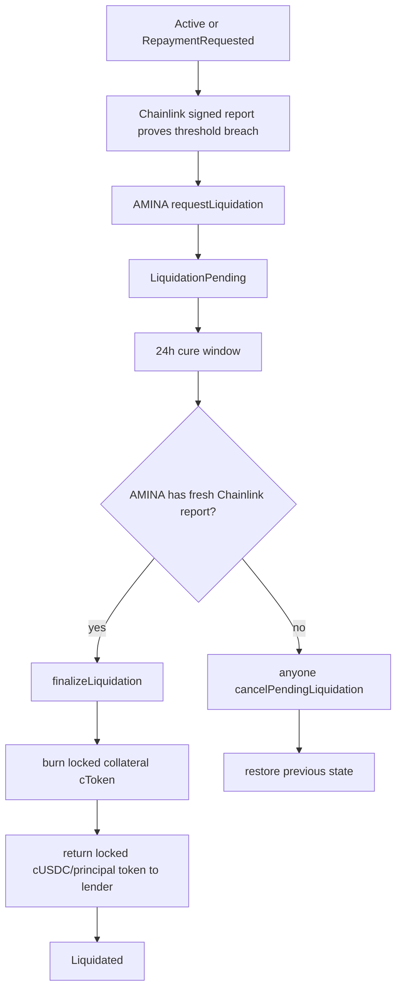
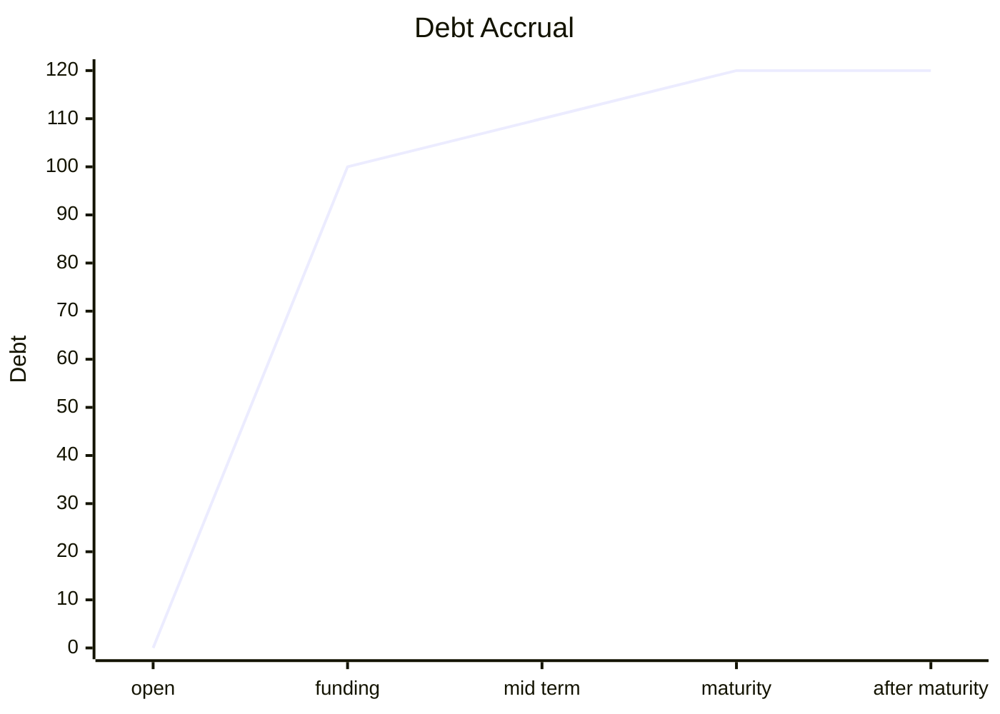
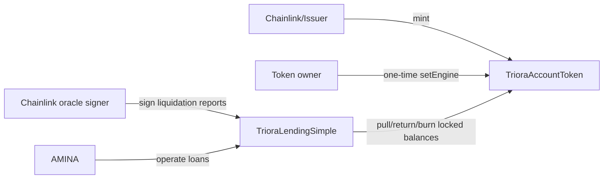

# Triora Smart Contract Implementation Plan - Simplified V1

## Goal

This plan replaces the previous multi-layer BitGo-specific contract suite with the smallest production-shaped
Triora v1 that still supports the product vision in `Triora.html` and `Triora - Lend & Borrow.html`.

The simplified system has two contract types:

1. `TrioraAccountToken`
   - Restricted ERC-20 accounting token for custody-backed balances such as `cBTC`, `cETH`, and `cUSDC`.
   - Chainlink/issuer mints after offchain custody verification.
   - The lending engine can lock tokens and burn locked collateral tokens after AMINA confirms custody release or
     liquidation.
   - User-to-user transfers are disabled.

2. `TrioraLendingSimple`
   - Single deal state machine.
   - AMINA is the only onchain operations role.
   - Holds accounting tokens while a matched loan is pending, active, repaid, released, or liquidated.
   - Emits custody instructions and stores lifecycle evidence references.

Everything else is deferred.



## Design Constraints

- Contracts never custody real BTC, ETH, SOL, USDC, or bank money.
- The onchain system is an institutional accounting and evidence layer.
- AMINA performs KYB, credit terms, custody coordination, repayment confirmation, and liquidation operations offchain.
- Chainlink oracle reports determine liquidation eligibility onchain.
- Chainlink/issuer performs custody observation and mints cTokens.
- Settlement is not considered complete when a match is opened. Interest starts only after AMINA confirms funding.
- v1 supports full repayment and full liquidation only.
- v1 does not implement secondary markets, automated liquidations, or DeFi composability.



## Contract Set

### `src/simple/TrioraAccountToken.sol`

Purpose: represent a custody-backed institutional accounting balance.

Responsibilities:

- ERC-20 balance interface for the UI and integrations.
- Immutable issuer/minter.
- One-time engine binding.
- Mint only by issuer.
- Burn only by engine and only from the engine's own locked balance.
- Block direct user-to-user transfers.
- Allow transfers between user and engine so loan escrow is possible.

Non-responsibilities:

- No CMTAT module stack.
- No freeze list.
- No pause.
- No rule engine.
- No registry lookup.
- No holder partitions.
- No collateral proof verification.
- No user-managed redemption.

The transfer rule is intentionally tiny:



Planned interface:

```solidity
constructor(
    string memory name_,
    string memory symbol_,
    uint8 decimals_,
    address issuer_,
    address owner_
)

function setEngine(address engine_) external onlyOwner;
function mint(address to, uint256 amount, bytes32 evidenceRef) external onlyIssuer;
function burnLocked(uint256 amount, bytes32 reasonRef) external onlyEngine;
function decimals() public view override returns (uint8);
```

Events:

- `EngineSet(address engine)`
- `Minted(address to, uint256 amount, bytes32 evidenceRef)`
- `BurnedLocked(uint256 amount, bytes32 reasonRef)`

Errors:

- `ZeroAddress`
- `ZeroAmount`
- `ZeroReference`
- `OnlyIssuer`
- `OnlyEngine`
- `EngineAlreadySet`
- `TransferRestricted`

### `src/simple/TrioraLendingSimple.sol`

Purpose: run the minimal matched loan lifecycle.

Responsibilities:

- Maintain entity approval flags for the UI and deal admission.
- Open matched deals from AMINA-approved parties.
- Pull borrower collateral cToken and lender reserve cToken into escrow.
- Emit funding, repayment, release, and liquidation instructions.
- Start interest only when AMINA confirms funding.
- Compute simple pro-rata interest.
- Return lender principal accounting token after repayment or liquidation settlement.
- Burn borrower collateral accounting token after AMINA confirms custody release or liquidation.

Non-responsibilities:

- No lender/borrower signatures. AMINA is the regulated matching and operations role.
- No automated matching.
- No onchain custody adapter.
- No onchain custody proof parser.
- No continuous oracle health factor. The only oracle logic is liquidation-time Chainlink report verification.
- No LTV, margin call, or health factor.
- No partial repayment.
- No collateral top-up.
- No position token.
- No external liquidation executor.
- No upgradeability.



Planned data model:

```solidity
enum DealState {
    None,
    SettlementPending,
    Active,
    RepaymentRequested,
    ReleasePending,
    Closed,
    LiquidationPending,
    Liquidated,
    Cancelled
}

struct OpenDealParams {
    address lender;
    address borrower;
    TrioraAccountToken collateralToken;
    TrioraAccountToken principalToken;
    uint256 principalAmount;
    uint256 collateralAmount;
    uint32 rateBps;
    uint64 maturityTs;
    bytes32 legalTermsHash;
    bytes32 collateralRef;
    bytes32 reserveRef;
    bytes32 borrowerReleaseRef;
    bytes32 lenderSettlementRef;
    bytes32 aminaLiquidationRef;
}

struct Deal {
    address lender;
    address borrower;
    TrioraAccountToken collateralToken;
    TrioraAccountToken principalToken;
    uint256 principalAmount;
    uint256 collateralAmount;
    uint32 rateBps;
    uint64 maturityTs;
    uint64 fundedAt;
    uint256 repayQuote;
    DealState state;
    bytes32 legalTermsHash;
    bytes32 collateralRef;
    bytes32 reserveRef;
    bytes32 borrowerReleaseRef;
    bytes32 lenderSettlementRef;
    bytes32 aminaLiquidationRef;
}

struct LiquidationOracleReport {
    bytes32 dealId;
    bytes32 legalTermsHash;
    address collateralToken;
    address principalToken;
    uint256 debtValue;
    uint256 collateralValue;
    uint32 liquidationThresholdBps;
    uint64 observedAt;
    uint64 expiresAt;
    bytes32 reportRef;
}

struct PendingLiquidation {
    DealState previousState;
    uint64 requestedAt;
    bytes32 initialReportRef;
    uint256 initialDebtValue;
    uint256 initialCollateralValue;
    uint32 liquidationThresholdBps;
}
```

Admission and lifecycle:



Repayment:



Liquidation:



Planned interface:

```solidity
constructor(address amina_, address chainlinkOracle_)

function setApproved(address account, bool isApproved, bytes32 evidenceRef) external onlyAmina;
function openDeal(OpenDealParams calldata p) external onlyAmina returns (bytes32 dealId);
function confirmFunding(bytes32 dealId, bytes32 settlementRef) external onlyAmina;
function cancelBeforeFunding(bytes32 dealId, bytes32 reasonRef) external onlyAmina;
function outstanding(bytes32 dealId) public view returns (uint256);
function requestRepayment(bytes32 dealId) external returns (uint256 repayQuote);
function confirmRepayment(bytes32 dealId, bytes32 settlementRef) external onlyAmina;
function confirmCollateralReleased(bytes32 dealId, bytes32 releaseRef) external onlyAmina;
function requestLiquidation(
    bytes32 dealId,
    LiquidationOracleReport calldata report,
    bytes calldata signature
) external onlyAmina;
function finalizeLiquidation(
    bytes32 dealId,
    LiquidationOracleReport calldata report,
    bytes calldata signature,
    bytes32 settlementRef
) external onlyAmina;
function cancelPendingLiquidation(bytes32 dealId, bytes32 reasonRef) external;
function getDeal(bytes32 dealId) external view returns (Deal memory);
function getPendingLiquidation(bytes32 dealId) external view returns (PendingLiquidation memory);
function stateOf(bytes32 dealId) external view returns (DealState);
function hashLiquidationReport(LiquidationOracleReport calldata report) external view returns (bytes32);
```

Events:

- `EntityApproved(address account, bool approved, bytes32 evidenceRef)`
- `DealOpened(bytes32 dealId, address lender, address borrower, address collateralToken, address principalToken, uint256 principalAmount, uint256 collateralAmount)`
- `FundingInstruction(bytes32 dealId, bytes32 reserveRef, bytes32 lenderSettlementRef, uint256 amount, uint64 deadline)`
- `FundingConfirmed(bytes32 dealId, bytes32 settlementRef, uint64 fundedAt)`
- `DealCancelled(bytes32 dealId, bytes32 reasonRef)`
- `RepaymentInstruction(bytes32 dealId, bytes32 reserveRef, uint256 amount, bytes32 lenderSettlementRef)`
- `RepaymentConfirmed(bytes32 dealId, bytes32 settlementRef, uint256 amount)`
- `CollateralReleaseInstruction(bytes32 dealId, bytes32 collateralRef, bytes32 borrowerReleaseRef, uint256 amount)`
- `CollateralReleased(bytes32 dealId, bytes32 releaseRef)`
- `LiquidationInstruction(bytes32 dealId, bytes32 collateralRef, bytes32 aminaLiquidationRef, uint256 amount, bytes32 reportRef, uint64 cureDeadline)`
- `LiquidationFinalized(bytes32 dealId, bytes32 settlementRef, bytes32 reportRef)`
- `LiquidationCancelled(bytes32 dealId, address caller, bytes32 reasonRef)`

## Interest Model

The simplified engine computes simple interest:

```text
interest = principal * rateBps * elapsed / 10_000 / 365 days
```

Rules:

- `elapsed` starts at `fundedAt`, not at `openDeal`.
- `elapsed` is capped at `maturityTs`.
- `outstanding` returns zero before funding and after terminal states.
- When the borrower requests repayment, the quote is snapshotted and used through release.



This is deliberately not a full loan accounting engine. Fees, late interest, default interest, and net settlement
differences stay in AMINA's offchain statement and legal terms for v1.

## Access Control

Only three privileged identities exist:



This avoids:

- AccessManager configuration errors.
- Role graph drift.
- Separate acker/liquidator/router permissioning.
- Borrower/lender signature-domain and nonce mistakes.
- Upgrade admin complexity.

## Test Plan

Add `test/triora/TrioraSimple.t.sol`.

Required tests:

1. Happy path:
   - issuer mints `cBTC` to borrower and `cUSDC` to lender;
   - AMINA approves both entities;
   - AMINA opens a deal;
   - interest is zero before funding;
   - AMINA confirms funding;
   - interest accrues after funding;
   - borrower requests repayment;
   - AMINA confirms repayment;
   - lender principal token is returned;
   - AMINA confirms collateral release;
   - collateral cToken is burned.

2. Cancellation:
   - AMINA cancels before funding;
   - locked tokens return to borrower and lender;
   - state becomes `Cancelled`.

3. Liquidation:
   - AMINA funds an active deal;
   - AMINA requests liquidation with a Chainlink-signed report proving the threshold breach;
   - finalization before the 24-hour cure window reverts;
   - AMINA finalizes only with a fresh Chainlink-signed report observed after the cure window;
   - healthy reports are rejected;
   - wrong-signature reports are rejected;
   - anyone can cancel after the cure window if AMINA has not finalized;
   - collateral token is burned;
   - principal token is returned to lender;
   - state becomes `Liquidated`.

4. Transfer restrictions:
   - direct user-to-user token transfer reverts;
   - user-to-engine and engine-to-user transfers are allowed through loan flows.

5. Authorization:
   - non-AMINA cannot approve entities, open deals, confirm funding, cancel unfunded deals, confirm repayment, release collateral, request liquidation, or finalize liquidation.
   - anyone can cancel pending liquidation after the 24-hour cure window.
   - non-issuer cannot mint.
   - non-engine cannot burn locked balances.

6. State machine guards:
   - repayment cannot be requested before funding;
   - funding cannot be confirmed twice;
   - terminal deals cannot move again.

7. Parameter guards:
   - zero addresses revert;
   - zero amounts revert;
   - unapproved parties revert;
   - expired maturity reverts;
   - zero or above-10000-bps rate reverts;
   - zero legal/custody references revert.

## Verification Commands

Focused simplified suite:

```bash
forge test --match-path test/triora/TrioraSimple.t.sol -vvv
```

Full regression:

```bash
forge test -vvv
```

## Audit Surface

The simplified v1 audit surface is intentionally small:

```mermaid
flowchart TD
    A[TrioraAccountToken._update] --> B[Transfer restriction]
    C[TrioraAccountToken.mint] --> D[Issuer-only supply increase]
    E[TrioraAccountToken.burnLocked] --> F[Engine-only supply decrease]
    G[TrioraLendingSimple.openDeal] --> H[Admission + escrow]
    I[TrioraLendingSimple.confirmFunding] --> J[Interest start]
    K[TrioraLendingSimple.requestRepayment] --> L[Quote snapshot]
    M[TrioraLendingSimple.confirmRepayment] --> N[Principal token return]
    O[TrioraLendingSimple.confirmCollateralReleased] --> P[Collateral token burn]
    Q[TrioraLendingSimple.requestLiquidation] --> R[Chainlink report + pending state]
    S[TrioraLendingSimple.finalizeLiquidation] --> T[Fresh report + burn collateral + return principal token]
    U[TrioraLendingSimple.cancelPendingLiquidation] --> V[Anyone cancel after cure window]
```



The primary risks to review are:

- whether accounting tokens can be moved outside intended escrow paths;
- whether tokens can become stuck in non-terminal states;
- whether repayment, release, or liquidation can be confirmed by the wrong actor;
- whether liquidation can occur without valid fresh Chainlink reports;
- whether the 24-hour cure window can be bypassed;
- whether interest starts before real funding;
- whether AMINA operational references are emitted and stored consistently.

## Explicit Non-Goals

The following features are out of scope for this simplified implementation:

- BitGo API proof parsing or onchain custody account registry;
- full Chainlink OCR/Functions DON aggregation internals; simplified v1 verifies signed liquidation reports only;
- ERC-3643/CMTAT-style full compliance token;
- `AccessManager` role matrix;
- borrower/lender EIP-712 signatures;
- offchain matcher commitment verification;
- partial repay;
- partial liquidation;
- collateral substitution;
- margin calls;
- automated default;
- secondary market;
- ERC-721 or ERC-1155 loan tokens;
- vault abstraction;
- upgradeability;
- cross-chain messaging.

These exclusions are the design. They are not missing implementation work.
