# Triora Smart Contract Implementation Plan

Date: 2026-06-26

Scope: complete Solidity implementation plan for the Triora protocol contracts. This plan assumes the architecture in `docs/Triora-architecture.md` and the current P2PxAmina Foundry codebase under `src/`.

## Executive Decision

Do not mutate the current P2PxAmina repo rail into Triora by small patches. Keep the strong pieces, but deploy a v2 contract set because Triora has a different activation model.

The current prototype uses atomic activation:

```text
match -> pull lender token -> send supply to borrower -> pull collateral -> mark Active
```

Triora must use custody-backed staged activation:

```text
match -> lock cCollateral -> lock cUSDC reserve -> emit funding instruction
-> custody transfer confirmed -> mark Active -> start interest
```

That is the central implementation shift.

## Current Baseline To Reuse

The existing implementation already has useful foundations:

| Existing contract | Reuse decision | Notes |
| --- | --- | --- |
| `RoleManager` | Keep | Based on OpenZeppelin `AccessManager`; good authority pattern. |
| `KYBGateway` | Extend to v2 | Needs entity-wallet model, expiry, and AMINA client refs. |
| `IssuerRegistry` | Extend to v2 | Needs tokenization metadata, adapter links, transfer-policy flags. |
| `ComplianceRegistry` | Keep/extend | Pre/post hooks are useful for transfer and lifecycle checks. |
| `CollateralRegistry` | Replace with `MarketRegistryV2` or heavily extend | Current pair registry is useful but Triora markets need custody tier, reserve source, settlement parameters. |
| `ParameterArchive` | Keep | Immutable parameter snapshots are exactly right. |
| `DealRegistry` | Replace with `DealRegistryV2` | New terms need pledge/reserve IDs, settlement route, interest start, legal refs. |
| `EscrowVault` | Replace with `AccountingVaultV2` for new deployment | Current vault is strong, but Triora needs explicit lock/unlock semantics and status-aware cToken movement. |
| `LendingEngine` | Replace with `LendingEngineV2` | Current `openAndActivate` is too atomic for custody settlement. |
| `LiquidationHandler` | Extend to v2 | Preserve AMINA-only liquidation and signed price attestations; add release vouchers and custody ack. |
| `SettlementRouter` | Add `SettlementRouterV2` | Current immutable event-router pattern is correct; new events need pledge/reserve/voucher fields. |
| `PortfolioLens` | Replace/extend | Needs evidence, reserve, settlement, and report states. |

## Target Contract Map

```mermaid
flowchart TB
    classDef keep fill:#e0f2fe,stroke:#0284c7,color:#111
    classDef v2 fill:#dcfce7,stroke:#16a34a,color:#111
    classDef new fill:#fef3c7,stroke:#d97706,color:#111
    classDef token fill:#fae8ff,stroke:#a21caf,color:#111
    classDef imm fill:#fee2e2,stroke:#dc2626,color:#111

    subgraph Access["Access and governance"]
        RoleManager[RoleManager]
        Timelock[AccessManager schedules]
    end

    subgraph Identity["Identity, legal, compliance"]
        KYB[KYBGatewayV2]
        Wallets[WalletRegistry]
        Agreements[AgreementRegistry]
        Compliance[ComplianceRegistryV2]
        Issuers[IssuerRegistryV2]
    end

    subgraph Evidence["Evidence and oracle layer"]
        CRE[CREReportReceiver]
        PriceHub[PriceOracleHub]
        ReserveGuard[ReserveGuard]
        CustodyAdapters[CustodyAdapterRegistry]
    end

    subgraph Tokenization["Tokenization"]
        TokenReg[TokenizationRegistry]
        Pledges[PledgeRegistry]
        Reserves[ReserveRegistry]
        cColl[cBTC/cETH PermissionedCollateralToken]
        cUSDC[cUSDC ReserveToken]
        LoanNote[LoanNote optional v2]
    end

    subgraph Market["Markets and risk"]
        MarketReg[MarketRegistryV2]
        Params[ParameterArchive]
        FeeController[FeeController]
    end

    subgraph Deals["Orders, deals, settlement"]
        Orders[OrderRegistry]
        DealReg[DealRegistryV2]
        Vault[AccountingVaultV2]
        Engine[LendingEngineV2]
        Router[SettlementRouterV2]
        Acker[SettlementAcker]
        Release[ReleaseAuthorizer]
    end

    subgraph Liquidation["Risk actions"]
        Liq[LiquidationHandlerV2]
    end

    subgraph Views["Read layer"]
        Portfolio[PortfolioLensV2]
        EvidenceLens[EvidenceLens]
    end

    RoleManager --> KYB
    RoleManager --> Agreements
    RoleManager --> Issuers
    RoleManager --> MarketReg
    RoleManager --> Engine
    RoleManager --> Liq
    RoleManager --> Acker
    RoleManager --> CRE

    KYB --> Compliance
    Wallets --> KYB
    Agreements --> Engine
    Issuers --> TokenReg
    CustodyAdapters --> TokenReg
    CRE --> Pledges
    CRE --> Reserves
    ReserveGuard --> TokenReg
    PriceHub --> MarketReg
    TokenReg --> Pledges
    TokenReg --> Reserves
    Pledges --> cColl
    Reserves --> cUSDC
    MarketReg --> Params
    Orders --> Engine
    DealReg --> Engine
    Vault --> Engine
    Engine --> Router
    Router --> Acker
    Acker --> Engine
    Engine --> Release
    Liq --> Release
    Liq --> Engine
    Engine --> Portfolio
    Pledges --> EvidenceLens
    Reserves --> EvidenceLens

    class RoleManager,Params keep
    class KYB,Compliance,Issuers,MarketReg,DealReg,Vault,Engine,Router,Liq,Portfolio v2
    class Wallets,Agreements,CRE,PriceHub,ReserveGuard,CustodyAdapters,TokenReg,Pledges,Reserves,Orders,Acker,Release,FeeController,EvidenceLens new
    class cColl,cUSDC,LoanNote token
```

## Implementation Phases

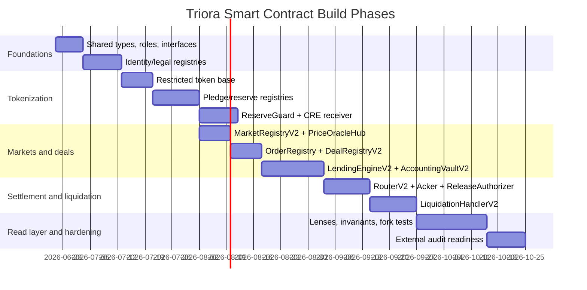

The durations are placeholders for sequencing. Audit, legal review, and custody integration will dominate the real calendar.

## Shared Libraries And Types

### `TypesV2`

Add a new library instead of breaking `Types.sol` layouts used by existing contracts.

Core enums:

```solidity
enum AssuranceTier {
    Unknown,
    QualifiedCustody,
    SmartAccountPilot,
    Unsupported
}

enum ReportStatus {
    None,
    Pending,
    Valid,
    Stale,
    Disputed,
    Failed
}

enum PledgeStatus {
    None,
    Requested,
    ControlActive,
    ReportValid,
    Active,
    PartiallyEncumbered,
    FullyEncumbered,
    ReleasePending,
    Released,
    Liquidated,
    Frozen
}

enum ReserveStatus {
    None,
    Requested,
    Available,
    OrderLocked,
    SettlementPending,
    Funded,
    Returned,
    Released,
    Frozen
}

enum OrderStatus {
    None,
    Draft,
    Submitted,
    Matched,
    Expired,
    Cancelled
}

enum DealStateV2 {
    None,
    Matched,
    CollateralReserved,
    LiquidityReserved,
    SettlementPending,
    Active,
    Warned,
    PartialLiquidated,
    RepaymentPending,
    Repaid,
    ReleasePending,
    Closed,
    LiquidationPending,
    Liquidated,
    Defaulted,
    Cancelled,
    Failed
}
```

Core structs:

```solidity
struct DealIntentV2 {
    address lender;
    address borrower;
    bytes32 marketId;
    bytes32 pledgeId;
    bytes32 reserveId;
    address collateralToken;
    address reserveToken;
    address loanAsset;
    uint128 principal;
    uint128 collateralAmount;
    uint32 rateBps;
    uint64 orderValidUntil;
    uint64 maturityTs;
    bytes32 settlementRouteHash;
    bytes32 legalTermsHash;
    bytes32 nonceLender;
    bytes32 nonceBorrower;
    bytes32 nonceAmina;
}

struct DealTermsV2 {
    address lender;
    address borrower;
    bytes32 marketId;
    bytes32 pledgeId;
    bytes32 reserveId;
    address collateralToken;
    address reserveToken;
    address loanAsset;
    uint128 principal;
    uint128 collateralAmount;
    uint32 rateBps;
    uint64 matchedAt;
    uint64 interestStartTs;
    uint64 maturityTs;
    uint32 paramVersion;
    bytes32 settlementRouteHash;
    bytes32 legalTermsHash;
}

struct DealRuntimeV2 {
    DealStateV2 state;
    uint128 outstanding;
    uint128 collateralLocked;
    uint64 lastTouchTs;
    uint64 settlementDeadline;
    uint64 totalPausedTime;
    uint64 pauseStartedAt;
    uint8 liquidationStep;
    bytes32 lastReason;
}

struct VerifiedReport {
    bytes32 reportId;
    bytes32 workflowId;
    bytes32 subjectId;
    address assetOrToken;
    uint256 amount;
    uint8 decimals;
    uint64 observedAt;
    uint64 expiresAt;
    bytes32 reportHash;
}
```

### `ErrorsV2`

Add explicit errors. Do not rely on generic `InvalidParams`.

Required categories:

- identity and eligibility;
- tokenization and reserve proof;
- stale reports;
- custody control missing;
- pledge over-encumbered;
- reserve over-locked;
- unsupported assurance tier;
- invalid deal state;
- settlement deadline expired;
- invalid acknowledgement;
- invalid report forwarder/workflow;
- release not authorized;
- oracle stale or negative;
- cap exceeded.

### `EIP712HashesV2`

Add typed hashes for:

- `DealIntentV2`;
- `OrderIntent`;
- `SettlementAck`;
- `RepaymentAck`;
- `ReleaseAck`;
- `CustodyAttestation`;
- `AminaApproval`;
- `DualPriceAttestationV2`.

Every signature must bind:

- `chainId`;
- verifying contract;
- market ID;
- token addresses;
- pledge/reserve IDs;
- amount;
- expiry;
- nonce.

## Contract Catalog

### 1. `RoleManager`

Status: keep existing pattern.

Purpose: single authority for protocol roles and scheduled access.

Roles:

| Role | Holder |
| --- | --- |
| `GOVERNOR` | multisig/timelock |
| `AMINA_ADMIN` | AMINA operational multisig |
| `KYB_OPERATOR` | AMINA KYB service |
| `MATCHING_OPERATOR` | AMINA-approved matching service |
| `CUSTODY_OPERATOR` | custody listener/acker service |
| `RISK_MANAGER` | AMINA risk team |
| `LIQUIDATOR` | AMINA liquidation signer/service |
| `REPORT_MANAGER` | Chainlink/CRE report config admin |
| `PAUSER` | emergency multisig |
| `UPGRADER` | timelock only |

Implementation notes:

- preserve `AccessManager` use;
- require timelock for upgrade, market changes, custodian admission, token admission, oracle changes;
- allow fast emergency pause with post-facto governance review.

### 2. `KYBGatewayV2`

Status: extend existing.

Purpose: entity-level approval and wallet-level authorization.

Storage:

- `mapping(bytes32 entityId => EntityRecord)`;
- `mapping(address wallet => bytes32 entityId)`;
- `mapping(bytes32 entityId => mapping(bytes32 marketId => Eligibility))`;
- `mapping(bytes32 entityId => bool suspended)`.

Functions:

- `approveEntity(EntityRecord record)`;
- `suspendEntity(bytes32 entityId, bytes32 reason)`;
- `registerWallet(bytes32 entityId, address wallet, bytes32 walletType)`;
- `revokeWallet(address wallet, bytes32 reason)`;
- `setMarketEligibility(bytes32 entityId, bytes32 marketId, Eligibility eligibility)`;
- `isApprovedEntity(bytes32 entityId)`;
- `isApprovedWallet(address wallet)`;
- `entityOf(address wallet)`.

Events:

- `EntityApproved`;
- `EntitySuspended`;
- `WalletRegistered`;
- `WalletRevoked`;
- `EligibilitySet`.

Interactions:

- `LendingEngineV2` checks lender and borrower wallet approval;
- `OrderRegistry` checks order submitter eligibility;
- `ComplianceRegistryV2` may block transfers if entity suspended.

Tests:

- expired KYB blocks matching;
- suspended wallet blocks activation but not repayment;
- wallet cannot be attached to two active entities;
- eligibility caps are market-specific.

### 3. `WalletRegistry`

Status: new, optional if not folded into `KYBGatewayV2`.

Purpose: cleanly separate legal entity approval from wallet control.

Recommendation: include this only if AMINA expects multiple custody wallets, Safe wallets, and operational wallets per entity. If v1 has one wallet per entity, fold into `KYBGatewayV2`.

### 4. `AgreementRegistry`

Status: new.

Purpose: store hashes and lifecycle of legal documents.

Document types:

- master services agreement;
- loan terms template;
- collateral control agreement;
- custody account agreement;
- AMINA brokerage/client agreement;
- market eligibility schedule;
- privacy/counterparty disclosure schedule.

Storage:

- `mapping(bytes32 agreementId => Agreement)`;
- `mapping(bytes32 entityId => bytes32[] agreementIds)`;
- `mapping(bytes32 dealId => bytes32 legalTermsHash)`.

Functions:

- `recordAgreement(...)`;
- `expireAgreement(bytes32 agreementId)`;
- `bindDealTerms(bytes32 dealId, bytes32 legalTermsHash)`;
- `hasRequiredAgreements(bytes32 entityId, bytes32 marketId)`.

Invariants:

- a deal cannot become `Matched` without required agreement refs;
- agreement expiry blocks new deals but does not break repayment or liquidation.

### 5. `ComplianceRegistryV2`

Status: extend existing.

Purpose: policy hooks for token transfers and deal lifecycle actions.

Add lifecycle actions:

- `TOKENIZE_COLLATERAL`;
- `RESERVE_USDC`;
- `SUBMIT_ORDER`;
- `MATCH_DEAL`;
- `CONFIRM_FUNDING`;
- `REPAY`;
- `RELEASE_COLLATERAL`;
- `LIQUIDATE`;
- `CANCEL_SETTLEMENT`.

The registry should stay hook-based, but hook failure rules must be explicit:

- pre-check failures revert;
- post-notify failures are logged and do not roll back critical repayment/release paths unless configured as strict.

### 6. `IssuerRegistryV2`

Status: extend existing.

Purpose: token admission and issuer/custodian metadata.

Add fields:

- `bool restrictedTransfer`;
- `bool pledgeBound`;
- `bool reserveBacked`;
- `address tokenizationRegistry`;
- `bytes32 custodianId`;
- `AssuranceTier minAssuranceTier`;
- `bytes32 proofPolicyId`;

Functions:

- `addTokenV2(address token, TokenInfoV2 info)`;
- `setTokenizationPolicy(address token, bytes32 proofPolicyId)`;
- `pauseCustodian(bytes32 custodianId, bool paused)`;
- `isRestrictedToken(address token)`;
- `proofPolicyOf(address token)`.

Tests:

- admitted cTokens must be restricted;
- non-standard external ERC20s rejected;
- paused custodian pauses dependent tokens;
- dual-use remains disabled by default.

### 7. `CustodyAdapterRegistry`

Status: new.

Purpose: map custody providers and assurance tiers to adapter contracts and validation policies.

Storage:

- `mapping(bytes32 custodianId => CustodianConfig)`;
- `mapping(bytes32 adapterId => address adapter)`;
- `mapping(bytes32 custodyAccountRef => CustodyAccountRecord)`.

Functions:

- `addCustodian(bytes32 custodianId, CustodianConfig cfg)`;
- `setAdapter(bytes32 custodianId, address adapter)`;
- `registerCustodyAccount(...)`;
- `setAssuranceTier(bytes32 accountRef, AssuranceTier tier)`;
- `isCustodyAccountEligible(...)`.

Adapter interface:

```solidity
interface ICustodyAdapter {
    function verifyCustodyAttestation(bytes calldata attestation)
        external
        view
        returns (bool ok, bytes32 subjectId, uint256 amount, uint64 observedAt, bytes32 reason);

    function latestReserve(bytes32 subjectId)
        external
        view
        returns (uint256 amount, uint8 decimals, uint64 observedAt, uint64 expiresAt);

    function isControlActive(bytes32 custodyAccountRef)
        external
        view
        returns (bool);
}
```

Implementation note:

- v1 adapter can verify AMINA/custodian EIP-712 signatures and Chainlink reports;
- do not put custodian API calls onchain;
- all offchain data arrives as signed reports or acknowledgements.

### 8. `CREReportReceiver`

Status: new.

Purpose: accept Chainlink CRE reports and make them consumable by registries.

Storage:

- authorized forwarders;
- workflow config by workflow ID;
- report schema configs;
- `mapping(bytes32 reportId => VerifiedReport)`;
- `mapping(bytes32 subjectId => bytes32 latestReportId)`;
- consumed reports.

Functions:

- `setWorkflowConfig(...)`;
- `receiveReport(bytes calldata report, bytes calldata signaturesOrMetadata)`;
- `latestReport(bytes32 subjectId)`;
- `consumeReport(bytes32 reportId, bytes32 consumerContext)`;
- `pauseWorkflow(bytes32 workflowId, bool paused)`.

Validation:

- `msg.sender` is exact authorized forwarder;
- report binds chain ID and receiver address;
- workflow ID and owner are approved;
- schema version is supported;
- subject ID matches asset/account/policy;
- timestamp fresh;
- report ID unused;
- amount non-negative and decimals expected;
- consumer context prevents cross-use of pledge reports as reserve reports.

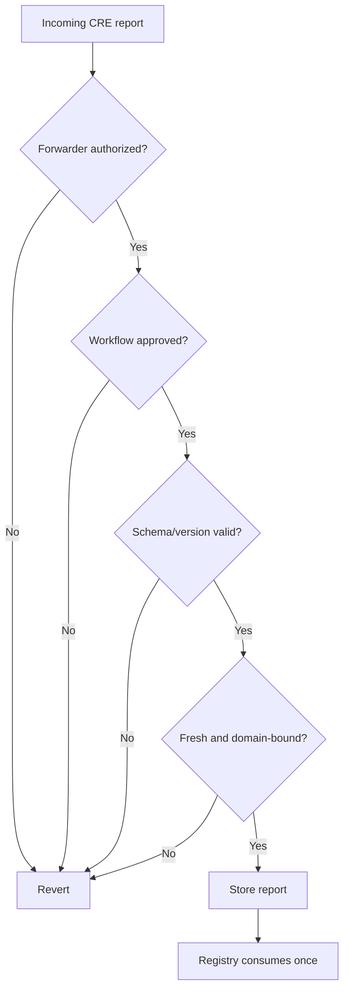

Tests:

- report replay blocked;
- wrong chain blocked;
- wrong receiver blocked;
- stale report blocked;
- wrong workflow blocked;
- report cannot be consumed for a different token/account.

### 9. `ReserveGuard`

Status: new.

Purpose: enforce reserve-backed minting and reservation.

Rule:

```text
newTokenSupplyOrReserveUsage <= min(freshPoR, freshCustodianOrCREReport) - positiveMargin
```

Storage:

- per-token reserve policies;
- allowed report sources;
- feed decimals;
- max staleness;
- positive margin mode;
- reserve caps.

Functions:

- `setReservePolicy(address token, ReservePolicy policy)`;
- `effectiveReserveLimit(address token)`;
- `canMint(address token, uint256 mintAmount)`;
- `canReserve(bytes32 reserveId, uint256 amount)`;
- `validateFreshReport(address token, bytes32 reportId)`.

Never allow negative reserve margins in v1.

Tests:

- negative PoR answer rejected;
- stale PoR rejected;
- decimals scaled correctly;
- total supply cannot exceed reserve limit;
- min-of-two sources used when both exist;
- fallback to custodian-only allowed only if policy says pilot.

### 10. `TokenizationRegistry`

Status: new.

Purpose: central config for each tokenized asset.

Storage:

- `mapping(address token => TokenizationConfig)`;
- allowed pledge/reserve registry;
- reserve guard;
- custodian adapter;
- mint/burn roles.

Functions:

- `registerCollateralToken(address token, TokenizationConfig cfg)`;
- `registerReserveToken(address token, TokenizationConfig cfg)`;
- `pauseTokenization(address token, bool paused)`;
- `validateMint(address token, bytes32 subjectId, uint256 amount)`;
- `validateBurnOrRelease(address token, bytes32 subjectId, uint256 amount)`.

Interactions:

- called by cTokens before mint/burn;
- calls `ReserveGuard`;
- checks `PledgeRegistry` or `ReserveRegistry`.

### 11. `PledgeRegistry`

Status: new.

Purpose: source of truth for collateral pledges and encumbrance.

Storage:

```solidity
struct Pledge {
    bytes32 pledgeId;
    bytes32 entityId;
    bytes32 custodyAccountRef;
    bytes32 custodianId;
    address collateralToken;
    bytes32 assetId;
    uint256 pledgedAmount;
    uint256 mintedAmount;
    uint256 freeAmount;
    uint256 encumberedAmount;
    PledgeStatus status;
    bytes32 latestReportId;
    bytes32 controlAgreementHash;
}
```

Functions:

- `requestPledge(...)`;
- `activatePledge(bytes32 pledgeId, bytes32 reportId, bytes calldata aminaApproval)`;
- `recordMint(bytes32 pledgeId, uint256 amount)`;
- `lockForDeal(bytes32 pledgeId, bytes32 dealId, uint256 amount)`;
- `unlockFromDeal(bytes32 pledgeId, bytes32 dealId, uint256 amount)`;
- `markReleasePending(bytes32 pledgeId, bytes32 voucherId)`;
- `markReleased(bytes32 pledgeId, bytes32 ackId)`;
- `markLiquidated(bytes32 pledgeId, bytes32 ackId)`.

Invariants:

```text
mintedAmount <= pledgedAmount
freeAmount + encumberedAmount == mintedAmount
encumberedAmount <= mintedAmount
release only if encumberedAmount == 0 or liquidation voucher exists
```

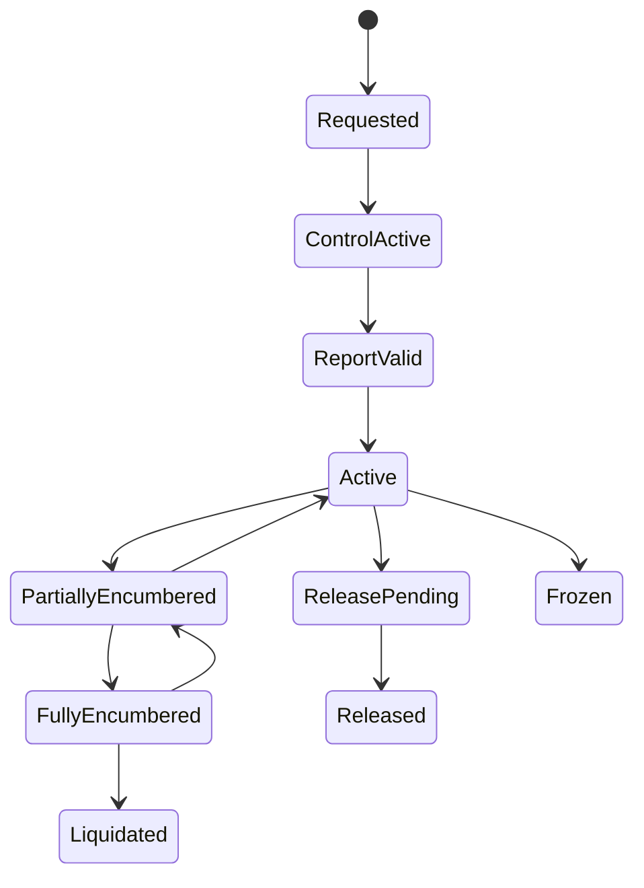

### 12. `ReserveRegistry`

Status: new.

Purpose: source of truth for lender USDC reserves.

Storage:

```solidity
struct Reserve {
    bytes32 reserveId;
    bytes32 entityId;
    bytes32 custodyAccountRef;
    bytes32 custodianId;
    address reserveToken;
    address asset;
    uint256 available;
    uint256 orderLocked;
    uint256 settlementPending;
    uint256 funded;
    ReserveStatus status;
    bytes32 latestReportId;
}
```

Functions:

- `requestReserve(...)`;
- `activateReserve(bytes32 reserveId, bytes32 reportId, bytes calldata aminaApproval)`;
- `lockForOrder(bytes32 reserveId, bytes32 orderId, uint256 amount)`;
- `moveToSettlementPending(bytes32 reserveId, bytes32 dealId, uint256 amount)`;
- `markFunded(bytes32 reserveId, bytes32 dealId, uint256 amount)`;
- `releaseLocked(bytes32 reserveId, bytes32 orderOrDealId, uint256 amount)`;
- `markReturned(bytes32 reserveId, bytes32 dealId, uint256 amount)`.

Invariants:

```text
available + orderLocked + settlementPending + funded <= verifiedReserveAmount
funded increases only after funding acknowledgement
available increases after returned/re-reserved acknowledgement
```

### 13. `PermissionedTokenBase`

Status: new.

Purpose: shared base for restricted cTokens.

Implement using OpenZeppelin ERC20 or a CMTAT/ERC-3643-compatible module depending on legal/compliance choice.

Required behavior:

- transfer restrictions in `_update`;
- mint/burn only by registry-authorized paths;
- `pause`;
- `freeze(address)` if legally required;
- allowlist of protocol contracts;
- optional ERC-3643 identity registry hook.

Transfer rule:

```text
mint: from == address(0) and minter authorized
burn: to == address(0) and burner authorized
transfer: both from and to must be allowed for the current action
```

Do not check only `from` or only `to`.

### 14. `PermissionedCollateralToken`

Status: new.

Purpose: cBTC/cETH collateral inventory token.

Functions:

- `mintForPledge(address to, bytes32 pledgeId, uint256 amount)`;
- `burnForRelease(address from, bytes32 pledgeId, uint256 amount, bytes32 voucherId)`;
- `lockTransfer(address from, address vault, uint256 amount)` if using a specialized transfer path;
- standard ERC20 view functions.

Access:

- mint callable only by `PledgeRegistry` or authorized tokenization path;
- burn callable only by `ReleaseAuthorizer`/registry path;
- transfers limited to owner, vault, engine, liquidation handler, and approved protocol modules.

Tests:

- unauthorized transfer reverts;
- mint over pledge fails;
- burn without voucher fails;
- vault can lock/unlock;
- frozen token behavior does not trap repayment accounting.

### 15. `ReserveToken` / `cUSDC`

Status: new.

Purpose: restricted representation of lender reserved USDC.

Design choice:

- ERC20-like restricted token if the UI/product wants visible balances and possible future pooling;
- non-transferable ledger inside `ReserveRegistry` if v1 wants minimal surface.

Recommendation: implement restricted ERC20 `cUSDC` for consistency, but make it non-transferable except registry/vault paths.

Functions:

- `mintForReserve(address lender, bytes32 reserveId, uint256 amount)`;
- `burnOrLockForFunding(bytes32 reserveId, bytes32 dealId, uint256 amount)`;
- `markReturned(...)` through registry.

Important:

- cUSDC is not real USDC;
- cUSDC should not be accepted as loan repayment;
- funding requires custody acknowledgement.

### 16. `LoanNote`

Status: optional v2, do not enable for v1 transferability.

Purpose: lender receivable after funding.

V1 recommendation:

- represent receivable in `DealRegistryV2` and `PortfolioLensV2`;
- optionally mint non-transferable `LoanNote` NFT/ERC1155 for accounting;
- disable secondary transfer and re-pledging.

V2 can add:

- transfer restrictions;
- buyer eligibility;
- notice/consent workflow;
- assignment legal terms;
- haircut for re-pledging.

### 17. `PriceOracleHub`

Status: new.

Purpose: centralize price reads instead of scattering feed logic.

Storage:

- feed config by asset ID;
- decimals;
- heartbeat;
- fallback/override config;
- AMINA attestor for emergency dual-price attestations.

Functions:

- `priceOf(bytes32 assetId)`;
- `convert(bytes32 from, bytes32 to, uint256 amount)`;
- `validateFresh(bytes32 assetId)`;
- `setFeed(bytes32 assetId, FeedConfig cfg)`.

Tests:

- stale feed reverts;
- negative answer reverts;
- decimals correct;
- override delay enforced;
- no price/PoR feed confusion.

### 18. `MarketRegistryV2`

Status: replace or extend current `CollateralRegistry`.

Purpose: define isolated markets and versioned risk params.

Market key should include:

```text
hash(collateralToken, loanAsset, reserveToken, custodianTier, jurisdictionClass)
```

Storage:

- latest param version per market;
- active/paused flags;
- market eligibility policy;
- `ParameterArchive` pointer.

Parameters:

- initial/max LTV;
- warning LTV;
- partial liquidation LTV;
- full liquidation/default LTV;
- max tenor;
- rate bounds;
- settlement deadline;
- stale price/report thresholds;
- caps;
- liquidation bonus;
- AMINA/P2P fees.

Functions:

- `addMarket(MarketConfig cfg, ParamsV2 params)`;
- `updateMarket(bytes32 marketId, ParamsV2 params)`;
- `pauseMarket(bytes32 marketId, bool paused)`;
- `latestVersion(bytes32 marketId)`;
- `readParams(bytes32 marketId, uint32 version)`.

Invariants:

```text
initialLtv < warningLtv < partialLiqLtv < fullLiqLtv <= 100%
rateMin <= rateMax
settlementDeadline > 0
```

### 19. `ParameterArchive`

Status: keep.

Purpose: immutable versioned parameter snapshots.

Implementation:

- reuse existing pattern;
- add `ParamsV2` schema version;
- never overwrite prior versions;
- deal records store version number and params hash.

### 20. `OrderRegistry`

Status: new.

Purpose: optional onchain commitment layer for orders before matched deal creation.

V1 minimal path:

- do not store every live order onchain;
- store only matched commitments or cancellable nonces.

Recommended functions:

- `cancelNonce(address signer, bytes32 nonce)`;
- `isNonceCancelled(address signer, bytes32 nonce)`;
- `recordMatchedOrder(bytes32 orderHash, bytes32 dealId)`.

If AMINA wants visible order book:

- add `submitOrder`;
- `cancelOrder`;
- `expireOrder`;
- `fillOrder`.

Keep gas and privacy in mind.

### 21. `DealRegistryV2`

Status: new immutable or append-only UUPS with extreme caution.

Purpose: write-once deal terms.

Storage:

- `mapping(bytes32 dealId => DealTermsV2)`;
- `mapping(bytes32 dealId => bool exists)`;
- nonce usage/cancellation;
- optional array indexes for lens use.

Functions:

- `recordMatchedDeal(bytes32 dealId, DealTermsV2 terms)`;
- `getTerms(bytes32 dealId)`;
- `exists(bytes32 dealId)`;
- `markNonceUsed(address who, bytes32 nonce)`.

Events:

- `DealRecordedV2`.

Recommendation:

- keep terms registry immutable if possible;
- mutable runtime state belongs in `LendingEngineV2`.

### 22. `AccountingVaultV2`

Status: new immutable.

Purpose: hold restricted cCollateral when collateral is locked for a deal.

Differences from current `EscrowVault`:

- no real USDC movement expected for v1 custody mode;
- explicit `lockCollateral`, `unlockCollateral`, `seizeCollateralAccounting`;
- ledger exactness retained;
- only engine can mutate.

Functions:

- `lock(bytes32 dealId, address token, address from, uint256 amount)`;
- `release(bytes32 dealId, address token, address to, uint256 amount)`;
- `debitToHandler(bytes32 dealId, address token, address to, uint256 amount)`;
- `balanceOfDeal(bytes32 dealId, address token)`;
- `ledgerSum(address token)`;
- `observeUnattributed(address token)`.

Tests:

- ledger cannot exceed token balance;
- unauthorized token transfer creates unattributed balance only;
- release failure does not corrupt ledger;
- only engine can mutate.

### 23. `LendingEngineV2`

Status: new UUPS behind timelock.

Purpose: central lifecycle state machine.

Storage:

- registry pointers;
- `mapping(bytes32 dealId => DealRuntimeV2)`;
- caps and usage;
- pause/halt flags;
- funding/repayment ack tracking;
- outstanding and accrual state.

Main functions:

#### `createMatchedDeal`

Inputs:

- `DealIntentV2`;
- lender signature;
- borrower signature;
- AMINA signature;
- optional matching operator metadata.

Checks:

- KYB and wallet approval;
- required legal agreements;
- market active;
- token active;
- pledge active and free amount sufficient;
- reserve active and available amount sufficient;
- price fresh;
- report fresh;
- caps;
- signatures and nonces;
- rate/tenor inside AMINA parameters.

Effects:

- record deal terms;
- mark state `Matched`;
- mark nonces used.

#### `reserveCollateralAndLiquidity`

Can be called inside `createMatchedDeal` or as a second step.

Effects:

- lock cCollateral into `AccountingVaultV2`;
- `PledgeRegistry.lockForDeal`;
- `ReserveRegistry.moveToSettlementPending`;
- set `SettlementPending`;
- emit funding instruction through `SettlementRouterV2`.

#### `confirmFunding`

Callable only by `SettlementAcker`.

Effects:

- verify state `SettlementPending`;
- set `Active`;
- set `interestStartTs`;
- set `outstanding = principal`;
- start accrual clock.

#### `cancelUnfundedDeal`

Allowed when:

- settlement deadline expired;
- funding rejected;
- AMINA cancels before active;
- both parties cancel under terms.

Effects:

- unlock cCollateral;
- release cUSDC reservation;
- state `Cancelled` or `Failed`.

#### `requestRepayment`

Effects:

- compute outstanding;
- emit repayment instruction;
- state `RepaymentPending`.

#### `confirmRepayment`

Callable only by `SettlementAcker`.

Effects:

- reduce outstanding;
- if fully repaid, state `Repaid`;
- request release voucher.

#### `topUpCollateral`

Effects:

- lock additional cCollateral;
- update pledge encumbrance;
- recalculate health.

#### `partialRepayByAck`

Effects:

- acknowledge partial offchain repayment;
- reduce outstanding;
- release reserve/receivable accounting as appropriate.

State diagram:

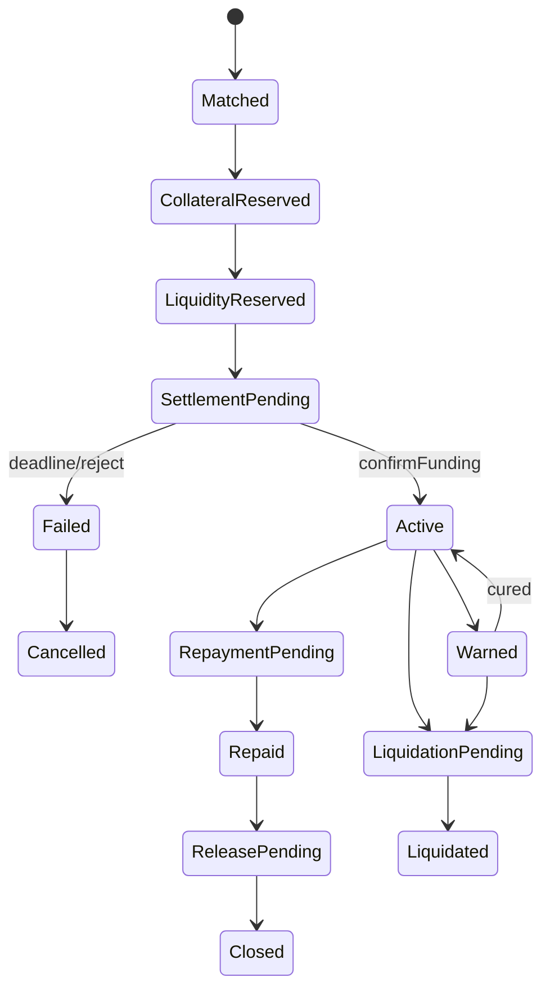

Tests:

- cannot become active without funding ack;
- interest starts only at funding ack;
- matched deal cannot reuse pledge/reserve beyond free balances;
- stale reserve report blocks matching;
- AMINA signature required;
- cancellation unlocks accounting correctly;
- repayment ack from wrong route rejected;
- state-specific functions cannot be called out of order.

### 24. `SettlementRouterV2`

Status: new immutable event emitter.

Purpose: append-only settlement instruction stream.

Events:

- `FundingInstruction`;
- `FundingCancelled`;
- `FundingConfirmed`;
- `RepaymentInstruction`;
- `RepaymentConfirmed`;
- `ReleaseInstruction`;
- `ReleaseConfirmed`;
- `LiquidationInstruction`;
- `LiquidationConfirmed`;
- `SettlementFailed`;
- `CustodyException`.

Every event should include:

- `dealId`;
- `sequenceNumber`;
- `settlementRef`;
- `routeHash`;
- `pledgeId`;
- `reserveId`;
- `asset`;
- `amount`;
- `deadline`;
- `reasonCode`.

Implementation:

- immutable;
- bound emitters set once;
- monotonically increasing sequence;
- never remove event fields in v2.

### 25. `SettlementAcker`

Status: new UUPS or immutable with configurable signer set.

Purpose: verify custody/AMINA acknowledgements and move engine state.

Ack types:

- funding;
- repayment;
- reserve return;
- collateral release;
- liquidation execution;
- settlement failure.

Functions:

- `ackFunding(FundingAck ack, bytes[] signatures)`;
- `ackRepayment(RepaymentAck ack, bytes[] signatures)`;
- `ackRelease(ReleaseAck ack, bytes[] signatures)`;
- `ackLiquidation(LiquidationAck ack, bytes[] signatures)`;
- `ackFailure(FailureAck ack, bytes[] signatures)`.

Validation:

- ack signer authorized for custodian/account;
- AMINA signature present where required;
- route hash matches router event;
- amount, asset, deal ID match;
- ack nonce unused;
- timestamp within allowed window;
- state transition valid.

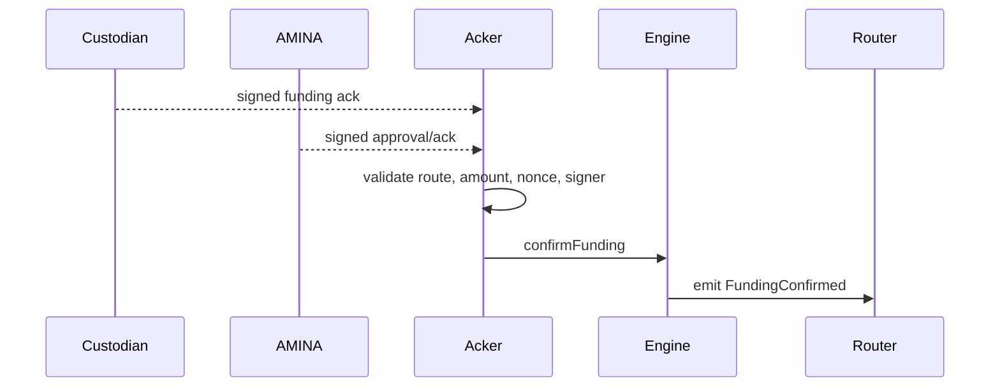

### 26. `ReleaseAuthorizer`

Status: new UUPS behind timelock.

Purpose: produce release vouchers when deal state allows collateral or reserve release.

Voucher types:

- borrower release after full repayment;
- AMINA liquidation release;
- reserve release after failed funding;
- surplus release after liquidation;
- administrative freeze/exception release with governance delay.

Functions:

- `issueRepaymentRelease(bytes32 dealId)`;
- `issueLiquidationRelease(bytes32 dealId, uint256 amount, bytes32 destinationHash)`;
- `issueReserveRelease(bytes32 dealId)`;
- `isVoucherValid(bytes32 voucherId)`;
- `consumeVoucher(bytes32 voucherId, bytes32 ackId)`.

Invariants:

- repayment release only if outstanding is zero and repayment ack valid;
- liquidation release only from `LiquidationPending` or default state and AMINA authorized;
- voucher binds destination, amount, asset, pledge/reserve ID, deadline;
- voucher can be consumed once.

### 27. `LiquidationHandlerV2`

Status: extend existing.

Purpose: warning, partial liquidation, full liquidation, default, and custody release.

Preserve:

- AMINA-only access;
- signed dual-price attestations;
- warning/partial/full ladder;
- stale attestation checks;
- bonus/fee calculations.

Add:

- cure window tracking;
- `markLiquidationPending`;
- release voucher request;
- liquidation settlement acknowledgement;
- surplus accounting;
- reserve/lender recovery accounting;
- custody exception path.

Functions:

- `warn(bytes32 dealId, DualPriceAttestationV2 att, bytes sig)`;
- `cure(bytes32 dealId)` or engine auto-cure on top-up;
- `partialLiquidate(...)`;
- `fullLiquidate(...)`;
- `markDefault(bytes32 dealId, bytes32 reason)`;
- `confirmLiquidation(bytes32 dealId, LiquidationAck ack)`.

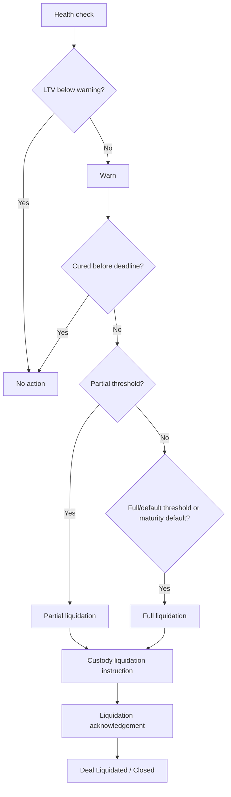

### 28. `FeeController`

Status: new.

Purpose: calculate AMINA and P2P fees without burying fee math in engine/liquidation code.

Fees:

- origination fee;
- protocol fee;
- AMINA fee;
- liquidation fee;
- late fee, if legal terms allow.

Functions:

- `computeOriginationFee(bytes32 marketId, uint256 principal)`;
- `computeAccruedInterest(...)`;
- `computeLiquidationFees(...)`;
- `feeRecipient(bytes32 feeType)`.

Keep fee schedules in `MarketRegistryV2` or `FeeController`; snapshot applicable fees at deal creation.

### 29. `PortfolioLensV2`

Status: new read-only contract.

Purpose: UX-friendly views.

Views:

- entity balances;
- pledge inventory;
- reserves;
- open orders;
- pending settlements;
- active loans;
- margin state;
- evidence references;
- next required action.

No state-changing logic.

### 30. `EvidenceLens`

Status: new read-only contract.

Purpose: compliance/audit view.

Views:

- deal evidence bundle;
- latest report per pledge/reserve;
- agreement hashes;
- custody account refs;
- settlement ack refs;
- voucher refs;
- parameter snapshot;
- event sequence numbers.

## End-To-End Contract Flows

### Collateral Tokenization

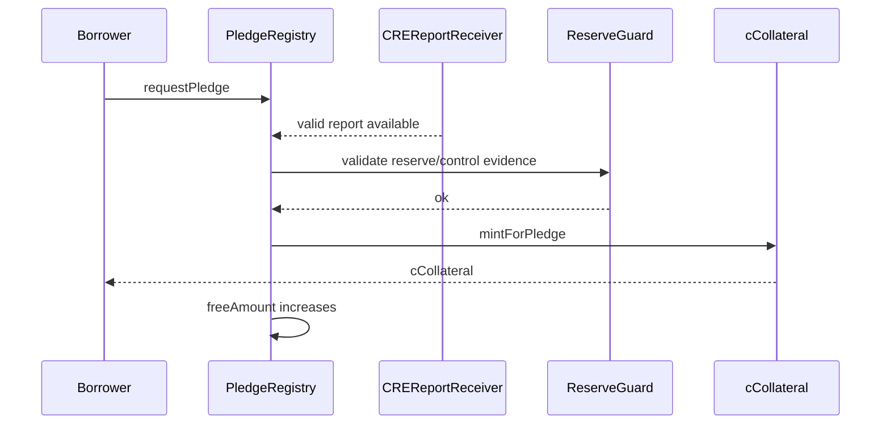

### Deal Creation And Funding

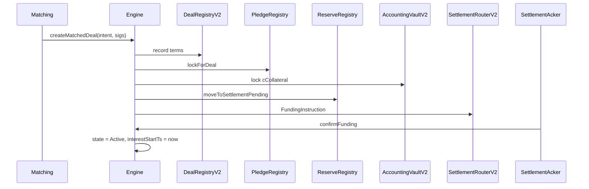

### Repayment And Collateral Release

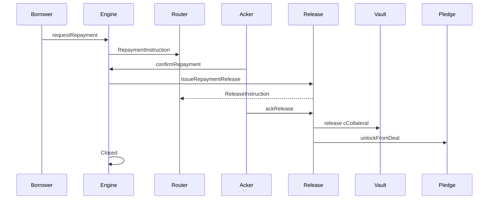

### Liquidation

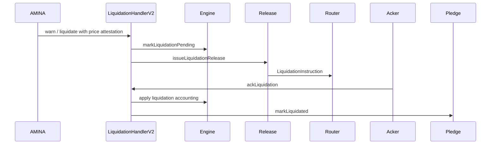

## Deployment Order

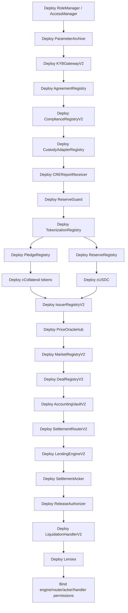

## Critical Invariants

### Tokenization

```text
cCollateral.totalSupply <= verified locked collateral amount - margin
cUSDC.totalSupply or registry usage <= verified USDC reserve amount - margin
Pledge.free + Pledge.encumbered == mintedAmount
Reserve.available + Reserve.orderLocked + Reserve.settlementPending + Reserve.funded <= verifiedReserve
```

### Deal Lifecycle

```text
state Active implies fundingAck exists
interestStartTs != 0 iff state >= Active
deal terms are immutable after record
pledgeId and reserveId cannot be reused beyond free/available amount
settlement ack can be consumed once
cancelled unfunded deal releases collateral and reserve locks
```

### Settlement

```text
Funding ack routeHash == FundingInstruction routeHash
ack amount == deal principal
ack asset == loan asset
ack signer is authorized for custodian/account
ack timestamp <= deadline unless AMINA exception path used
```

### Liquidation And Release

```text
repayment release voucher requires outstanding == 0
liquidation voucher requires liquidation/default state
voucher consumed at most once
surplus cannot exceed remaining collateral
only AMINA LIQUIDATOR role can initiate liquidation
```

### Permissions

```text
P2P operator cannot approve KYB
P2P operator cannot liquidate
P2P operator cannot change market params without timelock
AMINA can approve and liquidate but cannot mint without reserve/control evidence
Custodian report alone cannot mint if AMINA/control policy missing
Chainlink report alone cannot release collateral
```

## Testing Plan

### Unit Tests

Per contract:

- all access controls;
- all state transitions;
- all invalid state reverts;
- stale report/oracle behavior;
- signature and nonce replay;
- decimals and rounding;
- cap charging/releasing;
- pause behavior.

### Integration Tests

Full scenarios:

1. onboarding -> collateral tokenization -> USDC reserve -> match -> funding ack -> active -> repay -> release -> closed;
2. stale CRE report blocks mint;
3. stale price blocks matching/liquidation;
4. funding deadline expires and unlocks pledge/reserve;
5. partial repayment acknowledged;
6. top-up cures warning;
7. partial liquidation;
8. full liquidation with surplus;
9. custody release delayed, state remains release pending;
10. AMINA/custodian ack mismatch rejected.

### Invariant Tests

Use Foundry invariant tests for:

- pledge accounting;
- reserve accounting;
- vault ledger sums;
- no active loan without funding ack;
- no release voucher without terminal state;
- no report replay;
- no unauthorized cToken transfer;
- no under-reserved mint.

### Fork Tests

Use mainnet fork for:

- Chainlink price feed reads;
- USDC decimals/behavior;
- WBTC/WETH price conversion if used;
- real OpenZeppelin token behavior where relevant.

Use local mocked/adaptor contracts only for custody acknowledgement because real custodian APIs are offchain.

### Property Tests

Important properties:

- for any sequence of lock/unlock/cancel/fund/repay, pledge and reserve accounting remain conserved;
- interest accrual never starts before funding ack;
- repeated acks do not change state twice;
- any valid close path ends with no locked reserve and no locked collateral unless release is pending due to explicit custody exception.

## Security Review Checklist

1. Transfer restrictions check both `from` and `to`.
2. All reports bind chain ID, receiver, subject, schema, and consumer context.
3. No report or ack replay.
4. No stale PoR, price, or custody report accepted.
5. No negative reserve margin.
6. No public DeFi transferability in v1.
7. No active deal before funding ack.
8. No interest before `interestStartTs`.
9. No liquidation without AMINA role and valid price attestation.
10. No collateral release without release voucher.
11. No reserve release while settlement pending unless cancelled/failed.
12. Upgrade roles timelocked.
13. Emergency pause does not block repayment or release of fully repaid loans unless legally required.
14. Custodian pause blocks new deals but preserves repayment/liquidation handling.
15. Governance cannot silently mutate deal terms.

## Migration Plan From Current Repo

1. Keep current contracts and tests as `v1 repo rail` reference.
2. Add `src/v2/` or clear layer folders for Triora v2 modules.
3. Keep shared libraries where compatible, but add `TypesV2`, `ErrorsV2`, and `EIP712HashesV2`.
4. Do not change immutable v1 `DealRegistry`, `EscrowVault`, or `SettlementRouter` in place.
5. Reuse test fixture patterns, fork-test style, and exact-transfer checks.
6. Port useful tests:
   - KYB gating;
   - token admission;
   - cap checks;
   - pause/halt;
   - oracle staleness;
   - liquidation ladder;
   - non-reverting release behavior.
7. Add new tests for staged settlement and custody acknowledgements.

## Minimum Viable Contract Set For Pilot

If the team needs the smallest safe onchain pilot, implement these first:

| Priority | Contract |
| --- | --- |
| 1 | `RoleManager` |
| 2 | `KYBGatewayV2` |
| 3 | `AgreementRegistry` |
| 4 | `IssuerRegistryV2` |
| 5 | `CREReportReceiver` |
| 6 | `ReserveGuard` |
| 7 | `TokenizationRegistry` |
| 8 | `PledgeRegistry` |
| 9 | `ReserveRegistry` |
| 10 | `PermissionedCollateralToken` |
| 11 | `ReserveToken` |
| 12 | `MarketRegistryV2` + `ParameterArchive` |
| 13 | `DealRegistryV2` |
| 14 | `AccountingVaultV2` |
| 15 | `LendingEngineV2` |
| 16 | `SettlementRouterV2` |
| 17 | `SettlementAcker` |
| 18 | `ReleaseAuthorizer` |
| 19 | `LiquidationHandlerV2` |
| 20 | `PortfolioLensV2` |

Everything else can be implemented as ops/indexer code until the first pilot proves the lifecycle.

## V2 And Later Contracts

After the pilot:

- `LoanNote` with restricted transfer;
- `PoolVault` for pooled lender capital;
- `TrancheVault` for senior/junior risk;
- `SecondaryTransferRegistry` for loan-note assignments;
- `DeFiConnectorRegistry`;
- `MorphoAdapter` or isolated lending adapter;
- `CCIPSettlementAdapter`;
- `RwaCollateralRegistry`;
- `NAVOracleHub`;
- `AuctionLiquidationModule`.

Do not deploy these until v1 custody-backed bilateral loans are production stable.

## Final Recommendation

The contract architecture should center on four truths:

1. collateral tokenization is pledge-bound;
2. lender liquidity is reserve-bound;
3. loan activation is settlement-bound;
4. collateral release is voucher-bound.

If every contract reinforces those four boundaries, Triora can safely combine institutional secured lending discipline with onchain auditability. If any contract collapses those boundaries - for example by treating a match as funding, a Chainlink report as issuance, or cUSDC as real transferred USDC - the system will look simpler but become much less sound.
