# P2PxAmina — User Stories, Use Cases & Flows

> This document describes P2PxAmina from the point of view of the people and institutions who use it — what each actor experiences, sees, decides, and accomplishes. It is written for the product, design, and stakeholder teams, not for engineers: the focus is the journey and the screens, not the implementation. Every user story and use case below traces back to the original product brief (the "Segregated Institutional Lending Protocol" document), and the traceability matrix in Section 9 proves that mapping item by item. Where on-chain mechanics are referenced, they are kept at the conceptual level the brief itself uses ("tokenized assets on custody", "smart-contract escrow", "on-chain record of the deal", "settlement at custody").

---

## Table of contents

1. [Overview](#1-overview)
2. [How to read this document](#2-how-to-read-this-document)
3. [Lender](#3-lender)
4. [Borrower](#4-borrower)
5. [AMINA Bank (Broker + Curator + Liquidator)](#5-amina-bank-broker--curator--liquidator)
6. [P2P Staking (Technology Provider)](#6-p2p-staking-technology-provider)
7. [Custodian (Token Issuer)](#7-custodian-token-issuer)
8. [End-to-end journeys (cross-actor)](#8-end-to-end-journeys-cross-actor)
   - 8.1 [EE-1: Happy path — full deal lifecycle](#81-ee-1-happy-path--full-deal-lifecycle)
   - 8.2 [EE-2: Matching and partial fill](#82-ee-2-matching-and-partial-fill)
   - 8.3 [EE-3: Onboarding — KYB flow](#83-ee-3-onboarding--kyb-flow)
   - 8.4 [EE-4: Default and liquidation](#84-ee-4-default-and-liquidation)
   - 8.5 [EE-5: Fee flow — how the 40 bps spread is earned and distributed](#85-ee-5-fee-flow--how-the-40-bps-spread-is-earned-and-distributed)
9. [Traceability matrix](#9-traceability-matrix)
10. [Out of scope for v1](#10-out-of-scope-for-v1)

---

## 1. Overview

P2PxAmina is a crypto version of traditional tri-party repo infrastructure, built for institutions. An institution that needs cash but does not want to sell its crypto pledges that crypto as collateral, receives USDC for a fixed term at a fixed rate, and reclaims the collateral at maturity by repaying with interest. Throughout, the underlying assets never leave regulated custody — the protocol moves claims on those assets, not the assets themselves. Matching of lenders and borrowers happens off the chain under AMINA Bank's regulated brokerage licence; settlement, escrow, and the permanent record of each deal happen on the chain. Crucially, neither P2P Staking nor AMINA acts as a balance-sheet counterparty: P2P provides the technology, AMINA provides the regulated broker and risk layer, and the custodian holds the assets. The result is a permissioned, bilateral, fixed-term, fixed-rate, over-collateralized lending rail for institutions.

### Actor overview

| Actor | Role | What they do | What they do NOT do | Fee | Key concern |
|-------|------|-------------|--------------------|-----|------------|
| **Lender** | Institutional liquidity provider | Deposits tokenized USDC, earns a fixed yield; sees one consolidated position | See the borrower's identity; manage collateral or liquidations; touch custody token issuance or retirement | Earns the lend rate (e.g. ~7.2%) | Counterparty safety, yield predictability, clean audit trail |
| **Borrower** | Institutional liquidity seeker | Posts crypto collateral, draws USDC, repays with interest, reclaims collateral | Sell the underlying assets; see the lender's identity; set parameters | Pays the borrow rate (e.g. ~7.6%) | Keep ownership of collateral, rate clarity, fair warning before liquidation |
| **AMINA Bank** | Broker + Curator + Liquidator | Approves counterparties, sets rates and LTV, runs matching under its licence, monitors and liquidates | Build the platform software; hold balance-sheet credit risk; disclose counterparty identities | 20 bps + liquidation bonus | Regulatory compliance, portfolio risk, orderly recovery |
| **P2P Staking** | Technology provider (Cayman) | Builds and operates the platform, matching engine, UI, settlement routing; collects KYB data | Touch assets; make credit or risk decisions; approve or reject clients | 20 bps infrastructure fee | Platform reliability, institutional UX, clean data flows |
| **Custodian** | Token issuer / trust anchor | Holds real assets, mints 1:1-backed tokens, processes redemptions and settlement, holds identity mapping | Match orders; set rates; decide on liquidations (only executes on instruction) | Existing custody fee (outside the spread) | Integrity of 1:1 backing, accurate redemptions, identity assurance |

### Who deals with whom

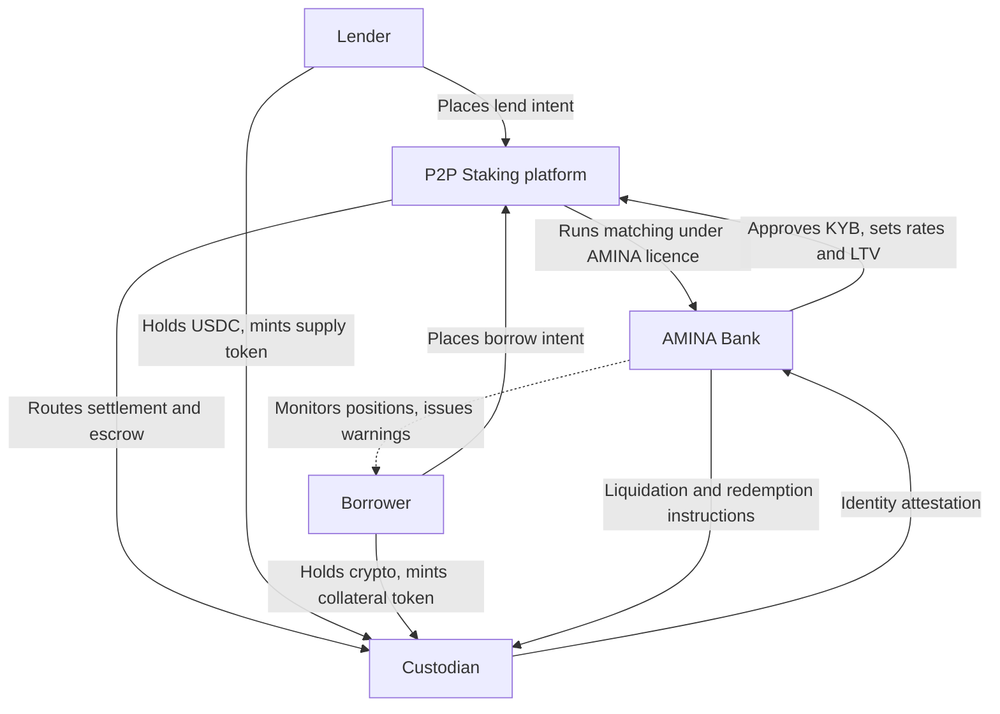
```mermaid
flowchart TD
    LEN[Lender]
    BOR[Borrower]
    P2P[P2P Staking platform]
    AMINA[AMINA Bank]
    CUST[Custodian]

    LEN -->|Places lend intent| P2P
    BOR -->|Places borrow intent| P2P
    P2P -->|Runs matching under AMINA licence| AMINA
    AMINA -->|Approves KYB, sets rates and LTV| P2P
    P2P -->|Routes settlement and escrow| CUST

    LEN -->|Holds USDC, mints supply token| CUST
    BOR -->|Holds crypto, mints collateral token| CUST
    AMINA -->|Liquidation and redemption instructions| CUST
    CUST -->|Identity attestation| AMINA

    AMINA -.->|Monitors positions, issues warnings| BOR
```

The lender and borrower never interact with each other and never see each other's identity. They each deal with the platform and, through it, with AMINA (as the regulated broker and risk layer) and the custodian (as the asset and identity anchor).

---

## 2. How to read this document

Each actor has a profile, a set of user stories, a set of use cases, and one or more journey diagrams. Stories and use cases use consistent ID schemes so they can be cross-referenced and traced:

| Prefix | Meaning | Actor |
|--------|---------|-------|
| `LEN-n` | Lender user story | Lender |
| `BOR-n` | Borrower user story | Borrower |
| `AMINA-n` | AMINA user story | AMINA Bank |
| `P2P-n` | P2P Staking user story | P2P Staking |
| `CUST-n` | Custodian user story | Custodian |
| `UC-{ACTOR}-nn` | Use case | The named actor (e.g. `UC-LEN-01`, `UC-BOR-01`, `UC-AMINA-01`, `UC-P2P-01`, `UC-CUST-01`) |

**Diagram conventions.** Single-actor lifecycles are shown as state diagrams; single-actor decision paths (such as a margin-warning response) are shown as flowcharts; interactions between two or more parties are shown as sequence diagrams. Multi-actor end-to-end journeys live in Section 8 and are not duplicated inside the per-actor sections — the per-actor sections show only the journeys experienced primarily by that one actor. All labels avoid special characters so the diagrams render cleanly.

---

## 3. Lender

### Profile

A Lender on P2PxAmina is an institutional liquidity provider — a treasury desk, fund manager, or corporate cash manager — that holds USDC at a regulated custodian and wants to earn a fixed, transparent yield on idle capital without taking on operational complexity. The Lender's primary concerns are counterparty safety, yield predictability, and a clean audit trail. The Lender never knows who the borrower is, never touches the underlying bilateral deal structure, and never manages collateral or liquidations. From the Lender's perspective, a position earns a single stated rate against a single balance — the multi-deal architecture behind it is invisible. The Lender bears credit risk on its matched borrower or borrowers, but that risk is bounded by over-collateralization (LTV 80-90%, per §6 collateral parameters) and AMINA's deterministic liquidation process.

### What they want (user stories)

| ID | User story | Source |
|----|-----------|--------|
| LEN-1 | As a Lender, I want to complete KYB once and be approved under AMINA's licence, so that I can access the platform without repeating compliance work per deal. | §3, §7, §11 |
| LEN-2 | As a Lender, I want to see the current market rate for USDC lending (e.g. 7.2% for a 3-month term) before committing, so that I can decide whether the yield meets my internal hurdle. | §3, §4 |
| LEN-3 | As a Lender, I want to place a lend order by specifying an amount and a term (e.g. "Lend 2M USDC, 3 months"), so that I can deploy capital with a single intent rather than negotiating each deal manually. | §3, §4 |
| LEN-4 | As a Lender, I want to review and approve the deal terms in one batch signing step, so that my USDC enters the protocol only after I have confirmed the rate and tenor. | §3, §11 |
| LEN-5 | As a Lender, I want to track my active position as one consolidated view — single balance, single rate, days to maturity — so that I am not required to monitor multiple underlying deals. | §3, §4 |
| LEN-6 | As a Lender, I want to see yield accruing in my dashboard in real time, so that I have a live view of what I will receive at maturity. | §3, §8 |
| LEN-7 | As a Lender, I want to know if my order is only partially filled (e.g. "1.2M of 2M filled — 0.8M pending"), so that I understand how much capital is deployed and how much is still waiting. | §4 |
| LEN-8 | As a Lender, I want my identity and my counterparty's identity kept private, so that my institutional positions are not visible to other market participants. | §5 |
| LEN-9 | As a Lender, I want to receive principal plus interest at maturity directly through the custody settlement process, so that repayment is automatic and I do not need to initiate a separate claim. | §3, §6 |
| LEN-10 | As a Lender, I want to download a statement or on-chain record of each deal, so that I can satisfy internal reporting, audit, and accounting requirements. | §8, §11 |

### Use cases

**UC-LEN-01: Onboard and obtain approval**

- **Primary actor**: Lender
- **Goal**: Complete KYB and gain access to the lending platform.
- **Preconditions**: The Lender has an existing custody account with tokenized USDC; the custodian is an accepted issuer.
- **Trigger**: The Lender navigates to the P2PxAmina onboarding portal and initiates registration.
- **Main flow**:
  1. The Lender uploads KYB documentation (entity details, beneficial ownership, jurisdiction) through the onboarding UI provided by P2P.
  2. The system confirms receipt and informs the Lender that AMINA will review the application under its FINMA Banking licence.
  3. Over the following days, AMINA screens the submission. The Lender receives a notification that their account is approved and active.
  4. The Lender accepts the one-time click-through terms covering token definitions, platform role, auto-liquidation rules, and electronic-records consent.
  5. The Lender is prompted to connect their custody wallet so the platform can recognise their supply tokens.
  6. The Lender lands on the main dashboard and sees the current market rate, available liquidity, and an option to place a lend order.
- **Alternate / exception flows**:
  - **A1 — Documentation incomplete**: AMINA requests additional documents; the Lender receives a notification listing what is missing, re-uploads, and resubmits.
  - **A2 — KYB not approved**: AMINA declines the application. The Lender is notified with a reason. No access is granted.
- **Outcome**: The Lender's account is live, KYB is on record with AMINA, and the custody wallet is linked. Onboarding is completed once; no per-deal KYB is required.
- **Maps to**: §3, §7, §11.

**UC-LEN-02: Browse the market and place a lend order**

- **Primary actor**: Lender
- **Goal**: Deploy USDC capital at the published rate for a chosen term.
- **Preconditions**: KYB approved; custody wallet linked; custody account holds tokenized USDC (supply tokens minted 1:1 by the custodian).
- **Trigger**: The Lender logs in and decides to place a new lend order.
- **Main flow**:
  1. The Lender views the market dashboard, which shows the current AMINA-set rate (e.g. 7.2% for 3 months), available borrower demand, and their own USDC balance available to deploy. Rates are fixed and set by AMINA roughly quarterly — there is no auction or negotiation.
  2. The Lender enters a lend intent: amount (e.g. 2M USDC) and term (e.g. 3 months).
  3. The platform shows a summary: estimated yield, the rate, and current demand. The Lender does not see who the borrowers are or how many deals will be created.
  4. The Lender reviews the deal summary screen, which confirms amount, rate, maturity date, and that the protocol will place supply tokens into escrow and match them against collateralised borrower demand.
  5. The Lender confirms and approves the order in a single batch signing step from their custody wallet.
  6. The platform acknowledges the order as submitted and shows its fill status.
- **Alternate / exception flows**:
  - **A1 — Partial fill**: Insufficient matching borrower demand is available at that moment. The dashboard shows "1.2M of 2M filled — 0.8M pending." The filled portion begins accruing yield; the pending portion remains on the order book and fills as new borrower demand arrives (first-come, first-served).
  - **A2 — No fill available**: The platform shows the full order as pending. The Lender may wait or withdraw the intent.
- **Outcome**: Deployed capital is in escrow, matched to one or more borrowers. The Lender's dashboard shows a single active position at the agreed rate, regardless of how many underlying deals were created.
- **Maps to**: §3, §4.

**UC-LEN-03: Monitor an active lending position**

- **Primary actor**: Lender
- **Goal**: Track the health and progress of deployed capital through to maturity.
- **Preconditions**: At least one lend order is matched and active.
- **Trigger**: The Lender opens the dashboard during the lending term.
- **Main flow**:
  1. The Lender sees their active position as a single card: principal lent, current rate, accrued yield to date, and days remaining to maturity. The underlying bilateral deal structure is not exposed.
  2. No information about the identity of the borrower or borrowers is shown — counterparty privacy is maintained throughout.
  3. If the Lender has multiple lend orders, each appears as a separate position card; the dashboard does not expose how many bilateral deals back each position.
  4. The Lender can select any position to see a detail view: deal start date, maturity date, locked rate, and projected total return.
  5. As maturity approaches, the platform may surface an informational notice (e.g. "Your 2M USDC position matures in 7 days").
- **Alternate / exception flows**:
  - **A1 — Partial fill in progress**: A position still has an unfilled portion; the dashboard distinguishes "deployed" from "pending" within that order.
  - **A2 — Collateral event (AMINA action)**: If AMINA takes a liquidation action on an underlying borrower, the Lender is notified that a collateral event occurred and that the value of their position is protected. The Lender does not manage or initiate this; AMINA handles it. The Lender sees the outcome reflected in their position card.
- **Outcome**: The Lender has a real-time view of accrued yield and position status without operational intervention.
- **Maps to**: §3, §4, §5, §9.

**UC-LEN-04: Receive repayment at maturity**

- **Primary actor**: Lender
- **Goal**: Collect principal plus interest at the end of the lending term.
- **Preconditions**: An active lending position has reached its maturity date; the borrower has repaid.
- **Trigger**: The maturity date arrives and the borrower settles the deal.
- **Main flow**:
  1. At maturity, the borrower returns principal plus interest through the protocol. The Lender does not need to initiate any action — settlement is automatic.
  2. The supply tokens representing the lender's USDC are redeemed at the custodian, and the Lender's custody account is credited with principal plus interest in USDC.
  3. The dashboard reflects the completed position, showing the final return and closing the active position card.
  4. The on-chain record of the deal is permanently available as an audit trail. The Lender can download a statement or export transaction data.
- **Alternate / exception flows**:
  - **A1 — Borrower default before maturity**: AMINA has already executed liquidation (see UC-LEN-05). By the time the maturity date arrives, the debt has been paid out. The Lender sees the completed position and the recovery amount.
  - **A2 — Partial recovery**: In an adverse scenario where collateral recovery covers principal but not full interest, the dashboard reflects the actual amount credited. (The over-collateralization design is intended to make this very unlikely.)
- **Outcome**: The Lender's USDC principal plus earned interest is in their custody account. The position is closed; a downloadable record is available.
- **Maps to**: §3, §6, §8, §11.

**UC-LEN-05: Experience a collateral event (AMINA-managed liquidation)**

- **Primary actor**: Lender (passive observer); AMINA is the actor who acts
- **Goal**: Understand the outcome of a collateral event without needing to intervene.
- **See also**: For the full multi-actor liquidation sequence (thresholds, 48-hour clock, surplus return), see Section 8.4. This use case covers only what the Lender sees.
- **Preconditions**: An active lending position exists; the value of the underlying borrower's collateral has declined.
- **Trigger**: AMINA's monitoring detects that a borrower's collateral utilization has crossed a threshold.
- **Main flow**:
  1. **Warning stage (85%+ utilization)**: The Lender receives a notification that a collateral health warning has been issued on one of their underlying positions, and that the borrower has 48 hours to add collateral. The Lender takes no action.
  2. **Partial liquidation (90%+ utilization)**: If the borrower does not act, AMINA liquidates part of the position to restore a safe ratio. The Lender is notified that a partial liquidation has been executed and that their position remains protected.
  3. **Full liquidation (95%+ utilization or maturity with non-payment)**: AMINA pays the outstanding debt to the Lender, takes the collateral tokens, and redeems them at the custodian for real assets. The Lender's custody account is credited; the position is closed. Recovery is immediate — there is no court process or arbitration.
  4. The dashboard shows the closed position and the recovered amount; a record of the liquidation event is available for download.
- **Alternate / exception flows**:
  - **A1 — Borrower tops up collateral at warning stage**: Utilization returns to a safe level; the warning clears. The Lender is notified that the position has stabilised.
- **Outcome**: The Lender's exposure is resolved — either the position continues safely or it is fully recovered through AMINA's liquidation. The Lender never had to manage the collateral directly.
- **Maps to**: §9.

### Journey diagrams

Lender lifecycle: from custody to maturity.

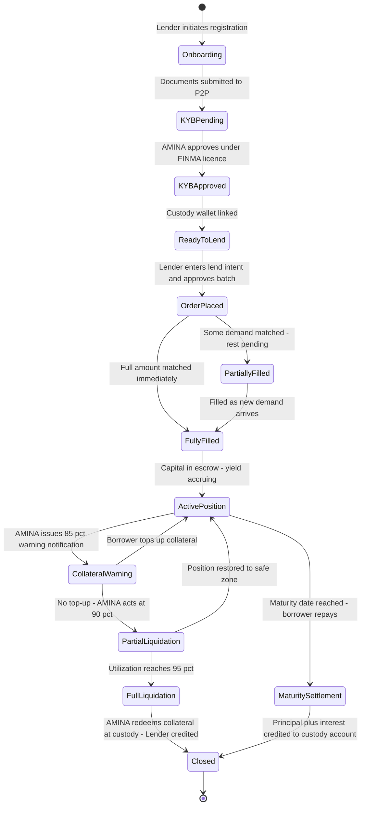
```mermaid
stateDiagram-v2
    [*] --> Onboarding : Lender initiates registration
    Onboarding --> KYBPending : Documents submitted to P2P
    KYBPending --> KYBApproved : AMINA approves under FINMA licence
    KYBApproved --> ReadyToLend : Custody wallet linked
    ReadyToLend --> OrderPlaced : Lender enters lend intent and approves batch
    OrderPlaced --> PartiallyFilled : Some demand matched - rest pending
    OrderPlaced --> FullyFilled : Full amount matched immediately
    PartiallyFilled --> FullyFilled : Filled as new demand arrives
    FullyFilled --> ActivePosition : Capital in escrow - yield accruing
    ActivePosition --> CollateralWarning : AMINA issues 85 pct warning notification
    CollateralWarning --> ActivePosition : Borrower tops up collateral
    CollateralWarning --> PartialLiquidation : No top-up - AMINA acts at 90 pct
    PartialLiquidation --> ActivePosition : Position restored to safe zone
    ActivePosition --> MaturitySettlement : Maturity date reached - borrower repays
    PartialLiquidation --> FullLiquidation : Utilization reaches 95 pct
    FullLiquidation --> Closed : AMINA redeems collateral at custody - Lender credited
    MaturitySettlement --> Closed : Principal plus interest credited to custody account
    Closed --> [*]
```

Lender experience during a collateral event.

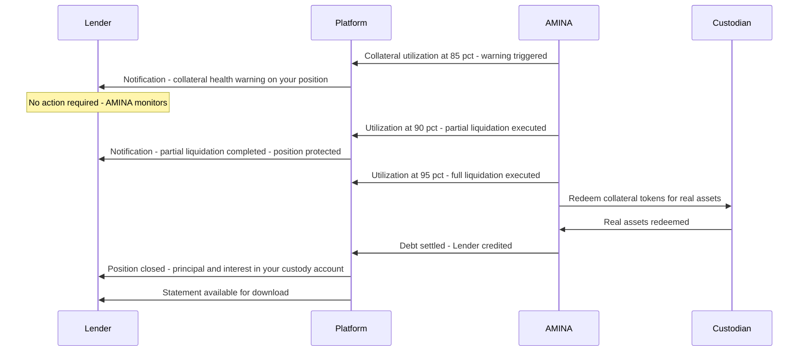
```mermaid
sequenceDiagram
    participant Lender
    participant Platform
    participant AMINA
    participant Custodian

    AMINA->>Platform: Collateral utilization at 85 pct - warning triggered
    Platform->>Lender: Notification - collateral health warning on your position
    note over Lender: No action required - AMINA monitors
    AMINA->>Platform: Utilization at 90 pct - partial liquidation executed
    Platform->>Lender: Notification - partial liquidation completed - position protected
    AMINA->>Platform: Utilization at 95 pct - full liquidation executed
    AMINA->>Custodian: Redeem collateral tokens for real assets
    Custodian->>AMINA: Real assets redeemed
    AMINA->>Platform: Debt settled - Lender credited
    Platform->>Lender: Position closed - principal and interest in your custody account
    Platform->>Lender: Statement available for download
```

---

## 4. Borrower

### Profile

The Borrower is an institutional liquidity seeker — a crypto-native firm, trading desk, fund, or treasury operation — that holds significant BTC, ETH, or stablecoin assets and needs working capital without selling those positions. Their core motivation is liquidity on held assets: borrow USDC today, run their strategy, return principal plus interest at maturity, and reclaim the underlying collateral untouched. They care about the rate (fixed, known upfront), the collateral requirement (LTV clarity), the speed of settlement (days, not weeks), and the certainty that their collateral remains in regulated custody at all times. They do not act as a lender, do not set parameters, and do not see who funded them. They pay the borrow rate (approximately 7.6% in the illustrative examples) and receive no fee income. Their risk is that collateral value falls, triggering a margin sequence that can escalate to full liquidation; their protection is the 48-hour warning window and the guarantee that any surplus after liquidation is returned to them.

### What they want (user stories)

| ID | User story | Source |
|----|------------|--------|
| BOR-1 | As a Borrower, I want to complete KYB onboarding once so that I can access the platform without repeating identity verification for each deal. | §3, §7, §11 |
| BOR-2 | As a Borrower, I want to link my custody account so that my tokenized collateral is recognised by the platform and available to post. | §3, §6, §8 |
| BOR-3 | As a Borrower, I want to browse the current fixed borrow rate and required collateral for a given loan size so that I can decide whether the terms make commercial sense before committing. | §3, §4 |
| BOR-4 | As a Borrower, I want to place a borrow order specifying amount, collateral asset, and term, and to see the exact collateral the platform requires at my chosen LTV, so that I can plan my position before signing. | §3 (5,880 ETH at 85% LTV example) |
| BOR-5 | As a Borrower, I want to review the full deal summary — rate, term, required collateral, net USDC to receive — and confirm by approving the agreement in one action, so that I know exactly what I am committing to. | §3, §11 |
| BOR-6 | As a Borrower, I want to monitor my active loan — balance owed, interest accrued, days to maturity, and collateral coverage — from a single dashboard so that I can manage my position proactively. | §3, §8 |
| BOR-7 | As a Borrower, I want to top up my collateral at any time so that I can bring my coverage ratio back into the safe zone if market conditions tighten. | §9, §3 |
| BOR-8 | As a Borrower, I want to make a full or partial early repayment so that I can close or reduce my exposure before maturity if my liquidity improves. *(Extrapolated: early repayment is not described in the brief, which covers only repayment at maturity. This is a product design choice, not a brief-mandated requirement.)* | Extrapolated |
| BOR-9 | As a Borrower, I want a clear warning with a defined deadline (48 hours) if my collateral coverage falls toward the warning threshold, so that I have a fair opportunity to act before any liquidation. | §9 |
| BOR-10 | As a Borrower, I want any surplus collateral returned to me automatically after a liquidation event so that I do not lose more than the debt obligation requires. | §9 |

### Use cases

**UC-BOR-01: Complete KYB onboarding and link custody account**

- **Primary actor**: Borrower
- **Goal**: Gain access to the borrowing platform and have collateral assets recognised.
- **Preconditions**: The institution already holds a custody account with tokenized assets (BTC, ETH, or stablecoins). No prior P2PxAmina relationship exists.
- **Trigger**: The Borrower navigates to the onboarding screen or is invited by P2P.
- **Main flow**:
  1. Borrower begins the KYB form — entity name, jurisdiction, contact details, and document upload (corporate registration, beneficial ownership, compliance certifications).
  2. Platform confirms receipt and shows a "Pending AMINA review" status, with a response expected within a few days.
  3. AMINA reviews the submission under its FINMA Banking licence and approves or rejects.
  4. Borrower receives a notification: "Your account has been approved."
  5. The Borrower accepts the one-time click-through agreement covering platform terms, auto-liquidation rules, and electronic-records consent.
  6. Borrower links their custody account by entering the custody wallet address; the platform verifies the link against the custody provider's records.
  7. The platform confirms that tokenized collateral assets are visible and available.
  8. The Borrower lands on the main dashboard, ready to place orders.
- **Alternate / exception flows**:
  - 3a. AMINA requests additional documentation — Borrower uploads missing items and the review restarts.
  - 3b. AMINA rejects the application — Borrower sees a rejection notice with a contact address. Access is not granted.
  - 6a. Custody link fails (address not recognised) — Borrower sees an error and is directed to their custody provider to verify the address.
- **Outcome**: Borrower has an approved KYB record, a linked custody account with visible tokenized collateral, and full access to the borrowing dashboard.
- **Maps to**: §3, §7, §11.

**UC-BOR-02: Place a borrow order and receive USDC**

- **Primary actor**: Borrower
- **Goal**: Secure a fixed-rate USDC loan against crypto collateral, with cash delivered to their custody account.
- **Preconditions**: KYB approved, custody account linked, tokenized collateral assets available.
- **Trigger**: Borrower decides they need liquidity and opens the "Borrow" screen.
- **Main flow**:
  1. Borrower sees the current fixed borrow rate (e.g. 7.6% p.a. for USDC, 3-month term), set by AMINA and revised approximately quarterly.
  2. Borrower enters order parameters: amount (e.g. 5,000,000 USDC), collateral asset (e.g. ETH), and term (e.g. 3 months).
  3. The platform displays the required collateral — for example, "Required collateral: 5,880 ETH (at 85% LTV)" — along with the fixed rate, total interest payable at maturity, and net USDC to be received.
  4. Borrower reviews the deal summary: rate, term, maturity date, required collateral, net proceeds.
  5. Borrower clicks "Review and approve." A term sheet is presented showing all deal parameters; the Borrower signs by approving the agreement.
  6. The collateral token (representing the ETH held at custody) is posted into escrow. The Borrower sees "Collateral locked."
  7. The matching engine pairs the order with available lender liquidity — a single bilateral deal or several aggregated behind one borrower position.
  8. The platform routes the matched USDC to the Borrower's custody account; the Borrower sees their USDC balance updated.
  9. The dashboard shows one active loan: amount borrowed, collateral posted, interest accruing, maturity date displayed.
- **Alternate / exception flows**:
  - 7a. Partial fill — "1,200,000 USDC filled; 3,800,000 pending." The filled amount proceeds; the remainder fills as liquidity arrives, first-come, first-served.
  - 7b. No fill — the order is queued; the Borrower sees "Pending" and can cancel.
  - 5a. Borrower decides not to proceed after reviewing the term sheet — they cancel. No collateral is locked and no obligation arises.
- **Outcome**: Borrower has USDC in their custody account, an active loan record, and collateral locked in escrow. The underlying assets remain in regulated custody throughout.
- **Maps to**: §2, §3, §4.

**UC-BOR-03: Monitor active loan and manage collateral**

- **Primary actor**: Borrower
- **Goal**: Stay informed of the loan's health and act to avoid margin thresholds.
- **Preconditions**: An active loan exists. Borrower is logged in.
- **Trigger**: Borrower opens the dashboard, or receives a notification about their position.
- **Main flow**:
  1. Borrower sees a summary of the active loan: outstanding balance (principal plus interest accrued), days to maturity, collateral posted, and a coverage indicator showing the current LTV.
  2. The coverage indicator uses a clear visual band: green (safe), amber (approaching warning), red (at risk). The Borrower can see how much buffer remains before any action is needed.
  3. To reduce risk, the Borrower clicks "Top up collateral," enters the additional amount, reviews the updated LTV, and confirms. The new collateral is locked immediately and the indicator updates.
  4. To repay early (partial or full), the Borrower clicks "Repay," enters the amount, sees the updated balance and remaining interest, and confirms. Repaid funds are returned from the Borrower's custody account; collateral is released proportionally for a partial repayment, or in full for a full repayment. *(Early repayment is extrapolated — the brief describes repayment at maturity only; this step is a product design choice.)*
  5. At maturity, the Borrower receives a notification, confirms full repayment of principal plus fixed interest, and on settlement the collateral token is released and the underlying assets return to their control at custody.
- **Alternate / exception flows**:
  - 3a. Insufficient collateral available to top up — the Borrower sees how much more is needed and is directed to their custody account to tokenize more assets.
  - 4a. Partial repayment — the outstanding balance is reduced, the maturity date is unchanged, and collateral is released pro-rata.
  - 5a. Borrower does not repay at maturity — the loan enters the default handling flow (see UC-BOR-04).
- **Outcome**: Borrower maintains a healthy position, understands their obligations, and can act proactively without surprises.
- **Maps to**: §3, §8, §9.

**UC-BOR-04: Respond to a margin warning and experience the default sequence**

- **Primary actor**: Borrower
- **Goal**: Understand what happens when collateral value falls, and respond in time to avoid full liquidation.
- **See also**: For the full multi-actor liquidation sequence, see Section 8.4. This use case covers the Borrower's actions and notifications.
- **Preconditions**: Borrower has an active loan; market prices have moved such that the LTV is approaching or crossing the warning threshold.
- **Trigger**: AMINA's monitoring detects that collateral coverage has reached or exceeded 85% utilization.
- **Main flow**:
  1. **Warning stage (85% utilization)**: Borrower receives a notification — by email and in-platform — stating that coverage has reached the warning level and that they have 48 hours to add collateral. The dashboard shows a prominent alert with a countdown and the exact amount of additional collateral needed.
  2. Borrower reviews the alert, decides to top up, and follows the top-up flow (UC-BOR-03, step 3). If coverage returns to the safe zone within 48 hours, the alert clears.
  3. **Partial liquidation stage (90% utilization)**: If the warning is not resolved and coverage reaches 90%, AMINA initiates a partial liquidation. The platform notifies the Borrower that AMINA has liquidated part of the position to restore coverage; the Borrower sees the reduced outstanding balance and the portion of collateral used.
  4. **Full liquidation stage (95% utilization or maturity unpaid)**: If coverage reaches 95%, or if the Borrower has not repaid at maturity, AMINA executes a full liquidation: it pays the outstanding debt to the lender, receives the supply tokens, and redeems the collateral at the custodian for real assets. The loan is closed; the Borrower is notified.
  5. **Surplus returned**: Any collateral value in excess of the debt obligation (principal, interest, and applicable fees) is returned to the Borrower, who sees a final settlement statement showing what was recovered and what surplus, if any, was returned to their custody account.
- **Alternate / exception flows**:
  - 2a. Borrower acknowledges the warning but value continues to fall despite a partial top-up — the warning remains active until coverage is fully restored.
  - 4a. Full liquidation at maturity (not due to price fall): if the Borrower simply did not repay on the due date, full liquidation proceeds identically — AMINA redeems the collateral and closes the position. No court process, no arbitration; recovery is immediate via the custodian.
- **Outcome**: Either the Borrower has restored their position through a timely top-up, or the loan has been fully closed by AMINA with any surplus returned. The lender has been made whole. The Borrower retains whatever collateral value exceeded the debt.
- **Maps to**: §9.

**UC-BOR-05: Understand counterparty privacy**

- **Primary actor**: Borrower
- **Goal**: Confirm that the lender's identity is not visible and understand the privacy model.
- **Preconditions**: Active or recently completed loan.
- **Trigger**: Borrower reviews loan details and notices that no lender identity is shown.
- **Main flow**:
  1. Borrower opens the loan detail screen: rate, term, collateral, balance, and maturity are shown. No lender name, entity, or wallet address is displayed.
  2. The dashboard explains that, by design, counterparty identities are not disclosed: lender and borrower see only aggregated market rates and their own position details.
  3. The Borrower understands that AMINA, as the regulated broker, knows both sides of the deal but does not disclose that information to either party.
  4. Wallet addresses do not reveal institution names; only the custodian holds the record of which address belongs to which institution.
- **Outcome**: Borrower understands the privacy model and is satisfied that their own identity is protected symmetrically.
- **Maps to**: §5, §3.

### Journey diagrams

Borrower loan lifecycle — states as the Borrower experiences them.

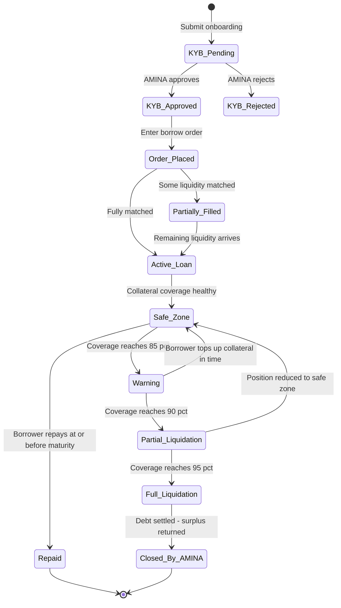
```mermaid
stateDiagram-v2
    [*] --> KYB_Pending : Submit onboarding
    KYB_Pending --> KYB_Approved : AMINA approves
    KYB_Pending --> KYB_Rejected : AMINA rejects
    KYB_Approved --> Order_Placed : Enter borrow order
    Order_Placed --> Partially_Filled : Some liquidity matched
    Order_Placed --> Active_Loan : Fully matched
    Partially_Filled --> Active_Loan : Remaining liquidity arrives
    Active_Loan --> Safe_Zone : Collateral coverage healthy
    Safe_Zone --> Warning : Coverage reaches 85 pct
    Warning --> Safe_Zone : Borrower tops up collateral in time
    Warning --> Partial_Liquidation : Coverage reaches 90 pct
    Partial_Liquidation --> Safe_Zone : Position reduced to safe zone
    Partial_Liquidation --> Full_Liquidation : Coverage reaches 95 pct
    Safe_Zone --> Repaid : Borrower repays at or before maturity
    Full_Liquidation --> Closed_By_AMINA : Debt settled - surplus returned
    Repaid --> [*]
    Closed_By_AMINA --> [*]
```

Margin warning and response flow.

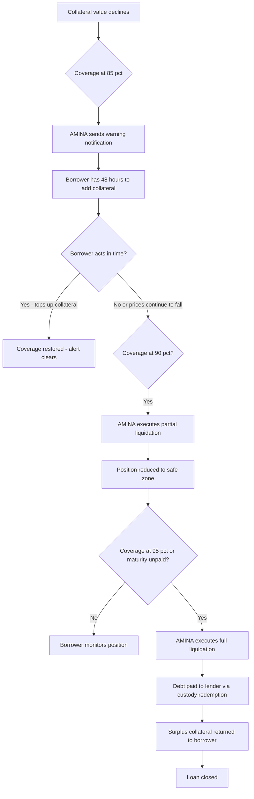
```mermaid
flowchart TD
    A[Collateral value declines] --> B{Coverage at 85 pct}
    B --> C[AMINA sends warning notification]
    C --> D[Borrower has 48 hours to add collateral]
    D --> E{Borrower acts in time?}
    E -->|Yes - tops up collateral| F[Coverage restored - alert clears]
    E -->|No or prices continue to fall| G{Coverage at 90 pct?}
    G -->|Yes| H[AMINA executes partial liquidation]
    H --> I[Position reduced to safe zone]
    I --> J{Coverage at 95 pct or maturity unpaid?}
    J -->|No| K[Borrower monitors position]
    J -->|Yes| L[AMINA executes full liquidation]
    L --> M[Debt paid to lender via custody redemption]
    M --> N[Surplus collateral returned to borrower]
    N --> O[Loan closed]
```

---

## 5. AMINA Bank (Broker + Curator + Liquidator)

### Profile

AMINA Bank is a Swiss-regulated crypto bank (formerly SEBA Bank) holding a FINMA Banking and Securities Dealer licence since 2019, with additional authorisations under MiCA (Austria), the SFC (Hong Kong), and FSRA (Abu Dhabi). In this protocol, AMINA wears three hats simultaneously: licensed broker (matching is legally AMINA's brokerage activity, not P2P's), curator (AMINA sets risk parameters and approves counterparties), and liquidator (AMINA is the only party authorised to issue warnings and execute liquidations). AMINA does not build or operate the platform software, does not hold balance-sheet credit exposure, and does not disclose counterparty identities even though it knows both sides of every deal. AMINA earns 20 basis points on deal volume plus a liquidation bonus on each recovery event; its lending book — zero defaults over five years — is the credibility anchor for the protocol.

### What they want (user stories)

| ID | User story | Source |
|----|-----------|--------|
| AMINA-1 | As AMINA's compliance team, I want to review a counterparty's KYB submission and approve or reject it, so that only entities that have passed FINMA-grade screening can access the protocol. | §7, §11 |
| AMINA-2 | As AMINA's risk desk, I want to set and update the base lending rate (revised approximately quarterly), so that the protocol reflects current market conditions without exposing the rate-setting process to borrower or lender influence. | §4 |
| AMINA-3 | As AMINA's risk desk, I want to configure the loan-to-value ratio for each accepted custody issuer and collateral type, so that every deal opened against that issuer is collateralised to the standard AMINA has underwritten. | §6, §9 |
| AMINA-4 | As AMINA's risk desk, I want a real-time portfolio dashboard showing all active positions, each borrower's current utilization, and any positions approaching warning thresholds, so that I can act before a default rather than after. | §7, §8, §9 |
| AMINA-5 | As AMINA's risk desk, I want the system to surface a position that has crossed 85% utilization and let me send the borrower a formal warning with a 48-hour deadline to top up, so that I have a documented, time-stamped first step. | §9 |
| AMINA-6 | As AMINA's risk desk, I want to initiate a partial liquidation on any position that remains above 90% utilization after the warning period, so that I can bring it back into the safe band without terminating the deal unnecessarily. | §9 |
| AMINA-7 | As AMINA's risk desk, I want to execute a full liquidation on any position at or above 95% utilization or any deal at maturity unpaid — paying the lender and redeeming collateral at the custodian instantly — so that recovery completes without court process or arbitration. | §9 |
| AMINA-8 | As AMINA's operations team, I want fee income (20 bps per settled deal plus liquidation bonuses) aggregated in a revenue statement, so that I can reconcile protocol earnings against AMINA's internal accounts. | §6, §12 |
| AMINA-9 | As AMINA's compliance team, I want to suspend a counterparty's access mid-protocol if their KYB status changes (e.g. a sanctions update), so that AMINA can meet ongoing regulatory obligations without waiting for deals to mature. | §7, §11 |
| AMINA-10 | As AMINA's management, I want an audit trail showing every parameter change, every KYB decision, and every liquidation action permanently recorded with a timestamp, so that regulators can verify decisions were executed under AMINA's licence. *(Extrapolated: the brief mandates an on-chain record of deals; extending a permanent timestamped audit trail to KYB and parameter decisions is a product design choice, not a brief-mandated requirement.)* | §4, §11 |

### Use cases

**UC-AMINA-01: Approve a new counterparty (KYB)**

- **Primary actor**: AMINA Compliance Team
- **Goal**: Screen and approve an institution that has submitted a KYB application, so it may participate as lender or borrower.
- **Preconditions**: P2P has collected the counterparty's KYB documents via the onboarding UI; the submission is queued in the AMINA compliance portal.
- **Trigger**: AMINA receives a notification that a new KYB submission is ready for review.
- **Main flow**:
  1. The compliance officer opens the KYB review queue and selects the pending submission.
  2. The screen shows the institution's documents, jurisdiction, and entity type alongside the P2P-collected data.
  3. The officer reviews the submission against FINMA AML and KYC standards.
  4. The officer marks the application Approved and selects the jurisdiction code; the platform records the decision and the approving officer's identity.
  5. The counterparty receives a notification that their account is active and they may connect a custody wallet and enter intents.
- **Alternate / exception flows**:
  - 5a. If documents are incomplete, the officer marks the submission Pending — Additional Information Required and the counterparty is notified to resubmit.
  - 5b. If the institution fails screening, the officer marks it Rejected; the counterparty is notified and access is blocked. The decision is recorded with a reason code.
- **Outcome**: The counterparty is approved and can transact, or is rejected with a documented reason.
- **Maps to**: §3, §7, §11.

**UC-AMINA-02: Set and publish the base lending rate**

- **Primary actor**: AMINA Risk Desk
- **Goal**: Update the fixed base lending rate applying to all new deals until the next quarterly review.
- **Preconditions**: AMINA has completed its market review cycle (approximately quarterly); the previous rate is on record.
- **Trigger**: AMINA's risk desk initiates the quarterly rate review.
- **Main flow**:
  1. The risk desk opens the Rate Management screen, showing the current base rate, the date it was set, and the volume-weighted average rate from the past quarter.
  2. The officer enters the new base rate and reviews the resulting borrow and lend rates at the 40 bps spread (e.g. base 7.4% → borrow 7.6%, lend 7.2%).
  3. The officer confirms and approves; the platform records the new rate with a timestamp.
  4. All new matched deals are priced at the updated rate; in-flight deals already matched retain their original agreed rate.
  5. Counterparties see the updated rate on their dashboards the next time they view available liquidity.
- **Alternate / exception flows**:
  - 3a. If an out-of-cycle market event requires an interim adjustment, the risk desk can repeat this flow at any time; each change is recorded with a reason code.
- **Outcome**: The new rate is live for subsequent matching; the change is logged with timestamp and approver identity.
- **Maps to**: §4, §8.

**UC-AMINA-03: Monitor active portfolio and identify at-risk positions**

- **Primary actor**: AMINA Risk Desk
- **Goal**: Maintain a real-time view of all active deals and identify borrowers whose utilization is approaching or has crossed warning thresholds.
- **Preconditions**: At least one deal is active. AMINA has access to the Risk Dashboard.
- **Trigger**: Ongoing review during the business day, or a system alert.
- **Main flow**:
  1. The risk desk opens the Portfolio Risk Dashboard, showing all active deals aggregated by borrower: outstanding amount, collateral posted, current utilization, maturity date, and a traffic-light health indicator.
  2. The officer filters by utilization to surface positions in the amber zone (approaching 85%) or red zone (above 85%).
  3. For each flagged position, the officer drills into the detail: collateral asset type, current market value, LTV set at origination, and the utilization trend over the past 24 hours.
  4. The officer decides whether to monitor further or initiate the warning flow (UC-AMINA-04).
- **Alternate / exception flows**:
  - 2a. If a position crosses a threshold, the system sends a push notification and moves the position to the top of the dashboard automatically.
- **Outcome**: AMINA has a current view of portfolio health and has identified positions requiring intervention.
- **Maps to**: §7, §9.

**UC-AMINA-04: Issue a margin warning and manage the three-stage liquidation**

- **Primary actor**: AMINA Risk Desk
- **Goal**: Execute the appropriate liquidation stage for a position that has crossed a utilization threshold, protecting the lender while following the documented three-stage procedure.
- **See also**: Section 8.4 shows the same three-stage sequence as a cross-actor flow.

**Three-stage margin summary** (referenced by UC-LEN-05, UC-BOR-04, and Section 8.4):

| Stage | Utilization | Trigger | AMINA action | Borrower window |
|-------|-------------|---------|--------------|-----------------|
| 1 — Warning | 85% | Coverage reaches warning level | Issue 48-hour warning to add collateral | 48 hours to top up |
| 2 — Partial liquidation | 90% | Warning unresolved | Liquidate minimum portion to restore safe zone | None (automatic) |
| 3 — Full liquidation | 95% or maturity unpaid | Coverage critical or deal unpaid at maturity | Pay lender in full, redeem collateral at custody, return surplus | None (automatic) |
- **Preconditions**: A deal is active. AMINA is monitoring the portfolio (UC-AMINA-03).
- **Trigger**: A position crosses 85%, 90%, or 95% utilization, or a deal reaches maturity unpaid.
- **Main flow**:
  - **Stage 1 — Warning (85%)**:
    1. The dashboard flags the position amber. The officer confirms the utilization reading.
    2. The officer selects "Issue Warning." The platform notifies the borrower that utilization has reached 85% and that they have 48 hours to add collateral.
    3. The system records the warning with a timestamp; the detail screen shows "Warning issued — 48-hour clock running."
    4. If the borrower tops up within 48 hours and utilization returns below the threshold, the warning clears and the deal continues normally.
  - **Stage 2 — Partial liquidation (90%)**:
    5. If utilization reaches 90%, the position moves red.
    6. The officer selects "Initiate Partial Liquidation." The platform calculates the minimum liquidation amount needed to restore the safe zone and presents it for confirmation.
    7. The officer confirms. AMINA liquidates the required portion: the relevant supply tokens are redeemed at the custodian for collateral; proceeds settle the partial debt to the lender. Any unrealised surplus on the liquidated portion is returned to the borrower. *(Extrapolated: the brief specifies surplus return in the full-liquidation case; applying a pro-rata surplus return after a partial liquidation requires confirmation with AMINA and the custodian on partial-liquidation mechanics.)*
    8. The detail screen updates to reflect the reduced position, the new utilization, and a record of the event with timestamp.
  - **Stage 3 — Full liquidation (95% or maturity default)**:
    9. If utilization reaches 95%, or a deal reaches maturity unpaid, the position triggers full liquidation.
    10. The officer selects "Initiate Full Liquidation." The platform presents the full summary: total outstanding debt, collateral to be redeemed, lender account to be paid, and the liquidation bonus AMINA will receive.
    11. The officer confirms. AMINA pays the full debt to the lender, receives the supply tokens, and redeems the collateral at the custodian for real assets. Recovery is immediate — no court, no arbitration.
    12. Any collateral surplus beyond the debt and bonus is returned to the borrower's custody account.
    13. The deal is marked Closed — Liquidated. The lender is notified that their position has been repaid; the borrower is notified of the liquidation, the amount recovered, and any surplus returned.
- **Alternate / exception flows**:
  - 4a. The borrower disputes the utilization reading: the risk desk can pull the underlying price attestation and share it with the borrower before proceeding.
  - 7a. If the partial liquidation is insufficient (value continues falling rapidly), the system recalculates and AMINA may initiate a further partial or move directly to full liquidation.
- **Outcome**: The lender is made whole; any borrower surplus is returned; the liquidation is recorded with all amounts, timestamps, and approver identity.
- **Maps to**: §9, §2.

**UC-AMINA-05: Configure LTV and risk parameters for a custody issuer**

- **Primary actor**: AMINA Risk Desk
- **Goal**: Set or update the loan-to-value ratio and liquidation thresholds for all deals involving a specific custody issuer and collateral type.
- **Preconditions**: The custody issuer has been registered. AMINA holds the curator role.
- **Trigger**: A new custody issuer is being onboarded, or AMINA is updating parameters for an existing issuer following a risk review.
- **Main flow**:
  1. The risk desk opens the Issuer Parameters screen and selects the relevant custody issuer.
  2. The current parameters are displayed: LTV ratio, warning threshold, partial-liquidation threshold, full-liquidation threshold, and accepted collateral types.
  3. The officer enters the new values (e.g. LTV 85%, warning at 85%, partial at 90%, full at 95%) and adds a rationale note.
  4. The officer confirms and approves; the platform records the updated parameters with timestamp and approver identity.
  5. New deals matched against this issuer use the updated parameters. Existing deals retain the parameters in place at origination.
- **Alternate / exception flows**:
  - 4a. If AMINA needs to suspend an issuer (e.g. its operational status changes), the risk desk can deactivate it, preventing new deals while leaving existing deals to run to maturity under their original terms.
- **Outcome**: Parameters are updated and logged; the change takes effect for all new matching from this point.
- **Maps to**: §6, §7, §9.

### Journey diagrams

AMINA's three-stage liquidation journey, from monitoring through recovery.

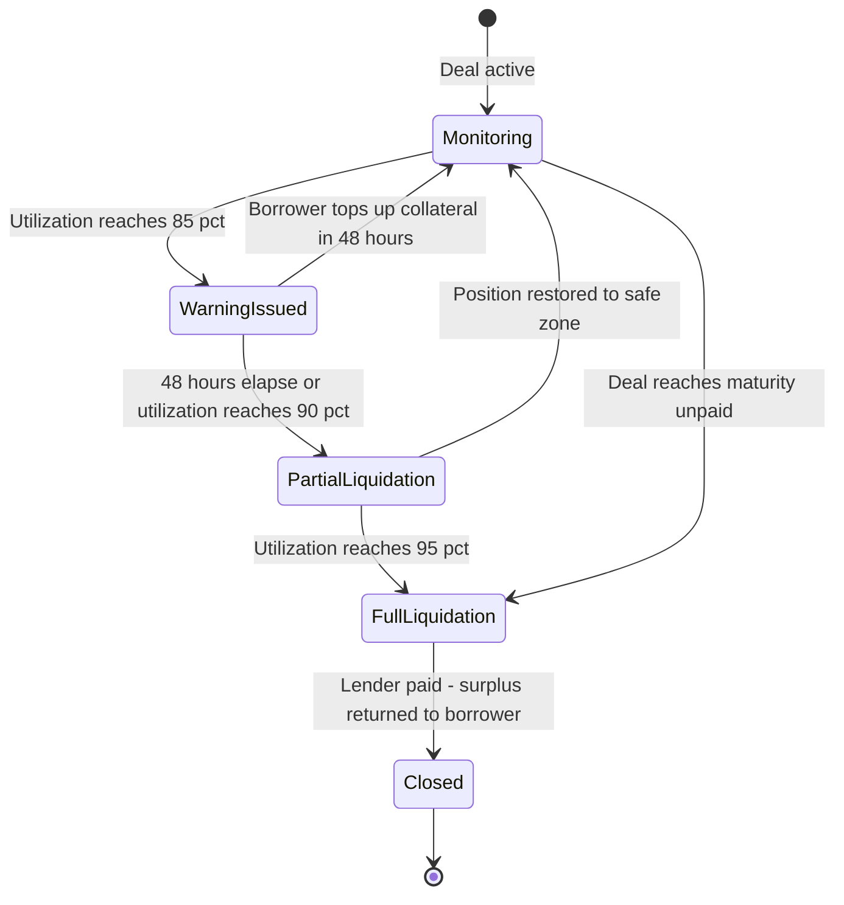
```mermaid
stateDiagram-v2
    [*] --> Monitoring : Deal active
    Monitoring --> WarningIssued : Utilization reaches 85 pct
    WarningIssued --> Monitoring : Borrower tops up collateral in 48 hours
    WarningIssued --> PartialLiquidation : 48 hours elapse or utilization reaches 90 pct
    PartialLiquidation --> Monitoring : Position restored to safe zone
    PartialLiquidation --> FullLiquidation : Utilization reaches 95 pct
    Monitoring --> FullLiquidation : Deal reaches maturity unpaid
    FullLiquidation --> Closed : Lender paid - surplus returned to borrower
    Closed --> [*]
```

AMINA's quarterly rate-setting and parameter governance cycle.

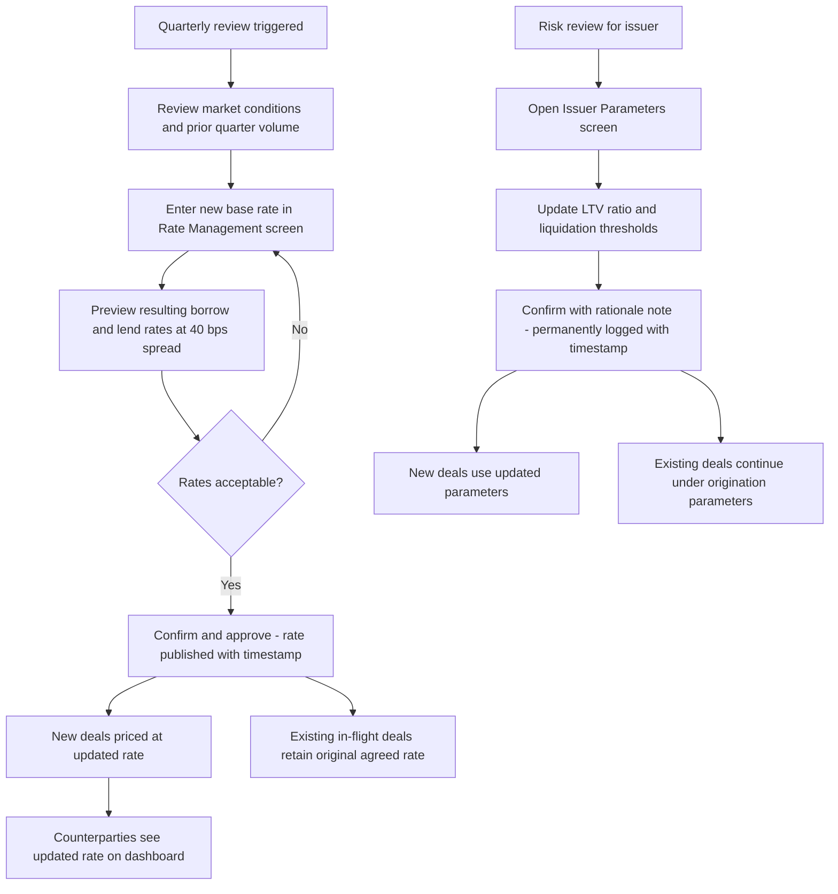
```mermaid
flowchart TD
    A[Quarterly review triggered] --> B[Review market conditions and prior quarter volume]
    B --> C[Enter new base rate in Rate Management screen]
    C --> D[Preview resulting borrow and lend rates at 40 bps spread]
    D --> E{Rates acceptable?}
    E -- Yes --> F[Confirm and approve - rate published with timestamp]
    E -- No --> C
    F --> G[New deals priced at updated rate]
    F --> H[Existing in-flight deals retain original agreed rate]
    G --> I[Counterparties see updated rate on dashboard]

    J[Risk review for issuer] --> K[Open Issuer Parameters screen]
    K --> L[Update LTV ratio and liquidation thresholds]
    L --> M[Confirm with rationale note - permanently logged with timestamp]
    M --> N[New deals use updated parameters]
    M --> O[Existing deals continue under origination parameters]
```

---

## 6. P2P Staking (Technology Provider)

### Profile

P2P Staking (Cayman Islands) is the technology provider that builds, operates, and maintains the platform: the web application, the matching engine, the rate display, the onboarding UI, and the settlement routing layer. Its primary concern is platform reliability, institutional-grade user experience, and clean data flows between participants — it is the rails the product runs on. P2P Staking never touches assets, never makes credit or risk decisions, and never approves or rejects counterparties; those functions belong to AMINA. Its revenue is a 20 basis point infrastructure fee on matched volume, and its risk exposure is reputational, mitigated through audits and a bug bounty programme.

### What they want (user stories)

| ID | User story | Source |
|----|-----------|--------|
| P2P-1 | As P2P Staking, I want to present prospective participants with a guided onboarding flow that collects KYB documentation, so that AMINA has the information it needs to screen and approve new clients. | §3, §7, §11 |
| P2P-2 | As P2P Staking, I want to display the current AMINA-set base rate and available liquidity on the dashboard, so that participants form accurate expectations before entering an intent. | §3, §4 |
| P2P-3 | As P2P Staking, I want to run the matching engine that pairs lender and borrower intents into bilateral deals, so that liquidity is allocated in a compliant, orderly manner under AMINA's brokerage licence. | §4, §8 |
| P2P-4 | As P2P Staking, I want to present each participant with a consolidated position view that aggregates all underlying bilateral deals, so that the user experience is simple regardless of how many splits the engine created. | §3, §4 |
| P2P-5 | As P2P Staking, I want to route signed deal terms to the on-chain escrow and settlement layer, so that collateral is locked and supply tokens are released automatically once both parties confirm. | §2, §8 |
| P2P-6 | As P2P Staking, I want to surface real-time settlement and position status to all participants, so that each party can see the state of their deals without contacting a counterparty or intermediary. | §3, §8 |
| P2P-7 | As P2P Staking, I want to deliver configurable notifications (margin warnings, maturity alerts, fill confirmations), so that participants are informed of time-sensitive events without polling the dashboard manually. | §8, §9 |
| P2P-8 | As P2P Staking, I want to provide AMINA with an operator panel to set and update risk parameters (rates, LTV bands, liquidation thresholds), so that AMINA can exercise its curator role without a platform code change. | §4, §6 |
| P2P-9 | As P2P Staking, I want to track infrastructure fee accrual and report on matched volume, so that P2P can reconcile its 20 bps revenue and demonstrate platform activity to stakeholders. | §6, §12 |
| P2P-10 | As P2P Staking, I want to maintain an audit trail and exportable records of all onboarding submissions, deal events, and settlement instructions, so that the platform can support regulatory reviews and participant queries. | §7, §11 |

### Use cases

**UC-P2P-01: Onboard a new participant**

- **Primary actor**: P2P Staking (platform operator)
- **Goal**: Collect and submit the participant's KYB documentation so AMINA can screen and approve them.
- **Preconditions**: The prospective participant has a custody account with tokenized assets and has been introduced to the platform.
- **Trigger**: A prospective lender or borrower requests access.
- **Main flow**:
  1. The participant visits the onboarding section and is presented with a structured, step-by-step document-upload flow.
  2. The platform guides them through entity details, beneficial ownership information, and supporting compliance documents.
  3. On submission, the platform shows a confirmation screen and communicates that review is in progress (expected duration: days).
  4. AMINA reviews the submission against its FINMA screening standards and records an approval or rejection.
  5. The platform notifies the participant of the outcome.
  6. If approved, the participant reviews and accepts the one-time click-through terms (token definitions, platform liability limits, auto-liquidation rules, electronic-records consent), then links their custody wallet and is granted access to the trading dashboard.
- **Alternate / exception flows**:
  - A1. AMINA requests additional documentation. The platform surfaces a checklist of outstanding items; the participant uploads the missing materials and the review clock restarts.
  - A2. AMINA rejects the application. The platform displays a rejection notice; the participant may contact AMINA directly as AMINA's client.
- **Outcome**: The participant is KYB-approved, their custody wallet is connected, and they can enter lending or borrowing intents.
- **Maps to**: §3, §7, §11.

**UC-P2P-02: Run the matching engine and present deal terms**

- **Primary actor**: P2P Staking (platform operator, matching engine)
- **Goal**: Match lender and borrower intents into bilateral deals and present each party a clear summary to review and confirm.
- **Preconditions**: Both parties are KYB-approved and have submitted intents. AMINA's current base rate is set.
- **Trigger**: A lender or borrower submits an intent.
- **Main flow**:
  1. The participant enters an intent (e.g. "Lend 2 million USDC, 3 months"). The platform shows the current AMINA-set indicative rate and available opposite-side liquidity.
  2. The matching engine runs in the background, pairing the intent against available orders first-come, first-served, splitting large orders into multiple bilateral deals as needed.
  3. The platform returns a match summary: total filled amount, rate, term, and — where the order was split — a note that the position is backed by multiple underlying deals presented as one.
  4. If only partially filled, the dashboard shows the filled portion and the pending remainder (e.g. "1.2M of 2M filled, remainder pending").
  5. The participant reviews the deal terms on a confirmation screen and approves the agreement with a single on-screen signing action.
  6. The platform sends the confirmed deal terms to settlement. Collateral is locked and the borrower's funds are released.
  7. The participant's dashboard updates to show the active position.
- **Alternate / exception flows**:
  - A1. No opposite-side liquidity is immediately available. The platform holds the intent as an open order and notifies the participant on partial or full match.
  - A2. The participant withdraws the intent before it is matched. The platform cancels the open order and confirms cancellation.
- **Outcome**: Bilateral deals are on-chain; both parties' dashboards reflect the active, consolidated position.
- **Maps to**: §3, §4.

**UC-P2P-03: Surface settlement and position status**

- **Primary actor**: P2P Staking (platform operator)
- **Goal**: Provide participants with a clear, real-time view of active positions, maturity schedule, and settlement events.
- **Preconditions**: One or more deals are active on-chain.
- **Trigger**: A participant opens their dashboard, or a settlement event occurs (deal creation, collateral movement, repayment, maturity).
- **Main flow**:
  1. The participant sees a consolidated summary of all active positions: amount, rate, term remaining, and current collateral status.
  2. Underlying bilateral deals are visible in a detail panel if the participant wishes to inspect them, but the default view is the aggregated position.
  3. The platform displays maturity dates and sends configurable notifications as maturity approaches (e.g. reminders at 7 days and 1 day before — specific timing is a product-design choice; the brief specifies the "maturity approaching" notification type only).
  4. At maturity, the platform shows the repayment amount due (principal plus simple interest) and prompts the borrower to arrange repayment.
  5. Once repayment is confirmed on-chain, the platform shows collateral as released and updates the position to closed.
  6. The participant can download a deal statement or export position history at any time.
- **Alternate / exception flows**:
  - A1. AMINA issues a margin warning. The platform surfaces a prominent alert on the borrower's dashboard and sends a notification, showing the time window and additional collateral required.
  - A2. A settlement instruction is delayed at custody. The platform displays a "settlement pending" status with a timestamp so the participant is not left without information.
- **Outcome**: Participants have a continuous, accurate view of their positions without needing to contact P2P, AMINA, or the custodian for routine status.
- **Maps to**: §3, §8, §9.

**UC-P2P-04: Provide the AMINA operator panel**

- **Primary actor**: P2P Staking (platform operator); secondary: AMINA Bank (curator)
- **Goal**: Enable AMINA to set and update risk parameters — rates, LTV bands, liquidation thresholds — through a governed operator interface, without a platform code change.
- **Preconditions**: AMINA is registered as curator. P2P has provisioned AMINA's operator access.
- **Trigger**: AMINA decides to revise the base rate (approximately quarterly) or update an LTV or liquidation parameter.
- **Main flow**:
  1. An authorised AMINA operator logs into the operator panel provided by the platform.
  2. AMINA reviews current active parameters (base rate, LTV range, warning / partial / full liquidation thresholds, fee configuration).
  3. AMINA enters the new values and confirms the change within the panel.
  4. The platform applies the updated parameters; they take effect immediately for new deals. The participant-facing dashboard reflects the new rate from the next time a participant views available liquidity. In-flight deals retain their original agreed terms.
  5. The platform logs the change with timestamp and approving operator identity for audit purposes.
- **Alternate / exception flows**:
  - A1. A proposed change falls outside a permitted range. The platform flags the out-of-range value and prevents submission until AMINA corrects it.
- **Outcome**: AMINA's updated parameters are live; participants see the updated rate on their next dashboard load. No new software deployment is required.
- **Maps to**: §4, §6, §8.

**UC-P2P-05: Monitor infrastructure revenue and platform health**

- **Primary actor**: P2P Staking (platform operator)
- **Goal**: Track matched volume, accrued infrastructure fees, and platform operational health for business management and stakeholder reporting.
- **Preconditions**: The platform is live with at least one active deal.
- **Trigger**: P2P operations or finance opens the internal reporting view, or an automated daily report is generated.
- **Main flow**:
  1. P2P's internal team accesses an operations dashboard showing current matched volume (cumulative and rolling), active deal count, and aggregate position sizes by asset type.
  2. The platform calculates accrued infrastructure fee revenue (20 bps on matched volume) and presents a running total with historical period breakdowns.
  3. The team reviews platform health indicators: matching engine throughput, settlement routing latency, on-chain confirmation status, and any failed or pending instructions.
  4. The team exports period reports in a standard format for accounting, investor reporting, or regulatory review.
  5. Anomalies (e.g. a settlement instruction not confirmed within an expected window) are surfaced as operational alerts.
- **Alternate / exception flows**:
  - A1. A settlement routing failure is detected. The platform logs the event, alerts the operations team, and holds the affected instruction in a "pending review" state until resolved.
- **Outcome**: P2P has a clear, current view of revenue accrual and platform status, with exportable records available.
- **Maps to**: §6, §8, §12.

### Journey diagrams

Platform operator onboarding intake flow.

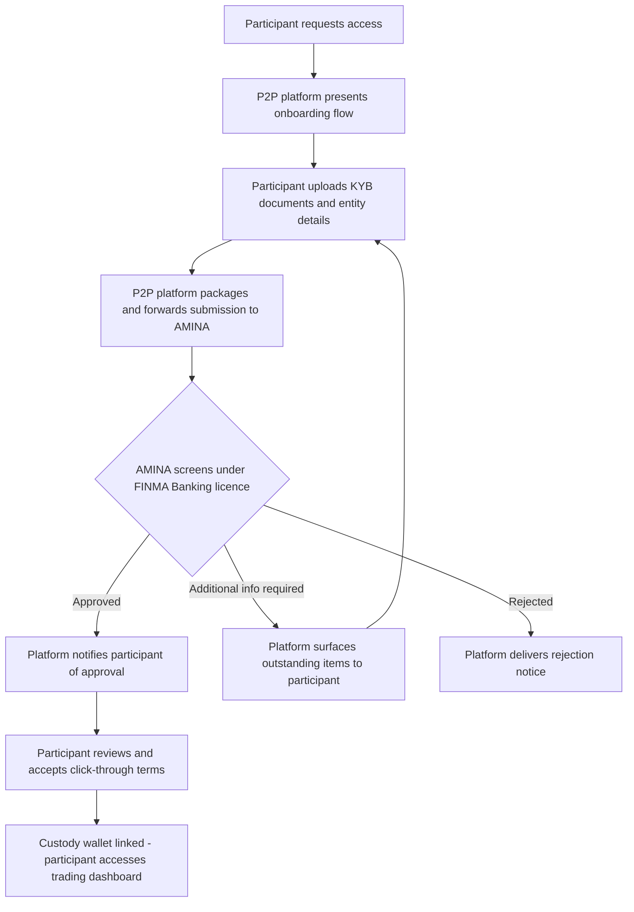
```mermaid
flowchart TD
    A[Participant requests access] --> B[P2P platform presents onboarding flow]
    B --> C[Participant uploads KYB documents and entity details]
    C --> D[P2P platform packages and forwards submission to AMINA]
    D --> E{AMINA screens under FINMA Banking licence}
    E -->|Approved| F[Platform notifies participant of approval]
    E -->|Additional info required| G[Platform surfaces outstanding items to participant]
    G --> C
    E -->|Rejected| H[Platform delivers rejection notice]
    F --> I[Participant reviews and accepts click-through terms]
    I --> J[Custody wallet linked - participant accesses trading dashboard]
```

Deal position lifecycle as surfaced by the platform (this shows the deal's states as the platform displays them to participants, not P2P's own operational states).

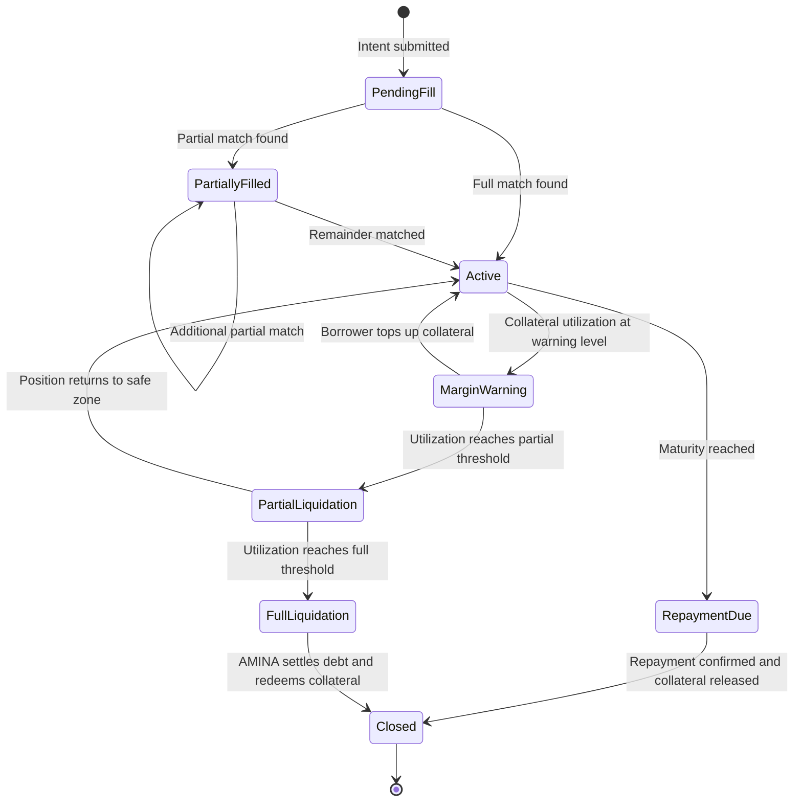
```mermaid
stateDiagram-v2
    [*] --> PendingFill : Intent submitted
    PendingFill --> PartiallyFilled : Partial match found
    PendingFill --> Active : Full match found
    PartiallyFilled --> Active : Remainder matched
    PartiallyFilled --> PartiallyFilled : Additional partial match
    Active --> MarginWarning : Collateral utilization at warning level
    MarginWarning --> Active : Borrower tops up collateral
    MarginWarning --> PartialLiquidation : Utilization reaches partial threshold
    PartialLiquidation --> Active : Position returns to safe zone
    PartialLiquidation --> FullLiquidation : Utilization reaches full threshold
    Active --> RepaymentDue : Maturity reached
    RepaymentDue --> Closed : Repayment confirmed and collateral released
    FullLiquidation --> Closed : AMINA settles debt and redeems collateral
    Closed --> [*]
```

---

## 7. Custodian (Token Issuer)

### Profile

The Custodian is a regulated custody provider — AMINA Bank (via Tokeny), Fireblocks, Fordefi, BitGo, or Anchorage, depending on the institution's existing relationship — that holds real assets (BTC, ETH, USDC, stablecoins) in segregated accounts and issues 1:1-backed tokens representing claims on those assets. The Custodian cares about the integrity of the backing relationship: every token it mints must be matched by a real asset it holds, and every redemption must result in an accurate transfer of real value. The Custodian does not set interest rates, approve loans, match orders, or liquidate positions; it holds assets and executes tokenization and redemption mechanics on instruction. Revenue is the Custodian's existing custody fee schedule, which sits entirely outside the 40-basis-point protocol spread. The Custodian also serves as the identity anchor for the protocol: the mapping between on-chain wallet addresses and verified institutional entities lives exclusively with the Custodian, making its KYC and KYB records the ground truth of who is participating.

> **Note — Custodian and AMINA may be the same entity.** In the simplest deployment, AMINA Bank serves as both the broker/curator and the custodian (via Tokeny). The flows in this document show the Custodian as a separate actor for clarity, because in many deployments it is a different institution (Fireblocks, BitGo, etc.). Where AMINA and the Custodian are the same entity, the instructions that pass between them are internal, and the separate "Custodian" steps in the diagrams become AMINA's own custody operations. Whether the Custodian is a third party or AMINA itself is a per-deployment decision.

### What they want (user stories)

| ID | User story | Source |
|----|-----------|--------|
| CUST-1 | As a Custodian, I want to mint a supply token 1:1 against USDC a lender has deposited, so the lender can place that token into the protocol and earn yield. | §2, §6 |
| CUST-2 | As a Custodian, I want to mint a collateral token 1:1 against a borrower's real BTC or ETH held in a segregated account, so the borrower can post it without transferring the underlying asset off custody. | §2, §6 |
| CUST-3 | As a Custodian, I want to attest at any time that each outstanding token is fully backed by the corresponding real asset, so any participant or regulator can verify the backing relationship. | §6, §8 |
| CUST-4 | As a Custodian, I want to process a redemption — accepting a supply token and delivering real USDC to the requesting institution — so the borrower can receive the liquidity they have arranged. | §2, §9 |
| CUST-5 | As a Custodian, I want to execute a settlement transfer between two custody accounts on AMINA's instruction when a deal matures, so principal and interest are delivered accurately and the collateral token is released. | §2, §9 |
| CUST-6 | As a Custodian, I want to process a liquidation redemption on AMINA's instruction — accepting supply tokens and transferring the corresponding collateral to AMINA — so lender recovery is instant and requires no court process. | §2, §9 |
| CUST-7 | As a Custodian, I want to maintain the authoritative mapping between on-chain wallet addresses and verified institutional identities, so the protocol can rely on my KYC and KYB records rather than building a separate identity layer. | §2, §5, §6 |
| CUST-8 | As a Custodian, I want to retire tokens when assets are withdrawn or a position is fully settled, so outstanding token supply always equals assets on deposit and the backing ratio never falls below 1:1. | §6, §8 |
| CUST-9 | As a Custodian, I want to notify the protocol when a custody account's status changes — such as a deactivation or KYB suspension — so dependent positions can be flagged for review without disrupting other participants. | §7, §11 |

### Use cases

**UC-CUST-01: Mint supply token for incoming lender USDC**

- **Primary actor**: Custodian
- **Goal**: Issue a 1:1-backed supply token so the lender can deploy USDC into the protocol.
- **Preconditions**: Lender has completed KYB and holds a verified custody account; USDC is confirmed in the lender's segregated account.
- **Trigger**: Lender instructs the Custodian to prepare USDC for protocol participation.
- **Main flow**:
  1. Lender logs into the custody portal and selects the amount of USDC to tokenize for lending.
  2. Custodian confirms the USDC balance in the segregated account.
  3. Custodian issues the corresponding supply token to the lender's linked wallet, recording the issuance against the held USDC.
  4. The lender's custody portal shows the supply token balance and confirms the underlying USDC is held at custody.
  5. The lender can now place the supply token into the protocol.
- **Alternate / exception flows**:
  - 2a. USDC has not yet settled at custody: the Custodian holds issuance until settlement is confirmed; the lender sees a "pending" status.
  - 3a. The lender's wallet has not passed KYB: the Custodian declines to mint and routes the lender back to KYB onboarding.
- **Outcome**: Supply token is live and available; underlying USDC is fully segregated at the Custodian.
- **Maps to**: §2, §3, §6.

**UC-CUST-02: Mint collateral token for borrower assets**

- **Primary actor**: Custodian
- **Goal**: Issue a 1:1-backed collateral token so the borrower can post crypto as collateral without selling or moving it off custody.
- **Preconditions**: Borrower has completed KYB and holds a verified custody account; real assets (BTC, ETH, USDC, or stablecoins) are confirmed in the segregated account.
- **Trigger**: Borrower instructs the Custodian to prepare assets for use as collateral.
- **Main flow**:
  1. Borrower selects the asset type and quantity to tokenize.
  2. Custodian verifies the balance and confirms it is unencumbered.
  3. Custodian issues the collateral token to the borrower's linked wallet, recording the issuance against the held asset.
  4. The borrower's portal shows the collateral token balance and confirms the underlying asset remains segregated at custody.
  5. The borrower can post the collateral token to open a borrowing position.
- **Alternate / exception flows**:
  - 2a. Asset balance insufficient for the requested amount: the Custodian notifies the borrower of the shortfall; no token is issued.
  - 2b. Asset type not currently accepted: the Custodian declines and surfaces the accepted types (BTC, ETH, USDC, stablecoins).
- **Outcome**: Collateral token is live; the underlying real asset remains segregated and never moves off custody.
- **Maps to**: §2, §3, §6.

**UC-CUST-03: Process redemption — supply token to real USDC**

- **Primary actor**: Custodian
- **Goal**: Accept the borrower's supply tokens and deliver real USDC, completing the drawdown of their loan.
- **Preconditions**: Borrower holds supply tokens received after collateral was posted and a deal matched; lender's USDC is confirmed at this Custodian.
- **Trigger**: Borrower presents supply tokens for redemption.
- **Main flow**:
  1. Borrower presents supply tokens via the custody portal or standard settlement instruction.
  2. Custodian verifies the token quantity against its records of outstanding supply.
  3. Custodian cancels and retires the supply token and releases the corresponding real USDC to the borrower's designated account.
  4. The borrower's portal updates to reflect the received USDC.
  5. Custodian records the redemption for reconciliation.
- **Alternate / exception flows**:
  - 2a. Token quantity exceeds the verified backed amount: the Custodian holds the redemption and escalates for reconciliation.
  - 3a. Borrower's receiving account is at a different institution: the Custodian routes the USDC via standard inter-institutional settlement.
- **Outcome**: Borrower has real USDC; the supply token is retired; custody records remain in balance.
- **Maps to**: §2, §9.

**UC-CUST-04: Execute settlement at deal maturity**

- **Primary actor**: Custodian (acting on settlement instruction)
- **Goal**: Deliver principal plus interest to the lender and release the borrower's collateral, concluding the deal cleanly.
- **Preconditions**: Deal has reached maturity; the borrower has repaid principal and interest into the protocol; the deal record confirms repayment is complete.
- **Trigger**: The platform confirms the deal is fully repaid and instructs the Custodian to release the collateral.
- **Main flow**:
  1. Custodian receives the settlement instruction from the platform.
  2. Custodian transfers principal plus interest to the lender's custody account, delivering the supply token backing as appropriate.
  3. Custodian cancels and retires the supply tokens covering the repaid amount.
  4. Custodian releases the collateral token lock, returning the borrower's collateral token to an unencumbered state.
  5. The borrower's portal shows collateral available for withdrawal or reuse; the lender's portal shows the returned principal plus interest.
- **Alternate / exception flows**:
  - 2a. Repayment is only partial at maturity: the Custodian executes settlement for the repaid portion and surfaces the shortfall; the deal is flagged for AMINA's liquidation process for the unpaid balance.
- **Outcome**: Deal is closed on-chain and off-chain; both parties' accounts reflect final balances; no pending obligations remain.
- **Maps to**: §2, §8, §9.

**UC-CUST-05: Execute liquidation redemption on AMINA instruction**

- **Primary actor**: Custodian (acting on AMINA's explicit instruction)
- **Goal**: Transfer collateral assets to AMINA following a liquidation event, enabling instant lender recovery.
- **Preconditions**: AMINA has determined the position meets the threshold for partial or full liquidation and holds or presents valid supply tokens covering the debt.
- **Trigger**: AMINA submits a liquidation redemption instruction.
- **Main flow**:
  1. Custodian receives the liquidation instruction from AMINA along with the supply tokens covering the owed amount.
  2. Custodian verifies the instruction is from AMINA and that the token quantity matches the collateral to be released.
  3. For partial liquidation: the Custodian transfers the relevant portion of the collateral to AMINA; remaining collateral stays in the borrower's segregated account; any surplus above the debt is returned to the borrower.
  4. For full liquidation: the Custodian transfers the full collateral to AMINA; any surplus above the debt and fees is returned to the borrower's account.
  5. Custodian cancels and retires the redeemed supply tokens and updates its records.
  6. Custodian confirms completion to AMINA and to the platform.
- **Alternate / exception flows**:
  - 2a. The instruction is not from AMINA: the Custodian declines; liquidation authority rests solely with AMINA.
  - 3a. Collateral value has moved and the token quantity does not precisely cover the debt: the Custodian escalates to AMINA for resolution before executing.
- **Outcome**: AMINA holds collateral covering the lender's claim; lender recovery is complete without court or arbitration; the borrower retains any surplus.
- **Maps to**: §2, §9.

**UC-CUST-06: Serve as identity anchor — KYC and KYB record**

- **Primary actor**: Custodian
- **Goal**: Maintain the authoritative mapping between on-chain wallet addresses and verified institutional identities so the protocol can enforce permissioned access without building its own identity layer.
- **Preconditions**: The institution has engaged the Custodian and completed the Custodian's own onboarding, including KYC and KYB checks.
- **Trigger**: P2P or AMINA requests confirmation of an address's institutional identity during onboarding or later.
- **Main flow**:
  1. P2P's onboarding flow prompts the institution to link their custody wallet address.
  2. The Custodian confirms, via its own records, that the linked address belongs to a verified institution and provides this identity attestation as one input to AMINA's review. The attestation is the identity anchor; it is not a separate approval the institution must clear before AMINA looks at the application.
  3. AMINA makes the single approval decision under its FINMA Banking licence, drawing on the P2P-collected KYB documents together with the Custodian's identity attestation.
  4. The institution's address is marked approved; they may now participate.
  5. If the institution's KYB status changes — suspension, expiry, or deactivation — the Custodian notifies the protocol so affected positions can be flagged.
- **Alternate / exception flows**:
  - 2a. The Custodian cannot confirm the address belongs to a verified institution (e.g. the address is not on record): it cannot provide an identity attestation, and P2P routes the institution back to the Custodian to establish that record before AMINA's review proceeds.
- **Outcome**: AMINA approves the institution on a single decision that combines P2P-collected KYB data and the Custodian's identity attestation; the protocol's identity assurance derives from the Custodian's existing regulated records.
- **Maps to**: §2, §5, §6, §7.

### Journey diagrams

Token issuance lifecycle as the Custodian experiences it, from receiving real assets to retiring tokens at settlement.

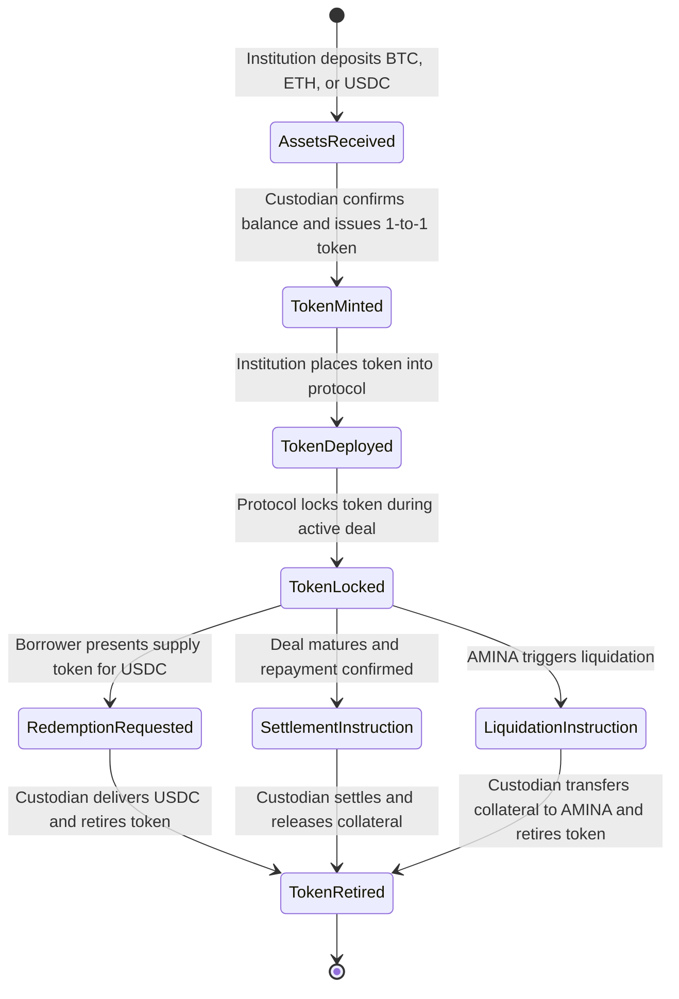
```mermaid
stateDiagram-v2
    [*] --> AssetsReceived : Institution deposits BTC, ETH, or USDC
    AssetsReceived --> TokenMinted : Custodian confirms balance and issues 1-to-1 token
    TokenMinted --> TokenDeployed : Institution places token into protocol
    TokenDeployed --> TokenLocked : Protocol locks token during active deal
    TokenLocked --> RedemptionRequested : Borrower presents supply token for USDC
    TokenLocked --> SettlementInstruction : Deal matures and repayment confirmed
    TokenLocked --> LiquidationInstruction : AMINA triggers liquidation
    RedemptionRequested --> TokenRetired : Custodian delivers USDC and retires token
    SettlementInstruction --> TokenRetired : Custodian settles and releases collateral
    LiquidationInstruction --> TokenRetired : Custodian transfers collateral to AMINA and retires token
    TokenRetired --> [*]
```

Custodian's role in the identity and onboarding chain.

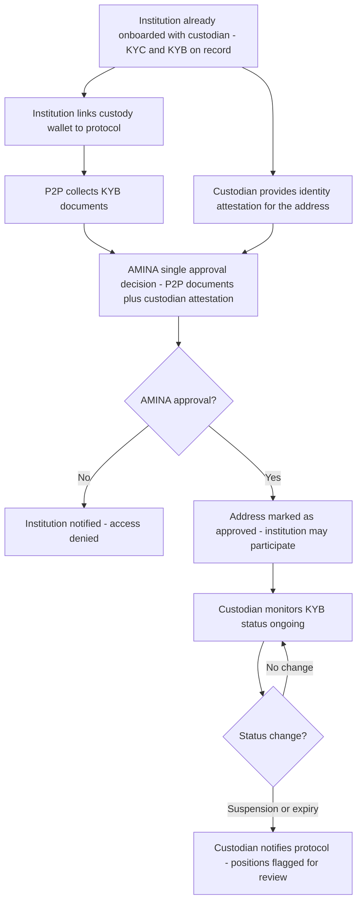
```mermaid
flowchart TD
    A[Institution already onboarded with custodian - KYC and KYB on record] --> E[Institution links custody wallet to protocol]
    E --> F[P2P collects KYB documents]
    A --> CA[Custodian provides identity attestation for the address]
    F --> G[AMINA single approval decision - P2P documents plus custodian attestation]
    CA --> G
    G --> H{AMINA approval?}
    H -- No --> I[Institution notified - access denied]
    H -- Yes --> J[Address marked as approved - institution may participate]
    J --> K[Custodian monitors KYB status ongoing]
    K --> L{Status change?}
    L -- Suspension or expiry --> M[Custodian notifies protocol - positions flagged for review]
    L -- No change --> K
```

---

## 8. End-to-end journeys (cross-actor)

This section owns the journeys that involve more than one actor. The per-actor sections above show only the single-actor journeys; the multi-actor flows live here to avoid duplication.

### 8.1 EE-1: Happy path — full deal lifecycle

From the moment a lender places an intent through to final repayment and statement, five parties interact in a fixed sequence. The borrower never learns the lender's identity, and the lender never learns the borrower's. AMINA and the Custodian operate in the background at each key transition; P2P provides the platform that orchestrates the flow.

*Full deal lifecycle — five-party interaction from onboarding to repayment.*

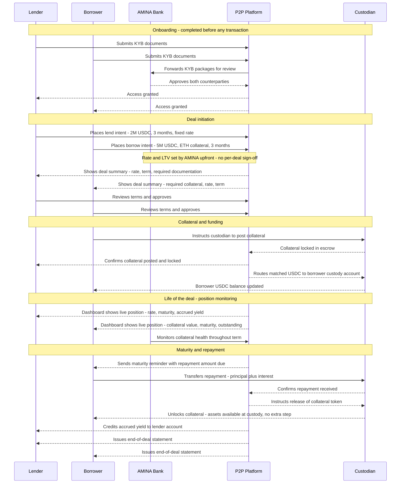
```mermaid
sequenceDiagram
    participant L as Lender
    participant B as Borrower
    participant A as AMINA Bank
    participant P as P2P Platform
    participant C as Custodian

    note over L,C: Onboarding - completed before any transaction

    L->>P: Submits KYB documents
    B->>P: Submits KYB documents
    P->>A: Forwards KYB packages for review
    A-->>P: Approves both counterparties
    P-->>L: Access granted
    P-->>B: Access granted

    note over L,C: Deal initiation

    L->>P: Places lend intent - 2M USDC, 3 months, fixed rate
    B->>P: Places borrow intent - 5M USDC, ETH collateral, 3 months
    note over A,P: Rate and LTV set by AMINA upfront - no per-deal sign-off
    P-->>L: Shows deal summary - rate, term, required documentation
    P-->>B: Shows deal summary - required collateral, rate, term
    L->>P: Reviews terms and approves
    B->>P: Reviews terms and approves

    note over L,C: Collateral and funding

    B->>C: Instructs custodian to post collateral
    C-->>P: Collateral locked in escrow
    P-->>L: Confirms collateral posted and locked
    P-->>C: Routes matched USDC to borrower custody account
    C-->>B: Borrower USDC balance updated

    note over L,C: Life of the deal - position monitoring

    P-->>L: Dashboard shows live position - rate, maturity, accrued yield
    P-->>B: Dashboard shows live position - collateral value, maturity, outstanding
    A->>P: Monitors collateral health throughout term

    note over L,C: Maturity and repayment

    P-->>B: Sends maturity reminder with repayment amount due
    B->>C: Transfers repayment - principal plus interest
    C-->>P: Confirms repayment received
    P-->>C: Instructs release of collateral token
    C-->>B: Unlocks collateral - assets available at custody, no extra step
    P-->>L: Credits accrued yield to lender account
    P-->>L: Issues end-of-deal statement
    P-->>B: Issues end-of-deal statement
```

### 8.2 EE-2: Matching and partial fill

When a lender places a single order, the matching engine splits it into individual bilateral deals behind the scenes. The lender sees one aggregated position; partial fills appear as a progress indicator until fully matched.

*One order split into multiple bilateral deals, aggregated into a single lender position.*

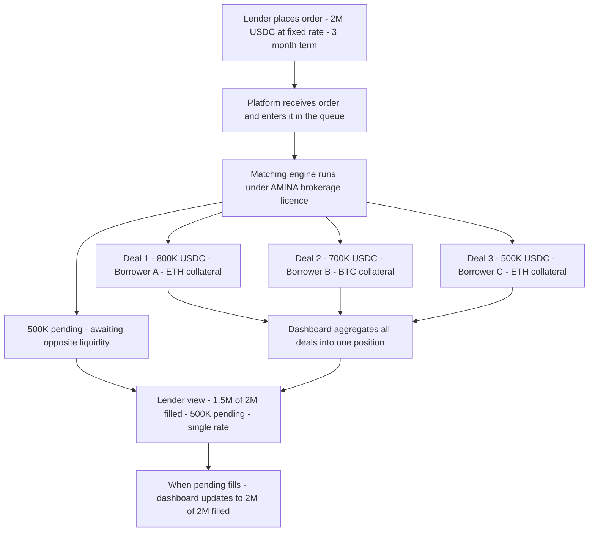
```mermaid
flowchart TD
    LO[Lender places order - 2M USDC at fixed rate - 3 month term]
    PF[Platform receives order and enters it in the queue]
    ME[Matching engine runs under AMINA brokerage licence]

    LO --> PF --> ME
    ME --> D1[Deal 1 - 800K USDC - Borrower A - ETH collateral]
    ME --> D2[Deal 2 - 700K USDC - Borrower B - BTC collateral]
    ME --> D3[Deal 3 - 500K USDC - Borrower C - ETH collateral]
    ME --> PE[500K pending - awaiting opposite liquidity]

    D1 --> AG[Dashboard aggregates all deals into one position]
    D2 --> AG
    D3 --> AG
    PE --> LV[Lender view - 1.5M of 2M filled - 500K pending - single rate]
    AG --> LV
    LV --> FM[When pending fills - dashboard updates to 2M of 2M filled]
```

Each borrower's collateral is locked in a separate escrow when their deal activates. The lender sees none of this structure — only the aggregated amount, the single blended rate, and the maturity date.

### 8.3 EE-3: Onboarding — KYB flow

Onboarding is a one-time process. P2P runs the data-collection interface; AMINA makes the regulatory decision, drawing on the custodian's identity attestation. Once approved, the counterparty links their custody account and is ready to transact.

*One-time onboarding — P2P collects, the custodian attests identity, AMINA approves.*

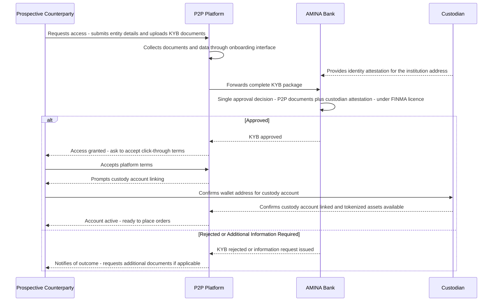
```mermaid
sequenceDiagram
    participant U as Prospective Counterparty
    participant P as P2P Platform
    participant A as AMINA Bank
    participant C as Custodian

    U->>P: Requests access - submits entity details and uploads KYB documents
    P->>P: Collects documents and data through onboarding interface
    C-->>A: Provides identity attestation for the institution address
    P->>A: Forwards complete KYB package
    A->>A: Single approval decision - P2P documents plus custodian attestation - under FINMA licence

    alt Approved
        A-->>P: KYB approved
        P-->>U: Access granted - ask to accept click-through terms
        U->>P: Accepts platform terms
        P-->>U: Prompts custody account linking
        U->>C: Confirms wallet address for custody account
        C-->>P: Confirms custody account linked and tokenized assets available
        P-->>U: Account active - ready to place orders
    else Rejected or Additional Information Required
        A-->>P: KYB rejected or information request issued
        P-->>U: Notifies of outcome - requests additional documents if applicable
    end
```

Onboarding completes in days. The click-through terms at the point of approval cover the core operational rules — auto-liquidation behaviour, electronic-record consent, and platform scope — without requiring per-deal documentation.

### 8.4 EE-4: Default and liquidation

The borrower's experience of a deteriorating position moves through three stages. At each stage the borrower has a clear action available; if no action is taken, the platform advances automatically. The state diagram shows the position's progression; the sequence diagram shows how the parties interact during settlement.

*Position progression through the three-stage margin sequence (state view).*

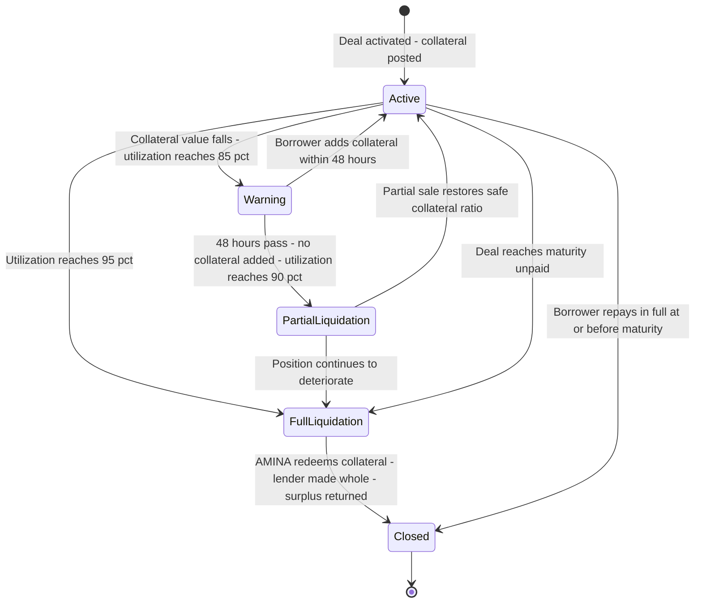
```mermaid
stateDiagram-v2
    [*] --> Active : Deal activated - collateral posted
    Active --> Warning : Collateral value falls - utilization reaches 85 pct
    Warning --> Active : Borrower adds collateral within 48 hours
    Warning --> PartialLiquidation : 48 hours pass - no collateral added - utilization reaches 90 pct
    PartialLiquidation --> Active : Partial sale restores safe collateral ratio
    Active --> FullLiquidation : Utilization reaches 95 pct
    PartialLiquidation --> FullLiquidation : Position continues to deteriorate
    Active --> FullLiquidation : Deal reaches maturity unpaid
    FullLiquidation --> Closed : AMINA redeems collateral - lender made whole - surplus returned
    Active --> Closed : Borrower repays in full at or before maturity
    Closed --> [*]
```

*Cross-actor interaction during the warning, partial-liquidation, and full-liquidation stages (sequence view).*

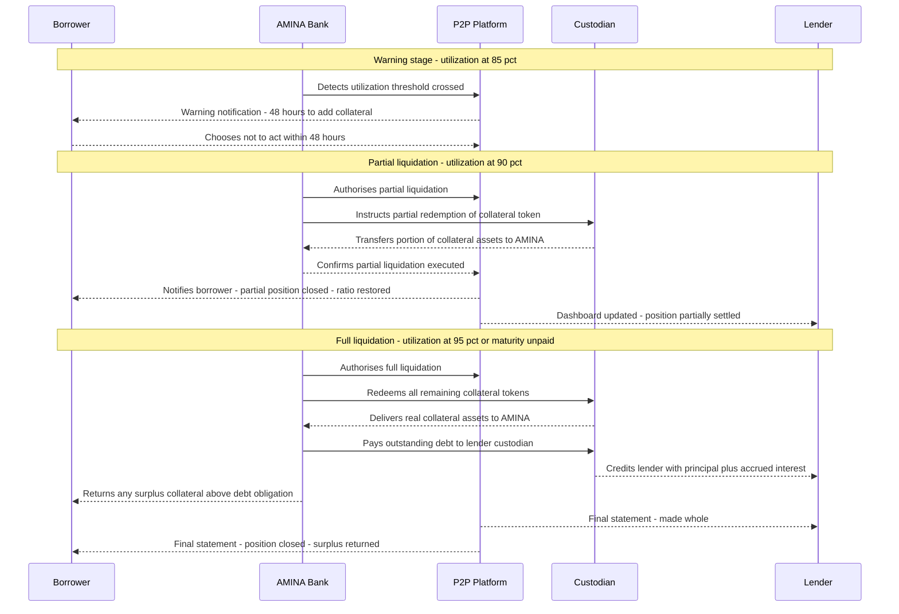
```mermaid
sequenceDiagram
    participant B as Borrower
    participant A as AMINA Bank
    participant P as P2P Platform
    participant C as Custodian
    participant L as Lender

    note over B,L: Warning stage - utilization at 85 pct

    A->>P: Detects utilization threshold crossed
    P-->>B: Warning notification - 48 hours to add collateral
    B-->>P: Chooses not to act within 48 hours

    note over B,L: Partial liquidation - utilization at 90 pct

    A->>P: Authorises partial liquidation
    A->>C: Instructs partial redemption of collateral token
    C-->>A: Transfers portion of collateral assets to AMINA
    A-->>P: Confirms partial liquidation executed
    P-->>B: Notifies borrower - partial position closed - ratio restored
    P-->>L: Dashboard updated - position partially settled

    note over B,L: Full liquidation - utilization at 95 pct or maturity unpaid

    A->>P: Authorises full liquidation
    A->>C: Redeems all remaining collateral tokens
    C-->>A: Delivers real collateral assets to AMINA
    A->>C: Pays outstanding debt to lender custodian
    C-->>L: Credits lender with principal plus accrued interest
    A-->>B: Returns any surplus collateral above debt obligation
    P-->>L: Final statement - made whole
    P-->>B: Final statement - position closed - surplus returned
```

The lender is made whole without court action. The supply token held as collateral is a direct custody claim, so AMINA can redeem assets at the Custodian immediately on liquidation instruction.

### 8.5 EE-5: Fee flow — how the 40 bps spread is earned and distributed

The spread sits between the rate the borrower pays and the rate the lender earns. AMINA sets both levels as part of its fixed base-rate determination. P2P and AMINA each take 20 bps from that margin; the Custodian earns its existing custody fee separately, outside the spread.

*How the 40 bps spread between borrow and lend rates is split between P2P and AMINA.*

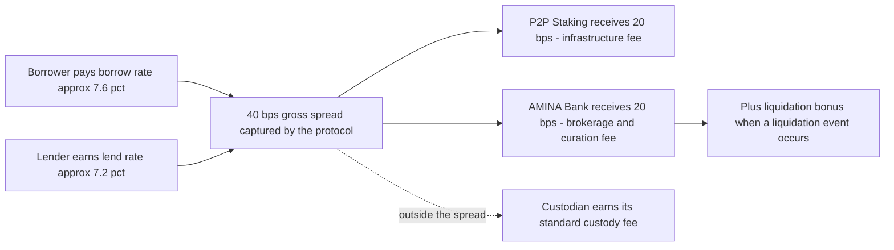
```mermaid
flowchart LR
    BR[Borrower pays borrow rate approx 7.6 pct]
    LEND[Lender earns lend rate approx 7.2 pct]

    BR --> SP[40 bps gross spread captured by the protocol]
    LEND --> SP
    SP --> P2P[P2P Staking receives 20 bps - infrastructure fee]
    SP --> AM[AMINA Bank receives 20 bps - brokerage and curation fee]
    AM --> LB[Plus liquidation bonus when a liquidation event occurs]
    SP -.->|outside the spread| CF[Custodian earns its standard custody fee]
```

P2P Staking and AMINA each receive their 20 bps share from the spread; AMINA additionally earns a liquidation bonus on recovered positions. Neither party touches the underlying assets to collect these fees — the spread is settled through the rate differential embedded at deal creation.

---

## 9. Traceability matrix

Every user story and use case from Sections 3-8 appears here, mapped to the source section(s) in the original product brief and flagged as in-scope for v1 or future. All listed items are in scope for v1; deferred capabilities are listed separately in Section 10.

| ID | Title | Actor | Source section in brief | Status |
|----|-------|-------|------------------------|--------|
| LEN-1 | Complete KYB once, approved under AMINA's licence | Lender | §3, §7, §11 | v1 |
| LEN-2 | See current market rate before committing | Lender | §3, §4 | v1 |
| LEN-3 | Place a lend order with one intent | Lender | §3, §4 | v1 |
| LEN-4 | Review and approve deal terms in one batch step | Lender | §3, §11 | v1 |
| LEN-5 | Track active position as one consolidated view | Lender | §3, §4 | v1 |
| LEN-6 | See yield accruing in real time | Lender | §3, §8 | v1 |
| LEN-7 | See partial-fill status | Lender | §4 | v1 |
| LEN-8 | Keep counterparty identities private | Lender | §5 | v1 |
| LEN-9 | Receive principal plus interest at maturity automatically | Lender | §3, §6 | v1 |
| LEN-10 | Download statement / on-chain record per deal | Lender | §8, §11 | v1 |
| UC-LEN-01 | Onboard and obtain approval | Lender | §3, §7, §11 | v1 |
| UC-LEN-02 | Browse the market and place a lend order | Lender | §3, §4 | v1 |
| UC-LEN-03 | Monitor an active lending position | Lender | §3, §4, §5, §9 | v1 |
| UC-LEN-04 | Receive repayment at maturity | Lender | §3, §6, §8, §11 | v1 |
| UC-LEN-05 | Experience a collateral event (AMINA-managed liquidation) | Lender | §9 | v1 |
| BOR-1 | Complete KYB onboarding once | Borrower | §3, §7, §11 | v1 |
| BOR-2 | Link custody account so collateral is recognised | Borrower | §3, §6, §8 | v1 |
| BOR-3 | Browse fixed borrow rate and required collateral | Borrower | §3, §4 | v1 |
| BOR-4 | Place a borrow order and see exact collateral at chosen LTV | Borrower | §3 | v1 |
| BOR-5 | Review full deal summary and approve in one action | Borrower | §3, §11 | v1 |
| BOR-6 | Monitor active loan from a single dashboard | Borrower | §3, §8 | v1 |
| BOR-7 | Top up collateral at any time | Borrower | §9, §3 | v1 |
| BOR-8 | Make full or partial early repayment | Borrower | Extrapolated (not in brief) | Extrapolated |
| BOR-9 | Receive clear warning with 48-hour deadline | Borrower | §9 | v1 |
| BOR-10 | Have surplus collateral returned automatically after liquidation | Borrower | §9 | v1 |
| UC-BOR-01 | Complete KYB onboarding and link custody account | Borrower | §3, §7, §11 | v1 |
| UC-BOR-02 | Place a borrow order and receive USDC | Borrower | §2, §3, §4 | v1 |
| UC-BOR-03 | Monitor active loan and manage collateral | Borrower | §3, §8, §9 | v1 |
| UC-BOR-04 | Respond to a margin warning and experience the default sequence | Borrower | §9 | v1 |
| UC-BOR-05 | Understand counterparty privacy | Borrower | §5, §3 | v1 |
| AMINA-1 | Review and approve/reject KYB submissions | AMINA | §7, §11 | v1 |
| AMINA-2 | Set and update the base lending rate | AMINA | §4 | v1 |
| AMINA-3 | Configure LTV per issuer and collateral type | AMINA | §6, §9 | v1 |
| AMINA-4 | Real-time portfolio risk dashboard | AMINA | §7, §8, §9 | v1 |
| AMINA-5 | Surface 85% positions and issue 48-hour warning | AMINA | §9 | v1 |
| AMINA-6 | Initiate partial liquidation above 90% | AMINA | §9 | v1 |
| AMINA-7 | Execute full liquidation at 95% or maturity unpaid | AMINA | §9 | v1 |
| AMINA-8 | Aggregate fee income in a revenue statement | AMINA | §6, §12 | v1 |
| AMINA-9 | Suspend counterparty access on KYB status change | AMINA | §7, §11 | v1 |
| AMINA-10 | On-chain audit trail of changes and decisions | AMINA | §4, §11 | v1 |
| UC-AMINA-01 | Approve a new counterparty (KYB) | AMINA | §3, §7, §11 | v1 |
| UC-AMINA-02 | Set and publish the base lending rate | AMINA | §4, §8 | v1 |
| UC-AMINA-03 | Monitor active portfolio and identify at-risk positions | AMINA | §7, §9 | v1 |
| UC-AMINA-04 | Issue a margin warning and manage three-stage liquidation | AMINA | §9, §2 | v1 |
| UC-AMINA-05 | Configure LTV and risk parameters for a custody issuer | AMINA | §6, §7, §9 | v1 |
| P2P-1 | Guided onboarding flow that collects KYB documentation | P2P Staking | §3, §7, §11 | v1 |
| P2P-2 | Display AMINA-set base rate and available liquidity | P2P Staking | §3, §4 | v1 |
| P2P-3 | Run the matching engine under AMINA's licence | P2P Staking | §4, §8 | v1 |
| P2P-4 | Present consolidated position view aggregating bilateral deals | P2P Staking | §3, §4 | v1 |
| P2P-5 | Route signed deal terms to on-chain escrow and settlement | P2P Staking | §2, §8 | v1 |
| P2P-6 | Surface real-time settlement and position status | P2P Staking | §3, §8 | v1 |
| P2P-7 | Deliver configurable notifications | P2P Staking | §8, §9 | v1 |
| P2P-8 | Provide AMINA operator panel for risk parameters | P2P Staking | §4, §6 | v1 |
| P2P-9 | Track infrastructure fee accrual and report matched volume | P2P Staking | §6, §12 | v1 |
| P2P-10 | Maintain audit trail and exportable records | P2P Staking | §7, §11 | v1 |
| UC-P2P-01 | Onboard a new participant | P2P Staking | §3, §7, §11 | v1 |
| UC-P2P-02 | Run the matching engine and present deal terms | P2P Staking | §3, §4 | v1 |
| UC-P2P-03 | Surface settlement and position status | P2P Staking | §3, §8, §9 | v1 |
| UC-P2P-04 | Provide the AMINA operator panel | P2P Staking | §4, §6, §8 | v1 |
| UC-P2P-05 | Monitor infrastructure revenue and platform health | P2P Staking | §6, §8, §12 | v1 |
| CUST-1 | Mint supply token 1:1 against lender USDC | Custodian | §2, §6 | v1 |
| CUST-2 | Mint collateral token 1:1 against borrower assets | Custodian | §2, §6 | v1 |
| CUST-3 | Attest tokens are fully backed | Custodian | §6, §8 | v1 |
| CUST-4 | Process redemption — supply token to real USDC | Custodian | §2, §9 | v1 |
| CUST-5 | Execute settlement transfer at maturity | Custodian | §2, §9 | v1 |
| CUST-6 | Process liquidation redemption on AMINA instruction | Custodian | §2, §9 | v1 |
| CUST-7 | Maintain address-to-identity mapping (identity anchor) | Custodian | §2, §5, §6 | v1 |
| CUST-8 | Retire tokens to keep backing ratio at 1:1 | Custodian | §6, §8 | v1 |
| CUST-9 | Notify protocol of custody account status changes | Custodian | §7, §11 | v1 |
| UC-CUST-01 | Mint supply token for incoming lender USDC | Custodian | §2, §3, §6 | v1 |
| UC-CUST-02 | Mint collateral token for borrower assets | Custodian | §2, §3, §6 | v1 |
| UC-CUST-03 | Process redemption — supply token to real USDC | Custodian | §2, §9 | v1 |
| UC-CUST-04 | Execute settlement at deal maturity | Custodian | §2, §8, §9 | v1 |
| UC-CUST-05 | Execute liquidation redemption on AMINA instruction | Custodian | §2, §9 | v1 |
| UC-CUST-06 | Serve as identity anchor — KYC and KYB record | Custodian | §2, §5, §6, §7 | v1 |
| EE-1 | Happy path — full deal lifecycle | All actors | §2, §3, §4, §6 | v1 |
| EE-2 | Matching and partial fill | Lender, P2P, AMINA, Borrower | §4 | v1 |
| EE-3 | Onboarding — KYB flow | Counterparty, P2P, AMINA, Custodian | §3, §7, §11 | v1 |
| EE-4 | Default and liquidation | Borrower, AMINA, P2P, Custodian, Lender | §9, §2 | v1 |
| EE-5 | Fee flow — 40 bps spread earned and distributed | P2P, AMINA, Custodian | §6, §12 | v1 |

---

## 10. Out of scope for v1

The following capabilities appear in the original product brief as future considerations (§14) or as on-request future enhancements (§5). They are explicitly NOT part of the v1 stories and use cases above. Any requirement touching these areas must be tagged as future, not written as a v1 user story.

| Capability | Source | Why deferred | v1 position |
|------------|--------|--------------|-------------|
| Debt-obligation tokens and undercollateralized lending | §14 | Separate future phase using debt-obligation NFTs, with LCIA arbitration in the default path and additional legal work required | v1 is over-collateralized only |
| DeFi liquidity channel | §14 | Future tokenized access to institutional rates via a DeFi partner, with P2PxAmina as the underlying infrastructure | DeFi-user looping access is not v1 |
| RWA and tokenized-treasury collateral | §14 | Accepting tokenized treasuries such as BUIDL, BENJI, or USDY as collateral is a future phase | v1 collateral is BTC, ETH, USDC, and stablecoins only |
| Enhanced privacy features | §5 | Fresh-address rotation and off-chain parameter handling, to be added on client request | v1 relies on the custodian holding the address-to-institution mapping, so wallet addresses do not reveal institution names |
| Permissionless or auction-based rate discovery | §4 | Negotiated, auction-based, or market-driven rate discovery is a future extension path | v1 rates are set by AMINA and revised approximately quarterly |
| Cross-chain settlement | §14 | Future extension path | v1 operates on a single chain (v1 already supports multiple collateral asset types — BTC, ETH, USDC, and stablecoins — per the brief; only cross-chain settlement is deferred) |
