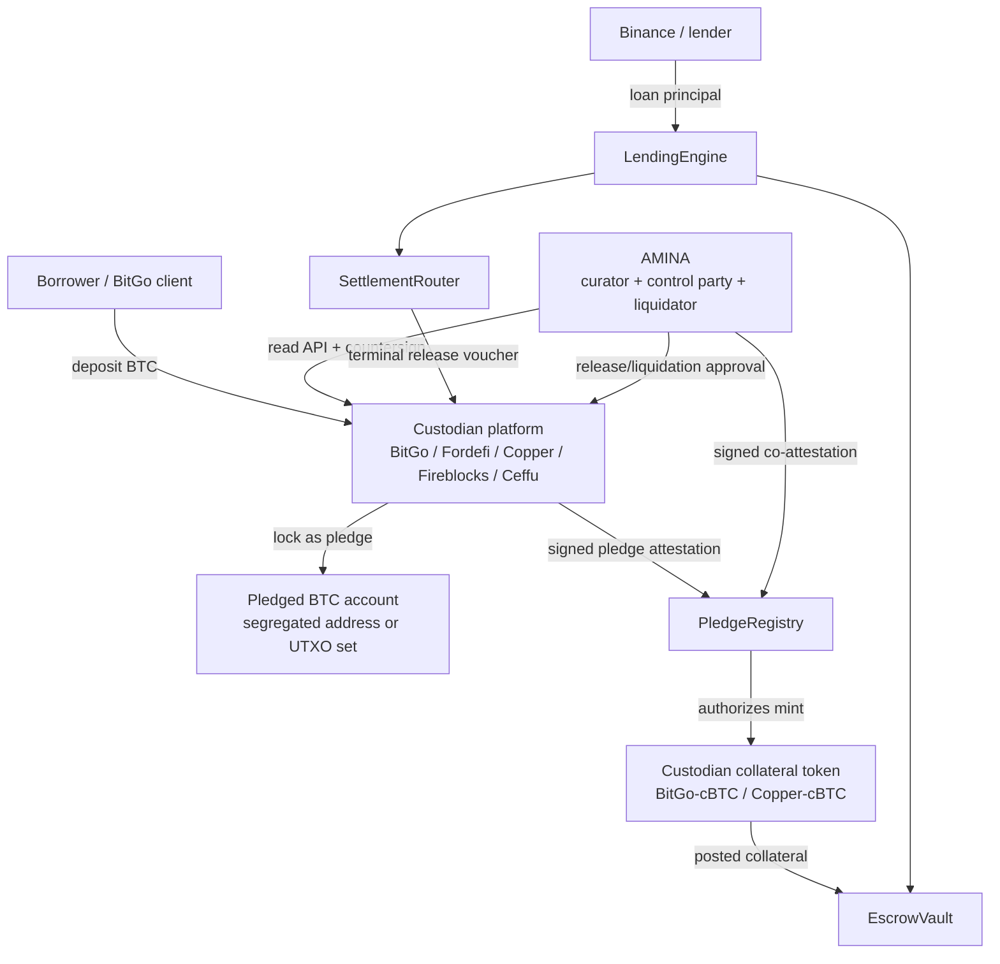

# Tokenization of Collateral from Custody Wallets

**Date:** 2026-06-09  
**Scope:** BTC first, then ETH, tokenized treasuries, funds, commodities, and other non-native-to-EVM collateral  
**Audience:** P2PxAmina engineering, AMINA risk/custody operations, Binance/lender integration, custodian integration teams  
**Short version:** Treat the token as a pledge receipt, not as open wrapped BTC.

## Executive Summary

If BitGo, Fordefi, Copper, Fireblocks, Ceffu, or another custody platform tokenizes BTC for use as collateral, AMINA should not verify only that "a token exists." AMINA must verify four separate facts:

1. The native BTC exists in a specific custody account or UTXO set.
2. The BTC is locked under a policy that prevents withdrawal while a P2PxAmina deal is live.
3. The EVM collateral token was minted only against that locked BTC and cannot move outside the lending protocol.
4. BTC release is possible only through a terminal protocol state: repayment release to the borrower, or default/liquidation release to AMINA.

The recommended design is:

- **Custody-side pledge account:** segregated BTC balance, ideally a dedicated on-chain Bitcoin address or UTXO set per deal or borrower-deal.
- **AMINA as mandatory control party:** withdrawals from pledged BTC require AMINA approval or AMINA key participation. A dashboard flag alone is not enough.
- **Permissioned collateral token:** one token per `(custodian, asset)`, for example `BitGo-cBTC`, but transfer-restricted so it can only be minted, posted to `EscrowVault`, released by the protocol, or seized by the liquidation path.
- **Pledge-bound mint:** minting references a `pledgeId`, BTC address/UTXO evidence, custodian attestation, and AMINA countersignature.
- **Voucher-gated release:** custody releases BTC only after `SettlementRouter` emits or signs a `ReleaseVoucher` whose destination is derived from on-chain state.
- **Continuous verification:** AMINA uses custody API access, public-chain monitoring, token supply checks, and optional proof-of-reserve feeds as circuit breakers.

This pattern borrows from existing institutional infrastructure:

- WBTC and cbBTC show how custody-backed wrapped BTC is minted and redeemed.
- Ceffu Mirror, Copper ClearLoop, and Fireblocks Off Exchange show how institutions lock assets in custody while mirroring collateral value into a trading venue.
- BUIDL, BENJI, PAXG, Ondo, and BitGo RWA show how tokenized real-world assets combine a regulated off-chain record with an on-chain token.
- tBTC and Lombard show stronger cryptographic/consortium alternatives, but their open DeFi design is usually not precise enough for a closed bilateral lending lien.

For P2PxAmina, the best approach is **not** a generic tradable wrapper. It is a **closed-loop, custodian-specific, lien-aware collateral receipt**.

## 1. Problem Restatement

Example scenario:

- Borrower: BitGo client or BitGo-connected borrower holding BTC in custody.
- Lender: Binance or another institutional lender.
- Curator/lien holder/liquidator: AMINA.
- Lending rail: P2PxAmina on an EVM chain.
- Collateral: native BTC held at a custodian, represented by a token accepted by P2PxAmina.

The risk is not that ERC-20 accounting is difficult. The difficult part is the off-chain/native-chain link. If the borrower can remove BTC from the custody account after receiving a collateral token, the token becomes an unbacked receipt. If an attacker compromises the EVM token, the attacker should still not be able to extract BTC. If an attacker compromises the borrower account at the custodian, the attacker should still not be able to withdraw BTC while the loan is active.

The core requirement is:

> During a live loan, there must be no path to move the underlying BTC out of the pledged custody arrangement. Only terminal protocol states can release it, and liquidation release must go to AMINA.

Repayment creates a legitimate release path back to the borrower. Liquidation creates a legitimate release path to AMINA. There should be no third path.

## 2. Similar Solutions in the Market

### 2.1 Custody-backed wrapped BTC

**WBTC**

WBTC is the classic custodial wrapped BTC model. The original WBTC whitepaper describes a merchant/custodian flow: a merchant initiates minting, sends BTC to the custodian, the custodian waits for Bitcoin confirmations, and then mints WBTC on Ethereum. Redemption reverses the flow: the merchant burns WBTC, and the custodian releases BTC after Ethereum confirmations. WBTC explicitly has no general transfer restriction, which makes it highly liquid but unsuitable as a closed lien receipt by itself. Source: [WBTC wrapped tokens whitepaper](https://wbtc.network/assets/wrapped-tokens-whitepaper.pdf).

BitGo later announced a move of WBTC custody operations to a multi-jurisdictional, multi-institutional custody structure with BiT Global. That change is important because it shows a general lesson: with custody-backed wrappers, the token holder depends on the custody governance structure, not only on the ERC-20 contract. Source: [BitGo WBTC custody announcement](https://www.bitgo.com/resources/blog/announcements/bitgo-to-move-wbtc-to-multi-jurisdictional-custody-to-accelerate-global/). WBTC's current site describes 1:1 backing, proof of reserves, and multisig distributed custody. Source: [WBTC website](https://www.wbtc.network/).

**cbBTC**

Coinbase cbBTC is a simpler single-platform wrapped asset model. Coinbase says wrapped assets are backed 1:1 by underlying assets held in Coinbase custody; when eligible Coinbase users send BTC to Base or Ethereum, it is converted 1:1 into cbBTC, and when cbBTC is received into Coinbase it converts back to BTC. Coinbase also publishes reserve data for wrapped/stable assets, with Coinbase documentation pointing to nearly minute-level reserve refreshes for its custom stablecoin product and a live cbBTC reserve example. Sources: [Coinbase cbBTC](https://www.coinbase.com/cbbtc), [Coinbase proof of reserves documentation](https://docs.cdp.coinbase.com/custom-stablecoins/core-concepts/proof-of-reserves).

**Lesson for P2PxAmina**

WBTC/cbBTC are useful precedents for custody-backed mint/redeem, but they are not ideal P2PxAmina collateral receipts:

- They are pooled, not deal-specific.
- They are generally transferable bearer assets.
- Their redemption route is controlled by wrapper issuer processes, not P2PxAmina's loan state.
- They do not guarantee AMINA is the only liquidation actor.

P2PxAmina should borrow the custody-backed mint/redeem mechanics, but make the token non-public, pledge-bound, and release-voucher-gated.

### 2.2 Off-exchange custody and collateral mirror systems

These are closer to the desired pattern than generic wrapped BTC.

**Ceffu Mirror / Binance**

Ceffu describes Mirror as a tri-party relationship among the client, Ceffu, and Binance Exchange. The client locks assets in a Ceffu Qualified Wallet. The locked assets cannot be withdrawn while the Mirror position remains open. Binance credits an equivalent balance in the Binance environment, allowing the client to use trading and lending products while the owned assets remain in custody. Ceffu says each client has a dedicated on-chain wallet address visible to the client. Source: [Ceffu Mirror explanation](https://www.ceffu.com/en-AE/support/announcements/article/how-institutions-use-binance-mirror-for-deep-liquidity-through-custody).

This is highly relevant to "BitGo wants to borrow from Binance." Binance already accepts the idea that off-exchange custody collateral can be mirrored into Binance systems if the custody lock and settlement path are credible.

**Copper ClearLoop**

Copper ClearLoop lets institutions trade on centralized exchanges without moving assets out of Copper MPC custody. Copper describes instant asset delegation, API connectivity, collateral monitoring, and a trust/collateral agreement structure over client-delegated assets and exchange margins. Source: [Copper ClearLoop](https://copper.co/products/clearloop).

**Fireblocks Off Exchange**

Fireblocks Off Exchange uses Collateral Vault Accounts, on-chain MPC wallets that programmatically lock and mirror assets to a connected exchange account. Fireblocks emphasizes that exchanges can verify on-chain that client accounts are fully collateralized and that the principal stays protected from exchange failure, hacks, and fraud. Source: [Fireblocks Off Exchange](https://www.fireblocks.com/platforms/off-exchange/).

**Lesson for P2PxAmina**

The best institutional pattern is not "send collateral to Binance." It is:

1. Collateral remains in custody.
2. Collateral is locked.
3. The venue or lender receives a mirror/credit/receipt.
4. The release and settlement path is governed by a tri-party control agreement.

P2PxAmina should implement the on-chain version of this pattern: a custodian-side lock plus an on-chain collateral receipt.

### 2.3 Custody tokenization engines and wallet platforms

**Fireblocks Tokenization**

Fireblocks offers tokenization APIs for deploying, managing, minting, burning, custodying, and distributing tokenized assets. Its product page highlights pre-built smart contracts, token operations management, audit-ready reporting, and policy-engine governance for minting, transfers, and burns. Sources: [Fireblocks tokenization developer docs](https://developers.fireblocks.com/docs/tokenization), [Fireblocks tokenization product page](https://www.fireblocks.com/products/tokenization).

**BitGo RWA / Transfer Agent**

BitGo's developer documentation for Real World Assets lists transfer agent services, custody services, and capital formation services. BitGo's transfer-agent product page describes API-forward ownership records, real-time visibility, webhooks, and programmatic transfers. It also states that transfer agent and paying agent services are provided by a BitGo subsidiary registered as an SEC transfer agent. Sources: [BitGo RWA developer docs](https://developers.bitgo.com/docs/real-world-assets-overview), [BitGo transfer agent product](https://www.bitgo.com/products/transfer-agent/).

BitGo's minting and redemption terms also distinguish "asset referenced coins" and "reference assets," showing the legal framing commonly used in custody tokenization: reserves support minting and redemption, but rights depend on the relevant terms and issuer structure. Source: [BitGo Coin Minting and Redemption Services Terms](https://www.bitgo.com/legal/bitgo-coin-minting-services-terms/).

**Fordefi**

Fordefi is primarily an institutional MPC wallet and wallet API platform rather than a public wrapped-token issuer. Its platform supports vaults, policies, approvers, transaction generation/approval/signing, transaction simulation, APIs, and token/NFT mint/custody/transfer operations. Source: [Fordefi](https://fordefi.com/).

**Lesson for P2PxAmina**

Different custodians will expose different primitives:

- Some can mint/burn custom tokens through a tokenization engine.
- Some can only sign EVM transactions and enforce MPC policy.
- Some can provide real-time custody records and webhooks but not a native tokenization product.
- Some can provide transfer-agent/legal ownership infrastructure for RWAs.

P2PxAmina should define a custodian-neutral integration contract: the custodian must produce a signed pledge proof, enforce a release policy, and either mint a compatible collateral token or authorize P2PxAmina to mint one.

### 2.4 Tokenized RWAs used as collateral

**BlackRock BUIDL / Securitize / Binance**

BlackRock launched BUIDL as a tokenized fund on Ethereum. The fund seeks a stable $1 token value, pays accrued dividends in tokens, holds cash, U.S. Treasury bills, and repurchase agreements, and allows transfer only to pre-approved investors. Source: [BlackRock BUIDL launch](https://www.businesswire.com/news/home/20240320771318/en/BlackRock-Launches-Its-First-Tokenized-Fund-BUIDL-on-the-Ethereum-Network).

In late 2025, Securitize and Binance announced BUIDL as accepted off-exchange collateral for trading on Binance, with Ceffu as one of the custody partners. Source: [BUIDL accepted as Binance off-exchange collateral](https://www.prnewswire.com/news-releases/blackrocks-buidl-tokenized-by-securitize-now-accepted-as-collateral-for-trading-on-binance-and-launches-on-bnb-chain-302613374.html).

**Franklin Templeton BENJI / Binance**

Franklin Templeton and Binance announced that eligible clients can use Benji-issued tokenized money market fund shares as off-exchange collateral for trading on Binance using Ceffu's custody layer. The value is mirrored in Binance while tokenized assets remain off-exchange in regulated custody. Source: [Franklin Templeton and Binance collateral program](https://www.franklintempleton.com/press-releases/news-room/2026/franklin-templeton-and-binance-advance-strategic-collaboration-with-institutional-off-exchange-collateral-program).

Franklin Templeton also describes BENJI as one share represented by one token, with the transfer agent maintaining official ownership records through a blockchain-integrated system. Source: [Franklin Templeton BENJI peer-to-peer transfers](https://www.franklintempleton.com/press-releases/news-room/2024/franklin-templeton-announces-availability-of-peer-to-peer-transfers-for-franklin-onchain-u-s-government-money-fund).

**PAXG**

Paxos Gold is a tokenized gold precedent. Paxos says each PAXG token is backed by one fine troy ounce of London Good Delivery gold held in LBMA vaults, with allocation lookup and monthly attestations. Source: [Paxos PAXG](https://www.paxos.com/pax-gold).

**Ondo USDY**

Ondo's documentation describes USDY as a tokenized note secured, depending on issuance date, by short-term U.S. Treasuries, shares of short Treasury ETFs, or bank deposits. Source: [Ondo USDY basics](https://docs.ondo.finance/general-access-products/usdy/basics).

**Lesson for P2PxAmina**

For RWAs, the on-chain token is often not the legal source of truth by itself. The decisive record may be a transfer agent ledger, fund register, trust record, warehouse receipt, or custodian statement. P2PxAmina must integrate the legal record and the on-chain token state.

### 2.5 Trust-minimized BTC alternatives

**tBTC**

tBTC is a decentralized Bitcoin bridge using threshold cryptography and randomly selected signer operators instead of a single custodian. Threshold describes it as a decentralized bridge between Bitcoin and DeFi, with operator groups securing deposited Bitcoin and requiring threshold agreement. Source: [Threshold tBTC docs](https://docs.threshold.network/tbtc-v2).

**Lombard LBTC / BTC.b**

Lombard uses a Security Consortium, hardware-backed signing, Bascule Drawbridge verification, proof-of-reserve oracles, and public documentation around LBTC/BTC.b backing. Lombard documentation describes Chainlink or other PoR feeds, on-chain records, mint/burn records, and independent verification layers. Sources: [Lombard transparency](https://docs.lombard.finance/learn/transparency), [Lombard Bascule Drawbridge](https://docs.lombard.finance/technical-documentation/protocol-architecture/bascule-drawbridge), [Lombard oracles](https://docs.lombard.finance/technical-documentation/oracles).

**Lesson for P2PxAmina**

Trust-minimized bridges can be useful if P2PxAmina wants public DeFi liquidity. They are less ideal for a private, regulated, custodian-anchored lending lien because they do not naturally encode:

- AMINA as the designated liquidator.
- Per-deal lien identity.
- A specific borrower/custodian/control agreement.
- A custody release destination fixed by P2PxAmina loan state.

They are good references for cryptographic verification and independent attestations, not a complete substitute for a custody pledge.

## 3. How Custody Wallets Mint Tokens

A custody-backed tokenization flow normally has seven steps.

### 3.1 Deposit

The borrower moves the native asset into a custody-controlled location:

- BTC: dedicated Bitcoin address or segregated UTXO set.
- ETH: custody vault/wallet, or direct on-chain escrow if the protocol can hold ETH/WETH natively.
- RWA: transfer-agent account, fund subscription record, warehouse receipt, SPV share register, or custodian bank record.

For BTC, the strongest evidence is public-chain evidence: address, txid, vouts, confirmations, amount in satoshis, and proof that the custodian controls or enforces policy over the address.

### 3.2 Lock / pledge

The custodian changes the asset state from "free balance" to "pledged collateral." A strong lock has:

- A unique `pledgeId`.
- A segregated custody account or address.
- A lock amount in native units.
- A policy that rejects withdrawals while the lock is active.
- A policy hash or policy version.
- A control agreement naming AMINA as control party or required approver.
- Webhook/API visibility for AMINA.

The lock must not be a private note in a spreadsheet. It must be enforceable by the custody transaction system.

### 3.3 Attest

The custodian signs a statement:

```text
custodianId
asset = BTC
pledgeId
borrowerId
dealId
lockedAmountSats
btcAddress or utxoSetHash
lockPolicyHash
noWithdrawalWithout = AMINA + protocolReleaseVoucher
timestamp
expiry
nonce
```

AMINA independently reads the custody account and countersigns only if it sees the same balance, lock status, and policy.

### 3.4 Mint

The token minter calls the collateral token contract with the pledge proof. The smart contract checks:

- Custodian is registered and active.
- AMINA countersignature is valid.
- `pledgeId` is unused or has remaining mint capacity.
- Minted amount does not exceed the locked native amount.
- Token receiver is a protocol address or an approved borrower staging address.

### 3.5 Use as collateral

The token is posted into `EscrowVault`. The lending engine uses:

- token amount,
- collateral asset registry configuration,
- haircut/LTV,
- oracle price,
- custody and reserve status.

The token should not be usable on a DEX, bridge, or arbitrary lending pool unless the business intentionally wants open wrapped BTC exposure.

### 3.6 Burn / redeem

For generic wrappers, redemption usually means burn token then release native asset. For P2PxAmina, redemption must be tied to loan state:

- Repaid: release to borrower.
- Liquidated/defaulted: release to AMINA.
- Active/warned: no release.

### 3.7 Reconcile

Every minted token must be reconciled against locked collateral:

```text
sum(activeMintedByCustodianAsset) <= sum(activeLockedNativeCollateral)
sum(mintedForPledgeId) <= lockedAmountForPledgeId
sum(releasedForPledgeId) <= lockedAmountForPledgeId
```

Proof-of-reserve feeds can provide an external circuit breaker, but AMINA should still have direct custody read access for deal-level verification.

## 4. Why Custody Tokenization Works

Custody-backed tokenization works because it separates:

- **Asset control:** the custodian controls or enforces policy over the native asset.
- **Digital representation:** the token contract represents a claim, receipt, or entitlement.
- **Reserve verification:** API, public-chain evidence, auditors, or oracles verify collateral backing.
- **Redemption logic:** burn/release maps the on-chain representation back to the native asset.
- **Legal enforceability:** contracts define who owns the asset, who has a lien, who can redeem, and what happens in default or insolvency.

It does **not** work by magic. It is not a trustless bridge unless the underlying protocol is explicitly built that way. A custody-backed token is only as strong as:

- custody segregation,
- signer/key policy,
- minter governance,
- redemption controls,
- legal enforceability,
- reserve transparency,
- and monitoring.

The report's most important conclusion:

> For institutional collateral, proof of reserve alone is insufficient. AMINA needs proof of reserve plus proof of lock plus proof of exclusive release control.

## 5. Recommended P2PxAmina Architecture



### 5.1 Components

**Custodian Connector**

Per-custodian adapter that normalizes:

- balance reads,
- pledge/lock reads,
- policy reads,
- webhook events,
- withdrawal request status,
- signed attestations.

**PledgeRegistry**

On-chain registry of native collateral pledges. Stores:

- `pledgeId`,
- custodian ID,
- asset ID,
- borrower ID hash,
- deal ID,
- native amount,
- token amount minted,
- lock proof hash,
- custody account/address hash,
- AMINA attestation,
- current state.

**Permissioned Collateral Token**

Token contract per custodian and asset:

- `BitGo-cBTC`,
- `Copper-cBTC`,
- `Fireblocks-cBTC`,
- `Ceffu-cBTC`,
- `BitGo-cETH`,
- `BitGo-cPAXG`,
- etc.

The token is not a public wrapped asset. It is a restricted collateral receipt.

**EscrowVault**

Holds collateral tokens. The borrower cannot withdraw while the deal is active. Only protocol state transitions can move collateral.

**SettlementRouter**

Emits or signs release vouchers after terminal states. Custodians use it as the source of truth for custody unlocks.

**AMINA Release Signer**

AMINA-controlled signer or MPC policy participant. Required for custody-side release. This signer must be separate from AMINA's on-chain liquidator signer where possible.

## 6. The Amina Verification Model

AMINA verifies tokenization by checking four layers.

### 6.1 Layer 1: Asset existence

For BTC:

- BTC address or UTXO set exists.
- Deposit txid is confirmed.
- Confirmations meet policy, for example 6 blocks or stronger for high-value deals.
- Balance in satoshis is at least pledged amount plus any buffer.
- Address is not reused for unrelated free collateral unless the custodian provides UTXO-level segregation.

For BitGo-style custody, BitGo's own PoR docs say clients can use REST APIs to retrieve balances and wallet details and can share balances/public addresses for blockchain confirmation. They also note that Go Accounts use an off-chain ledger and cannot be verified through PoR in the same way. Source: [BitGo proof of reserves docs](https://developers.bitgo.com/docs/wallets-proof-of-reserves#/).

Recommendation: if P2PxAmina requires strong BTC backing verification, use custody wallets or address-level custody, not off-chain omnibus ledger accounts, unless the legal/custody arrangement explicitly accepts that weaker model.

### 6.2 Layer 2: Lock existence

AMINA verifies:

- pledge status is active,
- amount is locked,
- withdrawal available balance is zero or excludes pledged amount,
- withdrawal policy requires AMINA or AMINA-controlled approval,
- lock cannot be removed by borrower alone,
- policy cannot be changed by borrower alone,
- custodian emits a signed lock attestation,
- any withdrawal attempt creates a webhook/event AMINA can see.

The important question is not "can AMINA see the BTC?" The question is "can anyone move it without AMINA and without a valid protocol voucher?"

### 6.3 Layer 3: Token mint integrity

AMINA verifies:

- token contract is registered in `CollateralRegistry`,
- custodian minter role is correct,
- AMINA co-attestation is required for minting,
- `pledgeId` appears in the mint event,
- token amount equals native amount after decimals conversion,
- `totalSupply` does not exceed active locked collateral,
- token receiver is the borrower staging wallet or directly `EscrowVault`,
- token is immediately posted to `EscrowVault` before the loan becomes active.

### 6.4 Layer 4: Release exclusivity

AMINA verifies:

- collateral token cannot be transferred to arbitrary wallets,
- token cannot be burned by borrower/custodian alone,
- custody release requires protocol release voucher,
- liquidation voucher destination is AMINA only,
- repayment voucher destination is borrower only after repayment is complete,
- active deals have no release voucher path,
- every voucher has anti-replay fields.

### 6.5 Verification packet

Each deal should store a `CollateralProofPacket` off-chain and hash it on-chain.

```json
{
  "version": "P2PXAMINA_COLLATERAL_PROOF_V1",
  "dealId": "0x...",
  "pledgeId": "bitgo-btc-20260609-000001",
  "custodian": {
    "id": "BITGO",
    "legalEntity": "BitGo Bank & Trust, National Association",
    "apiEnvironment": "production",
    "attestationSigner": "0x..."
  },
  "asset": {
    "nativeAsset": "BTC",
    "nativeUnit": "sats",
    "amount": "100000000",
    "tokenAddress": "0x...",
    "tokenDecimals": 8
  },
  "custodyEvidence": {
    "btcAddress": "bc1q...",
    "utxoSetHash": "0x...",
    "depositTxids": ["..."],
    "minConfirmations": 6,
    "custodyAccountIdHash": "0x...",
    "lockPolicyHash": "0x...",
    "withdrawalPolicy": "NO_WITHDRAWAL_WITHOUT_AMINA_AND_PROTOCOL_VOUCHER"
  },
  "attestations": {
    "custodianEip712Signature": "0x...",
    "aminaEip712Signature": "0x...",
    "timestamp": 1781020800,
    "expiresAt": 1781107200
  },
  "monitoring": {
    "custodyWebhookId": "0x...",
    "bitcoinWatcherJobId": "0x...",
    "reserveFeed": "chainlink-or-custom-por-feed",
    "pollingIntervalSeconds": 60
  }
}
```

## 7. Pledge-Bound Mint Protocol

### 7.1 EIP-712 pledge attestation

Use typed signatures so AMINA, the custodian, and auditors can verify exactly what was approved.

```solidity
struct PledgeAttestation {
    bytes32 pledgeId;
    bytes32 dealId;
    bytes32 borrowerIdHash;
    bytes32 custodianId;
    bytes32 nativeAssetId;       // BTC, ETH, PAXG, BUIDL, etc.
    uint256 nativeAmount;        // sats for BTC, wei for ETH, smallest unit for tokenized RWA
    bytes32 custodyAccountHash;  // avoids exposing account IDs on-chain
    bytes32 nativeEvidenceHash;  // BTC address/UTXO packet, RWA record, etc.
    bytes32 lockPolicyHash;
    address collateralToken;
    uint256 tokenAmount;
    uint256 issuedAt;
    uint256 expiresAt;
    uint256 nonce;
}
```

Required signatures:

- custodian attestation signer,
- AMINA verification signer.

Optional signatures:

- borrower acknowledgement,
- lender acknowledgement,
- independent auditor/oracle attestation.

### 7.2 Mint constraints

The collateral token should enforce:

```text
mintAmount <= pledge.lockedAmount - pledge.mintedAmount
pledge.status == ACTIVE_LOCKED
custodianSignature.valid == true
aminaSignature.valid == true
block.timestamp <= expiresAt
tokenReceiver in allowedReceivers
```

### 7.3 Decimals and BTC units

BTC collateral should use 8 decimals and satoshi units. Do not represent BTC with 18 decimals internally unless every conversion is explicit and tested.

Example:

```text
1 BTC = 100,000,000 sats = 100,000,000 token units for cBTC with 8 decimals
```

### 7.4 Token design choices

**Best for P2PxAmina:** restricted ERC-20 per custodian/asset.

Pros:

- works with current amount-based lending/escrow design,
- simple price/LTV math,
- easier partial liquidation,
- one token registry entry per custodian/asset.

Cons:

- per-deal identity lives in `PledgeRegistry`, not in the token balance itself.

**Alternative:** ERC-721 or ERC-1155 pledge receipt per deal.

Pros:

- each collateral pledge is uniquely identifiable,
- cleaner lien tracking.

Cons:

- harder partial liquidation,
- more changes to amount-based `EscrowVault`,
- weaker compatibility with ERC-20-based lending logic.

Recommended compromise:

- Use restricted ERC-20 for accounting.
- Use `pledgeId` and per-deal `PledgeRegistry` records for identity and legal audit trail.

## 8. Voucher-Gated Release Protocol

### 8.1 Release voucher fields

```solidity
struct ReleaseVoucher {
    bytes32 voucherId;
    bytes32 pledgeId;
    bytes32 dealId;
    bytes32 custodianId;
    bytes32 nativeAssetId;
    uint256 nativeAmount;
    uint8 reason;              // REPAID or LIQUIDATED
    uint8 destinationType;     // BORROWER or AMINA
    bytes32 destinationRefHash;
    uint64 sequence;
    uint256 issuedAt;
    uint256 expiresAt;
}
```

### 8.2 State-derived destination

The destination must be derived by protocol state, never provided freely by the caller.

| Deal state | Release allowed? | Destination | Who can cause it |
|---|---:|---|---|
| Created / Funded / Active | No | None | Nobody |
| Warned | No | None | Nobody |
| Repaid | Yes | Borrower custody account | Borrower by full repayment |
| Liquidated | Yes | AMINA liquidation account | AMINA liquidator role only |
| Cancelled before funding | Yes, if no loan exposure | Borrower | Protocol cancellation path |

### 8.3 Custodian release checklist

Before releasing BTC, the custodian must verify:

1. Voucher came from the registered `SettlementRouter` or valid P2PxAmina signer.
2. Voucher references the exact `pledgeId`.
3. Current on-chain deal state matches voucher reason.
4. Destination matches the state-derived destination.
5. Voucher sequence was not consumed.
6. AMINA release signer approved the custody release transaction.
7. Token burn/seizure state is complete or atomically tied to release.

### 8.4 Repayment versus liquidation

The product requirement says only AMINA can liquidate to extract BTC. That should be interpreted as:

- During a live or defaulted loan, only AMINA can trigger the liquidation path and receive BTC.
- After full repayment, the borrower must have a release path, otherwise the product is not a loan but a forfeiture arrangement.

This split protects both sides:

- Lender/AMINA are protected because borrower cannot withdraw during loan.
- Borrower is protected because AMINA cannot seize after full repayment.

## 9. Making "No BTC Exit" Enforceable

The following controls are required.

### 9.1 Dedicated custody location

Strongest:

- deal-specific BTC address,
- deal-specific UTXO set,
- no commingling,
- public-chain monitoring.

Acceptable with more legal dependency:

- segregated custody account with public address,
- UTXO-level internal accounting.

Weak:

- omnibus account with only an internal ledger,
- no address-level visibility,
- no AMINA-controlled withdrawal policy.

### 9.2 AMINA as control party

The custody policy should require AMINA for any withdrawal from pledged collateral. This can be implemented through:

- MPC quorum including AMINA,
- multisig quorum including AMINA,
- custodian policy engine requiring AMINA approval,
- tri-party control agreement where custodian rejects releases without AMINA and protocol voucher.

If the borrower or custodian can unilaterally remove AMINA from the policy, the lock is weak. Policy mutation must itself require AMINA.

### 9.3 Withdrawal whitelist

Pledged BTC should have only two release destinations:

- borrower release account after repayment,
- AMINA liquidation account after default/liquidation.

Changing the whitelist should require AMINA and should emit a custody event.

### 9.4 No standalone burn

If the token can be burned by the borrower, custodian, or minter without a protocol release state, then burning can become a backdoor to BTC release. Burn should be permitted only through:

- repayment settlement,
- liquidation settlement,
- cancellation before funding,
- admin recovery path with lender/AMINA consent.

### 9.5 Restricted transfer

The token should be unable to move outside allowed protocol addresses. This defeats:

- attacker stealing the token,
- borrower selling the receipt elsewhere,
- accidental DEX listing,
- rehypothecation outside the lien.

Relevant standards/tools:

- ERC-3643 for permissioned tokens with identity and transfer compliance. Source: [ERC-3643](https://www.erc3643.org/).
- OpenZeppelin community `ERC20Restricted`, `ERC20Custodian`, `ERC20Freezable`, and `ERC20Collateral` style extensions for restrictions, freezing, and collateral caps. Source: [OpenZeppelin community token docs](https://docs.openzeppelin.com/community-contracts/api/token).

### 9.6 Continuous monitoring and circuit breakers

Monitor:

- BTC balance and UTXO movement,
- custody account lock status,
- custody withdrawal attempts,
- policy changes,
- token total supply,
- per-pledge minted amount,
- proof-of-reserve feed,
- deal state,
- oracle/price feed status.

If any mismatch occurs:

- freeze new borrowing against that custodian/asset,
- pause new mints,
- block collateral release except emergency governance,
- mark affected deals for AMINA review,
- notify lender.

Chainlink Proof of Reserve is relevant as an automated circuit breaker. Chainlink describes using PoR to tie minting to verified reserve data, halt actions when reserves fall short, and support tokenized assets including wrapped BTC, treasuries, equities, and metals. Source: [Chainlink Proof of Reserve](https://chain.link/proof-of-reserve).

However, PoR is not enough for P2PxAmina by itself because it usually proves aggregate backing, not per-deal lien lock.

## 10. Recommended Token Contract Features

### 10.1 Roles

```text
DEFAULT_ADMIN_ROLE         protocol governance / timelocked multisig
CUSTODIAN_MINTER_ROLE      custodian-specific minter
AMINA_ATTESTER_ROLE        AMINA mint verification signer
ESCROW_ROLE                EscrowVault
SETTLEMENT_ROLE            SettlementRouter / LendingEngine
LIQUIDATOR_ROLE            AMINA liquidation handler
PAUSER_ROLE                AMINA + protocol emergency committee
```

### 10.2 Transfer rules

Allowed:

- mint to borrower staging account if immediately posted,
- mint directly to `EscrowVault`,
- transfer borrower staging to `EscrowVault`,
- transfer `EscrowVault` to borrower after repayment,
- transfer/seize `EscrowVault` to liquidation handler or AMINA after liquidation,
- burn through settlement.

Blocked:

- user-to-user transfer,
- transfer to DEX,
- transfer to arbitrary custodian account,
- transfer to bridges,
- approvals to arbitrary spenders.

### 10.3 Supply controls

```text
totalSupply <= activeLockedNativeAmountForCustodianAsset
mintedAmountByPledge <= lockedAmountByPledge
releasedAmountByPledge <= lockedAmountByPledge
```

### 10.4 Events

```solidity
event PledgeRegistered(bytes32 pledgeId, bytes32 dealId, bytes32 custodianId, uint256 nativeAmount);
event CollateralMinted(bytes32 pledgeId, address token, address receiver, uint256 amount);
event CollateralPosted(bytes32 pledgeId, bytes32 dealId, address escrow, uint256 amount);
event ReleaseVoucherIssued(bytes32 voucherId, bytes32 pledgeId, uint8 reason, uint8 destinationType);
event CollateralReleased(bytes32 pledgeId, uint8 reason, uint256 amount);
event CustodyMismatch(bytes32 pledgeId, bytes32 mismatchType);
event PledgeFrozen(bytes32 pledgeId, bytes32 reason);
```

## 11. Custodian Integration Patterns

### 11.1 Best: custody pledge API plus AMINA control

The custodian has a native pledge/lock product:

- create pledge,
- read pledge,
- lock withdrawal,
- require AMINA approval,
- emit webhooks,
- sign attestation,
- consume release voucher.

This is ideal.

### 11.2 Good: MPC/multisig policy with AMINA key share

If the custodian lacks a "pledge API," create a wallet/vault where AMINA is a required signer. The custodian can still provide balance reads and policy reports.

This works well for BTC:

- UTXOs are publicly visible.
- Withdrawal requires AMINA.
- Protocol release voucher is checked before AMINA signs.

### 11.3 Acceptable but weaker: legal control agreement plus read access

The custodian internally promises not to release without AMINA but does not enforce it cryptographically. This can work for regulated RWA or bank/fund collateral, but it is operational/legal security, not technical security. It should receive a higher haircut and stricter custodian due diligence.

### 11.4 Not acceptable for the core product: view-only PoR

If AMINA can see BTC but cannot block withdrawal, the borrower can drain collateral. That is not a custody lock.

## 12. Asset-Specific Recommendations

### 12.1 BTC

BTC is non-native to EVM and UTXO-based. Best controls:

- dedicated Bitcoin address per pledge,
- 6+ confirmation minimum before mint,
- UTXO snapshot hash,
- no unpledged UTXOs in the same proof where possible,
- AMINA-required withdrawal policy,
- Bitcoin address watcher,
- proof-of-control or custodian-signed address ownership proof,
- satoshi-denominated token.

Avoid:

- pooled BTC where AMINA cannot identify pledged UTXOs,
- generic WBTC/cbBTC as the only proof of BitGo's pledged BTC,
- custodian ledger balances without address-level evidence unless explicitly accepted as a weaker legal-custody product.

### 12.2 ETH

ETH has two cases.

**If lending protocol runs on the same EVM chain:** do not tokenize custody ETH unnecessarily. Hold WETH/ETH directly in `EscrowVault` if the borrower can move it on-chain. Native escrow is stronger than custody tokenization.

**If ETH remains in external custody:** use the same pledge-bound mint model:

- custody wallet/vault holds ETH,
- AMINA-required withdrawal policy,
- custodian and AMINA attest,
- `Custodian-cETH` minted,
- token restricted to P2PxAmina.

Watch for:

- stETH/wstETH exchange-rate risk,
- unstaking delays,
- slashing risk,
- chain-specific withdrawal delays,
- smart-contract custody if ETH is held through staking/restaking contracts.

### 12.3 Tokenized treasuries and money market funds

For BUIDL/BENJI/OUSG/USDY-style assets:

- identify legal issuer,
- identify transfer agent,
- identify official ownership record,
- verify investor eligibility/KYB,
- verify transfer restrictions,
- verify NAV and settlement calendar,
- verify redemption rights,
- verify whether the on-chain token or off-chain register is the legal source of truth,
- verify lien/control agreement over the fund shares.

Unlike BTC, there may be no public-chain reserve address. The proof comes from transfer-agent records, fund administrator records, custodian statements, NAV reports, and legal agreements.

### 12.4 Commodities such as gold

For PAXG-like collateral:

- verify allocated versus unallocated metal,
- verify bar serial/allocation report,
- verify vault/custodian,
- verify monthly attestations,
- verify redemption rights and minimums,
- verify liens and forced transfer mechanics.

Allocated collateral is stronger than general unsecured commodity exposure.

### 12.5 Private credit, invoices, real estate, private funds

These are not simple "1 token = 1 unit of asset" systems. AMINA must verify:

- SPV structure,
- asset ownership,
- lien priority,
- servicer role,
- debtor/payment flow,
- valuation frequency,
- default procedure,
- transfer restrictions,
- legal enforceability in relevant jurisdiction.

For these assets, the token is often only a settlement and recordkeeping object. The real collateral package is legal.

## 13. Applications of Custody Tokenization

### 13.1 Institutional borrowing/lending

Borrowers can pledge BTC or RWA without transferring the asset to the lender. Lenders receive a protocol-enforced collateral receipt. This is the P2PxAmina use case.

### 13.2 Off-exchange trading margin

Ceffu Mirror, Copper ClearLoop, and Fireblocks Off Exchange show how collateral can remain in custody while its value is mirrored into a trading venue. This reduces exchange counterparty risk and avoids constant asset movement.

### 13.3 DeFi access for non-native assets

Wrapped BTC, tokenized treasuries, and gold tokens let assets participate in EVM lending, AMMs, derivatives, and settlement.

### 13.4 Settlement and DvP

Tokenized collateral can settle atomically against stablecoin cash legs, reducing delivery-versus-payment risk.

### 13.5 Capital efficiency

Institutions can keep assets in qualified custody, keep yield exposure, and still borrow or trade against them. BUIDL/BENJI collateral programs with Binance are examples of this trend.

## 14. Risk Analysis

| Risk | Why it matters | Mitigation |
|---|---|---|
| Borrower withdraws BTC after mint | Token becomes unbacked | AMINA-required withdrawal policy; no release without voucher |
| Custodian over-mints | Supply exceeds locked reserves | AMINA countersignature; supply cap; per-pledge registry; PoR circuit breaker |
| Custody policy changed silently | Lock can be removed | Policy hash; webhook; policy mutation requires AMINA |
| Token is transferable | Borrower rehypothecates or attacker steals token | Restricted transfer; allowlist only protocol addresses |
| Burn releases BTC | Borrower/custodian redeems outside loan state | Burn only through settlement voucher |
| AMINA key compromise | Attacker can liquidate/release | Separate on-chain and custody keys; MPC; timelocks for non-urgent releases; monitoring |
| Custodian insolvency | Collateral trapped or treated as estate asset | qualified custody; segregation; trust/control agreement; legal opinions |
| PoR stale or aggregate-only | Does not prove deal-level lock | Direct custody access; per-deal pledge proof; PoR only as circuit breaker |
| Oracle price failure | Bad LTV/liquidation decision | multiple price feeds; stale checks; AMINA price attestation for liquidation |
| Chain reorg/finality | Mint before BTC deposit final | confirmation threshold; delayed mint |
| RWA legal mismatch | Token holder lacks actual collateral right | legal review; transfer-agent confirmation; lien perfection |
| Liquidation liveness failure | AMINA cannot extract BTC in default | tested runbook; custody SLA; emergency contacts; pre-whitelisted liquidation account |

## 15. Custodian Due Diligence Questions

AMINA should require each custodian to answer these before integration.

### Custody segregation

- Can each pledge use a dedicated BTC address?
- If not, can each pledge use a dedicated UTXO set?
- If not, what is the internal ledger and legal segregation model?
- Is the pledged balance bankruptcy-remote or otherwise segregated?

### Lock policy

- Can withdrawals be blocked by policy?
- Can AMINA be a mandatory approver/signer?
- Can the borrower remove AMINA from policy?
- Can the custodian override the lock?
- What emergency override exists, who can trigger it, and how is AMINA notified?

### API and evidence

- Can AMINA read balances directly?
- Can AMINA read lock status directly?
- Can AMINA read policy hash/version directly?
- Are API responses signed?
- Are webhook events signed?
- Can the custodian provide proof-of-control for BTC addresses?

### Tokenization

- Who deploys token contracts?
- Who has minter role?
- Can minting require AMINA countersignature?
- Can transfers be restricted?
- Can burns be blocked except by P2PxAmina?
- Can token supply be capped by a reserve oracle or PledgeRegistry?

### Release and liquidation

- Can release require a P2PxAmina voucher?
- Can release destination be pre-whitelisted?
- Can AMINA liquidation account be fixed?
- Can the custodian perform partial liquidation?
- What is the BTC release SLA?
- What happens if borrower disputes liquidation?

### Legal

- Who owns the underlying BTC?
- What is AMINA's lien or control right?
- Is the lender a secured party, beneficiary, or contractual creditor?
- What happens in custodian insolvency?
- What law governs the pledge?
- Is rehypothecation prohibited?

## 16. Practical Verification Runbook for Amina

### Before loan activation

1. Read `dealId`, borrower, lender, asset, amount, haircut, maturity, liquidation rules.
2. Read custodian pledge through API.
3. Verify BTC address/UTXO balance on Bitcoin chain.
4. Verify custody lock status.
5. Verify withdrawal available balance excludes pledged BTC.
6. Verify AMINA is mandatory approver or signer.
7. Verify policy hash equals expected policy.
8. Verify custodian signed pledge attestation.
9. Countersign pledge attestation.
10. Verify collateral token contract and roles.
11. Verify mint references `pledgeId`.
12. Verify token amount equals BTC amount.
13. Verify token is in `EscrowVault`.
14. Only then allow `LendingEngine` to activate the loan.

### During the loan

1. Poll custody lock status.
2. Watch BTC address/UTXOs.
3. Watch custody webhook events.
4. Watch token transfers and supply.
5. Watch proof-of-reserve feed if configured.
6. Watch price/LTV state.
7. Freeze new activity if any mismatch occurs.

### On repayment

1. Verify `LendingEngine` state is fully repaid.
2. Verify no lender exposure remains.
3. Issue `ReleaseVoucher(reason=REPAID, destination=Borrower)`.
4. Burn or mark collateral token released.
5. AMINA approves custody release to borrower destination.
6. Record BTC release txid and close pledge.

### On liquidation

1. Verify liquidation condition: health factor breach, maturity default, or other contract rule.
2. AMINA triggers liquidation through `LiquidationHandler`.
3. `SettlementRouter` issues `ReleaseVoucher(reason=LIQUIDATED, destination=AMINA)`.
4. Collateral token is seized/burned through protocol path.
5. AMINA approves custody release to AMINA liquidation account.
6. Record BTC release txid.
7. Apply proceeds according to loan waterfall.

## 17. Implementation Notes for P2PxAmina

### 17.1 Add a PledgeRegistry

The existing `CollateralRegistry` can define acceptable collateral assets, but P2PxAmina also needs a per-deal native collateral registry. This should track `pledgeId` state and bind native custody evidence to on-chain token amounts.

Suggested states:

```text
NONE
REGISTERED
LOCKED
MINTED
POSTED
ACTIVE
RELEASE_PENDING
RELEASED_TO_BORROWER
RELEASED_TO_AMINA
FROZEN
DISPUTED
```

### 17.2 Add custodian adapters off-chain

Do not hard-code BitGo/Fordefi/Copper/Ceffu APIs directly into Solidity. Use off-chain connectors that produce standardized signed attestations. Solidity verifies signatures and hashes.

### 17.3 Use typed attestations

Use EIP-712 for:

- pledge attestation,
- AMINA co-attestation,
- release voucher,
- custody release confirmation,
- emergency freeze notes.

### 17.4 Avoid using public wrapper contracts as direct collateral

Generic WBTC/cbBTC can be supported as ordinary crypto collateral if desired, but that is a different risk model. It does not satisfy the "Amina verifies BitGo tokenized BTC and controls liquidation release" requirement unless wrapped inside the P2PxAmina pledge system.

### 17.5 Treat proof of reserves as a circuit breaker

PoR is useful for aggregate assurance:

```text
if reserveAmount < totalSupply then freezeMintAndBorrow()
```

But AMINA still needs deal-level custody proof:

```text
pledgeId -> custody account/address -> locked amount -> withdrawal policy -> token mint -> escrow
```

## 18. Best Approach by Custodian Type

| Custodian type | Recommended approach | Confidence |
|---|---|---:|
| Custodian with pledge API and tokenization engine | Custodian mints restricted cBTC after AMINA co-attestation | High |
| Custodian with MPC policy but no tokenization engine | P2PxAmina token contract mints after custodian signed pledge and AMINA countersignature | High |
| Custodian with off-exchange mirror product | Adapt mirror/lock state into P2PxAmina `PledgeRegistry`; mint internal collateral receipt | High |
| Transfer-agent RWA platform | Use transfer-agent record plus permissioned token; AMINA lien/control agreement | Medium-high |
| Omnibus custody with view-only balance | Legal pledge only; high haircut; not ideal for no-exit guarantee | Low-medium |
| Public wrapper only, no pledge | Not sufficient for this product | Low |

## 19. Bottom-Line Recommendation

For BitGo-to-Binance or any similar institutional loan:

1. Do **not** accept "BitGo-cBTC exists" as enough.
2. Require a per-deal custody pledge where AMINA can independently verify BTC balance and withdrawal lock.
3. Make AMINA a mandatory control party for release.
4. Mint only a restricted P2PxAmina collateral token tied to the `pledgeId`.
5. Post the token to `EscrowVault` before loan activation.
6. Let `SettlementRouter` be the only source of release vouchers.
7. Let AMINA be the only party that can liquidate and receive BTC in default.
8. Use proof-of-reserve feeds as circuit breakers, not as the sole verification mechanism.
9. For RWA, integrate the transfer agent/legal register as the source of truth, not only the token contract.

The best mental model is:

> The token is not BTC. The token is a programmable, transfer-restricted receipt for BTC that AMINA has verified, locked, and can liquidate under a protocol-defined lien.

## Source Index

- [WBTC wrapped tokens whitepaper](https://wbtc.network/assets/wrapped-tokens-whitepaper.pdf)
- [WBTC website](https://www.wbtc.network/)
- [BitGo WBTC custody announcement](https://www.bitgo.com/resources/blog/announcements/bitgo-to-move-wbtc-to-multi-jurisdictional-custody-to-accelerate-global/)
- [BitGo wallets overview](https://developers.bitgo.com/docs/wallets-overview)
- [BitGo proof of reserves docs](https://developers.bitgo.com/docs/wallets-proof-of-reserves#/)
- [BitGo RWA developer docs](https://developers.bitgo.com/docs/real-world-assets-overview)
- [BitGo transfer agent product](https://www.bitgo.com/products/transfer-agent/)
- [BitGo minting and redemption terms](https://www.bitgo.com/legal/bitgo-coin-minting-services-terms/)
- [Coinbase cbBTC](https://www.coinbase.com/cbbtc)
- [Coinbase proof of reserves documentation](https://docs.cdp.coinbase.com/custom-stablecoins/core-concepts/proof-of-reserves)
- [Ceffu Mirror explanation](https://www.ceffu.com/en-AE/support/announcements/article/how-institutions-use-binance-mirror-for-deep-liquidity-through-custody)
- [Copper ClearLoop](https://copper.co/products/clearloop)
- [Fireblocks Off Exchange](https://www.fireblocks.com/platforms/off-exchange/)
- [Fireblocks tokenization developer docs](https://developers.fireblocks.com/docs/tokenization)
- [Fireblocks tokenization product](https://www.fireblocks.com/products/tokenization)
- [Fordefi](https://fordefi.com/)
- [Chainlink Proof of Reserve](https://chain.link/proof-of-reserve)
- [ERC-3643](https://www.erc3643.org/)
- [OpenZeppelin community token docs](https://docs.openzeppelin.com/community-contracts/api/token)
- [Threshold tBTC docs](https://docs.threshold.network/tbtc-v2)
- [Lombard transparency](https://docs.lombard.finance/learn/transparency)
- [Lombard Bascule Drawbridge](https://docs.lombard.finance/technical-documentation/protocol-architecture/bascule-drawbridge)
- [Lombard oracles](https://docs.lombard.finance/technical-documentation/oracles)
- [BlackRock BUIDL launch](https://www.businesswire.com/news/home/20240320771318/en/BlackRock-Launches-Its-First-Tokenized-Fund-BUIDL-on-the-Ethereum-Network)
- [BUIDL accepted as Binance off-exchange collateral](https://www.prnewswire.com/news-releases/blackrocks-buidl-tokenized-by-securitize-now-accepted-as-collateral-for-trading-on-binance-and-launches-on-bnb-chain-302613374.html)
- [Franklin Templeton and Binance collateral program](https://www.franklintempleton.com/press-releases/news-room/2026/franklin-templeton-and-binance-advance-strategic-collaboration-with-institutional-off-exchange-collateral-program)
- [Franklin Templeton BENJI peer-to-peer transfers](https://www.franklintempleton.com/press-releases/news-room/2024/franklin-templeton-announces-availability-of-peer-to-peer-transfers-for-franklin-onchain-u-s-government-money-fund)
- [Paxos PAXG](https://www.paxos.com/pax-gold)
- [Ondo USDY basics](https://docs.ondo.finance/general-access-products/usdy/basics)
