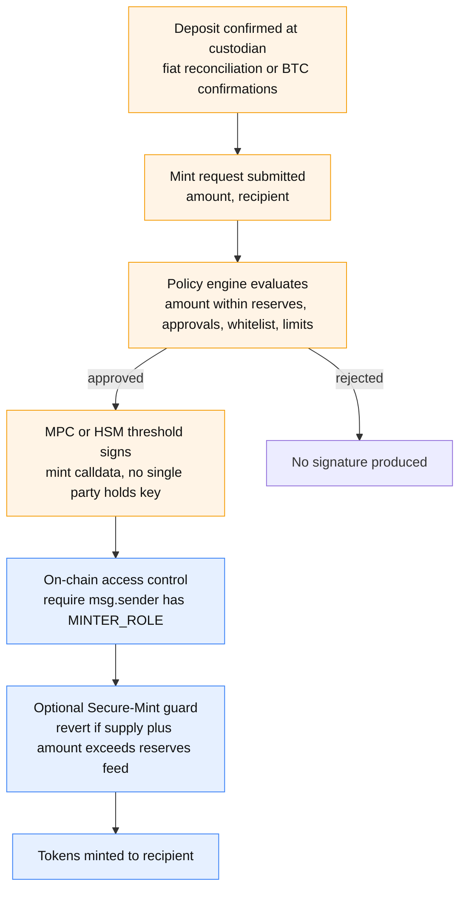

# Tokenization of Non-Native Collateral — State of the Art

**Date**: June 2026
**Scope**: how BTC, RWA, ETH/LSTs, and other non-EVM-native assets are tokenized from custody wallets — the mechanisms by which custody platforms mint tokens, why those mechanisms work, their main applications, and the security/trust trade-offs. Written to inform P2PxAmina's collateral-tokenization design.

> **Provenance note.** This report synthesizes nine parallel research sweeps (BTC tokens, the trustless BTC frontier, RWA platforms, custody tokenization engines, proof of reserves, bridges & failure history, institutional tri-party collateral, permissioned token standards, ETH/LST collateral). Inline `[source]` citations are preserved; `[unverified]` marks claims the research could not independently confirm. Figures are mid-2026. The companion design doc is `tokenization-of-collateral.md`; the canonical architecture is `Claude-architechture-3.md`.

---

## Table of contents

1. [Executive summary](#1-executive-summary)
2. [A taxonomy of tokenization models](#2-a-taxonomy-of-tokenization-models)
3. [How custody wallets mint tokens (core section)](#3-how-custody-wallets-mint-tokens-core-section)
4. [Tokenized Bitcoin](#4-tokenized-bitcoin)
5. [The trustless Bitcoin frontier](#5-the-trustless-bitcoin-frontier)
6. [RWA tokenization](#6-rwa-tokenization)
7. [ETH, LSTs, and restaking as collateral](#7-eth-lsts-and-restaking-as-collateral)
8. [Proof of reserves & attestation](#8-proof-of-reserves--attestation)
9. [Permissioned token standards](#9-permissioned-token-standards)
10. [Bridges vs custody-mint, and failure case studies](#10-bridges-vs-custody-mint-and-failure-case-studies)
11. [Institutional tokenized collateral & tri-party repo](#11-institutional-tokenized-collateral--tri-party-repo)
12. [Regulatory context (2025–2026)](#12-regulatory-context-20252026)
13. [Cross-cutting comparison](#13-cross-cutting-comparison)
14. [Implications for P2PxAmina](#14-implications-for-p2pxamina)
15. [Sources](#15-sources)

---

## 1. Executive summary

1. **Tokenizing a non-native asset is fundamentally a custody + attestation + legal problem, not a cryptography problem.** Across every production system surveyed, the token's value rests on a chain of (a) who holds the underlying, (b) who is authorized to mint against it, (c) how supply is bound to reserves, and (d) what legal claim the holder has. The smart-contract `mint()` is the least interesting part.

2. **How a custody wallet mints, in one sentence:** an on-chain `MINTER_ROLE` is assigned to a wallet whose key is controlled by the custodian's MPC/HSM infrastructure, and a *policy engine* — not the key itself — decides whether to produce the mint signature, gated procedurally (confirmed deposit ≤ reserves) and increasingly cryptographically (Chainlink Proof-of-Reserve "Secure Mint" reverts the mint on-chain if supply would exceed reserves). Two gates: an off-chain policy gate and an on-chain access-control gate.

3. **There is a clear trust spectrum for BTC**, from single regulated custodian (cbBTC, kBTC) → joint multi-jurisdiction custody (WBTC) → institutional MPC consortia (LBTC, FBTC) → elected federation (sBTC) → threshold-cryptographic (tBTC) → DLC self-wrapping (iBTC/dlcBTC, where the BTC can *only* return to the depositor by construction) → trustless ZK (Babylon TBV / BitVM, still pre-production). Trust-minimization trades off against latency, cost, and operational maturity.

4. **Every major bridge loss (>$1.5B across Ronin, Wormhole, Nomad, Multichain, Harmony, BSC Token Hub, Qubit, Orbit) was caused by implementation bugs, key compromise, or operational centralization — never by breaking the underlying cryptography.** For *institutional* collateral, a regulated custodian mint-burn model with attestation and legal recourse is materially stronger than a permissionless lock-and-mint bridge against exactly these failure modes. Its weaknesses (censorship, counterparty concentration, redemption latency) are acceptable for a KYC'd institutional venue.

5. **Institutional tri-party already runs in production on-chain**: JPM Kinexys TCN (BlackRock MMF pledged to Barclays in ~1 second, assets never leaving custody), Broadridge DLR (~$384B/day repo), HQLAx (pledge-without-moving via Digital Collateral Records on Corda), Canton (on-chain Treasury repo with real-time collateral reuse), and — most relevant — **Sygnum MultiSYG**, a regulated bank issuing BTC-backed loans via a 3-of-5 multi-sig where the bank cannot move the collateral unilaterally. These are direct prior art for P2PxAmina.

6. **The "movable only by the protocol" collateral token is a solved pattern** via ERC-3643 (identity-gated transfers, `forcedTransfer`/`freeze`/`recovery`) or CMTAT's `AllowlistModule` (allowlist = `{protocol, custodian}` ⇒ token is movable only to those addresses). Combined with Chainlink Secure-Mint and a custody pledge with the bank as a required signer, this reproduces P2PxAmina's pledge-bound-mint / voucher-gated-release design using only proven components.

---

## 2. A taxonomy of tokenization models

| Model | Who can mint | Who can redeem | Theft resistance | Censorship resistance | Regulatory fit | Examples |
|---|---|---|---|---|---|---|
| **Single-custodian mint-burn** | Custodian key (MPC/HSM) | Burn + KYC request → custodian releases | High vs on-chain exploit; depends on one entity | Low (custodian can freeze) | **Highest** (one regulated entity, attestations, insurance) | cbBTC, kBTC, BUIDL, most RWA, stablecoins |
| **Joint / multi-jurisdiction custody** | M-of-N across entities | Merchant model | Higher (no single entity) | Low–med | High but governance-opacity risk | WBTC (BitGo + BiT Global) |
| **Institutional MPC / TSS consortium** | t-of-N consortium co-sign (HSM-backed) | Burn → consortium co-sign | High (threshold + HSM) | Med | High (named institutions) | LBTC, FBTC, FBTC |
| **Lock-and-mint bridge (validator/guardian)** | Validator/guardian quorum signs | Burn → validators unlock | **Historically poor** (>$1.5B lost) | High (permissionless) | Low (no legal recourse) | Wormhole, Ronin, Multichain (all hacked) |
| **Threshold-cryptographic** | Rotating t-of-N node wallet (DKG) | Burn → signer threshold | Med-high (honest-majority, rotating) | High | Low–med | tBTC v2 (51-of-100), sBTC (10-of-15) |
| **DLC self-wrapping** | Depositor + attestor threshold; payout bound to depositor | Burn → attestors attest → BTC to depositor only | **Very high** (attestors can grief, not steal) | High | Med | iBTC / dlcBTC (10-of-15 attestors) |
| **Trustless ZK (optimistic)** | Host-chain state proven via SNARK + garbled circuit | Challenge-window ZK proof | **Highest** (cryptographic) | High | Med | Babylon TBV, BitVM2/3 (pre-production) |
| **Native issuance (RWA / LST)** | Issuer/transfer-agent (RWA) or staking contract (LST) | Issuer redeems / protocol exit queue | Depends on legal wrapper (RWA) or protocol (LST) | Low (RWA) / High (LST) | High (RWA, regulated) | BENJI, Ondo, Centrifuge; stETH, rETH |

**The central axis** is *where the trust anchor sits*: an off-chain regulated entity (custodian/issuer), a distributed signer set, or Bitcoin/Ethereum consensus itself. Moving down the table removes human trust at the cost of latency, cost, and maturity. No production system at institutional scale is fully trustless for BTC today.

---

## 3. How custody wallets mint tokens (core section)

This is the heart of the report. A custody-backed token is sound when three orthogonal guarantees hold simultaneously:

1. **Cryptographic** — no single operator can produce a valid mint signature (MPC threshold or multisig).
2. **Policy** — the signing infrastructure signs a transaction only after it clears an approved workflow (the policy engine / Transaction Authorization Policy).
3. **Legal/economic** — a regulated custodian or trust company legally obligates itself to hold backing 1:1 and publishes attestations.

### 3.1 The two-gate mint

The key architectural fact: **the key-management layer (MPC/HSM) signs arbitrary calldata; the policy engine decides whether to sign.** A bypass of the policy engine (TEE escape, misconfiguration, compromised co-signer) is more dangerous than a smart-contract exploit because it is invisible on-chain until a mint occurs.

### 3.2 The six questions, answered

- **Q1 — What gives a wallet mint authority?** A smart-contract role (`MINTER_ROLE` in OZ AccessControl; `Operator`/`System`/`Agent` in proprietary templates) is granted to a wallet whose key lives inside the custodian's MPC/HSM. Minting needs the same quorum approval as any transaction.
- **Q2 — How is supply bound to reserves?** *Procedurally* (universal): deposit confirmed → operator initiates mint → policy validates `amount ≤ unencumbered reserve` → MPC signs → ledger decremented. *Cryptographically* (Chainlink Secure Mint): the contract reads a PoR feed and reverts if `supply + amount > reserves`. [[Chainlink PoR](https://chain.link/proof-of-reserve)]
- **Q3 — How does MPC-CMP / threshold signing work?** Distributed key generation produces key *shards*; no quorum below threshold reveals the key; a t-of-N set each computes a partial signature, aggregated off-chain into one standard ECDSA/Schnorr signature indistinguishable on-chain. Fireblocks' MPC-CMP runs a 3-shard model (server in AWS Nitro TEE, customer co-signer, customer backup), 2-of-3 to sign, policy engine co-located in the enclave. [[Fireblocks MPC](https://www.fireblocks.com/report/what-is-mpc)] BitGo TSS distributes shards user/backup/BitGo; "keyshares never produce a viewable private key." [[BitGo MPC](https://developers.bitgo.com/guides/get-started/concepts/mpc)] HSM model (Taurus, Ripple/Securosys) keeps the key in FIPS 140-2 L3/L4 hardware with policy logic in firmware.
- **Q4 — How does the policy engine enforce rules?** Whitelist, spending/velocity limits, dual approval, business-hours, destination matching, function-selector filters. Fireblocks TAP runs ~16 parameters inside the TEE; Fordefi adds *transaction simulation before signing* and method-level granularity; Taurus runs rules inside the HSM firmware; CMTAT adds an on-chain `RuleEngine.operateOnTransfer()` complement.
- **Q5 — How is the mint attested?** Independent CPA attestation (monthly), Chainlink PoR feed (real-time), Chainlink Secure Mint (on-chain guard), on-chain proof-of-custody (WBTC stores `btcTxid` per mint), SOC 2 / ISO 27001 process audits, and DTCC/transfer-agent reconciliation for securities.
- **Q6 — How does redemption (burn-and-release) work?** Holder sends tokens to a redemption address (or `burnFrom`); contract `burn()` reduces supply; issuer increments redeemable reserve; custodian releases the underlying. WBTC: merchant calls `addBurnRequest` → custodian releases BTC and records `btcTxid`.

### 3.3 Platform-by-platform

| Platform | Key model | Mint-authority binding | Policy engine | Token standards | Attestation |
|---|---|---|---|---|---|
| **Fireblocks** | MPC-CMP, 3-shard, TEE/Nitro | MPC wallet holds `MINTER_ROLE`; TAP gates signing | TAP in TEE, ~16 params, workflow approvals | ERC20F, ERC721F, ERC-3643 (via Tokeny, 2024) | SOC 2; optional Chainlink PoR |
| **BitGo** | Multisig 2-of-3 or MPC/TSS; PQ-MPC testing (2026) | WBTC `CUSTODIAN` role; `MINTER` for RWA, in BitGo custody | Limits, whitelists, multi-approver | ERC-20 (WBTC), custom ERC-20/3643 | Monthly attestations; SOC 2 II |
| **Taurus** | HSM FIPS 140-2 L3 (Thales) + MPC; **signing inside HSM** | HSM wallet granted `MINTER_ROLE` in CMTAT | Policy in HSM firmware + TEE | CMTAT (primary), ERC-1400, ERC-3643, SPL, Stellar; Aztec privacy variant | ISAE 3402 II, ISO 27001 |
| **Ripple / Metaco Harmonize** | HSM (Securosys FIPS L4) + MPC, customer choice | Minter key in Harmonize HSM/MPC; governance framework | Customizable governance, segregated business units | Blockchain-agnostic; XRPL, EVM, CBDC | ISO 27001, SOC 2 II, FIPS L4 |
| **Tokeny (T-REX/ERC-3643)** | Not a custodian; standard + compliance platform | `AGENT_ROLE` granted to issuer's custody wallet | On-chain `ModularCompliance.canTransfer` | ERC-3643 | ONCHAINID claims |
| **Fordefi (→ Paxos, Nov 2025)** | MPC semi-custodial; server shard in Nitro enclave | MPC vault holds `MINTER_ROLE` | **Simulation-based** pre-signing; method-level filter; admin quorum | ERC-20 (via Bitbond), custom | SOC 2; Paxos trust charter post-acq |
| **Anchorage Digital** | Multiparty hardware + biometric quorum; OCC charter | Anchorage key holds minter role; internal governance | Programmable withdrawal policies; biometric auth | 45+ chains; ERC-20/3643; RLUSD | OCC-supervised; monthly attestations |
| **Sygnum** | Multi-layer (Swiss key storage, air-gap) | `Operator`/`System` role on Sygnum Security Token | Role-based + whitelist | Sygnum Security Token (ERC-20 ext), ERC-3643 compatible | Swiss DLT Act; FINMA-supervised |

### 3.4 Why it works — the combined trust stack

The model is sound because the three guarantees are *independent*: an attacker must simultaneously (a) break the MPC/HSM threshold, (b) defeat the policy engine, and (c) overcome legal/regulatory deterrence. The on-chain `MINTER_ROLE` is necessary but never sufficient.

**The single-key cautionary tale — PYUSD, October 2025.** Paxos accidentally minted **300 trillion PYUSD** in one transaction and burned it within 22 minutes — proving Paxos holds a *single* (MPC-protected) key with unconstrained mint authority. The fast burn was possible precisely because the same unconstrained key could burn; a malicious holder of that key could have done the same, with secondary-market freezes (Aave froze PYUSD markets) as the only circuit breaker. [[PYUSD incident](https://cointelegraph.com/news/aave-freezes-pyusd-markets-after-unprecedented-300t-mint-and-burn)] **Lesson for P2PxAmina: mint authority must be constrained by a reserve guard and co-attestation, not just protected by MPC.**

### 3.5 Main applications

Fiat-backed stablecoins (USDP, PYUSD, RLUSD); wrapped/cross-chain assets (WBTC, cbBTC); tokenized T-bills/MMFs (BUIDL, BENJI, USDY); tokenized fund shares (ERC-3643 via Tokeny/Fireblocks; UBS uMINT custodied by Komainu); tokenized securities (CMTAT via Taurus; Sygnum); tokenized bank deposits (Citi Token Services, JPM Coin/JPMD); CBDCs (via Harmonize); tokenized commodities (PAXG). **Collateral is the application P2PxAmina targets — and it is the least mature of these.**

---

## 4. Tokenized Bitcoin

Mid-2026: >200,000 BTC tokenized across a dozen issuers spanning the full trust spectrum.

| Token | Who holds BTC | Mint authority | Redemption | Proof of reserves | Trust model | Notable events |
|---|---|---|---|---|---|---|
| **WBTC** (~129k) | BitGo (US) + BiT Global (HK+SG), 2-of-3 | Whitelisted merchants → custodian co-sign | Merchants only (no retail redeem) | Chainlink PoR ~10 min; **Tron-side removed from dashboard** | 3 entities / 2 jurisdictions; Justin Sun association | BiT Global custody change Aug 2024; MakerDAO offboarding debate |
| **cbBTC** (~43k) | Coinbase Custody Trust (NYDFS) | Coinbase-only | Coinbase account → BTC released | NYDFS audits; **no public Chainlink PoR** | Single regulated custodian | BiT Global v Coinbase suit dismissed 2025 |
| **tBTC v2** | 100-node threshold-ECDSA wallet, 51-of-100, T-staked | Permissioned Minters (fast) / permissionless (slow) | Burn → signers sign BTC tx; ~20 bps (waivable) | Structural (deterministic public wallets) | Honest-majority per wallet; rotating wallets | none major |
| **LBTC** (~21k) | ~14-node Security Consortium via CubeSigner HSM (2/3) + Babylon staking | Consortium 2/3 co-sign **+ Bascule Drawbridge** dual-auth | Burn → reverse Bascule → CubeSigner pays out | Redstone + Chainlink PoR; Bascule continuous monitor | 2/3 consortium + Cubist; **Babylon slashing risk** | none major |
| **FBTC** | Cobo MPC; 3-of-3 TSS (Antalpha, Cobo, Mantle) | Whitelisted institutions | Burn → TSS co-sign | Chainlink PoR | 3-party TSS (any one vetoes; all 3 to steal) | none major |
| **iBTC / dlcBTC** | **Depositor (key 1) + 10-of-15 attestors (key 2)**; DLC script pays only the depositor | Merchant self-wraps | DLC pays out **to depositor only** | Structural (BTC UTXO public) | **Attestors can grief, cannot steal** | none; smaller scale |
| **sBTC** | Stacks 10-of-15 elected signers (Taproot multisig) | 10/15 observe deposit → mint on Stacks | Burn → 10/15 co-sign BTC (~1h) | Structural (public peg address) | Permissioned elected federation | deposits Dec 2024, withdrawals Apr 2025 |
| **solvBTC / pumpBTC / uniBTC** | **Wrap already-wrapped BTC** (WBTC/BTCB/FBTC) via Cobo/Ceffu/Coincover MPC; delegate to Babylon | Multi-sig validated; Secure Mint (uniBTC) | Weekly cycle (solvBTC); unbonding delay | Chainlink PoR (most) | **Stacked trust** — inherit underlying wrapper's custodian risk + Babylon slashing | **uniBTC Sep 2024 $2M exploit** (ETH treated as BTC in mint) |
| **kBTC** | Kraken Financial (US qualified custodian) | Kraken account holders | Kraken interface | [unverified] | Single custodian; Trail of Bits audited | none |
| **21BTC** | 21.co / Flow Traders cold storage | Authorized participants | APs | Chainlink PoR (ETH + SOL) | Single custodian cluster | none |

**Spectrum (most → least trusted):** cbBTC · kBTC · WBTC · 21BTC · FBTC · solvBTC · LBTC · pumpBTC · sBTC · tBTC v2 · iBTC.

Two structural lessons: **(a) custodian identity is priced continuously on-chain** — the WBTC/BiT Global change triggered MakerDAO and Coinbase responses within days; **(b) stacked wrappers compound risk** — solvBTC/pumpBTC/uniBTC inherit the custodian risk of the WBTC they wrap *plus* their own smart-contract risk, and uniBTC's $2M exploit was a mint-price bug (ETH valued 1:1 as BTC), not a custody failure. [[uniBTC exploit](https://thedefiant.io/news/hacks/bedrock-vulnerability-allows-hacker-to-drain-usd2m-from-unibtc-liquidity-pools)]

---

## 5. The trustless Bitcoin frontier

Bitcoin Script is intentionally limited; trust-minimized BTC collateral must either embed enforcement in Taproot scripts + pre-signed UTXOs, or introduce off-chain computation Bitcoin can audit via hash-preimage / Schnorr-signature revelation.

| Mechanism | Primitive | Trust removed | Trust remaining | Maturity | Cost (challenged) |
|---|---|---|---|---|---|
| **Babylon staking (EOTS)** | Taproot multisig + Extractable One-Time Signatures (Schnorr nonce-reuse) + CSV timelocks | Bridge/custodian; slashing enforced on L1 | Covenant committee M-of-N | **Production** (mainnet Aug 2024; slashing Q2 2025; ~$4.8B TVL) | standard fees |
| **Babylon TBV** (DeFi collateral) | Taproot + Groth16 SNARK + garbled circuits + challenge window | Custodian; bridge operator | Challenger liveness; off-chain data availability; GC setup honesty | **Aave V4 governance proposal stage, not deployed** | ~$93 |
| **BitVM2** | SNARK verifier split into Bitcoin Script chunks; optimistic fraud proof; 1-of-N honest verifier | Bridge custodian | Challenger liveness; **dispute cost ~$14k–16k** at high fees | **Early mainnet**: Bitlayer (Jul 2025), Citrea (Jan 2026) | ~$14,000–16,000 |
| **BitVM3** | Groth16 + Yao garbled circuit; challenger evaluates off-chain, posts compact fraud witness | ~170× cheaper dispute vs BitVM2 | **Permissioned** challenger set (~100); TB-scale off-chain data | **Research/paper** (2025); BABE 2026 cuts off-chain data ~1000× | ~$93 (dispute); ~$2.66 (happy) |
| **DLCs / dlcBTC** | Schnorr adaptor signatures; oracle nonce-commitment; Contract Execution Transactions | **Custodian theft** (funds only return to depositor) | Attestor liveness; oracle correctness | **Production** (ETH + Arbitrum, Apr 2024) | standard fees |
| **Stacks sBTC** | Taproot threshold multisig, 11-of-15 Schnorr | Single-custodian monopoly | 15 named signers; 70% can steal | **Production** (2024–2025) | standard fees |
| **MuSig2 / FROST** | Schnorr key aggregation; FROST adds t-of-n DKG | Single points of failure; chain-visible multisig | Signer cooperation (not enforced on-chain) | MuSig2 production (BIP327); FROST maturing | 57.5 vB cooperative spend |
| **zkPoR (Plonky2)** | zk-SNARK over Merkle-sum tree; range proofs | Hidden liabilities; false solvency | Does not prove UTXO control or non-encumbrance | **Production** (Binance, OKX, Backpack) | proving compute |

**Key trade-offs:** Bitcoin's ~10-min block time is a hard latency floor for challenge-window schemes. BitVM2 puts computation on-chain (expensive dispute); BitVM3 pushes it off-chain (cheap dispute, TB-scale setup). The DLC model is the most elegant for collateral: **the script can be constructed so the BTC can only ever return to the original depositor — attestors can block (grief) but cannot steal.** This is the cryptographic ideal that P2PxAmina's voucher-gated release approximates at the custody-policy layer.

---

## 6. RWA tokenization

For RWAs the **legal wrapper is the real backing** — the token is only as good as the SPV/fund structure and the transfer agent behind it.

| Platform | Token | Standard | Legal wrapper | Custodian | Transfer agent | NAV / oracle | Redemption |
|---|---|---|---|---|---|---|---|
| **Securitize / DS Protocol** | BUIDL, ACRED… | Custom permissioned ERC-20 (ERC-3643 heritage) | per issuer | per issuer | **Securitize (SEC-registered TA)** | off-chain admin key | T+0–T+3; sToken (ERC-4626) for DeFi |
| **BlackRock BUIDL** ($2.5B+) | BUIDL | Permissioned ERC-20 | BVI fund | BNY Mellon | Securitize | $1.00, rebasing yield | Circle USDC 1:1 instant contract |
| **Franklin Templeton BENJI** ($1B+) | BENJI | Permissioned (Stellar-native + ERC-20) | **US '40-Act mutual fund**; blockchain = official record | BNY Mellon | Franklin Templeton (self) | $1.00, daily airdrop | same-day |
| **Ondo OUSG** | OUSG/rOUSG | Permissioned ERC-20 | LP fund; underlying = BUIDL | BNY (via BUIDL) | Ondo | off-chain oracle; $50M/24h instant | instant via `OUSGInstantManager` |
| **Ondo USDY** | USDY | Permissioned (40-day lockup, then transferable) | **Delaware bankruptcy-remote LLC; senior secured note** | segregated acct | Ondo | price-appreciating | ~T+1 |
| **Backed Finance** | bTokens (BIB01…) | **Plain ERC-20** (max DeFi composability) | Swiss DLT tracker certificate | Swiss custodian | Backed AG | secondary-market arb | T+3 (institutional) |
| **Centrifuge** | DROP/TIN tranches | **ERC-7540 (async)** | per-pool SPV (bankruptcy-remote) | per-pool originator | Centrifuge pool manager | **discounted cash flow on Centrifuge Chain** | epoch-based async |
| **Maple Finance** ($4.6B AUM) | syrupUSDC | **ERC-4626** | per-pool SPV | overcollateralized crypto | Maple | on-chain loan-state accrual | FIFO queue <24h, max 30d |
| **Superstate USTB** | USTB | Upgradeable ERC-20 + allowlist | 3(c)(7) fund | [unverified] | Superstate | **continuous oracle + Chainlink + Chronicle** | instant via RedemptionIdle |
| **OpenEden TBILL** | TBILL | **ERC-4626** | BVI professional fund; **Moody's-rated** | BNY Mellon | OpenEden | daily NAV from BNY | daily |
| **Hashnote USYC** (~$3B, now Circle) | USYC | Permissioned ERC-20 | Cayman fund (CIMA) | segregated prime-broker | Circle | daily NAV | T+0 24/7 |

**Patterns:** the most institutionally robust wrapper is a US '40-Act fund (BENJI) where the blockchain *is* the official shareholder registry; the most DeFi-composable is a plain ERC-20 tracker certificate (Backed) at the cost of redemption rights; the async ERC-7540 vault (Centrifuge) exists specifically because illiquid credit needs epoch-based off-chain NAV settlement. **NAV oracle integrity is the recurring audit risk** — Centrifuge's discounted-cash-flow NAV depends on the pool admin honestly reporting defaults (Tinlake pools had delinquencies 2022–23; Maple's Orthogonal default cost $36M in 2022).

---

## 7. ETH, LSTs, and restaking as collateral

ETH/LST collateral differs fundamentally from custody-held BTC: **the LST/ETH exchange rate is on-chain and deterministic**, so collateral can be priced by the protocol rate rather than a market price. BTC wrappers have no equivalent and must use market oracles.

- **stETH / wstETH (Lido).** stETH rebases (breaks many DeFi integrations); wstETH is the non-rebasing wrapper (`stEthPerToken()` ~1.228 in early 2026). Aave V3 wstETH: 79% LTV standard, 93% e-Mode; Morpho wstETH/USDC 86% LLTV.
- **Lido stVaults (V3).** Isolated institutional staking vaults; mint stETH against vault value up to `total_value × (1 − reserve_ratio)`. Critically, they use **force-rebalance, not liquidation** — when unhealthy, anyone can permissionlessly trigger EIP-7002 validator withdrawals that move ETH to Lido Core and burn the corresponding stETH; no external liquidator profit, no auction.
- **EigenLayer + LRTs (eETH, ezETH, rsETH).** Restaking adds **AVS slashing** (live since April 2025) as a novel risk layer on top of validator slashing. EigenLayer TVL fell ~$18B → ~$7B through 2025 as risk repriced. LRTs without a hard redemption mechanism (ezETH) have no price floor.
- **CAPO — Correlated-Asset Price Oracle (the key oracle design).** Prices an LST as `min(market_rate, snapshot_rate × (1 + maxYearlyGrowth × elapsed))` × ETH/USD — capping how fast the exchange rate can grow to resist oracle manipulation, while ignoring transient market depegs. Block Analytica's simulation: over Feb–Nov 2024 a market-price oracle would have caused ~$210M of wstETH liquidations vs **$0** for an exchange-rate oracle. [[Block Analytica](https://blockanalitica.substack.com/p/analysis-of-market-price-vs-exchange)]

**Depeg / oracle case studies (load-bearing):**
- **stETH June 2022** — fell to 0.94 ETH on Curve under Celsius/3AC liquidations; pre-Shanghai there was no redemption floor. Motivated CAPO.
- **ezETH April 2024** — Renzo had **no redemption mechanism**; ezETH could only exit via DEXs, cascading leveraged liquidations on Gearbox/Ironclad.
- **Aave CAPO wstETH misconfiguration, March 2026** — `snapshotTimestamp` advanced while `snapshotRatio` stayed stale (the 3-day/3% anti-spike guard blocked the ratio update), so CAPO returned wstETH ~2.85% below true value; 34 e-Mode accounts liquidated, ~$27M, Aave reimbursed from treasury. [[Aave incident](https://www.coindesk.com/business/2026/03/10/defi-lending-platform-aave-sees-a-rare-usd27-million-liquidations-after-a-price-glitch)] **Lesson: the anti-manipulation cap itself becomes a lower-bound attack surface if the snapshot falls behind; e-Mode's tight LTV makes a 2–3% error liquidatory.**

---

## 8. Proof of reserves & attestation

PoR closes exactly one gap: **proving a claimed reserve quantity exists at a point in time.** It does **not** prove exclusive control, absence of hidden liabilities, no rehypothecation, or future solvency.

| Method | Proves | Does NOT prove | Freshness | Adoption |
|---|---|---|---|---|
| **Chainlink PoR (self-attested)** | API reports balance X at T | accuracy of self-report; control; liabilities | ~1h–24h | WBTC, swETH |
| **Chainlink PoR (third-party)** | custodian-verified balance | hidden liabilities; rehypothecation | ~1h–24h | TUSD, cbBTC, 21BTC, FBTC, LBTC |
| **Chainlink Secure Mint** | mint blocked if supply > last-known reserves | feed-staleness window; data accuracy | underlying feed | TUSD (first), uniBTC |
| **Merkle-tree PoR** | assets ≥ liabilities at snapshot; user inclusion | completeness; borrow-to-pass; rehypothecation | monthly | Binance, OKX, Bybit, Kraken |
| **zkPoR (Plonky2)** | assets ≥ liabilities; balances ≥ 0; privacy | **completeness** (all users included); UTXO control | monthly | OKX, Binance, Backpack |
| **AUP attestation** | auditor ran client-specified procedures | procedures are sufficient; fraud outside scope | quarterly | legacy, being replaced |
| **Full GAAP/IFRS audit** | full solvency, going concern | real-time on-chain state | annual | BUIDL, BENJI fund-level |

**Critical limitations / attacks:** the **borrow-to-pass** snapshot attack; **custodian failure not reflected in feed** (the Prime Trust/TUSD case — the feed kept reporting pre-collapse balances); **self-attestation oracle capture** (CoinDesk found 16 Chainlink nodes for Paxos all read one Paxos API — decentralized relay of centralized data); **feed staleness exploitation** if the consumer doesn't check `updatedAt`; **zkPoR completeness gap** (a dishonest exchange can prove a valid subset, omitting accounts). Armanino, the dominant crypto attestation firm, **exited crypto in late 2022** post-FTX. **No system in 2026 achieves real-time solvency proof inclusive of all liabilities and exclusive control.**

The 2026 best-practice standard: third-party (not self-attested) data source + named custodian in an SPV + monthly-or-better zkPoR with user-verifiable inclusion + Secure-Mint with staleness checks + liability disclosure + an explicit redemption path.

---

## 9. Permissioned token standards

The mechanics that make a collateral token "movable only by the protocol."

- **ERC-3643 (T-REX)** — Final EIP since 2023-12-15; **>$32B tokenized**. Token + Identity Registry + ModularCompliance + ClaimTopics + TrustedIssuers + ONCHAINID (ERC-734/735). `mint` is `onlyAgent` and requires `isVerified(_to)`; every `transfer` runs a 5-gate check (freeze, balance, identity, compliance, pause); **`forcedTransfer`, `freeze`/`freezePartialTokens`, and mandatory `recoveryAddress`** give issuers regulator-required powers (and are a centralization attack surface — the `AGENT_ROLE` is a god key, must be multisig+timelock).
- **ERC-1400 / 1644 / 1404** — security-token suite (never Final). Partitions (tranches), `canTransferByPartition` reason codes, `controllerTransfer`/`controllerRedeem` forced operations. The `_data` authorization parameter is **emitted but not verified on-chain** — a noted gap. ERC-1404 is the minimal `detectTransferRestriction` interface CMTAT's RuleEngine implements.
- **CMTAT (Swiss, Taurus/CMTA)** — v3.1, OZ v5, audited by Halborn/ABDK. Modular: Mint/Burn/Pause/**Enforcement (freeze + forced transfer + deactivate)**/Validation. **The `AllowlistModule` is the direct primitive for P2PxAmina**: enable it and set the allowlist to `{lendingProtocol, custodian}` and **all transfers (incl. mint/burn) to any other address revert** — the token becomes movable only by the protocol. The external `RuleEngine` (whitelist, blacklist, Chainalysis sanctions, conditional-transfer with Swiss 3-month auto-approval) plugs in without redeploying.
- **Soulbound patterns** — ERC-5192 (locked NFTs) for the strict case; for fungible collateral the production pattern is an OZ `_update` (v5) override that checks an allowlist of `{protocol, address(0), issuer}`. **Recurring audit bug: checking only `from` or only `to`** (Vultisig, Code4rena June 2024) — both directions must be validated with `address(0)` carve-outs for mint/burn.

---

## 10. Bridges vs custody-mint, and failure case studies

**Definitional distinction:** a lock-and-mint bridge locks the asset in an *on-chain vault* whose keys sit with a validator/guardian network; a custodian mint-burn holds the asset *off-chain* with a regulated entity and gates the on-chain mint with the custodian's key + policy. The locked vault is a honeypot; the custodian is a legal entity.

| Protocol | Year | Loss | Root cause | Model |
|---|---|---|---|---|
| **Ronin** | 2022 | ~$624M | Validator key compromise (Lazarus spear-phish); 4/9 validators one entity + stale Axie DAO delegation | 5/9 multisig |
| **Wormhole** | 2022 | ~$325M | Deprecated Solana `load_instruction_at` failed to validate sysvar address → signature-verification bypass → forged VAA → unbacked mint | 13/19 guardians |
| **Nomad** | 2022 | ~$190M | Upgrade initialized `_committedRoot = 0` → any message passed; crowd-looted | optimistic |
| **BSC Token Hub** | 2022 | ~$100M+ | IAVL Merkle verifier omitted right-child check → proof forgery → 2M BNB | native bridge |
| **Harmony Horizon** | 2022 | ~$100M | 2/5 multisig, both keys on same server | 2/5 multisig |
| **Qubit** | 2022 | ~$80M | legacy `deposit()` accepted `address(0)`; unlimited collateral | lock-and-mint |
| **Multichain** | 2023 | ~$125–210M | CEO held sole MPC key + servers; arrested → inability to operate + drain | MPC vault |
| **Orbit Chain** | 2023 | ~$81M | 7/10 multisig keys all compromised | 7/10 multisig |
| **Ren** | 2022–23 | ~$13M (sunset) | Alameda/FTX funding collapse → wind-down | MPC darknodes |

**The decisive observation: not one of these broke the underlying cryptographic primitive.** Every loss was an implementation bug, a key compromise, or operational/funding centralization. For institutional collateral, regulated custodian mint-burn is materially stronger against these exact modes — no on-chain vault to drain, HSM-grade keys with SOC2/insurance, legal recourse, regulatory deterrence, and oracle-gated minting — at the cost of censorship risk, counterparty concentration (WBTC/BiT Global), and redemption latency, all acceptable for a KYC'd venue. Modern bridges (LayerZero OFT burn-and-mint, Chainlink CCIP with its independent Risk Management Network + rate limits) are better than the 2022 generation but still configuration-dependent.

---

## 11. Institutional tokenized collateral & tri-party repo

This is the closest prior art to P2PxAmina. The universal pattern: **immobilize the underlying at a regulated custodian, create an on-chain representation, transfer the representation — the asset never moves.**

| System | Collateral | On-chain rep | Underlying location | Pledge or title | Liquidation | DLT |
|---|---|---|---|---|---|---|
| **JPM Kinexys TCN** | MMF shares, bonds | shadow token on Kinexys | stays at custodian (**in-location tokenization**) | either; legal opinions confirm both valid | traditional (ISDA CSA/GMRA) | Kinexys + JPMD |
| **Broadridge DLR** (~$384B/day) | fixed income | DAML digital twin | stays at custodian | title (repo); pledge for others | smart-contract trigger + conventional | DAML on VMware |
| **BNY tri-party** | any eligible | internal book entry | stays at BNY | pledge (lien) | BNY-managed | none (proprietary) |
| **HQLAx** | HQLA bonds/bills | **Digital Collateral Record** (ISIN-level) | stays at domestic custodian in **segregated account** | both supported | custodian-level; DCR is legal title evidence | R3 Corda; Fnality cash leg |
| **Canton / Digital Asset** | UST, securities | DAML on Canton | DTC-custodied | title (on-chain repo) | smart-contract; **real-time collateral reuse demoed Dec 2025** | Canton (privacy) |
| **Sygnum MultiSYG** | **Bitcoin** | native BTC UTXO in **3-of-5 multisig** | multi-sig wallet on Bitcoin | **pledge — bank cannot move unilaterally** | 3-of-5 coordination with independent signers | Bitcoin script (+ Debifi) |
| **AMINA / Tokeny** | securities (bonds, T-bills) | **ERC-3643** token | AMINA Bank custody (FINMA) | pledge or title; freeze/transfer via contract | **forced transfer by AMINA** | ERC-3643 on EVM; Taurus-PROTECT custody |

**The two most relevant precedents:**
- **HQLAx Digital Collateral Records** prove that "pledge without moving the underlying" works at scale: the DCR creator has an *obligation to maintain securities in the DCR custody account ≥ the DCR notional* (a segregated 1:1 backing obligation), and transferring the DCR transfers ownership while the securities never leave their home custodian. This is P2PxAmina's pledge account, generalized.
- **Sygnum MultiSYG** is the direct BTC analog: a FINMA-regulated bank issuing BTC-backed loans where the collateral sits in a 3-of-5 multisig (bank + borrower + independent signers), giving **cryptographic proof of non-rehypothecation** — the bank alone cannot move the BTC. This validates P2PxAmina's "AMINA in the custody quorum but cannot act unilaterally" design as a real regulated-bank pattern.

**AMINA + Tokeny (Oct 2025)** is our actual partner stack: AMINA custodies under its FINMA banking + securities-dealer licence; Tokeny provides ERC-3643 issuance + compliance; AMINA uses Taurus-PROTECT (MPC) for key management. The forced-transfer capability is how liquidation would execute — and is the centralization point an audit must scrutinize.

---

## 12. Regulatory context (2025–2026)

| Event | Date | Relevance |
|---|---|---|
| US GENIUS Act (stablecoin framework) | 2025 | Federal path for regulated stablecoin issuers (Anchorage first federally chartered issuer) |
| EU MiCA fully in force | 2024–25 | Authorization regime for asset-referenced / e-money tokens; AMINA holds MiCA (Austria) |
| FINMA DLT Act (Switzerland) | ongoing | Legal recognition of DLT securities + DLT trading venues; the basis for Backed tracker certificates and AMINA/Sygnum issuance |
| CFTC tokenized-collateral initiative + MPD guidance | Sep–Dec 2025 | First US guidance accepting tokenized assets as derivatives collateral; rulemaking targeted by Aug 2026 |
| DTCC + Digital Asset (tokenize DTC Treasuries on Canton) | Dec 2025 | Precedent for in-location tokenization of DTC-custodied assets |

**For P2PxAmina:** the regulatory tailwind is real (tokenized collateral is now explicitly contemplated by the CFTC and operational at JPM/BNY), and the FINMA DLT Act + AMINA's licences provide the legal wrapper for the pledge and forced-transfer mechanics. Rehypothecation rules and bankruptcy-remoteness of the pledge account are the items counsel must confirm.

---

## 13. Cross-cutting comparison

| Approach | Trust anchor | Theft resistance | Redemption latency | PoR strength | Regulatory fit | Custody-lock guarantee | Fit for institutional repo collateral |
|---|---|---|---|---|---|---|---|
| Single-custodian wrapped BTC (cbBTC) | one regulated entity | high vs on-chain; entity-dependent | account-gated | NYDFS/attestation | **high** | strong if honest | medium (single point) |
| MPC consortium BTC (LBTC/FBTC) | t-of-N institutions | high | burn + threshold | Chainlink PoR | high | strong | medium-high |
| DLC self-wrapping (iBTC) | depositor + attestors; **payout bound to depositor** | **very high** | ~hours | structural | medium | **excellent** | high (but small scale) |
| Trustless ZK (Babylon TBV/BitVM) | cryptography | **highest** | challenge window | structural | medium | excellent | future (pre-production) |
| Lock-and-mint bridge | validator set | **historically poor** | minutes | on-chain vault | low | weak | **avoid** |
| ERC-3643 securities token | issuer/custodian | high | issuer redeem | varies | **highest** | strong (freeze/forced) | high |
| Tri-party DCR (HQLAx) / TCN | custodian + DLT registry | high | atomic on-ledger | segregated backing obligation | **highest** | **excellent (pledge-without-moving)** | **highest** |
| Multi-sig pledge (Sygnum MultiSYG) | bank + borrower + independents | **very high (non-rehypothecation proof)** | coordination | on-chain visible | **highest** | **excellent** | **highest** |
| LST collateral (wstETH + CAPO) | Ethereum + oracle cap | high | exit queue | on-chain rate | high (DeFi) | n/a (on-chain) | n/a for BTC; relevant for ETH leg |

The two columns that matter most for P2PxAmina — **custody-lock guarantee** and **fit for institutional repo collateral** — point at the same cluster: HQLAx-style pledge-without-moving, Sygnum-style multi-sig pledge, DLC-style payout-bound-to-depositor, and ERC-3643 permissioning. P2PxAmina's design composes exactly these.

---

## 14. Implications for P2PxAmina

P2PxAmina's design (`tokenization-of-collateral.md`): **pledge-bound mint, voucher-gated release** — no existing BTC wrappers; each custodian issues its own permissioned collateral token; the BTC sits in a pledged custody account with AMINA as a mandatory co-signer; only AMINA can liquidate; release destination is fixed by on-chain deal state; extensible to ETH and RWA.

### 14.1 What the state of the art validates in our approach

1. **A custodian-anchored mint-burn model is the correct institutional choice** — the >$1.5B bridge-failure record confirms that for KYC'd institutional collateral, a regulated custodian beats a permissionless bridge against every realized failure mode (§10). Our "no existing wrappers, custodian mints per deal" stance is sound.
2. **Pledge-without-moving is proven at scale** — HQLAx DCRs and JPM TCN do exactly this with banks and segregated 1:1 backing obligations (§11). Our pledge account is the same construct.
3. **AMINA-in-the-quorum-but-not-unilateral is a real regulated-bank pattern** — Sygnum MultiSYG (3-of-5 BTC multisig, bank cannot move alone, cryptographic non-rehypothecation) is the direct precedent for our custody lock (§11).
4. **"Movable only by the protocol" is a solved token primitive** — CMTAT `AllowlistModule` (allowlist = `{LendingEngine, custodian}`) or ERC-3643 transfer restrictions reproduce our protocol-bound collateral token without inventing anything (§9). Our `EscrowVault`-only transferability maps onto this directly.
5. **Forced-transfer / freeze enables AMINA-only liquidation** — ERC-3643's `forcedTransfer` (used by AMINA/Tokeny today) is precisely the mechanism that lets only AMINA seize collateral on default (§9, §11).

### 14.2 What we should borrow

1. **Chainlink Secure-Mint as the on-chain reserve guard** — gate the collateral-token mint with `require(supply + amount ≤ attestedReserves)` so the custodian cannot mint unbacked tokens even if its key is compromised. The PYUSD 300T incident is the cautionary tale our design must not repeat (§3.4, §8). This is exactly the "supply ≤ reserves" rule in our `tokenization-of-collateral.md` §10 — make it an on-chain SecureMint, not just an off-chain check.
2. **Dual-authorization mint** — LBTC's "Consortium 2/3 **and** Bascule Drawbridge" pattern (neither can mint alone) is the production form of our "custodian + AMINA co-attestation on mint" (§4). Adopt the two-independent-verifiers structure.
3. **DLC payout-bound-to-depositor as the gold standard for release** — iBTC's "attestors can grief but cannot steal" because the script only pays the depositor (§4, §5) is the cryptographic ideal our voucher-gated release approximates at the policy layer. For a future trust-minimized tier, a DLC or Taproot-script lock where the spend condition is bound to the deal outcome would remove custodian-policy trust.
4. **CAPO for the ETH leg** — when we extend to ETH/wstETH collateral, use an exchange-rate oracle with a growth cap, not a market-price oracle ($210M vs $0 in the Block Analytica simulation) — but heed the March 2026 Aave incident: ensure `snapshotRatio` and `snapshotTimestamp` update atomically and the anti-spike guard cannot strand the snapshot below true value, especially at high LTV (§7).
5. **HQLAx "segregated backing obligation"** — formalize the custodian's obligation to hold assets in the pledge account ≥ the minted token notional as an explicit, attested, monitored invariant (§11), feeding our `PledgeRegistry` reserves check.
6. **ERC-7540 async semantics for the RWA extension** — when RWA collateral arrives, off-chain NAV/redemption settlement maps onto the Centrifuge ERC-7540 request/claim pattern (§6) — which our architecture already exposes as a view subset.

### 14.3 What to avoid

1. **Lock-and-mint or threshold-bridge custody** — every such system at scale has been drained or stranded (§10). Our collateral must never sit in an on-chain vault keyed by a validator/guardian network.
2. **Single unconstrained mint key** — PYUSD (§3.4). Always pair the custodian mint with AMINA co-attestation + on-chain reserve guard.
3. **Stacked wrappers** — solvBTC/pumpBTC/uniBTC compound custodian + smart-contract risk (§4); uniBTC's $2M exploit was a mint-price bug. We issue against real custodied BTC, never against another wrapper.
4. **Permanent oracle with no circuit breaker** — Morpho's immutable per-market oracle (§7) plus the Aave CAPO incident argue for an `EMERGENCY` oracle-override sidecar (which our design already has) and a freeze-on-stale rule.
5. **PoR theater** — a self-attested feed read by nodes hitting one custodian API (§8) is not real assurance. Require third-party attestation + AMINA's independent custody read + the on-chain `supply ≤ reserves` guard, and treat PoR as proof-of-existence only, never proof-of-exclusive-control (which the pledge multisig provides separately).

### 14.4 The synthesis

P2PxAmina's collateral design is **not novel in its parts** — it is a disciplined composition of proven institutional patterns: HQLAx pledge-without-moving + Sygnum multi-sig non-rehypothecation + ERC-3643/CMTAT protocol-bound permissioned token + Chainlink Secure-Mint reserve guard + LBTC-style dual-authorization + an `EMERGENCY` oracle override + a future DLC/BitVM trust-minimization upgrade path. That each component is in production somewhere is the strongest available evidence the design is implementable and auditable. The one genuinely hard, unsolved-at-scale problem — trustless BTC collateral without any custodian — is correctly deferred to a v2+ tier (Babylon TBV / BitVM), exactly as our architecture states.

---

## 15. Sources

> Consolidated from nine research sweeps; grouped by topic. (~200 distinct URLs were cited inline across the source briefs in the workflow transcript; the most load-bearing are listed here.)

**Custody engines / minting:** [Fireblocks MPC](https://www.fireblocks.com/report/what-is-mpc) · [Fireblocks Tokenization](https://www.fireblocks.com/products/tokenization) · [BitGo MPC](https://developers.bitgo.com/guides/get-started/concepts/mpc) · [WBTC Merchant Guide](https://github.com/WrappedBTC/DAO/blob/master/MerchantGuide.md) · [Taurus-PROTECT](https://www.taurushq.com/protect/) · [CMTA CMTAT](https://cmta.ch/standards/cmta-token-cmtat) · [Ripple/Metaco Harmonize](https://ripple.com/insights/mpc-and-hsm-for-key-management-part-2-digital-asset-custody-design-considerations/) · [Fordefi Policy Engine](https://fordefi.com/policy-engine) · [Anchorage stablecoin platform](https://www.anchorage.com/insights/anchorage-digital-bank-first-federally-chartered-stablecoin-issuer-following-genius-act) · [PYUSD 300T mint](https://cointelegraph.com/news/aave-freezes-pyusd-markets-after-unprecedented-300t-mint-and-burn)

**Tokenized BTC:** [cbBTC launch](https://www.coinbase.com/blog/coinbase-wrapped-btc-cbbtc-is-now-live) · [WBTC BiT Global](https://www.bitgo.com/resources/blog/bitgo-to-move-wbtc-to-multi-jurisdictional-custody-to-accelerate-global/) · [tBTC technical overview](https://tbtc.network/developers/tbtc-technical-system-overview/index.html) · [Lombard Security Consortium](https://www.lombard.finance/blog/the-lombard-security-consortium/) · [Lombard architecture](https://docs.lombard.finance/learn/architecture) · [FBTC docs](https://docs.fbtc.com/system-components/architecture) · [iBTC/dlcBTC architecture](https://www.ibtc.network/blog/dlcbtc-architecture) · [sBTC signers SIP-028](https://www.hiro.so/blog/who-are-the-sbtc-signers-breaking-down-sip-028) · [uniBTC exploit](https://thedefiant.io/news/hacks/bedrock-vulnerability-allows-hacker-to-drain-usd2m-from-unibtc-liquidity-pools)

**Trustless frontier:** [Babylon Trustless BTC Vault](https://docs.babylonlabs.io/guides/research/btc_trustless_vault/) · [How trustless are Babylon's vaults](https://onchainbitcoin.substack.com/p/how-trustless-are-babylons-bitcoin) · [BitVM3](https://bitvm.org/bitvm3.pdf) · [BitVM3 cheaper bridges](https://blockworks.co/news/bitvm3-promises-cheaper-bitcoin-bridges) · [Discreet Log Contracts](https://bitcoinops.org/en/topics/discreet-log-contracts/) · [MuSig2/FROST](https://blog.bitbox.swiss/en/musig2-and-frost-explaining-multisignature-schemes-on-taproot/) · [zkPoR (OtterSec)](https://osec.io/blog/2025-08-27-how-proof-of-reserves-uses-zk-to-protect-your-funds/)

**RWA:** [DS Protocol v4](https://medium.com/securitize/ds-protocol-v4-evolving-real-world-assets-8b0bc5c67846) · [Circle USDC BUIDL contract](https://www.circle.com/pressroom/circle-announces-usdc-smart-contract-for-transfers-by-blackrocks-buidl-fund-investors) · [Franklin BENJI 5y](https://stellar.org/press/franklin-templeton-stellar-development-foundation-mark-five-years-of-benji-the-first-u-s-registered-tokenized-money-market-fund) · [Ondo OUSG](https://docs.ondo.finance/qualified-access-products/ousg) · [Ondo USDY bankruptcy structure](https://blog.ondo.finance/protecting-investors-what-happens-if-ondo-goes-bankrupt/) · [Centrifuge legal structure](https://docs.centrifuge.io/getting-started/core-concepts/legal-structure/) · [Maple syrupUSDC](https://docs.maple.finance/syrupusdc-usdt-for-lenders/lending) · [Superstate Chainlink NAV](https://beincrypto.com/superstate-ustb-chainlink-integration-nav-data/) · [OpenEden Moody's rating](https://www.spglobal.com/ratings/en/regulatory/article/-/view/sourceId/101644198)

**ETH / LST:** [Lido tokens guide](https://docs.lido.fi/guides/lido-tokens-integration-guide/) · [stVaults design](https://hackmd.io/@lido/stVaults-design) · [CAPO BGD proposal](https://governance.aave.com/t/bgd-correlated-asset-price-oracle/16133) · [CAPO GitHub](https://github.com/bgd-labs/aave-capo) · [Aave CAPO incident](https://governance.aave.com/t/direct-to-aip-wsteth-capo-oracle-incident-user-reimbursement/24275) · [Market vs exchange-rate oracle](https://blockanalitica.substack.com/p/analysis-of-market-price-vs-exchange) · [ezETH depeg](https://medium.com/coinmonks/observations-from-renzos-ezeth-depeg-c545dc217147)

**Proof of reserves:** [Chainlink PoR](https://chain.link/proof-of-reserve) · [Chainlink Secure Mint](https://blog.chain.link/secure-mint/) · [CoinDesk PoR critique](https://www.coindesk.com/tech/2023/07/05/chainlink-proof-of-reserve-proves-little-beyond-data-going-in-coming-out) · [Binance zkMerkle PoS](https://github.com/binance/zkmerkle-proof-of-solvency) · [Armanino crypto exit](https://blockworks.co/news/ftx-auditor-proof-of-reserves) · [Cireta 2026 PoR standard](https://cireta.com/insights/proof-of-reserves-in-rwa-platforms-the-2026-diligence-standard)

**Standards:** [EIP-3643](https://eips.ethereum.org/EIPS/eip-3643) · [T-REX GitHub](https://github.com/TokenySolutions/T-REX) · [CMTAT GitHub](https://github.com/CMTA/CMTAT) · [CMTA RuleEngine](https://github.com/CMTA/RuleEngine) · [ERC-1400 spec](https://github.com/SecurityTokenStandard/EIP-Spec/blob/master/eip/eip-1400.md) · [Oraclizer ERC-1400 vs 3643](https://research.oraclizer.io/dissecting-erc-1400-and-erc-3643-the-technical-case-for-a-new-standard/) · [Vultisig whitelist bug](https://github.com/code-423n4/2024-06-vultisig-findings/issues/162)

**Bridges & failures:** [Wormhole hack](https://www.halborn.com/blog/post/explained-the-wormhole-hack-february-2022) · [Ronin hack](https://www.halborn.com/blog/post/explained-the-ronin-hack-march-2022) · [Nomad RCA](https://medium.com/nomad-xyz-blog/nomad-bridge-hack-root-cause-analysis-875ad2e5aacd) · [Multichain exploit](https://www.chainalysis.com/blog/multichain-exploit-july-2023/) · [LayerZero OFT](https://layerzero.network/blog/explaining-the-oft-standard) · [Chainlink CCIP](https://docs.chain.link/ccip) · [Bridge hacks overview](https://www.zircuit.com/blog/the-bridge-hacks-that-exposed-cross-chain-finances-fatal-flaws)

**Institutional / tri-party:** [JPM TCN BlackRock-Barclays](https://www.coindesk.com/business/2023/10/11/jpmorgan-debuts-tokenized-blackrock-shares-as-collateral-with-barclays) · [Kinexys TCN](https://www.jpmorgan.com/kinexys/digital-assets/tokenized-collateral-network) · [Broadridge DLR](https://www.broadridge.com/capability/middle-and-back-office-solutions/post-trade-processing/distributed-ledger-repo-solutions) · [HQLAx DCR Longbox](https://www.hqla-x.com/post/hqlaxs-dcr-longbox-a-leap-forward-for-collateral-mobility) · [Canton collateral reuse](https://www.canton.network/canton-network-press-releases/the-canton-networks-industry-working-group-demonstrates-next-phase-of-onchain-u.s.-treasury-financing) · [Sygnum + Debifi MultiSYG](https://www.sygnum.com/news/sygnum-and-debifi-combine-bitcoin-multi-sig-technology-with-regulated-bank-lending-service/) · [AMINA + Tokeny](https://www.coindesk.com/business/2025/10/23/swiss-crypto-bank-amina-taps-tokeny-to-build-compliant-bridge-for-asset-tokenization) · [CFTC tokenized collateral](https://www.dwt.com/blogs/financial-services-law-advisor/2025/12/cftc-tokenized-collateral-crypto-sprint)

---

*Assembled June 2026 from the cached research sweeps after the workflow's downstream agents were interrupted by a session limit. Full per-topic source lists (every inline URL) are preserved in the workflow transcript at `subagents/workflows/wf_38528d0d-92b/`. `[unverified]` tags from the source briefs are retained where applicable.*
