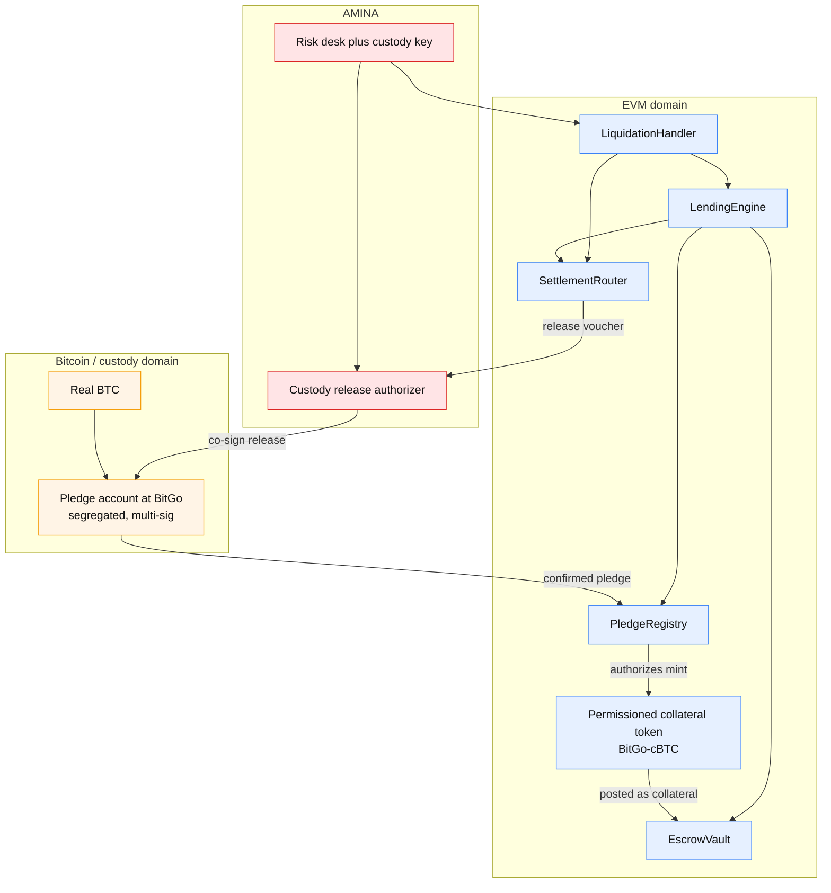
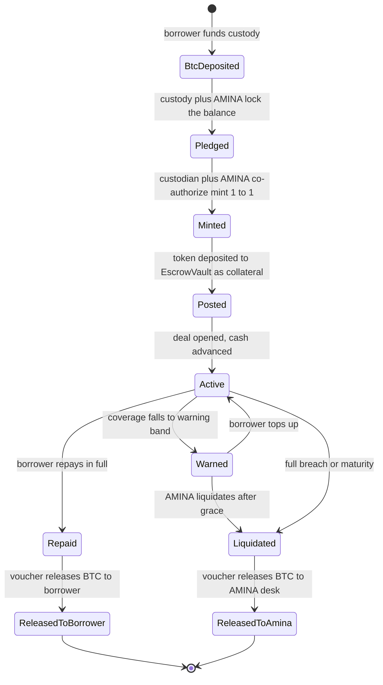
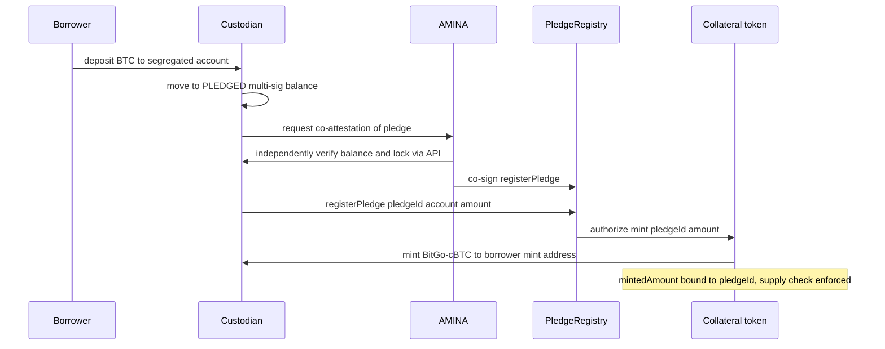
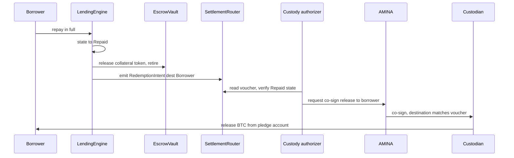
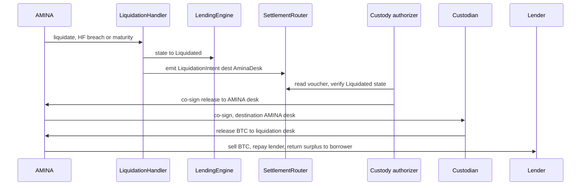

# P2PxAmina — Collateral Tokenization & Custody Lock Design

**Status**: technical design, v0.1
**Audience**: protocol engineering, AMINA risk/custody integration, custodian platform teams, auditors
**Scope**: how BTC (and later ETH, RWA) is tokenized as collateral such that the asset stays in regulated custody, only AMINA can liquidate, and no party — borrower, custodian operator, P2P, or an attacker who breaches the EVM layer — can extract it illegitimately.

> **Constraint set (from product owner):**
> 1. Do **not** use existing BTC wrappers (no WBTC / LBTC / cbBTC). Each custodian (BitGo, Fordefi, Copper, …) tokenizes on its own platform.
> 2. There must be **no path to move the underlying asset out of the platform** except through liquidation.
> 3. **Only AMINA** can liquidate (extract the asset).
> 4. AMINA has custody access (it is the lien holder).
> 5. The mechanism must extend to **ETH and RWA**.

---

## Table of contents

1. [Problem statement](#1-problem-statement)
2. [Core principle](#2-core-principle)
3. [Trust model](#3-trust-model)
4. [Architecture overview](#4-architecture-overview)
5. [Custody-side: the pledge account](#5-custody-side-the-pledge-account)
6. [The permissioned collateral token](#6-the-permissioned-collateral-token)
7. [The release-voucher mechanism](#7-the-release-voucher-mechanism)
8. [Full lifecycle](#8-full-lifecycle)
9. [Verifying tokenization — the three assurances](#9-verifying-tokenization--the-three-assurances)
10. [Proof of reserves](#10-proof-of-reserves)
11. [Threat model & adversary analysis](#11-threat-model--adversary-analysis)
12. [Enforcement-strength spectrum](#12-enforcement-strength-spectrum)
13. [Contract design](#13-contract-design)
14. [Mapping to the existing codebase](#14-mapping-to-the-existing-codebase)
15. [Extending to ETH and RWA](#15-extending-to-eth-and-rwa)
16. [Decisions required](#16-decisions-required)
17. [Implementation phases](#17-implementation-phases)
18. [Appendix A — interface sketches](#18-appendix-a--interface-sketches)
19. [Appendix B — glossary](#19-appendix-b--glossary)

---

## 1. Problem statement

The collateral is real BTC. BTC lives on the Bitcoin chain; the lending logic lives on an EVM chain. The collateral token is an EVM representation (a claim) on BTC held by a custodian. "Tokenization" is the binding between the EVM claim and the real asset, and the whole security of the protocol rests on three properties of that binding:

| Property | Plain statement | Difficulty |
|---|---|---|
| **Backing** | One collateral token corresponds to one real BTC that actually exists in custody. | Medium — attestation + reserves check. |
| **Exclusive lock** | While a token backs a live loan, nobody can move the underlying BTC except through the protocol's liquidation/repay paths. | **Hard — this is the crux.** |
| **Mint integrity** | Token supply can never exceed locked BTC. | Easy — co-authorized mint + reserves cap. |

The EVM side of the lock is already solved by `EscrowVault`: once the collateral token is posted, only the `LendingEngine` can move it, and it is released only on repay (to borrower) or liquidation (to AMINA). The unsolved risk is entirely **off-chain**: if the borrower (who owns the BTC at the custodian) can withdraw it from the custodian behind the protocol's back, the token becomes an unbacked IOU and the lender is exposed.

This document specifies a design — **pledge-bound mint, voucher-gated release** — that closes that gap.

---

## 2. Core principle

> **The on-chain deal state is the only thing that can unlock the BTC, and AMINA is a mandatory co-signer on the custody door.**

Consequences:

- "Legitimate release" is decided by **chain state**, not by anyone's discretion. A repaid borrower is released *by the `Repaid` state itself*; a defaulted borrower's collateral goes to AMINA *because only AMINA can drive the deal to `Liquidated`*.
- To steal BTC you must break **two independent gates simultaneously**: (a) produce a protocol release authorization that the chain state does not justify, **and** (b) compromise AMINA's custody signing key. No single actor — borrower, custodian operator, P2P, or an EVM-layer attacker — can do both.
- AMINA cannot grief a repaid borrower, because the `Repaid`-state release voucher is auto-derivable and AMINA's signature is required only to *confirm* it, not to *grant* it (see §7).

---

## 3. Trust model

| Party | Trusted for | NOT trusted for | Enforcement |
|---|---|---|---|
| **Borrower** | nothing | cannot mint, cannot move the token, cannot release BTC | token is protocol-bound; release is state-bound |
| **Custodian (BitGo)** | holding & not absconding with assets; honoring the pledge policy | cannot mint unbacked tokens alone; cannot release pledged BTC alone | AMINA co-attestation on mint; AMINA co-signature on release |
| **P2P Staking** | operating the platform | no custody access, no liquidation authority | role separation; no custody keys |
| **AMINA** | regulated liquidator + lien holder (by design) | cannot liquidate a healthy deal; cannot release outside on-chain rules | `LIQUIDATOR` multi-sig; HF/maturity guard; on-chain audit trail |
| **The protocol (smart contracts)** | producing release vouchers only in valid states | — | immutable `EscrowVault`/`DealRegistry`; audited engine |

The only inherently-trusted actor is AMINA — exactly the regulated, accountable party the product brief already designates as broker/curator/liquidator. Even AMINA is bounded by on-chain rules, multi-sig, and a permanent audit trail. This is the appropriate trust model for a **custodian-anchored tri-party repo** (the custodian is the trust anchor, as in BNY Mellon tri-party).

---

## 4. Architecture overview



Two domains, bound by two mechanisms: **mint** is gated on a confirmed pledge (BTC→token), and **release** is gated on a protocol voucher + AMINA co-signature (token-state→BTC).

---

## 5. Custody-side: the pledge account

Each deal's BTC sits in a **segregated pledge account** at the custodian. Requirements:

1. **Segregation** — one pledge balance per deal (or per borrower-deal), never commingled, so a specific BTC amount maps to a specific token mint and a specific `dealId`.
2. **Multi-party control** — moving BTC *out* of a pledged balance requires a quorum that **always includes AMINA**. Recommended: a 2-of-3 among **borrower, custodian, AMINA**, with policy "pledged funds move only with `custodian + AMINA`; the borrower's key alone is never sufficient." (This mirrors Sygnum/Debifi MultiSYG.)
3. **Pledge flag** — the custodian's platform marks the balance `PLEDGED` and refuses any withdrawal of a pledged balance that is not accompanied by a valid protocol release voucher (see §7).
4. **AMINA custody access** — AMINA can independently read the pledge account state (balance, lock flag) via the custodian's API, so AMINA verifies the lock *directly* rather than trusting a document.

The pledge account is the off-chain equivalent of `EscrowVault`. The two locks together make the no-exit guarantee true in both domains:

| Domain | Lock | Released by |
|---|---|---|
| EVM (collateral token) | held in `EscrowVault` | engine: on repay → borrower; on liquidation → AMINA |
| Bitcoin (real BTC) | pledged custody account | quorum that **requires AMINA**, against a state-bound voucher |

---

## 6. The permissioned collateral token

Not a fungible market wrapper — a **protocol-bound pledge receipt**. One token contract per `(custodian, asset)`, e.g. `BitGo-cBTC`. The token contract enforces four rules:

| Rule | Mechanism | Defeats |
|---|---|---|
| **Transfers restricted to protocol addresses** | allowlist: only `EscrowVault` and `LiquidationHandler` (and the mint/redeem flow) may hold/receive | an attacker who grabs the token cannot move it anywhere useful — it is soulbound to the protocol |
| **Mint requires custodian + AMINA co-authorization** | two-signer mint: custodian initiates, AMINA attests against its custody check | a compromised custodian minter cannot create unbacked tokens |
| **Mint bound to a confirmed pledge** | mint references a `pledgeId`; `mintedAmount ≤ pledgedAmount`; recorded in `PledgeRegistry` | over-minting / supply > reserves |
| **Burn only on a protocol redemption voucher** | `burn` callable only by the redemption path with a valid voucher | token cannot be destroyed (→ BTC freed) outside the protocol |

Standard: an **ERC-3643-style permissioned token** (identity-gated transfers) or a minimal custom permissioned ERC-20. Fungibility choice:

- **Recommended:** fungible per `(custodian, asset)` (e.g. one `BitGo-cBTC` contract), with per-deal pledges tracked in `PledgeRegistry`. Compatible with the existing amount-based `EscrowVault` ledger and HF math.
- **Alternative:** a non-fungible per-deal pledge receipt (ERC-721). Cleaner 1:1 pledge binding, but requires reworking the amount-based ledger. Defer unless a custodian requires it.

The security properties (state-bound, voucher-gated, AMINA co-sign) hold under either choice.

---

## 7. The release-voucher mechanism

This is the crux. **BTC leaves the pledge account only against a protocol release voucher whose destination is fixed by on-chain deal state, and the custody transaction is co-signed by AMINA.**

### 7.1 What a voucher is

The authoritative voucher is the **on-chain settlement intent** emitted by `SettlementRouter` when a deal reaches a terminal state. Events are immutable and independently verifiable (RPC + confirmations, or a light client). A voucher carries:

```
ReleaseVoucher {
  dealId        : bytes32     // the deal
  pledgeId      : bytes32     // which pledge
  asset         : bytes32     // "BTC"
  amount        : uint256     // sats / asset units
  destinationType : enum { Borrower, AminaDesk }
  destinationRef  : bytes32   // custody account reference, bound to destinationType
  reason        : bytes32     // "REPAID" | "LIQUIDATED"
  sequenceNumber: uint64      // monotonic, anti-replay
  issuedAt      : uint64
}
```

### 7.2 Destination is derived from state, not from the submitter

| On-chain deal state | Voucher emitted? | `destinationType` | Who can cause it |
|---|---|---|---|
| `Active` / `Warned` | **No** | — | nobody — no release possible |
| `Repaid` | Yes | `Borrower` | borrower (by repaying); the voucher is auto-derivable, AMINA cannot withhold it |
| `Liquidated` | Yes | `AminaDesk` | only AMINA (drives the deal to `Liquidated` via `LIQUIDATOR`, only on HF breach or maturity) |

This split is what gives both safety (borrower can't self-release without repaying) and liveness (AMINA can't hold a repaid borrower hostage).

### 7.3 The custody door check

The custodian's release authorizer releases pledged BTC **only if all hold**:

1. `SettlementRouter` at the known protocol address emitted a voucher for this `pledgeId`.
2. The deal's current on-chain state matches the voucher's `reason` (`Repaid`/`Liquidated`).
3. The destination it is about to send to matches the voucher's `destinationType`/`destinationRef`.
4. The voucher's `sequenceNumber` has not been consumed (anti-replay).

Then AMINA co-signs the actual Bitcoin transaction as the lien holder. **Two gates**: a state-bound protocol voucher *and* AMINA's custody key.

### 7.4 Optional signed-voucher variant

Custodians that prefer a pull-style signed message over watching the chain can be served an **EIP-712 signed `ReleaseVoucher`** produced by a `ReleaseAuthorizer` contract/keeper that only signs when the deal is in a terminal state. This is a convenience layer; the on-chain event remains the source of truth.

---

## 8. Full lifecycle

### 8.1 State machine



### 8.2 Mint (lock → token)



### 8.3 Release on repay (borrower path)



### 8.4 Release on liquidation (AMINA path)



---

## 9. Verifying tokenization — the three assurances

Verification is performed at two times: **admission** (one-time, when onboarding a custodian token and at each deal open) and **continuously** (over the deal's life).

### 9.1 Backing

- **Admission:** custodian signs an attestation (token, pledge account, BTC amount, lock active, validity window); AMINA verifies the signature on-chain *and* independently confirms the balance + lock via its custody API. Recorded as `redemptionAttestationHash` on the token (already in `IssuerRegistry.TokenInfo`) and per-pledge in `PledgeRegistry`.
- **Continuous:** periodic re-attestation (e.g. daily) and/or a proof-of-reserves feed (§10). If attestation goes stale → deal frozen, no new draws, liquidation still possible.

### 9.2 Exclusive lock

- **Admission:** AMINA confirms the pledge account is multi-sig with AMINA as a mandatory signer and the balance flagged `PLEDGED`. Without this, the token is not admissible.
- **Continuous:** monitor the pledge flag and quorum; if the lock is lifted at custody or AMINA is removed from the quorum, the deal is frozen and flagged for liquidation.

### 9.3 Mint integrity

- Mint requires custodian + AMINA co-authorization, bound to a `pledgeId`.
- `PledgeRegistry` enforces `Σ mintedAmount(active pledges of token) ≤ Σ attested reserves`.
- `OracleRouter` values collateral at `min(market × amount, attestedReserveValue)` so HF can never be computed against more asset than is provably locked.

---

## 10. Proof of reserves

Two complementary feeds, consumed by `OracleRouter`/monitoring:

1. **Custodian attestation feed** — signed `{token, totalPledged, timestamp}`, refreshed on a heartbeat. The protocol treats a stale feed as a freeze trigger.
2. **Independent PoR (optional, stronger)** — Chainlink Proof of Reserve or an equivalent that reports custodian reserves from an independent source. The protocol's rule: **`tokenTotalSupply ≤ attestedReserves`** at all times; a violation halts new deals on that token and pages AMINA.

PoR does **not** require an existing wrapper — it is an oracle over the custodian's own reserves, fully compatible with the no-wrappers constraint.

Valuation rule baked into HF:

```
collateralValueUsd(deal) = min(
    marketPrice(asset) * postedAmount,
    attestedReserveValueUsd(pledgeId)
)
```

so coverage is never overstated relative to provable backing.

---

## 11. Threat model & adversary analysis

| Adversary | Attempt | Why it fails |
|---|---|---|
| **Borrower** | withdraw BTC without repaying | their custody key alone can't move a pledged balance; they hold no protocol token (it's in `EscrowVault`); they can't reach `Liquidated`. Only path to BTC is repay → `Repaid` voucher → release to self. |
| **Rogue custodian operator (1 key)** | move pledged BTC, or mint unbacked tokens | pledged release needs AMINA co-sign; mint needs AMINA co-attestation. |
| **Borrower + custodian collude** | release pledged BTC together | still blocked — AMINA's signature on the custody door is mandatory; AMINA won't co-sign without a state-bound voucher. |
| **EVM-layer attacker** | drain `EscrowVault`, take the token | token is non-transferable to non-protocol addresses → worthless off-platform; BTC release needs a voucher the chain state won't justify + AMINA's custody key. |
| **P2P key compromise** | redirect a release to attacker | P2P has no custody access, no liquidation authority; voucher destination is bound to state, not submitter. |
| **Single AMINA key compromise** | liquidate or release unilaterally | `LIQUIDATOR` is AMINA multi-sig; custody release is multi-party. One key is insufficient. |
| **Stale/forged attestation** | inflate backing | independent PoR cross-check (`supply ≤ reserves`); AMINA's direct custody read; stale feed freezes the deal. |
| **AMINA itself** | seize a healthy deal's BTC | `LiquidationHandler` refuses liquidation unless HF breached or matured; every action is on-chain and auditable; AMINA is the regulated, accountable liquidator by design. |

The only residual trust is AMINA-as-liquidator — inherent to the tri-party model and bounded by on-chain rules + multi-sig + audit.

---

## 12. Enforcement-strength spectrum

Start simple; harden as required. The protocol contracts are identical across tiers — only the custody lock primitive changes.

| Tier | Lock primitive | Trust assumption | When |
|---|---|---|---|
| **1 — Custodian policy** | custodian platform enforces "pledged funds need AMINA + matching voucher" | custodian honors its own policy + lien | v1 — ship this; matches the brief |
| **2 — Bitcoin script** | Taproot 2-of-3 (borrower/custodian/AMINA) or a DLC; spend conditions enforced by Bitcoin itself | Bitcoin consensus, not custodian discretion | v1.5 — removes "custodian ignores policy" risk |
| **3 — Trustless** | Babylon Trustless Bitcoin Vaults / BitVM with ZK proofs of the UTXO | cryptographic, no custodian trust | v2+ — only if a client demands non-custodial |

You cannot natively verify a Bitcoin UTXO from an EVM chain, so Tier 1 trusts the custodian's attestation + AMINA's custody access — the correct posture for a custodian-anchored repo. Tiers 2–3 progressively remove custodian trust.

---

## 13. Contract design

New components (the rest of the stack already exists — see §14):

### 13.1 `PledgeRegistry` (new, ~120 LOC, UUPS)

Binds `token ↔ pledge account ↔ asset amount ↔ dealId`, gates mint, and backs the reserves check.

- `registerPledge(pledgeId, custodian, custodyAccountRef, asset, amount, attestationHash)` — custodian-initiated, **requires AMINA co-authorization** (restricted to a role held by an AMINA+custodian quorum, or a 2-step commit-confirm).
- `bindToDeal(pledgeId, dealId)` — called by `LendingEngine` at `openAndActivate`; reverts if pledge not `Active` or attestation stale.
- `markReleasing(pledgeId)` / `markReleased(pledgeId)` — driven by terminal state.
- `totalPledged(token)` view — for the `supply ≤ reserves` check.
- Status: `None → Pledged → Bound → Releasing → Released`.

### 13.2 Permissioned collateral token template (new, ~130 LOC)

- Allowlisted transfers (only `EscrowVault`, `LiquidationHandler`, mint/redeem addresses).
- `mint(to, amount, pledgeId)` — custodian role + AMINA attestation; checks `PledgeRegistry`.
- `redeemBurn(amount, voucherRef)` — only the redemption path; emits the burn for the custody listener.
- Holds a reference to `PledgeRegistry`.

### 13.3 Release voucher (extend `SettlementRouter`)

- Upgrade `RedemptionIntent` / `LiquidationIntent` into the `ReleaseVoucher` shape of §7.1 (add `pledgeId`, `destinationType`, `destinationRef`, `sequenceNumber`).
- Optional `ReleaseAuthorizer` that produces EIP-712-signed vouchers for pull-style custodians.

### 13.4 Custodian adapter (new, one per custodian)

- Implements a common `ICollateralCustodyAdapter` interface (attest pledge, report reserves, confirm lock) so BitGo / Fordefi / Copper plug in without core changes — same pattern as the existing `ComplianceRegistry` hooks.

---

## 14. Mapping to the existing codebase

Already built (`src/`):

| Contract | Role in this design | Status |
|---|---|---|
| `l1/IssuerRegistry.sol` | admits custodian + token; holds `legalAttestationHash`, `redemptionAttestationHash`; caps; `runAdmissionChecks` (transfer-exactness) | **built** — extend `TokenInfo` to carry a `pledgeBound` flag |
| `l3/EscrowVault.sol` | holds the posted token; `tryReleaseCollateral` already returns `ISSUER_FREEZE` on a blocked transfer | **built** — no change |
| `l3/LendingEngine.sol` | drives `Repaid`/`Active`; calls `PledgeRegistry.bindToDeal` at activation | **built** — add pledge check |
| `l4/LiquidationHandler.sol` | `LIQUIDATOR`-only; drives `Liquidated` | **built** — no change |
| `l4/SettlementRouter.sol` | emits the release vouchers | **built** — extend event shape |
| `l1/ComplianceRegistry.sol` | the adapter/hook pattern to copy for custodian adapters | **built** — reference |

New:

- `l2/PledgeRegistry.sol` (or `l1`) — §13.1
- `tokens/PermissionedCollateralToken.sol` — §13.2
- `interfaces/ICollateralCustodyAdapter.sol` + per-custodian impls — §13.4
- (optional) `l4/ReleaseAuthorizer.sol` — §13.3

The immutability posture holds: `EscrowVault`, `DealRegistry`, `ParameterArchive` stay immutable; `PledgeRegistry` is UUPS (schema may evolve per custodian); the collateral token is deployed per custodian and governed by `IssuerRegistry` admission.

---

## 15. Extending to ETH and RWA

Same machinery, different lock primitive and attestation source:

| Asset | Lock primitive | Backing attestation | Notes |
|---|---|---|---|
| **BTC** | custody pledge (Tier 1) → Taproot/DLC (Tier 2) | custodian signed + AMINA custody read + PoR | this document |
| **ETH** | on-chain lock (partly trustless — the protocol can see the lock) **or** custody pledge | on-chain state for native lock; custodian attestation for custodied ETH | ETH is EVM-native → strongest available without a custodian |
| **RWA** (tokenized treasuries, etc.) | issuer/transfer-agent register lock | transfer-agent / fund-administrator NAV + holder-of-record confirmation | swap the BTC-balance attestation for a TA confirmation; same voucher + AMINA-on-the-door rules |

The `ICollateralCustodyAdapter` interface, `PledgeRegistry`, the permissioned-token template, and the voucher-gated release are identical across assets — only the adapter implementation differs.

---

## 16. Decisions required

To finalize, AMINA + the custodians need to confirm:

1. **Quorum shape** — is the pledge a 2-of-3 (borrower/custodian/AMINA) or custodian-operated with AMINA mandatory co-sign? (Affects custody integration.)
2. **Voucher transport** — do custodians watch the chain for the on-chain voucher, or do they want an EIP-712 signed voucher pushed to them? (Affects whether `ReleaseAuthorizer` is needed.)
3. **Re-attestation cadence** — daily? Per material price move? (Affects monitoring + freeze rules.)
4. **PoR source** — custodian-published only, or an independent feed (Chainlink PoR)? (Affects how strong the `supply ≤ reserves` check is.)
5. **Fungibility** — fungible per `(custodian, asset)` token vs per-deal NFT receipt? (Recommendation: fungible for v1.)
6. **Enforcement tier** — Tier 1 (custody policy) for launch, with Tier 2 (Bitcoin script) on the roadmap? (Recommendation: yes.)
7. **Surplus on liquidation** — confirm surplus BTC returns to the borrower (consistent with the architecture's surplus-to-borrower rule).

---

## 17. Implementation phases

1. **Phase A — interfaces & registry.** `ICollateralCustodyAdapter`, `PledgeRegistry`, extend `IssuerRegistry.TokenInfo` and `SettlementRouter` events. Unit tests.
2. **Phase B — permissioned token.** Template + allowlist + pledge-bound mint + redemption burn. Fuzz the supply ≤ reserves invariant.
3. **Phase C — engine wiring.** `LendingEngine.openAndActivate` calls `bindToDeal`; terminal states emit the new vouchers; `OracleRouter` applies the `min(market, reserves)` valuation.
4. **Phase D — BitGo adapter + custody integration.** First custodian adapter; custody listener + AMINA co-sign flow against a testnet pledge account.
5. **Phase E — PoR + monitoring.** Attestation heartbeat, reserves cross-check, freeze-on-stale, alerts.
6. **Phase F — second asset (ETH).** Prove the adapter pattern generalizes.

---

## 18. Appendix A — interface sketches

> Illustrative, `pragma solidity 0.8.28` to match the repo. Names align with existing `Types`/`Errors` conventions.

```solidity
// interfaces/IPledgeRegistry.sol
interface IPledgeRegistry {
    enum PledgeStatus { None, Pledged, Bound, Releasing, Released }

    struct Pledge {
        address custodian;          // issuer/custodian address (IssuerRegistry)
        bytes32 custodyAccountRef;   // opaque ref to the segregated pledge account
        bytes32 asset;               // "BTC", "ETH", ...
        uint256 amount;              // asset units (e.g. sats)
        address collateralToken;     // the permissioned token minted against it
        uint256 mintedAmount;        // bound 1:1 (or by oracle) to amount
        bytes32 dealId;              // set on bindToDeal
        bytes32 attestationHash;     // custodian-signed backing+lock attestation
        uint64  lastAttestedAt;
        PledgeStatus status;
    }

    // custodian-initiated, requires AMINA co-authorization (restricted role)
    function registerPledge(
        bytes32 pledgeId,
        address custodian,
        bytes32 custodyAccountRef,
        bytes32 asset,
        uint256 amount,
        address collateralToken,
        bytes32 attestationHash
    ) external;

    function bindToDeal(bytes32 pledgeId, bytes32 dealId) external; // LendingEngine only
    function markReleasing(bytes32 pledgeId) external;              // engine/handler
    function markReleased(bytes32 pledgeId) external;               // custody listener

    function getPledge(bytes32 pledgeId) external view returns (Pledge memory);
    function totalPledged(address collateralToken) external view returns (uint256);
    function isFresh(bytes32 pledgeId, uint64 maxAge) external view returns (bool);
}
```

```solidity
// interfaces/IPermissionedCollateralToken.sol
interface IPermissionedCollateralToken {
    // custodian role + AMINA attestation; checks PledgeRegistry binding & cap
    function mint(address to, uint256 amount, bytes32 pledgeId) external;
    // only the redemption path; emits a burn the custody listener honors
    function redeemBurn(uint256 amount, bytes32 voucherRef) external;
    // allowlist gate for transfers (only protocol addresses)
    function isTransferAllowed(address from, address to) external view returns (bool);
}
```

```solidity
// interfaces/ICollateralCustodyAdapter.sol
interface ICollateralCustodyAdapter {
    // verify a custodian-signed pledge attestation (signature + freshness)
    function verifyPledgeAttestation(
        bytes32 pledgeId,
        bytes32 custodyAccountRef,
        bytes32 asset,
        uint256 amount,
        bytes calldata custodianSig
    ) external view returns (bool ok, bytes32 reasonCode);

    // current attested reserves for a token (for supply <= reserves check)
    function attestedReserves(address collateralToken)
        external view returns (uint256 amount, uint64 asOf);

    // confirm the pledge account is locked with AMINA in the quorum
    function isLockActive(bytes32 pledgeId) external view returns (bool);
}
```

```solidity
// release voucher shape (emitted by SettlementRouter)
struct ReleaseVoucher {
    bytes32 dealId;
    bytes32 pledgeId;
    bytes32 asset;
    uint256 amount;
    uint8   destinationType;   // 0 = Borrower, 1 = AminaDesk
    bytes32 destinationRef;    // custody account bound to destinationType
    bytes32 reason;            // "REPAID" | "LIQUIDATED"
    uint64  sequenceNumber;    // anti-replay
    uint64  issuedAt;
}
```

---

## 19. Appendix B — glossary

| Term | Meaning |
|---|---|
| **Pledge account** | segregated custody account holding the BTC backing one deal, multi-sig with AMINA as mandatory signer. |
| **Pledge-bound mint** | a collateral token can only be minted against a confirmed, locked pledge. |
| **Release voucher** | the protocol authorization (on-chain event, optionally EIP-712-signed) that the custody door honors; its destination is fixed by on-chain deal state. |
| **Voucher-gated release** | BTC leaves the pledge account only against a valid voucher + AMINA co-signature. |
| **Exclusive lock** | the property that no party can move the pledged BTC except via the protocol's repay/liquidation paths. |
| **Proof of reserves (PoR)** | feed asserting custodian reserves; the protocol enforces `token supply ≤ reserves`. |
| **MultiSYG-style quorum** | multi-sig custody control with the bank (AMINA) as a required signer (Sygnum/Debifi pattern). |
| **DLC** | Discreet Log Contract — Bitcoin-native conditional spend enforced by oracle attestation. |
| **TBV / BitVM** | Babylon Trustless Bitcoin Vaults / BitVM — ZK-based trustless BTC collateral (v2+). |

---

*End of v0.1. Open to an adversarial security review of this design (a dedicated red-team pass on the lock + voucher mechanism) if you want it hardened before implementation.*
